<h1 align=center dir=RTL style='text-align:center;direction:rtl;unicode-bidi:
embed'><span lang=HE style='font-family:"Arial",sans-serif'>אתגר </span><span
lang=EN-US dir=LTR style='font-family:"Arial",sans-serif'>Check Point</span><span
dir=RTL></span><span lang=EN-US style='font-family:"Arial",sans-serif'><span
dir=RTL></span> </span><span lang=HE style='font-family:"Arial",sans-serif'>–
2018</span></h1>

<p class=MsoNormal align=center dir=RTL style='text-align:center;direction:
rtl;unicode-bidi:embed'><span lang=HE style='font-family:"Arial",sans-serif'>מאת
</span><span lang=EN-US dir=LTR>Dvd848</span></p>

<h2 dir=RTL style='text-align:right;direction:rtl;unicode-bidi:embed'><span
lang=HE style='font-family:"Times New Roman",serif'>הקדמה</span></h2>

<p class=MsoNormal dir=RTL style='text-align:right;direction:rtl;unicode-bidi:
embed'><span lang=HE style='font-family:"Arial",sans-serif'>חברת צ'ק פוינט פרסמה
סדרה של אתגרים במסגרת מסע הפרסום של &quot;</span><span lang=HE
style='font-family:"Arial",sans-serif'>האקדמיה הראשונה לסייבר מבית צ’ק פוינט&quot;.
האתגרים הגיעו ממספר תחומים, ביניהם </span><span lang=EN-US dir=LTR>Web</span><span
dir=RTL></span><span lang=HE style='font-family:"Arial",sans-serif'><span
dir=RTL></span>, </span><span lang=EN-US dir=LTR>Reversing</span><span dir=RTL></span><span
lang=HE style='font-family:"Arial",sans-serif'><span dir=RTL></span>, </span><span
lang=EN-US dir=LTR>Programming</span><span dir=RTL></span><span lang=HE
style='font-family:"Arial",sans-serif'><span dir=RTL></span>, </span><span
lang=EN-US dir=LTR>Networking</span><span dir=RTL></span><span lang=HE
style='font-family:"Arial",sans-serif'><span dir=RTL></span> ו-</span><span
lang=EN-US dir=LTR>Logic</span><span dir=RTL></span><span lang=HE
style='font-family:"Arial",sans-serif'><span dir=RTL></span>.</span></p>

<p class=MsoNormal dir=RTL style='text-align:right;direction:rtl;unicode-bidi:
embed'><span lang=HE style='font-family:"Arial",sans-serif'>&nbsp;</span></p>

<h2 dir=RTL style='text-align:right;direction:rtl;unicode-bidi:embed'><span
lang=HE style='font-family:"Times New Roman",serif'>אתגר 1 </span><span
lang=HE style='font-family:"Arial",sans-serif'>–</span><span lang=HE
style='font-family:"Times New Roman",serif'> </span><span lang=EN-US dir=LTR>Return
of the Robots</span><span dir=RTL></span><span lang=HE style='font-family:"Times New Roman",serif'><span
dir=RTL></span> (קטגוריית </span><span lang=EN-US dir=LTR>Web</span><span
dir=RTL></span><span lang=HE style='font-family:"Times New Roman",serif'><span
dir=RTL></span>, 10 נקודות)</span></h2>

<p class=MsoNormal dir=RTL style='text-align:right;direction:rtl;unicode-bidi:
embed'><span lang=HE style='font-family:"Arial",sans-serif'>&nbsp;</span></p>

<p class=MsoNormal dir=RTL style='text-align:right;direction:rtl;unicode-bidi:
embed'><span lang=HE style='font-family:"Arial",sans-serif'>הוראות האתגר:</span></p>

```
Return of the Robots
Robots are cool, but trust me: their access should be limited!
```

<p class=MsoNormal dir=RTL style='text-align:right;direction:rtl;unicode-bidi:
embed'><span lang=HE style='font-family:"Arial",sans-serif'>לפסקה צורף קישור
לאתר עם טקסט על היסטוריית הרובוטיקה:</span></p>

<p class=MsoNormal align=center dir=RTL style='text-align:center;direction:
rtl;unicode-bidi:embed'><span lang=en-IL dir=LTR></span></p>

<p class=MsoNormal dir=RTL style='text-align:right;direction:rtl;unicode-bidi:
embed'><span lang=HE style='font-family:"Arial",sans-serif'>&nbsp;</span></p>

<p class=MsoNormal dir=RTL style='text-align:right;direction:rtl;unicode-bidi:
embed'><span lang=HE style='font-family:"Arial",sans-serif'>מה שהטקסט נמנע
מלהזכיר הוא כמובן שבעולם ה-</span><span lang=EN-US dir=LTR>Web</span><span
dir=RTL></span><span lang=HE style='font-family:"Arial",sans-serif'><span
dir=RTL></span>, המונח </span><span lang=EN-US dir=LTR>Robots</span><span
dir=RTL></span><span lang=HE style='font-family:"Arial",sans-serif'><span
dir=RTL></span> מיד מקפיץ אסוציאציה של הקובץ</span><span dir=LTR></span><span
lang=EN-US dir=LTR><span dir=LTR></span>  <span class=MsoHyperlink><a
href="https://en.wikipedia.org/wiki/Robots_exclusion_standard">robots.txt</a></span></span><span
dir=RTL></span><span lang=HE style='font-family:"Arial",sans-serif'><span
dir=RTL></span>, או בשמו הרשמי יותר &quot;פרוטוקול אי הכללת רובוטים&quot;. </span></p>

<p class=MsoNormal dir=RTL style='text-align:right;direction:rtl;unicode-bidi:
embed'><span lang=HE style='font-family:"Arial",sans-serif'>זהו פרוטוקול שמאפשר
לבעלי אתרים לבקש מבוטים של מנועי חיפוש שסורקים את האינטרנט להימנע מלכלול דפים
מסוימים של האתר בתוצאות מנוע החיפוש. כאשר מנוע החיפוש מגיע לאתר, הוא אמור לבדוק
את התוכן של הקובץ </span><span lang=EN-US dir=LTR>robots.txt</span><span
dir=RTL></span><span lang=HE style='font-family:"Arial",sans-serif'><span
dir=RTL></span> בתיקיית השורש של האתר. אם קובץ כזה קיים, מנוע החיפוש לא אמור
לאנדקס כתובות שמצוינות בקובץ (כמובן שזוהי מוסכמה ושום דבר לא מונע ממנוע חיפוש
לאנדקס מה שהוא רוצה, כל עוד יש לו גישה לדף).</span></p>

<p class=MsoNormal dir=RTL style='text-align:right;direction:rtl;unicode-bidi:
embed'><span lang=HE style='font-family:"Arial",sans-serif'>כלומר, אם קיימים
דפים שמנהל האתר לא מעוניין לחשוף באופן פומבי, הוא יכול לכלול אותם בקובץ הזה. אולם,
זה מייצר בעיה אחרת, מעצם העובדה שהקובץ הזה חייב להיות פומבי: הוא כולל רשימה
ממוקדת ונגישה של כל הדפים שאין להם עניין ציבורי.</span></p>

<p class=MsoNormal dir=RTL style='text-align:right;direction:rtl;unicode-bidi:
embed'><span lang=HE style='font-family:"Arial",sans-serif'>אם ננסה לקרוא את
הקובץ מהשרת של האתגר, נמצא את התוכן הבא:</span></p>

```
User-agent: *
Disallow: /secret_login.html
```

<p class=MsoNormal dir=RTL style='text-align:right;direction:rtl;unicode-bidi:
embed'><span lang=HE style='font-family:"Arial",sans-serif'>ניגש לדף ונראה:</span></p>

<p class=MsoNormal align=right dir=RTL style='text-align:left;direction:rtl;
unicode-bidi:embed'><span lang=en-IL dir=LTR></span></p>

<p class=MsoNormal dir=RTL style='text-align:right;direction:rtl;unicode-bidi:
embed'><span lang=HE style='font-family:"Arial",sans-serif'>קוד המקור של הדף
נראה כך:</span></p>

```html
 <body>
  <script type="text/javascript">
  function r(n) {
    for (var r=0, o=0, e="", t=0; t<n.length; t++)  
       n[t].toLowerCase() != n[t] && (r+=1), 8 == ++o 
        ? (e += String.fromCharCode(r), r=0, o=0) : r <<= 1; alert(e) 
  }
 
  function auth(n) {
    if ("SzMzcFQjM1IwYjB0JDB1dA==" == btoa(n))
    var a = "pVPmwMHevTZoIGjevOQdfpiLwEQwxYINxOBVNyFGhUPimVXUhdMWqrzmjAXIzTpvlZFXgFvisSEnblcPnLfZUBUPnZPtXwQOpnUWfyAUhbANrqOKySBErmflnHfWLVAXvOSKpCqwaWWvLrskwFNxWTYTnCAKteTGjYIxsKpXwGuDNWXLyMTVphBuryEVylptvSDaxrMnmgPSokwcfDIVhNsutQCLppSVjYiQFLNWtCVeRRTZkRQEsMzDhBPMrSycaHGWMDpY";
    else a = "sRnDjXnrzAZVoxXnjSWLUoyWtgQpzziflCuxapkGjYEcrUADyMZlgunEaXLqYncWlHGpIVMvltZxveoE"; 
     r(a)
  }
  </script>
  <h1>No Robots Allowed</h1>
  <label for="userPassword">Password: </label>
  <input id="userPassword" type="password" required>
  <input type="submit" value="Submit" onclick = "auth(userPassword.value);">
 <body>
</html>
```

<p class=MsoNormal dir=RTL style='text-align:right;direction:rtl;unicode-bidi:
embed'><span lang=EN-US dir=LTR>&nbsp;</span></p>

<p class=MsoNormal dir=RTL style='text-align:right;direction:rtl;unicode-bidi:
embed'><span lang=HE style='font-family:"Arial",sans-serif'>אפשר לראות
שפונקציית </span><span lang=EN-US dir=LTR>auth</span><span dir=RTL></span><span
lang=HE style='font-family:"Arial",sans-serif'><span dir=RTL></span> משווה את
הסיסמא שהתקבלה מהמשתמש אל ערך קבוע (מקודד ב-</span><span lang=EN-US dir=LTR>Base64</span><span
dir=RTL></span><span lang=HE style='font-family:"Arial",sans-serif'><span
dir=RTL></span>, כפי שאפשר לראות בין השאר מהשימוש בפונקציית </span><span
lang=EN-US dir=LTR>btoa</span><span dir=RTL></span><span lang=HE
style='font-family:"Arial",sans-serif'><span dir=RTL></span> שמקודדת מחרוזת ב-</span><span
lang=EN-US dir=LTR>Base64</span><span dir=RTL></span><span lang=HE
style='font-family:"Arial",sans-serif'><span dir=RTL></span>). נשתמש בפונקציית </span><span
lang=EN-US dir=LTR>atob</span><span dir=RTL></span><span lang=HE
style='font-family:"Arial",sans-serif'><span dir=RTL></span> לפענוח הקידוד
ונקבל את הסיסמא:</span></p>

```javascript
>> atob("SzMzcFQjM1IwYjB0JDB1dA==")
"K33pT#3R0b0t$0ut"
```

<p class=MsoNormal dir=RTL style='text-align:right;direction:rtl;unicode-bidi:
embed'><span lang=HE style='font-family:"Arial",sans-serif'>בתגובה, הדף יקפיץ
את הדגל:</span></p>

<p class=MsoNormal align=center dir=RTL style='text-align:center;direction:
rtl;unicode-bidi:embed'><span lang=en-IL dir=LTR>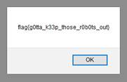</span></p>

<span lang=HE dir=RTL style='font-size:11.0pt;line-height:107%;font-family:
"Arial",sans-serif'><br clear=all style='page-break-before:always'>
</span>

<p class=MsoNormal><span lang=HE dir=RTL style='font-size:13.0pt;line-height:
107%;font-family:"Times New Roman",serif;color:#2F5496'>&nbsp;</span></p>

<h2 dir=RTL style='text-align:right;direction:rtl;unicode-bidi:embed'><span
lang=HE style='font-family:"Times New Roman",serif'>אתגר 2 </span><span
lang=HE style='font-family:"Arial",sans-serif'>–</span><span lang=HE
style='font-family:"Times New Roman",serif'> </span><span lang=en-IL dir=LTR>Diego's
Gallery</span><span dir=RTL></span><span lang=HE style='font-family:"Times New Roman",serif'><span
dir=RTL></span> (קטגוריית </span><span lang=EN-US dir=LTR>Web</span><span
dir=RTL></span><span lang=HE style='font-family:"Times New Roman",serif'><span
dir=RTL></span>, 20 נקודות)</span></h2>

<p class=MsoNormal dir=RTL style='text-align:right;direction:rtl;unicode-bidi:
embed'><span lang=HE style='font-family:"Arial",sans-serif'>&nbsp;</span></p>

<p class=MsoNormal dir=RTL style='text-align:right;direction:rtl;unicode-bidi:
embed'><span lang=HE style='font-family:"Arial",sans-serif'>הוראות האתגר:</span></p>

```
Diego's Gallery
Recently I've been developing a platform to manage my cat's photos and keep my flag.txt safe. Please check out my beta
To avoid security loop holes such as SQL injections I developed my own scheme.
  
Every line in my DB look's like this:
 
> START|||username|||password|||role|||END
 
So for example:
 
> START|||diego|||catnip|||admin|||END
> START|||joe|||1234567|||user|||END
```

<p class=MsoNormal dir=RTL style='text-align:right;direction:rtl;unicode-bidi:
embed'><span lang=HE style='font-family:"Arial",sans-serif'>&nbsp;</span></p>

<p class=MsoNormal dir=RTL style='text-align:right;direction:rtl;unicode-bidi:
embed'><span lang=HE style='font-family:"Arial",sans-serif'>האתר מכיל טופס
התחברות פשוט:</span></p>

<p class=MsoNormal align=right dir=RTL style='text-align:left;direction:rtl;
unicode-bidi:embed'><span lang=en-IL dir=LTR>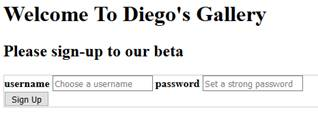</span></p>

<p class=MsoNormal dir=RTL style='text-align:right;direction:rtl;unicode-bidi:
embed'><span lang=HE style='font-family:"Arial",sans-serif'>כמו ב-</span><span
lang=EN-US dir=LTR>SQL Injection</span><span dir=RTL></span><span lang=HE
style='font-family:"Arial",sans-serif'><span dir=RTL></span> בסיסי, נרצה להכניס
קלט באחד השדות שישפיע על התחביר במקום רק על הנתונים.</span></p>

<p class=MsoNormal dir=RTL style='text-align:right;direction:rtl;unicode-bidi:
embed'><span lang=HE style='font-family:"Arial",sans-serif'>למשל, אם במקום הסיסמא,
נכניס:</span></p>

<p class=MsoNormal><b><span lang=EN-US style='font-family:"Courier New";
color:#538135'>some_password|||admin|||END</span></b></p>

<p class=MsoNormal dir=RTL style='text-align:right;direction:rtl;unicode-bidi:
embed'><span lang=HE style='font-family:"Arial",sans-serif'>התחביר הסופי יהיה:</span></p>

<p class=MsoNormal><span lang=en-IL style='font-family:"Courier New"'>START|||</span><span
lang=EN-US style='font-family:"Courier New"'>some_</span><span lang=en-IL
style='font-family:"Courier New"'>username|||</span><b><span lang=EN-US
style='font-family:"Courier New";color:#538135'>some_password|||admin|||END</span></b><span
lang=en-IL style='font-family:"Courier New"'>|||</span><span lang=EN-US
style='font-family:"Courier New"'>user</span><span lang=en-IL style='font-family:
"Courier New"'>|||END</span></p>

<p class=MsoNormal dir=RTL style='text-align:right;direction:rtl;unicode-bidi:
embed'><span lang=HE style='font-family:"Arial",sans-serif'>וכך נצליח לגרום
לקוד לחשוב שהמשתמש שלנו הוא מנהל, ונקבל גישה לדף הניהול:</span></p>

<p class=MsoNormal dir=RTL style='text-align:right;direction:rtl;unicode-bidi:
embed'><span lang=HE style='font-family:"Arial",sans-serif'>&nbsp;</span></p>

<p class=MsoNormal align=right dir=RTL style='text-align:left;direction:rtl;
unicode-bidi:embed'><span lang=en-IL dir=LTR>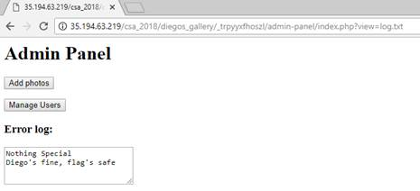</span></p>

<p class=MsoNormal dir=RTL style='text-align:right;direction:rtl;unicode-bidi:
embed'><span lang=HE style='font-family:"Arial",sans-serif'>כפתורי הניהול לא
עושים שום דבר מעניין, אך שימו לב לשורת הכתובות:</span></p>

<p class=MsoNormal><span lang=EN-US>http://35.194.63.219/csa_2018/diegos_gallery/_trpyyxfhoszl/admin-panel/index.php?view=log.txt</span></p>

<p class=MsoNormal dir=RTL style='text-align:right;direction:rtl;unicode-bidi:
embed'><span lang=HE style='font-family:"Arial",sans-serif'>הקובץ </span><span
lang=EN-US dir=LTR>index.php</span><span dir=RTL></span><span lang=HE
style='font-family:"Arial",sans-serif'><span dir=RTL></span> מקבל כפרמטר שם של
קובץ ומציג את התוכן שלו. </span></p>

<p class=MsoNormal dir=RTL style='text-align:right;direction:rtl;unicode-bidi:
embed'><span lang=HE style='font-family:"Arial",sans-serif'>מה יקרה אם במקום </span><span
lang=EN-US dir=LTR>log.txt</span><span dir=RTL></span><span lang=HE
style='font-family:"Arial",sans-serif'><span dir=RTL></span> נבקש קובץ אחר,
למשל </span><span lang=EN-US dir=LTR>flag.txt</span><span dir=RTL></span><span
lang=HE style='font-family:"Arial",sans-serif'><span dir=RTL></span>?</span></p>

<p class=MsoNormal align=right dir=RTL style='text-align:left;direction:rtl;
unicode-bidi:embed'><span lang=en-IL dir=LTR>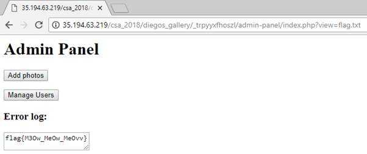</span></p>

<span lang=HE dir=RTL style='font-size:11.0pt;line-height:107%;font-family:
"Arial",sans-serif'><br clear=all style='page-break-before:always'>
</span>

<p class=MsoNormal><span lang=HE dir=RTL style='font-family:"Arial",sans-serif'>&nbsp;</span></p>

<h2 dir=RTL style='text-align:right;direction:rtl;unicode-bidi:embed'><span
lang=HE style='font-family:"Times New Roman",serif'>אתגר 3 </span><span
lang=HE style='font-family:"Arial",sans-serif'>–</span><span lang=HE
style='font-family:"Times New Roman",serif'> </span><span lang=EN-US dir=LTR>Careful
Steps</span><span dir=RTL></span><span lang=HE style='font-family:"Times New Roman",serif'><span
dir=RTL></span> (קטגוריית </span><span lang=EN-US dir=LTR>Programming</span><span
dir=RTL></span><span lang=HE style='font-family:"Times New Roman",serif'><span
dir=RTL></span>, 20 נקודות)</span></h2>

<p class=MsoNormal dir=RTL style='text-align:right;direction:rtl;unicode-bidi:
embed'><span lang=HE style='font-family:"Arial",sans-serif'>&nbsp;</span></p>

<p class=MsoNormal dir=RTL style='text-align:right;direction:rtl;unicode-bidi:
embed'><span lang=HE style='font-family:"Arial",sans-serif'>הוראות האתגר:</span></p>

```
This is a bunch of archives we've found and we believe a secret flag is somehow hidden inside them.

We're pretty sure the information we're looking for is in the comments section of each file.

Can you step carefully between the files and get the flag?

Good luck!
```

<p class=MsoNormal dir=RTL style='text-align:right;direction:rtl;unicode-bidi:
embed'><span lang=HE style='font-family:"Arial",sans-serif'>&nbsp;</span></p>

<p class=MsoNormal dir=RTL style='text-align:right;direction:rtl;unicode-bidi:
embed'><span lang=HE style='font-family:"Arial",sans-serif'>קובץ הארכיון מכיל 2000
קבצים, החל מ-</span><span lang=EN-US dir=LTR style='font-family:"Courier New"'>unzipme.0</span><span
dir=RTL></span><span lang=HE style='font-family:"Arial",sans-serif'><span
dir=RTL></span> ועד ל-</span><span lang=EN-US dir=LTR style='font-family:"Courier New"'>unzipme.1999</span><span
dir=RTL></span><span lang=HE style='font-family:"Arial",sans-serif'><span
dir=RTL></span>.</span></p>

<p class=MsoNormal dir=RTL style='text-align:right;direction:rtl;unicode-bidi:
embed'><span lang=HE style='font-family:"Arial",sans-serif'>שימוש בפקודת </span><span
lang=EN-US dir=LTR style='font-family:"Courier New"'>file</span><span dir=RTL></span><span
lang=EN-US style='font-family:"Arial",sans-serif'><span dir=RTL></span> </span><span
lang=HE style='font-family:"Arial",sans-serif'>מראה שמדובר באוסף של קבצי </span><span
lang=EN-US dir=LTR>RAR</span><span dir=RTL></span><span lang=HE
style='font-family:"Arial",sans-serif'><span dir=RTL></span> ו-</span><span
lang=EN-US dir=LTR>ZIP</span><span dir=RTL></span><span lang=HE
style='font-family:"Arial",sans-serif'><span dir=RTL></span>:</span></p>

<p class=MsoNormal align=center dir=RTL style='text-align:center;direction:
rtl;unicode-bidi:embed'><span lang=en-IL dir=LTR>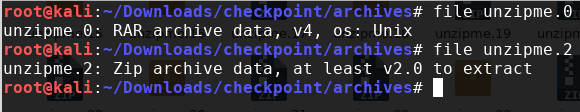</span></p>

<p class=MsoNormal dir=RTL style='text-align:right;direction:rtl;unicode-bidi:
embed'><span lang=HE style='font-family:"Arial",sans-serif'>התוכן לא נראה
מעניין כל כך, מה אבל ההוראות שלחו אותנו להערות (שני הפורמטים תומכים בהוספת
הערות לקובץ הארכיון). </span></p>

<p class=MsoNormal dir=RTL style='text-align:right;direction:rtl;unicode-bidi:
embed'><span lang=HE style='font-family:"Arial",sans-serif'>אפשר לראות הערה של
קובץ </span><span lang=EN-US dir=LTR>ZIP</span><span dir=RTL></span><span
lang=HE style='font-family:"Arial",sans-serif'><span dir=RTL></span> באמצעות
פקודת </span><span lang=EN-US dir=LTR style='font-family:"Courier New"'>unzip
-z</span><span dir=RTL></span><span lang=HE style='font-family:"Arial",sans-serif'><span
dir=RTL></span>:</span></p>

<p class=MsoNormal align=right dir=RTL style='text-align:left;direction:rtl;
unicode-bidi:embed'><span lang=en-IL dir=LTR>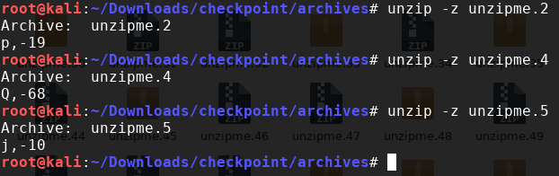</span></p>

<p class=MsoNormal dir=RTL style='text-align:right;direction:rtl;unicode-bidi:
embed'><span lang=HE style='font-family:"Arial",sans-serif'>נראה שכל הערה כוללת
אות, ומספר. ננסה להתייחס אל המספר בתור הוראות לאיזה קובץ לקפוץ בצעד הבא, ואל
האות בתור חלק מהדגל.</span></p>

<span lang=HE dir=RTL style='font-size:11.0pt;line-height:107%;font-family:
"Arial",sans-serif'><br clear=all style='page-break-before:always'>
</span>

<p class=MsoNormal><span lang=HE dir=RTL style='font-family:"Arial",sans-serif'>&nbsp;</span></p>

<p class=MsoNormal dir=RTL style='text-align:right;direction:rtl;unicode-bidi:
embed'><span lang=HE style='font-family:"Arial",sans-serif'>לשם כך נוכל להשתמש
בסקריפט הבא:</span></p>

```python
import os
import zipfile
import rarfile
import sys
 
 
print ("Reading comments...")
listOfFiles = sorted(os.listdir('archives'))
comments = {}
for file_name in listOfFiles:
    try:
        with zipfile.ZipFile('archives/' + file_name) as zf:
            comment = zf.comment.decode("utf-8")
    except zipfile.BadZipFile:
        try:
            with rarfile.RarFile('archives/' + file_name) as rf:
                comment = rf.comment
        except e:
            raise e
    #print ("{}\t{}".format(file_name, comment))
    comments[int(file_name.replace("unzipme.", ""))] = comment.rstrip()
 
print ("Following trail...")
current_index = 0
new_offset = 0
while True:
    current_index = current_index + new_offset
    #print ("Trying to access {}".format(current_index + new_offset))
   
    current = comments[current_index]
    char, new_offset = current.split(",")
    new_offset = int(new_offset)
    #print ("{}, {}".format(char, new_offset))
    sys.stdout.write(char)
 
    if new_offset == 0:
        break
```

<p class=MsoNormal dir=RTL style='text-align:right;direction:rtl;unicode-bidi:
embed'><span lang=HE style='font-family:"Arial",sans-serif'>&nbsp;</span></p>

<p class=MsoNormal dir=RTL style='text-align:right;direction:rtl;unicode-bidi:
embed'><span lang=HE style='font-family:"Arial",sans-serif'>החלק הראשון קורא את
כל ההערות, והחלק השני עוקב אחרי הצעדים בהערות ומדפיס את התווים המתאימים.</span></p>

<p class=MsoNormal dir=RTL style='text-align:right;direction:rtl;unicode-bidi:
embed'><span lang=HE style='font-family:"Arial",sans-serif'>אם נריץ את הסקריפט,
נקבל:</span></p>

<p class=MsoNormal dir=RTL style='text-align:right;direction:rtl;unicode-bidi:
embed'><span lang=en-IL dir=LTR>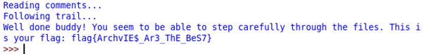</span></p>

<span lang=HE dir=RTL style='font-size:11.0pt;line-height:107%;font-family:
"Arial",sans-serif'><br clear=all style='page-break-before:always'>
</span>

<p class=MsoNormal><span lang=HE dir=RTL style='font-family:"Arial",sans-serif'>&nbsp;</span></p>

<h2 dir=RTL style='text-align:right;direction:rtl;unicode-bidi:embed'><span
lang=HE style='font-family:"Times New Roman",serif'>אתגר 4 </span><span
lang=HE style='font-family:"Arial",sans-serif'>–</span><span lang=HE
style='font-family:"Times New Roman",serif'> </span><span lang=EN-US dir=LTR>Ping
Pong</span><span dir=RTL></span><span lang=HE style='font-family:"Times New Roman",serif'><span
dir=RTL></span> (קטגוריית </span><span lang=EN-US dir=LTR>Networking</span><span
dir=RTL></span><span lang=HE style='font-family:"Times New Roman",serif'><span
dir=RTL></span>, 25 נקודות)</span></h2>

<p class=MsoNormal dir=RTL style='text-align:right;direction:rtl;unicode-bidi:
embed'><span lang=HE style='font-family:"Arial",sans-serif'>&nbsp;</span></p>

<p class=MsoNormal dir=RTL style='text-align:right;direction:rtl;unicode-bidi:
embed'><span lang=HE style='font-family:"Arial",sans-serif'>הוראות האתגר:</span></p>

```
I bet you're not fast enough to defeat me. I'm at:
nc 35.157.111.68 10140
```

<p class=MsoNormal dir=RTL style='text-align:right;direction:rtl;unicode-bidi:
embed'><span lang=HE style='font-family:"Arial",sans-serif'>&nbsp;</span></p>

<p class=MsoNormal dir=RTL style='text-align:right;direction:rtl;unicode-bidi:
embed'><span lang=HE style='font-family:"Arial",sans-serif'>נתחבר לשרת:</span></p>

<p class=MsoNormal align=right dir=RTL style='text-align:left;direction:rtl;
unicode-bidi:embed'><span lang=en-IL dir=LTR>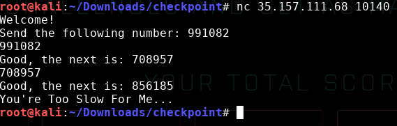</span></p>

<p class=MsoNormal dir=RTL style='text-align:right;direction:rtl;unicode-bidi:
embed'><span lang=HE style='font-family:"Arial",sans-serif'>השרת מבקש שנשלח לו
מספר אקראי כלשהי. כאשר אנו עושים זאת, הוא מבקש מספר אחר. אם התגובה איטית מדי,
השרת סוגר את החיבור.</span></p>

<p class=MsoNormal dir=RTL style='text-align:right;direction:rtl;unicode-bidi:
embed'><span lang=HE style='font-family:"Arial",sans-serif'>כמובן שאנחנו לא רוצים
לשלוח תשובות ידנית ולכן נכתוב סקריפט שעושה זאת עבורנו:</span></p>

```python
import socket
import time
import re


s = socket.socket()         

reg = re.compile('^.+: ([\d]+)\n$')

try:
    port = 10140              

    s.connect(('35.157.111.68', port))

    start_time = time.time()
    print (s.recv(9)) #Read the "Welcome!\n"
    while True:
        msg = (s.recv(1024)).decode("utf-8")
        print (msg)
        match = reg.match(msg)
        if match:
            num = match.group(1)
            print (num)
            s.send(str.encode(num + "\n"))
        else:
            break
    print("--- %s seconds ---" % (time.time() - start_time))
    
            
except:
    raise
finally:
    s.close()    
```

<p class=MsoNormal dir=RTL style='text-align:right;direction:rtl;unicode-bidi:
embed'><span lang=HE style='font-family:"Arial",sans-serif'>הסקריפט משתמש
בביטוי רגולרי כדי לחלץ את המספר ואז שולח אותו חזרה אל השרת:</span></p>

```python
re.compile('^.+:([\d]+)\n$')
```

<p class=MsoNormal dir=RTL style='text-align:right;direction:rtl;unicode-bidi:
embed'><span lang=HE style='font-family:"Arial",sans-serif'>הביטוי הזה מתאים
לשורה שמתחילה בכל תו (</span><span lang=HE style='font-family:"Courier New"'>.</span><span
lang=HE style='font-family:"Arial",sans-serif'>) שמופיע פעם אחת או יותר (</span><span
lang=HE style='font-family:"Courier New"'>+</span><span lang=HE
style='font-family:"Arial",sans-serif'>) כאשר לאחר מכן צריכות להופיע נקודתיים (</span><span
lang=HE style='font-family:"Courier New"'>:</span><span lang=HE
style='font-family:"Arial",sans-serif'>) ואז רווח ( ), ספרה אחת או יותר (</span><a
name="_Hlk518599576"><span dir=LTR></span><span lang=EN-US dir=LTR
style='font-family:"Courier New"'><span dir=LTR></span>[\d]+</span></a><span
dir=RTL></span><span lang=HE style='font-family:"Arial",sans-serif'><span
dir=RTL></span>) וירידת שורה (</span><span dir=LTR></span><span lang=EN-US
dir=LTR style='font-family:"Courier New"'><span dir=LTR></span>\n</span><span
dir=RTL></span><span lang=HE style='font-family:"Arial",sans-serif'><span
dir=RTL></span>). הסימנים &quot;</span><span lang=HE style='font-family:"Courier New"'>^</span><span
lang=HE style='font-family:"Arial",sans-serif'>&quot; ו&quot;</span><span
lang=HE style='font-family:"Courier New"'>$</span><span lang=HE
style='font-family:"Arial",sans-serif'>&quot; מסמלים תחילת וסוף שורה, והסוגריים
מסביב ל-&quot;</span><span dir=LTR></span><span lang=EN-US dir=LTR
style='font-family:"Courier New"'><span dir=LTR></span>[\d]+</span><span
dir=RTL></span><span lang=HE style='font-family:"Arial",sans-serif'><span
dir=RTL></span>&quot; מסמנים שזהו הביטוי שנרצה לחלץ.</span></p>

<p class=MsoNormal dir=RTL style='text-align:right;direction:rtl;unicode-bidi:
embed'><span lang=HE style='font-family:"Arial",sans-serif'>את הביטוי אנחנו
מקמפלים מראש כדי להשיג ריצה יעילה יותר.</span></p>

<p class=MsoNormal dir=RTL style='text-align:right;direction:rtl;unicode-bidi:
embed'><span lang=HE style='font-family:"Arial",sans-serif'>נריץ את הסקריפט
ונקבל:</span></p>

<p class=MsoNormal align=right dir=RTL style='text-align:left;direction:rtl;
unicode-bidi:embed'><span lang=en-IL dir=LTR>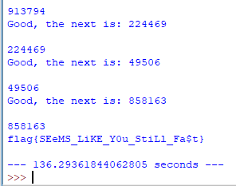</span></p>

<p class=MsoNormal dir=RTL style='text-align:right;direction:rtl;unicode-bidi:
embed'><span lang=HE style='font-family:"Arial",sans-serif'>&nbsp;</span></p>

<p class=MsoNormal dir=RTL style='text-align:right;direction:rtl;unicode-bidi:
embed'><span lang=HE style='font-family:"Arial",sans-serif'>בדיעבד, מכיוון
שאנחנו יודעים שהשרת תמיד מחזיר את אותה תשובה, היה אפשר לוותר על הביטוי הרגולרי
ולחסוך כמה שניות (במחיר של קריאות וגמישות) על ידי דילוג על &quot;</span><span
lang=EN-US dir=LTR>Good, the next is: </span><span dir=RTL></span><span
lang=HE style='font-family:"Arial",sans-serif'><span dir=RTL></span>&quot; וקפיצה
ישירה אל המספר שצריך להחזיר (במילים אחרות, נראה שהמספר תמיד מתחיל באותו </span><span
lang=EN-US dir=LTR>offset</span><span dir=RTL></span><span lang=HE
style='font-family:"Arial",sans-serif'><span dir=RTL></span> מתחילת השורה).</span></p>

<span lang=HE dir=RTL style='font-size:11.0pt;line-height:107%;font-family:
"Arial",sans-serif'><br clear=all style='page-break-before:always'>
</span>

<p class=MsoNormal><span lang=HE dir=RTL style='font-family:"Arial",sans-serif'>&nbsp;</span></p>

<h2 dir=RTL style='text-align:right;direction:rtl;unicode-bidi:embed'><span
lang=HE style='font-family:"Times New Roman",serif'>אתגר </span><span dir=LTR></span><span
lang=EN-US dir=LTR><span dir=LTR></span>5</span><span dir=RTL></span><span
lang=EN-US style='font-family:"Times New Roman",serif'><span dir=RTL></span> </span><span
lang=HE style='font-family:"Arial",sans-serif'>–</span><span lang=HE
style='font-family:"Times New Roman",serif'> </span><span lang=EN-US dir=LTR>Protocol</span><span
dir=RTL></span><span lang=HE style='font-family:"Times New Roman",serif'><span
dir=RTL></span> (קטגוריית </span><span lang=EN-US dir=LTR>Networking</span><span
dir=RTL></span><span lang=HE style='font-family:"Times New Roman",serif'><span
dir=RTL></span>, </span><span dir=LTR></span><span lang=EN-US dir=LTR><span
dir=LTR></span>30</span><span dir=RTL></span><span lang=HE style='font-family:
"Times New Roman",serif'><span dir=RTL></span> נקודות)</span></h2>

<p class=MsoNormal dir=RTL style='text-align:right;direction:rtl;unicode-bidi:
embed'><span lang=HE style='font-family:"Arial",sans-serif'>&nbsp;</span></p>

<p class=MsoNormal dir=RTL style='text-align:right;direction:rtl;unicode-bidi:
embed'><span lang=HE style='font-family:"Arial",sans-serif'>הוראות האתגר:</span></p>

```
Hi there!

We need to extract secret data from a special file server.

We don't have much details about this server, but we did manage to intercept traffic containing communication with the server.

We also know that this secret file's path is: /usr/7Op_sECreT.txt

You can find the sniff file here.

Please tell us what the secret is!

Good luck!
```

<p class=MsoNormal dir=RTL style='text-align:right;direction:rtl;unicode-bidi:
embed'><span lang=HE style='font-family:"Arial",sans-serif'>&nbsp;</span></p>

<p class=MsoNormal dir=RTL style='text-align:right;direction:rtl;unicode-bidi:
embed'><span lang=HE style='font-family:"Arial",sans-serif'>הקובץ שמתקבל הוא
קובץ </span><span lang=EN-US dir=LTR>pcap</span><span dir=RTL></span><span
lang=HE style='font-family:"Arial",sans-serif'><span dir=RTL></span> שמשמש
להצגת תעבורת רשת וניתן לפתיחה באמצעות תוכנת </span><span lang=EN-US dir=LTR>WireShark</span><span
dir=RTL></span><span lang=HE style='font-family:"Arial",sans-serif'><span
dir=RTL></span>.</span></p>

<p class=MsoNormal align=center dir=RTL style='text-align:center;direction:
rtl;unicode-bidi:embed'><span lang=en-IL dir=LTR>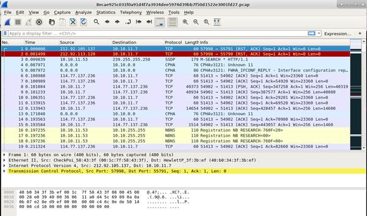</span></p>

<p class=MsoNormal dir=RTL style='text-align:right;direction:rtl;unicode-bidi:
embed'><span lang=HE style='font-family:"Arial",sans-serif'>מעבר זריז על
ההודעות השונות ועיון ב-</span><span lang=EN-US dir=LTR>payload</span><span
dir=RTL></span><span lang=HE style='font-family:"Arial",sans-serif'><span
dir=RTL></span> מגלה הודעה מעניינת:</span></p>

<p class=MsoNormal dir=RTL style='text-align:right;direction:rtl;unicode-bidi:
embed'><span lang=en-IL dir=LTR>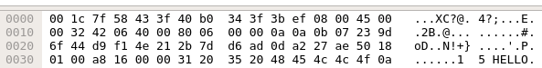</span></p>

<p class=MsoNormal dir=RTL style='text-align:right;direction:rtl;unicode-bidi:
embed'><span lang=HE style='font-family:"Arial",sans-serif'>ה-</span><span
lang=EN-US dir=LTR>HELLO</span><span dir=RTL></span><span lang=HE
style='font-family:"Arial",sans-serif'><span dir=RTL></span> קופץ מיד לעין.</span></p>

<p class=MsoNormal dir=RTL style='text-align:right;direction:rtl;unicode-bidi:
embed'><span lang=HE style='font-family:"Arial",sans-serif'>ניתן לעקוב אחרי כל
ההודעות של החיבור הזה באמצעות קליק ימני ובחירה ב-</span><span lang=EN-US
dir=LTR>Follow TCP Stream</span><span dir=RTL></span><span lang=HE
style='font-family:"Arial",sans-serif'><span dir=RTL></span>:</span></p>

<p class=MsoNormal dir=RTL style='text-align:right;direction:rtl;unicode-bidi:
embed'><span lang=en-IL dir=LTR></span></p>

<p class=MsoNormal dir=RTL style='text-align:right;direction:rtl;unicode-bidi:
embed'><span lang=HE style='font-family:"Arial",sans-serif'>&nbsp;</span></p>

<p class=MsoNormal dir=RTL style='text-align:right;direction:rtl;unicode-bidi:
embed'><span lang=HE style='font-family:"Arial",sans-serif'>נראה שמדובר
בפרוטוקול בסיסי שבו המשתמש מבקש קובץ ומקבל אותו מקודד. ה-</span><span
lang=EN-US dir=LTR>XOR</span><span dir=RTL></span><span lang=HE
style='font-family:"Arial",sans-serif'><span dir=RTL></span> במהלך ההתקשרות
מרמז שכנראה צריך להפעיל פעולת </span><span lang=EN-US dir=LTR>XOR</span><span
dir=RTL></span><span lang=HE style='font-family:"Arial",sans-serif'><span
dir=RTL></span> באמצעות המפתח שמתקבל מהשרת על תוכן הקובץ כדי לקבל את ה-</span><span
lang=EN-US dir=LTR>plaintext</span><span dir=RTL></span><span lang=HE
style='font-family:"Arial",sans-serif'><span dir=RTL></span>.</span></p>

<p class=MsoNormal dir=RTL style='text-align:right;direction:rtl;unicode-bidi:
embed'><span lang=HE style='font-family:"Arial",sans-serif'>ננסה לחקות את
הפרוטוקול בעצמנו</span><span dir=LTR></span><span lang=HE dir=LTR><span
dir=LTR></span> </span><span dir=RTL></span><span lang=HE style='font-family:
"Arial",sans-serif'><span dir=RTL></span> (הקוד מצורף בשלמותו בעמוד הבא) ונקבל
את התוצאה הבאה:</span></p>

<p class=MsoNormal align=right dir=RTL style='text-align:left;direction:rtl;
unicode-bidi:embed'><span dir=LTR></span><span lang=HE dir=LTR><span dir=LTR></span> </span><span
lang=en-IL dir=LTR>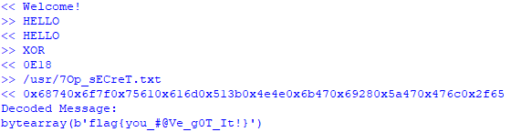</span></p>

<p class=MsoNormal dir=RTL style='text-align:right;direction:rtl;unicode-bidi:
embed'><span lang=HE style='font-family:"Arial",sans-serif'>&nbsp;</span></p>

<p class=MsoNormal dir=RTL style='text-align:right;direction:rtl;unicode-bidi:
embed'><span lang=HE style='font-family:"Arial",sans-serif'>את הקוד אפשר לכתוב
בצורה הרבה יותר קצרה, אבל זאת הזדמנות טובה לראות </span><span lang=EN-US
dir=LTR>Context Manager</span><span dir=RTL></span><span lang=HE
style='font-family:"Arial",sans-serif'><span dir=RTL></span> בפעולה על מנת
לשלוט בצורה נקייה בפתיחה ובסגירה של ה-</span><span lang=EN-US dir=LTR>Socket</span><span
dir=RTL></span><span lang=HE style='font-family:"Arial",sans-serif'><span
dir=RTL></span>.</span></p>

<p class=MsoNormal dir=RTL style='text-align:right;direction:rtl;unicode-bidi:
embed'><span lang=HE style='font-family:"Arial",sans-serif'>מחלקת </span><span
lang=EN-US dir=LTR>Protocol</span><span dir=RTL></span><span lang=HE
style='font-family:"Arial",sans-serif'><span dir=RTL></span> מממשת את פרוטוקול
התקשורת עם השרת (עם כמה הנחות בפונקציית </span><span lang=EN-US dir=LTR>recv</span><span
dir=RTL></span><span lang=HE style='font-family:"Arial",sans-serif'><span
dir=RTL></span>). פונקציית </span><span lang=EN-US dir=LTR>decode_msg</span><span
dir=RTL></span><span lang=HE style='font-family:"Arial",sans-serif'><span
dir=RTL></span> מפענחת את ההודעה על ידי מעבר על ההודעה בחלקים (כל חלק הוא שישה
בתים – תחילית של </span><span dir=LTR></span><span lang=EN-US dir=LTR><span
dir=LTR></span>0x</span><span dir=RTL></span><span lang=HE style='font-family:
"Arial",sans-serif'><span dir=RTL></span> וארבעה בתים של מידע) וביצוע </span><span
lang=EN-US dir=LTR>XOR</span><span dir=RTL></span><span lang=HE
style='font-family:"Arial",sans-serif'><span dir=RTL></span> עם המפתח שהתקבל
בשלב הקודם.</span></p>

```python
import socket, re

class Protocol(object):
    def __init__(self, ip, port):
        self.ip = ip
        self.port = port
        self.msg_id = 0
        self.recv_reg = 
           re.compile('^(?P<id>\d+) (?P<len>\d+) (?P<payload>.+)$')

    def __enter__(self):
        self.socket = socket.socket()
        self.socket.connect((self.ip, self.port))
        return self

    def __exit__(self, *args):
        self.socket.close()

    def log(self, msg):
        print(msg)

    def send(self, msg):
        self.log(">> {}".format(msg))
        self.msg_id += 1
        full_msg = "{} {} {}\n".format(self.msg_id, len(msg), msg)
        self.socket.send(full_msg.encode('UTF-8'))

    def recv(self):
        msg = self.socket.recv(1024)
        match = self.recv_reg.match(msg.decode('UTF-8'))
        if match:
            assert(int(match.group("id")) == self.msg_id)
            assert(int(match.group("len")) == len(match.group("payload")))
            self.log("<< {}".format(match.group("payload")))
            return match.group("payload")
        raise Exception("Unexpected format: {}".format(msg))

    def decode_msg(self, xor, msg):
        chunk_len = len("0x") + len(xor)
        frame = bytearray()
        for i in range(0, len(msg), chunk_len):
            s = msg[i:i + chunk_len]
            chunk_val = int(s, 16)
            after_xor = (chunk_val ^ int(xor, 16))
            for b in (after_xor.to_bytes(len(xor) // 2,
                                       byteorder='big',
                                       signed=True) ):
                frame.append(b)
        return frame
        
with Protocol('35.157.111.68', 20001) as p:
    msg = p.recv()
    assert(msg == "Welcome!")
    p.send("HELLO")
    msg = p.recv()
    assert(msg == "HELLO")
    p.send("XOR")
    xor_val = p.recv()
    p.send("/usr/7Op_sECreT.txt")
    encrypted_file = p.recv()
    print ("Decoded Message:")
    print (p.decode_msg(xor_val, encrypted_file))
```

<h2 dir=RTL style='text-align:right;direction:rtl;unicode-bidi:embed'><span
lang=HE style='font-family:"Times New Roman",serif'>אתגר 6 </span><span
lang=HE style='font-family:"Arial",sans-serif'>–</span><span lang=HE
style='font-family:"Times New Roman",serif'> </span><span lang=EN-US dir=LTR>PNG++</span><span
dir=RTL></span><span lang=HE style='font-family:"Times New Roman",serif'><span
dir=RTL></span> (קטגוריית </span><span lang=EN-US dir=LTR>Logic</span><span
dir=RTL></span><span lang=HE style='font-family:"Times New Roman",serif'><span
dir=RTL></span>, </span><span dir=LTR></span><span lang=EN-US dir=LTR><span
dir=LTR></span>30</span><span dir=RTL></span><span lang=HE style='font-family:
"Times New Roman",serif'><span dir=RTL></span> נקודות)</span></h2>

<p class=MsoNormal dir=RTL style='text-align:right;direction:rtl;unicode-bidi:
embed'><span lang=EN-US dir=LTR>&nbsp;</span></p>

<p class=MsoNormal dir=RTL style='text-align:right;direction:rtl;unicode-bidi:
embed'><span lang=HE style='font-family:"Arial",sans-serif'>הוראות האתגר:</span></p>

```
This image was encrypted using a custom cipher.
We managed to get most of its code here
Unfortunately, while moving things around, someone spilled coffee all over key_transformator.py.
Can you help us decrypt the image?
```

<p class=MsoNormal dir=RTL style='text-align:right;direction:rtl;unicode-bidi:
embed'><span lang=HE style='font-family:"Arial",sans-serif'>הקוד להצפנת התמונה
הוא:</span></p>

```python
import key_transformator
import random
import string

key_length = 4

def generate_initial_key():
    return ''.join(random.choice(string.ascii_uppercase) for _ in range(4))

def xor(s1, s2):
    res = [chr(0)]*key_length
    for i in range(len(res)):
        q = ord(s1[i])
        d = ord(s2[i])
        k = q ^ d
        res[i] = chr(k)
    res = ''.join(res)
    return res

def add_padding(img):
    l = key_length - len(img)%key_length
    img += chr(l)*l
    return img

with open('flag.png', 'rb') as f:
    img = f.read()

img = add_padding(img)
key = generate_initial_key()

enc_data = ''
for i in range(0, len(img), key_length):
    enc = xor(img[i:i+key_length], key)
    key = key_transformator.transform(key)
    enc_data += enc

with open('encrypted.png', 'wb') as f:
    f.write(enc_data)
```

<p class=MsoNormal dir=RTL style='text-align:right;direction:rtl;unicode-bidi:
embed'><span lang=HE style='font-family:"Arial",sans-serif'>כאשר אנחנו רואים
שראשית מוגרל מפתח של ארבעה בתים, ולאחר מכן הקוד עובר על תוכן התמונה ומבצע </span><span
lang=EN-US dir=LTR>XOR</span><span dir=RTL></span><span lang=HE
style='font-family:"Arial",sans-serif'><span dir=RTL></span> עם המפתח, מבצע
מניפולציה על המפתח וחוזר על הפעולה.</span></p>

<p class=MsoNormal dir=RTL style='text-align:right;direction:rtl;unicode-bidi:
embed'><span lang=HE style='font-family:"Arial",sans-serif'>התמונה עצמה נקראת </span><span
lang=EN-US dir=LTR>encrypted.png</span><span dir=RTL></span><span lang=HE
style='font-family:"Arial",sans-serif'><span dir=RTL></span> וכאשר מנסים לפתוח
אותה, מקבלים שגיאה שהקובץ אינו בפורמט המתאים.</span></p>

<p class=MsoNormal dir=RTL style='text-align:right;direction:rtl;unicode-bidi:
embed'><span lang=HE style='font-family:"Arial",sans-serif'>למזלנו, פורמט </span><span
lang=EN-US dir=LTR>PNG</span><span dir=RTL></span><span lang=HE
style='font-family:"Arial",sans-serif'><span dir=RTL></span> מכיל </span><span
lang=EN-US dir=LTR>Header</span><span dir=RTL></span><span lang=HE
style='font-family:"Arial",sans-serif'><span dir=RTL></span> ידוע מראש,
שבאמצעותו ניתן לנחש מהו מפתח ההצפנה.</span></p>

<p class=MsoNormal dir=RTL style='text-align:right;direction:rtl;unicode-bidi:
embed'><span lang=HE style='font-family:"Arial",sans-serif'>לפי </span><span
class=MsoHyperlink><span lang=EN-US><a
href="http://www.libpng.org/pub/png/spec/1.2/PNG-Structure.html"><span lang=HE
style='font-family:"Arial",sans-serif'>האתר הזה</span></a></span></span><span
lang=HE style='font-family:"Arial",sans-serif'>:</span></p>

<div align=right>

<table class=MsoTableGrid dir=rtl border=1 cellspacing=0 cellpadding=0
 style='border-collapse:collapse;border:none'>
 <tr>
  <td width=601 valign=top style='width:450.8pt;border:none;padding:0cm 5.4pt 0cm 5.4pt'>
  <p dir=LTR><span lang=en-IL>A PNG file consists of a PNG <em>signature</em>
  followed by a series of <em>chunks</em>. <br>
  </span><span lang=EN-US>…</span><span lang=EN-US> </span></p>
  <p dir=LTR><span lang=en-IL>The first eight bytes of a PNG file always
  contain the following (decimal) values: </span></p>
  <pre dir=LTR><span lang=en-IL>   137 80 78 71 13 10 26 10</span></pre>
  <p class=MsoNormal dir=RTL style='margin-bottom:0cm;margin-bottom:.0001pt;
  text-align:right;line-height:normal;direction:rtl;unicode-bidi:embed'><span
  lang=HE style='font-family:"Arial",sans-serif'>&nbsp;</span></p>
  </td>
 </tr>
</table>

</div>

<p class=MsoNormal dir=RTL style='text-align:right;direction:rtl;unicode-bidi:
embed'><span dir=RTL></span><span lang=en-IL style='font-family:"Arial",sans-serif'><span
dir=RTL></span> </span><span lang=HE style='font-family:"Arial",sans-serif'>נבדוק
את הקובץ שקיבלנו בעורך </span><span lang=EN-US dir=LTR>Hex</span><span dir=RTL></span><span
lang=HE style='font-family:"Arial",sans-serif'><span dir=RTL></span>:</span></p>

<p class=MsoNormal align=right dir=RTL style='text-align:left;direction:rtl;
unicode-bidi:embed'><span lang=en-IL dir=LTR>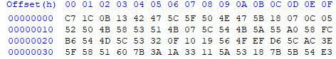</span></p>

<p class=MsoNormal dir=RTL style='text-align:right;direction:rtl;unicode-bidi:
embed'><span lang=HE style='font-family:"Arial",sans-serif'>על מנת לקבל את
המפתח המקורי, נבצע </span><span lang=EN-US dir=LTR>XOR</span><span dir=RTL></span><span
lang=HE style='font-family:"Arial",sans-serif'><span dir=RTL></span> שוב מול
הערך שאמור להיות שם לפי התקן:</span></p>

<p class=MsoNormal align=right dir=RTL style='text-align:left;direction:rtl;
unicode-bidi:embed'><span lang=en-IL dir=LTR>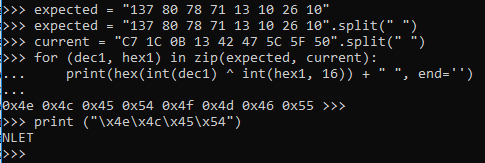</span></p>

<p class=MsoNormal dir=RTL style='text-align:right;direction:rtl;unicode-bidi:
embed'><span lang=HE style='font-family:"Arial",sans-serif'>נראה שהמפתח הוא </span><span
lang=EN-US dir=LTR>NLET</span><span dir=RTL></span><span lang=HE
style='font-family:"Arial",sans-serif'><span dir=RTL></span> (</span><span
dir=LTR></span><span lang=EN-US dir=LTR><span dir=LTR></span>0x4e 0x4c 0x45
0x54</span><span dir=RTL></span><span lang=HE style='font-family:"Arial",sans-serif'><span
dir=RTL></span>). אנחנו רואים גם שב-</span><span lang=EN-US dir=LTR>Chunk</span><span
dir=RTL></span><span lang=HE style='font-family:"Arial",sans-serif'><span
dir=RTL></span> הבא, המפתח הפך להיות </span><span dir=LTR></span><span
lang=EN-US dir=LTR><span dir=LTR></span>“0x4f 0x4d 0x46 0x55”</span><span
dir=RTL></span><span lang=HE style='font-family:"Arial",sans-serif'><span
dir=RTL></span>, כלומר קידמנו כל ערך ב-1. </span></p>

<p class=MsoNormal dir=RTL style='text-align:right;direction:rtl;unicode-bidi:
embed'><span lang=HE style='font-family:"Arial",sans-serif'>נבצע מספר שינויים
קלים בקוד ההצפנה על מנת לבצע פענוח:</span></p>

```python
# (Using original functions)

def transform(key):
    return "".join(map(lambda x: chr((ord(x)+1) % 256), key))

with open('encrypted.png', 'rb') as f:
    img = f.read()

key = "NLET"

dec_data = ''
for i in range(0, len(img), key_length):
    dec = xor(img[i:i+key_length], key)
    key = transform(key)
    dec_data += dec

with open('flag.png', 'wb') as f:
    f.write(dec_data)
```

<p class=MsoNormal dir=RTL style='text-align:right;direction:rtl;unicode-bidi:
embed'><span lang=HE style='font-family:"Arial",sans-serif'>והתוצאה:</span></p>

<p class=MsoNormal align=center dir=RTL style='text-align:center;direction:
rtl;unicode-bidi:embed'><span lang=en-IL dir=LTR>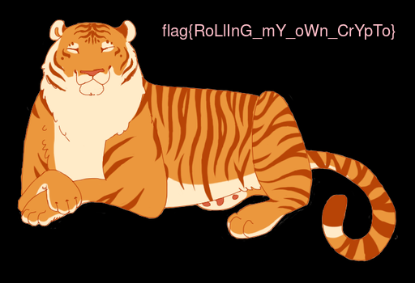</span></p>

<span lang=HE dir=RTL style='font-size:11.0pt;line-height:107%;font-family:
"Arial",sans-serif'><br clear=all style='page-break-before:always'>
</span>

<p class=MsoNormal><span lang=HE dir=RTL style='font-family:"Arial",sans-serif'>&nbsp;</span></p>

<h2 dir=RTL style='text-align:right;direction:rtl;unicode-bidi:embed'><span
lang=HE style='font-family:"Times New Roman",serif'>אתגר 7 </span><span
lang=HE style='font-family:"Arial",sans-serif'>–</span><span lang=HE
style='font-family:"Times New Roman",serif'> </span><span lang=EN-US dir=LTR>Test
my Patience</span><span dir=RTL></span><span lang=HE style='font-family:"Times New Roman",serif'><span
dir=RTL></span> (קטגוריית </span><span lang=EN-US dir=LTR>Surprise</span><span
dir=RTL></span><span lang=HE style='font-family:"Times New Roman",serif'><span
dir=RTL></span>, </span><span dir=LTR></span><span lang=EN-US dir=LTR><span
dir=LTR></span>50</span><span dir=RTL></span><span lang=HE style='font-family:
"Times New Roman",serif'><span dir=RTL></span> נקודות)</span></h2>

<p class=MsoNormal dir=RTL style='text-align:right;direction:rtl;unicode-bidi:
embed'><span lang=HE style='font-family:"Arial",sans-serif'>&nbsp;</span></p>

<p class=MsoNormal dir=RTL style='text-align:right;direction:rtl;unicode-bidi:
embed'><span lang=HE style='font-family:"Arial",sans-serif'>הוראות האתגר:</span></p>

```
Hi there,

We found This executable on the local watchmaker's computer.

It is rumored that somehow the watchmaker was the only person who succeeded to crack it.

Think you're as good as the watchmaker?

Note: This file is not malicious in any way
```

<p class=MsoNormal dir=RTL style='text-align:right;direction:rtl;unicode-bidi:
embed'><span lang=HE style='font-family:"Arial",sans-serif'>קודם כל, תמיד מרגיע
לראות הצהרה בסגנון &quot;קובץ זה אינו נוזקה&quot;. נשמע אמין. זה זמן טוב להזכיר
שבמסגרת אתגרים יוצא לא פעם להוריד קבצי הרצה, כלים, ספריות וכד' ומומלץ מאוד
להפעיל הכל בתוך מכונה וירטואלית, על כל צרה שלא תבוא.</span></p>

<p class=MsoNormal dir=RTL style='text-align:right;direction:rtl;unicode-bidi:
embed'><span lang=HE style='font-family:"Arial",sans-serif'>נריץ את הקובץ ונראה:</span></p>

<p class=MsoNormal align=right dir=RTL style='text-align:left;direction:rtl;
unicode-bidi:embed'><span lang=en-IL dir=LTR>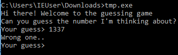</span></p>

<p class=MsoNormal align=right dir=RTL style='text-align:left;direction:rtl;
unicode-bidi:embed'><span lang=HE style='font-family:"Arial",sans-serif'>&nbsp;</span></p>

<p class=MsoNormal dir=RTL style='text-align:right;direction:rtl;unicode-bidi:
embed'><span lang=HE style='font-family:"Arial",sans-serif'>מדובר במשחק
ניחושים, התוכנה חושבת על מספר כלשהו ואנחנו צריכים לנחש מהו. אחרי מספר ניחושים
(ארוכים, קצרים, שליליים, לא חוקיים וכד') אפשר לראות שלעיתים לוקח לתוכנה יחסית
הרבה זמן להחזיר תשובה. יחד עם השם של האתגר, נראה שמדובר ב-</span><span
lang=EN-US dir=LTR>Timing Attack</span><span dir=RTL></span><span lang=HE
style='font-family:"Arial",sans-serif'><span dir=RTL></span>.</span></p>

<p class=MsoNormal dir=RTL style='text-align:right;direction:rtl;unicode-bidi:
embed'><span lang=HE style='font-family:"Arial",sans-serif'>הסבר קצר: כאשר
התוכנה בודקת את הניחוש, היא משווה אותו מול המספר הנבחר. אם הספרה הראשונה של
הניחוש שווה לספרה הראשונה של התשובה הנכונה, ההשוואה תקח קצת יותר זמן. כמובן
שבאתגרים מהסוג הזה, לעיתים מוסיפים השהייה מלאכותית כל מנת להקל על המדידה.</span></p>

<p class=MsoNormal dir=RTL style='text-align:right;direction:rtl;unicode-bidi:
embed'><span lang=HE style='font-family:"Arial",sans-serif'>נכתוב סקריפט שינסה
את כל הספרות 0-9, יבדוק מתי התוצאה חזרה הכי לאט, וימשיך לספרה הבאה.</span></p>

<p class=MsoNormal dir=RTL style='text-align:right;direction:rtl;unicode-bidi:
embed'><span lang=HE style='font-family:"Arial",sans-serif'>נריץ את הסקריפט
(הקוד המלא בדף הבא) ונקבל:</span></p>

<p class=MsoNormal align=right dir=RTL style='text-align:left;direction:rtl;
unicode-bidi:embed'><span lang=en-IL dir=LTR>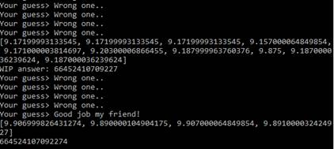</span></p>

<p class=MsoNormal dir=RTL style='text-align:right;direction:rtl;unicode-bidi:
embed'><span lang=HE style='font-family:"Arial",sans-serif'>&nbsp;</span></p>

<p class=MsoNormal dir=RTL style='text-align:right;direction:rtl;unicode-bidi:
embed'><span lang=HE style='font-family:"Arial",sans-serif'>הקוד:</span></p>

```python
from subprocess import Popen, PIPE
import time

p = Popen(['tmp.exe'], stdout=PIPE, stderr=PIPE, stdin=PIPE, shell=True)
print p.stdout.readline()
print p.stdout.readline()

answer = ""

searching = True
while searching:
    time_arr = []
    for i in xrange(10):
        start = time.time()
        p.stdin.write(answer + str(i))
        p.stdin.write("\n")
        line = p.stdout.readline()
        end = time.time()
        print line.rstrip()
        if not "Wrong" in line:
            answer += str(i)
            searching = False
            break
        time_arr.append(end-start)
    print time_arr
    if searching:
        answer += str(time_arr.index(max(time_arr)))
        print "WIP answer: {}".format(answer)
print answer
```

<span lang=HE dir=RTL style='font-size:11.0pt;line-height:107%;font-family:
"Arial",sans-serif'><br clear=all style='page-break-before:always'>
</span>

<p class=MsoNormal><span lang=HE dir=RTL style='font-family:"Arial",sans-serif'>&nbsp;</span></p>

<h2 dir=RTL style='text-align:right;direction:rtl;unicode-bidi:embed'><span
lang=HE style='font-family:"Times New Roman",serif'>אתגר 8 </span><span
lang=HE style='font-family:"Arial",sans-serif'>–</span><span lang=HE
style='font-family:"Times New Roman",serif'> </span><span dir=LTR></span><span
lang=EN-US dir=LTR><span dir=LTR></span>0120343536</span><span dir=RTL></span><span
lang=HE style='font-family:"Times New Roman",serif'><span dir=RTL></span>
(קטגוריית </span><span lang=EN-US dir=LTR>Logic</span><span dir=RTL></span><span
lang=HE style='font-family:"Times New Roman",serif'><span dir=RTL></span>, </span><span
dir=LTR></span><span lang=EN-US dir=LTR><span dir=LTR></span>60</span><span
dir=RTL></span><span lang=HE style='font-family:"Times New Roman",serif'><span
dir=RTL></span> נקודות)</span></h2>

<p class=MsoNormal dir=RTL style='text-align:right;direction:rtl;unicode-bidi:
embed'><span lang=HE style='font-family:"Arial",sans-serif'>&nbsp;</span></p>

<p class=MsoNormal dir=RTL style='text-align:right;direction:rtl;unicode-bidi:
embed'><span lang=HE style='font-family:"Arial",sans-serif'>הוראות האתגר:</span></p>

```
flag{IAAAA_$AYP_%CP_C_WIIX_BYWAOX}
Not so fast...
They say the only place where flags come before work is the dictionary, ours is no different

Note: flag letters are all capital
```

<p class=MsoNormal dir=RTL style='text-align:right;direction:rtl;unicode-bidi:
embed'><span lang=HE style='font-family:"Arial",sans-serif'>&nbsp;</span></p>

<p class=MsoNormal dir=RTL style='text-align:right;direction:rtl;unicode-bidi:
embed'><span lang=HE style='font-family:"Arial",sans-serif'>המילון מכיל רשימה
של כמעט 40,000 מילים. ננסה להשתמש במילון על מנת לפצח את הדגל.</span></p>

<p class=MsoNormal dir=RTL style='text-align:right;direction:rtl;unicode-bidi:
embed'><span lang=HE style='font-family:"Arial",sans-serif'>ראשית נמיין את
המילים במילון לפי אורך (אפשר להתעלם ממילים באורך גדול מ-6 כי אין כאלה בדגל):</span></p>

```python
msg = "IAAAA_$AYP_%CP_C_WIIX_BYWAOX"

d = defaultdict(list)
with open("dictionary.txt") as f:
    for line in f:
        line = line.rstrip()
        l = len(line)
        if l <= 6:
            d[l].append(line)
```

<p class=MsoNormal dir=RTL style='text-align:right;direction:rtl;unicode-bidi:
embed'><span lang=HE style='font-family:"Arial",sans-serif'>כעת נתחיל לחפש
מילים במילון שמתאימות לתבנית של הדגל.</span></p>

<p class=MsoNormal dir=RTL style='text-align:right;direction:rtl;unicode-bidi:
embed'><span lang=HE style='font-family:"Arial",sans-serif'>המילה הראשונה שכדאי
לתקוף היא </span><span lang=EN-US dir=LTR>IAAAA</span><span dir=RTL></span><span
lang=HE style='font-family:"Arial",sans-serif'><span dir=RTL></span>, מכיוון
שנדיר למצוא מילים עם 4 אותיות זהות רצופות.</span></p>

```python
for w in d[5]:
    if (w[1] == w[2] == w[3] == w[4]):
        print (w)
# CEEEE, OHHHH
```

<p class=MsoNormal dir=RTL style='text-align:right;direction:rtl;unicode-bidi:
embed'><span lang=HE style='font-family:"Arial",sans-serif'>נהמר על </span><span
lang=EN-US dir=LTR>OHHHH</span><span dir=RTL></span><span lang=HE
style='font-family:"Arial",sans-serif'><span dir=RTL></span>, כי נדיר לראות </span><span
lang=EN-US dir=LTR>CEEEE</span><span dir=RTL></span><span lang=HE
style='font-family:"Arial",sans-serif'><span dir=RTL></span> בתחילת משפט.</span></p>

<div align=right>

<table class=MsoTableGrid dir=rtl border=1 cellspacing=0 cellpadding=0
 style='border-collapse:collapse;border:none'>
 <tr>
  <td width=601 valign=top style='width:450.8pt;border:none;padding:0cm 5.4pt 0cm 5.4pt'>
  <p class=MsoNormal dir=LTR style='margin-bottom:0cm;margin-bottom:.0001pt;
  line-height:normal'><span lang=EN-US style='font-family:"Courier New"'>IAAAA_$AYP_%CP_C_WIIX_BYWAOX</span></p>
  <p class=MsoNormal dir=LTR style='margin-bottom:0cm;margin-bottom:.0001pt;
  line-height:normal'><span lang=EN-US style='font-family:"Courier New"'>OHHHH ?H??
  ??? ? ?OO? ???H??</span></p>
  </td>
 </tr>
</table>

</div>

<p class=MsoNormal dir=RTL style='text-align:right;direction:rtl;unicode-bidi:
embed'><span lang=HE style='font-family:"Arial",sans-serif'>המילה הבאה שכדאי
לתקוף היא </span><span lang=EN-US dir=LTR>WIIX</span><span dir=RTL></span><span
lang=HE style='font-family:"Arial",sans-serif'><span dir=RTL></span>:</span></p>

```python
for w in d[4]:
    if (w[1] == w[2] and w[0] != w[3] and w[2] == 'O'):
        print (w)
# POOR
```

<p class=MsoNormal dir=RTL style='text-align:right;direction:rtl;unicode-bidi:
embed'><span lang=HE style='font-family:"Arial",sans-serif'>מצאנו רק מילה אחת
שמתאימה:</span></p>

<p class=MsoNormal style='margin-bottom:0cm;margin-bottom:.0001pt;line-height:
normal'><span lang=EN-US style='font-family:"Courier New"'>IAAAA_$AYP_%CP_C_WIIX_BYWAOX</span></p>

<p class=MsoNormal><span lang=EN-US style='font-family:"Courier New"'>OHHHH ?H??
??? ? POOR ??PH?R</span></p>

<p class=MsoNormal dir=RTL style='text-align:right;direction:rtl;unicode-bidi:
embed'><span lang=HE style='font-family:"Arial",sans-serif'>נחפש את </span><span
lang=EN-US dir=LTR>BYWAOX</span><span dir=RTL></span><span lang=HE
style='font-family:"Arial",sans-serif'><span dir=RTL></span>:</span></p>

```python
for w in d[6]:
    if (w[2] == 'P' and w[3] == 'H' and w[5] == 'R'):
        print (w)
# CIPHER
```

<p class=MsoNormal dir=RTL style='text-align:right;direction:rtl;unicode-bidi:
embed'><span lang=EN-US dir=LTR>&nbsp;</span></p>

<p class=MsoNormal dir=RTL style='text-align:right;direction:rtl;unicode-bidi:
embed'><span lang=HE style='font-family:"Arial",sans-serif'>שוב, רק מילה אחת:</span></p>

<p class=MsoNormal style='margin-bottom:0cm;margin-bottom:.0001pt;line-height:
normal'><a name="_Hlk518663098"><span lang=EN-US style='font-family:"Courier New"'>IAAAA_$AYP_%CP_C_WIIX_BYWAOX</span></a></p>

<p class=MsoNormal><span lang=EN-US style='font-family:"Courier New"'>OHHHH ?HI?
??? ? POOR CIPHER</span></p>

<p class=MsoNormal dir=RTL style='text-align:right;direction:rtl;unicode-bidi:
embed'><span lang=HE style='font-family:"Arial",sans-serif'>&nbsp;</span></p>

<p class=MsoNormal dir=RTL style='text-align:right;direction:rtl;unicode-bidi:
embed'><span lang=EN-US dir=LTR>&nbsp;</span></p>

<p class=MsoNormal dir=RTL style='text-align:right;direction:rtl;unicode-bidi:
embed'><span lang=HE style='font-family:"Arial",sans-serif'>כעת ל-</span><span
dir=LTR></span><span lang=EN-US dir=LTR><span dir=LTR></span>$AYP</span><span
dir=RTL></span><span lang=HE style='font-family:"Arial",sans-serif'><span
dir=RTL></span>:</span></p>

```python
for w in d[4]:
    if (w[1] == 'H' and w[2] == 'I'):
        print (w)
#CHIC, OHIO, THIS
```

<p class=MsoNormal dir=RTL style='text-align:right;direction:rtl;unicode-bidi:
embed'><span lang=HE style='font-family:"Arial",sans-serif'>נבחר ב-</span><span
lang=EN-US dir=LTR>THIS</span><span dir=RTL></span><span lang=HE
style='font-family:"Arial",sans-serif'><span dir=RTL></span> בתור המילה שמסתדרת
הכי טוב במשפט:</span></p>

<p class=MsoNormal style='margin-bottom:0cm;margin-bottom:.0001pt;line-height:
normal'><span lang=EN-US style='font-family:"Courier New"'>IAAAA_$AYP_%CP_C_WIIX_BYWAOX</span></p>

<p class=MsoNormal><span lang=EN-US style='font-family:"Courier New"'>OHHHH THIS
??S ? POOR CIPHER</span></p>

<p class=MsoNormal dir=RTL style='text-align:right;direction:rtl;unicode-bidi:
embed'><span lang=HE style='font-family:"Arial",sans-serif'>אין הרבה מילים
באורך 1:</span></p>

```python
for w in d[1]:
    if (w[0] != 'I'):
        print (w)
#A, C
```

<p class=MsoNormal dir=RTL style='text-align:right;direction:rtl;unicode-bidi:
embed'><span lang=HE style='font-family:"Arial",sans-serif'>נלך על -</span><span
lang=EN-US dir=LTR>A</span><span dir=RTL></span><span lang=HE style='font-family:
"Arial",sans-serif'><span dir=RTL></span> (מה זה </span><span lang=EN-US
dir=LTR>C</span><span dir=RTL></span><span lang=HE style='font-family:"Arial",sans-serif'><span
dir=RTL></span>?)</span></p>

<p class=MsoNormal style='margin-bottom:0cm;margin-bottom:.0001pt;line-height:
normal'><span lang=EN-US style='font-family:"Courier New"'>IAAAA_$AYP_%CP_C_WIIX_BYWAOX</span></p>

<p class=MsoNormal><span lang=EN-US style='font-family:"Courier New"'>OHHHH THIS
?AS A POOR CIPHER</span></p>

<p class=MsoNormal dir=RTL style='text-align:right;direction:rtl;unicode-bidi:
embed'><span lang=HE style='font-family:"Arial",sans-serif'>&nbsp;</span></p>

<p class=MsoNormal dir=RTL style='text-align:right;direction:rtl;unicode-bidi:
embed'><span lang=HE style='font-family:"Arial",sans-serif'>ומי שלא ניחש עד
עכשיו יכול לחפש את המילה האחרונה:</span></p>

<p class=MsoNormal dir=RTL style='text-align:right;direction:rtl;unicode-bidi:
embed'><span lang=HE style='font-family:"Arial",sans-serif'>&nbsp;</span></p>

```python
for w in d[3]:
    if (w[1] == 'A' and w[2] == 'S'):
        print (w)
#WAS
```

<p class=MsoNormal dir=RTL style='text-align:right;direction:rtl;unicode-bidi:
embed'><span lang=HE style='font-family:"Arial",sans-serif'>קיבלנו:</span></p>

<p class=MsoNormal style='margin-bottom:0cm;margin-bottom:.0001pt;line-height:
normal'><span lang=EN-US style='font-family:"Courier New"'>IAAAA_$AYP_%CP_C_WIIX_BYWAOX</span></p>

<p class=MsoNormal><span lang=EN-US style='font-family:"Courier New"'>OHHHH</span><span
dir=RTL></span><span lang=HE dir=RTL style='font-family:"Courier New"'><span
dir=RTL></span>_</span><span lang=EN-US style='font-family:"Courier New"'>THIS</span><span
dir=RTL></span><span lang=HE dir=RTL style='font-family:"Courier New"'><span
dir=RTL></span>_</span><span lang=EN-US style='font-family:"Courier New"'>WAS</span><span
dir=RTL></span><span lang=HE dir=RTL style='font-family:"Courier New"'><span
dir=RTL></span>_</span><span lang=EN-US style='font-family:"Courier New"'>A</span><span
dir=RTL></span><span lang=HE dir=RTL style='font-family:"Courier New"'><span
dir=RTL></span>_</span><span lang=EN-US style='font-family:"Courier New"'>POOR</span><span
dir=RTL></span><span lang=HE dir=RTL style='font-family:"Courier New"'><span
dir=RTL></span>_</span><span lang=EN-US style='font-family:"Courier New"'>CIPHER</span></p>

<span lang=HE dir=RTL style='font-size:11.0pt;line-height:107%;font-family:
"Arial",sans-serif'><br clear=all style='page-break-before:always'>
</span>

<p class=MsoNormal><span lang=HE dir=RTL style='font-family:"Arial",sans-serif'>&nbsp;</span></p>

<h2 dir=RTL style='text-align:right;direction:rtl;unicode-bidi:embed'><span
lang=HE style='font-family:"Times New Roman",serif'>אתגר </span><span dir=LTR></span><span
lang=EN-US dir=LTR><span dir=LTR></span>9</span><span dir=RTL></span><span
lang=EN-US style='font-family:"Times New Roman",serif'><span dir=RTL></span> </span><span
lang=HE style='font-family:"Arial",sans-serif'>–</span><span lang=HE
style='font-family:"Times New Roman",serif'> </span><span lang=EN-US dir=LTR>Puzzle</span><span
dir=RTL></span><span lang=HE style='font-family:"Times New Roman",serif'><span
dir=RTL></span> (קטגוריית </span><span lang=EN-US dir=LTR>Programming</span><span
dir=RTL></span><span lang=HE style='font-family:"Times New Roman",serif'><span
dir=RTL></span>, </span><span dir=LTR></span><span lang=EN-US dir=LTR><span
dir=LTR></span>70</span><span dir=RTL></span><span lang=HE style='font-family:
"Times New Roman",serif'><span dir=RTL></span> נקודות)</span></h2>

<p class=MsoNormal dir=RTL style='text-align:right;direction:rtl;unicode-bidi:
embed'><span lang=EN-US dir=LTR>&nbsp;</span></p>

<p class=MsoNormal dir=RTL style='text-align:right;direction:rtl;unicode-bidi:
embed'><span lang=HE style='font-family:"Arial",sans-serif'>הוראות האתגר:</span></p>

```
At last, we've found you!
    We must solve this puzzle, and according to the prophecy - you are the one to solve it.

    This puzzle is weird. It consists of a board with 10 columns and 10 rows, so there are 100 pieces.Yet, each piece is weird! It has four 'slices' - a top slice, a right slice, a bottom slice and a left slice.
    Each slice consists of a number. For example, consider this piece:
------------
|  \ 12 /  |
| 5 \  / 3 |
|   /  \   |
|  / 4  \  |
------------

Its top is 12, its right is 3, its bottom is 4 and its left is 5.
For the puzzle to be solved, all pieces must be sorted into the board, where each slice is equal to its adjacent slice.
In addition, a slice that has no adjacent slice (that is, the slice is a part of the board's border), must be 0. Other slices are never 0.
For example, the following board (with 4 pieces) is valid:
------------------------
|  \ 0  /  ||  \ 0  /  |
| 0 \  / 9 || 9 \  / 0 |
|   /  \   ||   /  \   |
|  / 17 \  ||  / 11 \  |
------------------------
------------------------
|  \ 17 /  ||  \ 11 /  |
| 0 \  / 6 || 6 \  / 0 |
|   /  \   ||   /  \   |
|  / 0  \  ||  / 0  \  |
------------------------

In the board above, all the border slices are equal to 0.
Consider the top-left piece. Its right slice is equal to 9, and its adjacent slice (the left slice of the top-right piece) also equals 9.

Unfortunately, we have the pieces in a shuffled order. They are given in the following format:
cube_id, [slices]; cube_id, slices; ... cube_id, slices
Where cube_id is a number from 0 to 99, and slices include the numbers in the order: top, right, bottom, left.

For instance, consider the following shuffled board:
------------------------------------
|  \ 0  /  ||  \ 0  /  ||  \ 5  /  |
| 18\  / 12|| 19\  / 7 || 19\  / 0 |
|   /  \   ||   /  \   ||   /  \   |
|  / 2  \  ||  / 6  \  ||  / 0  \  |
------------------------------------
------------------------------------
|  \ 6  /  ||  \ 14 /  ||  \ 7  /  |
| 10\  / 2 || 10\  /  0|| 0 \  / 12|
|   /  \   ||   /  \   ||   /  \   |
|  / 9  \  ||  / 5  \  ||  / 0  \  |
------------------------------------
------------------------------------
|  \ 0  /  ||  \ 0  /  ||  \ 0  /  |
| 7 \  / 0 || 7 \  / 17|| 17\  / 0 |
|   /  \   ||   /  \   ||   /  \   |
|  / 18 \  ||  / 9  \  ||  / 14 \  |
------------------------------------

A string describing the above board is the following one:
'0,[0, 12, 2, 18]; 1,[0, 7, 6, 19]; 2,[5, 0, 0, 19]; 3,[6, 2, 9, 10]; 4,[14, 0, 5, 10]; 5,[7, 12, 0, 0]; 6,[0, 0, 18, 7]; 7,[0, 17, 9, 7]; 8,[0, 0, 14, 17]'

We need you to solve the puzzle!

Provide us a string that looks exactly as follows:
cube_id, times_to_rotate_clockwise; cube_id, times_to_rotate_clockwise;... cube_id, times_to_rotate_clockwise

For example, a solution string will look like this:
2,2; 1,0; 6,0; 4,2; 3,0; 0,1; 8,2; 7,2; 5,3

The above string corresponds to the following (valid) puzzle:
------------------------------------
|  \ 0  /  ||  \ 0  /  ||  \ 0  /  |
| 0 \  / 19|| 19\  / 7 || 7 \  / 0 |
|   /  \   ||   /  \   ||   /  \   |
|  / 5  \  ||  / 6  \  ||  / 18 \  |
------------------------------------
------------------------------------
|  \ 5  /  ||  \ 6  /  ||  \ 18 /  |
| 0 \  / 10|| 10\  / 2 || 2 \  / 0 |
|   /  \   ||   /  \   ||   /  \   |
|  / 14 \  ||  / 9  \  ||  / 12 \  |
------------------------------------
------------------------------------
|  \ 14 /  ||  \ 9  /  ||  \ 12 /  |
| 0 \  / 17|| 17\  / 7 || 7 \  / 0 |
|   /  \   ||   /  \   ||   /  \   |
|  / 0  \  ||  / 0  \  ||  / 0  \  |
------------------------------------

Consider the top-left piece. In the string, it corresponds to '2,2', as we take cube number 2 from the input:
2,[5, 0, 0, 19]
But we rotate it clock-wise, twice, so we get [0,19,5,0].

Now consider the top-middle piece. In the string, it corresponds to '1,0'. That is, we take cube number 1 from the input:
1,[0, 7, 6, 19]
And we don't rotate it at all (that is, rotate it 0 times) - as it's already in the right direction.

Got it?
Help us solve the puzzle!
The puzzle we have is:
0,[3, 19, 5, 15]; 1,[0, 17, 6, 11]; 2,[12, 15, 9, 5]; 3,[10, 2, 0, 7]; 4,[6, 8, 4, 0]; 5,[3, 1, 12, 17]; 6,[20, 16, 0, 0]; 7,[0, 1, 9, 0]; 8,[17, 16, 0, 8]; 9,[18, 15, 15, 17]; 10,[4, 9, 8, 16]; 11,[0, 11, 17, 20]; 12,[5, 6, 5, 19]; 13,[10, 11, 1, 4]; 14,[16, 2, 3, 5]; 15,[9, 20, 10, 11]; 16,[11, 3, 13, 3]; 17,[0, 2, 16, 2]; 18,[11, 18, 16, 5]; 19,[11, 20, 13, 15]; 20,[16, 18, 11, 1]; 21,[10, 8, 12, 3]; 22,[17, 18, 17, 18]; 23,[7, 17, 0, 17]; 24,[20, 16, 18, 4]; 25,[2, 14, 4, 13]; 26,[1, 6, 7, 2]; 27,[18, 8, 6, 9]; 28,[6, 10, 12, 16]; 29,[2, 20, 11, 20]; 30,[1, 5, 12, 10]; 31,[2, 7, 10, 9]; 32,[8, 17, 11, 12]; 33,[0, 11, 12, 20]; 34,[15, 2, 0, 3]; 35,[18, 10, 10, 8]; 36,[14, 6, 17, 9]; 37,[15, 7, 3, 8]; 38,[15, 3, 6, 0]; 39,[4, 11, 2, 15]; 40,[0, 5, 1, 1]; 41,[14, 10, 15, 8]; 42,[3, 8, 18, 5]; 43,[8, 11, 0, 13]; 44,[3, 11, 13, 8]; 45,[17, 1, 4, 2]; 46,[2, 13, 2, 0]; 47,[20, 0, 16, 18]; 48,[8, 13, 15, 17]; 49,[4, 13, 8, 8]; 50,[19, 20, 17, 5]; 51,[5, 19, 8, 1]; 52,[13, 17, 4, 5]; 53,[15, 0, 16, 8]; 54,[5, 4, 1, 2]; 55,[7, 11, 0, 15]; 56,[9, 12, 4, 7]; 57,[12, 7, 8, 8]; 58,[2, 17, 12, 19]; 59,[1, 9, 3, 6]; 60,[12, 10, 8, 19]; 61,[4, 11, 11, 5]; 62,[0, 17, 17, 13]; 63,[0, 4, 12, 8]; 64,[16, 20, 11, 4]; 65,[0, 18, 20, 15]; 66,[9, 6, 11, 8]; 67,[4, 5, 15, 18]; 68,[8, 7, 19, 11]; 69,[20, 11, 5, 0]; 70,[3, 0, 2, 8]; 71,[13, 11, 0, 2]; 72,[0, 13, 5, 17]; 73,[13, 5, 0, 2]; 74,[2, 0, 17, 7]; 75,[7, 9, 16, 7]; 76,[11, 16, 8, 1]; 77,[18, 19, 12, 6]; 78,[2, 7, 20, 2]; 79,[9, 15, 19, 8]; 80,[0, 11, 12, 15]; 81,[8, 20, 4, 18]; 82,[17, 0, 20, 13]; 83,[7, 18, 0, 4]; 84,[11, 10, 8, 8]; 85,[15, 17, 1, 15]; 86,[9, 8, 7, 12]; 87,[1, 13, 11, 3]; 88,[3, 19, 11, 6]; 89,[20, 17, 0, 16]; 90,[5, 12, 17, 2]; 91,[12, 16, 0, 15]; 92,[18, 12, 8, 2]; 93,[13, 0, 0, 11]; 94,[18, 8, 4, 1]; 95,[7, 0, 5, 4]; 96,[3, 11, 20, 14]; 97,[2, 10, 18, 10]; 98,[11, 4, 0, 9]; 99,[0, 0, 17, 17]

Good luck!

```

<p class=MsoNormal dir=RTL style='text-align:right;direction:rtl;unicode-bidi:
embed'><span lang=HE style='font-family:"Arial",sans-serif'>הפתרון לתרגיל הזה
הוא קצת </span><span lang=EN-US dir=LTR>Overkill</span><span dir=RTL></span><span
lang=HE style='font-family:"Arial",sans-serif'><span dir=RTL></span>, כולל
לוגיקה לציור החלקים, פשוט כי זה היה תרגיל תכנותי נחמד.</span></p>

<p class=MsoNormal dir=RTL style='text-align:right;direction:rtl;unicode-bidi:
embed'><span lang=HE style='font-family:"Arial",sans-serif'>הגישה העקרונית היא
פתרון באמצעות </span><span class=MsoHyperlink><span lang=EN-US><a
href="https://en.wikipedia.org/wiki/Backtracking"><span dir=LTR>Backtracking</span></a></span></span><span
dir=RTL></span><span lang=EN-US style='font-family:"Arial",sans-serif'><span
dir=RTL></span> </span><span lang=HE style='font-family:"Arial",sans-serif'>–
כמו שבדרך כלל פותרים מבוך, או את </span><span class=MsoHyperlink><span
lang=EN-US><a href="https://en.wikipedia.org/wiki/Eight_queens_puzzle"><span
lang=HE style='font-family:"Arial",sans-serif'>בעיית 8 המלכות</span></a></span></span><span
lang=HE style='font-family:"Arial",sans-serif'>. בכל צעד, ננסה להציב חלק מתאים
אחד על הלוח. אם נגלה שאין חלקים מתאימים עבור הצעד הנוכחי – נחזור אחורה, נבטל את
ההצבה, וננסה להתקדם עם חלק מתאים אחר. כמו בכל רקורסיה, לפעמים זה מרגיש קצת כמו
קסם.</span></p>

<p class=MsoNormal dir=RTL style='text-align:right;direction:rtl;unicode-bidi:
embed'><span lang=HE style='font-family:"Arial",sans-serif'>ראשית, נייצר ייצוג
לחלק בודד מהפאזל:</span></p>

```python
UP    = 0
RIGHT = 1
DOWN  = 2
LEFT  = 3
 

class Piece(object):
    def __init__(self, id, slices):
        self.used = False
        self.id = id
        self.slices = collections.deque(slices)
 
        self.rep_str = "_{}_{}_{}_{}_{}_".format(self.left, self.up, self.right, self.down, self.left)
 
        self.rotations = 0
 
        self.is_border = False
        self.is_corner = False
        num_zeroes = self.slices.count(0)
        if num_zeroes == 1:
            self.is_border = True
        elif num_zeroes == 2:
            self.is_corner = True
 
    def rotate(self):
        self.rotations += 1
        self.slices.rotate(1)
 
    def rotate_until_1(self, direction1, value1):
        while self.slices[direction1] != value1:
            self.rotate()
 
    def rotate_until_2(self, direction1, value1, direction2, value2):
        while self.slices[direction1] != value1 or self.slices[direction2] != value2:
            self.rotate()
 
    @property
    def up(self):
        return self.slices[UP]
 
    @property
    def right(self):
        return self.slices[RIGHT]
 
    @property
    def down(self):
        return self.slices[DOWN]
 
    @property
    def left(self):
        return self.slices[LEFT]
 
    def __repr__(self):
        return "Piece({}, [{}])".format(self.id, list(self.slices))
 
    def __str__(self):
        ret =  "------------\n"
        ret += "|  \\ {:02} /  |\n".format(self.up)
        ret += "| {:02}\\  / {:02}|\n".format(self.left, self.right)
        ret += "|   /  \\   |\n"
        ret += "|  / {:02} \\  |\n".format(self.down)
        ret +=  "------------"
        return ret
 
    def __hash__(self):
        return hash(self.id)
 
    def __eq__(self, other):
        if isinstance(self, other.__class__):
            return self.id == other.id
        return False
```

<p class=MsoNormal style='margin-bottom:0cm;margin-bottom:.0001pt'><span
lang=HE dir=RTL style='font-size:9.0pt;line-height:107%;font-family:"Courier New"'>&nbsp;</span></p>

<p class=MsoNormal dir=RTL style='text-align:right;direction:rtl;unicode-bidi:
embed'><span lang=HE style='font-family:"Arial",sans-serif'>רוב המחלקה הזו
סטנדרטית לחלוטין, אבל יש מספר נקודות שכדאי להתעכב עליהן:</span></p>

<p class=MsoListParagraphCxSpFirst dir=RTL style='margin-top:0cm;margin-right:
36.0pt;margin-bottom:8.0pt;margin-left:0cm;text-align:right;text-indent:-18.0pt;
direction:rtl;unicode-bidi:embed'><span lang=EN-US>1.<span style='font:7.0pt "Times New Roman"'>&nbsp;&nbsp;&nbsp;&nbsp;&nbsp;
</span></span><span dir=RTL></span><span lang=HE style='font-family:"Arial",sans-serif'>קיימות
שלוש מתודות לסיבוב חלקים – </span><span lang=EN-US dir=LTR>rotate</span><span
dir=RTL></span><span lang=HE style='font-family:"Arial",sans-serif'><span
dir=RTL></span> מסובבת את החלק פעם אחת, </span><span lang=EN-US dir=LTR>rotate_until_1</span><span
dir=RTL></span><span lang=HE style='font-family:"Arial",sans-serif'><span
dir=RTL></span> מסובבת חלק עד שכיוון מסויים מקבל ערך נתון, ו-</span><span
lang=EN-US dir=LTR>rotate_until_2</span><span dir=RTL></span><span lang=HE
style='font-family:"Arial",sans-serif'><span dir=RTL></span> מסובבת חלק עד ששני
כיוונים מקבלים שני ערכים נתונים. למשל, בהנתן החלק </span><span lang=HE
style='font-family:"Arial",sans-serif'>[0, 12, 2, 18], ניתן לסובב אותו עד שה-12
יופיע למעלה באמצעות מתודת </span><span lang=EN-US dir=LTR>rotate_until_1</span><span
dir=RTL></span><span lang=HE style='font-family:"Arial",sans-serif'><span
dir=RTL></span>.</span></p>

<p class=MsoListParagraphCxSpMiddle dir=RTL style='margin-top:0cm;margin-right:
36.0pt;margin-bottom:8.0pt;margin-left:0cm;text-align:right;text-indent:-18.0pt;
direction:rtl;unicode-bidi:embed'><span lang=EN-US>2.<span style='font:7.0pt "Times New Roman"'>&nbsp;&nbsp;&nbsp;&nbsp;&nbsp;
</span></span><span dir=RTL></span><span lang=HE style='font-family:"Arial",sans-serif'>כל
חלק יודע אם הוא פינה, גבול או חלק פנימי לפי מספר האפסים.</span></p>

<p class=MsoListParagraphCxSpLast dir=RTL style='margin-top:0cm;margin-right:
36.0pt;margin-bottom:8.0pt;margin-left:0cm;text-align:right;text-indent:-18.0pt;
direction:rtl;unicode-bidi:embed'><span lang=EN-US>3.<span style='font:7.0pt "Times New Roman"'>&nbsp;&nbsp;&nbsp;&nbsp;&nbsp;
</span></span><span dir=RTL></span><span lang=HE style='font-family:"Arial",sans-serif'>קיים
ייצוג אלטרנטיבי לכל חלק בדמות:<br>
<br>
</span><span lang=EN-US dir=LTR style='font-size:9.0pt;line-height:107%;
font-family:"Courier New"'>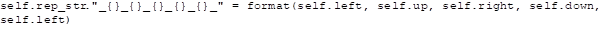</span><span
lang=HE style='font-size:9.0pt;line-height:107%;font-family:"Courier New"'><br>
</span><span lang=HE style='font-family:"Arial",sans-serif'>הייצוג הזה מועיל
לחיפוש חלקים שיש להם שני מספרים סמוכים. למשל, כדי לבדוק אם החלק </span><span
lang=HE style='font-family:"Arial",sans-serif'>[0, 12, 2, 18] כולל 18 ליד 0,
אפשר לחפש &quot;</span><span dir=LTR></span><span lang=EN-US dir=LTR><span
dir=LTR></span>_18_0_</span><span dir=RTL></span><span lang=HE
style='font-family:"Arial",sans-serif'><span dir=RTL></span>&quot; בייצוג &quot;</span><span
dir=LTR></span><span lang=EN-US dir=LTR><span dir=LTR></span>_18_0_12_2_18_</span><span
dir=RTL></span><span lang=HE style='font-family:"Arial",sans-serif'><span
dir=RTL></span>&quot;.</span><span lang=HE style='font-family:"Arial",sans-serif'><br>
<br>
</span></p>

<p class=MsoNormal dir=RTL style='text-align:right;direction:rtl;unicode-bidi:
embed'><span lang=HE style='font-family:"Arial",sans-serif'>החלק הבא הוא ייצוג
של לוח, וגם הוא יחסית סטנדרטי:</span></p>

```python
BLANK_PIECE = Piece(-1, [-1, -1, -1, -1])
 
class Board(object):
    def __init__(self, rows, cols):
        self.rows = rows
        self.cols = cols
 
        self.pieces   = [[BLANK_PIECE for x in range(self.cols)] for y in range(self.rows)]
        self.corners = set()
        self.borders = set()
        self.inner   = set()
 
 
    def Place_piece(self, row, col, new_piece):
        self.pieces[row][col] = new_piece
               
        if new_piece.is_corner:
            self.corners.add(new_piece)
        elif new_piece.is_border:
            self.borders.add(new_piece)
        else:
            self.inner.add(new_piece)
   
    def Print(self):
        for i in range(self.rows):
            for j in range(self.cols):
                print (str(self.pieces[i][j]))
 
    def Print_corners(self):
        for piece in self.corners:
            print (str(piece))
 
    def __str__(self):
        ret = ""
        for i in range(self.rows):
            ret += ("------------" * self.cols) + "\n"
            for j in range(self.cols):
                ret += "|  \\ {:02} /  |".format(self.pieces[i][j].up)
            ret += "\n"
            for j in range(self.cols):
                 ret += "| {:02}\\  / {:02}|".format(self.pieces[i][j].left, self.pieces[i][j].right)
            ret += "\n"
            ret += ("|   /  \\   |" * self.cols) + "\n"
            for j in range(self.cols):
                ret += "|  / {:02} \\  |".format(self.pieces[i][j].down)
            ret += "\n"
            ret += ("------------" * self.cols) + "\n"
        return ret
```

<p class=MsoNormal dir=RTL style='text-align:right;direction:rtl;unicode-bidi:
embed'><span lang=HE style='font-family:"Arial",sans-serif'>אפשר להציב חלק,
להדפיס את הלוח וזהו פחות או יותר.</span></p>

<p class=MsoNormal dir=RTL style='text-align:right;direction:rtl;unicode-bidi:
embed'><span lang=HE style='font-family:"Arial",sans-serif'>כדאי לציין שהלוח
ממיין את החלקים שבו לפינות, גבולות וחלקים פנימיים, לצורך גישה נוחה יותר בזמן ריצה.</span></p>

<p class=MsoNormal dir=RTL style='text-align:right;direction:rtl;unicode-bidi:
embed'><span lang=HE style='font-family:"Arial",sans-serif'>עוד פונקציית עזר
מנסה למצוא את החלק המתאים ביותר לשמש בתור הפינה הראשונה שתוצב על הלוח
(האלגוריתם בנוי כך שהוא מתחיל להציב חלקים מהפינה השמאלית העליונה):</span></p>

```python
def find_best_corner(board):
    for corner in board.corners:
        corner.rotate_until_2(LEFT, 0, UP, 0)
    for border in board.borders:
        border.rotate_until_1(UP, 0)
 
    candidates = collections.defaultdict(int)
    for corner in board.corners:
        for border in board.borders:
            if border.left == corner.right:
                candidates[corner] += 1
    #print (candidates)
    return min(candidates, key=candidates.get)
```

<p class=MsoNormal dir=RTL style='text-align:right;direction:rtl;unicode-bidi:
embed'><span lang=HE style='font-family:"Arial",sans-serif'>&nbsp;</span></p>

<p class=MsoNormal dir=RTL style='text-align:right;direction:rtl;unicode-bidi:
embed'><span lang=HE style='font-family:"Arial",sans-serif'>&nbsp;</span></p>

<p class=MsoNormal dir=RTL style='text-align:right;direction:rtl;unicode-bidi:
embed'><span lang=HE style='font-family:"Arial",sans-serif'>הפונקציה מחפשת את
הפינה שיש עבורה הכי מעט מועמדים לגבול שמתאימים להצבה ליד הפינה. השלב הזה לא
הכרחי (אפשר פשוט לנסות את כל הפינות) אבל עשוי לעזור קצת.</span></p>

<p class=MsoNormal dir=RTL style='text-align:right;direction:rtl;unicode-bidi:
embed'><span lang=HE style='font-family:"Arial",sans-serif'>המחלקה הבאה משמשת
למציאת הפתרון על ידי </span><span lang=EN-US dir=LTR>Backtracking</span><span
dir=RTL></span><span lang=HE style='font-family:"Arial",sans-serif'><span
dir=RTL></span>:</span></p>

```python
class BoardManager(object):
    def __init__(self, board, solution):
        self.board = board
        self.solution = solution
        self.num_pieces = self.board.rows * self.board.cols
        self.num_placed_pieces = 0
 
        self.pool = [self.board.inner, self.board.borders, self.board.corners]
 
    def place_sol(self, row, col, piece):
        piece.used = True
        self.solution.Place_piece(row, col, piece)
        if piece.is_corner:
            self.board.corners.remove(piece)
        elif piece.is_border:
            self.board.borders.remove(piece)
        else:
            self.board.inner.remove(piece)
 
    def remove_sol(self, row, col):
        piece = self.solution.pieces[row][col]
        piece.used = False
        self.solution.Place_piece(row, col, BLANK_PIECE)
        if piece.is_corner:
            self.board.corners.add(piece)
        elif piece.is_border:
            self.board.borders.add(piece)
        else:
            self.board.inner.add(piece)
 
    def get_candidates(self, row, col):
        expected_up = 0 if row == 0 else self.solution.pieces[row-1][col].down
        expected_left = 0 if col == 0 else self.solution.pieces[row][col-1].right
        expected_right = 0 if col == self.solution.cols - 1 else -1
        expected_down = 0 if row == self.solution.rows - 1 else -1
 
        pool = self.pool[[expected_up, expected_left, expected_right, expected_down].count(0)]
        filter_str = "_{}_{}_".format(expected_left, expected_up)
        candidates = list(filter(lambda x: filter_str in x.rep_str, pool))
 
        return (candidates, expected_left, expected_up)
 
 
    def get_next_coord(self, row, col):
        col += 1
        if col == self.solution.cols:
            row += 1
            col = 0
        if row == self.solution.rows:
            return (-1, -1)
        else:
            return (row, col)
 
    def place_one_peice(self, row, col):
        if row == -1 and col == -1:
            print(str(self.solution))
            return True
 
 
        (candidates, expected_left, expected_up) = self.get_candidates(row, col)
        if len(candidates) == 0:
            return False
 
        res = False
        for candidate in candidates:
            candidate.rotate_until_2(LEFT, expected_left, UP, expected_up)
            self.place_sol(row, col, candidate)
            res = self.place_one_peice(*self.get_next_coord(row, col))
            if res:
                return True
            self.remove_sol(row, col)
       
        return False
```

<p class=MsoNormal dir=RTL style='text-align:right;direction:rtl;unicode-bidi:
embed'><span lang=HE style='font-family:"Arial",sans-serif'>מתודת </span><span
lang=EN-US dir=LTR>place_sol</span><span dir=RTL></span><span lang=HE
style='font-family:"Arial",sans-serif'><span dir=RTL></span> מוציאה חלק מהמאגר
ומניחה אותו על לוח הפתרון. מתודת </span><span lang=EN-US dir=LTR>remove_sol</span><span
dir=RTL></span><span lang=HE style='font-family:"Arial",sans-serif'><span
dir=RTL></span> מסירה חלק מלוח הפתרון ומחזירה אותו למאגר החלקים.</span></p>

<p class=MsoNormal dir=RTL style='text-align:right;direction:rtl;unicode-bidi:
embed'><span lang=HE style='font-family:"Arial",sans-serif'>מתודת </span><span
lang=EN-US dir=LTR>get_candidates</span><span dir=RTL></span><span lang=HE
style='font-family:"Arial",sans-serif'><span dir=RTL></span> מקבלת מיקום על
הלוח, ובודקת אילו מועמדים המתאימים למיקום זה קיימים במאגר החלקים. המתודה תחזיר
רק חלקים שאפשר לסדר אותם כך שהמספר העליון שלהם יתאים למספר התחתון של החלק
מעליהם, והמספר השמאלי שלהם יתאים למספר הימני של החלק משמאל.</span></p>

<p class=MsoNormal dir=RTL style='text-align:right;direction:rtl;unicode-bidi:
embed'><span lang=HE style='font-family:"Arial",sans-serif'>מתודת </span><span
lang=EN-US dir=LTR>get_next_coord</span><span dir=RTL></span><span lang=HE
style='font-family:"Arial",sans-serif'><span dir=RTL></span> היא מתודת עזר
למעבר על הלוח – היא מקבל מיקום ומחזירה את המיקום הבא שבו יש להציב חלק (מכיוון
שהלוח הוא דו-מימדי, נוח שתהיה מתודת עזר למעבר בין שורות).</span></p>

<p class=MsoNormal dir=RTL style='text-align:right;direction:rtl;unicode-bidi:
embed'><span lang=HE style='font-family:"Arial",sans-serif'>לבסוף, מתודת </span><span
lang=EN-US dir=LTR>place_one_piece</span><span dir=RTL></span><span lang=HE
style='font-family:"Arial",sans-serif'><span dir=RTL></span> היא המתודה
הרקורסיבית שמבצעת את ה-</span><span lang=EN-US dir=LTR>Backtracking</span><span
dir=RTL></span><span lang=HE style='font-family:"Arial",sans-serif'><span
dir=RTL></span>: היא מנסה להציב חלק מתאים אחד על הלוח (באמצעות המועמדים שהיא
קיבלה מ-</span><span lang=EN-US dir=LTR>get_candidates</span><span dir=RTL></span><span
lang=HE style='font-family:"Arial",sans-serif'><span dir=RTL></span>) ואז
ממשיכה אל המיקום הבא בלוח. אם היא מקבלת תשובה (מקריאה רקורסיבית של עצמה)
שהניסיון נכשל, היא מסירה את החלק שהיא הציבה כעת ומנסה מועמד אחר. תנאי העצירה
הוא אם החלק הבא שיש להציב נמצא מחוץ ללוח. במקרה כזה, &quot;מדווחים אחורה&quot;
שההצבה הצליחה וכל הקריאות &quot;מתקפלות&quot;.</span></p>

<p class=MsoNormal dir=RTL style='text-align:right;direction:rtl;unicode-bidi:
embed'><span lang=HE style='font-family:"Arial",sans-serif'>&nbsp;</span></p>

<p class=MsoNormal dir=RTL style='text-align:right;direction:rtl;unicode-bidi:
embed'><span lang=HE style='font-family:"Arial",sans-serif'>על מנת להתניע את
התהליך, יש צורך בקוד הבא:</span></p>

```python
if __name__ == "__main__":
    with open('puzzle.txt','r') as f:
        input = f.read()
        total_pieces = input.count(";") + 1
        rows = int(math.sqrt(total_pieces))
        cols = rows
        print ("Matrix of {} rows, {} cols".format(rows, cols))
        b = Board(rows, cols)
        match_iter = re.finditer(r"(\d+),\[(\d+), (\d+), (\d+), (\d+)\];?\s*", input)
        for i in range(rows):
            for j in range(cols):
                new_input = next(match_iter)
                new_piece = Piece(int(new_input.group(1)),
                                [int(x) for x in new_input.groups()[1:]])
                b.Place_piece(i, j, new_piece)
 
        print(str(b))
 
        print ("-=-=-=-=-=" * 3)
 
        s = Board(rows, cols)
 
        bm = BoardManager(b, s)
 
 
        # Top Left corner
        first_corner = find_best_corner(b)
        first_corner.rotate_until_2(LEFT, 0, UP, 0)
        bm.place_sol(0, 0, first_corner)
 
        sol_arr = []
        if (bm.place_one_peice(0, 1)):
            # Found solution, build representation:
            for row in range(bm.solution.rows):
                for col in range(bm.solution.cols):
                    piece = bm.solution.pieces[row][col]
                    sol_arr.append("{},{}".format(piece.id, piece.rotations % 4))
       
        print ("; ".join(sol_arr))
```

<p class=MsoNormal dir=RTL style='text-align:right;direction:rtl;unicode-bidi:
embed'><span lang=HE style='font-family:"Arial",sans-serif'>הקוד בונה את
הלוחות, מוצא מועמד מוביל לפינה השמאלית-עליונה ואז קורא למתודה הרקורסיבית להמשך
התהליך.</span></p>

<p class=MsoNormal dir=RTL style='text-align:right;direction:rtl;unicode-bidi:
embed'><span lang=HE style='font-family:"Arial",sans-serif'>במידה ונמצאה תוצאה,
הקוד בונה את הייצוג המתאים ומדפיס אותו למסך.</span></p>

<p class=MsoNormal dir=RTL style='text-align:right;direction:rtl;unicode-bidi:
embed'><span lang=HE style='font-family:"Arial",sans-serif'>הלוח המקורי:</span></p>

<p class=MsoNormal dir=RTL style='text-align:right;direction:rtl;unicode-bidi:
embed'><span lang=en-IL dir=LTR>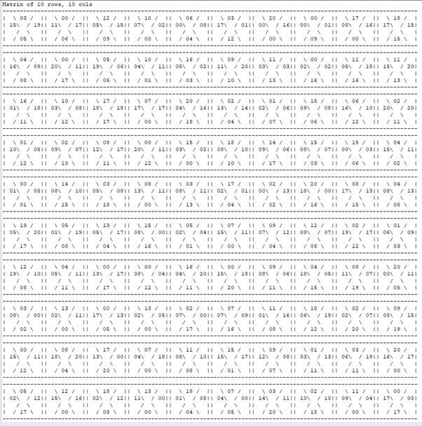</span></p>

<p class=MsoNormal dir=RTL style='text-align:right;direction:rtl;unicode-bidi:
embed'><span lang=HE style='font-family:"Arial",sans-serif'>&nbsp;</span></p>


<p class=MsoNormal dir=RTL style='text-align:right;direction:rtl;unicode-bidi:
embed'><span lang=HE style='font-family:"Arial",sans-serif'>הפתרון:</span></p>

<p class=MsoNormal dir=RTL style='text-align:right;direction:rtl;unicode-bidi:
embed'><span lang=en-IL dir=LTR>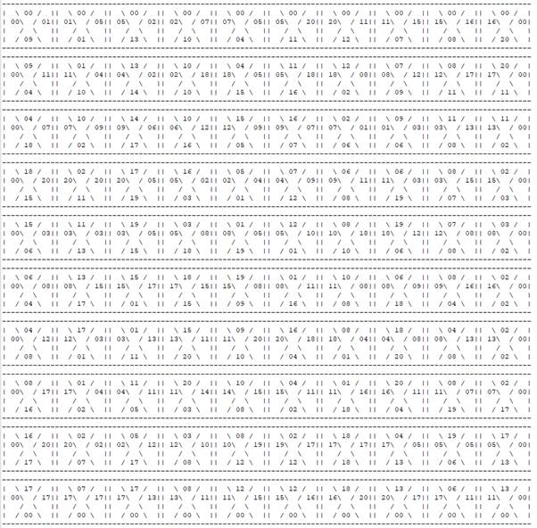</span></p>

<p class=MsoNormal dir=RTL style='text-align:right;direction:rtl;unicode-bidi:
embed'><span lang=HE style='font-family:"Arial",sans-serif'>הייצוג:</span></p>

<p class=MsoNormal dir=RTL style='text-align:right;direction:rtl;unicode-bidi:
embed'><span lang=EN-US dir=LTR>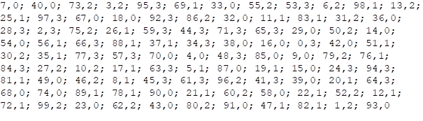</span></p>

<span lang=HE dir=RTL style='font-size:11.0pt;line-height:107%;font-family:
"Arial",sans-serif'><br clear=all style='page-break-before:always'>
</span>

<p class=MsoNormal><span lang=HE dir=RTL style='font-family:"Arial",sans-serif'>&nbsp;</span></p>

<h2 dir=RTL style='text-align:right;direction:rtl;unicode-bidi:embed'><span
lang=HE style='font-family:"Times New Roman",serif'>אתגר 10 </span><span
lang=HE style='font-family:"Arial",sans-serif'>–</span><span lang=HE
style='font-family:"Times New Roman",serif'> </span><span lang=EN-US dir=LTR>Simple
Machine 2</span><span dir=RTL></span><span lang=EN-US style='font-family:"Times New Roman",serif'><span
dir=RTL></span> </span><span lang=HE style='font-family:"Times New Roman",serif'>(קטגוריית
</span><span lang=EN-US dir=LTR>Reversing</span><span dir=RTL></span><span
lang=HE style='font-family:"Times New Roman",serif'><span dir=RTL></span>, </span><span
dir=LTR></span><span lang=EN-US dir=LTR><span dir=LTR></span>85</span><span
dir=RTL></span><span lang=HE style='font-family:"Times New Roman",serif'><span
dir=RTL></span> נקודות)</span></h2>

<p class=MsoNormal dir=RTL style='text-align:right;direction:rtl;unicode-bidi:
embed'><span lang=HE style='font-family:"Arial",sans-serif'>&nbsp;</span></p>

<p class=MsoNormal dir=RTL style='text-align:right;direction:rtl;unicode-bidi:
embed'><span lang=HE style='font-family:"Arial",sans-serif'>תיאור האתגר:</span></p>

```
A Simple Machine
What is this?
You stand before assembly code for a custom Virtual Machine.
You will find the flag once you understand the code.
Everything you need to know is described below. Don’t forget to check ou the example code!
Get the machine code Here
Top level description
The machine is stack based, which means most operations pop data off the top of the stack and push the result. for further reference, https://en.wikipedia.org/wiki/Stack_machine#Advantages_of_stack_machine_instruction_sets
The machine state is defined by an Instruction Pointer, and a Stack data structure.
The next instruction to be executed is pointed to by IP, and it generally reads/write values from/to the top of the stack.
Every opcode is exactly 1 byte in size. The program is read and executed sequentially starting at offset 0 in the file.
Execution stops if an invalid stack address is referenced or the IP is out of code bounds.
Instruction Set
Important!
IP is incremented as the instruction is read (before decode/execute).
This increment is not mentioned in the instruction pseudo-code. Therefore, every instruction that adds an offset to IP will result in IP = IP + offset + 1.
An instruction that resets IP as IP = new_value discards the increment.
Instruction Pseudo Code Notations
stack.push([value]) - pushes the value to the stack
stack.pop() - dequeue the last value pushed to the stack .
a = stack.pop() - dequeue the last value pushed to the stack, save value to pseudo-variable ‘a’.
stack.empty() - true if there are no more values on the stack, false otherwise
stack[N] - the value of the Nth element on the stack
IP - the instruction pointer.
Stack Instructions:
Push <value>
•	opcode is 0x80 + value
•	Pushes the value to the stack, stack[0] is now , stack[1] is now the previous stack[0] value, and so on.
•	value <= 0x7f
•	Push 0x32 is encoded as 0xB2.
stack.push(value)
________________________________________
Load <offset>
•	opcode is 0x40 + offset
•	Pushes the value at stack[offset] to the stack.
•	value <= 0x3f
•	Load 0x12 is encoded as 0x52.
•	Loading from an offset out of bounds (i.e pushing 10 values and loading from offset 12) will cause a fault and execution will terminate.
stack.push(stack[offset])
________________________________________
Pop
•	opcode 0x20
•	Same encoding as Swap 0
•	Swap 0 is an empty statement, thus this opcode pops a value from the stack without doing anything with it.
stack.pop()
________________________________________
Swap <index>
•	opcode is 0x20 + index
•	Swaps the element at HEAD with the element at index.
•	1 <= index < 0x20.
•	Swap 3 is encoded as 0x23.
temp = stack[index]
stack[index] = stack.pop()
stack.push(temp)
________________________________________
Arithmetic instructions
These instructions read 2 values off the stack and push the result. ### Single outupt instructions:
Add
•	opcode is 0x00.
•	operands are viewed as signed bytes
stack.push(stack.pop() + stack.pop())
________________________________________
Subtract
•	opcode is 0x01.
•	operands are viewed as signed bytes
stack.push(stack.pop() - stack.pop())
________________________________________
Multiply
•	opcode is 0x03.
•	operands are viewed as signed bytes
stack.push(stack.pop() * stack.pop())
________________________________________
2-byte output
Divide
•	opcode is 0x02.
•	division reminder is at HEAD, division result follows
•	operands are viewed as unsigned bytes
a = stack.pop()
b = stack.pop()
stack.push(a / b)
stack.push(a % b)
________________________________________
Flow Control Instructions:
These instructions change the Instruction Pointer and allow for loops, function calls, etc.
Jump
•	opcode is 0x10. Jumps to offset stack[0].
•	offset is signed! Jumping to a negative offset is a jump backwards.
•	Pops an offset from the stack, adds it to IP.
IP = IP + stack.pop()
________________________________________
Call
•	opcode is 0x11. Jumps to stack[0], saves origin.
•	same as Jump, only IP before execution is pushed.
•	offset is signed! Calling to a negative offset is a jump backwards.
offset = stack.pop()
stack.push(IP) ; note that IP was already incremented here, points to next instruction.
IP = IP + offset
________________________________________
Ret
•	opcode is 0x12. Pops value from the stack, moves IP to the popped value.
IP = stack.pop()
________________________________________
CJE
•	opcode is 0x14. Jumps to stack[0] if stack[1] == stack[2]. pops all values either way.
•	offset is signed! Jumping to a negative offset is a jump backwards.
offset = stack.pop()
if stack.pop() == stack.pop():
    IP = IP + offset
________________________________________
JSE
•	opcode is 0x18. Adds stack[0] to IP if it is the last value on the stack.
offset = stack.pop()
if stack.empty():
    IP = IP + offset
________________________________________
Input Output Instructions:
These instructions either output an ASCII byte or read an ASCII byte from the input/output device.
Read
•	opcode is 0x08
•	Waits for a single byte to be read from the input, pushes the byte to the top of the stack.
stack.push(read(stdin))
________________________________________
Write
•	opcode is 0x09
•	outputs the top of the stack as ASCII.
write(stdout, stack.pop())
________________________________________
LeT’s rUN TogEaTHeR
Here you’ll find an execution log of a simple program.
Note that the ‘;’ symbol starts a comment line
lines of the form “; >| value1 value2 value3” show the stack state before the following instruction. The stack head is to the left (the first value after >| is SP[0])
The stack state inside the called function is a direct continuation of the caller execution
Note that “Word:” defines a label, which basically names a line of code.
;>|
    Push 2
;>| 02
    Push 7F
;>| 7F 02
    Read            ; assuming user inputs 0x3
;>| 03 7F 02
    Push 0A         ; OFFSET of Adder
;>| 0A 03 7F 02
    Call
;>| 82 02
    Divide
;>| 00 41
    Swap 1
;>| 41 00
    Write
;>| 00
    Pop
;>|
    Push 0C         ; OFFSET of More
;>| 0C
    JSE
;>| 

NotReached:
    Push 4
    Push 0
    Sub     ; constructs offset of NotReached, which is -4 (0xFC)
    Call

Adder:
;>| 05 03 7F 02
    Load 2
;>| 7F 05 03 7F 02
    Load 2
;>| 03 7F 05 03 7F 02
    Add
;>| 82 05 03 7F 02
    Swap 3
;>| 7F 05 03 82 02
    Pop
;>| 05 03 82 02
    Swap 1
;>| 03 05 82 02
    Pop
;>| 05 82 02
    Ret
;>| 82 02


More:
; fill the rest on your own!
;>| 
    Push 44
;>| 
    Push 4E
;>| 
    Push 45
;>| 
    Push 20
;>| 
    Write
;>| 
    Write
;>|    
    Write
;>|     
    Write

; Program ends here
On the displayed run, The program printed “A END”
Your job is to decipher the code and give us the flag.
Good Luck!
```

<p class=MsoNormal dir=RTL style='text-align:right;direction:rtl;unicode-bidi:
embed'><span lang=HE style='font-family:"Arial",sans-serif'>תוכן הקובץ שהורד:</span></p>

<p class=MsoNormal dir=RTL style='text-align:right;direction:rtl;unicode-bidi:
embed'><span lang=en-IL dir=LTR>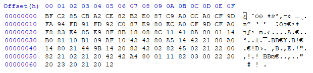</span></p>

<p class=MsoNormal dir=RTL style='text-align:right;direction:rtl;unicode-bidi:
embed'><span lang=HE style='font-family:"Arial",sans-serif'>&nbsp;</span></p>

<p class=MsoNormal dir=RTL style='text-align:right;direction:rtl;unicode-bidi:
embed'><span lang=HE style='font-family:"Arial",sans-serif'>ההוראות למימוש
המכונה הוירטואלית יחסית פשוטות, אפשר לממש בקלות עם סקריפט:</span></p>

```python
import mmap, os, sys
import struct, re
import builtins
import ctypes
 
def memory_map(filename, access=mmap.ACCESS_WRITE):
    size = os.path.getsize(filename)
    fd = os.open(filename, os.O_RDWR)
    return mmap.mmap(fd, size, access=access)
 
OP_PUSH = 0x80
OP_LOAD = 0x40
OP_SWAP = 0x20
OP_ADD = 0x0
OP_SUB = 0x1
OP_MUL = 0x3
OP_DIV = 0x2
OP_JUMP = 0x10
OP_CALL = 0x11
OP_RET = 0x12
OP_CJE = 0x14
OP_JSE = 0x18
OP_READ = 0x08
OP_WRITE = 0x09
 
class Interpreter(object):
    def __init__(self):
        self.stack = []
        self.ip = 0
        self.debug = False
        self.num_reads = 0
 
    def log(self, s):
        if self.debug:
            print (s)
 
    def stack_index(self, index):
        return len(self.stack) - index - 1
 
    @staticmethod
    def signed_num(num):
        return ctypes.c_byte(num).value
 
    @staticmethod
    def unsigned_num(num):
        return ctypes.c_ubyte(num).value
       
 
    def execute_push(self, current_instruction):
        value = current_instruction - OP_PUSH
        self.log("Push {}".format(value))
        self.stack.append(value)
   
    def execute_load(self, current_instruction):
        value = current_instruction - OP_LOAD
        self.log("Load {}".format(value))
        self.stack.append(self.stack[self.stack_index(value)])
 
    def execute_swap(self, current_instruction):
        value = current_instruction - OP_SWAP
        if value == 0:
            self.log ("Pop")
            self.stack.pop()
        else:
            self.log("Swap {}".format(value))
            index = self.stack_index(value)
            temp = self.stack[index]
            self.stack[index] = self.stack.pop()
            self.stack.append(temp)
 
    def execute_add(self):
        self.log ("Add")
        self.stack.append(self.unsigned_num(self.signed_num(self.stack.pop()) + self.signed_num(self.stack.pop())))
 
    def execute_sub(self):
        self.log ("Sub")
        self.stack.append(self.unsigned_num(self.signed_num(self.stack.pop()) - self.signed_num(self.stack.pop())))
 
    def execute_mul(self):
        self.log ("Mul")
        self.stack.append( self.unsigned_num(
                                            (self.signed_num(self.stack.pop()) * self.signed_num(self.stack.pop())) % 256
                                            )
                          )
 
    def execute_div(self):
        self.log ("Div")
        a = self.stack.pop()
        b = self.stack.pop()
        self.stack.append(a // b)
        self.stack.append(a % b)
 
    def execute_jump(self):
        self.log ("Jump")
        self.ip = self.ip + self.signed_num(self.stack.pop())
 
    def execute_call(self):
        self.log ("Call")
        offset = self.stack.pop()
        self.stack.append(self.ip) # note that IP was already incremented here, points to next instruction.
        self.ip = self.ip + self.signed_num(offset)
        #self.ip = self.ip + offset #Already signed?
 
    def execute_ret(self):
        self.log ("Ret")
        self.ip = self.stack.pop()
 
    def execute_cje(self):
        self.log ("CJE")
        offset = self.stack.pop()
        if self.stack.pop() == self.stack.pop():
            self.ip = self.ip + self.signed_num(offset)
            #self.ip = self.ip + offset #Already signed?
 
    def execute_jse(self):
        self.log ("JSE")
        offset = self.stack.pop()
        if len(self.stack) == 0:
            self.ip = self.ip + offset
 
    def execute_read(self):
        self.log ("Read")
        input_byte_str = input("Please input byte in format 0xab: ")
        input_byte = int(input_byte_str, 16)
        print (input_byte)
        self.stack.append(input_byte)
        self.num_reads += 1
 
    def execute_write(self):
        self.log ("Write")
        b = self.stack.pop()
        #sys.stdout.write(chr(b))
        print("\t --> \t'" + chr(b) + "'")
 
    def print_stack(self):
        if self.debug:
            sys.stdout.write(";>| ")
            for n in reversed(self.stack):
                sys.stdout.write("{:02X} ".format(n))
            sys.stdout.write("\n")
 
    def execute(self, path_to_code):
        self.code = memory_map(path_to_code, mmap.ACCESS_READ)
        while self.ip != len(self.code):
            #assert(self.num_reads <= 1)
            self.print_stack()
            current_instruction = self.code[self.ip]
            self.ip += 1
            if current_instruction & OP_PUSH:
                self.execute_push(current_instruction)
            elif current_instruction & OP_LOAD:
                self.execute_load(current_instruction)
            elif current_instruction & OP_SWAP:
                self.execute_swap(current_instruction)
            elif current_instruction == OP_ADD:
                self.execute_add()
            elif current_instruction == OP_SUB:
                self.execute_sub()
            elif current_instruction == OP_MUL:
                self.execute_mul()
            elif current_instruction == OP_DIV:
                self.execute_div()
            elif current_instruction == OP_JUMP:
                self.execute_jump()
            elif current_instruction == OP_CALL:
                self.execute_call()
            elif current_instruction == OP_RET:
                self.execute_ret()
            elif current_instruction == OP_CJE:
                self.execute_cje()
            elif current_instruction == OP_JSE:
                self.execute_jse()
            elif current_instruction == OP_READ:
                self.execute_read()
            elif current_instruction == OP_WRITE:
                self.execute_write()
```

<p class=MsoNoSpacing dir=RTL style='text-align:right;direction:rtl;unicode-bidi:
embed'><span lang=HE style='font-family:"Arial",sans-serif'>נריץ את הקוד ונקבל:</span></p>

<p class=MsoNoSpacing dir=RTL style='text-align:right;direction:rtl;unicode-bidi:
embed'><span lang=EN-US dir=LTR style='font-family:"Courier New"'>&nbsp;</span></p>

<p class=MsoNoSpacing><span lang=EN-US style='font-family:"Courier New"'>Please
input byte in format 0xab</span><span dir=RTL></span><span lang=HE dir=RTL
style='font-family:"Courier New"'><span dir=RTL></span>:</span></p>

<p class=MsoNoSpacing><span lang=EN-US>&nbsp;</span></p>

<p class=MsoNoSpacing dir=RTL style='text-align:right;direction:rtl;unicode-bidi:
embed'><span lang=HE style='font-family:"Arial",sans-serif'>ננסה אקראית:</span></p>

<p class=MsoNoSpacing><span lang=EN-US style='font-family:"Courier New"'>Please
input byte in format 0xab: 0x00</span></p>

<p class=MsoNoSpacing><span dir=RTL></span><span lang=HE dir=RTL
style='font-family:"Courier New"'><span dir=RTL></span>0</span></p>

<p class=MsoNoSpacing><span lang=HE dir=RTL style='font-family:"Courier New"'>      </span><span
dir=LTR></span><span lang=EN-US style='font-family:"Courier New"'><span
dir=LTR></span>--&gt;</span><span dir=RTL></span><span lang=HE dir=RTL
style='font-family:"Courier New"'><span dir=RTL></span>  '0'</span></p>

<p class=MsoNoSpacing dir=RTL style='text-align:right;direction:rtl;unicode-bidi:
embed'><span lang=EN-US dir=LTR>&nbsp;</span></p>

<p class=MsoNoSpacing dir=RTL style='text-align:right;direction:rtl;unicode-bidi:
embed'><span lang=HE style='font-family:"Arial",sans-serif'>נצטרך להבין טוב
יותר מה בדיוק התוכנה רוצה.</span></p>

<p class=MsoNoSpacing dir=RTL style='text-align:right;direction:rtl;unicode-bidi:
embed'><span lang=HE style='font-family:"Arial",sans-serif'>זמן לכתוב דיסאסמבלר
בסיסי:</span></p>

```python
def disassemble(self, path_to_code):
        self.code = memory_map(path_to_code, mmap.ACCESS_READ)
        
        for i in range(len(self.code)):
            current_instruction = self.code[i]
            sys.stdout.write("{:02X}\t{:02X}\t".format(i, current_instruction))
            
            if current_instruction & OP_PUSH:
                print("Push 0x{:02X}".format(current_instruction - OP_PUSH))
                
            elif current_instruction & OP_LOAD:
                print("Load 0x{:02X}".format(current_instruction - OP_LOAD))
                
            elif current_instruction & OP_SWAP:
                if current_instruction == OP_SWAP:
                    print("Pop")
                else:
                    print("Swap 0x{:02X}".format(current_instruction - OP_SWAP))
                    
            elif current_instruction == OP_ADD:
                print("Add")
                
            elif current_instruction == OP_SUB:
                print("Sub")
                
            elif current_instruction == OP_MUL:
                print("Mul")
                
            elif current_instruction == OP_DIV:
                print("Divide")
                
            elif current_instruction == OP_JUMP:
                print("Jump")
                
            elif current_instruction == OP_CALL:
                print("Call")
                
            elif current_instruction == OP_RET:
                print("Ret")
                
            elif current_instruction == OP_CJE:
                print("CJE")
                
            elif current_instruction == OP_JSE:
                print("JSE")
                
            elif current_instruction == OP_READ:
                print("Read")
                
            elif current_instruction == OP_WRITE:
                print("Write")
```

<p class=MsoNormal dir=RTL style='text-align:right;direction:rtl;unicode-bidi:
embed'><span lang=HE style='font-family:"Arial",sans-serif'>נריץ ונקבל:</span></p>

```
00     BF     Push 0x3F
01     C2     Push 0x42
02     85     Push 0x05
03     CB     Push 0x4B
04     A2     Push 0x22
05     CE     Push 0x4E
06     82     Push 0x02
07     B2     Push 0x32
08     E0     Push 0x60
09     87     Push 0x07
0A     C9     Push 0x49
0B     A0     Push 0x20
0C     CC     Push 0x4C
0D     A0     Push 0x20
0E     CF     Push 0x4F
0F     9D     Push 0x1D
10     FA     Push 0x7A
11     94     Push 0x14
12     FD     Push 0x7D
13     91     Push 0x11
14     FD     Push 0x7D
15     92     Push 0x12
16     C0     Push 0x40
17     87     Push 0x07
18     E9     Push 0x69
19     80     Push 0x00
1A     EC     Push 0x6C
1B     A0     Push 0x20
1C     CF     Push 0x4F
1D     9D     Push 0x1D
1E     CF     Push 0x4F
1F     A0     Push 0x20
20     F8     Push 0x78
21     83     Push 0x03
22     E4     Push 0x64
23     85     Push 0x05
24     E9     Push 0x69
25     8F     Push 0x0F
26     8B     Push 0x0B
27     18     JSE
28     08     Read
29     8C     Push 0x0C
2A     11     Call
2B     41     Load 0x01
2C     8A     Push 0x0A
2D     80     Push 0x00
2E     01     Sub
2F     14     CJE
30     B0     Push 0x30
31     81     Push 0x01
32     10     Jump
33     B1     Push 0x31
34     09     Write
35     AF     Push 0x2F
36     10     Jump
37     42     Load 0x02
38     42     Load 0x02
39     80     Push 0x00
3A     A5     Push 0x25
3B     14     CJE
3C     42     Load 0x02
3D     21     Swap 0x01
3E     80     Push 0x00
3F     A0     Push 0x20
40     14     CJE
41     80     Push 0x00
42     21     Swap 0x01
43     44     Load 0x04
44     9B     Push 0x1B
45     14     CJE
46     20     Pop
47     82     Push 0x02
48     42     Load 0x02
49     02     Divide
4A     82     Push 0x02
4B     45     Load 0x05
4C     02     Divide
4D     21     Swap 0x01
4E     22     Swap 0x02
4F     00     Add
50     82     Push 0x02
51     21     Swap 0x01
52     02     Divide
53     21     Swap 0x01
54     20     Pop
55     42     Load 0x02
56     42     Load 0x02
57     A4     Push 0x24
58     80     Push 0x00
59     01     Sub
5A     11     Call
5B     82     Push 0x02
5C     03     Mul
5D     00     Add
5E     22     Swap 0x02
5F     20     Pop
60     20     Pop
61     23     Swap 0x03
62     20     Pop
63     21     Swap 0x01
64     20     Pop
65     12     Ret
```

<p class=MsoNormal dir=RTL style='text-align:right;direction:rtl;unicode-bidi:
embed'><span lang=HE style='font-family:"Arial",sans-serif'>החלק הראשון בסך הכל
מכין את המחסנית להרצה, ואפשר לדלג עליו לעת עתה.</span></p>

<p class=MsoNormal dir=RTL style='text-align:right;direction:rtl;unicode-bidi:
embed'><span lang=HE style='font-family:"Arial",sans-serif'>כך נראה החלק השני,
אחרי הוספת הערות:</span></p>

```
label4:
26      8B      Push 0x0B
27      18      JSE ; to label1 - jumps only when one value is left on the stack
28      08      Read
29      8C      Push 0x0C
2A      11      Call              ; to label2
2B      41      Load 0x01
2C      8A      Push 0x0A
2D      80      Push 0x00
2E      01      Sub
2F      14      CJE               ; to label4
30      B0      Push 0x30
31      81      Push 0x01
32      10      Jump              ; to label5
label1:
33      B1      Push 0x31
label5:
34      09      Write
35      AF      Push 0x2F
36      10      Jump              ; to label6
label2:
37      42      Load 0x02         ; Take top of payload
38      42      Load 0x02         ; Take input
39      80      Push 0x00
3A      A5      Push 0x25         ; Address of label3
3B      14      CJE ; to label3  ; Jump to label3 if input == 0
3C      42      Load 0x02         ; Take input
3D      21      Swap 0x01         ; Take top of payload
3E      80      Push 0x00         ;
3F      A0      Push 0x20         ; Address of label3
40      14      CJE ; to label3  ; Jump to label3 if top of payload == 0
41      80      Push 0x00
42      21      Swap 0x01         ; Take input
43      44      Load 0x04         ; Take top of payload
44      9B      Push 0x1B         ; Address of label3
45      14      CJE ; to label3  ; Jump to label3 if input == top of payload
46      20      Pop               ; Pop 0
47      82      Push 0x02        
48      42      Load 0x02         ; Take input
49      02      Div               ; input / 2
4A      82      Push 0x02        
4B      45      Load 0x05         ; Take top of payload
4C      02      Div               ; Top of payload  / 2
4D      21      Swap 0x01         ; Take div(top of payload / 2)
4E      22      Swap 0x02         ; Take mod(input / 2)
4F      00      Add               ; div(top of payload / 2) + mod(input / 2)
50      82      Push 0x02        
51      21      Swap 0x01         ; Take div(top of payload / 2) + mod(input / 2)
52      02      Div               ; ( div(top of payload / 2) + mod(input / 2) ) / 2
53      21      Swap 0x01         ; Take div( div(top of payload / 2) + mod(input / 2) ) / 2
54      20      Pop               ; Ignore div( div(top of payload / 2) + mod(input / 2) ) / 2, take mod( div(top of payload / 2) + mod(input / 2) ) / 2
55      42      Load 0x02         ; Take div (input / 2)
56      42      Load 0x02         ; Take div (top of payload / 2)
57      A4      Push 0x24
58      80      Push 0x00
59      01      Sub               ; Offset of label2
5A      11      Call              ; to label2
5B      82      Push 0x02
5C      03      Mul               ; ret * 2
5D      00      Add               ; (ret * 2) + (mod( mod(top of payload / 2) + mod(input / 2) ) / 2)
5E      22      Swap 0x02         ; Take div(input / 2)
5F      20      Pop               ;
60      20      Pop               ; Stack: div (top of payload / 2) * 2
label3:                           ;
61      23      Swap 0x03         ;
62      20      Pop               ;
63      21      Swap 0x01         ;
64      20      Pop               ;
label6:
65      12      Ret               ; Return param[0]?
```

<p class=MsoNormal dir=RTL style='text-align:right;direction:rtl;unicode-bidi:
embed'><span lang=HE style='font-family:"Arial",sans-serif'>כעת אפשר לנסות
לשחזר את הקוד בשפה עילית:</span></p>

```python
def unknown_function(input, top_of_payload):
    if input == 0:
        return top_of_payload
    elif top_of_payload == 0:
        return input
    elif top_of_payload == input:
        return 0
 
    temp = unknown_function(top_of_payload // 2, input // 2)
    temp *= 2
    temp += (( (top_of_payload % 2) + (input % 2) ) % 2)
    return temp
```

<p class=MsoNormal dir=RTL style='text-align:right;direction:rtl;unicode-bidi:
embed'><span lang=HE style='font-family:"Arial",sans-serif'>הקוד הזה פועל על
ראש המחסנית, ומשווה את הקלט מהמשתמש אל הערך ששמור על המחסנית. אם הערך נכון,
ממשיכים לאיטרציה הבאה, ואם לא – יוצאים.</span></p>

<p class=MsoNormal dir=RTL style='text-align:right;direction:rtl;unicode-bidi:
embed'><span lang=HE style='font-family:"Arial",sans-serif'>לכן, כדי לדעת מה
הקלט שהתוכנה מצפה לו, נעתיק את תוכן המחסנית ונריץ </span><span lang=EN-US
dir=LTR>Brute Force</span><span dir=RTL></span><span lang=HE style='font-family:
"Arial",sans-serif'><span dir=RTL></span> על כל האפשרויות.</span></p>

```python
stack = "0F 69 05 64 03 78 20 4F 1D 4F 20 6C 00 69 07 40 12 7D 11 7D 14 7A 1D 4F 20 4C 20 49 07 60 32 02 4E 22 4B 05 42 3F".split(" ")
stack = [int(x, 16) for x in stack]
stack.reverse()
 
while len(stack) > 1:
    top_of_stack = stack.pop()
    for i in range(256):
        if unknown_function(i, top_of_stack) == stack[-1]:
            sys.stdout.write(chr(i))
            break
```

<p class=MsoNormal dir=RTL style='text-align:right;direction:rtl;unicode-bidi:
embed'><span lang=HE style='font-family:"Arial",sans-serif'>התוצאה היא:</span></p>

<p class=MsoNormal><span lang=EN-US style='font-family:"Courier New"'>flag{XoRRoLlinGRollingRolliNgR0LliNG}</span></p>

<span lang=EN-US style='font-size:11.0pt;line-height:107%;font-family:"Calibri",sans-serif'><br
clear=all style='page-break-before:always'>
</span>

<p class=MsoNormal><span lang=EN-US>&nbsp;</span></p>

<h2 dir=RTL style='text-align:right;direction:rtl;unicode-bidi:embed'><span
lang=HE style='font-family:"Times New Roman",serif'>אתגר 11 </span><span
lang=HE style='font-family:"Arial",sans-serif'>–</span><span lang=HE
style='font-family:"Times New Roman",serif'> </span><span lang=EN-US dir=LTR>Bowsers
Secret Message</span><span dir=RTL></span><span lang=HE style='font-family:
"Times New Roman",serif'><span dir=RTL></span> (קטגוריית </span><span
lang=EN-US dir=LTR>Reversing</span><span dir=RTL></span><span lang=HE
style='font-family:"Times New Roman",serif'><span dir=RTL></span>, </span><span
dir=LTR></span><span lang=EN-US dir=LTR><span dir=LTR></span>85</span><span
dir=RTL></span><span lang=HE style='font-family:"Times New Roman",serif'><span
dir=RTL></span> נקודות)</span></h2>

<p class=MsoNormal dir=RTL style='text-align:right;direction:rtl;unicode-bidi:
embed'><span lang=EN-US dir=LTR>&nbsp;</span></p>

<p class=MsoNormal dir=RTL style='text-align:right;direction:rtl;unicode-bidi:
embed'><span lang=HE style='font-family:"Arial",sans-serif'>תיאור האתגר:</span></p>

```
We uncovered Bowser’s old laptop!

Everything was wiped except for 3 files, he must have used them to send his evil henchmen ──Steganos & Graphein── a secret message.

Help us!
```

<p class=MsoNormal dir=RTL style='text-align:right;direction:rtl;unicode-bidi:
embed'><span lang=HE style='font-family:"Arial",sans-serif'>הקבצים המצורפים הם:</span></p>

<p class=MsoListParagraphCxSpFirst dir=RTL style='margin-top:0cm;margin-right:
36.0pt;margin-bottom:8.0pt;margin-left:0cm;text-align:right;text-indent:-18.0pt;
direction:rtl;unicode-bidi:embed'><span lang=EN-US>1.<span style='font:7.0pt "Times New Roman"'>&nbsp;&nbsp;&nbsp;&nbsp;&nbsp;
</span></span><span dir=RTL></span><span lang=EN-US dir=LTR>Secret.gif</span><span
dir=RTL></span><span lang=EN-US style='font-family:"Arial",sans-serif'><span
dir=RTL></span> </span><span lang=HE style='font-family:"Arial",sans-serif'>–
קובץ </span><span lang=EN-US dir=LTR>GIF</span><span dir=RTL></span><span
lang=HE style='font-family:"Arial",sans-serif'><span dir=RTL></span> מונפש
שנפתח ללא בעיה</span></p>

<p class=MsoListParagraphCxSpMiddle dir=RTL style='margin-top:0cm;margin-right:
36.0pt;margin-bottom:8.0pt;margin-left:0cm;text-align:right;text-indent:-18.0pt;
direction:rtl;unicode-bidi:embed'><span lang=EN-US>2.<span style='font:7.0pt "Times New Roman"'>&nbsp;&nbsp;&nbsp;&nbsp;&nbsp;
</span></span><span dir=RTL></span><span lang=EN-US dir=LTR>Enc.py</span><span
dir=RTL></span><span lang=EN-US style='font-family:"Arial",sans-serif'><span
dir=RTL></span> </span><span lang=HE style='font-family:"Arial",sans-serif'>–
סקריפט להצפנת מסר סודי בתוך קובץ </span><span lang=EN-US dir=LTR>GIF</span></p>

<p class=MsoListParagraphCxSpLast dir=RTL style='margin-top:0cm;margin-right:
36.0pt;margin-bottom:8.0pt;margin-left:0cm;text-align:right;text-indent:-18.0pt;
direction:rtl;unicode-bidi:embed'><span lang=EN-US>3.<span style='font:7.0pt "Times New Roman"'>&nbsp;&nbsp;&nbsp;&nbsp;&nbsp;
</span></span><span dir=RTL></span><span lang=EN-US dir=LTR>Lzwlib.py</span><span
dir=RTL></span><span lang=EN-US style='font-family:"Arial",sans-serif'><span
dir=RTL></span> </span><span lang=HE style='font-family:"Arial",sans-serif'>–
סקריפט עזר לביצוע דחיסה</span></p>

<p class=MsoNormal dir=RTL style='text-align:right;direction:rtl;unicode-bidi:
embed'><span lang=HE style='font-family:"Arial",sans-serif'>תוכן הקובץ </span><span
lang=EN-US dir=LTR>enc.py</span><span dir=RTL></span><span lang=HE
style='font-family:"Arial",sans-serif'><span dir=RTL></span>:</span></p>

```python
from __future__ import print_function
from random import randint, shuffle
import sys
from struct import unpack, pack as pk
from io import BytesIO as BIO
import lzwlib
 
up = lambda *args: unpack(*args)[0]
 
 
def F(f):
    assert f.read(3) == 'GIF', ''
    assert f.read(3) == '89a', ''
    w, h = unpack('HH', f.read(4))
 
    assert 32 <= w <= 500, ''
    assert 32 <= h <= 500, ''
    logflags = up('B', f.read(1))
 
    assert logflags & 0x80, ''
    size_count = logflags & 0x07
 
    gct_count = 2**(size_count+1)
    assert 4 <= gct_count <= 256, ''
 
    bgcoloridx = up('B', f.read(1))
    f.seek(1, 1)
    clrs = []
    for i in xrange(gct_count):
        clr = (up('B', f.read(1)), up('B', f.read(1)), up('B', f.read(1)))
        clrs.append(clr)
 
    assert len(clrs) > bgcoloridx, ''
    return clrs, bgcoloridx, size_count, h, w
 
 
class T(object):
    I = 0
    EG = 1
    EA = 2
    EC = 3
    ET = 4
 
 
def C(f):
    rb = f.read(1)
    b = up('B', rb)
 
    while b != 0x3B:
        buf = ''
        buf += rb
        if b == 0x2c:
            nbuf = f.read(2*4)
            eb = f.read(1)
            assert (up('B', eb) & 0x03) == 0, ''
            nbuf += eb
 
            nbuf += f.read(1)
            nbuf += V(f)
            t = T.I
        elif b == 0x21:
            rb = f.read(1)
            buf += rb
            b = up('B', rb)
 
            if b == 0xF9:
                nbuf = f.read(1)
                blksize = up('B', nbuf)
                nbuf += f.read(blksize)
                nbuf += f.read(1)
                assert nbuf[-1] == '\x00', ''
                t = T.EG
            elif b in [0xFF, 0x01]:
                nbuf = f.read(1)
                blksize = up('B', nbuf)
                nbuf += f.read(blksize)
                nbuf += V(f)
 
                t = (b+3) & 0x0F
            elif b == 0xFE:
                nbuf = V(f)
 
                t = T.EC
            else:
                raise Exception("unsupprted thing @{}".format(f.tell()))
 
        buf += nbuf
 
        yield t, buf
        rb = f.read(1)
        b = up('B', rb)
 
    yield None, '\x3B'
 
    raise StopIteration
 
 
def WB(buf):
    blockcount = len(buf)/0xFF
    blockcount += 1 if len(buf) % 0xFF else 0
 
    blocks = [
        pk('B', len(subblock))+subblock for subblock in [
            buf[i:0xFF+i] for i in xrange(0, blockcount*0xFF, 0xFF)
        ]
    ]
 
    return ''.join(blocks) + '\x00'
 
 
def k(bf):
    combined_buf = ''
    while True:
        cb = ord(bf.read(1))
        if not cb:
            break
 
        combined_buf += bf.read(cb)
    return combined_buf
 
 
def V(f):
    sbx = ''
    while True:
        rcb = f.read(1)
        sbx += rcb
        if rcb == '\x00':
            break
 
        cb = up('B', rcb)
        blk = f.read(cb)
        sbx += blk
 
    return sbx
 
 
def Q(delay, w, h, x, y, tidx):
 
    assert 0 <= tidx <= 255
    assert 0 <= delay < 2**16
 
    indices = [tidx]*(w*h)
    buf = BIO('')
 
    buf.write('\x21\xF9\x04\x05')
    buf.write(pk('H', delay))
    buf.write(pk('B', tidx))
    buf.write('\x00')
 
    buf.write('\x2c')
    buf.write(pk('H', x))
    buf.write(pk('H', y))
    buf.write(pk('H', w))
    buf.write(pk('H', h))
    buf.write('\x00')
 
    LZWMinimumCodeSize = 8
 
    cmprs, _ = lzwlib.Lzwg.compress(
        indices, LZWMinimumCodeSize)
 
    obuf = pk('B', LZWMinimumCodeSize) + WB(cmprs)
 
    buf.write(obuf)
    buf.seek(0)
    return buf.read()
 
 
def z(n):
    import math
    for i in xrange(1, int(math.sqrt(n) + 1)):
        if n % i == 0:
            yield i
 
 
def m(a, mm, hh):
    if a < 0x08:
        if a % 2:
            _0 = 0
            _1 = 1
            _4 = a << 2
            _3 = randint(4, mm-1)
        else:
            _0 = 1
            _1 = a << 1
            _3 = randint(4, mm/2)
            _4 = randint(4, hh/3)
    else:
        ds = list(z(a))
        _0 = 0
        _1 = 0
        shuffle(ds)
        _4 = ds[0]
        assert a % _4 == 0
        _3 = a/_4
 
    return _0, _1, _3, _4
 
 
def h(b6, b1, mw, mh, mci, d=3):
    idx = randint(0, (mci-1)/2)*2 + b1
    x, xx, xxx, xxxx = m(b6, mw, mh)
    f = Q(d, xxx, xxxx, x, xx, idx)
    return f
 
 
def M(s):
    l = list(set(s.upper()))
    shuffle(l)
    d = ''.join(l)
    assert len(d) <= 2**6, ''
    return d, [(d.index(c.upper()), int(c.isupper())) for c in s]
 
 
def E(f, s, o):
    global_colors, bgcoloridx, size_count, hh, ww = F(f)
    mp, ks = M(s)
    hdr_end = f.tell()
    f.seek(0)
    o.write(f.read(hdr_end))
    fc = 0
 
    o.write('\x21\xFE')
    o.write(WB('RDBNB'+mp))
    o.flush()
 
    for t, buf in C(f):
        print('.', end='')
        if t == T.EC:
            continue
        if t == T.EG:
            if ks:
                delay = up('<H', buf[4:6])
                assert delay >= 6
                buf = buf[:4] + pk('<H', delay - 3) + buf[6:]
            obuf = buf
 
        elif t == T.I:
            fc += 1
            total_raw_blocks_data = ''
            bf = BIO(buf)
            pref = bf.read(10)
 
            LZWMinimumCodeSize = ord(bf.read(1))
            total_raw_blocks_data = k(bf)
 
            indices, dcmprsdcodes = lzwlib.Lzwg.decompress(
                total_raw_blocks_data, LZWMinimumCodeSize)
            xxx = unpack('<B H H H H B', pref)
 
            cmprs, codes = lzwlib.Lzwg.compress(
                indices, LZWMinimumCodeSize)
 
            obuf = pref + pk('B', LZWMinimumCodeSize) + WB(cmprs)
 
            if ks:
                mpindx, isup = ks.pop(0)
                obuf += h(mpindx, isup,
                          ww, hh, len(global_colors)-1)
        else:
            obuf = buf
 
        o.write(obuf)
    o.flush()
    assert not ks, ''
 
    return 0
 
 
if __name__ == '__main__':
    assert len(sys.argv) > 2, 'bad input'
    fpath = sys.argv[1]
    flag = sys.argv[2]
    if len(sys.argv) > 3:
        outpath = sys.argv[3]
    else:
        outpath = fpath + '.out.gif'
 
    f = open(fpath, 'rb')
    o = open(outpath, 'wb')
    rv = E(f, flag, o)
    sys.exit(rv)
```

<p class=MsoNormal dir=RTL style='text-align:right;direction:rtl;unicode-bidi:
embed'><span lang=HE style='font-family:"Arial",sans-serif'>ניתן לראות שהדגל
מתקבל כפרמטר לפונקציית </span><span lang=EN-US dir=LTR>E</span><span dir=RTL></span><span
lang=HE style='font-family:"Arial",sans-serif'><span dir=RTL></span>, שבתורה
שולחת אותו ל-</span><span lang=EN-US dir=LTR>M</span><span dir=RTL></span><span
lang=HE style='font-family:"Arial",sans-serif'><span dir=RTL></span>:</span></p>

```python
mp, ks = M(s)
```

<p class=MsoNormal dir=RTL style='text-align:right;direction:rtl;unicode-bidi:
embed'><span lang=HE style='font-family:"Arial",sans-serif'>&nbsp;</span></p>

<p class=MsoNormal dir=RTL style='text-align:right;direction:rtl;unicode-bidi:
embed'><span lang=HE style='font-family:"Arial",sans-serif'>פונקציית </span><span
lang=EN-US dir=LTR>M</span><span dir=RTL></span><span lang=HE style='font-family:
"Arial",sans-serif'><span dir=RTL></span> מייצרת ייצוג אחר של הדגל:</span></p>

```python
def M(s):
    l = list(set(s.upper()))
    shuffle(l)
    d = ''.join(l)
    assert len(d) <= 2**6, ''
    return d, [(d.index(c.upper()), int(c.isupper())) for c in s]
```

<p class=MsoNormal><span lang=HE dir=RTL style='font-family:"Arial",sans-serif'>&nbsp;</span></p>

<p class=MsoNormal dir=RTL style='text-align:right;direction:rtl;unicode-bidi:
embed'><span lang=HE style='font-family:"Arial",sans-serif'>הדגל מיוצג בתור </span><span
lang=EN-US dir=LTR>set</span><span dir=RTL></span><span lang=HE
style='font-family:"Arial",sans-serif'><span dir=RTL></span> של האותיות בדגל,
יחד עם מערך של זוגות שמכילים שני נתונים אודות כל אות בדגל: מהו מיקומה של האות
ב-</span><span lang=EN-US dir=LTR>set</span><span dir=RTL></span><span lang=HE
style='font-family:"Arial",sans-serif'><span dir=RTL></span>, והאם זו אות גדולה
או קטנה.</span></p>

<p class=MsoNormal dir=RTL style='text-align:right;direction:rtl;unicode-bidi:
embed'><span lang=HE style='font-family:"Arial",sans-serif'>את ה-</span><span
lang=EN-US dir=LTR>set</span><span dir=RTL></span><span lang=HE
style='font-family:"Arial",sans-serif'><span dir=RTL></span> והמערך יחביאו
במקומות שונים בתוך התמונה.</span></p>

<p class=MsoNormal dir=RTL style='text-align:right;direction:rtl;unicode-bidi:
embed'><span lang=HE style='font-family:"Arial",sans-serif'>את ה-</span><span
lang=EN-US dir=LTR>set</span><span dir=RTL></span><span lang=EN-US
style='font-family:"Arial",sans-serif'><span dir=RTL></span> </span><span
lang=HE style='font-family:"Arial",sans-serif'>(שנקרא </span><span lang=EN-US
dir=LTR>mp</span><span dir=RTL></span><span lang=HE style='font-family:"Arial",sans-serif'><span
dir=RTL></span>) קל למצוא:</span></p>

```python
    o.write('\x21\xFE')
    o.write(WB('RDBNB'+mp))
    o.flush()
```

<p class=MsoNormal dir=RTL style='text-align:right;direction:rtl;unicode-bidi:
embed'><span lang=HE style='font-family:"Arial",sans-serif'>&nbsp;</span></p>

<p class=MsoNormal dir=RTL style='text-align:right;direction:rtl;unicode-bidi:
embed'><span lang=HE style='font-family:"Arial",sans-serif'>ובתוכן התמונה:</span></p>

<p class=MsoNormal align=right dir=RTL style='text-align:left;direction:rtl;
unicode-bidi:embed'><span lang=en-IL dir=LTR>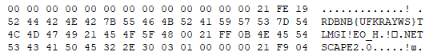</span></p>

<p class=MsoNormal dir=RTL style='text-align:right;direction:rtl;unicode-bidi:
embed'><span lang=HE style='font-family:"Arial",sans-serif'>כלומר, ה-</span><span
lang=EN-US dir=LTR>set</span><span dir=RTL></span><span lang=HE
style='font-family:"Arial",sans-serif'><span dir=RTL></span> שלנו הוא:</span></p>

<p class=MsoNormal><span dir=LTR></span><span lang=EN-US style='font-family:
"Courier New"'><span dir=LTR></span>{UFKRAYWS}TLMGI!EO_H</span></p>

<p class=MsoNormal dir=RTL style='text-align:right;direction:rtl;unicode-bidi:
embed'><span lang=HE style='font-family:"Arial",sans-serif'>כעת נשאר לפצח את
מיקום המערך.</span></p>

<p class=MsoNormal dir=RTL style='text-align:right;direction:rtl;unicode-bidi:
embed'><span lang=HE style='font-family:"Arial",sans-serif'>המערך (</span><span
lang=EN-US dir=LTR>ks</span><span dir=RTL></span><span lang=HE
style='font-family:"Arial",sans-serif'><span dir=RTL></span>) מתחיל את תהליך
ההצפנה בקוד הבא:</span></p>

```python
if ks:
   mpindx, isup = ks.pop(0)
   obuf += h(mpindx, isup, ww, hh, len(global_colors)-1)
```

<p class=MsoNormal dir=RTL style='text-align:right;direction:rtl;unicode-bidi:
embed'><span lang=HE style='font-family:"Arial",sans-serif'>&nbsp;</span></p>

<p class=MsoNormal dir=RTL style='text-align:right;direction:rtl;unicode-bidi:
embed'><span lang=HE style='font-family:"Arial",sans-serif'>הוא מפורק לשני
הגורמים שלו (</span><span lang=EN-US dir=LTR>mpindex, isup</span><span dir=RTL></span><span
lang=HE style='font-family:"Arial",sans-serif'><span dir=RTL></span>) ונשלח
לפונקציית </span><span lang=EN-US dir=LTR>h</span><span dir=RTL></span><span
lang=HE style='font-family:"Arial",sans-serif'><span dir=RTL></span>.</span></p>

```python
def h(b6, b1, mw, mh, mci, d=3):
    idx = randint(0, (mci-1)/2)*2 + b1
    x, xx, xxx, xxxx = m(b6, mw, mh)
    f = Q(d, xxx, xxxx, x, xx, idx)
    return f
```

<p class=MsoNormal dir=RTL style='text-align:right;direction:rtl;unicode-bidi:
embed'><span lang=EN-US dir=LTR>isup</span><span dir=RTL></span><span lang=HE
style='font-family:"Arial",sans-serif'><span dir=RTL></span>, שהוא בוליאני,
מוסתר בתוך הזוגיות של </span><span lang=EN-US dir=LTR>idx</span><span dir=RTL></span><span
lang=HE style='font-family:"Arial",sans-serif'><span dir=RTL></span> (זוגי
-&gt; אות קטנה, אי-זוגי -&gt; אות גדולה).</span></p>

<p class=MsoNormal dir=RTL style='text-align:right;direction:rtl;unicode-bidi:
embed'><span lang=EN-US dir=LTR>mpindex</span><span dir=RTL></span><span
lang=HE style='font-family:"Arial",sans-serif'><span dir=RTL></span> נשלח ל-</span><span
lang=EN-US dir=LTR>m</span><span dir=RTL></span><span lang=HE style='font-family:
"Arial",sans-serif'><span dir=RTL></span> והתוצאה נשלחת ל-</span><span
lang=EN-US dir=LTR>Q</span><span dir=RTL></span><span lang=HE style='font-family:
"Arial",sans-serif'><span dir=RTL></span>.</span></p>

<p class=MsoNormal dir=RTL style='text-align:right;direction:rtl;unicode-bidi:
embed'><span lang=HE style='font-family:"Arial",sans-serif'>פונקציית </span><span
lang=EN-US dir=LTR>m</span><span dir=RTL></span><span lang=HE style='font-family:
"Arial",sans-serif'><span dir=RTL></span> מסתירה את הערך באמצעות מספר
מניפולציות, ואז פונקציית </span><span lang=EN-US dir=LTR>Q</span><span dir=RTL></span><span
lang=HE style='font-family:"Arial",sans-serif'><span dir=RTL></span> כותבת את התוצאה
אל תוך התמונה מיד אחרי </span><span lang=EN-US dir=LTR>magic number</span><span
dir=RTL></span><span lang=HE style='font-family:"Arial",sans-serif'><span
dir=RTL></span>:</span></p>

```python
buf.write('\x21\xF9\x04\x05')
```

<p class=MsoNormal dir=RTL style='text-align:right;direction:rtl;unicode-bidi:
embed'><span lang=HE style='font-family:"Arial",sans-serif'>לכן, כדי למצוא את
הערכים המקוריים, פשוט נפעיל לוגיקה הפוכה לזאת שהפעילה </span><span lang=EN-US
dir=LTR>m</span><span dir=RTL></span><span lang=HE style='font-family:"Arial",sans-serif'><span
dir=RTL></span>:</span></p>

```python
import struct, sys
 
s = "{UFKRAYWS}TLMGI!EO_H"
 
with open(r"secret.gif", "rb") as f:
    content = f.read()
    location = 0
    indices = []
    while True:
        location = content.find(b'\x21\xF9\x04\x05', location+1)
        if location == -1:
            break
       
        (header, delay, tidx, zero, h2c, x, y, w, h, zero2) = struct.unpack_from(b'<IHBBBHHHHB', content, location)
        print ("{:02X}, {:02X}, {:02X}, {:02X}".format(x, y, w, h))
        #print ("{:02X}, {:02X}, {:02X}, {:02X}, {:02X}, {:02X}, {:02X}, {:02X}, {:02X}, {:02X}".format(header, delay, tidx, zero, h2c, x, y, w, h, zero2))
        if x == 0 and y == 0:
            mpindx = w * h
        elif x == 0 and y == 1:
            mpindx = h >> 2
        elif x == 1:
            mpindx = y >> 1
        else:
            print ("!!!!")
        print (mpindx)
        indices.append((mpindx, tidx % 2 == 0))
 
        print ("\n")
 
    for mpindx, isup in indices:
        c = s[mpindx] if not isup else s[mpindx].lower()
        sys.stdout.write(c)
```


<p class=MsoNormal dir=RTL style='text-align:right;direction:rtl;unicode-bidi:
embed'><span lang=HE style='font-family:"Arial",sans-serif'>נריץ ונקבל:</span></p>

<p class=MsoNormal><span lang=EN-US style='font-family:"Courier New"'>flag{thIs_mushRooM_w!lL_maKe_you_tAlLer}</span></p>

<p class=MsoNormal dir=RTL style='text-align:right;direction:rtl;unicode-bidi:
embed'><span lang=HE style='font-family:"Arial",sans-serif'>&nbsp;</span></p>

<p class=MsoNormal dir=RTL style='text-align:right;direction:rtl;unicode-bidi:
embed'><span lang=HE style='font-family:"Arial",sans-serif'>&nbsp;</span></p>

<span lang=HE dir=RTL style='font-size:11.0pt;line-height:107%;font-family:
"Arial",sans-serif'><br clear=all style='page-break-before:always'>
</span>

<p class=MsoNormal><span lang=HE dir=RTL style='font-family:"Arial",sans-serif'>&nbsp;</span></p>

<h2 dir=RTL style='text-align:right;direction:rtl;unicode-bidi:embed'><span
lang=HE style='font-family:"Times New Roman",serif'>אתגר 12 </span><span
lang=HE style='font-family:"Arial",sans-serif'>–</span><span lang=HE
style='font-family:"Times New Roman",serif'> </span><span lang=EN-US dir=LTR>Trace
me if you Can</span><span dir=RTL></span><span lang=HE style='font-family:"Times New Roman",serif'><span
dir=RTL></span> (קטגוריית </span><span lang=EN-US dir=LTR>Surprise</span><span
dir=RTL></span><span lang=HE style='font-family:"Times New Roman",serif'><span
dir=RTL></span>, </span><span dir=LTR></span><span lang=EN-US dir=LTR><span
dir=LTR></span>150</span><span dir=RTL></span><span lang=HE style='font-family:
"Times New Roman",serif'><span dir=RTL></span> נקודות)</span></h2>

<p class=MsoNormal dir=RTL style='text-align:right;direction:rtl;unicode-bidi:
embed'><span lang=HE style='font-family:"Arial",sans-serif'>&nbsp;</span></p>

<p class=MsoNormal dir=RTL style='text-align:right;direction:rtl;unicode-bidi:
embed'><span lang=HE style='font-family:"Arial",sans-serif'>תיאור האתגר:</span></p>

```
Hi There,
We've been working on this one for a while now.
This machine spits out the flag when given the right input.
We're not sure what the input should be but we managed to get this weird looking trace.
Our best minds spent days, but we still can't figure it out!

35.194.63.219:2005

Please help us
```

<p class=MsoNormal dir=RTL style='text-align:right;direction:rtl;unicode-bidi:
embed'><span lang=HE style='font-family:"Arial",sans-serif'>&nbsp;</span></p>

<p class=MsoNormal dir=RTL style='text-align:right;direction:rtl;unicode-bidi:
embed'><span lang=HE style='font-family:"Arial",sans-serif'>הקישור לקובץ הכיל </span><span
lang=EN-US dir=LTR>Trace</span><span dir=RTL></span><span lang=HE
style='font-family:"Arial",sans-serif'><span dir=RTL></span> בייצוג ביניים מסוג
</span><span lang=EN-US dir=LTR>SSA</span><span dir=RTL></span><span lang=HE
style='font-family:"Arial",sans-serif'><span dir=RTL></span> (</span><span
lang=EN-US dir=LTR>Static single assignment form</span><span dir=RTL></span><span
lang=HE style='font-family:"Arial",sans-serif'><span dir=RTL></span>). מיד
נסביר מה זה אומר, אבל לפני הכל – באתגר הזה התשובה שלי לא התקבלה. לכן, אני אסביר
את השלבים שעברתי, אבל עדיין יהיה חסר פה גרוש לשקל. עוד אודה שבמהלך האתגר
התייעצתי עם</span><span dir=LTR></span><span lang=HE dir=LTR><span dir=LTR></span>
</span><span dir=RTL></span><span lang=HE style='font-family:"Arial",sans-serif'><span
dir=RTL></span> </span><span class=MsoHyperlink><span lang=EN-US><a
href="https://twitter.com/YaakovCohen88"><span dir=LTR>YaakovCohen88</span></a></span></span><span
dir=RTL></span><span lang=HE style='font-family:"Arial",sans-serif'><span
dir=RTL></span> מ-</span><span class=MsoHyperlink><span lang=EN-US><a
href="https://writeups.nmontag.com/"><span dir=LTR>JCTF</span></a></span></span><span
dir=RTL></span><span lang=HE style='font-family:"Arial",sans-serif'><span
dir=RTL></span>.</span></p>

<p class=MsoNormal dir=RTL style='text-align:right;direction:rtl;unicode-bidi:
embed'><span lang=HE style='font-family:"Arial",sans-serif'>&nbsp;</span></p>

<p class=MsoNormal dir=RTL style='text-align:right;direction:rtl;unicode-bidi:
embed'><span lang=HE style='font-family:"Arial",sans-serif'>כאשר מקמפלים תוכנה,
הקומפיילר יכול לעבור דרך מספר שלבי ביניים עד שהוא מגיע אל התוצאה הסופית שלו
(למשל: קוד מכונה). </span><span lang=EN-US dir=LTR>SSA</span><span dir=RTL></span><span
lang=HE style='font-family:"Arial",sans-serif'><span dir=RTL></span> הוא
שלב-ביניים כזה, שמתאפיין בכך שכל משתנה מקבל השמה פעם אחת בלבד, וכל משתנה מוגדר
לפני שמשתמשים בו. </span></p>

<p class=MsoNormal dir=RTL style='text-align:right;direction:rtl;unicode-bidi:
embed'><span lang=HE style='font-family:"Arial",sans-serif'>חשוב לשים לב שהקובץ
הכיל </span><span lang=EN-US dir=LTR>Trace</span><span dir=RTL></span><span
lang=HE style='font-family:"Arial",sans-serif'><span dir=RTL></span> של ריצה
בפורמט הזה, ולא ייצוג של קומפילציה של תוכנה ב-</span><span lang=EN-US dir=LTR>SSA</span><span
dir=RTL></span><span lang=HE style='font-family:"Arial",sans-serif'><span
dir=RTL></span>. כלומר, לא קיבלנו תוכנה מלאה, אלא ריצה מסויימת של תוכנה על קלט
מסויים, כשבפועל אנחנו נחשפים אך ורק לפקודות שאכן רצו בריצה המסויימת הזו. איננו
נחשפים לפונקציות שלא נקראו, תנאים שלא התקיימו וכו'.</span></p>

<p class=MsoNormal dir=RTL style='text-align:right;direction:rtl;unicode-bidi:
embed'><span lang=HE style='font-family:"Arial",sans-serif'>הקובץ הכיל
כ-190,000 שורות, אך לשם הדוגמא נצרף קטע קצר (ההערות במקור):</span></p>

```
Starting main.kendrick at /home/gull.omer/go/src/omer/ssa/omerr/version1/ssa.go:238:6.
.0:
        t0 = len(a)
        jump 1
.1:
        t1 = phi [0: 0:int, 2: t7] #damn
        t2 = phi [0: -1:int, 2: t3]
        t3 = t2 + 1:int
        t4 = t3 < t0
        if t4 goto 2 else 3
.2:
        t5 = &a[t3]
        t6 = *t5
        t7 = t1 + t6
        jump 1
.1:
        t1 = phi [0: 0:int, 2: t7] #damn
        t2 = phi [0: -1:int, 2: t3]
        t3 = t2 + 1:int
        t4 = t3 < t0
        if t4 goto 2 else 3
.3:
        return t1
Returning from main.kendrick, proceeding main.main at /home/gull.omer/go/src/omer/ssa/omerr/version1/ssa.go:306:21.
```

<p class=MsoNormal dir=RTL style='text-align:right;direction:rtl;unicode-bidi:
embed'><span lang=EN-US dir=LTR>&nbsp;</span></p>

<p class=MsoNormal dir=RTL style='text-align:right;direction:rtl;unicode-bidi:
embed'><span lang=HE style='font-family:"Arial",sans-serif'>הקטע הזה מייצג את
הריצה של פונקציה בשם </span><span lang=EN-US dir=LTR>Kendrick</span><span
dir=RTL></span><span lang=HE style='font-family:"Arial",sans-serif'><span
dir=RTL></span>. היא מקבלת משתנה בשם </span><span lang=EN-US dir=LTR>a</span><span
dir=RTL></span><span lang=HE style='font-family:"Arial",sans-serif'><span
dir=RTL></span>, ומתייחסת אליו כמערך. </span></p>

<p class=MsoNormal dir=RTL style='text-align:right;direction:rtl;unicode-bidi:
embed'><span lang=HE style='font-family:"Arial",sans-serif'>לאורך הקוד, ניתן
לראות הגדרות של &quot;תוויות&quot; כגון &quot;</span><span dir=LTR></span><span
lang=EN-US dir=LTR><span dir=LTR></span>:0.</span><span dir=RTL></span><span
lang=HE style='font-family:"Arial",sans-serif'><span dir=RTL></span>&quot;, </span><span
dir=LTR></span><span lang=EN-US dir=LTR><span dir=LTR></span>“:1.”</span><span
dir=RTL></span><span lang=HE style='font-family:"Arial",sans-serif'><span
dir=RTL></span> וכו'. תוויות אלו משמשות לניהול הריצה של הפונקציה. למשל, ניהול
של לולאה יכלול בדיקת תנאי ואז קפיצה אל תווית של תוכן הלולאה במקרה אחד, או קפיצה
אל התווית של הלוגיקה שאחרי הלולאה במקרה אחר. למעשה, זה בדיוק מה שאנחנו רואים ב-</span><span
lang=EN-US dir=LTR>Kendrick</span><span dir=RTL></span><span lang=EN-US
style='font-family:"Arial",sans-serif'><span dir=RTL></span> </span><span
lang=HE style='font-family:"Arial",sans-serif'>– התווית &quot;1&quot; היא בדיקת
תנאי הלולאה, התווית &quot;2&quot; היא תוכן הלולאה והתווית &quot;3&quot; היא
הלוגיקה שאחרי הלולאה. בריצה הזו, הלולאה רצה פעם אחת באופן מלא ואז סיימה את
פעולתה. בתרגום ל-</span><span lang=EN-US dir=LTR>Python</span><span dir=RTL></span><span
lang=HE style='font-family:"Arial",sans-serif'><span dir=RTL></span>, הפונקציה
שקולה (כנראה) ל:</span></p>

```python
def kendrick(a): #sum
     damn = 0
     t2 = -1
     while (t2 + 1 < len(a)):
           damn += a[t2 + 1]
           t2 += 1
     return damn
```

<p class=MsoNormal dir=RTL style='text-align:right;direction:rtl;unicode-bidi:
embed'><span lang=HE style='font-family:"Arial",sans-serif'>&nbsp;</span></p>

<p class=MsoNormal dir=RTL style='text-align:right;direction:rtl;unicode-bidi:
embed'><span lang=HE style='font-family:"Arial",sans-serif'>על מנת לתרגם את
הפונקציה, עבדתי בשיטה איטרטיבית של צמצום.</span></p>

<p class=MsoNormal dir=RTL style='text-align:right;direction:rtl;unicode-bidi:
embed'><span lang=HE style='font-family:"Arial",sans-serif'>השלב הראשון:</span></p>

```
.0:
        t0 = len(a)
        jump 1
.1:
        t1 = phi [0: 0:int, 2: t7] #damn
        t2 = phi [0: -1:int, 2: t3]
        t3 = t2 + 1:int
        t4 = t3 < t0
        if t4 goto 2 else 3
.2:
        t5 = &a[t3]
        t6 = *t5
        t7 = t1 + t6
        jump 1
.1:
        t1 = phi [0: 0:int, 2: t7] #damn
        t2 = phi [0: -1:int, 2: t3]
        t3 = t2 + 1:int
        t4 = t3 < t0
        if t4 goto 2 else 3
.3:
        return t1
```

<p class=MsoNormal dir=RTL style='text-align:right;direction:rtl;unicode-bidi:
embed'><span lang=HE style='font-family:"Arial",sans-serif'>בשלב הבא:</span></p>

```
.1:
        t1 = phi [0: 0:int, 2: t7] #damn
        t2 = phi [0: -1:int, 2: t3]
        t3 = t2 + 1:int
        t4 = t3 < len(a)
        if t4 goto 2 else 3
.2:
        t6 = *&a[t3]
        t7 = t1 + t6
        jump 1
.1:
        t1 = phi [0: 0:int, 2: t7] #damn
        t2 = phi [0: -1:int, 2: t3]
        t3 = t2 + 1:int
        t4 = t3 < len(a)
        if t4 goto 2 else 3
.3:
        return t1
```

<p class=MsoNormal dir=RTL style='text-align:right;direction:rtl;unicode-bidi:
embed'><span lang=HE style='font-family:"Arial",sans-serif'>משתנים מסוג </span><span
lang=EN-US dir=LTR>phi</span><span dir=RTL></span><span lang=HE
style='font-family:"Arial",sans-serif'><span dir=RTL></span> הם כאלה שמקבלים
לפעמים ערך אחד ולפעמים ערך אחר. במקרים רבים הערך הראשון הוא ערך התחלתי והערך
השני הוא ערך הריצה.</span></p>

```
damn = 0 # a.k.a. t1, a.k.a. t7
i = -1 # a.k.a. t2, a.k.a. t3

.1:
        i = i+ 1
        if i < len(a) goto 2 else 3
.2:
        damn = damn + a[i]
        jump 1
.1:
        i = i+ 1
        if i < len(a) goto 2 else 3
.3:
        return t1
```

<p class=MsoNormal dir=RTL style='text-align:right;direction:rtl;unicode-bidi:
embed'><span lang=HE style='font-family:"Arial",sans-serif'>ומשם לא קשה להגיע
ללולאה שראינו ב-</span><span lang=EN-US dir=LTR>Python</span><span dir=RTL></span><span
lang=HE style='font-family:"Arial",sans-serif'><span dir=RTL></span>.</span></p>

<p class=MsoNormal dir=RTL style='text-align:right;direction:rtl;unicode-bidi:
embed'><span lang=HE style='font-family:"Arial",sans-serif'>&nbsp;</span></p>

<p class=MsoNormal dir=RTL style='text-align:right;direction:rtl;unicode-bidi:
embed'><span lang=HE style='font-family:"Arial",sans-serif'>באמצעות הלוגיקה
הזו, תרגמתי את ה-</span><span lang=EN-US dir=LTR>Trace</span><span dir=RTL></span><span
lang=HE style='font-family:"Arial",sans-serif'><span dir=RTL></span> כולו:</span></p>

```python
class TraceException(Exception):
    pass
 
def guru(a, b): # Max
     if a > b:
           return a
     else:
           return b
 
def andre(a, b): # Multiply
     t10 = [0] * (len(a) + len(b))
 
     for i in range(len(b)):
           for j in range(len(a)):
                t10[i + j] += (a[j] * b[i])
 
     t21 = len(t10[:len(t10) - 1])
     for i in range(t21):
           if (t10[i] >= 10):
                t10[i + 1] += (t10[i] // 10)
                t10[i] = t10[i] % 10
 
     return t10
 
def rakim(a, b):
     if (doom(a, b) == -1):
           raise TraceException("1")
     else:
           t5 = [None] * len(a)
           for i in range(len(a)):
                a_i = 0
                b_i = 0
                #3
                if i < len(a):
                     #6
                     a_i = a[i]
                #7
                if i < len(b):
                     #8
                     b_i = b[i]
                #9
                if a_i < b_i:
                     #10
                     raise TraceException("2")
                else:
                     #11
                     t5[i] = a_i - b_i
                    
 
           #4
           return t5
 
def doom(aa, bb): # Compare
     """
     ii = len(aa) // 2
     while(ii >= 1):
           if aa[ii] == 0:
                aa[ii] = 0
           else:
                ii -= 1
     """
 
     i = len(aa) - 1
     m = []
     while (i >= 0):
           if aa[i] > 0:
                m = aa[:i + 1]
                break
           else:
                i -= 1
 
     i = len(bb) - 1
     f = []
     while (i >= 0):
           if (bb[i] > 0):
                f = bb[:i + 1]
                break
           else:
                i -= 1
 
     """
     i = len(aa) - 1
     while(i >= 0):
           if aa[i] > 0:
                t43 = 0 + aa[i]
     """
 
     if (len(m) > len(f)):
           return 1
     if (len(m) < len(f)):
           return -1
 
 
     i = len(m) - 1
     #27
     while(i >= 0):
           #25
           if m[i] > f[i]:
                #28
                raise TraceException("3")
           else:
                #29
                if m[i] < m[i]:
                     #30
                     raise TraceException("4")
                else:
                     #31
                     i -= 1
     #26
     return -2
 
def gza(a, b): # Add
     t2 = guru(len(a), len(b))
     t4 = [None] * (t2 + 1)
     r = rakim(a, [0])
     d = doom(a, r)
     if d != -2:
           raise TraceException("5")
 
     wu = 0
     for i in range(len(t4)):
           #4
           if i < len(a):
                #6
                t19 = a[i]
           else:
                t19 = 0 # ?
           #7
           a_i = t19
           if (i < len(b)):
                #8
                t24 = b[i]
           else:
                t24 = 0 # ?
           #9
           b_i = t24
           t27 = a_i + b_i + wu
           wu = t27 // 10
           if t27 >= 10:
                #10
                raise TraceException("6")
           else:
                #11
                tmp = t27
                t4[i] = tmp
     #5
     return t4
 
 
 
def nas(a): # ATOI
 
     #t5 = [0] * ( (len(a) // 2) + (len(a) // 2) )
     t5 = []
 
     z = 0
     msg = t5
     i = len(a) - 1
     while(i >= 0):
           t10 = ord(a[i]) - 48
           if (t10 >= 0) and (t10 < 10):
                z += t10
                msg.append(guru(t10, 0))
 
           if (z == 1024):
                raise TraceException ("7")
           else:
                i -= 1
    
     return msg
 
 
def kendrick(a): # Sum
     damn = 0
     t2 = -1
     while (t2 + 1 < len(a)):
          damn += a[t2 + 1]
           t2 += 1
     return damn
 
###################
 
def main(my_input):
 
     t8 = my_input
     t11 = t8.split(" ")
     print ("Input length: {}".format(len(t11)))
     t13 = [None] * len(t11)
 
     for i in range(len(t11)):
           t13[i] = int(t11[i])
    
 
     t27 = andre([1], [0, 1])         # 10 * 1
     t32 = gza([0, 2], t27)           # + 20
     t37 = gza([0, 2], t32)           # + 20
     t42 = andre([guru(2, 1)], t37)   # * 2
     t45 = nas(str(len(t13)))        #
     t46 = doom(t45, t42)            # == 100?
     if t46 != -2:
           raise TraceException ("8 - Input Length != 100")
    
     for i in range(len(t13)):
           if t13[i] <= 0:
                raise TraceException("9 - Non-Positive Member!")
 
     t58 = [None] * (len(t13) // 2)
 
     for i in range(len(t58)):
           t58[i] = t13[i * 2] - t13[(i * 2) + 1]
 
     for i in range(len(t58)):
           t80 = nas(str(kendrick(t58[:i + 1])))
           t84 = doom(t80, [0])
           if t84 == -1:
                raise TraceException("10")
 
     o_su = 0
     e_su = 0
     for i in range(0, len(t13) - 1, 2):
           e_su +=  t13[i]
           o_su +=  t13[i + 1]
 
     if o_su != e_su:
           raise TraceException("11 - o_su != e_su ({} != {})".format(o_su, e_su))
 
     u_arr = []
     x = 0
     for i in range(len(t13)):
           if x < len(u_arr):
                raise TraceException("12")
 
 
     if t13[49] != 102:
           raise TraceException("13 - t13[49] != 102")
 
     if t13[4] - t13[5] != t13[8]:
           raise TraceException("14 - t13[4] - t13[5] != t13[8]")
 
 
if __name__ == "__main__":
     input_arr = ( [1, 1, 1, 1, 5, 2, 1, 1, 3] + ([1] * 40) + [102, 102] + ([1] * 47) + [1, 6] )
     input_str = ' '.join([str(num) for num in input_arr])
     print (input_str)
 
     main(input_str)
```

<p class=MsoNormal dir=RTL style='text-align:right;direction:rtl;unicode-bidi:
embed'><span lang=HE style='font-family:"Arial",sans-serif'>נקודות ראויות
לציון:</span></p>

<p class=MsoListParagraphCxSpFirst dir=RTL style='margin-top:0cm;margin-right:
36.0pt;margin-bottom:8.0pt;margin-left:0cm;text-align:right;text-indent:-18.0pt;
direction:rtl;unicode-bidi:embed'><span lang=EN-US style='font-family:Symbol'>·<span
style='font:7.0pt "Times New Roman"'>&nbsp;&nbsp;&nbsp;&nbsp;&nbsp;&nbsp;&nbsp;&nbsp;
</span></span><span dir=RTL></span><span lang=HE style='font-family:"Arial",sans-serif'>התוכנה
מקבלת קלט של מחרוזת ארוכה, מפצלת אותו לפי רווחים, מתייחסת לכל איבר כמספר ובודקת
שמערך המספרים מתאים לכללים שהוגדרו מראש.</span></p>

<p class=MsoListParagraphCxSpMiddle dir=RTL style='margin-top:0cm;margin-right:
36.0pt;margin-bottom:8.0pt;margin-left:0cm;text-align:right;text-indent:-18.0pt;
direction:rtl;unicode-bidi:embed'><span lang=EN-US style='font-family:Symbol'>·<span
style='font:7.0pt "Times New Roman"'>&nbsp;&nbsp;&nbsp;&nbsp;&nbsp;&nbsp;&nbsp;&nbsp;
</span></span><span dir=RTL></span><span lang=HE style='font-family:"Arial",sans-serif'>כאשר
אחד הכללים מופר, התוכנה המקורית הרימה דגל. במימוש שלי זרקתי </span><span
lang=EN-US dir=LTR>Exception</span><span dir=RTL></span><span lang=HE
style='font-family:"Arial",sans-serif'><span dir=RTL></span>. כמו כן, בחרתי
לזרוק </span><span lang=EN-US dir=LTR>Exception</span><span dir=RTL></span><span
lang=HE style='font-family:"Arial",sans-serif'><span dir=RTL></span> כאשר
הלוגיקה הייתה חסרה מה-</span><span lang=EN-US dir=LTR>Trace</span><span
dir=RTL></span><span lang=HE style='font-family:"Arial",sans-serif'><span
dir=RTL></span> (למשל: תנאי שמעולם לא התממש בריצה).</span></p>

<p class=MsoListParagraphCxSpMiddle dir=RTL style='margin-top:0cm;margin-right:
36.0pt;margin-bottom:8.0pt;margin-left:0cm;text-align:right;text-indent:-18.0pt;
direction:rtl;unicode-bidi:embed'><span lang=EN-US style='font-family:Symbol'>·<span
style='font:7.0pt "Times New Roman"'>&nbsp;&nbsp;&nbsp;&nbsp;&nbsp;&nbsp;&nbsp;&nbsp;
</span></span><span dir=RTL></span><span lang=HE style='font-family:"Arial",sans-serif'>התוכנה
מייצגת מספרים בתור מערך הפוך. למשל, המספר 10 מיוצג בתור </span><span dir=LTR></span><span
lang=EN-US dir=LTR><span dir=LTR></span>[0, 1]</span><span dir=RTL></span><span
lang=HE style='font-family:"Arial",sans-serif'><span dir=RTL></span>. פונקציות
העזר של התוכנה משמשות לביצוע פעולות מתמטיות בסיסיות על המספרים בייצוג זה,
כדוגמת חיבור, כפל והשוואה.</span></p>

<p class=MsoListParagraphCxSpMiddle dir=RTL style='margin-top:0cm;margin-right:
36.0pt;margin-bottom:8.0pt;margin-left:0cm;text-align:right;text-indent:-18.0pt;
direction:rtl;unicode-bidi:embed'><span lang=EN-US style='font-family:Symbol'>·<span
style='font:7.0pt "Times New Roman"'>&nbsp;&nbsp;&nbsp;&nbsp;&nbsp;&nbsp;&nbsp;&nbsp;
</span></span><span dir=RTL></span><span lang=HE style='font-family:"Arial",sans-serif'>לעיתים
התוכנה ביצעה פעולות שאין להן משמעות, כדוגמת קטע הקוד בתחילת פונקציית </span><span
lang=EN-US dir=LTR>doom</span><span dir=RTL></span><span lang=HE
style='font-family:"Arial",sans-serif'><span dir=RTL></span> (במקרה זה למשל
השארתי את הקוד כהערה). </span></p>

<p class=MsoListParagraphCxSpMiddle dir=RTL style='margin-top:0cm;margin-right:
36.0pt;margin-bottom:8.0pt;margin-left:0cm;text-align:right;text-indent:-18.0pt;
direction:rtl;unicode-bidi:embed'><span lang=EN-US style='font-family:Symbol'>·<span
style='font:7.0pt "Times New Roman"'>&nbsp;&nbsp;&nbsp;&nbsp;&nbsp;&nbsp;&nbsp;&nbsp;
</span></span><span dir=RTL></span><span lang=HE style='font-family:"Arial",sans-serif'>הכללים
שהתוכנה אוכפת:</span></p>

<p class=MsoListParagraphCxSpMiddle dir=RTL style='margin-top:0cm;margin-right:
72.0pt;margin-bottom:8.0pt;margin-left:0cm;text-align:right;text-indent:-18.0pt;
direction:rtl;unicode-bidi:embed'><span lang=EN-US style='font-family:"Courier New"'>o<span
style='font:7.0pt "Times New Roman"'>&nbsp;&nbsp;&nbsp;&nbsp;&nbsp;&nbsp;&nbsp;
</span></span><span dir=RTL></span><span lang=HE style='font-family:"Arial",sans-serif'>מספר
האיברים בקלט צריך להיות 100</span></p>

<p class=MsoListParagraphCxSpMiddle dir=RTL style='margin-top:0cm;margin-right:
72.0pt;margin-bottom:8.0pt;margin-left:0cm;text-align:right;text-indent:-18.0pt;
direction:rtl;unicode-bidi:embed'><span lang=EN-US style='font-family:"Courier New"'>o<span
style='font:7.0pt "Times New Roman"'>&nbsp;&nbsp;&nbsp;&nbsp;&nbsp;&nbsp;&nbsp;
</span></span><span dir=RTL></span><span lang=HE style='font-family:"Arial",sans-serif'>כל
האיברים צריכים להיות חיוביים</span></p>

<p class=MsoListParagraphCxSpMiddle dir=RTL style='margin-top:0cm;margin-right:
72.0pt;margin-bottom:8.0pt;margin-left:0cm;text-align:right;text-indent:-18.0pt;
direction:rtl;unicode-bidi:embed'><span lang=EN-US style='font-family:"Courier New"'>o<span
style='font:7.0pt "Times New Roman"'>&nbsp;&nbsp;&nbsp;&nbsp;&nbsp;&nbsp;&nbsp;
</span></span><span dir=RTL></span><span lang=HE style='font-family:"Arial",sans-serif'>סכום
האיברים במקומות הזוגיים והאי-זוגיים צריך להיות שווה</span></p>

<p class=MsoListParagraphCxSpMiddle dir=RTL style='margin-top:0cm;margin-right:
72.0pt;margin-bottom:8.0pt;margin-left:0cm;text-align:right;text-indent:-18.0pt;
direction:rtl;unicode-bidi:embed'><span lang=EN-US style='font-family:"Courier New"'>o<span
style='font:7.0pt "Times New Roman"'>&nbsp;&nbsp;&nbsp;&nbsp;&nbsp;&nbsp;&nbsp;
</span></span><span dir=RTL></span><span lang=HE style='font-family:"Arial",sans-serif'>האיבר
ה-49 צריך להיות 102</span></p>

<p class=MsoListParagraphCxSpMiddle dir=RTL style='margin-top:0cm;margin-right:
72.0pt;margin-bottom:8.0pt;margin-left:0cm;text-align:right;text-indent:-18.0pt;
direction:rtl;unicode-bidi:embed'><span lang=EN-US style='font-family:"Courier New"'>o<span
style='font:7.0pt "Times New Roman"'>&nbsp;&nbsp;&nbsp;&nbsp;&nbsp;&nbsp;&nbsp;
</span></span><span dir=RTL></span><span lang=HE style='font-family:"Arial",sans-serif'>האיבר
הרביעי פחות האיבר החמישי צריך להיות שווה לאיבר ה-13</span></p>

<p class=MsoListParagraphCxSpLast dir=RTL style='margin-top:0cm;margin-right:
72.0pt;margin-bottom:8.0pt;margin-left:0cm;text-align:right;text-indent:-18.0pt;
direction:rtl;unicode-bidi:embed'><span lang=EN-US style='font-family:"Courier New"'>o<span
style='font:7.0pt "Times New Roman"'>&nbsp;&nbsp;&nbsp;&nbsp;&nbsp;&nbsp;&nbsp;
</span></span><span dir=RTL></span><span lang=HE style='font-family:"Arial",sans-serif'>שאר
התנאים שקיימים ב-</span><span lang=EN-US dir=LTR>main</span><span dir=RTL></span><span
lang=HE style='font-family:"Arial",sans-serif'><span dir=RTL></span> מתממשים
תמיד, בין השאר עקב מגבלות המימוש של פונקציות העזר (לפי מיטב הבנתי)</span></p>

<p class=MsoNormal dir=RTL style='text-align:right;direction:rtl;unicode-bidi:
embed'><span lang=HE style='font-family:"Arial",sans-serif'>בפועל, למרבה הצער,
השרת של האתגר לא הסכים לקבל קלטים שצייתו לכללים הללו. בשלב מסוים ייצרתי </span><span
lang=EN-US dir=LTR>KeyGen</span><span dir=RTL></span><span lang=HE
style='font-family:"Arial",sans-serif'><span dir=RTL></span> בתקווה לייצר שונות
כלשהי בקלטים שאני מנסה, למקרה שמשהו לא תקין בקלט הספציפי שייצרתי ידנית, אולם
השרת המשיך לדחות את התשובה. לכן כנראה שחסר תנאי כלשהו, או קיימת בעיה כלשהי
במימוש שלי. ואף על פי כן, הלוגיקה שמשתקפת ב-</span><span lang=EN-US dir=LTR>Reversing</span><span
dir=RTL></span><span lang=HE style='font-family:"Arial",sans-serif'><span
dir=RTL></span> של ה-</span><span lang=EN-US dir=LTR>Trace</span><span dir=RTL></span><span
lang=HE style='font-family:"Arial",sans-serif'><span dir=RTL></span> מסתדרת עם
סוג האתגר ומתאימה יחדיו בצורה יחסית טובה, ולכן אני מאמין שלא הייתי רחוק מדי
מהתשובה הנכונה.</span></p>

<span lang=HE dir=RTL style='font-size:11.0pt;line-height:107%;font-family:
"Arial",sans-serif'><br clear=all style='page-break-before:always'>
</span>

<p class=MsoNormal><span lang=HE dir=RTL style='font-size:13.0pt;line-height:
107%;font-family:"Times New Roman",serif;color:#2F5496'>&nbsp;</span></p>

<p class=MsoNormal dir=RTL style='text-align:right;direction:rtl;unicode-bidi:
embed'><span lang=HE style='font-family:"Arial",sans-serif'>&nbsp;</span></p>
