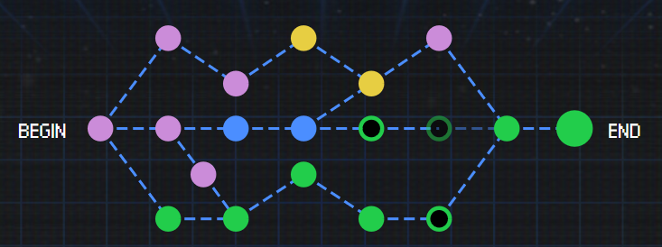

# Google CTF - Beginner's Quest (2018)

> Cakes... Throughout history they are long promised, not often delivered. Are they real?
> 
> Are they fabrications of an internal system long designed to tease and tempt you with promises of sweet confectionary goodness that will satisfy and delight? Or the realistic truth of the matter. A dark conspiracy involving many clandestine organisations that want to create content and context around the very existence of this delicacy.
> 
> Your task, uncover the truth, find the cake and show it to the world. Set the truth free.
> 
> You do not have to start this undermining of the Cake-World-Order (cWo) without any information. Our informants deep in the field (some no longer with us), have passed on intel about an operative within the cWo known as Wintermuted. Their home is a mess of old technologies, poor Operational Security (Op-Sec) and Internet of Things (IoT) devices that haven't seen updates in decades, despite being released last year. Start with their rubbish bin! Surely there is a letter or toothpaste tube there with some information that'll get you on the inside.
> 
> Your goal is to get the cake in the fridge... Where else would you put cake in your smart home?

Various writeups for the 2018 Google CTF Beginner's Quest.

My path to the cake:

