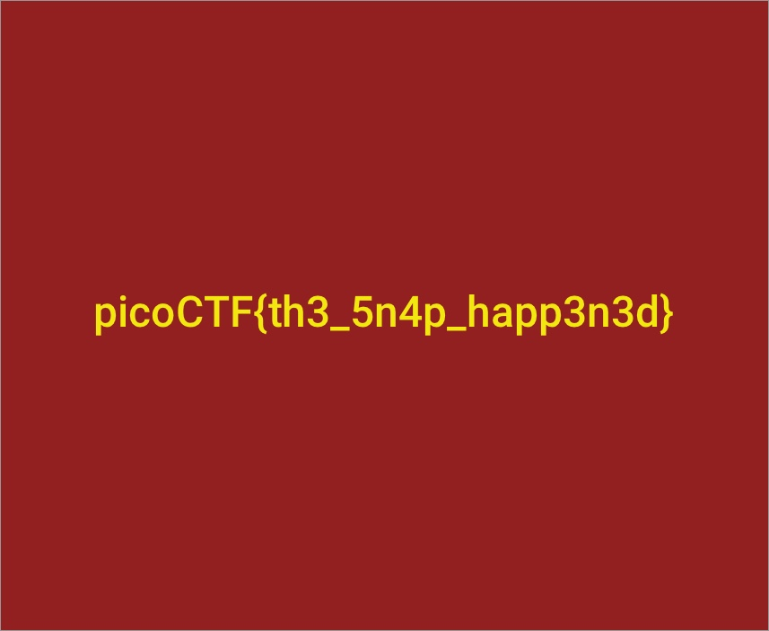

# Recovering From the Snap
Forensics, 150 points

## Description:
> There used to be a bunch of animals here, what did Dr. Xernon do to them? 

Attached was a binary file ("animals.dd").

## Solution:
First, let's inspect the binary file:

```console
root@kali:/media/sf_CTFs/pico/Recovering_From_the_Snap/v2# file animals.dd 
animals.dd: DOS/MBR boot sector, code offset 0x3c+2, OEM-ID "mkfs.fat", sectors/cluster 4, root entries 512, sectors 20480 (volumes <=32 MB), Media descriptor 0xf8, sectors/FAT 20, sectors/track 32, heads 64, serial number 0x9b664dde, unlabeled, FAT (16 bit)
```

It looks like a FAT file system.

`7z` is usually able to extract those:
```console
root@kali:/media/sf_CTFs/pico/Recovering_From_the_Snap/v2# 7z e animals.dd -oout

7-Zip [64] 16.02 : Copyright (c) 1999-2016 Igor Pavlov : 2016-05-21
p7zip Version 16.02 (locale=en_IL,Utf16=on,HugeFiles=on,64 bits,1 CPU Intel(R) Core(TM) i5-4330M CPU @ 2.80GHz (306C3),ASM,AES-NI)

Scanning the drive for archives:
1 file, 10485760 bytes (10 MiB)

Extracting archive: animals.dd
--       
Path = animals.dd
Type = FAT
Physical Size = 10485760
File System = FAT16
Cluster Size = 2048
Free Space = 8706048
Headers Size = 37376
Sector Size = 512
ID = 2607173086

Everything is Ok

Files: 4
Size:       1736281
Compressed: 10485760
root@kali:/media/sf_CTFs/pico/Recovering_From_the_Snap/v2# ls out
dachshund.jpg  frog.jpg  music.jpg  rabbit.jpg
```

However, none of the files have the flag.

Let's see what `foremost` can tell us about the file:
```console
root@kali:/media/sf_CTFs/pico/Recovering_From_the_Snap/v2# foremost -v animals.dd 
Foremost version 1.5.7 by Jesse Kornblum, Kris Kendall, and Nick Mikus
Audit File

Foremost started at Tue Oct 30 22:47:22 2018
Invocation: foremost -v animals.dd 
Output directory: /media/sf_CTFs/pico/Recovering_From_the_Snap/v2/output
Configuration file: /etc/foremost.conf
Processing: animals.dd
|------------------------------------------------------------------
File: animals.dd
Start: Tue Oct 30 22:47:22 2018
Length: 10 MB (10485760 bytes)
 
Num	 Name (bs=512)	       Size	 File Offset	 Comment 

0:	00000077.jpg 	     617 KB 	      39424 	 
1:	00001313.jpg 	     481 KB 	     672256 	 
2:	00002277.jpg 	     380 KB 	    1165824 	 
3:	00003041.jpg 	     248 KB 	    1556992 	 
4:	00003541.jpg 	     314 KB 	    1812992 	 
5:	00004173.jpg 	     458 KB 	    2136576 	 
6:	00005093.jpg 	     383 KB 	    2607616 	 
7:	00005861.jpg 	      39 KB 	    3000832 	 
*|
Finish: Tue Oct 30 22:47:23 2018

8 FILES EXTRACTED
	
jpg:= 8
------------------------------------------------------------------

Foremost finished at Tue Oct 30 22:47:23 2018
```

This time we get 8 JPEG images.
The flag is hidden in 00005861.jpg:


