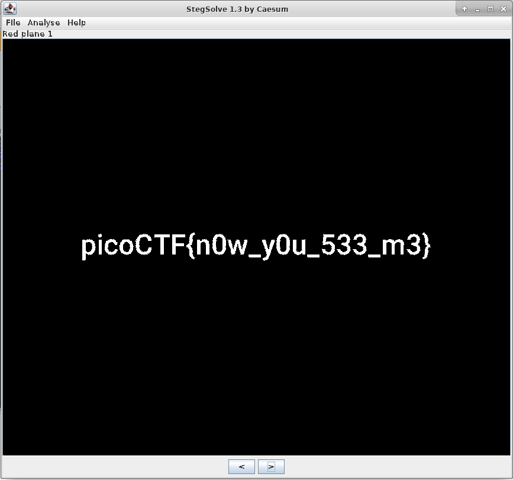

# now you don't
Forensics, 200 points

## Description:
> We heard that there is something hidden in this picture. Can you find it?  

## Solution:

Browsing through the different planes using [StegSolve](https://github.com/eugenekolo/sec-tools/tree/master/stego/stegsolve/stegsolve) reveals the flag hiding in "Red plane 1":

[This method](https://www.wikihow.com/Create-Hidden-Watermarks-in-GIMP) works as well, but takes longer.

The flag: picoCTF{n0w_y0u_533_m3}