# DoSaTTaCK
* Category: Reverse Engineering 
* 1200 Points
* Solved by the JCTF Team

## Description
> What is this file and how can it help you get the flag?

Attached was a file called `challenge.flp`.

## Solution

Let's inspect this file:
```console
root@kali:/media/sf_CTFs/bsidestlv/DoSaTTaCK# file challenge.flp
challenge.flp: DOS/MBR boot sector, code offset 0x58+2, OEM-ID "WINIMAGE", sectors/cluster 2, root entries 112, sectors 640 (volumes <=32 MB), Media descriptor 0xfd, sectors/FAT 1, sectors/track 8, serial number 0x22550c8e, label: "           ", FAT (12 bit), followed by FAT
```

This looks like an image of a floppy disk, 7Zip can usually extract these files:
```console
root@kali:/media/sf_CTFs/bsidestlv/DoSaTTaCK# 7z e challenge.flp

7-Zip [64] 16.02 : Copyright (c) 1999-2016 Igor Pavlov : 2016-05-21
p7zip Version 16.02 (locale=en_IL,Utf16=on,HugeFiles=on,64 bits,1 CPU Intel(R) Core(TM) i5-4330M CPU @ 2.80GHz (306C3),ASM,AES-NI)

Scanning the drive for archives:
1 file, 327680 bytes (320 KiB)

Extracting archive: challenge.flp
--
Path = challenge.flp
Type = FAT
Physical Size = 327680
File System = FAT12
Cluster Size = 1024
Free Space = 266240
Headers Size = 7168
Sector Size = 512
ID = 575999118

Everything is Ok

Folders: 2
Files: 3
Size:       52676
Compressed: 327680

root@kali:/media/sf_CTFs/bsidestlv/DoSaTTaCK# ls -al
drwxrwx--- 1 root vboxsf   4096 Jun 21 13:08  .
drwxrwx--- 1 root vboxsf   4096 Jun 20 19:23  ..
-rwxrwx--- 1 root vboxsf 327680 Jun 11 19:10  challenge.flp
-rwxrwx--- 1 root vboxsf  17216 Apr  6  1992  CLIENT.EXE
-rwxrwx--- 1 root vboxsf  11892 Sep 26  1987  MAIN.ENC
-rwxrwx--- 1 root vboxsf  23568 Apr  6  1992  SERVER.EXE
```

We have three pretty old executable files (dated 1987 and 1992):
```console
root@kali:/media/sf_CTFs/bsidestlv/DoSaTTaCK# file CLIENT.EXE
CLIENT.EXE: MS-DOS executable, NE for MS Windows 3.x
root@kali:/media/sf_CTFs/bsidestlv/DoSaTTaCK# file SERVER.EXE
SERVER.EXE: MS-DOS executable, NE for MS Windows 3.x
root@kali:/media/sf_CTFs/bsidestlv/DoSaTTaCK# file MAIN.ENC
MAIN.ENC: MS-DOS executable, MZ for MS-DOS
```

Two of them are NE ([New Executable](https://en.wikipedia.org/wiki/New_Executable)) files for Windows 3.x, and one looks like a standard [MZ file](https://en.wikipedia.org/wiki/DOS_MZ_executable) for DOS.

If we try to rename `MAIN.ENC` to `MAIN.EXE` and run it via [DOSBox](https://www.dosbox.com/) (a cool emulator program which emulates an IBM PC compatible computer running a DOS operating system) - DOSBox itself immediately crashes. Perhaps we will have more luck by running the client and server?

Peeking into the assembly of the executables, we see that they are supposed to be run under Windows 3.1 only:
```console
root@kali:/media/sf_CTFs/bsidestlv/DoSaTTaCK# strings CLIENT.EXE | grep Windows
This program requires Microsoft Windows.
=Windows TTY Sample Application (c) 1991 Microsoft Corporation
Run under Windows 3.1 Only
root@kali:/media/sf_CTFs/bsidestlv/DoSaTTaCK# strings SERVER.EXE | grep Windows
This program requires Microsoft Windows.
=Windows TTY Sample Application (c) 1991 Microsoft Corporation
Run under Windows 3.1 Only
Microsoft Windows v.%d.%d
```

Some retro gaming sites offer packages which allow running old games on Windows 3.11. We can use one of those to run the executables and see what happens:

Running the server:

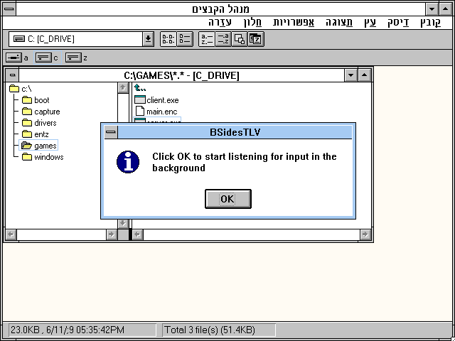

Running the client:

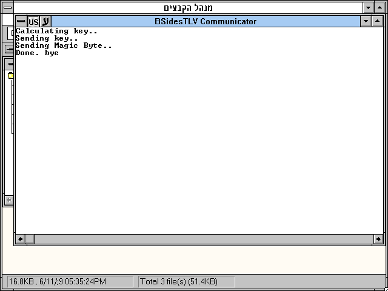

Looks like they are trying to communicate in some way (obviously, given they are a client and server) but nothing seems to happen.

Time to open a disassembler and try to understand was supposed to happen.

A few words about the NE (New Executable) format, from Wikipedia:
> The New Executable (abbreviated NE or NewEXE) is a 16-bit .exe file format, a successor to the DOS MZ executable format. It was used in Windows 1.0–3.x, multitasking MS-DOS 4.0 [...].
>
> The first product to be released using the New Executable format was Windows 1.0 in 1985, followed by the 1986 multitasking MS-DOS 4.0, which was a separate branch of MS-DOS development, released between mainstream MS-DOS versions 3.2 and 3.3, and sometimes referred to as "European MS-DOS 4.0".
> 
> [...]
> 
> The Portable Executable (PE) format replaced NE format in 32-bit and 64-bit versions of Windows [...].

Why is this important? Because support for NE files in modern disassemblers is usually partial at most. IDA Free doesn't support it (IDA Pro does, but is pretty expensive). Ghidra has partial support but basic functionality such as string referencing isn't supported. In this writeup, we'll use a tool called `W32Dasm` (version 10.0) which probably is much less convenient than IDA-Pro, but can be used freely.

We'll start from the client. After opening CLIENT.EXE in the disassembler, we click the "String Data References" button and get the following string references:

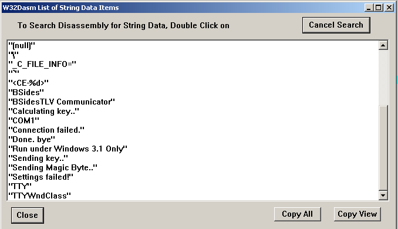

Since "Calculating Key" was the first string printed to the console, let's search for it.

The reference brings us to the following function:

```assembly
* Referenced by a CALL at Address:
|:0001.01B6
|
:0001.0076 C85E0100               enter 015E, 00
:0001.007A 57                     push di
:0001.007B 56                     push si
:0001.007C 8B4606                 mov ax, [bp+06]
:0001.007F A37200                 mov word ptr [0072], ax

* Possible StringData Ref from Data Seg 002 ->"Calculating key.."
                                  |
:0001.0082 687400                 push 0074
:0001.0085 0E                     push cs
:0001.0086 E8C3FF                 call 004C
:0001.0089 83C402                 add sp, 0002
:0001.008C 9AFFFF0000             call KERNEL.GETCURRENTTASK
:0001.0091 8946FC                 mov [bp-04], ax
:0001.0094 8BC8                   mov cx, ax
:0001.0096 2BDB                   sub bx, bx
:0001.0098 899EA8FE               mov [bp+FEA8], bx
:0001.009C 8986AAFE               mov [bp+FEAA], ax
:0001.00A0 81C3FA00               add bx, 00FA
:0001.00A4 83D100                 adc cx, 0000
:0001.00A7 8EC1                   mov es, cx
:0001.00A9 8BC8                   mov cx, ax
:0001.00AB 8BB6A8FE               mov si, [bp+FEA8]
:0001.00AF 81C6B400               add si, 00B4
:0001.00B3 83D100                 adc cx, 0000
:0001.00B6 8CC0                   mov ax, es
:0001.00B8 899EA4FE               mov [bp+FEA4], bx
:0001.00BC 8C86A6FE               mov [bp+FEA6], es
:0001.00C0 8EC1                   mov es, cx
:0001.00C2 268A6401               mov ah, es:[si+01]
:0001.00C6 2AC0                   sub al , al 
:0001.00C8 268A0C                 mov cl , es:[si]
:0001.00CB 2AED                   sub ch, ch
:0001.00CD 03C1                   add ax, cx
:0001.00CF 2D3953                 sub ax, 5339
:0001.00D2 8BC8                   mov cx, ax
:0001.00D4 2BD2                   sub dx, dx
:0001.00D6 8E86A6FE               mov es, [bp+FEA6]
:0001.00DA 2AC0                   sub al , al 
:0001.00DC 268A6701               mov ah, es:[bx+01]
:0001.00E0 8986A2FE               mov [bp+FEA2], ax
:0001.00E4 268A07                 mov al , es:[bx]
:0001.00E7 2AE4                   sub ah, ah
:0001.00E9 0386A2FE               add ax, [bp+FEA2]
:0001.00ED 2D5443                 sub ax, 4354
:0001.00F0 03D0                   add dx, ax
:0001.00F2 83D100                 adc cx, 0000
:0001.00F5 1E                     push ds
:0001.00F6 8DBEACFE               lea di, [bp+FEAC]
:0001.00FA 8BF2                   mov si, dx
:0001.00FC 8CD0                   mov ax, ss
:0001.00FE 8EC0                   mov es, ax
:0001.0100 8ED9                   mov ds, cx
:0001.0102 B98000                 mov cx, 0080
:0001.0105 F3                     repz
:0001.0106 A5                     movsw
:0001.0107 1F                     pop ds

* Possible StringData Ref from Data Seg 002 ->"Sending key.."
                                  |
:0001.0108 688800                 push 0088
:0001.010B 0E                     push cs
:0001.010C E83DFF                 call 004C
:0001.010F 83C402                 add sp, 0002

* Possible StringData Ref from Data Seg 002 ->"Sending Magic Byte.."
                                  |
:0001.0112 689800                 push 0098
:0001.0115 0E                     push cs
:0001.0116 E833FF                 call 004C
:0001.0119 83C402                 add sp, 0002
:0001.011C 689100                 push 0091
:0001.011F FF7606                 push word ptr [bp+06]
:0001.0122 E8CD0E                 call 0FF2
:0001.0125 83C404                 add sp, 0004
:0001.0128 8D86ACFE               lea ax, [bp+FEAC]
:0001.012C 8946FE                 mov [bp-02], ax
:0001.012F 8BF0                   mov si, ax
:0001.0131 8B7E06                 mov di, [bp+06]

* Referenced by a (U)nconditional or (C)onditional Jump at Address:
|:0001.0164(C)
|
:0001.0134 8A04                   mov al , [si]
:0001.0136 2AE4                   sub ah, ah
:0001.0138 50                     push ax

* Possible StringData Ref from Data Seg 002 ->"%02X"
                                  |
:0001.0139 68AF00                 push 00AF
:0001.013C 8D46AC                 lea ax, [bp-54]
:0001.013F 50                     push ax
:0001.0140 9A402D2802             call 0001.2D40
:0001.0145 83C406                 add sp, 0006
:0001.0148 8A46AC                 mov al , [bp-54]
:0001.014B 50                     push ax
:0001.014C 57                     push di
:0001.014D E8A20E                 call 0FF2
:0001.0150 83C404                 add sp, 0004
:0001.0153 8A46AD                 mov al , [bp-53]
:0001.0156 50                     push ax
:0001.0157 57                     push di
:0001.0158 E8970E                 call 0FF2
:0001.015B 83C404                 add sp, 0004
:0001.015E 46                     inc si
:0001.015F 8D46AC                 lea ax, [bp-54]
:0001.0162 3BF0                   cmp si, ax
:0001.0164 72CE                   jb 0134

* Possible StringData Ref from Data Seg 002 ->"Done. bye"
                                  |
:0001.0166 68B400                 push 00B4
:0001.0169 0E                     push cs
:0001.016A E8DFFE                 call 004C
:0001.016D 83C402                 add sp, 0002
:0001.0170 5E                     pop si
:0001.0171 5F                     pop di
:0001.0172 C9                     leave
:0001.0173 CB                     retf
```

Even without diving into all the details, we can make a few basic observations:
* `call 004C` looks like the "Print" function, since before calling it, we can see the program push the strings that appeared in the program output
* `call 0FF2` looks like the "Send" function. It's called once with a parameter of 0x91 (the magic byte?) and then in a loop (the key?). The sending loop seems to use a format specifier of "%02X" to extract bytes before sending them.

How is the data being sent? Here's the function at 0xFF2:
```assembly
* Referenced by a CALL at Addresses:
|:0001.0122, :0001.014D, :0001.0158, :0001.0CDE
|
:0001.0FF2 55                     push bp
:0001.0FF3 8BEC                   mov bp, sp
:0001.0FF5 56                     push si
:0001.0FF6 FF7604                 push word ptr [bp+04]
:0001.0FF9 6A00                   push 0000
:0001.0FFB 9A2C100000             call USER.GETWINDOWWORD
:0001.1000 8BF0                   mov si, ax
:0001.1002 0BF0                   or si, ax
:0001.1004 7506                   jne 100C
:0001.1006 33C0                   xor ax, ax
:0001.1008 5E                     pop si
:0001.1009 C9                     leave
:0001.100A C3                     ret


:0001.100B 90                     nop

* Referenced by a (U)nconditional or (C)onditional Jump at Address:
|:0001.1004(C)
|
:0001.100C FF34                   push word ptr [si]
:0001.100E 8D4606                 lea ax, [bp+06]
:0001.1011 16                     push ss
:0001.1012 50                     push ax
:0001.1013 6A01                   push 0001
:0001.1015 9AFFFF0000             call USER.WRITECOMM
:0001.101A B80100                 mov ax, 0001
:0001.101D 5E                     pop si
:0001.101E C9                     leave
:0001.101F C3                     ret
```

It is calling `WRITECOMM`, which is used for serial communication. And the strings window mentioned COM1, which is referenced by:
```assembly
* Possible StringData Ref from Data Seg 002 ->"COM1"
                                  |
:0001.0D32 680301                 push 0103
:0001.0D35 680010                 push 1000
:0001.0D38 680010                 push 1000
:0001.0D3B 9AFFFF0000             call USER.OPENCOMM
```

So it looks like COM1 is used for the communication.

Let's setup COM1 and allow the programs to communicate.

DOSBox supports serial communication, we just need to open the DOSBox configuration file (`dosbox.conf`) and change `serial1=dummy` to `serial1=directserial realport:com1`. Now the DOSBox COM1 port is connected to the physical COM1 port on our host. 

Wait, what? This is 2019, we don't have a physical COM1 port on our host. We can download software to create a virtual COM1 port, but let's just use something we already have installed - VirtualBox. We just need to copy DOSBox into an existing virtual machine and configure the serial connection.

VirtualBox has several options to configure a COM port (see [here](https://www.virtualbox.org/manual/ch03.html#serialports)).

We'll use the TCP Socket:
>  TCP Socket: Useful for forwarding serial traffic over TCP/IP, acting as a server, or it can act as a TCP client connecting to other servers. This option enables a remote machine to directly connect to the guest's serial port using TCP.
> 
> *    TCP Server: Deselect the Connect to Existing Pipe/Socket check box and specify the port number in the Path/Address field. This is typically 23 or 2023. Note that on UNIX-like systems you will have to use a port a number greater than 1024 for regular users. The client can use software such as PuTTY or the telnet command line tool to access the TCP Server.
> 
> *    TCP Client: To create a virtual null-modem cable over the Internet or LAN, the other side can connect using TCP by specifying hostname:port in the Path/Address field. The TCP socket will act in client mode if you select the Connect to Existing Pipe/Socket check box. 

First, we'd like client to send us the key, so we'll setup a virtual COM port as a client and implement a TCP server. 

The implementation:

```python
import socket
import sys

TCP_IP = '127.0.0.1'
TCP_PORT = 5005
BUFFER_SIZE = 0x200

s = socket.socket(socket.AF_INET, socket.SOCK_STREAM)
s.bind((TCP_IP, TCP_PORT))
s.listen(1)

conn, addr = s.accept()
sys.stderr.write('Connection address: {}'.format(addr))
while True:
    data = conn.recv(BUFFER_SIZE)
    if not data: 
        break
    sys.stdout.write(data)
conn.close()
```

The VirtualBox settings:

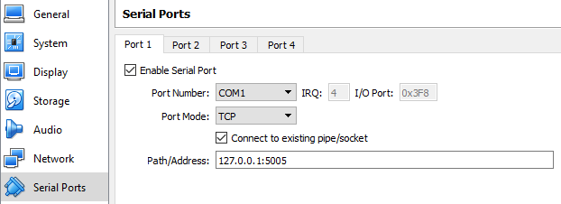

We start our TCP server, start our VirtualBox guest, boot Windows 3.11 via DOSBox in our guest and launch our client.

The result:
```
‘06E820075A5DE9ED1ECA0200558BEC6823018B4608E80C078B4606E806075A5DE91B20CA0400558BEC683D018B4608E800078B4606E8EC065A5DE91588CA0400558BEC6857018B4608E8E6068B4606E8D2065A5DE98485B8FFFFCA0400558BEC6874018B460CE8C9068B460AE8B5065A5DE9C683CA0800558BEC6888018B4606E8AF065A5DE9A086CA0200558BEC689C018B4606E89B065A5DE9D585CA0200558BEC68B6018B4608E887068B4606E873065A5DE90487CA0400558BEC68CA018B4606E85F065A5DE9B648CA0200558BEC68EA018B460CE84B068B46088B4E0A8D5E06E8C2065A5DE9CF48558BEC8B4E068B5E088B560A5DE83B07CA0800558BEC
```

If we inspect the result with a HEX editor, we see that the first character is indeed 0x91 (our magic byte), following by the textual representation of a byte stream (512 characters, representing our 256-byte key):
```console
root@kali:/media/sf_CTFs/bsidestlv/DoSaTTaCK# xxd -g 1 incoming.txt | head -1
00000000: 91 30 36 45 38 32 30 30 37 35 41 35 44 45 39 45  .06E820075A5DE9E
root@kali:/media/sf_CTFs/bsidestlv/DoSaTTaCK# stat --printf="%s" incoming.txt
513
```

Note: A different approach to extract the key, used by another team member, was to patch the client with an infinite loop, mark the memory location of the key with an easy-to-find pattern and inspect the emulator memory, searching for the pattern.

Now we have to send the data back, feeding the server. We setup the virtual COM device as a server and implement a TCP client.

The VirtualBox settings:

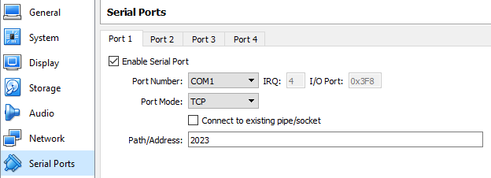

The implementation:
```python
import socket

TCP_IP = '127.0.0.1'
TCP_PORT = 2023

s = socket.socket(socket.AF_INET, socket.SOCK_STREAM)
s.connect((TCP_IP, TCP_PORT))
with open ("incoming.txt", "r") as f:
    buf = f.read()
    for b in buf:
        s.send(b)
    
    # We send some NULLs in order to flush the COM1 buffer
    # Without this, only ~half of the key would be passed
    #  to the application, causing every other ~128B chunk to 
    #  be decrypted. 
    for i in range(1024):
        s.send("\x00")

print "Done"
```

We start our VirtualBox guest, boot Windows 3.11 via DOSBox in our guest and launch our server. We then trigger our TCP client.

(Note the after some trial and error, we found out that there is need to send some NULL bytes after the key due to some OS buffering issue. Otherwise, only ~half of the buffer would be passed to the application. This was reproducible even by popping up a command line in the guest OS and running `type COM1`, so it's not related to DOSBox or the challenge executable).

The result:

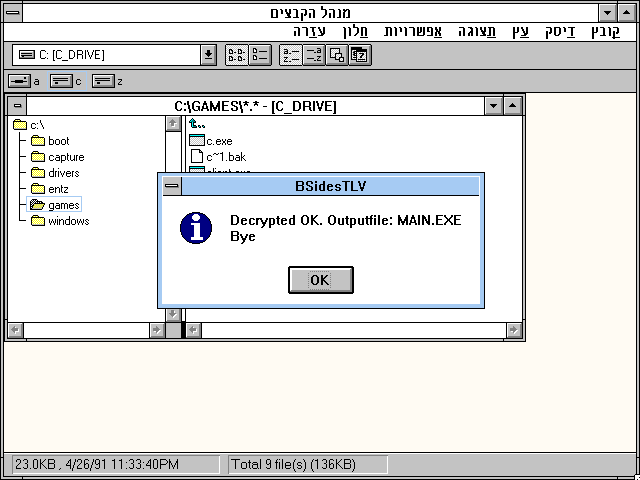

Looks good! We now should have a DOS executable. However, when we try to run in in DOSBox, it crashes!

Time to take a look at the server disassembly.

We start from the strings:

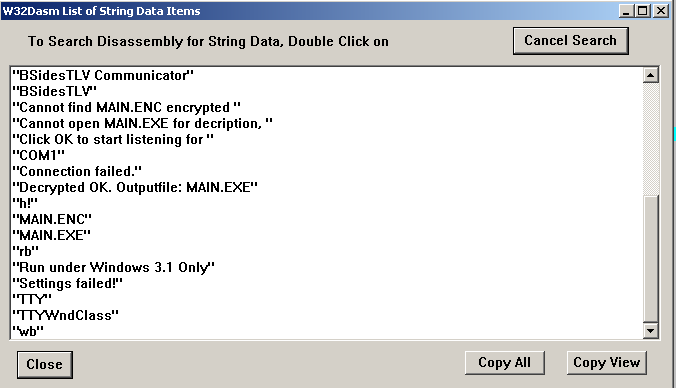

We follow `"Decrypted OK. Outputfile: MAIN.EXE"` and arrive to:

```assembly
* Referenced by a (U)nconditional or (C)onditional Jump at Addresses:
|:0001.0CED(U), :0001.0CF7(U)
|
:0001.0C3A 685802                 push 0258
:0001.0C3D 8D8680FD               lea ax, [bp+FD80]
:0001.0C41 16                     push ss
:0001.0C42 50                     push ax
:0001.0C43 57                     push di
:0001.0C44 E86D03                 call 0FB4
:0001.0C47 83C408                 add sp, 0008
:0001.0C4A 8946FE                 mov [bp-02], ax
:0001.0C4D 0BC0                   or ax, ax
:0001.0C4F 7443                   je 0C94
:0001.0C51 80BE80FD91             cmp byte ptr [bp+FD80], 91
:0001.0C56 7526                   jne 0C7E
:0001.0C58 8D8680FD               lea ax, [bp+FD80]
:0001.0C5C 16                     push ss
:0001.0C5D 50                     push ax
:0001.0C5E 0E                     push cs
:0001.0C5F E8EAF3                 call 004C
:0001.0C62 83C404                 add sp, 0004
:0001.0C65 57                     push di
:0001.0C66 1E                     push ds

* Possible StringData Ref from Data Seg 002 ->"Decrypted OK. Outputfile: MAIN.EXE"
                                  |
:0001.0C67 687701                 push 0177
:0001.0C6A 1E                     push ds

* Possible StringData Ref from Data Seg 002 ->"BSidesTLV"
                                  |
:0001.0C6B 686D01                 push 016D
:0001.0C6E 6A40                   push 0040
:0001.0C70 9AFF030000             call USER.MESSAGEBOX
```

Here we can see the check for the magic byte at address `0001.0C51`, after which the program calls `call 004C` and declares that the decryptions was successful.

Inspecting that function, the main decryption loop seems to be:

```assembly
* Referenced by a (U)nconditional or (C)onditional Jump at Address:
|:0001.0178(C)
|
:0001.013C 57                     push di
:0001.013D 9AA22B6F01             call 0001.2BA2
:0001.0142 83C402                 add sp, 0002
:0001.0145 8846FF                 mov [bp-01], al 
:0001.0148 81FE0001               cmp si, 0100
:0001.014C 7E15                   jle 0163
:0001.014E 8BC6                   mov ax, si
:0001.0150 B9FF00                 mov cx, 00FF
:0001.0153 99                     cwd
:0001.0154 F7F9                   idiv cx
:0001.0156 8BDA                   mov bx, dx
:0001.0158 8D86ECFE               lea ax, [bp+FEEC]
:0001.015C 03D8                   add bx, ax
:0001.015E 8A07                   mov al , [bx]
:0001.0160 3046FF                 xor [bp-01], al 

* Referenced by a (U)nconditional or (C)onditional Jump at Address:
|:0001.014C(C)
|
:0001.0163 FF76F8                 push word ptr [bp-08]
:0001.0166 8A46FF                 mov al , [bp-01]
:0001.0169 2AE4                   sub ah, ah
:0001.016B 50                     push ax
:0001.016C 9A522B7E01             call 0001.2B52
:0001.0171 83C404                 add sp, 0004
:0001.0174 46                     inc si
:0001.0175 3B76F6                 cmp si, [bp-0A]
:0001.0178 72C2                   jb 013C
```

It jumps over the first 0x100 bytes of `MAIN.ENC` and performs a simple XOR decryption on the remaining file.

After inspecting the decrypted `MAIN.EXE` and searching for any observations, it looks like the end of the file contains lots of meaningful text. This is a good sign. However, every now and then, some of the text was messed up.
If we align the hex dump in a certain way, we can identify several columns which are corrupted, while the rest of the text seems Ok.

This can be seen in the following dump (scroll to the right to see the text):

```console
xxd -g 1 -c 255 -s 10455 MAIN.EXE
000028d7: 65 74 43 53 73 69 67 00 5f 67 65 74 46 69 6c 65 53 69 67 00 5f 69 73 44 4f 53 33 76 33 30 00 5f 64 69 73 61 62 6c 65 49 4e 54 33 00 5f 6d 61 69 6e 00 5f 61 74 65 78 69 74 00 5f b3 6b 6f 73 5f 67 65 74 66 69 6c 65 61 74 74 72 00 5f 5f 64 6f 73 5f 73 65 74 8a 69 6c 65 61 74 74 72 00 5f 65 78 69 74 00 5f 5f 65 78 69 74 00 5f 5f 63 65 78 69 74 6c 5f 5f 63 5f 65 78 69 74 00 5f 5f 49 4f 45 52 52 4f 52 00 7b 5f 44 4f 53 45 52 52 4f 52 00 5f 69 73 61 74 74 79 00 5f 33 4c 4f 4e 47 54 4f 41 00 5f 5f 55 54 4f 41 00 5f 6c 73 65 65 6b 00 5f 5f 4d a7 4f 41 4d 45 00 5f 5f 54 4d 50 4e 41 4d 00 4e 5f 53 43 4f 50 59 40 00 5f 5f 72 65 61 64 00 5f 73 65 67 72 65 61 64 00 5f 5f 73 65 74 75 70 69 6f 00 5f 74 65 6c 6c 00 5f 75 6e 6c 69 6e 6b 00 5f 5f 56 50 52 49 4e 54 45 52 00  etCSsig._getFileSig._isDOS3v30._disableINT3._main._atexit._.kos_getfileattr.__dos_set.ileattr._exit.__exit.__cexitl__c_exit.__IOERROR.{_DOSERROR._isatty._3LONGTOA.__UTOA._lseek.__M.OAME.__TMPNAM.N_SCOPY@.__read._segread.__setupio._tell._unlink.__VPRINTER.
000029d6: 5f 5f 73 74 70 63 70 79 00 5f 5f 5f 62 72 6b 00 5f 5f 5f 73 62 72 6b 00 5f 62 72 6b 00 5f 73 62 72 6b 00 5f 69 6e 74 64 6f 73 00 5f 69 6e 74 64 6f 73 78 00 5f 69 6f 63 74 6c 00 b3 69 72 65 65 00 5f 6d 61 6c 6c 6f 63 00 5f 72 65 61 6c 6c 6f 63 00 5f 5f 52 a9 41 4c 43 56 54 00 5f 5f 63 68 6d 6f 64 00 5f 63 6c 6f 73 65 00 5f 5f 63 6c 6f 73 65 6c 5f 65 6f 66 00 5f 66 63 6c 6f 73 65 00 5f 66 66 6c 75 73 4c 00 5f 66 6c 75 73 68 61 6c 6c 00 5f 5f 4f 50 45 4e 46 50 6c 5f 5f 47 45 54 46 50 00 5f 66 6f 70 65 6e 00 5f 66 73 65 65 6b 00 5f 66 74 89 6d 6c 00 5f 5f 66 67 65 74 63 00 5f 66 67 65 74 63 00 5f 5f 4e 66 67 65 74 63 00 5f 66 67 65 74 63 68 61 72 00 5f 6d 65 6d 63 70 79 00 5f 73 65 74 6d 65 6d 00 5f 6d 65 6d 73 65 74 00 5f 6f 70 65 6e 00 5f 5f 6f 70 65 6e 00  __stpcpy.___brk.___sbrk._brk._sbrk._intdos._intdosx._ioctl..iree._malloc._realloc.__R.ALCVT.__chmod._close.__closel_eof._fclose._fflusL._flushall.__OPENFPl__GETFP._fopen._fseek._ft.ml.__fgetc._fgetc.__Nfgetc._fgetchar._memcpy._setmem._memset._open.__open.
00002ad5: 5f 70 72 69 6e 74 66 00 5f 5f 66 70 75 74 63 00 5f 66 70 75 74 63 00 5f 66 70 75 74 63 68 61 72 00 5f 5f 46 50 55 54 4e 00 5f 5f 5f 72 65 61 64 00 5f 73 65 74 76 62 75 66 00 5f 9f 7b 72 63 61 74 00 5f 73 74 72 6c 65 6e 00 5f 5f 5f 77 72 69 74 65 00 5f 5f 9b 72 69 74 65 00 5f 5f 78 66 63 6c 6f 73 65 00 5f 5f 78 66 66 6c 75 73 68 00 5f 5f 66 01 65 6d 63 70 79 00 44 41 54 41 53 45 47 40 00 5f 5f 49 6e 50 30 56 65 63 74 6f 72 00 5f 5f 49 6e 74 34 56 65 63 74 6f 1e 00 5f 5f 49 6e 74 35 56 65 63 74 6f 72 00 5f 5f 49 6e 74 36 56 65 63 74 6f 9e 01 5f 5f 43 30 61 72 67 63 00 5f 5f 43 30 61 72 67 76 00 5f 5f 43 30 65 6e 76 69 72 6f 6e 00 5f 5f 65 6e 76 4c 6e 67 00 5f 5f 65 6e 76 73 65 67 00 5f 5f 65 6e 76 53 69 7a 65 00 5f 5f 70 73 70 00 5f 5f 6f 73 76 65 72 73 69  _printf.__fputc._fputc._fputchar.__FPUTN.___read._setvbuf._.{rcat._strlen.___write.__.rite.__xfclose.__xfflush.__f.emcpy.DATASEG@.__InP0Vector.__Int4Vecto..__Int5Vector.__Int6Vecto..__C0argc.__C0argv.__C0environ.__envLng.__envseg.__envSize.__psp.__osversi
00002bd4: 6f 6e 00 5f 5f 6f 73 6d 61 6a 6f 72 00 5f 5f 76 65 72 73 69 6f 6e 00 5f 5f 6f 73 6d 69 6e 6f 72 00 5f 65 72 72 6e 6f 00 5f 5f 53 74 61 72 74 54 69 6d 65 00 5f 5f 5f 68 65 61 70 8e 6e 73 65 00 5f 5f 5f 62 72 6b 6c 76 6c 00 5f 5f 68 65 61 70 62 61 73 65 00 b3 5f 62 72 6b 6c 76 6c 00 5f 5f 68 65 61 70 74 6f 70 00 5f 5f 61 74 65 78 69 74 63 6e 18 00 5f 5f 65 78 69 74 62 75 66 00 5f 5f 65 78 69 74 66 6f 54 65 6e 00 5f 5f 65 78 69 74 6f 70 65 6e 00 5f 5f 73 74 72 09 61 6d 73 00 5f 5f 6e 66 69 6c 65 00 5f 5f 6f 70 65 6e 66 64 00 5f 5f 66 6d 83 65 65 00 5f 5f 6e 6f 74 55 6d 61 73 6b 00 5f 5f 68 65 61 70 6c 65 6e 00 5f 5f 64 6f 73 65 72 72 6e 6f 00 5f 5f 64 6f 73 45 72 72 6f 72 54 6f 53 56 00 5f 5f 73 74 6b 6c 65 6e 00 5f 5f 66 69 72 73 74 00 5f 5f 6c 61 73 74 00  on.__osmajor.__version.__osminor._errno.__StartTime.___heap.nse.___brklvl.__heapbase.._brklvl.__heaptop.__atexitcn..__exitbuf.__exitfoTen.__exitopen.__str.ams.__nfile.__openfd.__fm.ee.__notUmask.__heaplen.__doserrno.__dosErrorToSV.__stklen.__first.__last.
00002cd3: 5f 5f 72 6f 76 65 72 00 5f 5f 52 65 61 6c 43 76 74 56 65 63 74 6f 72 00 5f 5f 53 63 61 6e 54 6f 64 56 65 63 74 6f 72 00 5f 5f 61 74 65 78 69 74 74 62 6c 00 5f 5f 63 76 74 66 61 87 0f 5f 5f 41 48 53 48 49 46 54 00 5f 5f 41 48 49 4e 43 52 00 2e 2e 5c 2e 2e b0 43 4f 44 45 5c 4d 41 49 4e 2e 43 00 4d 41 49 4e 00 73 69 7a 65 00 64 61 74 61 00 63 1e 63 00 6a 00 69 00 62 69 74 5f 66 6c 61 67 00 62 69 74 73 7b 72 65 61 64 00 6f 75 74 00 6c 65 6e 00 70 6f 69 00 69 70 18 72 00 72 70 74 72 00 73 70 63 69 6e 67 00 74 70 74 72 00 6b 65 79 00 69 43 bf 01 6f 66 66 73 65 74 00 61 72 72 00 6c 65 76 65 6c 00 66 6c 61 67 73 00 66 64 00 68 6f 6c 64 00 62 73 69 7a 65 00 62 75 66 66 65 72 00 63 75 72 70 00 69 73 74 65 6d 70 00 74 6f 6b 65 6e 00 66 00 61 78 00 62 78 00 63 78 00  __rover.__RealCvtVector.__ScanTodVector.__atexittbl.__cvtfa..__AHSHIFT.__AHINCR...\...CODE\MAIN.C.MAIN.size.data.c.c.j.i.bit_flag.bits{read.out.len.poi.ip.r.rptr.spcing.tptr.key.iC..offset.arr.level.flags.fd.hold.bsize.buffer.curp.istemp.token.f.ax.bx.cx.
00002dd2: 64 78 00 73 69 00 64 69 00 63 66 6c 61 67 00 57 4f 52 44 52 45 47 53 00 61 6c 00 61 68 00 62 6c 00 62 68 00 63 6c 00 63 68 00 64 6c 00 64 68 00 42 59 54 45 52 45 47 53 00 78 00 84 0f 52 45 47 53 00 6f 75 74 72 65 67 73 00 69 6e 72 65 67 73 00 65 73 00 63 9f 00 73 73 00 64 73 00 53 52 45 47 53 00 73 72 67 73 00 73 74 72 00 63 69 70 68 65 72 6c 46 69 6c 65 43 52 43 00 43 53 63 72 63 00 64 61 74 61 73 41 67 00 63 00 72 65 73 00 46 49 4c 45 00 66 70 6f 73 5f 74 6c 73 69 7a 65 5f 74 00                                                                                                                                                                                                                                                                                         dx.si.di.cflag.WORDREGS.al.ah.bl.bh.cl.ch.dl.dh.BYTEREGS.x...REGS.outregs.inregs.es.c..ss.ds.SREGS.srgs.str.cipherlFileCRC.CScrc.datasAg.c.res.FILE.fpos_tlsize_t.
```

This might mean that we got (almost) all of the key right, and something went wrong with several bytes. We can go back to the client disassembly and try to understand what went wrong, but another approach is to try and guess the key from the information we have.

Let's mark the columns that seem wrong:

```
etCSsig._getFileSig._isDOS3v30._disableINT3._main._atexit._.kos_getfileattr.__dos_set.ileattr._exit.__exit.__cexitl__c_exit.__IOERROR.{_DOSERROR._isatty._3LONGTOA.__UTOA._lseek.__M.OAME.__TMPNAM.N_SCOPY@.__read._segread.__setupio._tell._unlink.__VPRINTER.
__stpcpy.___brk.___sbrk._brk._sbrk._intdos._intdosx._ioctl..iree._malloc._realloc.__R.ALCVT.__chmod._close.__closel_eof._fclose._fflusL._flushall.__OPENFPl__GETFP._fopen._fseek._ft.ml.__fgetc._fgetc.__Nfgetc._fgetchar._memcpy._setmem._memset._open.__open.
_printf.__fputc._fputc._fputchar.__FPUTN.___read._setvbuf._.{rcat._strlen.___write.__.rite.__xfclose.__xfflush.__f.emcpy.DATASEG@.__InP0Vector.__Int4Vecto..__Int5Vector.__Int6Vecto..__C0argc.__C0argv.__C0environ.__envLng.__envseg.__envSize.__psp.__osversi
on.__osmajor.__version.__osminor._errno.__StartTime.___heap.nse.___brklvl.__heapbase.._brklvl.__heaptop.__atexitcn..__exitbuf.__exitfoTen.__exitopen.__str.ams.__nfile.__openfd.__fm.ee.__notUmask.__heaplen.__doserrno.__dosErrorToSV.__stklen.__first.__last.
__rover.__RealCvtVector.__ScanTodVector.__atexittbl.__cvtfa..__AHSHIFT.__AHINCR...\...CODE\MAIN.C.MAIN.size.data.c.c.j.i.bit_flag.bits{read.out.len.poi.ip.r.rptr.spcing.tptr.key.iC..offset.arr.level.flags.fd.hold.bsize.buffer.curp.istemp.token.f.ax.bx.cx.
dx.si.di.cflag.WORDREGS.al.ah.bl.bh.cl.ch.dl.dh.BYTEREGS.x...REGS.outregs.inregs.es.c..ss.ds.SREGS.srgs.str.cipherlFileCRC.CScrc.datasAg.c.res.FILE.fpos_tlsize_t.
                                                           ##                        #                            #                   #                   #                         ##                                                                         

```

This time, we marked the incorrect columns. For the first two bytes, we can guess the correct value according to the third line, that should be "_strcat".
For the next incorrect byte, the last line should contain "cs". And the forth byte can be guessed using "_fmemcpy" in the first line. We continue to guess the correct values in a similar manner.

Since everything is aligned so nicely, we can easily use the last "hash line" we created in order to mark the errors as a base for a mask to fix the output file.

Now, we just need to XOR the current values of the file with the expected values to get the correct mask values.

```console
root@kali:/media/sf_CTFs/bsidestlv/DoSaTTaCK# echo -n "                                                           ##                        #                            #                   #                   #                         ##                                                                         " | tr " " \\0 > mask.bin && xxd mask.bin
00000000: 0000 0000 0000 0000 0000 0000 0000 0000  ................
00000010: 0000 0000 0000 0000 0000 0000 0000 0000  ................
00000020: 0000 0000 0000 0000 0000 0000 0000 0000  ................
00000030: 0000 0000 0000 0000 0000 0023 2300 0000  ...........##...
00000040: 0000 0000 0000 0000 0000 0000 0000 0000  ................
00000050: 0000 0000 0023 0000 0000 0000 0000 0000  .....#..........
00000060: 0000 0000 0000 0000 0000 0000 0000 0000  ................
00000070: 0000 2300 0000 0000 0000 0000 0000 0000  ..#.............
00000080: 0000 0000 0000 2300 0000 0000 0000 0000  ......#.........
00000090: 0000 0000 0000 0000 0000 2300 0000 0000  ..........#.....
000000a0: 0000 0000 0000 0000 0000 0000 0000 0000  ................
000000b0: 0000 0000 2323 0000 0000 0000 0000 0000  ....##..........
000000c0: 0000 0000 0000 0000 0000 0000 0000 0000  ................
000000d0: 0000 0000 0000 0000 0000 0000 0000 0000  ................
000000e0: 0000 0000 0000 0000 0000 0000 0000 0000  ................
000000f0: 0000 0000 0000 0000 0000 0000 0000 00    ...............
```

After manually fixing the mask, we get:
```console
root@kali:/media/sf_CTFs/bsidestlv/DoSaTTaCK# xxd mask.bin
00000000: 0000 0000 0000 0000 0000 0000 0000 0000  ................
00000010: 0000 0000 0000 0000 0000 0000 0000 0000  ................
00000020: 0000 0000 0000 0000 0000 0000 0000 0000  ................
00000030: 0000 0000 0000 0000 0000 00ec 0f00 0000  ................
00000040: 0000 0000 0000 0000 0000 0000 0000 0000  ................
00000050: 0000 0000 00ec 0000 0000 0000 0000 0000  ................
00000060: 0000 0000 0000 0000 0000 0000 0000 0000  ................
00000070: 0000 6c00 0000 0000 0000 0000 0000 0000  ..l.............
00000080: 0000 0000 0000 2400 0000 0000 0000 0000  ......$.........
00000090: 0000 0000 0000 0000 0000 6c00 0000 0000  ..........l.....
000000a0: 0000 0000 0000 0000 0000 0000 0000 0000  ................
000000b0: 0000 0000 ec01 0000 0000 0000 0000 0000  ................
000000c0: 0000 0000 0000 0000 0000 0000 0000 0000  ................
000000d0: 0000 0000 0000 0000 0000 0000 0000 0000  ................
000000e0: 0000 0000 0000 0000 0000 0000 0000 0000  ................
000000f0: 0000 0000 0000 0000 0000 0000 0000 00    ...............
```

Now we apply it to `MAIN.EXE` with the following Python script:

```python
import os
import mmap

def memory_map(filename, access=mmap.ACCESS_READ):
    size = os.path.getsize(filename)
    fd = os.open(filename, os.O_RDWR)
    return mmap.mmap(fd, size, access=access)

with memory_map("MAIN.EXE") as src, \
     memory_map("mask.bin") as mask, \
     open("MAIN_fix.exe", "wb") as dst:

    skip = 255
    dst.write(src[0:skip])
    
    for i, b in enumerate(src[skip:]):
        dst.write((b ^ mask[i % 255]).to_bytes(1, byteorder="little"))
```

Finally, we inspect the fix:

```console
xxd -g 1 -c 255 -s 10455 MAIN_fix.EXE
000028d7: 65 74 43 53 73 69 67 00 5f 67 65 74 46 69 6c 65 53 69 67 00 5f 69 73 44 4f 53 33 76 33 30 00 5f 64 69 73 61 62 6c 65 49 4e 54 33 00 5f 6d 61 69 6e 00 5f 61 74 65 78 69 74 00 5f 5f 64 6f 73 5f 67 65 74 66 69 6c 65 61 74 74 72 00 5f 5f 64 6f 73 5f 73 65 74 66 69 6c 65 61 74 74 72 00 5f 65 78 69 74 00 5f 5f 65 78 69 74 00 5f 5f 63 65 78 69 74 00 5f 5f 63 5f 65 78 69 74 00 5f 5f 49 4f 45 52 52 4f 52 00 5f 5f 44 4f 53 45 52 52 4f 52 00 5f 69 73 61 74 74 79 00 5f 5f 4c 4f 4e 47 54 4f 41 00 5f 5f 55 54 4f 41 00 5f 6c 73 65 65 6b 00 5f 5f 4d 4b 4e 41 4d 45 00 5f 5f 54 4d 50 4e 41 4d 00 4e 5f 53 43 4f 50 59 40 00 5f 5f 72 65 61 64 00 5f 73 65 67 72 65 61 64 00 5f 5f 73 65 74 75 70 69 6f 00 5f 74 65 6c 6c 00 5f 75 6e 6c 69 6e 6b 00 5f 5f 56 50 52 49 4e 54 45 52 00  etCSsig._getFileSig._isDOS3v30._disableINT3._main._atexit.__dos_getfileattr.__dos_setfileattr._exit.__exit.__cexit.__c_exit.__IOERROR.__DOSERROR._isatty.__LONGTOA.__UTOA._lseek.__MKNAME.__TMPNAM.N_SCOPY@.__read._segread.__setupio._tell._unlink.__VPRINTER.
000029d6: 5f 5f 73 74 70 63 70 79 00 5f 5f 5f 62 72 6b 00 5f 5f 5f 73 62 72 6b 00 5f 62 72 6b 00 5f 73 62 72 6b 00 5f 69 6e 74 64 6f 73 00 5f 69 6e 74 64 6f 73 78 00 5f 69 6f 63 74 6c 00 5f 66 72 65 65 00 5f 6d 61 6c 6c 6f 63 00 5f 72 65 61 6c 6c 6f 63 00 5f 5f 52 45 41 4c 43 56 54 00 5f 5f 63 68 6d 6f 64 00 5f 63 6c 6f 73 65 00 5f 5f 63 6c 6f 73 65 00 5f 65 6f 66 00 5f 66 63 6c 6f 73 65 00 5f 66 66 6c 75 73 68 00 5f 66 6c 75 73 68 61 6c 6c 00 5f 5f 4f 50 45 4e 46 50 00 5f 5f 47 45 54 46 50 00 5f 66 6f 70 65 6e 00 5f 66 73 65 65 6b 00 5f 66 74 65 6c 6c 00 5f 5f 66 67 65 74 63 00 5f 66 67 65 74 63 00 5f 5f 4e 66 67 65 74 63 00 5f 66 67 65 74 63 68 61 72 00 5f 6d 65 6d 63 70 79 00 5f 73 65 74 6d 65 6d 00 5f 6d 65 6d 73 65 74 00 5f 6f 70 65 6e 00 5f 5f 6f 70 65 6e 00  __stpcpy.___brk.___sbrk._brk._sbrk._intdos._intdosx._ioctl._free._malloc._realloc.__REALCVT.__chmod._close.__close._eof._fclose._fflush._flushall.__OPENFP.__GETFP._fopen._fseek._ftell.__fgetc._fgetc.__Nfgetc._fgetchar._memcpy._setmem._memset._open.__open.
00002ad5: 5f 70 72 69 6e 74 66 00 5f 5f 66 70 75 74 63 00 5f 66 70 75 74 63 00 5f 66 70 75 74 63 68 61 72 00 5f 5f 46 50 55 54 4e 00 5f 5f 5f 72 65 61 64 00 5f 73 65 74 76 62 75 66 00 5f 73 74 72 63 61 74 00 5f 73 74 72 6c 65 6e 00 5f 5f 5f 77 72 69 74 65 00 5f 5f 77 72 69 74 65 00 5f 5f 78 66 63 6c 6f 73 65 00 5f 5f 78 66 66 6c 75 73 68 00 5f 5f 66 6d 65 6d 63 70 79 00 44 41 54 41 53 45 47 40 00 5f 5f 49 6e 74 30 56 65 63 74 6f 72 00 5f 5f 49 6e 74 34 56 65 63 74 6f 72 00 5f 5f 49 6e 74 35 56 65 63 74 6f 72 00 5f 5f 49 6e 74 36 56 65 63 74 6f 72 00 5f 5f 43 30 61 72 67 63 00 5f 5f 43 30 61 72 67 76 00 5f 5f 43 30 65 6e 76 69 72 6f 6e 00 5f 5f 65 6e 76 4c 6e 67 00 5f 5f 65 6e 76 73 65 67 00 5f 5f 65 6e 76 53 69 7a 65 00 5f 5f 70 73 70 00 5f 5f 6f 73 76 65 72 73 69  _printf.__fputc._fputc._fputchar.__FPUTN.___read._setvbuf._strcat._strlen.___write.__write.__xfclose.__xfflush.__fmemcpy.DATASEG@.__Int0Vector.__Int4Vector.__Int5Vector.__Int6Vector.__C0argc.__C0argv.__C0environ.__envLng.__envseg.__envSize.__psp.__osversi
00002bd4: 6f 6e 00 5f 5f 6f 73 6d 61 6a 6f 72 00 5f 5f 76 65 72 73 69 6f 6e 00 5f 5f 6f 73 6d 69 6e 6f 72 00 5f 65 72 72 6e 6f 00 5f 5f 53 74 61 72 74 54 69 6d 65 00 5f 5f 5f 68 65 61 70 62 61 73 65 00 5f 5f 5f 62 72 6b 6c 76 6c 00 5f 5f 68 65 61 70 62 61 73 65 00 5f 5f 62 72 6b 6c 76 6c 00 5f 5f 68 65 61 70 74 6f 70 00 5f 5f 61 74 65 78 69 74 63 6e 74 00 5f 5f 65 78 69 74 62 75 66 00 5f 5f 65 78 69 74 66 6f 70 65 6e 00 5f 5f 65 78 69 74 6f 70 65 6e 00 5f 5f 73 74 72 65 61 6d 73 00 5f 5f 6e 66 69 6c 65 00 5f 5f 6f 70 65 6e 66 64 00 5f 5f 66 6d 6f 64 65 00 5f 5f 6e 6f 74 55 6d 61 73 6b 00 5f 5f 68 65 61 70 6c 65 6e 00 5f 5f 64 6f 73 65 72 72 6e 6f 00 5f 5f 64 6f 73 45 72 72 6f 72 54 6f 53 56 00 5f 5f 73 74 6b 6c 65 6e 00 5f 5f 66 69 72 73 74 00 5f 5f 6c 61 73 74 00  on.__osmajor.__version.__osminor._errno.__StartTime.___heapbase.___brklvl.__heapbase.__brklvl.__heaptop.__atexitcnt.__exitbuf.__exitfopen.__exitopen.__streams.__nfile.__openfd.__fmode.__notUmask.__heaplen.__doserrno.__dosErrorToSV.__stklen.__first.__last.
00002cd3: 5f 5f 72 6f 76 65 72 00 5f 5f 52 65 61 6c 43 76 74 56 65 63 74 6f 72 00 5f 5f 53 63 61 6e 54 6f 64 56 65 63 74 6f 72 00 5f 5f 61 74 65 78 69 74 74 62 6c 00 5f 5f 63 76 74 66 61 6b 00 5f 5f 41 48 53 48 49 46 54 00 5f 5f 41 48 49 4e 43 52 00 2e 2e 5c 2e 2e 5c 43 4f 44 45 5c 4d 41 49 4e 2e 43 00 4d 41 49 4e 00 73 69 7a 65 00 64 61 74 61 00 63 72 63 00 6a 00 69 00 62 69 74 5f 66 6c 61 67 00 62 69 74 73 5f 72 65 61 64 00 6f 75 74 00 6c 65 6e 00 70 6f 69 00 69 70 74 72 00 72 70 74 72 00 73 70 63 69 6e 67 00 74 70 74 72 00 6b 65 79 00 69 43 53 00 6f 66 66 73 65 74 00 61 72 72 00 6c 65 76 65 6c 00 66 6c 61 67 73 00 66 64 00 68 6f 6c 64 00 62 73 69 7a 65 00 62 75 66 66 65 72 00 63 75 72 70 00 69 73 74 65 6d 70 00 74 6f 6b 65 6e 00 66 00 61 78 00 62 78 00 63 78 00  __rover.__RealCvtVector.__ScanTodVector.__atexittbl.__cvtfak.__AHSHIFT.__AHINCR...\..\CODE\MAIN.C.MAIN.size.data.crc.j.i.bit_flag.bits_read.out.len.poi.iptr.rptr.spcing.tptr.key.iCS.offset.arr.level.flags.fd.hold.bsize.buffer.curp.istemp.token.f.ax.bx.cx.
00002dd2: 64 78 00 73 69 00 64 69 00 63 66 6c 61 67 00 57 4f 52 44 52 45 47 53 00 61 6c 00 61 68 00 62 6c 00 62 68 00 63 6c 00 63 68 00 64 6c 00 64 68 00 42 59 54 45 52 45 47 53 00 78 00 68 00 52 45 47 53 00 6f 75 74 72 65 67 73 00 69 6e 72 65 67 73 00 65 73 00 63 73 00 73 73 00 64 73 00 53 52 45 47 53 00 73 72 67 73 00 73 74 72 00 63 69 70 68 65 72 00 46 69 6c 65 43 52 43 00 43 53 63 72 63 00 64 61 74 61 73 65 67 00 63 00 72 65 73 00 46 49 4c 45 00 66 70 6f 73 5f 74 00 73 69 7a 65 5f 74 00                                                                                                                                                                                                                                                                                         dx.si.di.cflag.WORDREGS.al.ah.bl.bh.cl.ch.dl.dh.BYTEREGS.x.h.REGS.outregs.inregs.es.cs.ss.ds.SREGS.srgs.str.cipher.FileCRC.CScrc.dataseg.c.res.FILE.fpos_t.size_t.
```

Looks good!

Again, we try to run the program in DOSBox:

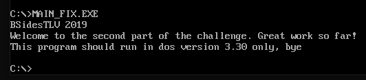

We are making progress.

In order to run the program in DOS 3.30, we will need two things:

* A DOS 3.30 boot floppy, which can be found [here](https://winworldpc.com/product/pc-dos/3x).
* A floppy with our program

We can create a floppy using:

```console
owner@owner-VirtualBox:/media/sf_SharedFolder/bsides$ mkfs.vfat -C "floppy.img" 1440
mkfs.fat 3.0.28 (2015-05-16)
owner@owner-VirtualBox:/media/sf_SharedFolder/bsides$ mkdir mount
owner@owner-VirtualBox:/media/sf_SharedFolder/bsides$ sudo mount -o loop,uid=$UID -t vfat floppy.img mount
[sudo] password for owner: 
owner@owner-VirtualBox:/media/sf_SharedFolder/bsides$ cp MAIN_fix.exe mount
owner@owner-VirtualBox:/media/sf_SharedFolder/bsides$ sudo umount mount
```

Note: This didn't work on Kali, but worked on Ubuntu.

Now we launch DOSBox, mount a folder where the two floppies are located and execute `boot PCDOS3~1.IMG FLOPPY.IMG` to boot to DOS 3.30 with our main program available. 


We run the file and get:

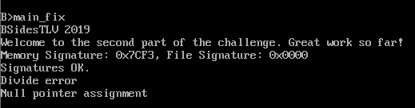

Again, progress, but still not quite there yet. We have a divide error. Why? Let's open the disassembly and investigate.

We open the executable in Ghidra and see the following:

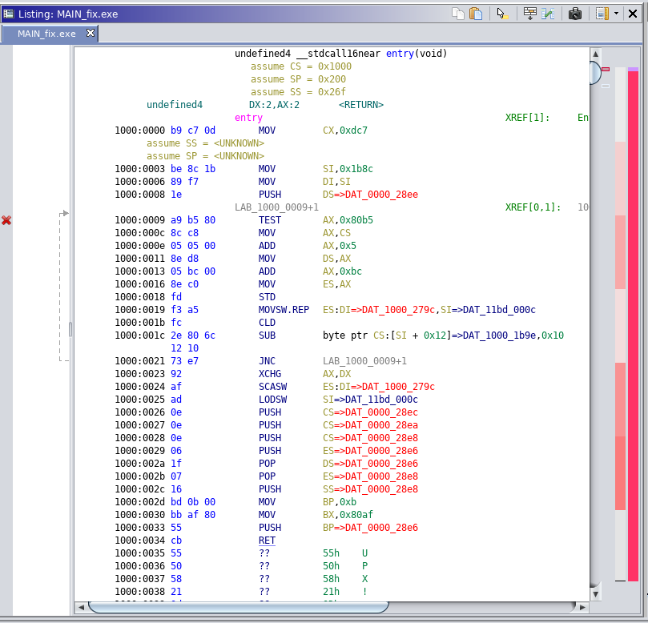

Take a look at the overview bar on the right: We have a tiny (purple) code section, which in fact is fully captured in the screenshot. The code is followed by a huge (pink) allocation of data, which starts at `1000:0034` with the string `UPX`:

> UPX (Ultimate Packer for Executables) is an open source executable packer supporting a number of file formats from different operating systems (source: [Wikipedia](https://en.wikipedia.org/wiki/UPX)).

In order to analyse the code, we'll have to unpack the executable:

```console
root@kali:/media/sf_CTFs/bsidestlv/DoSaTTaCK# upx -d MAIN_fix.exe -o MAIN_unp.exe
                       Ultimate Packer for eXecutables
                          Copyright (C) 1996 - 2018
UPX 3.95        Markus Oberhumer, Laszlo Molnar & John Reiser   Aug 26th 2018

        File size         Ratio      Format      Name
   --------------------   ------   -----------   -----------
     14688 <-     11892   80.96%     dos/exe     MAIN_unp.exe

Unpacked 1 file.
```

Now, we can open the executable in Ghidra and start analysing.

The magic happens at `FUN_1000_0551`. Let's break it down.

First, we have logic which verifies that we are running on DOS 3.3, and exits otherwise:
```assembly
                             BSidesTLV 2019
       1000:059d b8 43 01        MOV        AX,0x143
       1000:05a0 50              PUSH       AX
       1000:05a1 e8 0a 15        CALL       printf                                           undefined printf(char * param_1)
       1000:05a4 59              POP        CX
                             Welcome to the second part of the challenge. Great work so fa
       1000:05a5 b8 54 01        MOV        AX,0x154
       1000:05a8 50              PUSH       AX
       1000:05a9 e8 02 15        CALL       printf                                           undefined printf(char * param_1)
       1000:05ac 59              POP        CX
       1000:05ad e8 3d ff        CALL       Verify_Dos3.3                                    undefined Verify_Dos3.3(void)
```

Then, we have logic that checks something called a "memory signature" and a "file signature", prints them, and exits if the memory signature isn't correct:

```assembly
       1000:05b3 16              PUSH       SS
       1000:05b4 8d 86 72 ff     LEA        AX,[BP + local_90]
       1000:05b8 50              PUSH       AX
       1000:05b9 e8 20 fe        CALL       get_memory_signature                             uint get_memory_signature(undefi
       1000:05bc 59              POP        CX
       1000:05bd 59              POP        CX
       1000:05be 8b f0           MOV        SI,AX
       1000:05c0 e8 9c fe        CALL       get_file_signature                               uint get_file_signature(void)
       1000:05c3 8b f8           MOV        DI,AX
       1000:05c5 57              PUSH       DI
       1000:05c6 56              PUSH       SI
                             Memory Signature: 0x%04X, File Signature: 0x%04X
       1000:05c7 b8 96 01        MOV        AX,0x196
       1000:05ca 50              PUSH       AX
       1000:05cb e8 e0 14        CALL       printf                                           undefined printf(char * param_1)
       1000:05ce 83 c4 06        ADD        SP,0x6
                             Expected memory signature:
       1000:05d1 81 fe f3 7c     CMP        SI,0x7cf3
       1000:05d5 74 0f           JZ         signature_good
                             Signature mismatch, bye
       1000:05d7 b8 c9 01        MOV        AX,0x1c9
       1000:05da 50              PUSH       AX
       1000:05db e8 d0 14        CALL       printf                                           undefined printf(char * param_1)
       1000:05de 59              POP        CX
       1000:05df 33 c0           XOR        AX,AX
       1000:05e1 50              PUSH       AX
       1000:05e2 e8 28 01        CALL       FUN_1000_070d                                    undefined FUN_1000_070d(undefine
       1000:05e5 59              POP        CX
                             Signatures OK.
```

If the signature is Ok, we move on to a loop that decrypts the flag. However, before arriving to it, there's an explicit division by zero at `1000:05ee`. That must be what's crashing our program, we'll handle it in a moment.

```assembly
                             signature_good                                  XREF[1]:     1000:05d5(j)  
       1000:05e6 b8 e3 01        MOV        AX,0x1e3
       1000:05e9 50              PUSH       AX
       1000:05ea e8 c1 14        CALL       printf                                           undefined printf(char * param_1)
       1000:05ed 59              POP        CX
       1000:05ee b8 00 00        MOV        AX,0x0
       1000:05f1 f7 f0           DIV        AX
       1000:05f3 c6 46 fd 00     MOV        byte ptr [BP + i],0x0
       1000:05f7 eb 2e           JMP        flag_decryption_loop_condition
                             flag_decryption_loop                            XREF[1]:     1000:062b(j)  
       1000:05f9 8a 46 fd        MOV        AL,byte ptr [BP + i]
       1000:05fc 98              CBW
       1000:05fd 8d 56 ce        LEA        DX,[BP + local_34]
       1000:0600 03 c2           ADD        AX,DX
       1000:0602 8b d8           MOV        BX,AX
       1000:0604 8a 07           MOV        AL,byte ptr [BX]
       1000:0606 50              PUSH       AX
       1000:0607 8a 46 fd        MOV        AL,byte ptr [BP + i]
       1000:060a 98              CBW
       1000:060b c4 5e f8        LES        BX,[BP + local_a]
       1000:060e 03 d8           ADD        BX,AX
       1000:0610 58              POP        AX
       1000:0611 26 32 07        XOR        AL,byte ptr ES:[BX]
       1000:0614 50              PUSH       AX
       1000:0615 8a 46 fd        MOV        AL,byte ptr [BP + i]
       1000:0618 98              CBW
       1000:0619 8d 96 4c ff     LEA        DX,[BP + flag]
       1000:061d 03 c2           ADD        AX,DX
       1000:061f 8b d8           MOV        BX,AX
       1000:0621 58              POP        AX
       1000:0622 88 07           MOV        byte ptr [BX],AL
       1000:0624 fe 46 fd        INC        byte ptr [BP + i]
                             flag_decryption_loop_condition                  XREF[1]:     1000:05f7(j)  
       1000:0627 80 7e fd 24     CMP        byte ptr [BP + i],'$'
       1000:062b 7c cc           JL         flag_decryption_loop
```

Finally, the flag is printed:
```assembly
       1000:062d c6 86 70        MOV        byte ptr [BP + local_92],0x0
                 ff 00
       1000:0632 8d 86 4c ff     LEA        AX,[BP + flag]
       1000:0636 50              PUSH       AX
                             Congratulations! The flag is: %s
       1000:0637 b8 f5 01        MOV        AX,0x1f5
       1000:063a 50              PUSH       AX
       1000:063b e8 70 14        CALL       printf                                           undefined printf(char * param_1)
```

Back to the division by zero. We can easily override the faulty instructions with NOPs and we should be good to go, right?

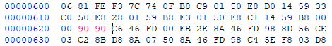

We copy the patched executable to the floppy, run again and get:

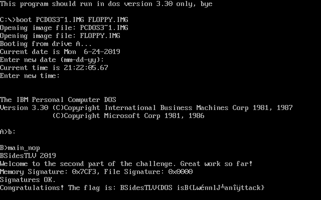

This looks like a partial flag, but there seems to be some corruption. Maybe it's related to the fact that we've unpacked and patched the executable?

Fortunately, we can bypass the faulty division using the [DOSBox debugger](https://www.vogons.org/viewtopic.php?t=3944), which is able to debug DOS programs in the CPU level.

In order to easily locate the program's code segment, we can use the following shortcut:
1. Set a breakpoint on INT 21: `BPINT 21 *`
2. Run the program in the DOS console: `main_fix.exe`
3. We will hit the breakpoint several times. Continue execution until the program starts printing to the screen.
4. The current code segment is probably what we're looking for.

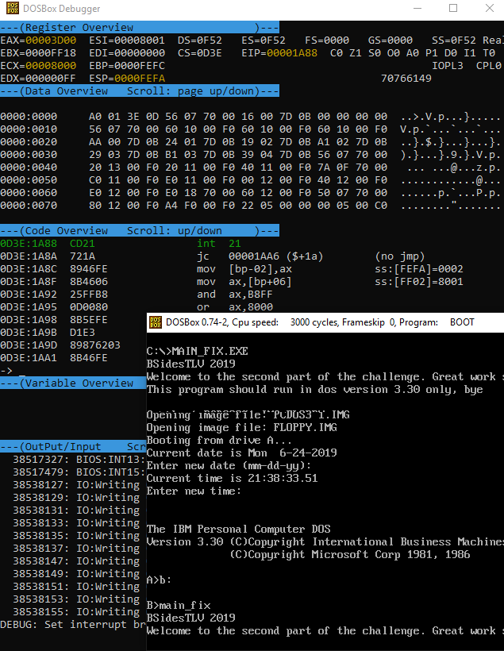


We can see that CS = 0xD3E.

If we move our code view to `0D3E:05EE` using the `c cs:05EE` command, we'll see our famous division:

```
---(Code Overview   Scroll: up/down     )---
0D3E:05EE  B80000              mov  ax,0000
0D3E:05F1  F7F0                div  ax
0D3E:05F3  C646FD00            mov  byte [bp-03],00        ss:[FEF9]=0212
0D3E:05F7  EB2E                jmp  short 00000627 ($+2e)  (down)
0D3E:05F9  8A46FD              mov  al,[bp-03]             ss:[FEF9]=0212
```

Let's delete our global INT 21 breakpoint:
```
> BPLIST
Breakpoint list:
-------------------------------------------------------------------------
00. BPINT 21
> BPDEL 0
```

And set a breakpoint on `div ax` by using `bp cs:05EE`. We continue execution and shortly after, hit our breakpoint.

Note: The program had logic to disable INT 3 (software breakpoints). However, the DOSBox debugger does not use INT 3 to realize breakpoints, but rather uses something similar to HW breakpoints.

In the register overview, we'll see `EAX=00000000`, we can modify the value to 1 using `sr eax 1`. However, after continuing to execute, even though we've diverted the division by zero, we still get a corrupted flag!


Time to dive in deeper. Where should the flag be coming from?

Let's take another look at the logic that decrypts the flag:
```assembly
                             flag_decryption_loop                            XREF[1]:     1000:062b(j)  
       1000:05f9 8a 46 fd        MOV        AL,byte ptr [BP + i]
       1000:05fc 98              CBW
       1000:05fd 8d 56 ce        LEA        DX,[BP + local_34]
       1000:0600 03 c2           ADD        AX,DX
       1000:0602 8b d8           MOV        BX,AX
       1000:0604 8a 07           MOV        AL,byte ptr [BX]
       1000:0606 50              PUSH       AX
       1000:0607 8a 46 fd        MOV        AL,byte ptr [BP + i]
       1000:060a 98              CBW
       1000:060b c4 5e f8        LES        BX,[BP + local_a]
       1000:060e 03 d8           ADD        BX,AX
       1000:0610 58              POP        AX
       1000:0611 26 32 07        XOR        AL,byte ptr ES:[BX]
       1000:0614 50              PUSH       AX
       1000:0615 8a 46 fd        MOV        AL,byte ptr [BP + i]
       1000:0618 98              CBW
       1000:0619 8d 96 4c ff     LEA        DX,[BP + flag]
       1000:061d 03 c2           ADD        AX,DX
       1000:061f 8b d8           MOV        BX,AX
       1000:0621 58              POP        AX
       1000:0622 88 07           MOV        byte ptr [BX],AL
       1000:0624 fe 46 fd        INC        byte ptr [BP + i]
```

The interesting locations to inspect are `local_34` and `local_a`.

`local_34` points in runtime to `ds:ffc4`:

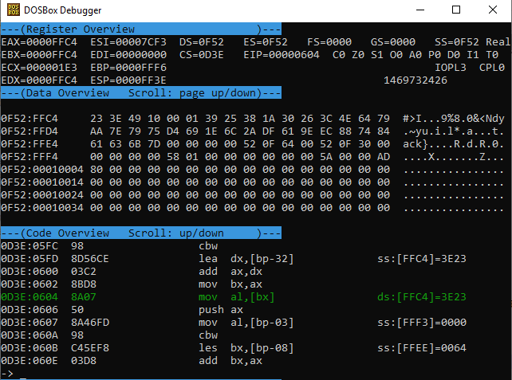

If we look closely, we can see that the last four letters are `ack}`, which are also part of the partial flag we get, and make sense in the context. This probably means that our key ends with `00 00 00 00`.

The string is XORed with `es:[local_a]`, which points in runtime to `es:64`:

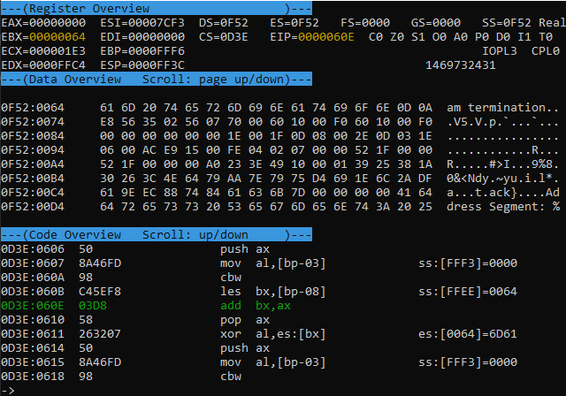

This points to the middle of a system error string ("Abnormal program termination") and continues with an indistinguishable byte array, following by the 4 NULL bytes we were expecting.

Let's align all three ingredients we have: The two strings which are being XORed, and the result:

```
23 3E 49 10 00 01 39 25 38 1A 30 26 3C 4E 64 79 AA 7E 79 75 D4 69 1E 6C 2A DF 61 9E EC 88 74 84 61 63 6B 7D #>I...9%8.0&<Ndy.~yu.i.l*.a...t.ack}
61 6D 20 74 65 72 6D 69 6E 61 74 69 6F 6E 0D 0A E8 56 35 02 56 07 70 00 60 10 00 F0 60 10 00 F0 00 00 00 00 am termination...V5.V.p.`...`.......
42 53 69 64 65 73 54 4C 56 7B 44 4F 53 20 69 73 42 28 4C 77 82 6E 6E 6C 4A CF 61 6E 8C 98 74 74 61 63 6B 7D BSidesTLV{DOS isB(Lw.nnlJ.an..ttack}
```

Interestingly, we see that the beginning of the flag that makes sense ("`BSidesTLV{DOS is`") aligns perfectly with "`am termination\r\n`", and the corruption starts immediately after that. Moreover, the suffix ("`ttack}`") makes sense given the challenge name ("DoSaTTaCK").
So this must mean that for some reason, `0F52:0074`-`0F52:0081` are not getting the value they should. Where is their value decided?

Here are the locations in the code:

```assembly
                             s__1214_0074                                    XREF[0,2]:   FUN_1000_01a9:1000:01af(W), 
                                                                                          FUN_1000_01ec:1000:01f0(R)  
       1214:002f 4e 75 6c        ds         "Null pointer assignment\r\nDivide error\r\nAbnormal program termination\r\n"
                 6c 20 70 
                 6f 69 6e 
       1214:0075 00              ??         00h
                             DAT_1214_0076                                   XREF[1]:     FUN_1000_01a9:1000:01b3(W)  
       1214:0076 00 00           undefined2 0000h
                             DAT_1214_0078                                   XREF[1]:     FUN_1000_01a9:1000:01bc(W)  
       1214:0078 00 00           undefined2 0000h
                             DAT_1214_007a                                   XREF[1]:     FUN_1000_01a9:1000:01c0(W)  
       1214:007a 00 00           undefined2 0000h

```

They are referenced by the following function:

```assembly
                             undefined FUN_1000_01a9()
                               assume CS = 0x1000
                               assume DS = 0x1214
             undefined         AL:1            <RETURN>
                             FUN_1000_01a9                                   XREF[1]:     entry:1000:0025(c)  
       1000:01a9 1e              PUSH       DS
       1000:01aa b8 00 35        MOV        AX,0x3500
       1000:01ad cd 21           INT        0x21
       1000:01af 89 1e 74 00     MOV        word ptr [s__1214_002f+69],BX                                                  = ""
       1000:01b3 8c 06 76 00     MOV        word ptr [DAT_1214_0076],ES
       1000:01b7 b8 04 35        MOV        AX,0x3504
       1000:01ba cd 21           INT        0x21
       1000:01bc 89 1e 78 00     MOV        word ptr [DAT_1214_0078],BX
       1000:01c0 8c 06 7a 00     MOV        word ptr [DAT_1214_007a],ES
       1000:01c4 b8 05 35        MOV        AX,0x3505
       1000:01c7 cd 21           INT        0x21
       1000:01c9 89 1e 7c 00     MOV        word ptr [DAT_1214_007c],BX
       1000:01cd 8c 06 7e 00     MOV        word ptr [DAT_1214_007e],ES
       1000:01d1 b8 06 35        MOV        AX,0x3506
       1000:01d4 cd 21           INT        0x21
       1000:01d6 89 1e 80 00     MOV        word ptr [DAT_1214_0080],BX
       1000:01da 8c 06 82 00     MOV        word ptr [DAT_1214_0082],ES
       1000:01de b8 00 25        MOV        AX,0x2500
       1000:01e1 8c ca           MOV        DX,CS
       1000:01e3 8e da           MOV        DS,DX
       1000:01e5 ba a0 01        MOV        DX,0x1a0
       1000:01e8 cd 21           INT        0x21
       1000:01ea 1f              POP        DS
       1000:01eb c3              RET
```

This function is calling `INT 21 35` (a.k.a. ["Get Interrupt Vector"](http://stanislavs.org/helppc/int_21-35.html)) for four interrupts: `INT 0`, `INT 4`, `INT 5` and `INT 6`. The return value (`ES:BX` = pointer to interrupt handler) is stored in the location used for our key. We must be getting different results compared to the challenge author.

For general knowledge, the interrupts are:
```
IVT Offset | INT #     | Description
-----------+-----------+-----------------------------------
0x0000     | 0x00      | Divide by 0
0x0010     | 0x04      | Overflow (INTO)
0x0014     | 0x05      | Bounds range exceeded (BOUND)
0x0018     | 0x06      | Invalid opcode (UD2)
```

We tried booting DOS 3.3 on VirtualBox and got different results. However, also there, it looked like some interrupt addresses ended with `00 F0`. Is it possible that only the higher address is different?

Let's take another look at the flag we already have:
```
BSidesTLV{DOS isB(Lw.nnlJÏan..ttack
```

Separate the corrupted part from the good part:
```
BSidesTLV{DOS is??????????????ttack
                B(Lw.nnlJÏan..
```

Assume that anything that is XORed with `00 F0` is good:
```
BSidesTLV{DOS is??????????????ttack
                B(Lw.nnlJÏan..
                ??????nl??an??
```

Add obvious spaces and complete the last word to "attack":
```
BSidesTLV{DOS is??????????????ttack
                B(Lw.nnlJÏan..
                ??????nl??an??
                 ?????nl? an a
```

Couldn't find a single English word that fits, but if we assume these are two words, "only" jumps to mind:
```
BSidesTLV{DOS is??????????????ttack
                B(Lw.nnlJÏan..
                ??????nl??an??
                 ?????nl? an a
                 ??? only an a
```

It's pretty easy to complete "DOS is ??? only an attack" - DOS (which is used these days "Denial of Service") is not only an attack, it's also an operating system.

We were lucky that the authors didn't use l33t or capitals :-)


After a while, a clarification was posted by the authors:

> Due to a bug in the DoSaTTaCK challenge, the flag was displayed correctly only on DOS 6.2 despite the fact that the challenge requested specifically to use DOS version 3.30. The bug has been fixed and now the flag will be displayed properly only on DOS 3.30. Those who were brave and thorough enough to try it on several environments and solved the challenge with the bug will get 300 bonus points 


Looks like there's more than one way to get a flag.


