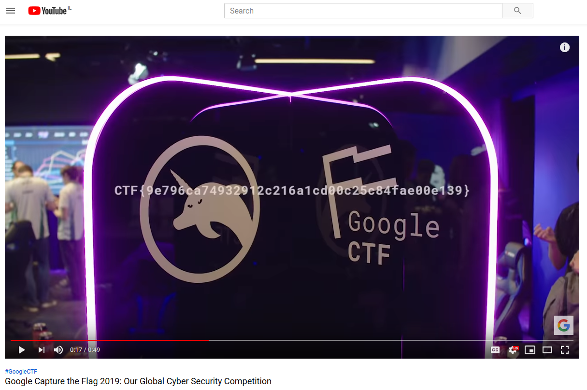

# Ad
Category: Ad

## Description
> We interrupt this program for a commercial break
> 
> https://www.youtube.com/watch?v=QzFuwljOj8Y 

## Solution

The attached YouTube video is a promotional video about the CTF.

However, at 00:17, you can spot a long string flashing for a split second:

Apparently this is a flag: CTF{9e796ca74932912c216a1cd00c25c84fae00e139}