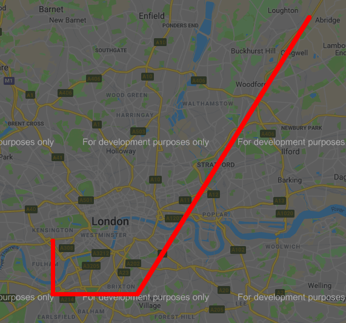

# Drive to the target
Category: Coding

## Description
> Excellent work!  With your fine sleuthing skills, you managed to find a picture of the handsome creature with its pet biped.  At last friends and companionship may be near!
> 
> Like all inhabitants of this world, you spend an inordinate amount of time on the site, stalking and comparing your life to that of others. The first thought that springs to your mind is "Why haven't I ever been to Mauritius on holiday?" followed swiftly by "What is a Mauritius anyway?" But after a while and with language successfully deciphered, you've made contact with the lifeform in the picture, you have a "date"? You're given the address of where to meet your potential interest. "1 Banana way, beware of the glass." An odd address, especially that last part. So how do you get there?  You land your ship and begin to search.
> 
> https://drivetothetarget.web.ctfcompetition.com/ 

## Solution

We visit the attached website and see the following form:
```html
<body>
     <p>Hurry up, don't be late for you rendez-vous!
      <form method="get" action="/">
        <fieldset>
        <legend>Pick your direction</legend>
         <input type="number" name="lat" value="51.6498" min="-90" max="90" step="0.0001">
         <input type="number" name="lon" value="0.0982" min="-180" max="180" step="0.0001">
         <input style="display: none" name="token" value="gAAAAABdIIdwScIB_NAfiCCjS-DQroCC-_M2uKbNlUMWE4SZdy3SNpNVuCbCp5QS4bZUhhY57ncdHSa8lVX1d85q3DCBW5SkZutF0_xG-2Jpnv0T3vBl5BeAJ85DqgDuX9VMmZTw2BUJ">
         <button type="submit">go</button>
        </fieldset>
      </form>
      <p></p>
   </body>
```

We can modify the latitude or longitude and submit the form. The response will tell us if we're moving closer, further or too fast (which means we must either wait between submissions or choose a closer coordinate).

The concept is pretty simple. We'll write a short script to drive us to the target. The script will choose the correct direction by attempting different directions until it receives an indication that it is getting closer. Diagonal movement will be prioritized at first as an optimization. It will continue moving in the same direction until there is an indication that the chosen direction isn't optimal anymore. Then it will choose another direction, without allowing diagonal movement (since allowing it might cause an infinite loop of moving further and back closer again).

The code:

```python
from collections import namedtuple
from bs4 import BeautifulSoup
from enum import Enum
import requests
import random
import pickle
import time
import os

CACHE_FILE = "cache.db"
URL = "https://drivetothetarget.web.ctfcompetition.com/"
Result = namedtuple('Result', 'lat lon token msg')

UNIT = 0.0001

class Message(Enum):
    CLOSER      = 1
    FURTHER     = 2
    TOO_FAST    = 3
    OTHER       = 4

def extract_info(html):
    parsed_html = BeautifulSoup(html, features="html.parser")
    lat = parsed_html.body.find("input", attrs={"name": "lat"})["value"]
    lon = parsed_html.body.find("input", attrs={"name": "lon"})["value"]
    token = parsed_html.body.find("input", attrs={"name": "token"})["value"]
    paragraphs = parsed_html.body.find_all("p")
    msg_type = Message.OTHER
    if len(paragraphs) > 1:
        msg = paragraphs[1].text
        if "closer" in msg:
            msg_type = Message.CLOSER
        elif "away" in msg:
            msg_type = Message.FURTHER
        elif "fast" in msg:
            msg_type = Message.TOO_FAST
        else:
            print (msg)

    return Result(lat, lon, token, msg_type)

def send_info(s, lat, lon, token):
    r = s.get(URL, params = {"lat": str(lat), "lon": str(lon), "token": token})
    return extract_info(r.text)

def get_direction(s, res, timeout, allow_diagonal = False):
    print ("Changing direction . . .")
    
    directions = [(0, 1), (0, -1), (1, 0), (-1, 0)]
    random.shuffle(directions)

    if allow_diagonal:
        directions = [(-1, -1), (1, 1), (1, -1), (-1, 1)] + directions
    for direction in directions:
        while True:
            time.sleep(timeout)
            res = send_info(s, float(res.lat) + (UNIT * direction[0]), float(res.lon) + (UNIT * direction[1]), res.token)
            if res.msg == Message.CLOSER:
                print ("New direction: {}".format(direction))
                return res, direction
            elif res.msg == Message.TOO_FAST:
                timeout += 1
            else:
                break
    return (None, None)


s = requests.session()

if os.path.exists(CACHE_FILE):
    res = pickle.load( open( CACHE_FILE, "rb" ) )
else:
    r = s.get(URL)
    res = extract_info(r.text)
    
try:
    timeout = 0.8
    res, direction = get_direction(s, res, timeout, True)

    print ("Starting to drive . . .")

    while res is not None:
        time.sleep(timeout)

        res = send_info(s, float(res.lat) + (UNIT * direction[0]), float(res.lon) + (UNIT * direction[1]), res.token)
        print (res)
        if (res.msg == Message.FURTHER):
            res, direction = get_direction(s, res, timeout, False)
        elif (res.msg == Message.TOO_FAST):
            timeout += 0.1
        elif (res.msg == Message.OTHER):
            break

except Exception as e:
    print (e)
finally:
    pickle.dump( res, open( CACHE_FILE, "wb" ) )

```


It takes a while. The last few lines of are:
```
Result(lat='51.49139999999475', lon='-0.19269999999999685', token='gAAAAABdIK-KlQ8jp2wP7JenziknWUFTk5L1TGDqJKitMflAkgYYef0bYHFtyv0o9Nn4wYY7xlDBUK4e-7TVgM4dzYpfht-1PMEVwYKypsP3s8QQva9_IOb0-rvSnTwWkP7aQpauRT92', msg=<Message.CLOSER: 1>)
Result(lat='51.49149999999475', lon='-0.19269999999999685', token='gAAAAABdIK-LHp-83iXQSjE9CFGqlBohYTBJOttg9F980QurnlVDPT_mx-kAr0V4B9wd88fwlyCYCFIxWp9YEGy_9GTS-GUI7QzdWa3mq9fbHXuU4n5onhcmibV7Fc_ui5iRy_ZlP_1z', msg=<Message.CLOSER: 1>)
Result(lat='51.491599999994754', lon='-0.19269999999999685', token='gAAAAABdIK-Ml1x5vdTkghk85clT6JAd6mm_N4OBVjdr3cQEoCRmIJct17MDD9s3qdlq-mMcJ9F2QesR_x2ViCBTcpVY_KyUJOeSiyO7idNbK_XIQEpTa3pi0kmTq3j4qqzwIBFGBUu9', msg=<Message.CLOSER: 1>)
Result(lat='51.49169999999476', lon='-0.19269999999999685', token='gAAAAABdIK-O_fpi5-K-DI7b55eXsk_6A89M4AuKI9h1HKHmMM4aKgcIVSoYGzmlxe9XyQAA2zOpjhmRzC2brNDIpwaFhufvNLk-bQBASTSHAjCVVVWlisZtUSCkQGrk4_QYIP8SUp_o', msg=<Message.CLOSER: 1>)
Result(lat='51.49179999999476', lon='-0.19269999999999685', token='gAAAAABdIK-Pw1VE2QfgV80gT7YWaNGyw64bWrB0HKWMsfRq8K9sol-8QrXuhafBqjOYGNCvlzNe_EC5465hE6fS3CAB2lYrbMpu_crFLg0ZUaFrkj9Zu6fA3y9tEVPnTjOdWoH010vx', msg=<Message.CLOSER: 1>)
Result(lat='51.491899999994764', lon='-0.19269999999999685', token='gAAAAABdIK-QCjUu42odLrAsnTWKfZ3RHiP2AmHjdh4mWY3mi7-aVcCi8T9GbbD4Nb56zNMI1XTStmjdC2GRUKRmuVNvtmp1rGoL0CxDRsIXR_BnhqynddHwBcv69t5ROunp1zwrs_1i', msg=<Message.CLOSER: 1>)
Result(lat='51.49199999999477', lon='-0.19269999999999685', token='gAAAAABdIK-RsI4wVFyRFwdphXzAgLmBrwXP8IN3Yrmvi9TwmfObe3XpctxVaAT6kVpCoIdYzVfUDkKYZAVMB67f48_oqseE4dRVFUkdwI5F9BfbHiawcMEf7b59D0uU7NyDttemy9Wl', msg=<Message.CLOSER: 1>)
Result(lat='51.49209999999477', lon='-0.19269999999999685', token='gAAAAABdIK-SWKxdb2j3_kmpN6g0xeEYfUgXg1_JhWoNpWSaPvsvJdQ_n3XCAl4MrcztCpMYupYZ63SAKc_ku9-5mW4PxNKK35W-c6dyhY_BUMLpWA4RWbrcrmFpYJV7W_xMpmqvhEBU', msg=<Message.CLOSER: 1>)
Result(lat='51.492199999994774', lon='-0.19269999999999685', token='gAAAAABdIK-TMe7cFgRviWQ102nugUb3uqWVTBff061dAxax1iKT0dUyKlKm3gVGvFzmcdZWwistCGlr-gcegz3eWCdLHKx1HQBErmPTfzK6ApY_2PvdTYIdPPrtP140Pdu5cxQveB2b', msg=<Message.FURTHER: 2>)
Changing direction . . .
New direction: (-1, 0)
Result(lat='51.49199999999477', lon='-0.19269999999999685', token='gAAAAABdIK-VYUb5Yl29ogPMRODBQzJqLZ5mK2oFBqWeJK2-12KYMTkxSGLU1XqekklK4Ejftfmq9DI3B_BUOKKhTWMFCExwITrwI_eDygbohn2EJ2NhSK5ptJc7w8-pXD_IFTBzPz2X', msg=<Message.FURTHER: 2>)
Changing direction . . .
New direction: (0, -1)
Result(lat='51.49199999999477', lon='-0.19289999999999682', token='gAAAAABdIK-Xq2i_JTtmCAgsL3pw70l0_G5hsPSi1uhEhO_iwErYZ-cqe7mDICNaLYj7wMUGZzEA3tDsBbAyE_riErkwKrzPPJ8w363oWEz0DOSYEvxIKDRNYycixAONSA_sOukkBilO', msg=<Message.CLOSER: 1>)
Result(lat='51.49199999999477', lon='-0.1929999999999968', token='gAAAAABdIK-Y02yDXsyG37CbeJmkhv053cupB9Mgpy8XNAi72IaB4ro68yzzQMNRfPLErA2ZlCijgeheV7bpVL5ryNoGWRbWlZELl8LXfzMZKnkV-d00ZwPzfPPbCEnaX6EwP7fvr1Ui', msg=<Message.FURTHER: 2>)
Changing direction . . .
New direction: (0, 1)
Result(lat='51.49199999999477', lon='-0.19279999999999684', token='gAAAAABdIK-aeLoaNpSPaScaWhPwg1fXrHgLybBP0pPHYIJJPTpuxm3xpawa9JzINzptVomDPemDOsWU-UsPT5nx0P7yCbHsqOG1BqCPhv_mbdPF2H0fWyk8TUtx5W13jc965OOOd43Z', msg=<Message.FURTHER: 2>)
Changing direction . . .
Congratulations, you made it, here is the flag:  CTF{Who_is_Tardis_Ormandy}
Congratulations, you made it, here is the flag:  CTF{Who_is_Tardis_Ormandy}
```

Using [this service](http://www.hamstermap.com/quickmap.php), we can plot the coordinates on a map and see the route we took:

