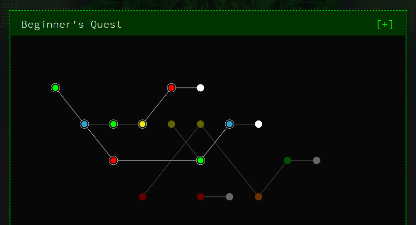

# Google CTF - Beginner's Quest (2019)

>  You are a simple life form, exiled from your home planet and in search of a new place to call home. The ruling came fast. Your taste in music was deemed to be far too "out-there-man" for anyone to possibly associate with you anymore. You were given 60 revolutions of Xenon around Fir to leave and never return. Gather whatever possessions and leave. You find your parents music collection, oddly in it is a golden disc labelled "Property of NASA, if lost please return to: EVNJAKL 1600 Ampitheatre Parkway Mountain View California." The music on the disc was uncovered a while back and was not very interesting. This weird language that said something about "Peace, love and rock and roll. Also we're having a really cool party tonight, so for whoever is out there, bring a friend and come along! Co-ordinates enclosed." On the back the words "Draft, do not distribute or load onto probe" written in big red letters. That could mean anything.
> 
> You'll go, since you have nowhere else to go. But you'll be careful. You well know to learn all you can about alien beings before making contact. They could be hostile, or listen to boring music. Time is slipping away fast, you race aboard the nearest ObarPool Spaceship. But you've never driven one... what next genius? 

Various writeups for the 2019 Google CTF Beginner's Quest.

