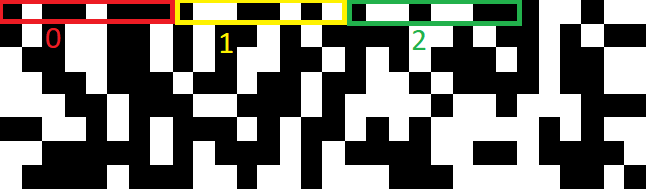

# MissingKipod
Misc., 25 points

## Description
> We were on to something with Dinary.

## Solution

This is the follow-up challenge for [Dinary](Dinary.md).

In Dinary, we received an image composed of black and white pixels. When interpreted as binary, we were able to extract the following text:

> Hello World!, Yesterday my kipod went free and i can't find him! KAF{wh3r3_1s_my_k1p0d?}
> 
> Maybe YOU can help me find my kipod? (his name is "Fibon")
> 
> Hope you'll find him, he should go on a tour really soon.

The hedgehog's name is "Fibon", short for "Fibonacci", so that must be related to the solution.

First, we'll start by abstracting the access to the image bitmap to make traversal easier. We'll create a class that receives a logical index, extracts from the image the 8 pixels which correspond to that index, and convert them into a byte value.



The first 8 pixels are byte #0, then next 8 pixels are byte #1 and so on.

We'll use the following class for the abstraction:
```python
from PIL import Image

class BitImage(object):
    BITS_PER_BYTE = 8
    WHITE = (255, 255, 255)
    BLACK = (0, 0, 0)

    def __init__(self, path_to_img):
        image = Image.open(path_to_img)
        self.width, self.height = image.size
        self.pixels = image.load()
        self.length = int(self.width * self.height / self.BITS_PER_BYTE)

    def __get_pixel(self, x, y):
        p = self.pixels[y,x]
        if p == self.WHITE:
            return 1
        elif p == self.BLACK:
            return 0
        else:
            raise Exception(f"Unexpected value {p}")

    def __getitem__(self, index):
        if index > self.length:
            raise IndexError(f"Index {index} out of bounds")
        x, y = divmod(index * self.BITS_PER_BYTE, self.width)

        byte = 0
        for i in range(self.BITS_PER_BYTE):
            byte |= (self.__get_pixel(x, y) << (self.BITS_PER_BYTE - 1 - i))
            y += 1
            if y == self.width:
                y = 0
                x += 1
        return byte

    def __len__(self):
         return self.length
```

Now, the plan is to iterate the image until we hit a 'K' (the first character of the flag format), and then start jumping according to Fibonacci indices in order to see if we can form a flag. If we can't, we move on to the next 'K' and try again.

Here's the code that does that:

```python
FLAG_PREFIX = "KAF{"

def get_next_fib():
    a = 0
    b = 1
    while True:
        yield a
        s = a + b
        a = b
        b = s

def check_flag(potential_flag):
    for a, b in zip(potential_flag, FLAG_PREFIX):
        if a != b:
            raise Exception(f"'{potential_flag}' is not a valid flag")
    return potential_flag[-1] == '}'

def main():
    bitimg = BitImage("dinary.png")
    for i in range(len(bitimg)):
        try:
            current_char = chr(bitimg[i])
            if current_char == FLAG_PREFIX[0]:
                index = i
                potential_flag = ""
                for offset in get_next_fib():
                    index += offset
                    c = chr(bitimg[index])
                    potential_flag += c
                    try:
                        if check_flag(potential_flag):
                            print(potential_flag)
                            return
                    except:
                        break
        except:
            pass

if __name__ == "__main__":
    main()
```

Output:

```console
root@kali:/media/sf_CTFs/kaf/MissingKipod# python3 solve.py
KAF{i_9u355_w3_f0und_h1m_f1na11y}
```