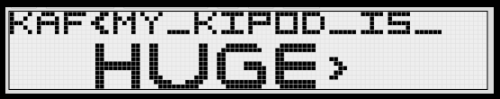

# Tupper needs help
Misc., 5 points

## Description
> I forgot the size of my kipod, can you help? k = 1149088036118748153043577013820072408885949020563817247643416097427609454784316480438935765354843225548041192362989341741100573490073448156985503983059433007456621869088528541601531021805434641158022863321604365912330878796519179999743007778309707144803824547692249224938557620335782675957793640790464297377099274055139536447837590517931851109546855273584874094409665031001792923933599279402800139404046854000506331325067964897620998752717795071450855954081334797627968452316244584618935641960635983970619395200199775096694978239798720856064

## Solution

Searching for "Tupper" in the context of CTFs, we arrive to [Tupper's Self-Referential Formula](https://en.wikipedia.org/wiki/Tupper's_self-referential_formula):

> Tupper's self-referential formula is a formula that visually represents itself when graphed at a specific location in the (x, y) plane. 

[This online tool](http://keelyhill.github.io/tuppers-formula/) allows users to view a visual representation, given the value of `k`.

The result for the provided `k` is:

The flag: `KAF{MY_KIPOD_IS_HUGE}`