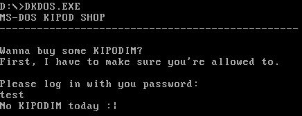

# dkdos
Reversing, 45 points

## Description
> I've sent my KIPODIM shop to a friend of mine, and he told me he was able to access it with just a random password. Can you please check it?

A binary file was attached.

## Solution

Let's check the file:

```console
root@kali:/media/sf_CTFs/kaf/dkdos# file dkdos.exe
dkdos.exe: MS-DOS executable
```

It's a DOS executable, we can run it with DOSBox-X (which is a DOSBox port with a better debugger):



We need to provide the correct password. Let's open the file with Radare2 and start disassembling. We'll go into a little more details than usual since DOS reversing isn't so common these days.

```
root@kali:/media/sf_CTFs/kaf/dkdos# r2 dkdos.exe
 -- Move around the bytes with h,j,k,l! Arrow keys are neither portable nor efficient
[0000:0050]> aaa
[x] Analyze all flags starting with sym. and entry0 (aa)
[Invalid address from 0x0000008f
[x] Analyze function calls (aac)
[x] Analyze len bytes of instructions for references (aar)
[x] Check for objc references
[x] Check for vtables
[x] Type matching analysis for all functions (aaft)
[x] Propagate noreturn information
[x] Use -AA or aaaa to perform additional experimental analysis.
[0000:0050]> afl
0x00000050   53 425  -> 459  entry0
0x00000021    1 8            fcn.00000021
0x00000029    1 15           fcn.00000029
0x00000038    4 24           fcn.00000038
```

We start from the main function:
```
[0000:0050]> s entry0
[0000:0050]> e asm.comments = false
[0000:0050]> e graph.comments = false
[0000:0050]> afu 0000:00b6
```

(The `afu` command is needed since Radare2 doesn't correctly understand that the main function ends at `0000:00b4`, and comments are disabled since Radare2 gets them wrong for this binary, incorrectly referencing strings). 

Let's take a look at it:
```
[0000:0050]> agf
[0x00000050]>  # entry0 (int32_t arg4);
      .-------------------------------.
      |  0x50                         |
      | (fcn) entry0 102              |
      |   entry0 (int32_t arg4);      |
      | ; arg int32_t arg4 @ cx       |
      | mov ax, 0xc                   |
      | mov ds, ax                    |
      | call fcn.00000021;[oa]        |
      | mov word cs:[0x11], 0x27d1    |
      | mov word cs:[0x13], 0x27d1    |
      | call fcn.00000029;[ob]        |
      | mov al, byte [0xbd]           |
      | test al, al                   |
      | je 0x77                       |
      `-------------------------------'
              f t
              | |
              | '-------------.
      .-------'               |
      |                       |
  .-----------------------.   |
  |  0x70                 |   |
  | cmp byte [0xb5], 8    |   |
  | je 0x7a               |   |
  `-----------------------'   |
          f t                 |
          | |                 |
          | '.                |
          '------------.      |
             |         | .----'
             |         | |
             |   .------------------------.
             |   |  0x77                  |
             |   | call fcn.00000038;[oc] |
             |   `------------------------'
             |       v
             |       |
            .|-------'
            |'.
            | |
      .----------------------------.
      |  0x7a                      |
      | mov bx, 0xb5               |
      | mov cl, byte [bx]          |
      | mov ch, 0                  |
      | push cx                    |
      | inc bx                     |
      | push bx                    |
      | mov bx, 0xc0               |
      | push bx                    |
      | mov word cs:[9], 0x78a     |
      | call section.seg_000;[od]  |
      | add sp, 6                  |
      | cmp word [0xc0], 0xcfe1    |
      | jne 0xa0                   |
      `----------------------------'
              f t
              | |
              | '-------------.
    .---------'               |
    |                         |
.------------------------.    |
|  0x9d                  |    |
| call fcn.00000038;[oc] |    |
`------------------------'    |
    v                         |
    |                         |
    '---------.               |
              | .-------------'
              | |
        .------------------------.
        |  0xa0                  |
        | mov dx, 0x120          |
        | mov ah, 9              |
        | int 0x21               |
        | call fcn.00000038;[oc] |
        | ;-- bx:                |
        | mov dx, 0xc2           |
        | mov ah, 9              |
        | int 0x21               |
        | mov ax, 0x4c00         |
        | int 0x21               |
        `------------------------'
[0000:0050]>
```

We'll analyze the function block-by-block. In parallel, we can follow the flow with the DOSBox-X debugger (to open the debugger, hit `ALT-Break`). But before we start, let's take a quick look at the program strings:

```console
root@kali:/media/sf_CTFs/kaf/dkdos# strings dkdos.exe
MS-DOS KIPOD SHOP
------------------------------------------------
Wanna buy some KIPODIM?
First, I have to make sure you're allowed to.
Please log in with you password:
Congrats! You are allowed to buy some KIPODIM!
You can do it with `nc ctf.kaf.sh 6000`
No KIPODIM today :|
```

We obviously want to get to the "Congrats!" string. Radare2 can't identify the strings or their references correctly (maybe because DOS defines dollar-terminated strings instead of null-terminated strings) but we'll see them used later on.

Anyway, let's start with the first block, which starts at `0x50`.

```assembly
0000:0050      b80c00         mov ax, 0xc
0000:0053      8ed8           mov ds, ax
0000:0055      e8c9ff         call fcn.00000021
```

This section sets the data segment to `0xC` and calls `fcn.00000021`:
```assembly
[0000:0050]> pdf @ fcn.00000021
            ;-- ip:
/ (fcn) fcn.00000021 8
|   fcn.00000021 ();
| bp: 0 (vars 0, args 0)
| sp: 0 (vars 0, args 0)
| rg: 0 (vars 0, args 0)
|           0000:0021      ba0000         mov dx, 0
|           0000:0024      b409           mov ah, 9
|           0000:0026      cd21           int 0x21
\           0000:0028      c3             ret
```

The function simply calls [int 21,9](http://stanislavs.org/helppc/int_21-9.html) to print the `$` terminated string at `DS:DX`. Let's check it out using the DOSBox-X Debugger. First, we set a breakpoint to catch `int 21,9` using the `bpint 21 9` command, and press `F5` to resume execution. Then, we run the program in the console and wait for the breakpoint to hit.

```
────Code Overview───────────────────────────────────────────────────────────────
0339:00000021 BA0000              mov  dx,0000                                  
0339:00000024 B409                mov  ah,09                                    
0339:00000026 CD21                int  21                                       
0339:00000028 C3                  ret   
```

We can now inspect the memory at `DS:DX` by typing `D DS:DX`:

```
────Data view (segmented)───────────────────────────────────────────────────────
0345:00000000 4D 53 2D 44 4F 53 20 4B 49 50 4F 44 20 53 48 4F  MS-DOS KIPOD SHO
0345:00000010 50 0A 0D 2D 2D 2D 2D 2D 2D 2D 2D 2D 2D 2D 2D 2D  P..------------- 
0345:00000020 2D 2D 2D 2D 2D 2D 2D 2D 2D 2D 2D 2D 2D 2D 2D 2D  ---------------- 
0345:00000030 2D 2D 2D 2D 2D 2D 2D 2D 2D 2D 2D 2D 2D 2D 2D 2D  ---------------- 
0345:00000040 2D 2D 2D 0A 0D 0A 0D 57 61 6E 6E 61 20 62 75 79  ---....Wanna buy 
0345:00000050 20 73 6F 6D 65 20 4B 49 50 4F 44 49 4D 3F 0A 0D   some KIPODIM?.. 
0345:00000060 46 69 72 73 74 2C 20 49 20 68 61 76 65 20 74 6F  First, I have to 
0345:00000070 20 6D 61 6B 65 20 73 75 72 65 20 79 6F 75 27 72   make sure you'r
0345:00000080 65 20 61 6C 6C 6F 77 65 64 20 74 6F 2E 0A 0D 0A  e allowed to....
0345:00000090 0D 50 6C 65 61 73 65 20 6C 6F 67 20 69 6E 20 77  .Please log in w 
0345:000000A0 69 74 68 20 79 6F 75 20 70 61 73 73 77 6F 72 64  ith you password 
0345:000000B0 3A 0A 0D 24 09 00 00 00 00 00 00 00 00 00 00 00  :..$............
```

This prints the introduction string we saw earlier. Let's continue:

```assembly
0000:0058      2ec7061100d1.  mov word cs:[0x11], 0x27d1
0000:005f      2ec7061300d1.  mov word cs:[0x13], 0x27d1
0000:0066      e8c0ff         call fcn.00000029
```

After storing some values, the program modifies some values in the code segment (we'll get to that later) and calls `fcn.00000029`:

```assembly
[0000:0050]> pdf @ fcn.00000029
/ (fcn) fcn.00000029 15
|   fcn.00000029 ();
|           0000:0029      2ec706150001.  mov word cs:[0x15], 0x701
|           0000:0030      bab400         mov dx, 0xb4
|           0000:0033      b40a           mov ah, 0xa
|           0000:0035      cd21           int 0x21
\           0000:0037      c3             ret
```

This function continues modifying the code segment (more on that later) and calls [int 21,a](http://stanislavs.org/helppc/int_21-a.html) to read input from the user. `DS:DX` contains the pointer to the input buffer of the format:
```
    | max | count |  BUFFER (N bytes)
	   |	  |	     `------ input buffer
	   |	  `------------ number of characters returned (byte)
	   `-------------- maximum number of characters to read (byte)
```

Let's see what the debugger shows at this point by running to `0000:0035` and calling `D DS:DX`:

```
0345:000000B4 09 00 00 00 00 00 00 00 00 00 00 00 00 00 0A 0D  ................
```

We can see that `max` is set to 9. After stepping over the interrupt and entering a string (`abcdefgh`), the buffer now shows:

```
0345:000000B4 09 08 61 62 63 64 65 66 67 68 0D 00 00 00 0A 0D  ..abcdefgh......
```

We can see that the `count` is set to `8`, and immediately after it we found our input. 

Next comes:
```assembly
0000:0069      a0bd00         mov al, byte [0xbd]
0000:006c      84c0           test al, al
0000:006e      7407           je 0x77
```

`DS:BD` points to the last character of the buffer. If it's set to zero, we jump to `0x77`:

```assembly
0000:0077      e8beff         call fcn.00000038
0000:007a      bbb500         mov bx, 0xb5
```

This just calls `fcn.00000038`:

```assembly
[0000:0050]> pdf @ fcn.00000038
/ (fcn) fcn.00000038 24
|   fcn.00000038 ();
|           0000:0038      58             pop ax
|           0000:0039      bb7a00         mov bx, 0x7a
|           0000:003c      3bc3           cmp ax, bx
|       ,=< 0000:003e      7460           je 0xa0
|       |   0000:0040      bba000         mov bx, 0xa0
|       |   0000:0043      3bc3           cmp ax, bx
|      ,==< 0000:0045      7463           je 0xaa
|      ||   0000:0047      bbaa00         mov bx, 0xaa
|      ||   0000:004a      3bc3           cmp ax, bx
|     ,===< 0000:004c      7463           je 0xb1
\     |||   0000:004e      ffe0           jmp ax
```

Notice a few things about this function:
* It starts by popping the return address to `ax`
* It then checks the return address against a predefined list and jumps outside of the function in case there's a match (each time to a different location)
* If no match is found, it returns by jumping directly to the return address stored in `ax`

In our current flow, the return address is `0x7a` so we'll jump to `0xa0`.

```assembly
0000:00a0      ba2001         mov dx, 0x120
0000:00a3      b409           mov ah, 9
0000:00a5      cd21           int 0x21
```

This prints the following string:
```
0345:00000120 0A 0D 4E 6F 20 4B 49 50 4F 44 49 4D 20 74 6F 64  ..No KIPODIM tod 
0345:00000130 61 79 20 3A 7C 0A 0D 24 00 00 00 00 00 00 00 00  ay :|..$........
```

We don't want that, so we want the last character of the buffer not to be zero. Let's continue:

```assembly
0000:0070      803eb50008     cmp byte [0xb5], 8
0000:0075      7403           je 0x7a
```

Now we're comparing `DS:B5` (which is the length of the user input) to 8. If it's equal, we jump to `0x7a`:

```assembly
0000:007a      bbb500         mov bx, 0xb5
0000:007d      8a0f           mov cl, byte [bx]
0000:007f      b500           mov ch, 0
0000:0081      51             push cx
0000:0082      43             inc bx
0000:0083      53             push bx
0000:0084      bbc000         mov bx, 0xc0
0000:0087      53             push bx
0000:0088      2ec70609008a.  mov word cs:[9], 0x78a
0000:008f      e86eff         call section.seg_000
0000:0092      83c406         add sp, 6
0000:0095      813ec000e1cf   cmp word [0xc0], 0xcfe1
0000:009b      7503           jne 0xa0
```

This block calls `section.seg_000`, passing it the following parameters:
1. The length of the user input (`DS:B5`)
2. The address of the user input (`0xB6`)
3. The address right after the user input buffer (`0xC0`)

Here's the implementation of `section.seg_000`:

```assembly
[0000:0000]> pdf @ section.seg_000
            ;-- section.seg_000:
            ;-- cx:
            ;-- si:
            ;-- di:
            ;-- dx:
/ (fcn) fcn.00000000 32
|   fcn.00000000 (int32_t arg_4h, int32_t arg_6h, int32_t arg_8h);
|           ; arg int32_t arg_4h @ bp+0x4
|           ; arg int32_t arg_6h @ bp+0x6
|           ; arg int32_t arg_8h @ bp+0x8
|           0000:0000      55             push bp
|           0000:0001      8bec           mov bp, sp
|           0000:0003      8b5e06         mov bx, word [arg_6h]
|           0000:0006      8b4e08         mov cx, word [arg_8h]
|       .-> 0000:0009      8a0f           mov cl, byte [bx]
|       :   0000:000b      b400           mov ah, 0
|       :   0000:000d      53             push bx
|       :   0000:000e      8b5e04         mov bx, word [arg_4h]
|       :   0000:0011  ~   d12f           shr word [bx], 1
|       :   0000:0013      d12f           shr word [bx], 1
|       :   0000:0015      2907           sub word [bx], ax
|       :   0000:0017      5b             pop bx
|       :   0000:0018      43             inc bx
|       :   0000:0019      49             dec cx
|       :   0000:001a      83f900         cmp cx, 0
|       `=< 0000:001d      75ea           jne 9
|           0000:001f      5d             pop bp
\           0000:0020      c3             ret
```

This function performs some kind of hash on the input, by running `input_length` (a.k.a. `arg_8h`) times, reading the character at `user_input + i` (a.k.a. `arg_6h + bx`) and updating the hash at `location_after_user_input` (a.k.a `arg_4h`).

When the function returns, `DS:C0` contains the hash. Then:

```assembly
0000:0095      813ec000e1cf   cmp word [0xc0], 0xcfe1
0000:009b      7503           jne 0xa0
```

The hash is compared to `0xcfe1`, and if they aren't equal, we jump to `0xa0`, which as we say earlier prints `No KIPODIM today`. We want the hash to be equal in order to continue execution:

```assembly
0000:009d      e898ff         call fcn.00000038
0000:00a0      ba2001         mov dx, 0x120
```

We call `fcn.00000038` again, this time with the return value of `0xa0`, which takes us to `0xaa`:

```assembly
0000:00aa      bac200         mov dx, 0xc2
0000:00ad      b409           mov ah, 9
0000:00af      cd21           int 0x21
```

This prints `DS:C2`, which is:
```
0345:000000C2 0A 0D 0A 0D 43 6F 6E 67 72 61 74 73 21 20 59 6F  ....Congrats! Yo
0345:000000D2 75 20 61 72 65 20 61 6C 6C 6F 77 65 64 20 74 6F  u are allowed to 
0345:000000E2 20 62 75 79 20 73 6F 6D 65 20 4B 49 50 4F 44 49   buy some KIPODI 
0345:000000F2 4D 21 0A 0D 59 6F 75 20 63 61 6E 20 64 6F 20 69  M!..You can do i 
0345:00000102 74 20 77 69 74 68 20 60 6E 63 20 63 74 66 2E 6B  t with `nc ctf.k 
0345:00000112 61 66 2E 73 68 20 36 30 30 30 60 0A 0D 24 0A 0D  af.sh 6000`..$..
```

To conclude, we need an 8-character string who's hash equals to 0xcfe1. We have the algorithm used to perform the hash, but if we use the debugger to extract runtime logs (by setting a breakpoint at the entry to the function (`bp cs:18`) and requesting the debugger to log the next `n` instructions (e.g. `log 110`)) we see something strange:
```
0339:00000000  push bp                                                EAX:00000A68 EBX:000000C0 ECX:00000008 EDX:000000B4 ESI:00000050 EDI:00000100 EBP:0000091C ESP:000000F8 DS:0345 ES:0329 FS:0000 GS:0000 SS:0359 CF:0 ZF:0 SF:0 OF:0 AF:0 PF:0 IF:1
0339:00000001  mov  bp,sp                                             EAX:00000A68 EBX:000000C0 ECX:00000008 EDX:000000B4 ESI:00000050 EDI:00000100 EBP:0000091C ESP:000000F6 DS:0345 ES:0329 FS:0000 GS:0000 SS:0359 CF:0 ZF:0 SF:0 OF:0 AF:0 PF:0 IF:1
0339:00000003  mov  bx,[bp+06]                 ss:[00FC]=00B6         EAX:00000A68 EBX:000000C0 ECX:00000008 EDX:000000B4 ESI:00000050 EDI:00000100 EBP:000000F6 ESP:000000F6 DS:0345 ES:0329 FS:0000 GS:0000 SS:0359 CF:0 ZF:0 SF:0 OF:0 AF:0 PF:0 IF:1
0339:00000006  mov  cx,[bp+08]                 ss:[00FE]=0008         EAX:00000A68 EBX:000000B6 ECX:00000008 EDX:000000B4 ESI:00000050 EDI:00000100 EBP:000000F6 ESP:000000F6 DS:0345 ES:0329 FS:0000 GS:0000 SS:0359 CF:0 ZF:0 SF:0 OF:0 AF:0 PF:0 IF:1
0339:00000009  mov  al,[bx]                    ds:[00B6]=6261         EAX:00000A68 EBX:000000B6 ECX:00000008 EDX:000000B4 ESI:00000050 EDI:00000100 EBP:000000F6 ESP:000000F6 DS:0345 ES:0329 FS:0000 GS:0000 SS:0359 CF:0 ZF:0 SF:0 OF:0 AF:0 PF:0 IF:1
0339:0000000B  mov  ah,00                                             EAX:00000A61 EBX:000000B6 ECX:00000008 EDX:000000B4 ESI:00000050 EDI:00000100 EBP:000000F6 ESP:000000F6 DS:0345 ES:0329 FS:0000 GS:0000 SS:0359 CF:0 ZF:0 SF:0 OF:0 AF:0 PF:0 IF:1
0339:0000000D  push bx                                                EAX:00000061 EBX:000000B6 ECX:00000008 EDX:000000B4 ESI:00000050 EDI:00000100 EBP:000000F6 ESP:000000F6 DS:0345 ES:0329 FS:0000 GS:0000 SS:0359 CF:0 ZF:0 SF:0 OF:0 AF:0 PF:0 IF:1
0339:0000000E  mov  bx,[bp+04]                 ss:[00FA]=00C0         EAX:00000061 EBX:000000B6 ECX:00000008 EDX:000000B4 ESI:00000050 EDI:00000100 EBP:000000F6 ESP:000000F4 DS:0345 ES:0329 FS:0000 GS:0000 SS:0359 CF:0 ZF:0 SF:0 OF:0 AF:0 PF:0 IF:1
0339:00000011  shl  word [bx],1                ds:[00C0]=0000         EAX:00000061 EBX:000000C0 ECX:00000008 EDX:000000B4 ESI:00000050 EDI:00000100 EBP:000000F6 ESP:000000F4 DS:0345 ES:0329 FS:0000 GS:0000 SS:0359 CF:0 ZF:0 SF:0 OF:0 AF:0 PF:0 IF:1
0339:00000013  shl  word [bx],1                ds:[00C0]=0000         EAX:00000061 EBX:000000C0 ECX:00000008 EDX:000000B4 ESI:00000050 EDI:00000100 EBP:000000F6 ESP:000000F4 DS:0345 ES:0329 FS:0000 GS:0000 SS:0359 CF:0 ZF:1 SF:0 OF:0 AF:1 PF:1 IF:1
0339:00000015  add  [bx],ax                    ds:[00C0]=0000         EAX:00000061 EBX:000000C0 ECX:00000008 EDX:000000B4 ESI:00000050 EDI:00000100 EBP:000000F6 ESP:000000F4 DS:0345 ES:0329 FS:0000 GS:0000 SS:0359 CF:0 ZF:1 SF:0 OF:0 AF:1 PF:1 IF:1
0339:00000017  pop  bx                                                EAX:00000061 EBX:000000C0 ECX:00000008 EDX:000000B4 ESI:00000050 EDI:00000100 EBP:000000F6 ESP:000000F4 DS:0345 ES:0329 FS:0000 GS:0000 SS:0359 CF:0 ZF:0 SF:0 OF:0 AF:0 PF:0 IF:1
0339:00000018  inc  bx                                                EAX:00000061 EBX:000000B6 ECX:00000008 EDX:000000B4 ESI:00000050 EDI:00000100 EBP:000000F6 ESP:000000F6 DS:0345 ES:0329 FS:0000 GS:0000 SS:0359 CF:0 ZF:0 SF:0 OF:0 AF:0 PF:0 IF:1
0339:00000019  dec  cx                                                EAX:00000061 EBX:000000B7 ECX:00000008 EDX:000000B4 ESI:00000050 EDI:00000100 EBP:000000F6 ESP:000000F6 DS:0345 ES:0329 FS:0000 GS:0000 SS:0359 CF:0 ZF:0 SF:0 OF:0 AF:0 PF:1 IF:1
0339:0000001A  cmp  cx,0000                                           EAX:00000061 EBX:000000B7 ECX:00000007 EDX:000000B4 ESI:00000050 EDI:00000100 EBP:000000F6 ESP:000000F6 DS:0345 ES:0329 FS:0000 GS:0000 SS:0359 CF:0 ZF:0 SF:0 OF:0 AF:0 PF:0 IF:1
0339:0000001D  jne  00000009 ($-16)            (up)                   EAX:00000061 EBX:000000B7 ECX:00000007 EDX:000000B4 ESI:00000050 EDI:00000100 EBP:000000F6 ESP:000000F6 DS:0345 ES:0329 FS:0000 GS:0000 SS:0359 CF:0 ZF:0 SF:0 OF:0 AF:0 PF:0 IF:1
0339:00000009  mov  al,[bx]                    ds:[00B7]=6362         EAX:00000061 EBX:000000B7 ECX:00000007 EDX:000000B4 ESI:00000050 EDI:00000100 EBP:000000F6 ESP:000000F6 DS:0345 ES:0329 FS:0000 GS:0000 SS:0359 CF:0 ZF:0 SF:0 OF:0 AF:0 PF:0 IF:1
0339:0000000B  mov  ah,00                                             EAX:00000062 EBX:000000B7 ECX:00000007 EDX:000000B4 ESI:00000050 EDI:00000100 EBP:000000F6 ESP:000000F6 DS:0345 ES:0329 FS:0000 GS:0000 SS:0359 CF:0 ZF:0 SF:0 OF:0 AF:0 PF:0 IF:1
0339:0000000D  push bx                                                EAX:00000062 EBX:000000B7 ECX:00000007 EDX:000000B4 ESI:00000050 EDI:00000100 EBP:000000F6 ESP:000000F6 DS:0345 ES:0329 FS:0000 GS:0000 SS:0359 CF:0 ZF:0 SF:0 OF:0 AF:0 PF:0 IF:1
0339:0000000E  mov  bx,[bp+04]                 ss:[00FA]=00C0         EAX:00000062 EBX:000000B7 ECX:00000007 EDX:000000B4 ESI:00000050 EDI:00000100 EBP:000000F6 ESP:000000F4 DS:0345 ES:0329 FS:0000 GS:0000 SS:0359 CF:0 ZF:0 SF:0 OF:0 AF:0 PF:0 IF:1
0339:00000011  shl  word [bx],1                ds:[00C0]=0061         EAX:00000062 EBX:000000C0 ECX:00000007 EDX:000000B4 ESI:00000050 EDI:00000100 EBP:000000F6 ESP:000000F4 DS:0345 ES:0329 FS:0000 GS:0000 SS:0359 CF:0 ZF:0 SF:0 OF:0 AF:0 PF:0 IF:1
0339:00000013  shl  word [bx],1                ds:[00C0]=00C2         EAX:00000062 EBX:000000C0 ECX:00000007 EDX:000000B4 ESI:00000050 EDI:00000100 EBP:000000F6 ESP:000000F4 DS:0345 ES:0329 FS:0000 GS:0000 SS:0359 CF:0 ZF:0 SF:0 OF:0 AF:1 PF:0 IF:1
0339:00000015  add  [bx],ax                    ds:[00C0]=0184         EAX:00000062 EBX:000000C0 ECX:00000007 EDX:000000B4 ESI:00000050 EDI:00000100 EBP:000000F6 ESP:000000F4 DS:0345 ES:0329 FS:0000 GS:0000 SS:0359 CF:0 ZF:0 SF:0 OF:0 AF:1 PF:0 IF:1
0339:00000017  pop  bx                                                EAX:00000062 EBX:000000C0 ECX:00000007 EDX:000000B4 ESI:00000050 EDI:00000100 EBP:000000F6 ESP:000000F4 DS:0345 ES:0329 FS:0000 GS:0000 SS:0359 CF:0 ZF:0 SF:0 OF:0 AF:0 PF:0 IF:1
0339:00000018  inc  bx                                                EAX:00000062 EBX:000000B7 ECX:00000007 EDX:000000B4 ESI:00000050 EDI:00000100 EBP:000000F6 ESP:000000F6 DS:0345 ES:0329 FS:0000 GS:0000 SS:0359 CF:0 ZF:0 SF:0 OF:0 AF:0 PF:0 IF:1
0339:00000019  dec  cx                                                EAX:00000062 EBX:000000B8 ECX:00000007 EDX:000000B4 ESI:00000050 EDI:00000100 EBP:000000F6 ESP:000000F6 DS:0345 ES:0329 FS:0000 GS:0000 SS:0359 CF:0 ZF:0 SF:0 OF:0 AF:0 PF:1 IF:1
0339:0000001A  cmp  cx,0000                                           EAX:00000062 EBX:000000B8 ECX:00000006 EDX:000000B4 ESI:00000050 EDI:00000100 EBP:000000F6 ESP:000000F6 DS:0345 ES:0329 FS:0000 GS:0000 SS:0359 CF:0 ZF:0 SF:0 OF:0 AF:0 PF:1 IF:1
0339:0000001D  jne  00000009 ($-16)            (up)                   EAX:00000062 EBX:000000B8 ECX:00000006 EDX:000000B4 ESI:00000050 EDI:00000100 EBP:000000F6 ESP:000000F6 DS:0345 ES:0329 FS:0000 GS:0000 SS:0359 CF:0 ZF:0 SF:0 OF:0 AF:0 PF:1 IF:1
0339:00000009  mov  al,[bx]                    ds:[00B8]=6463         EAX:00000062 EBX:000000B8 ECX:00000006 EDX:000000B4 ESI:00000050 EDI:00000100 EBP:000000F6 ESP:000000F6 DS:0345 ES:0329 FS:0000 GS:0000 SS:0359 CF:0 ZF:0 SF:0 OF:0 AF:0 PF:1 IF:1
0339:0000000B  mov  ah,00                                             EAX:00000063 EBX:000000B8 ECX:00000006 EDX:000000B4 ESI:00000050 EDI:00000100 EBP:000000F6 ESP:000000F6 DS:0345 ES:0329 FS:0000 GS:0000 SS:0359 CF:0 ZF:0 SF:0 OF:0 AF:0 PF:1 IF:1
0339:0000000D  push bx                                                EAX:00000063 EBX:000000B8 ECX:00000006 EDX:000000B4 ESI:00000050 EDI:00000100 EBP:000000F6 ESP:000000F6 DS:0345 ES:0329 FS:0000 GS:0000 SS:0359 CF:0 ZF:0 SF:0 OF:0 AF:0 PF:1 IF:1
0339:0000000E  mov  bx,[bp+04]                 ss:[00FA]=00C0         EAX:00000063 EBX:000000B8 ECX:00000006 EDX:000000B4 ESI:00000050 EDI:00000100 EBP:000000F6 ESP:000000F4 DS:0345 ES:0329 FS:0000 GS:0000 SS:0359 CF:0 ZF:0 SF:0 OF:0 AF:0 PF:1 IF:1
0339:00000011  shl  word [bx],1                ds:[00C0]=01E6         EAX:00000063 EBX:000000C0 ECX:00000006 EDX:000000B4 ESI:00000050 EDI:00000100 EBP:000000F6 ESP:000000F4 DS:0345 ES:0329 FS:0000 GS:0000 SS:0359 CF:0 ZF:0 SF:0 OF:0 AF:0 PF:1 IF:1
0339:00000013  shl  word [bx],1                ds:[00C0]=03CC         EAX:00000063 EBX:000000C0 ECX:00000006 EDX:000000B4 ESI:00000050 EDI:00000100 EBP:000000F6 ESP:000000F4 DS:0345 ES:0329 FS:0000 GS:0000 SS:0359 CF:0 ZF:0 SF:0 OF:0 AF:1 PF:1 IF:1
0339:00000015  add  [bx],ax                    ds:[00C0]=0798         EAX:00000063 EBX:000000C0 ECX:00000006 EDX:000000B4 ESI:00000050 EDI:00000100 EBP:000000F6 ESP:000000F4 DS:0345 ES:0329 FS:0000 GS:0000 SS:0359 CF:0 ZF:0 SF:0 OF:0 AF:1 PF:1 IF:1
0339:00000017  pop  bx                                                EAX:00000063 EBX:000000C0 ECX:00000006 EDX:000000B4 ESI:00000050 EDI:00000100 EBP:000000F6 ESP:000000F4 DS:0345 ES:0329 FS:0000 GS:0000 SS:0359 CF:0 ZF:0 SF:0 OF:0 AF:0 PF:1 IF:1
0339:00000018  inc  bx                                                EAX:00000063 EBX:000000B8 ECX:00000006 EDX:000000B4 ESI:00000050 EDI:00000100 EBP:000000F6 ESP:000000F6 DS:0345 ES:0329 FS:0000 GS:0000 SS:0359 CF:0 ZF:0 SF:0 OF:0 AF:0 PF:1 IF:1
0339:00000019  dec  cx                                                EAX:00000063 EBX:000000B9 ECX:00000006 EDX:000000B4 ESI:00000050 EDI:00000100 EBP:000000F6 ESP:000000F6 DS:0345 ES:0329 FS:0000 GS:0000 SS:0359 CF:0 ZF:0 SF:0 OF:0 AF:0 PF:0 IF:1
0339:0000001A  cmp  cx,0000                                           EAX:00000063 EBX:000000B9 ECX:00000005 EDX:000000B4 ESI:00000050 EDI:00000100 EBP:000000F6 ESP:000000F6 DS:0345 ES:0329 FS:0000 GS:0000 SS:0359 CF:0 ZF:0 SF:0 OF:0 AF:0 PF:1 IF:1
0339:0000001D  jne  00000009 ($-16)            (up)                   EAX:00000063 EBX:000000B9 ECX:00000005 EDX:000000B4 ESI:00000050 EDI:00000100 EBP:000000F6 ESP:000000F6 DS:0345 ES:0329 FS:0000 GS:0000 SS:0359 CF:0 ZF:0 SF:0 OF:0 AF:0 PF:1 IF:1
0339:00000009  mov  al,[bx]                    ds:[00B9]=6564         EAX:00000063 EBX:000000B9 ECX:00000005 EDX:000000B4 ESI:00000050 EDI:00000100 EBP:000000F6 ESP:000000F6 DS:0345 ES:0329 FS:0000 GS:0000 SS:0359 CF:0 ZF:0 SF:0 OF:0 AF:0 PF:1 IF:1
0339:0000000B  mov  ah,00                                             EAX:00000064 EBX:000000B9 ECX:00000005 EDX:000000B4 ESI:00000050 EDI:00000100 EBP:000000F6 ESP:000000F6 DS:0345 ES:0329 FS:0000 GS:0000 SS:0359 CF:0 ZF:0 SF:0 OF:0 AF:0 PF:1 IF:1
0339:0000000D  push bx                                                EAX:00000064 EBX:000000B9 ECX:00000005 EDX:000000B4 ESI:00000050 EDI:00000100 EBP:000000F6 ESP:000000F6 DS:0345 ES:0329 FS:0000 GS:0000 SS:0359 CF:0 ZF:0 SF:0 OF:0 AF:0 PF:1 IF:1
0339:0000000E  mov  bx,[bp+04]                 ss:[00FA]=00C0         EAX:00000064 EBX:000000B9 ECX:00000005 EDX:000000B4 ESI:00000050 EDI:00000100 EBP:000000F6 ESP:000000F4 DS:0345 ES:0329 FS:0000 GS:0000 SS:0359 CF:0 ZF:0 SF:0 OF:0 AF:0 PF:1 IF:1
0339:00000011  shl  word [bx],1                ds:[00C0]=07FB         EAX:00000064 EBX:000000C0 ECX:00000005 EDX:000000B4 ESI:00000050 EDI:00000100 EBP:000000F6 ESP:000000F4 DS:0345 ES:0329 FS:0000 GS:0000 SS:0359 CF:0 ZF:0 SF:0 OF:0 AF:0 PF:1 IF:1
0339:00000013  shl  word [bx],1                ds:[00C0]=0FF6         EAX:00000064 EBX:000000C0 ECX:00000005 EDX:000000B4 ESI:00000050 EDI:00000100 EBP:000000F6 ESP:000000F4 DS:0345 ES:0329 FS:0000 GS:0000 SS:0359 CF:0 ZF:0 SF:0 OF:0 AF:1 PF:1 IF:1
0339:00000015  add  [bx],ax                    ds:[00C0]=1FEC         EAX:00000064 EBX:000000C0 ECX:00000005 EDX:000000B4 ESI:00000050 EDI:00000100 EBP:000000F6 ESP:000000F4 DS:0345 ES:0329 FS:0000 GS:0000 SS:0359 CF:0 ZF:0 SF:0 OF:0 AF:1 PF:1 IF:1
0339:00000017  pop  bx                                                EAX:00000064 EBX:000000C0 ECX:00000005 EDX:000000B4 ESI:00000050 EDI:00000100 EBP:000000F6 ESP:000000F4 DS:0345 ES:0329 FS:0000 GS:0000 SS:0359 CF:0 ZF:0 SF:0 OF:0 AF:1 PF:0 IF:1
0339:00000018  inc  bx                                                EAX:00000064 EBX:000000B9 ECX:00000005 EDX:000000B4 ESI:00000050 EDI:00000100 EBP:000000F6 ESP:000000F6 DS:0345 ES:0329 FS:0000 GS:0000 SS:0359 CF:0 ZF:0 SF:0 OF:0 AF:1 PF:0 IF:1
0339:00000019  dec  cx                                                EAX:00000064 EBX:000000BA ECX:00000005 EDX:000000B4 ESI:00000050 EDI:00000100 EBP:000000F6 ESP:000000F6 DS:0345 ES:0329 FS:0000 GS:0000 SS:0359 CF:0 ZF:0 SF:0 OF:0 AF:0 PF:0 IF:1
0339:0000001A  cmp  cx,0000                                           EAX:00000064 EBX:000000BA ECX:00000004 EDX:000000B4 ESI:00000050 EDI:00000100 EBP:000000F6 ESP:000000F6 DS:0345 ES:0329 FS:0000 GS:0000 SS:0359 CF:0 ZF:0 SF:0 OF:0 AF:0 PF:0 IF:1
0339:0000001D  jne  00000009 ($-16)            (up)                   EAX:00000064 EBX:000000BA ECX:00000004 EDX:000000B4 ESI:00000050 EDI:00000100 EBP:000000F6 ESP:000000F6 DS:0345 ES:0329 FS:0000 GS:0000 SS:0359 CF:0 ZF:0 SF:0 OF:0 AF:0 PF:0 IF:1
0339:00000009  mov  al,[bx]                    ds:[00BA]=6665         EAX:00000064 EBX:000000BA ECX:00000004 EDX:000000B4 ESI:00000050 EDI:00000100 EBP:000000F6 ESP:000000F6 DS:0345 ES:0329 FS:0000 GS:0000 SS:0359 CF:0 ZF:0 SF:0 OF:0 AF:0 PF:0 IF:1
0339:0000000B  mov  ah,00                                             EAX:00000065 EBX:000000BA ECX:00000004 EDX:000000B4 ESI:00000050 EDI:00000100 EBP:000000F6 ESP:000000F6 DS:0345 ES:0329 FS:0000 GS:0000 SS:0359 CF:0 ZF:0 SF:0 OF:0 AF:0 PF:0 IF:1
0339:0000000D  push bx                                                EAX:00000065 EBX:000000BA ECX:00000004 EDX:000000B4 ESI:00000050 EDI:00000100 EBP:000000F6 ESP:000000F6 DS:0345 ES:0329 FS:0000 GS:0000 SS:0359 CF:0 ZF:0 SF:0 OF:0 AF:0 PF:0 IF:1
0339:0000000E  mov  bx,[bp+04]                 ss:[00FA]=00C0         EAX:00000065 EBX:000000BA ECX:00000004 EDX:000000B4 ESI:00000050 EDI:00000100 EBP:000000F6 ESP:000000F4 DS:0345 ES:0329 FS:0000 GS:0000 SS:0359 CF:0 ZF:0 SF:0 OF:0 AF:0 PF:0 IF:1
0339:00000011  shl  word [bx],1                ds:[00C0]=2050         EAX:00000065 EBX:000000C0 ECX:00000004 EDX:000000B4 ESI:00000050 EDI:00000100 EBP:000000F6 ESP:000000F4 DS:0345 ES:0329 FS:0000 GS:0000 SS:0359 CF:0 ZF:0 SF:0 OF:0 AF:0 PF:0 IF:1
0339:00000013  shl  word [bx],1                ds:[00C0]=40A0         EAX:00000065 EBX:000000C0 ECX:00000004 EDX:000000B4 ESI:00000050 EDI:00000100 EBP:000000F6 ESP:000000F4 DS:0345 ES:0329 FS:0000 GS:0000 SS:0359 CF:0 ZF:0 SF:0 OF:0 AF:1 PF:0 IF:1
0339:00000015  add  [bx],ax                    ds:[00C0]=8140         EAX:00000065 EBX:000000C0 ECX:00000004 EDX:000000B4 ESI:00000050 EDI:00000100 EBP:000000F6 ESP:000000F4 DS:0345 ES:0329 FS:0000 GS:0000 SS:0359 CF:0 ZF:0 SF:1 OF:1 AF:1 PF:0 IF:1
0339:00000017  pop  bx                                                EAX:00000065 EBX:000000C0 ECX:00000004 EDX:000000B4 ESI:00000050 EDI:00000100 EBP:000000F6 ESP:000000F4 DS:0345 ES:0329 FS:0000 GS:0000 SS:0359 CF:0 ZF:0 SF:1 OF:0 AF:0 PF:1 IF:1
0339:00000018  inc  bx                                                EAX:00000065 EBX:000000BA ECX:00000004 EDX:000000B4 ESI:00000050 EDI:00000100 EBP:000000F6 ESP:000000F6 DS:0345 ES:0329 FS:0000 GS:0000 SS:0359 CF:0 ZF:0 SF:1 OF:0 AF:0 PF:1 IF:1
0339:00000019  dec  cx                                                EAX:00000065 EBX:000000BB ECX:00000004 EDX:000000B4 ESI:00000050 EDI:00000100 EBP:000000F6 ESP:000000F6 DS:0345 ES:0329 FS:0000 GS:0000 SS:0359 CF:0 ZF:0 SF:0 OF:0 AF:0 PF:1 IF:1
0339:0000001A  cmp  cx,0000                                           EAX:00000065 EBX:000000BB ECX:00000003 EDX:000000B4 ESI:00000050 EDI:00000100 EBP:000000F6 ESP:000000F6 DS:0345 ES:0329 FS:0000 GS:0000 SS:0359 CF:0 ZF:0 SF:0 OF:0 AF:0 PF:1 IF:1
0339:0000001D  jne  00000009 ($-16)            (up)                   EAX:00000065 EBX:000000BB ECX:00000003 EDX:000000B4 ESI:00000050 EDI:00000100 EBP:000000F6 ESP:000000F6 DS:0345 ES:0329 FS:0000 GS:0000 SS:0359 CF:0 ZF:0 SF:0 OF:0 AF:0 PF:1 IF:1
0339:00000009  mov  al,[bx]                    ds:[00BB]=6766         EAX:00000065 EBX:000000BB ECX:00000003 EDX:000000B4 ESI:00000050 EDI:00000100 EBP:000000F6 ESP:000000F6 DS:0345 ES:0329 FS:0000 GS:0000 SS:0359 CF:0 ZF:0 SF:0 OF:0 AF:0 PF:1 IF:1
0339:0000000B  mov  ah,00                                             EAX:00000066 EBX:000000BB ECX:00000003 EDX:000000B4 ESI:00000050 EDI:00000100 EBP:000000F6 ESP:000000F6 DS:0345 ES:0329 FS:0000 GS:0000 SS:0359 CF:0 ZF:0 SF:0 OF:0 AF:0 PF:1 IF:1
0339:0000000D  push bx                                                EAX:00000066 EBX:000000BB ECX:00000003 EDX:000000B4 ESI:00000050 EDI:00000100 EBP:000000F6 ESP:000000F6 DS:0345 ES:0329 FS:0000 GS:0000 SS:0359 CF:0 ZF:0 SF:0 OF:0 AF:0 PF:1 IF:1
0339:0000000E  mov  bx,[bp+04]                 ss:[00FA]=00C0         EAX:00000066 EBX:000000BB ECX:00000003 EDX:000000B4 ESI:00000050 EDI:00000100 EBP:000000F6 ESP:000000F4 DS:0345 ES:0329 FS:0000 GS:0000 SS:0359 CF:0 ZF:0 SF:0 OF:0 AF:0 PF:1 IF:1
0339:00000011  shl  word [bx],1                ds:[00C0]=81A5         EAX:00000066 EBX:000000C0 ECX:00000003 EDX:000000B4 ESI:00000050 EDI:00000100 EBP:000000F6 ESP:000000F4 DS:0345 ES:0329 FS:0000 GS:0000 SS:0359 CF:0 ZF:0 SF:0 OF:0 AF:0 PF:1 IF:1
0339:00000013  shl  word [bx],1                ds:[00C0]=034A         EAX:00000066 EBX:000000C0 ECX:00000003 EDX:000000B4 ESI:00000050 EDI:00000100 EBP:000000F6 ESP:000000F4 DS:0345 ES:0329 FS:0000 GS:0000 SS:0359 CF:1 ZF:0 SF:0 OF:1 AF:1 PF:0 IF:1
0339:00000015  add  [bx],ax                    ds:[00C0]=0694         EAX:00000066 EBX:000000C0 ECX:00000003 EDX:000000B4 ESI:00000050 EDI:00000100 EBP:000000F6 ESP:000000F4 DS:0345 ES:0329 FS:0000 GS:0000 SS:0359 CF:0 ZF:0 SF:0 OF:0 AF:1 PF:0 IF:1
0339:00000017  pop  bx                                                EAX:00000066 EBX:000000C0 ECX:00000003 EDX:000000B4 ESI:00000050 EDI:00000100 EBP:000000F6 ESP:000000F4 DS:0345 ES:0329 FS:0000 GS:0000 SS:0359 CF:0 ZF:0 SF:0 OF:0 AF:0 PF:1 IF:1
0339:00000018  inc  bx                                                EAX:00000066 EBX:000000BB ECX:00000003 EDX:000000B4 ESI:00000050 EDI:00000100 EBP:000000F6 ESP:000000F6 DS:0345 ES:0329 FS:0000 GS:0000 SS:0359 CF:0 ZF:0 SF:0 OF:0 AF:0 PF:1 IF:1
0339:00000019  dec  cx                                                EAX:00000066 EBX:000000BC ECX:00000003 EDX:000000B4 ESI:00000050 EDI:00000100 EBP:000000F6 ESP:000000F6 DS:0345 ES:0329 FS:0000 GS:0000 SS:0359 CF:0 ZF:0 SF:0 OF:0 AF:0 PF:0 IF:1
0339:0000001A  cmp  cx,0000                                           EAX:00000066 EBX:000000BC ECX:00000002 EDX:000000B4 ESI:00000050 EDI:00000100 EBP:000000F6 ESP:000000F6 DS:0345 ES:0329 FS:0000 GS:0000 SS:0359 CF:0 ZF:0 SF:0 OF:0 AF:0 PF:0 IF:1
0339:0000001D  jne  00000009 ($-16)            (up)                   EAX:00000066 EBX:000000BC ECX:00000002 EDX:000000B4 ESI:00000050 EDI:00000100 EBP:000000F6 ESP:000000F6 DS:0345 ES:0329 FS:0000 GS:0000 SS:0359 CF:0 ZF:0 SF:0 OF:0 AF:0 PF:0 IF:1
0339:00000009  mov  al,[bx]                    ds:[00BC]=6867         EAX:00000066 EBX:000000BC ECX:00000002 EDX:000000B4 ESI:00000050 EDI:00000100 EBP:000000F6 ESP:000000F6 DS:0345 ES:0329 FS:0000 GS:0000 SS:0359 CF:0 ZF:0 SF:0 OF:0 AF:0 PF:0 IF:1
0339:0000000B  mov  ah,00                                             EAX:00000067 EBX:000000BC ECX:00000002 EDX:000000B4 ESI:00000050 EDI:00000100 EBP:000000F6 ESP:000000F6 DS:0345 ES:0329 FS:0000 GS:0000 SS:0359 CF:0 ZF:0 SF:0 OF:0 AF:0 PF:0 IF:1
0339:0000000D  push bx                                                EAX:00000067 EBX:000000BC ECX:00000002 EDX:000000B4 ESI:00000050 EDI:00000100 EBP:000000F6 ESP:000000F6 DS:0345 ES:0329 FS:0000 GS:0000 SS:0359 CF:0 ZF:0 SF:0 OF:0 AF:0 PF:0 IF:1
0339:0000000E  mov  bx,[bp+04]                 ss:[00FA]=00C0         EAX:00000067 EBX:000000BC ECX:00000002 EDX:000000B4 ESI:00000050 EDI:00000100 EBP:000000F6 ESP:000000F4 DS:0345 ES:0329 FS:0000 GS:0000 SS:0359 CF:0 ZF:0 SF:0 OF:0 AF:0 PF:0 IF:1
0339:00000011  shl  word [bx],1                ds:[00C0]=06FA         EAX:00000067 EBX:000000C0 ECX:00000002 EDX:000000B4 ESI:00000050 EDI:00000100 EBP:000000F6 ESP:000000F4 DS:0345 ES:0329 FS:0000 GS:0000 SS:0359 CF:0 ZF:0 SF:0 OF:0 AF:0 PF:0 IF:1
0339:00000013  shl  word [bx],1                ds:[00C0]=0DF4         EAX:00000067 EBX:000000C0 ECX:00000002 EDX:000000B4 ESI:00000050 EDI:00000100 EBP:000000F6 ESP:000000F4 DS:0345 ES:0329 FS:0000 GS:0000 SS:0359 CF:0 ZF:0 SF:0 OF:0 AF:1 PF:1 IF:1
0339:00000015  add  [bx],ax                    ds:[00C0]=1BE8         EAX:00000067 EBX:000000C0 ECX:00000002 EDX:000000B4 ESI:00000050 EDI:00000100 EBP:000000F6 ESP:000000F4 DS:0345 ES:0329 FS:0000 GS:0000 SS:0359 CF:0 ZF:0 SF:0 OF:0 AF:1 PF:1 IF:1
0339:00000017  pop  bx                                                EAX:00000067 EBX:000000C0 ECX:00000002 EDX:000000B4 ESI:00000050 EDI:00000100 EBP:000000F6 ESP:000000F4 DS:0345 ES:0329 FS:0000 GS:0000 SS:0359 CF:0 ZF:0 SF:0 OF:0 AF:0 PF:1 IF:1
0339:00000018  inc  bx                                                EAX:00000067 EBX:000000BC ECX:00000002 EDX:000000B4 ESI:00000050 EDI:00000100 EBP:000000F6 ESP:000000F6 DS:0345 ES:0329 FS:0000 GS:0000 SS:0359 CF:0 ZF:0 SF:0 OF:0 AF:0 PF:1 IF:1
0339:00000019  dec  cx                                                EAX:00000067 EBX:000000BD ECX:00000002 EDX:000000B4 ESI:00000050 EDI:00000100 EBP:000000F6 ESP:000000F6 DS:0345 ES:0329 FS:0000 GS:0000 SS:0359 CF:0 ZF:0 SF:0 OF:0 AF:0 PF:1 IF:1
0339:0000001A  cmp  cx,0000                                           EAX:00000067 EBX:000000BD ECX:00000001 EDX:000000B4 ESI:00000050 EDI:00000100 EBP:000000F6 ESP:000000F6 DS:0345 ES:0329 FS:0000 GS:0000 SS:0359 CF:0 ZF:0 SF:0 OF:0 AF:0 PF:0 IF:1
0339:0000001D  jne  00000009 ($-16)            (up)                   EAX:00000067 EBX:000000BD ECX:00000001 EDX:000000B4 ESI:00000050 EDI:00000100 EBP:000000F6 ESP:000000F6 DS:0345 ES:0329 FS:0000 GS:0000 SS:0359 CF:0 ZF:0 SF:0 OF:0 AF:0 PF:0 IF:1
0339:00000009  mov  al,[bx]                    ds:[00BD]=0D68         EAX:00000067 EBX:000000BD ECX:00000001 EDX:000000B4 ESI:00000050 EDI:00000100 EBP:000000F6 ESP:000000F6 DS:0345 ES:0329 FS:0000 GS:0000 SS:0359 CF:0 ZF:0 SF:0 OF:0 AF:0 PF:0 IF:1
0339:0000000B  mov  ah,00                                             EAX:00000068 EBX:000000BD ECX:00000001 EDX:000000B4 ESI:00000050 EDI:00000100 EBP:000000F6 ESP:000000F6 DS:0345 ES:0329 FS:0000 GS:0000 SS:0359 CF:0 ZF:0 SF:0 OF:0 AF:0 PF:0 IF:1
0339:0000000D  push bx                                                EAX:00000068 EBX:000000BD ECX:00000001 EDX:000000B4 ESI:00000050 EDI:00000100 EBP:000000F6 ESP:000000F6 DS:0345 ES:0329 FS:0000 GS:0000 SS:0359 CF:0 ZF:0 SF:0 OF:0 AF:0 PF:0 IF:1
0339:0000000E  mov  bx,[bp+04]                 ss:[00FA]=00C0         EAX:00000068 EBX:000000BD ECX:00000001 EDX:000000B4 ESI:00000050 EDI:00000100 EBP:000000F6 ESP:000000F4 DS:0345 ES:0329 FS:0000 GS:0000 SS:0359 CF:0 ZF:0 SF:0 OF:0 AF:0 PF:0 IF:1
0339:00000011  shl  word [bx],1                ds:[00C0]=1C4F         EAX:00000068 EBX:000000C0 ECX:00000001 EDX:000000B4 ESI:00000050 EDI:00000100 EBP:000000F6 ESP:000000F4 DS:0345 ES:0329 FS:0000 GS:0000 SS:0359 CF:0 ZF:0 SF:0 OF:0 AF:0 PF:0 IF:1
0339:00000013  shl  word [bx],1                ds:[00C0]=389E         EAX:00000068 EBX:000000C0 ECX:00000001 EDX:000000B4 ESI:00000050 EDI:00000100 EBP:000000F6 ESP:000000F4 DS:0345 ES:0329 FS:0000 GS:0000 SS:0359 CF:0 ZF:0 SF:0 OF:0 AF:1 PF:1 IF:1
0339:00000015  add  [bx],ax                    ds:[00C0]=713C         EAX:00000068 EBX:000000C0 ECX:00000001 EDX:000000B4 ESI:00000050 EDI:00000100 EBP:000000F6 ESP:000000F4 DS:0345 ES:0329 FS:0000 GS:0000 SS:0359 CF:0 ZF:0 SF:0 OF:0 AF:1 PF:1 IF:1
0339:00000017  pop  bx                                                EAX:00000068 EBX:000000C0 ECX:00000001 EDX:000000B4 ESI:00000050 EDI:00000100 EBP:000000F6 ESP:000000F4 DS:0345 ES:0329 FS:0000 GS:0000 SS:0359 CF:0 ZF:0 SF:0 OF:0 AF:1 PF:0 IF:1
0339:00000018  inc  bx                                                EAX:00000068 EBX:000000BD ECX:00000001 EDX:000000B4 ESI:00000050 EDI:00000100 EBP:000000F6 ESP:000000F6 DS:0345 ES:0329 FS:0000 GS:0000 SS:0359 CF:0 ZF:0 SF:0 OF:0 AF:1 PF:0 IF:1
0339:00000019  dec  cx                                                EAX:00000068 EBX:000000BE ECX:00000001 EDX:000000B4 ESI:00000050 EDI:00000100 EBP:000000F6 ESP:000000F6 DS:0345 ES:0329 FS:0000 GS:0000 SS:0359 CF:0 ZF:0 SF:0 OF:0 AF:0 PF:1 IF:1
0339:0000001A  cmp  cx,0000                                           EAX:00000068 EBX:000000BE ECX:00000000 EDX:000000B4 ESI:00000050 EDI:00000100 EBP:000000F6 ESP:000000F6 DS:0345 ES:0329 FS:0000 GS:0000 SS:0359 CF:0 ZF:1 SF:0 OF:0 AF:0 PF:1 IF:1
0339:0000001D  jne  00000009 ($-16)            (no jmp)               EAX:00000068 EBX:000000BE ECX:00000000 EDX:000000B4 ESI:00000050 EDI:00000100 EBP:000000F6 ESP:000000F6 DS:0345 ES:0329 FS:0000 GS:0000 SS:0359 CF:0 ZF:1 SF:0 OF:0 AF:0 PF:1 IF:1
0339:0000001F  pop  bp                                                EAX:00000068 EBX:000000BE ECX:00000000 EDX:000000B4 ESI:00000050 EDI:00000100 EBP:000000F6 ESP:000000F6 DS:0345 ES:0329 FS:0000 GS:0000 SS:0359 CF:0 ZF:1 SF:0 OF:0 AF:0 PF:1 IF:1
0339:00000020  ret                                                    EAX:00000068 EBX:000000BE ECX:00000000 EDX:000000B4 ESI:00000050 EDI:00000100 EBP:0000091C ESP:000000F8 DS:0345 ES:0329 FS:0000 GS:0000 SS:0359 CF:0 ZF:1 SF:0 OF:0 AF:0 PF:1 IF:1
0339:00000092  add  sp,0006                                           EAX:00000068 EBX:000000BE ECX:00000000 EDX:000000B4 ESI:00000050 EDI:00000100 EBP:0000091C ESP:000000FA DS:0345 ES:0329 FS:0000 GS:0000 SS:0359 CF:0 ZF:1 SF:0 OF:0 AF:0 PF:1 IF:1
0339:00000095  cmp  word [00C0],CFE1           ds:[00C0]=71A4         EAX:00000068 EBX:000000BE ECX:00000000 EDX:000000B4 ESI:00000050 EDI:00000100 EBP:0000091C ESP:00000100 DS:0345 ES:0329 FS:0000 GS:0000 SS:0359 CF:0 ZF:0 SF:0 OF:0 AF:1 PF:0 IF:1
0339:0000009B  jne  000000A0 ($+3)             (down)                 EAX:00000068 EBX:000000BE ECX:00000000 EDX:000000B4 ESI:00000050 EDI:00000100 EBP:0000091C ESP:00000100 DS:0345 ES:0329 FS:0000 GS:0000 SS:0359 CF:1 ZF:0 SF:1 OF:1 AF:0 PF:1 IF:1
0339:000000A0  mov  dx,0120                                           EAX:00000068 EBX:000000BE ECX:00000000 EDX:000000B4 ESI:00000050 EDI:00000100 EBP:0000091C ESP:00000100 DS:0345 ES:0329 FS:0000 GS:0000 SS:0359 CF:1 ZF:0 SF:1 OF:1 AF:0 PF:1 IF:1
0339:000000A3  mov  ah,09                                             EAX:00000068 EBX:000000BE ECX:00000000 EDX:00000120 ESI:00000050 EDI:00000100 EBP:0000091C ESP:00000100 DS:0345 ES:0329 FS:0000 GS:0000 SS:0359 CF:1 ZF:0 SF:1 OF:1 AF:0 PF:1 IF:1
0339:000000A5  int  21                                                EAX:00000968 EBX:000000BE ECX:00000000 EDX:00000120 ESI:00000050 EDI:00000100 EBP:0000091C ESP:00000100 DS:0345 ES:0329 FS:0000 GS:0000 SS:0359 CF:1 ZF:0 SF:1 OF:1 AF:0 PF:1 IF:1
F000:0000EB0C  sti                                                    EAX:00000968 EBX:000000BE ECX:00000000 EDX:00000120 ESI:00000050 EDI:00000100 EBP:0000091C ESP:000000FA DS:0345 ES:0329 FS:0000 GS:0000 SS:0359 CF:1 ZF:0 SF:1 OF:1 AF:0 PF:1 IF:0
F000:0000EB0D  callback 0035  (DOS Int 21)                            EAX:00000968 EBX:000000BE ECX:00000000 EDX:00000120 ESI:00000050 EDI:00000100 EBP:0000091C ESP:000000FA DS:0345 ES:0329 FS:0000 GS:0000 SS:0359 CF:1 ZF:0 SF:1 OF:1 AF:0 PF:1 IF:1
```

The debugger output shows `shl` commands while the disassembly showed `shr` commands. What's happening here?
It's time to go back to the CS-modifying instructions we've skipped before:
```assembly
mov word cs:[0x11], 0x27d1
mov word cs:[0x13], 0x27d1
mov word cs:[0x15], 0x701
```

We can see that these instructions are modifying values within the code segment, and specifically within the hash function. Before the commands are executed, the hash function implementation is:
```
0339:00000000 55                  push bp          
0339:00000001 8BEC                mov  bp,sp       
0339:00000003 8B5E06              mov  bx,[bp+06]  
0339:00000006 8B4E08              mov  cx,[bp+08]  
0339:00000009 8A0F                mov  cl,[bx]     
0339:0000000B B400                mov  ah,00       
0339:0000000D 53                  push bx          
0339:0000000E 8B5E04              mov  bx,[bp+04]  
0339:00000011 D12F                shr  word [bx],1 
0339:00000013 D12F                shr  word [bx],1 
0339:00000015 2907                sub  [bx],ax     
```

And after:
```
0339:00000000 55                  push bp          
0339:00000001 8BEC                mov  bp,sp       
0339:00000003 8B5E06              mov  bx,[bp+06]  
0339:00000006 8B4E08              mov  cx,[bp+08]  
0339:00000009 8A0F                mov  cl,[bx]     
0339:0000000B B400                mov  ah,00       
0339:0000000D 53                  push bx          
0339:0000000E 8B5E04              mov  bx,[bp+04]  
0339:00000011 D127                shl  word [bx],1  ; <----- modified 
0339:00000013 D127                shl  word [bx],1  ; <----- modified
0339:00000015 0107                add  [bx],ax      ; <----- modified
```

Now that we have the correct understanding of what the hash function does, our initial Python reproduction attempt is:

```python
import string, itertools

def hash(s):
    res = 0
    for c in s:
        res = res << 2
        res += ord(c)
        res = res & 0xFFFF
    return res

for word in itertools.product(string.ascii_lowercase, repeat = 8):
    if hash(word) == 0xcfe1:
        print (word)
        break
```

This runs for a while and finally finds the following answer:

```console
root@kali:/media/sf_CTFs/kaf/dkdos# python3 solve.py
('a', 'a', 'x', 'x', 'x', 'x', 'z', 'y')
```

We can significantly improve performance if we use `z3` instead:

```python
from z3 import *
import string, itertools

def hash(s):
    res = 0
    for c in s:
        res = res << 2
        res += c
        res = res & 0xFFFF
    return res

KEY_LEN = 8

key = [BitVec("{}".format(i), 16) for i in range(KEY_LEN)]
solver = Solver()
for i in range(KEY_LEN):
    solver.add(key[i] >= ord('!'))
    solver.add(key[i] <= ord('~'))

solver.add(hash(key) == 0xcfe1)
if solver.check() == sat:
    res = ""
    m = solver.model()
    print(m)
    for i in range(KEY_LEN):
        res += chr(m[key[i]].as_long())
    print res
```

Output:
```console
root@kali:/media/sf_CTFs/kaf/dkdos# python solve.py
[3 = 57,
 0 = 34,
 1 = 40,
 5 = 34,
 6 = 34,
 4 = 64,
 2 = 33,
 7 = 57]
"(!9@""9
```

In any case, both answers give us the flag:

```console
root@kali:/media/sf_CTFs/kaf/dkdos# nc ctf.kaf.sh 6000
MS-DOS KIPOD SHOP
------------------------------------------------
Wanna buy some KIPODIM?
First, I have to make sure you're allowed to.
Please log in with you password: aaxxxxzy

KAF{D05_15_JU57_700_C00L}
```