# Lahav 433 CTF - אתגר להב 433 - 2019

The challenge begins with the following text pasted to a pastebin:
```
MA==LA==MA==IA==NA==LA==NA==IA==NQ==LA==NA==IA==Ng==LA==NA==IA==Nw==LA==NA==IA==OA==LA==NA==IA==OQ==LA==NA==IA==MTA=LA==NA==IA==MTM=LA==NA==IA==MjA=LA==NA==IA==MjI=LA==NA==IA==MjM=LA==NA==IA==MjQ=LA==NA==IA==MjU=LA==NA==IA==MjY=LA==NA==IA==Mjc=LA==NA==IA==Mjg=LA==NA==IA==NA==LA==NQ==IA==MTA=LA==NQ==IA==MTI=LA==NQ==IA==MTM=LA==NQ==IA==MTU=LA==NQ==IA==MTY=LA==NQ==IA==MTc=LA==NQ==IA==MTk=LA==NQ==IA==MjI=LA==NQ==IA==Mjg=LA==NQ==IA==NA==LA==Ng==IA==Ng==LA==Ng==IA==Nw==LA==Ng==IA==OA==LA==Ng==IA==MTA=LA==Ng==IA==MTM=LA==Ng==IA==MTQ=LA==Ng==IA==MTU=LA==Ng==IA==MjI=LA==Ng==IA==MjQ=LA==Ng==IA==MjU=LA==Ng==IA==MjY=LA==Ng==IA==Mjg=LA==Ng==IA==NA==LA==Nw==IA==Ng==LA==Nw==IA==Nw==LA==Nw==IA==OA==LA==Nw==IA==MTA=LA==Nw==IA==MTI=LA==Nw==IA==MTM=LA==Nw==IA==MTU=LA==Nw==IA==MTc=LA==Nw==IA==MTk=LA==Nw==IA==MjI=LA==Nw==IA==MjQ=LA==Nw==IA==MjU=LA==Nw==IA==MjY=LA==Nw==IA==Mjg=LA==Nw==IA==NA==LA==OA==IA==Ng==LA==OA==IA==Nw==LA==OA==IA==OA==LA==OA==IA==MTA=LA==OA==IA==MTQ=LA==OA==IA==MTY=LA==OA==IA==MTg=LA==OA==IA==MjA=LA==OA==IA==MjI=LA==OA==IA==MjQ=LA==OA==IA==MjU=LA==OA==IA==MjY=LA==OA==IA==Mjg=LA==OA==IA==NA==LA==OQ==IA==MTA=LA==OQ==IA==MTI=LA==OQ==IA==MTQ=LA==OQ==IA==MTc=LA==OQ==IA==MTk=LA==OQ==IA==MjA=LA==OQ==IA==MjI=LA==OQ==IA==Mjg=LA==OQ==IA==NA==LA==MTA=IA==NQ==LA==MTA=IA==Ng==LA==MTA=IA==Nw==LA==MTA=IA==OA==LA==MTA=IA==OQ==LA==MTA=IA==MTA=LA==MTA=IA==MTI=LA==MTA=IA==MTQ=LA==MTA=IA==MTY=LA==MTA=IA==MTg=LA==MTA=IA==MjA=LA==MTA=IA==MjI=LA==MTA=IA==MjM=LA==MTA=IA==MjQ=LA==MTA=IA==MjU=LA==MTA=IA==MjY=LA==MTA=IA==Mjc=LA==MTA=IA==Mjg=LA==MTA=IA==MTY=LA==MTE=IA==MTg=LA==MTE=IA==MjA=LA==MTE=IA==NA==LA==MTI=IA==NQ==LA==MTI=IA==Ng==LA==MTI=IA==Nw==LA==MTI=IA==OA==LA==MTI=IA==MTA=LA==MTI=IA==MTE=LA==MTI=IA==MTI=LA==MTI=IA==MTM=LA==MTI=IA==MTQ=LA==MTI=IA==MTY=LA==MTI=IA==MTc=LA==MTI=IA==MjE=LA==MTI=IA==MjM=LA==MTI=IA==MjU=LA==MTI=IA==Mjc=LA==MTI=IA==NQ==LA==MTM=IA==Ng==LA==MTM=IA==Nw==LA==MTM=IA==OA==LA==MTM=IA==OQ==LA==MTM=IA==MTI=LA==MTM=IA==MTM=LA==MTM=IA==MTg=LA==MTM=IA==MjM=LA==MTM=IA==Mjc=LA==MTM=IA==NA==LA==MTQ=IA==Nw==LA==MTQ=IA==MTA=LA==MTQ=IA==MTE=LA==MTQ=IA==MTI=LA==MTQ=IA==MTM=LA==MTQ=IA==MTU=LA==MTQ=IA==MTY=LA==MTQ=IA==MTc=LA==MTQ=IA==MTk=LA==MTQ=IA==MjA=LA==MTQ=IA==MjE=LA==MTQ=IA==MjI=LA==MTQ=IA==MjQ=LA==MTQ=IA==MjU=LA==MTQ=IA==Mjc=LA==MTQ=IA==Mjg=LA==MTQ=IA==NQ==LA==MTU=IA==Ng==LA==MTU=IA==OQ==LA==MTU=IA==MTI=LA==MTU=IA==MTM=LA==MTU=IA==MTQ=LA==MTU=IA==MTU=LA==MTU=IA==MTg=LA==MTU=IA==MTk=LA==MTU=IA==MjA=LA==MTU=IA==MjE=LA==MTU=IA==MjI=LA==MTU=IA==MjM=LA==MTU=IA==MjQ=LA==MTU=IA==Mjg=LA==MTU=IA==NA==LA==MTY=IA==NQ==LA==MTY=IA==Ng==LA==MTY=IA==MTA=LA==MTY=IA==MTE=LA==MTY=IA==MTI=LA==MTY=IA==MTM=LA==MTY=IA==MTU=LA==MTY=IA==MTc=LA==MTY=IA==MTk=LA==MTY=IA==MjE=LA==MTY=IA==MjI=LA==MTY=IA==MjQ=LA==MTY=IA==MjY=LA==MTY=IA==Mjc=LA==MTY=IA==Mjg=LA==MTY=IA==NA==LA==MTc=IA==Ng==LA==MTc=IA==Nw==LA==MTc=IA==OQ==LA==MTc=IA==MTM=LA==MTc=IA==MTQ=LA==MTc=IA==MTY=LA==MTc=IA==MTc=LA==MTc=IA==MTg=LA==MTc=IA==MjA=LA==MTc=IA==MjU=LA==MTc=IA==Mjc=LA==MTc=IA==NA==LA==MTg=IA==Ng==LA==MTg=IA==Nw==LA==MTg=IA==OQ==LA==MTg=IA==MTA=LA==MTg=IA==MTI=LA==MTg=IA==MTQ=LA==MTg=IA==MTk=LA==MTg=IA==MjA=LA==MTg=IA==MjI=LA==MTg=IA==MjU=LA==MTg=IA==Mjc=LA==MTg=IA==Mjg=LA==MTg=IA==NA==LA==MTk=IA==Ng==LA==MTk=IA==OA==LA==MTk=IA==OQ==LA==MTk=IA==MTM=LA==MTk=IA==MTQ=LA==MTk=IA==MTY=LA==MTk=IA==MTk=LA==MTk=IA==MjA=LA==MTk=IA==MjE=LA==MTk=IA==MjI=LA==MTk=IA==MjM=LA==MTk=IA==MjQ=LA==MTk=IA==MjU=LA==MTk=IA==Mjg=LA==MTk=IA==NA==LA==MjA=IA==Ng==LA==MjA=IA==Nw==LA==MjA=IA==OQ==LA==MjA=IA==MTA=LA==MjA=IA==MTE=LA==MjA=IA==MTQ=LA==MjA=IA==MTY=LA==MjA=IA==MTg=LA==MjA=IA==MjA=LA==MjA=IA==MjE=LA==MjA=IA==MjI=LA==MjA=IA==MjM=LA==MjA=IA==MjQ=LA==MjA=IA==MjY=LA==MjA=IA==MTI=LA==MjE=IA==MTM=LA==MjE=IA==MTQ=LA==MjE=IA==MTc=LA==MjE=IA==MTk=LA==MjE=IA==MjA=LA==MjE=IA==MjQ=LA==MjE=IA==MjU=LA==MjE=IA==MjY=LA==MjE=IA==NA==LA==MjI=IA==NQ==LA==MjI=IA==Ng==LA==MjI=IA==Nw==LA==MjI=IA==OA==LA==MjI=IA==OQ==LA==MjI=IA==MTA=LA==MjI=IA==MTI=LA==MjI=IA==MTQ=LA==MjI=IA==MTU=LA==MjI=IA==MTY=LA==MjI=IA==MTc=LA==MjI=IA==MTg=LA==MjI=IA==MjA=LA==MjI=IA==MjI=LA==MjI=IA==MjQ=LA==MjI=IA==MjU=LA==MjI=IA==MjY=LA==MjI=IA==Mjc=LA==MjI=IA==Mjg=LA==MjI=IA==NA==LA==MjM=IA==MTA=LA==MjM=IA==MTM=LA==MjM=IA==MTU=LA==MjM=IA==MTg=LA==MjM=IA==MjA=LA==MjM=IA==MjQ=LA==MjM=IA==MjU=LA==MjM=IA==NA==LA==MjQ=IA==Ng==LA==MjQ=IA==Nw==LA==MjQ=IA==OA==LA==MjQ=IA==MTA=LA==MjQ=IA==MTI=LA==MjQ=IA==MTU=LA==MjQ=IA==MTk=LA==MjQ=IA==MjA=LA==MjQ=IA==MjE=LA==MjQ=IA==MjI=LA==MjQ=IA==MjM=LA==MjQ=IA==MjQ=LA==MjQ=IA==MjU=LA==MjQ=IA==MjY=LA==MjQ=IA==Mjc=LA==MjQ=IA==Mjg=LA==MjQ=IA==NA==LA==MjU=IA==Ng==LA==MjU=IA==Nw==LA==MjU=IA==OA==LA==MjU=IA==MTA=LA==MjU=IA==MTI=LA==MjU=IA==MTM=LA==MjU=IA==MTQ=LA==MjU=IA==MTY=LA==MjU=IA==MTc=LA==MjU=IA==MTk=LA==MjU=IA==MjA=LA==MjU=IA==MjE=LA==MjU=IA==MjI=LA==MjU=IA==MjQ=LA==MjU=IA==MjY=LA==MjU=IA==Mjc=LA==MjU=IA==Mjg=LA==MjU=IA==NA==LA==MjY=IA==Ng==LA==MjY=IA==Nw==LA==MjY=IA==OA==LA==MjY=IA==MTA=LA==MjY=IA==MTI=LA==MjY=IA==MTc=LA==MjY=IA==MTg=LA==MjY=IA==MjA=LA==MjY=IA==MjM=LA==MjY=IA==MjY=LA==MjY=IA==Mjg=LA==MjY=IA==NA==LA==Mjc=IA==MTA=LA==Mjc=IA==MTI=LA==Mjc=IA==MTQ=LA==Mjc=IA==MTY=LA==Mjc=IA==MTc=LA==Mjc=IA==MTk=LA==Mjc=IA==MjA=LA==Mjc=IA==MjE=LA==Mjc=IA==MjI=LA==Mjc=IA==MjM=LA==Mjc=IA==MjQ=LA==Mjc=IA==MjU=LA==Mjc=IA==Mjg=LA==Mjc=IA==NA==LA==Mjg=IA==NQ==LA==Mjg=IA==Ng==LA==Mjg=IA==Nw==LA==Mjg=IA==OA==LA==Mjg=IA==OQ==LA==Mjg=IA==MTA=LA==Mjg=IA==MTI=LA==Mjg=IA==MTY=LA==Mjg=IA==MTg=LA==Mjg=IA==MTk=LA==Mjg=IA==MjI=LA==Mjg=IA==MjM=LA==Mjg=IA==MjQ=LA==Mjg=IA==MjU=LA==Mjg=IA==MjY=LA==Mjg=IA==Mjc=LA==Mjg=IA==Mjg=LA==Mjg=IA== .svg
```

The `==` signs look like Base64 padding.
If we try to decode the first snippet, we get:
```console
# echo MA== | base64 -d
0
```

Let's write a Python script to decode the complete text:
```python
import re
import base64

msg = ""
with open("ctf_start.txt") as f:
    for b in re.findall(r"\w+==?", f.read()):
        msg += base64.b64decode(b).decode("ascii")

print(msg)
```

The output:
```
0,0 4,4 5,4 6,4 7,4 8,4 9,4 10,4 13,4 20,4 22,4 23,4 24,4 25,4 26,4 27,4 28,4 4,5 10,5 12,5 13,5 15,5 16,5 17,5 19,5 22,5 28,5 4,6 6,6 7,6 8,6 10,6 13,6 14,6 15,6 22,6 24,6 25,6 26,6 28,6 4,7 6,7 7,7 8,7 10,7 12,7 13,7 15,7 17,7 19,7 22,7 24,7 25,7 26,7 28,7 4,8 6,8 7,8 8,8 10,8 14,8 16,8 18,8 20,8 22,8 24,8 25,8 26,8 28,8 4,9 10,9 12,9 14,9 17,9 19,9 20,9 22,9 28,9 4,10 5,10 6,10 7,10 8,10 9,10 10,10 12,10 14,10 16,10 18,10 20,10 22,10 23,10 24,10 25,10 26,10 27,10 28,10 16,11 18,11 20,11 4,12 5,12 6,12 7,12 8,12 10,12 11,12 12,12 13,12 14,12 16,12 17,12 21,12 23,12 25,12 27,12 5,13 6,13 7,13 8,13 9,13 12,13 13,13 18,13 23,13 27,13 4,14 7,14 10,14 11,14 12,14 13,14 15,14 16,14 17,14 19,14 20,14 21,14 22,14 24,14 25,14 27,14 28,14 5,15 6,15 9,15 12,15 13,15 14,15 15,15 18,15 19,15 20,15 21,15 22,15 23,15 24,15 28,15 4,16 5,16 6,16 10,16 11,16 12,16 13,16 15,16 17,16 19,16 21,16 22,16 24,16 26,16 27,16 28,16 4,17 6,17 7,17 9,17 13,17 14,17 16,17 17,17 18,17 20,17 25,17 27,17 4,18 6,18 7,18 9,18 10,18 12,18 14,18 19,18 20,18 22,18 25,18 27,18 28,18 4,19 6,19 8,19 9,19 13,19 14,19 16,19 19,19 20,19 21,19 22,19 23,19 24,19 25,19 28,19 4,20 6,20 7,20 9,20 10,20 11,20 14,20 16,20 18,20 20,20 21,20 22,20 23,20 24,20 26,20 12,21 13,21 14,21 17,21 19,21 20,21 24,21 25,21 26,21 4,22 5,22 6,22 7,22 8,22 9,22 10,22 12,22 14,22 15,22 16,22 17,22 18,22 20,22 22,22 24,22 25,22 26,22 27,22 28,22 4,23 10,23 13,23 15,23 18,23 20,23 24,23 25,23 4,24 6,24 7,24 8,24 10,24 12,24 15,24 19,24 20,24 21,24 22,24 23,24 24,24 25,24 26,24 27,24 28,24 4,25 6,25 7,25 8,25 10,25 12,25 13,25 14,25 16,25 17,25 19,25 20,25 21,25 22,25 24,25 26,25 27,25 28,25 4,26 6,26 7,26 8,26 10,26 12,26 17,26 18,26 20,26 23,26 26,26 28,26 4,27 10,27 12,27 14,27 16,27 17,27 19,27 20,27 21,27 22,27 23,27 24,27 25,27 28,27 4,28 5,28 6,28 7,28 8,28 9,28 10,28 12,28 16,28 18,28 19,28 22,28 23,28 24,28 25,28 26,28 27,28 28,28 
```

Notice also that the original text ends with ` .svg`. We need to interpret the output in the context of an SVG.

At first, this looked exactly like the format of a `points` attribute of a [polygon](https://www.w3schools.com/graphics/svg_polygon.asp):
```xml
 <svg height="210" width="500">
  <polygon points="200,10 250,190 160,210" style="fill:lime;stroke:purple;stroke-width:1" />
</svg> 
```

However, if we use our output as the points, we get:


The next attempt was to treat the pairs of numbers as coordinates, and print a dot at each coordinate. That produced:


That looks like a QR code! Switch the circles to squares and we get:
```python
import re
import base64

msg = ""
with open("ctf_start.txt") as f:
    for b in re.findall(r"\w+==?", f.read()):
        msg += base64.b64decode(b).decode("ascii")

print ('<?xml version="1.0" encoding="UTF-8" ?>\n<svg xmlns="http://www.w3.org/2000/svg" version="1.1">')
for pair in msg.split():
    x, y = pair.split(",")
    print('<rect x="{}" y="{}" width="1" height="1"/>'.format(x, y))

print ("\n</svg>")
```


Translate it with `zbar-tools`:
```console
root@kali:/media/sf_CTFs/433/entry# zbarimg qr_square.png
QR-Code:http://l.ead.me/bb338O
scanned 1 barcode symbols from 1 images in 0.06 seconds
```

Visiting the link above, we are greeted with the following message:


This actually looks like the next level of the CTF (basic design, login link etc.), but long story short - this is actually a real website with a very real error message. Looks like the amount of participants is larger than expected. Anyway, someone advertised the real link to the challenge (http://cyberlahavctf2019.com/), allowing us to continue.

Visiting the real site, all we get is a login page:


Inspecting the source, we see:
```html
	<form class="login-form" action="/main_page" method="post">
		<script src="1.js"></script>
		<script src="serverSideJS.js"></script>
		<p class="login-text"> </p>
		<input type="hidden" id="time" name="time" value=""/>
		<script>
			document.getElementById("time").value = get_current_time();
		</script>
		<input type="submit" value="Login" class="login-submit" />	
	</form>
```

We see that the page links to `1.js`:
```javascript
function get_current_time()
{
	var date = new Date();
	var time = date.getHours() + ':' + date.getMinutes();
	return time;
}

/*
                  ,--.    ,--.
                 ((O ))--((O ))
               ,'_`--'____`--'_`.
              _:  ____________  :_
             | | ||::::::::::|| | |
             | | ||::::::::::|| | |
             | | ||::::::::::|| | |
             |_| |/__________\| |_|
               |________________|
            __..-'            `-..__
         .-| : .--- ------- ----. : |-.
       ,\ || | |\______________/| | || /.
      /`.\:| | ||  __  __  __  || | |;/,'\
     :`-._\;.| || '--''--''--' || |,:/_.-':
     |    :  | || .-- -- - --. || |  :    |
     |    |  | || '---- -- --' || |  |    |
     |    |  | ||              || |  |    |
     :,--.;  | ||  ( ) ( ) ( ) || |  :,--.;
     (`-'|)  | ||______________|| |  (|`-')
      `--'   | |/______________\| |   `--'
             |____________________|
              `.________________,'
               (_______)(_______)
               (_______)(_______)
               (_______)(_______)
               (_______)(_______)
              |        ||        |
              '--------''--------'
*/
```

And to `serverSideJS.js`:
```javascript
module.exports = {
	get_nonce:function (time, user_agent)
	{
		return user_agent.replace(/ .*/,'') + time;
	}
}
```

The ASCII art in `1.js` is a pretty thick hint for checkout out `robots.txt`:
```
User-agent: *
Disallow: /log.log
```

Obviously someone doesn't want us to see what `log.log` contains, let's check it out anyway:
```
Atomz/1.0 : 23:59 response = e2b24a6d4c12eb701e9e42d7862d196d
```

Last thing we need to mention: When clicking the login button, we are greeted with a Digest Authentication window:

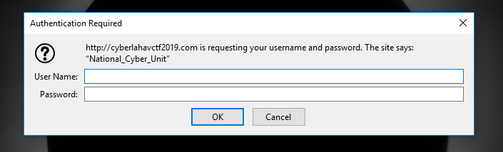

A short reminder about digest authentication:
> Digest access authentication is one of the agreed-upon methods a web server can use to negotiate credentials, such as username or password, with a user's web browser. This can be used to confirm the identity of a user before sending sensitive information, such as online banking transaction history. It applies a hash function to the username and password before sending them over the network.
> Technically, digest authentication is an application of MD5 cryptographic hashing with usage of nonce values to prevent replay attacks. It uses the HTTP protocol. 
> [...] RFC 2069 specifies roughly a traditional digest authentication scheme with  security maintained by a server-generated nonce value. The authentication response is formed as follows (where HA1 and HA2 are names of string variables): 
> 
> ```
> HA1 = MD5(username:realm:password)
> HA2 = MD5(method:digestURI)
> response = MD5(HA1:nonce:HA2)
> ```
> Source: [Wikipedia](https://en.wikipedia.org/wiki/Digest_access_authentication)


Basically, when a client tries to request a resource which is protected by Digest Authentication, the following sequence happens:
1. Client requests resource
2. Server responds with error code 401 ("Unauthorized") and a `WWW-Authenticate` HTTP header, which contains a nonce (among other things)
3. Client calculates `response` (as explained above) and returns it in `Authorization` HTTP header (among other things)
4. Server checks response and decides whether to allow access to resource


A nonce is supposed to be "an arbitrary number that can be used **just once** in a cryptographic communication". However, we know how the nonce is calculated from inspecting `serverSideJS.js`. It takes the user agent string up to the first space, and appends the `time` parameter to it. This means that by modifying the `time` input value from the HTML form, and sending a custom User Agent via the HTTP headers, we can control the nonce. 

Which values should we use? The ones from the log we found!

We start by making a simple request for `/main_page`:
```console
root@kali:/media/sf_CTFs/433/login# curl -v -d "time=23:59" -A "Atomz/1.0" POST http://cyberlahavctf2019.com/main_page
* Rebuilt URL to: POST/
* Could not resolve host: POST
* Closing connection 0
curl: (6) Could not resolve host: POST
*   Trying 207.154.239.211...
* TCP_NODELAY set
* Connected to cyberlahavctf2019.com (207.154.239.211) port 80 (#1)
> POST /main_page HTTP/1.1
> Host: cyberlahavctf2019.com
> User-Agent: Atomz/1.0
> Accept: */*
> Content-Length: 10
> Content-Type: application/x-www-form-urlencoded
>
* upload completely sent off: 10 out of 10 bytes
< HTTP/1.1 401 Unauthorized
< X-Powered-By: Express
< WWW-Authenticate: Digest realm=National_Cyber_Unit ,nonce="5af65be00c55a2181ce76eb95b43fc3be98d54a1",opaque=""
< Date: Tue, 29 Jan 2019 19:36:46 GMT
< Connection: keep-alive
< Transfer-Encoding: chunked
<
<!DOCTYPE html>
<html lang="en" >

<head>
  <meta charset="UTF-8">
  <title>The Forbidden Site</title>

      <link rel="stylesheet" href="css/style.css">

</head>

<body>

        <form class="login-form" action="/main_page" method="post">
                <script src="1.js"></script>
                <script src="serverSideJS.js"></script>
                <p class="login-text"> </p>
                <input type="hidden" id="time" name="time" value=""/>
                <script>
                        document.getElementById("time").value = get_current_time();
                </script>
                <input type="submit" value="Login" class="login-submit" />
        </form>

        <div class="underlay-photo"></div>
        <div class="underlay-black"></div>

</body>

</html>
```

The important part in the response is:
```
WWW-Authenticate: Digest realm=National_Cyber_Unit ,nonce="5af65be00c55a2181ce76eb95b43fc3be98d54a1",opaque=""
```

We use the realm and nonce in the next request, providing also the response from the log. We need to supply a username as well, let's guess "admin" and cross our fingers.
```console
root@kali:/media/sf_CTFs/433/login# curl -v -d "time=23:59" -A "Atomz/1.0" POST http://cyberlahavctf2019.com/main_page -H 'Authorization: Digest username="admin", realm="National_Cyber
_Unit", nonce="5af65be00c55a2181ce76eb95b43fc3be98d54a1", opaque="", uri="/main_page", response="e2b24a6d4c12eb701e9e42d7862d196d"'
* Rebuilt URL to: POST/
* Could not resolve host: POST
* Closing connection 0
curl: (6) Could not resolve host: POST
*   Trying 207.154.239.211...
* TCP_NODELAY set
* Connected to cyberlahavctf2019.com (207.154.239.211) port 80 (#1)
> POST /main_page HTTP/1.1
> Host: cyberlahavctf2019.com
> User-Agent: Atomz/1.0
> Accept: */*
> Authorization: Digest username="admin", realm="National_Cyber_Unit", nonce="5af65be00c55a2181ce76eb95b43fc3be98d54a1", opaque="", uri="/main_page", response="e2b24a6d4c12eb701e9e42d7862d196d"
> Content-Length: 10
> Content-Type: application/x-www-form-urlencoded
>
* upload completely sent off: 10 out of 10 bytes
< HTTP/1.1 200 OK
< X-Powered-By: Express
< Set-Cookie: AccountType=B6FE1C672256EB8D509CD619691F866CA5D02A929ABD37643AC43C58ADD490C5; Max-Age=900; Path=/; Expires=Tue, 29 Jan 2019 19:52:23 GMT; HttpOnly
< Accept-Ranges: bytes
< Cache-Control: public, max-age=0
< Last-Modified: Sun, 27 Jan 2019 06:35:17 GMT
< ETag: W/"7fa-1688e04fa7f"
< Content-Type: text/html; charset=UTF-8
< Content-Length: 2042
< Date: Tue, 29 Jan 2019 19:37:23 GMT
< Connection: keep-alive
<
<!DOCTYPE html>
<html lang="en" >

<head>
  <meta charset="UTF-8">
  <title>The Forbidden Site</title>
  <link rel="stylesheet" href="main.css">
  <link href='https://fonts.googleapis.com/css?family=Cinzel Decorative' rel='stylesheet'>
  <link href='https://fonts.googleapis.com/css?family=Fredericka the Great' rel='stylesheet'>

</head>

<body>
        <script src="2.js"></script>
        <script src="https://npmcdn.com/js-alert/dist/jsalert.min.js"></script>
        <div class="menu">
                <p>
                        <script>
                                function my_alert(){
                                        alert("You Dont Contact Us We Contact You!!!");
                                }
                        </script>
                        <script>var _0x1d20=["\x6F\x6E\x72\x65\x61\x64\x79\x73\x74\x61\x74\x65\x63\x68\x61\x6E\x67\x65","\x72\x65\x61\x64\x79\x53\x74\x61\x74\x65","\x73\x74\x61\x74\x75\x73","\x47\x45\x54","\x2F\x6C\x6F\x61\x64\x5F\x66\x69\x6C\x65","\x6F\x70\x65\x6E","\x73\x65\x6E\x64","\x72\x65\x73\x70\x6F\x6E\x73\x65\x54\x65\x78\x74","\x54\x72\x75\x65","\x2F\x73\x65\x63\x72\x65\x74\x5F\x66\x69\x6C\x65","\x72\x65\x70\x6C\x61\x63\x65","\x6C\x6F\x63\x61\x74\x69\x6F\x6E","\x59\x6F\x75\x20\x64\x6F\x6E\x74\x20\x68\x61\x76\x65\x20\x70\x65\x72\x6D\x69\x73\x73\x69\x6F\x6E\x73\x20\x66\x6F\x72\x20\x74\x68\x61\x74"];function load_file(){var _0x5d43x2= new XMLHttpRequest();_0x5d43x2[_0x1d20[0]]= function(){if(this[_0x1d20[1]]== 4&& this[_0x1d20[2]]== 200){myFunction(this)}};_0x5d43x2[_0x1d20[5]](_0x1d20[3],_0x1d20[4],true);_0x5d43x2[_0x1d20[6]]()}function myFunction(_0x5d43x4){if(_0x5d43x4[_0x1d20[7]]== _0x1d20[8]){window[_0x1d20[11]][_0x1d20[10]](_0x1d20[9])}else {alert(_0x1d20[12])}}</script>
                        <div onclick="my_alert()" style="text-decoration: none;color:white" title >&emsp;Contact Us &emsp;</div>
                        <div class = 'thing' onclick="load_file()" title>Our Secret File</div>
                </p>
        </div>

        <div class="underlay-photo"></div>
        <p class="text_box">Welcome<br/>
        To The<br/>
        Hacker Hub<br/>
        </p>

        <div class="container1"
                <p> This is the hacker hub.
                <br>The site who knows all, sees all, hacks all...</p>
        </div>

        <div class="links"
        </div>


</body>

</html>
```

We were able to bypass the Digest authentication! 

Let's take a look at what we got here. First, there's an obfuscated script:
```javascript
var _0x1d20=["\x6F\x6E\x72\x65\x61\x64\x79\x73\x74\x61\x74\x65\x63\x68\x61\x6E\x67\x65","\x72\x65\x61\x64\x79\x53\x74\x61\x74\x65","\x73\x74\x61\x74\x75\x73","\x47\x45\x54","\x2F\x6C\x6F\x61\x64\x5F\x66\x69\x6C\x65","\x6F\x70\x65\x6E","\x73\x65\x6E\x64","\x72\x65\x73\x70\x6F\x6E\x73\x65\x54\x65\x78\x74","\x54\x72\x75\x65","\x2F\x73\x65\x63\x72\x65\x74\x5F\x66\x69\x6C\x65","\x72\x65\x70\x6C\x61\x63\x65","\x6C\x6F\x63\x61\x74\x69\x6F\x6E","\x59\x6F\x75\x20\x64\x6F\x6E\x74\x20\x68\x61\x76\x65\x20\x70\x65\x72\x6D\x69\x73\x73\x69\x6F\x6E\x73\x20\x66\x6F\x72\x20\x74\x68\x61\x74"];
function load_file(){var _0x5d43x2= new XMLHttpRequest();_0x5d43x2[_0x1d20[0]]= function(){if(this[_0x1d20[1]]== 4&& this[_0x1d20[2]]== 200){myFunction(this)}};_0x5d43x2[_0x1d20[5]](_0x1d20[3],_0x1d20[4],true);_0x5d43x2[_0x1d20[6]]()}
function myFunction(_0x5d43x4){if(_0x5d43x4[_0x1d20[7]]== _0x1d20[8]){window[_0x1d20[11]][_0x1d20[10]](_0x1d20[9])}else {alert(_0x1d20[12])}}
```

After manually de-obfuscating it, we get:
```javascript
var _0x1d20=[
    "onreadystatechange", // 0
    "readyState",// 1
    "status",// 2
    "GET",// 3
    "/load_file",// 4
    "open",// 5
    "send",// 6
    "responseText",// 7
    "True",// 8
    "/secret_file",// 9
    "replace",// 10
    "location",// 11
    "You dont have permissions for that"// 12
    ];
    
function load_file(){
    var ajax_req = new XMLHttpRequest();
    ajax_req["onreadystatechange"]= function(){
        if(this["readyState"]== 4 && this["status"]== 200){
            myFunction(this)
        }
    };
    
    ajax_req["open"]("GET","/load_file",true);
    ajax_req["send"]()
}

function myFunction(that){
    if(that["responseText"]== "True"){
        window["location"]["replace"]("/secret_file")
    }
    else {
        alert("You dont have permissions for that")
    }
}
```

In addition, the page includes `2.js`:
```javascript
var _0x2be5=['length','log','YW45fc9vwUcuLzCWUmUeTC913yt9hunkqKNmYoU2rFGr8e99Pf3UjnZH5EXAULX2dcTbfZrxScREgDFJcLUGSGVhG75Dbo8NVWo956dpENycavPFtbQYMAyhiq8eZJzxdXLpHHHuEKSB4qu3wqfNz5krqWvkXR5qs12F55p5aV9'];
(function(_0x328653,_0x20e5c0){var _0x32f82e=function(_0x4eea02){while(--_0x4eea02){_0x328653['push'](_0x328653['shift']());}};_0x32f82e(++_0x20e5c0);}(_0x2be5,0x1c1));
var _0x3a52=function(_0x2d8f05,_0x4b81bb){_0x2d8f05=_0x2d8f05-0x0;var _0x4d74cb=_0x2be5[_0x2d8f05];return _0x4d74cb;};
function get_admin_cookie(){var _0x48471f=_0x3a52('0x0');var _0x3d069a='';for(i=_0x48471f[_0x3a52('0x1')]-0x1;i>=0x0;i--){_0x3d069a+=_0x48471f[i];}console[_0x3a52('0x2')](_0x3d069a);console['log']('encoding:\x20bitcoin');}
```

This one is a bit harder to de-obfuscate, but we can at least indent it:
```javascript
var _0x2be5=[
    'length',
    'log','YW45fc9vwUcuLzCWUmUeTC913yt9hunkqKNmYoU2rFGr8e99Pf3UjnZH5EXAULX2dcTbfZrxScREgDFJcLUGSGVhG75Dbo8NVWo956dpENycavPFtbQYMAyhiq8eZJzxdXLpHHHuEKSB4qu3wqfNz5krqWvkXR5qs12F55p5aV9'];
    
(function(_0x328653,_0x20e5c0){
    var _0x32f82e=function(_0x4eea02){
        while(--_0x4eea02){
            _0x328653['push'](_0x328653['shift']());
        }
    };
    _0x32f82e(++_0x20e5c0);
}(_0x2be5,0x1c1));

var _0x3a52=function(_0x2d8f05,_0x4b81bb){
    _0x2d8f05=_0x2d8f05-0x0;
    var _0x4d74cb=_0x2be5[_0x2d8f05];
    return _0x4d74cb;
};

function get_admin_cookie(){
    var _0x48471f=_0x3a52('0x0');
    var _0x3d069a='';
    for(i=_0x48471f[_0x3a52('0x1')]-0x1;i>=0x0;i--){
        _0x3d069a+=_0x48471f[i];
    }
    console[_0x3a52('0x2')](_0x3d069a);
    console['log']('encoding:\x20bitcoin');
}
```

So what do we have? Clicking on the link `Our Secret File` will call the javascript function `load_file`, which will make an AJAX request to `/load_file`. If the request is successful and the response text is `True`, we get redirected to `/secret_file`. 

What happens if we try to access `/secret_file` directly? We get:

```
TypeError: Cannot read property '0' of undefined
    at /root/apps/CTF/app.js:135:22
    at Layer.handle [as handle_request] (/root/apps/CTF/node_modules/express/lib/router/layer.js:95:5)
    at next (/root/apps/CTF/node_modules/express/lib/router/route.js:137:13)
    at Route.dispatch (/root/apps/CTF/node_modules/express/lib/router/route.js:112:3)
    at Layer.handle [as handle_request] (/root/apps/CTF/node_modules/express/lib/router/layer.js:95:5)
    at /root/apps/CTF/node_modules/express/lib/router/index.js:281:22
    at Function.process_params (/root/apps/CTF/node_modules/express/lib/router/index.js:335:12)
    at next (/root/apps/CTF/node_modules/express/lib/router/index.js:275:10)
    at SendStream.error (/root/apps/CTF/node_modules/serve-static/index.js:121:7)
    at emitOne (events.js:116:13)
```

This is different than the regular 404 response for the site, which usually outputs something similar to:
```
Cannot GET /asdf
```

Perhaps we need to use the logic in `2.js`. By running it locally and using the browser developer console to call `get_admin_cookie()`, we get:
```
>>> get_admin_cookie()
9Va5p55F21sq5RXkvWqrk5zNfqw3uq4BSKEuHHHpLXdxzJZe8qihyAMYQbtFPvacyNEpd659oWVN8obD57GhVGSGULcJFDgERcSxrZfbTcd2XLUAXE5HZnjU3fP99e8rGFr2UoYmNKqknuh9ty319CTeUmUWCzLucUwv9cf54WY 2.js:31:28
encoding: bitcoin 2.js:32:5
undefined
```

A quick search reveals that "bitcoin encoding" is also known as "base58 encoding", and we can easily find an online decoder:

```console
# curl "http://lenschulwitz.com/base58er" --data "address=9Va5p55F21sq5RXkvWqrk5zNfqw3uq4BSKEuHHHpLXdxzJZe8qihyAMYQbtFPvacyNEpd659oWVN8obD57GhVGSGULcJFDgERcSxrZfbTcd2XLUAXE5HZnjU3fP99e8rGFr2UoYmNKqknuh9ty319CTeUmUWCzLucUwv9cf54WY&b58action=decode"
7B0A09686173683A207368613235360A09636F6F6B6965206E616D653A204163636F756E74547970650A096C656E6774683A20340A0956616C3A65313563663632356466396365353661313233663762326434383138646439323738616331643835353363333130616566386661393939306639643662333661200A7D
```

Let's decode that as ASCII:
```console
# curl -s "http://lenschulwitz.com/base58er" --data "address=9Va5p55F21sq5RXkvWqrk5zNfqw3uq4BSKEuHHHpLXdxzJZe8qihyAMYQbtFPvacyNEpd659oWVN8obD57GhVGSGULcJFDgERcSxrZfbTcd2XLUAXE5HZnjU3fP99e8rGFr2UoYmNKqknuh9ty319CTeUmUWCzLucUwv9cf54WY&b58action=decode" | xxd -r -p && echo
{
        hash: sha256
        cookie name: AccountType
        length: 4
        Val:e15cf625df9ce56a123f7b2d4818dd9278ac1d8553c310aef8fa9990f9d6b36a
}
```

We are searching for a string of length 4 with a given SHA256 value, should be easy to brute-force:
```python
import string
import hashlib
from itertools import product

HASH = "e15cf625df9ce56a123f7b2d4818dd9278ac1d8553c310aef8fa9990f9d6b36a"
for word in (''.join(i) for i in product(string.printable, repeat = 4)):
    h = hashlib.sha256(word).hexdigest()
    if h == HASH:
        print word
        break
```

Answer is received in a few seconds: `1haV`.

Now we can try to download the secret file:
```console
root@kali:/media/sf_CTFs/433/login# curl -v -X GET http://cyberlahavctf2019.com/secret_file --cookie "AccountType=1haV" -O
Note: Unnecessary use of -X or --request, GET is already inferred.
  % Total    % Received % Xferd  Average Speed   Time    Time     Time  Current
                                 Dload  Upload   Total   Spent    Left  Speed
  0     0    0     0    0     0      0      0 --:--:--  0:00:04 --:--:--     0*   Trying 207.154.239.211...
* TCP_NODELAY set
* Connected to cyberlahavctf2019.com (207.154.239.211) port 80 (#0)
> GET /secret_file HTTP/1.1
> Host: cyberlahavctf2019.com
> User-Agent: curl/7.61.0
> Accept: */*
> Cookie: AccountType=1haV
>
< HTTP/1.1 200 OK
< X-Powered-By: Express
< Content-disposition: attachment; filename=success.rar
< Content-type: application/x-rar-compressed
< Date: Tue, 29 Jan 2019 20:52:48 GMT
< Connection: keep-alive
< Transfer-Encoding: chunked
<
{ [3850 bytes data]
100  501k    0  501k    0     0  87666      0 --:--:--  0:00:05 --:--:--  109k

root@kali:/media/sf_CTFs/433/login# file secret_file
secret_file: RAR archive data, v4, os: Win32

root@kali:/media/sf_CTFs/433/login# rar v success.rar

RAR 5.50   Copyright (c) 1993-2017 Alexander Roshal   11 Aug 2017
Trial version             Type 'rar -?' for help

Archive: success.rar
Details: RAR 4

 Attributes      Size    Packed Ratio    Date    Time   Checksum  Name
----------- ---------  -------- ----- ---------- -----  --------  ----
    ..A....      1375      1221  88%  2019-01-24 17:18  E18C5927  sucess/A1w4ysG0_l3ft2RIGHT.png
    ..A....   1146720    512134  44%  2019-01-24 17:51  7D4A1833  sucess/Huffman Queue.wav
    ...D...         0         0   0%  2019-01-24 19:07  00000000  sucess
----------- ---------  -------- ----- ---------- -----  --------  ----
              1148095    513355  44%                              3
```

We get two files. First, an image:

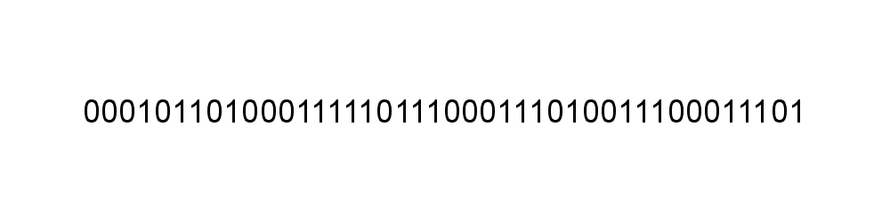

This image contains the following string:
```
000101101000111110111000111010011100011101
```

In addition, we get an audio file. Playing the file provides no meaningful output, so the meaning must be hiding elsewhere. The file name is "Huffman Queue" which is our first hint.

When running `exiftool` on the file, we get our second hint:
```console
# exiftool Huffman_Queue.wav
ExifTool Version Number         : 11.10
File Name                       : Huffman_Queue.wav
Directory                       : .
File Size                       : 1120 kB
File Modification Date/Time     : 2019:01:24 17:51:14+02:00
File Access Date/Time           : 2019:01:29 22:53:49+02:00
File Inode Change Date/Time     : 2019:02:03 22:12:55+02:00
File Permissions                : rwxrwx---
File Type                       : WAV
File Type Extension             : wav
MIME Type                       : audio/x-wav
Encoding                        : Microsoft PCM
Num Channels                    : 1
Sample Rate                     : 44100
Avg Bytes Per Sec               : 88200
Bits Per Sample                 : 16
Artist                          : Guassian 3.5
Duration                        : 13.00 s
```

The artist name is "Guassian 3.5" - a reference to a type of FFT window in signal analysis. 

The standard tool for viewing and analyzing audio files is usually Audacity:

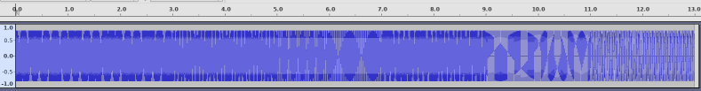

Here we can see that the amplitude of the signal does not vary, while frequency does. Zooming in to the wavform, we can see a change of frequency at the ninth second:

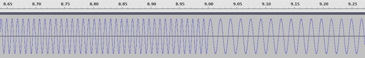

By displaying the spectrogram (clicking the black arrow next to the file name) and modifying the parameters a bit, we can see a nice visualization of the different frequencies:

* Scale: Logarithmic
* Algorithm: Frequencies
* Window size: 8192
* Window type: **Gaussian(a=3.5)**

The result:

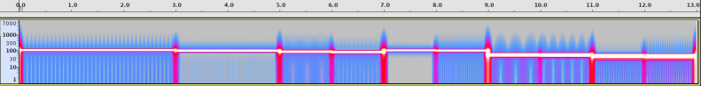

We can see that the frequency changes once at the 3rd second, then again at the 5th second, and then every second until the end (13 seconds total).

The next step would be to identify the frequency of each segment. We can do that by selecting a segment and clicking on "Analyze -> Plot Spectrum".

For example, this is the Frequency for 0.0-1.0, after the sample rate to 32768 (the maximum for a 1 second range) and the function to **Gaussian(a=3.5)** (like the hint):


We can see in the "Peak" field the value of "111 Hz".

If we repeat this for every 1 second range in the file, we get:

```
111, 111, 111, 103, 103, 89, 85, 108, 105, 57, 56, 48, 47
```

Notice how all the values are in the ASCII printable range, which is usually a good sign. Translated to ASCII, we get:

```
o, o, o, g, g, Y, U, l, i, 9, 8, 0, /
```

We even got a slash, which is great since it can be used to represent a URI path.

However, this is where I got stuck, I wasn't able to turn this into anything meaningful. Consulted a friend which has worked with me on some CTFs in the past (Yaakov Cohen), but we were both stumped until we got the following two hints:
1. The sample rate needs to be 1024 and not 32768 (not cool!)
2. The output needs to be used to build a Huffman tree in order to decode the bit stream above (we considered that already and overruled it since there are many ways to build a Huffman tree when several characters have the same frequency - so also not cool!)

The first hint brought us to the following frequency peaks:
```
111, 111, 111, 103, 103, 89, 85, 108, 105, 57, 56, 47, 46
o,   o,   o,   g,   g,   Y,  U,  l,   i,   9,  8,  /,  .
```

We kept our "/", and also gained a ".". Yaakov immediately saw that this looks like the Google URL Shortener `goo.gl/`. Formally, the Huffman tree can be built using the following script:

```python
import heapq
from collections import namedtuple, Counter

text = "oooggYUli98/."
msg = list("000101101000111110111000111010011100011101")

QueueEntry = namedtuple('QueueEntry', 'node insertion_order')

class Node(object):
    def __init__(self, data, freq, small, big):
        self.data = data
        self.freq = freq
        self.left = small
        self.right = big

    def __eq__(self, other):
        return other.freq == self.freq

    def __lt__(self, other):
         return self.freq < other.freq

    def __str__(self):
        return "('{}', {})".format(self.data, self.freq)

    def __repr__(self):
        return str(self)

queue = []
counter = 0
for item in Counter(text).items():
    letter, frequency = item
    heapq.heappush(queue, QueueEntry(  Node(data = letter,
                                            freq = frequency,
                                            small = None,
                                            big = None),
                                       -1 * counter))
    counter += 1


while (len(queue) > 1):
    small = heapq.heappop(queue).node
    big = heapq.heappop(queue).node
    new = Node(data = None, freq = small.freq + big.freq, small=small, big=big)
    heapq.heappush(queue, QueueEntry(new, -1 * counter))
    counter += 1

root = heapq.heappop(queue).node

tree = {}
def build_tree(node, s):
    if node.data != None:
        tree[s] = node.data
        return
    build_tree(node.left, s + '0')
    build_tree(node.right, s + '1')

build_tree(root, "")
print(tree)

c = ""
while (len(msg) != 0):
    c += msg.pop(0)
    if c in tree:
        print(tree[c], end='')
        c = ""
```

In this implementation, we maintain the order of insertion to the priority queue, so that an item which is being inserted to the queue and has the same priority as an item which was inserted before, will be placed after the old item. We do this by using tuples of two elements as entries of the queue: `node` and `insertion_order`. The `node` contains a `Node` class instance, which compares itself to other `Nodes` by comparing the frequency, so when two nodes have different frequencies, their order in the queue is determined by that value alone. When the frequencies are equal, the comparison moves on to the next entry in the tuple, which is a negative running counter, so that newly inserted items always have a lower priority compared to existing items.

Running the script gives the following result:
```
{'00': 'g', '01': 'o', '1000': '8', '1001': '9', '1010': '.', '1011': '/', '1100': 'U', '1101': 'Y', '1110': 'i', '1111': 'l'}
goo.gl/8i9UoY
```

As a tree, it looks like this:
```
        _____________#_______________                              
      0/                             \1                            
    __#__                   __________#___________                 
  0/     \1               0/                      \1               
  g       o          _____#____                ____#_____          
                   0/          \1            0/          \1        
                ___#___      ___#___      ___#___      ___#___     
              0/       \1  0/       \1  0/       \1  0/       \1   
              8         9  .         /  U         Y  i         l   
```

The left hand branch of each node is encoded as 0, and the right hand branch is encoded as 1. So to get from the root to "g", we go twice left, meaning that the encoding is "00". To get to "U", we go right, right, left, left, so the encoding is "1100".

Off to goo.gl/8i9UoY, we continue, which brings us to a Telegram channel called "R U ready?", owned by "Lahav 433 cyber unit".

The channel offered RAR file for download:


```console
root@kali:/media/sf_CTFs/433/1N7ERCEP7U5# ls
Instructions.json Server.ova Client.ova
root@kali:/media/sf_CTFs/433/1N7ERCEP7U5# cat Instructions.json
{
  "Password": "laeyobmsamlrdmyh",
  "Commands": [
    "whoami",
    "ls",
    "time",
        "get flag",
        "get key",
    "downloadfile [filename]",
    "help",
    "quit"
  ]
}
```

We have two [*.ova](https://en.wikipedia.org/wiki/Open_Virtualization_Format) files, which is a format used to distribute software to be run in virtual machines.

Therefore, the next step is to import Client.ova and Server.ova into VirtualBox using "File -> Import Appliance".

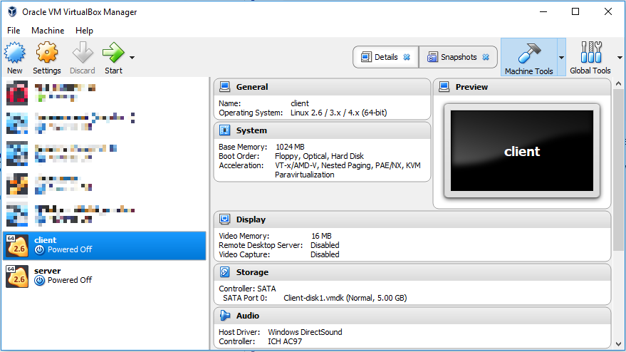

We start the machines and observe.

The server boots to the following screen:

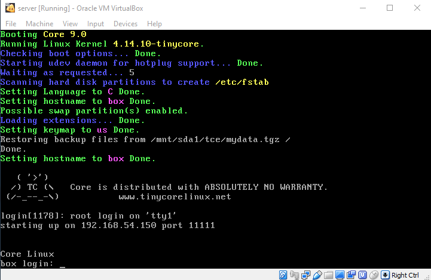

The client boots to the following screen:

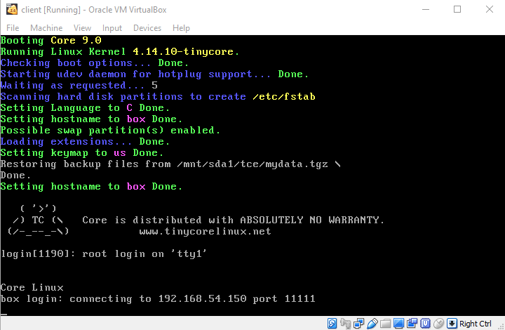

Trying to connect to either of the machines with the password supplied in the JSON file is unsuccessful.

So we have a server listening on 192.168.54.150:11111 and a client trying to connect to this address. Time to launch Wireshark and try to analyze the traffic. 

In order to reduce noise and gain better control over the network, it made sense to me to create a new host network interface using VirtualBox and assign it the subnet of 192.168.54.x:

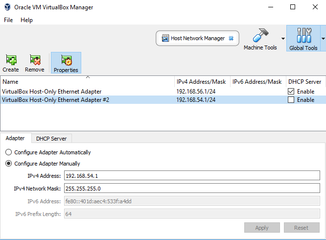

I then assigned this new adapter as a Host-only adapter of the two virtual machines we got, in addition to a third machine which acts as a controller of sorts.

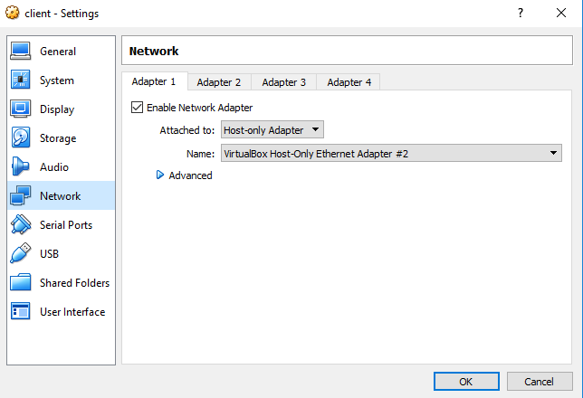


Once the machines were booted again, Wireshark captured the following network traffic:

```console
root@kali:/media/sf_CTFs/433/1N7ERCEP7U5/pcap# tshark -r traffic.pcapng
    1 0.000000000 PcsCompu_f4:51:fa → Broadcast    ARP 60 Who has 192.168.54.150? Tell 192.168.54.151
    2 0.000009993 PcsCompu_14:69:d5 → PcsCompu_f4:51:fa ARP 60 192.168.54.150 is at 08:00:27:14:69:d5
    3 0.000137690 192.168.54.151 → 192.168.54.150 TCP 74 36716 → 11111 [SYN] Seq=0 Win=29200 Len=0 MSS=1460 SACK_PERM=1 TSval=3318941419 TSecr=0 WS=128 36716 11111
    4 0.000233057 192.168.54.150 → 192.168.54.151 TCP 74 11111 → 36716 [SYN, ACK] Seq=0 Ack=1 Win=28960 Len=0 MSS=1460 SACK_PERM=1 TSval=1043065940 TSecr=3318941419 WS=128 11111 36716
    5 0.000388519 192.168.54.151 → 192.168.54.150 TCP 66 36716 → 11111 [ACK] Seq=1 Ack=1 Win=29312 Len=0 TSval=3318941420 TSecr=1043065940 36716 11111
    6 0.039759345 192.168.54.150 → 192.168.54.151 TCP 82 11111 → 36716 [PSH, ACK] Seq=1 Ack=1 Win=29056 Len=16 TSval=1043065980 TSecr=3318941420 11111 36716
    7 0.039875575 192.168.54.150 → 192.168.54.151 TCP 66 11111 → 36716 [FIN, ACK] Seq=17 Ack=1 Win=29056 Len=0 TSval=1043065980 TSecr=3318941420 11111 36716
    8 0.039878363 192.168.54.151 → 192.168.54.150 TCP 66 36716 → 11111 [ACK] Seq=1 Ack=17 Win=29312 Len=0 TSval=3318941459 TSecr=1043065980 36716 11111
    9 0.040145647 192.168.54.151 → 192.168.54.150 TCP 66 36716 → 11111 [FIN, ACK] Seq=1 Ack=18 Win=29312 Len=0 TSval=3318941459 TSecr=1043065980 36716 11111
   10 0.040235053 192.168.54.150 → 192.168.54.151 TCP 66 11111 → 36716 [ACK] Seq=18 Ack=2 Win=29056 Len=0 TSval=1043065980 TSecr=3318941459 11111 36716
   11 1.045147271 192.168.54.151 → 192.168.54.150 TCP 74 35700 → 15850 [SYN] Seq=0 Win=29200 Len=0 MSS=1460 SACK_PERM=1 TSval=3318942463 TSecr=0 WS=128 35700 15850
   12 1.045439731 192.168.54.150 → 192.168.54.151 TCP 74 15850 → 35700 [SYN, ACK] Seq=0 Ack=1 Win=28960 Len=0 MSS=1460 SACK_PERM=1 TSval=1043066985 TSecr=3318942463 WS=128 15850 35700
   13 1.045933465 192.168.54.151 → 192.168.54.150 TCP 66 35700 → 15850 [ACK] Seq=1 Ack=1 Win=29312 Len=0 TSval=3318942465 TSecr=1043066985 35700 15850
   14 5.063573683 PcsCompu_14:69:d5 → PcsCompu_f4:51:fa ARP 60 Who has 192.168.54.151? Tell 192.168.54.150
   15 5.063997581 PcsCompu_f4:51:fa → PcsCompu_14:69:d5 ARP 60 192.168.54.151 is at 08:00:27:f4:51:fa
   16 121.177132417 192.168.54.151 → 192.168.54.150 TCP 72 35700 → 15850 [PSH, ACK] Seq=1 Ack=1 Win=29312 Len=6 TSval=3319062535 TSecr=1043066985 35700 15850
   17 121.177587403 192.168.54.150 → 192.168.54.151 TCP 66 15850 → 35700 [ACK] Seq=1 Ack=7 Win=29056 Len=0 TSval=1043187056 TSecr=3319062535 15850 35700
   18 121.178018522 192.168.54.150 → 192.168.54.151 TCP 91 15850 → 35700 [PSH, ACK] Seq=1 Ack=7 Win=29056 Len=25 TSval=1043187057 TSecr=3319062535 15850 35700
   19 121.178396954 192.168.54.151 → 192.168.54.150 TCP 66 35700 → 15850 [ACK] Seq=7 Ack=26 Win=29312 Len=0 TSval=3319062537 TSecr=1043187057 35700 15850
   20 126.272890626 PcsCompu_f4:51:fa → PcsCompu_14:69:d5 ARP 60 Who has 192.168.54.150? Tell 192.168.54.151
   21 126.273127272 PcsCompu_14:69:d5 → PcsCompu_f4:51:fa ARP 60 192.168.54.150 is at 08:00:27:14:69:d5
   22 126.297370899 PcsCompu_14:69:d5 → PcsCompu_f4:51:fa ARP 60 Who has 192.168.54.151? Tell 192.168.54.150
   23 126.297467854 PcsCompu_f4:51:fa → PcsCompu_14:69:d5 ARP 60 192.168.54.151 is at 08:00:27:f4:51:fa
   24 241.318067318 192.168.54.151 → 192.168.54.150 TCP 74 35700 → 15850 [PSH, ACK] Seq=7 Ack=26 Win=29312 Len=8 TSval=3319182616 TSecr=1043187057 35700 15850
   25 241.318842868 192.168.54.150 → 192.168.54.151 TCP 91 15850 → 35700 [PSH, ACK] Seq=26 Ack=15 Win=29056 Len=25 TSval=1043307138 TSecr=3319182616 15850 35700
   26 241.320511830 192.168.54.151 → 192.168.54.150 TCP 66 35700 → 15850 [ACK] Seq=15 Ack=51 Win=29312 Len=0 TSval=3319182619 TSecr=1043307138 35700 15850
   27 246.439909724 PcsCompu_f4:51:fa → PcsCompu_14:69:d5 ARP 60 Who has 192.168.54.150? Tell 192.168.54.151
   28 246.440595748 PcsCompu_14:69:d5 → PcsCompu_f4:51:fa ARP 60 192.168.54.150 is at 08:00:27:14:69:d5
   29 246.465037762 PcsCompu_14:69:d5 → PcsCompu_f4:51:fa ARP 60 Who has 192.168.54.151? Tell 192.168.54.150
   30 246.465719604 PcsCompu_f4:51:fa → PcsCompu_14:69:d5 ARP 60 192.168.54.151 is at 08:00:27:f4:51:fa
   31 361.482437470 192.168.54.151 → 192.168.54.150 TCP 74 35700 → 15850 [PSH, ACK] Seq=15 Ack=51 Win=29312 Len=8 TSval=3319302721 TSecr=1043307138 35700 15850
   32 361.483256608 192.168.54.150 → 192.168.54.151 TCP 91 15850 → 35700 [PSH, ACK] Seq=51 Ack=23 Win=29056 Len=25 TSval=1043427242 TSecr=3319302721 15850 35700
   33 361.484115437 192.168.54.151 → 192.168.54.150 TCP 66 35700 → 15850 [ACK] Seq=23 Ack=76 Win=29312 Len=0 TSval=3319302723 TSecr=1043427242 35700 15850
   34 366.607010922 PcsCompu_f4:51:fa → PcsCompu_14:69:d5 ARP 60 Who has 192.168.54.150? Tell 192.168.54.151
   35 366.607023914 PcsCompu_14:69:d5 → PcsCompu_f4:51:fa ARP 60 192.168.54.150 is at 08:00:27:14:69:d5
   36 366.630833279 PcsCompu_14:69:d5 → PcsCompu_f4:51:fa ARP 60 Who has 192.168.54.151? Tell 192.168.54.150
   37 366.631135125 PcsCompu_f4:51:fa → PcsCompu_14:69:d5 ARP 60 192.168.54.151 is at 08:00:27:f4:51:fa
   38 481.646232022 192.168.54.151 → 192.168.54.150 TCP 72 35700 → 15850 [PSH, ACK] Seq=23 Ack=76 Win=29312 Len=6 TSval=3319422824 TSecr=1043427242 35700 15850
   39 481.646731995 192.168.54.150 → 192.168.54.151 TCP 91 15850 → 35700 [PSH, ACK] Seq=76 Ack=29 Win=29056 Len=25 TSval=1043547346 TSecr=3319422824 15850 35700
   40 481.647153247 192.168.54.151 → 192.168.54.150 TCP 66 35700 → 15850 [ACK] Seq=29 Ack=101 Win=29312 Len=0 TSval=3319422826 TSecr=1043547346 35700 15850
   41 486.772498057 PcsCompu_f4:51:fa → PcsCompu_14:69:d5 ARP 60 Who has 192.168.54.150? Tell 192.168.54.151
   42 486.774421458 PcsCompu_14:69:d5 → PcsCompu_f4:51:fa ARP 60 192.168.54.150 is at 08:00:27:14:69:d5
   43 486.798472755 PcsCompu_14:69:d5 → PcsCompu_f4:51:fa ARP 60 Who has 192.168.54.151? Tell 192.168.54.150
   44 486.798911741 PcsCompu_f4:51:fa → PcsCompu_14:69:d5 ARP 60 192.168.54.151 is at 08:00:27:f4:51:fa
```


What do we have here? The client (192.168.54.151) initiates a connection with the server (192.168.54.150) on port 11111 (packet #3-5).

The server sends some data to the client (packet #6):

```console
root@kali:/media/sf_CTFs/433/1N7ERCEP7U5/pcap# tshark -r traffic.pcapng -Y frame.number==6 -T json  -e data.data
[
  {
    "_index": "packets-2019-02-18",
    "_type": "pcap_file",
    "_score": null,
    "_source": {
      "layers": {
        "data.data": ["c1:88:51:ba:99:ab:41:41:7e:05:56:a9:9b:6d:38:fb"]
      }
    }
  }

]
```

The server closes the connection (packets #7-9). Immediately after that, the client connects to a different port - 15850 (packets #11-13). This port is nowhere to be seen in the data received from the server.

Then, every two minutes, the client sends data to the server and receives a response (#16-19, #24-26, etc.):

```
root@kali:/media/sf_CTFs/433/1N7ERCEP7U5/pcap# tshark -r traffic.pcapng -qz follow,tcp,ascii,1

===================================================================
Follow: tcp,ascii
Filter: tcp.stream eq 1
Node 0: 192.168.54.151:35700
Node 1: 192.168.54.150:15850
6
123456
        25
wrong password, try again
8
password
        25
wrong password, try again
8
12345678
        25
wrong password, try again
6
qwerty
        25
wrong password, try again
===================================================================
```

We see that the client is trying to log in with different passwords, and the server is rejecting the passwords. Perhaps this is where the password from the JSON file fits in?

So we just have to connect to the same port and send our password, no?

Here's a Python script that will try to do that:
```python
import socket

TCP_IP = '192.168.54.150'
TCP_PORT = 15850
BUFFER_SIZE = 1024
MESSAGE = "laeyobmsamlrdmyh"

s = socket.socket(socket.AF_INET, socket.SOCK_STREAM)
s.connect((TCP_IP, TCP_PORT))
s.send(MESSAGE)
data = s.recv(BUFFER_SIZE)
s.close()

print "received data:", data
```

However, the server just ACKs the message, as seen in the following capture:

```
    1 0.000000000 192.168.54.151 → 192.168.54.150 TCP 73 35700 → 15850 [PSH, ACK] Seq=1 Ack=1 Win=229 Len=7 TSval=3320863856 TSecr=1044868275 35700 15850
    2 0.000429219 192.168.54.150 → 192.168.54.151 TCP 91 15850 → 35700 [PSH, ACK] Seq=1 Ack=8 Win=227 Len=25 TSval=1044988377 TSecr=3320863856 15850 35700
    3 0.001079105 192.168.54.151 → 192.168.54.150 TCP 66 35700 → 15850 [ACK] Seq=8 Ack=26 Win=229 Len=0 TSval=3320863857 TSecr=1044988377 35700 15850
    4 5.161008116 PcsCompu_f4:51:fa → PcsCompu_14:69:d5 ARP 60 Who has 192.168.54.150? Tell 192.168.54.151
    5 5.161636569 PcsCompu_14:69:d5 → PcsCompu_f4:51:fa ARP 60 192.168.54.150 is at 08:00:27:14:69:d5
    6 5.187090877 PcsCompu_14:69:d5 → PcsCompu_f4:51:fa ARP 60 Who has 192.168.54.151? Tell 192.168.54.150
    7 5.187526058 PcsCompu_f4:51:fa → PcsCompu_14:69:d5 ARP 60 192.168.54.151 is at 08:00:27:f4:51:fa
    8 7.568105122 192.168.54.1 → 192.168.54.150 TCP 60 65218 → 15850 [RST, ACK] Seq=1 Ack=1 Win=0 Len=0 65218 15850
    9 7.682326812 192.168.54.1 → 192.168.54.150 TCP 66 65221 → 15850 [SYN] Seq=0 Win=64240 Len=0 MSS=1460 WS=256 SACK_PERM=1 65221 15850
   10 7.682508917 192.168.54.150 → 192.168.54.1 TCP 66 15850 → 65221 [SYN, ACK] Seq=0 Ack=1 Win=29200 Len=0 MSS=1460 SACK_PERM=1 WS=128 15850 65221
   11 7.682648282 192.168.54.1 → 192.168.54.150 TCP 60 65221 → 15850 [ACK] Seq=1 Ack=1 Win=525568 Len=0 65221 15850
   12 7.683109519 192.168.54.1 → 192.168.54.150 TCP 60 65221 → 15850 [PSH, ACK] Seq=1 Ack=1 Win=525568 Len=4 65221 15850
   13 7.683112379 192.168.54.150 → 192.168.54.1 TCP 60 15850 → 65221 [ACK] Seq=1 Ack=5 Win=29312 Len=0 15850 65221
   14 12.870963103 PcsCompu_14:69:d5 → 0a:00:27:00:00:0c ARP 60 Who has 192.168.54.1? Tell 192.168.54.150
   15 12.870976254 0a:00:27:00:00:0c → PcsCompu_14:69:d5 ARP 60 192.168.54.1 is at 0a:00:27:00:00:0c
```

Packets 1-3 show the real client sending an incorrect password to the server (packet #2) and receiving a response that the password is invalid (packet #3).

Packets 9-13 show the controller (IP: 192.168.54.1) establishing a TCP connection with the server, and sending the password (packet #12). The server just responds with an ACK (packet #13). One possible explanation would be that the server acts differently for incorrect and correct passwords, however repeating the experiment with an incorrect password still can't get the server to send any response.

Another observation from running the flow multiple times is that each time, after connecting to port 11111 and receiving a 16-byte message from the server, the client connects to a different port. 

In the example, the client received a response of `c18851ba99ab41417e0556a99b6d38fb` and connected to port 15850. Other experiments showed the following results:
```
7b74622e35280296ffc437b6fc5a2625 -> port 24321
c836c672c2a168780447189a2d949b9d -> port 21247
3074dd34f4ef97b1b8f73dcf4afabe13 -> port 20655
```

The port was never part of the plaintext message, meaning that the client and server are agreeing on a port using some different kind of protocol. This means that we can't simply write a client that connects to 11111, receives the 16-byte buffer and then connects to the new port and sends the password, since we don't know what the new port will be. And since we can't connect to the new port after the real client has connected to it, we need a different way to attack this problem.

I had two ideas as to how to proceed from this point: An easy way and a harder way. I started with the easy way...

The easy way:
We have two virtual machines, with two virtual hard drives. If we use each drive as a boot device, we boot to the operating systems like we saw before. What happens though if we just mount these HDs as secondary storage devices to an existing virtual machine?

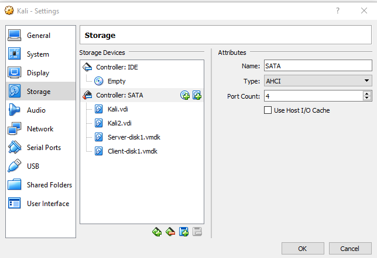

The answer is that we get direct access to the contents and can read any file we want!

Notice how the client and the server print the following line when booting:

```
Restoring backup files from /mnt/sda1/tce/mydata.tgz
```

After booting to the controller, we start by listing the storage devices we have:
```console
root@kali:/# fdisk -l | grep Disk
Disk /dev/sda: 16 GiB, 17179869184 bytes, 33554432 sectors
Disklabel type: dos
Disk identifier: 0x034c7279
Disk /dev/sdb: 16 GiB, 17179869184 bytes, 33554432 sectors
Disklabel type: dos
Disk identifier: 0xc773fc5f
Disk /dev/sdc: 5 GiB, 5368709120 bytes, 10485760 sectors
Disklabel type: dos
Disk identifier: 0x00000000
Disk /dev/sdd: 5 GiB, 5368709120 bytes, 10485760 sectors
Disklabel type: dos
Disk identifier: 0x00000000
```

There are four disks. The first two are part of my regular setup, leaving `/dev/sdc` and `/dev/sdd` which are the two new devices. Let's mount them:

```console
root@kali:/# mount /dev/sdc1 /mnt/m/ --read-only
root@kali:/# cd /mnt/m
root@kali:/mnt/m# ls
lost+found  tce
root@kali:/mnt/m# ls tce
boot  firstrun  mydata.tgz  onboot.lst  ondemand  optional  xwbar.lst
root@kali:/mnt/m# tar -tvf tce/mydata.tgz
drwxrwsr-x root/staff        0 2019-01-31 13:39 opt/
-rw-rw-r-- tc/staff        153 2019-01-31 13:39 opt/.filetool.lst
-rwxr-xr-x root/staff      186 2019-01-24 16:02 opt/eth0.sh
-rw-r--r-- tc/staff         23 2019-01-24 15:56 opt/.appbrowser
-rw-rw-r-- root/staff       31 2019-01-24 15:55 opt/tcemirror
-rw-rw-r-- root/staff      145 2018-03-19 13:06 opt/.xfiletool.lst
-rwxr-xr-x root/staff      272 2018-03-19 13:06 opt/bootsync.sh
-rwxr-xr-x root/staff      613 2018-03-19 13:06 opt/shutdown.sh
-rwxr-xr-x root/staff       97 2019-01-24 20:07 opt/bootlocal.sh
drwxrwsr-x root/staff        0 2019-01-24 15:52 opt/backgrounds/
drwxrwxr-x root/staff        0 2019-01-24 15:52 home/
drwxr-s--- tc/staff          0 2019-01-31 13:38 home/tc/
drwx--S--- tc/staff          0 2019-01-31 13:37 home/tc/.fltk/
drwx--S--- tc/staff          0 2019-01-31 13:37 home/tc/.fltk/fltk.org/
-rw-r--r-- tc/staff         94 2019-01-31 13:39 home/tc/.fltk/fltk.org/fltk.prefs
-rw-r--r-- tc/staff         97 2019-01-24 16:06 home/tc/.fltk/fltk.org/filechooser.prefs
lrwxrwxrwx root/staff        0 2019-01-31 13:37 home/tc/.wbar -> /usr/local/tce.icons
-rwxr-xr-x tc/staff        275 2019-01-24 15:52 home/tc/.Xdefaults
-rwxr-xr-x tc/staff        103 2019-01-24 15:52 home/tc/.setbackground
-rwxr-xr-x tc/staff        450 2019-01-24 15:52 home/tc/.xsession
-rw-r--r-- tc/staff        920 2018-03-19 13:06 home/tc/.profile
-rw-rw-r-- tc/staff       1815 2019-01-31 13:39 home/tc/.ash_history
-rw-r--r-- tc/staff        446 2018-03-19 13:06 home/tc/.ashrc
-rwxrwxrwx tc/staff      95492 2019-01-24 18:30 home/tc/number.py
-rwxrwxrwx tc/staff     420240 2019-01-27 20:20 home/tc/canudoit.zip
-rwxrwxrwx tc/staff       4555 2019-01-31 13:38 home/tc/server.py
-rwxrwxrwx tc/staff          0 2019-01-31 12:00 home/tc/flag.txt
drwxr-s--- tc/staff          0 2019-01-24 15:52 home/tc/.local/
drwxr-s--- tc/staff          0 2019-01-24 15:52 home/tc/.local/bin/
drwxr-s--- tc/staff          0 2019-01-24 15:52 home/tc/.X.d/
-rw-rw---- root/staff      168 2019-01-24 15:53 etc/shadow
-rwxr-xr-x root/staff      186 2019-01-24 16:02 opt/eth0.sh
-rwxr-xr-x root/root      2432 2019-01-24 16:05 usr/local/lib/python2.7/site-packages/Crypto/pct_warnings.py
-rw-r--r-- root/root     95492 2019-01-24 18:31 usr/local/lib/python2.7/site-packages/Crypto/Util/number.py
```

We can copy `mydata.tgz` to our local filesystem, extract it and inspect the interesting files. Then we should unmount the filesystem using `umount /mnt/m`.

For the server, the interesting files are `canudoit.zip` (we'll get to that much later) and `server.py`:
```python
import socket
import sys
import random
import os
import time
import hashlib
from time import sleep
from Crypto.Cipher import AES


def commands(comm):

    comm_decoded = comm.decode('UTF-8')
    if comm.isdigit():
        return str(comm_decoded)
    elif comm_decoded == 'whoami':
        return 'LUKE, I am your father!'
    elif comm_decoded == 'ls':
        ls = "420240    canudoit.zip\n"
        ls += "4096      Downloads\n"
        ls += "4096      Home\n"
        ls += "4096      Public"

        return ls
    elif comm_decoded == 'time':
        return 'It\'s time to say GOODBYE!'
    elif comm_decoded == 'downloadfile canudoit.zip':
        return 'send zip'
    elif comm_decoded == 'get key':
        key = "AES\n"
        key += "key=4dJhvjFRn2oXraty\n"
        key += "iv=1234567890123456\n"
        key += "MODE_CBC\n"
        return key
    elif comm_decoded == 'get flag':
        g = open('/home/tc/flag.txt', 'r+')
        k = g.read(1024)
        if k == '':
            md5f = hashlib.md5("bazinga").hexdigest()
            nflag = random.randint(10000, 99999)

            flag = ''
            n = 0
            for i in str(nflag):
                flag += md5f[int(i)]
                flag += str(nflag)[n]
                n += 1
            g.write(flag)
        else:
            flag = k
        g.close()
        return "your flag is: " + flag
    elif comm_decoded == 'help':
        return 'I really want to help you, but I hate get COMMANDS!'
    elif comm_decoded == 'quit':
        return 'ok, bye'
    else:
        return 'I can\'t understand you!'


BS = 16
pad = lambda s: s + (BS - len(s) % BS) * chr(BS - len(s) % BS)
unpad = lambda s: s[0:-ord(s[-1])]

server_ip = "192.168.54.150"
# Create a TCP/IP socket
sockfirst = socket.socket(socket.AF_INET, socket.SOCK_STREAM)

# Bind the socket to the port
server_address = (server_ip, 11111)
print >>sys.stderr, 'starting up on %s port %s' % server_address
sockfirst.bind(server_address)

# Listen for incoming connections
sockfirst.listen(1)

# Wait for a connection
#print >>sys.stderr, 'waiting for a connection'
connection_f, client_address_f = sockfirst.accept()
try:
    #print >> sys.stderr, 'connection from', client_address_f
    main_port = random.randint(1024, 65535)
    mport = str(main_port).encode('utf-8')
    encryption_suite = AES.new('4dJhvjFRn2oXraty', AES.MODE_CBC, '1234567890123456')
    raw = pad(mport)
    encrypted = encryption_suite.encrypt(raw)
    #print(str(encrypted))
    connection_f.sendall(encrypted)
finally:
    connection_f.close()

sock_main = socket.socket(socket.AF_INET, socket.SOCK_STREAM)
# Bind the socket to the port
server_address_m = (server_ip, main_port)
#print >> sys.stderr, 'starting up on %s port %s' % server_address_m
sock_main.bind(server_address_m)

# Listen for incoming connections
sock_main.listen(1)

# Wait for a connection
#print >>sys.stderr, 'waiting for a connection'
timeout = time.time() + 3
connection_m, client_address_m = sock_main.accept()

# check if the time pass
if time.time() > timeout:
    connection_m.close()
    print ('connection timeout')

try:
    #print >> sys.stderr, 'connection from', client_address_m
    data = connection_m.recv(4098)
    #print >> sys.stderr, 'received "%s"' % data
    password = 'laeyobmsamlrdmyh'

    # Get in loop
    while data != password:
        connection_m.sendall('wrong password, try again')
        data = connection_m.recv(4098)
        #print >> sys.stderr, 'received "%s"' % data
    while data:
        connection_m.sendall('ok')
        #print('welcome')

        # get first command
        data = connection_m.recv(4098)

        res = 0
        while data != 'quit':
            # get commands
            #print >> sys.stderr, 'received "%s"' % data
            cmd = data.rstrip('\n')
            res = commands(cmd)
            connection_m.send(res)

            if res == 'send zip':
                f = open('/home/tc/canudoit.zip', 'rb')
                f.seek(0)

                l = f.read(1024)
                while (l):
                    connection_m.send(l)
                    l = f.read(1024)
                f.close()

                #print >> sys.stderr, 'Done sending'

            #print('wait to client')
            # wait for next command
            data = connection_m.recv(4098)

        #print >> sys.stderr, 'bye'
        break

    #print >> sys.stderr, 'no more data from', client_address_m
finally:
    # Clean up the connection
    #print >> sys.stderr, 'closing socket'
    connection_m.close()
```

For the client, we have a file called `passwords.txt` with 8MB worth of passwords, and `client.py`:

```python
import socket
import sys
import time
from Crypto.Cipher import AES

BS = 16
pad = lambda s: s + (BS - len(s) % BS) * chr(BS - len(s) % BS)
unpad = lambda s: s[0:-ord(s[-1])]

# read all the passwords
lines = [line.rstrip() for line in open('home/tc/passwords.txt')]

# Create a TCP/IP socket
sock = socket.socket(socket.AF_INET, socket.SOCK_STREAM)

server_ip = "192.168.54.150"
# Connect the socket to the port where the server is listening
server_address = (server_ip, 11111)
res = sock.connect_ex(server_address)
while res != 0:
    res = sock.connect_ex(server_address)

print >>sys.stderr, 'connecting to %s port %s' % server_address
try:
    dport = sock.recv(1024)
    #print >> sys.stderr, 'the encrypted port %s' % dport
    decryption_suite = AES.new('4dJhvjFRn2oXraty', AES.MODE_CBC, '1234567890123456')
    new_port = decryption_suite.decrypt(dport)
    #print >> sys.stderr, 'the new port %s' % new_port

finally:
    sock.close()
time.sleep(1)

# Create the NEW TCP/IP socket
sock_new = socket.socket(socket.AF_INET, socket.SOCK_STREAM)
# Connect the socket to the port where the server is listening
server_address_new = (server_ip, int(new_port))
res1 = sock_new.connect_ex(server_address_new)
while res1 != 0:
    res1 = sock_new.connect_ex(server_address_new)
#print >>sys.stderr, 'connecting to %s port %s' % server_address_new
try:
    for line in lines:
        time.sleep(120)
        # Send data
        #print >> sys.stderr, 'sending "%s"' % line
        # print 'the sent password is ' + repr(line)
        sock_new.sendall(line)
        # receive ack
        data = sock_new.recv(128)

        if data == 'ok':
            break

    # get in to server
    #print >> sys.stderr, 'received "%s"\n' % data
    #print >> sys.stderr, 'password ok, what do you want to do?\n'
    cmd = raw_input('> ')
    answer = ''
    while cmd != 'quit':
        sock_new.sendall(cmd)
        answer = sock_new.recv(1024)
        #print >> sys.stderr, '%s ' % answer
        if answer == 'send zip':
            file_size = 420240
            #print(file_size)
            with open('received_file', 'wb') as f:
                #print ('file opened')
                total = 0
                while total != file_size:
                    dat = sock_new.recv(1024)
                    f.write(dat)
                    total += len(dat)
            #print >> sys.stderr, 'get the file'

        cmd = raw_input('> ')
    # for quit
    if answer != 'send zip' or answer != 'send txt':
        sock_new.sendall(cmd)
finally:
    #print >> sys.stderr, 'closing socket'
    sock_new.close()

```

Now that we've finished cheating, we can go back to solve the challenge using the harder (and intended) method. In order to do that, we need to perform an attack called "TCP Hijacking".

A nice and short explanation of the method we will use can be found [here](https://raw.githubusercontent.com/offensive-security/exploitdb-papers/master/papers/english/13587-tcp-session-hijacking.txt).

The most important part of the explanation is:

> At the establishment of a TCP session the client starts by sending a SYN-packet with a sequence number. This number is used to assure the transmission of packets in a chronological order. It is increased by one with each packet. Both sides of the connection wait for a packet with a specified sequence number. The first seq-number for both directions is random.
> 
> The server responds with an SYN/ACK packet which contains the seq-number of the client+1 and also its own start seq-number. The client confirms everything with an ACK packet including the seq-number of the server+1, and after that the session is established.
>
> To hijack a session it is required to send a packet with a right seq-number, otherwise they are dropped.

So, since we are sitting on the same network as the client and the server, we are able to easily sniff the traffic between them and capture the correct sequence number. We even have a 2 minute delay between every message. 

The article describes a tool named `shijack` that can be used to programmatically  hijack a TCP session. I used a fork called [rshijack
](https://github.com/kpcyrd/rshijack).

The flow is as follows:
1. We start the server and the client and have them negotiate a connection.
2. We start `rshijack` and supply it with the details of the connection, acquired from sniffing the communication between the client and the server.
3. `rshijack` listens to the network, and when the next communication between the client and the server occurs, takes note of the sequence numbers. 
4. `rshijack` informs us that it is now possible to hijack the session.
5. We can send and receive data using the client's session.
6. If the client sends another message, it will be discarded since the sequence numbers will be out of sync.

Here's a network capture showing this in action:
```
    1 0.000000000      0.0.0.0 → 255.255.255.255 DHCP 342 DHCP Discover - Transaction ID 0x4acdf14f 68 67
    2 0.000017537 192.168.54.2 → 255.255.255.255 DHCP 590 DHCP Offer    - Transaction ID 0x4acdf14f 67 68
    3 0.000349474      0.0.0.0 → 255.255.255.255 DHCP 342 DHCP Request  - Transaction ID 0x4acdf14f 68 67
    4 0.000356132 192.168.54.2 → 255.255.255.255 DHCP 590 DHCP ACK      - Transaction ID 0x4acdf14f 67 68
    5 2.114698229 PcsCompu_f4:51:fa → Broadcast    ARP 60 Who has 192.168.54.150? Tell 192.168.54.152
    6 2.114829777 PcsCompu_14:69:d5 → PcsCompu_f4:51:fa ARP 60 192.168.54.150 is at 08:00:27:14:69:d5
    7 2.114924911 192.168.54.152 → 192.168.54.150 TCP 74 43482 → 11111 [SYN] Seq=0 Win=29200 Len=0 MSS=1460 SACK_PERM=1 TSval=3333668464 TSecr=0 WS=128 43482 11111
    8 2.115083143 192.168.54.150 → 192.168.54.152 TCP 74 11111 → 43482 [SYN, ACK] Seq=0 Ack=1 Win=28960 Len=0 MSS=1460 SACK_PERM=1 TSval=2886436575 TSecr=3333668464 WS=128 11111 43482
    9 2.115192155 192.168.54.152 → 192.168.54.150 TCP 66 43482 → 11111 [ACK] Seq=1 Ack=1 Win=29312 Len=0 TSval=3333668464 TSecr=2886436575 43482 11111
   10 2.151619087 192.168.54.150 → 192.168.54.152 TCP 82 11111 → 43482 [PSH, ACK] Seq=1 Ack=1 Win=29056 Len=16 TSval=2886436611 TSecr=3333668464 11111 43482
   11 2.151864567 192.168.54.150 → 192.168.54.152 TCP 66 11111 → 43482 [FIN, ACK] Seq=17 Ack=1 Win=29056 Len=0 TSval=2886436611 TSecr=3333668464 11111 43482
   12 2.151874547 192.168.54.152 → 192.168.54.150 TCP 66 43482 → 11111 [ACK] Seq=1 Ack=17 Win=29312 Len=0 TSval=3333668501 TSecr=2886436611 43482 11111
   13 2.152558680 192.168.54.152 → 192.168.54.150 TCP 66 43482 → 11111 [FIN, ACK] Seq=1 Ack=18 Win=29312 Len=0 TSval=3333668502 TSecr=2886436611 43482 11111
   14 2.152808053 192.168.54.150 → 192.168.54.152 TCP 66 11111 → 43482 [ACK] Seq=18 Ack=2 Win=29056 Len=0 TSval=2886436612 TSecr=3333668502 11111 43482
   15 3.154792038 192.168.54.152 → 192.168.54.150 TCP 74 57984 → 39926 [SYN] Seq=0 Win=29200 Len=0 MSS=1460 SACK_PERM=1 TSval=3333669503 TSecr=0 WS=128 57984 39926
   16 3.155093303 192.168.54.150 → 192.168.54.152 TCP 74 39926 → 57984 [SYN, ACK] Seq=0 Ack=1 Win=28960 Len=0 MSS=1460 SACK_PERM=1 TSval=2886437614 TSecr=3333669503 WS=128 39926 57984
   17 3.155649477 192.168.54.152 → 192.168.54.150 TCP 66 57984 → 39926 [ACK] Seq=1 Ack=1 Win=29312 Len=0 TSval=3333669504 TSecr=2886437614 57984 39926
   18 7.268410598 PcsCompu_14:69:d5 → PcsCompu_f4:51:fa ARP 60 Who has 192.168.54.152? Tell 192.168.54.150
   19 7.268428814 PcsCompu_f4:51:fa → PcsCompu_14:69:d5 ARP 60 192.168.54.152 is at 08:00:27:f4:51:fa
   20 123.313916910 192.168.54.152 → 192.168.54.150 TCP 72 57984 → 39926 [PSH, ACK] Seq=1 Ack=1 Win=29312 Len=6 TSval=3333789602 TSecr=2886437614 57984 39926
   21 123.314325741 192.168.54.150 → 192.168.54.152 TCP 66 39926 → 57984 [ACK] Seq=1 Ack=7 Win=29056 Len=0 TSval=2886557713 TSecr=3333789602 39926 57984
   22 123.314751724 192.168.54.150 → 192.168.54.152 TCP 91 39926 → 57984 [PSH, ACK] Seq=1 Ack=7 Win=29056 Len=25 TSval=2886557714 TSecr=3333789602 39926 57984
   23 123.314960167 192.168.54.152 → 192.168.54.150 TCP 66 57984 → 39926 [ACK] Seq=7 Ack=26 Win=29312 Len=0 TSval=3333789603 TSecr=2886557714 57984 39926
   24 128.329985600 PcsCompu_f4:51:fa → PcsCompu_14:69:d5 ARP 60 Who has 192.168.54.150? Tell 192.168.54.152
   25 128.330472730 PcsCompu_14:69:d5 → PcsCompu_f4:51:fa ARP 60 192.168.54.150 is at 08:00:27:14:69:d5
   26 128.501174650 PcsCompu_14:69:d5 → PcsCompu_f4:51:fa ARP 60 Who has 192.168.54.152? Tell 192.168.54.150
   27 128.501687444 PcsCompu_f4:51:fa → PcsCompu_14:69:d5 ARP 60 192.168.54.152 is at 08:00:27:f4:51:fa
   28 243.476143508 192.168.54.152 → 192.168.54.150 TCP 74 57984 → 39926 [PSH, ACK] Seq=7 Ack=26 Win=29312 Len=8 TSval=3333909704 TSecr=2886557714 57984 39926
   29 243.477067034 192.168.54.150 → 192.168.54.152 TCP 91 39926 → 57984 [PSH, ACK] Seq=26 Ack=15 Win=29056 Len=25 TSval=2886677816 TSecr=3333909704 39926 57984
   30 243.477597432 192.168.54.152 → 192.168.54.150 TCP 66 57984 → 39926 [ACK] Seq=15 Ack=51 Win=29312 Len=0 TSval=3333909706 TSecr=2886677816 57984 39926
   31 248.496005010 PcsCompu_f4:51:fa → PcsCompu_14:69:d5 ARP 60 Who has 192.168.54.150? Tell 192.168.54.152
   32 248.496615046 PcsCompu_14:69:d5 → PcsCompu_f4:51:fa ARP 60 192.168.54.150 is at 08:00:27:14:69:d5
   33 248.667899654 PcsCompu_14:69:d5 → PcsCompu_f4:51:fa ARP 60 Who has 192.168.54.152? Tell 192.168.54.150
   34 248.668385065 PcsCompu_f4:51:fa → PcsCompu_14:69:d5 ARP 60 192.168.54.152 is at 08:00:27:f4:51:fa
   35 248.719714824 PcsCompu_17:82:1b → Broadcast    ARP 42 Who has 192.168.54.150? Tell 192.168.54.151
   36 248.720002615 PcsCompu_14:69:d5 → PcsCompu_17:82:1b ARP 60 192.168.54.150 is at 08:00:27:14:69:d5
   37 248.720013970 192.168.54.152 → 192.168.54.150 TCP 61 57984 → 39926 [PSH, ACK] Seq=15 Ack=26 Win=896 Len=7 57984 39926
   38 248.720439151 192.168.54.150 → 192.168.54.152 TCP 91 39926 → 57984 [PSH, ACK] Seq=51 Ack=22 Win=29056 Len=25 TSval=2886683057 TSecr=3333909706 39926 57984
   39 248.720584380 192.168.54.152 → 192.168.54.150 TCP 54 57984 → 39926 [ACK] Seq=22 Ack=76 Win=512 Len=0 57984 39926
   40 256.595908536 192.168.54.152 → 192.168.54.150 TCP 61 57984 → 39926 [PSH, ACK] Seq=22 Ack=76 Win=896 Len=7 57984 39926
   41 256.596447979 192.168.54.150 → 192.168.54.152 TCP 91 39926 → 57984 [PSH, ACK] Seq=76 Ack=29 Win=29056 Len=25 TSval=2886690929 TSecr=3333909706 39926 57984
   42 256.596591244 192.168.54.152 → 192.168.54.150 TCP 54 57984 → 39926 [ACK] Seq=29 Ack=101 Win=512 Len=0 57984 39926
   43 262.982958681 192.168.54.152 → 192.168.54.150 TCP 71 57984 → 39926 [PSH, ACK] Seq=29 Ack=101 Win=2176 Len=17 57984 39926
   44 262.983434593 192.168.54.150 → 192.168.54.152 TCP 91 39926 → 57984 [PSH, ACK] Seq=101 Ack=46 Win=29056 Len=25 TSval=2886697313 TSecr=3333909706 39926 57984
   45 262.983582911 192.168.54.152 → 192.168.54.150 TCP 54 57984 → 39926 [ACK] Seq=46 Ack=126 Win=512 Len=0 57984 39926
   46 266.088766267 192.168.54.152 → 192.168.54.150 TCP 71 57984 → 39926 [PSH, ACK] Seq=46 Ack=126 Win=2176 Len=17 57984 39926
   47 266.089186727 192.168.54.150 → 192.168.54.152 TCP 91 39926 → 57984 [PSH, ACK] Seq=126 Ack=63 Win=29056 Len=25 TSval=2886700417 TSecr=3333909706 39926 57984
   48 266.089341078 192.168.54.152 → 192.168.54.150 TCP 54 57984 → 39926 [ACK] Seq=63 Ack=151 Win=512 Len=0 57984 39926
   49 272.732277709 192.168.54.152 → 192.168.54.150 TCP 61 57984 → 39926 [PSH, ACK] Seq=63 Ack=151 Win=896 Len=7 57984 39926
   50 272.732753440 192.168.54.150 → 192.168.54.152 TCP 91 39926 → 57984 [PSH, ACK] Seq=151 Ack=70 Win=29056 Len=25 TSval=2886707057 TSecr=3333909706 39926 57984
   51 272.732912549 192.168.54.152 → 192.168.54.150 TCP 54 57984 → 39926 [ACK] Seq=70 Ack=176 Win=512 Len=0 57984 39926
   52 275.949361947 192.168.54.152 → 192.168.54.150 TCP 71 57984 → 39926 [PSH, ACK] Seq=70 Ack=176 Win=2176 Len=17 57984 39926
   53 275.949808104 192.168.54.150 → 192.168.54.152 TCP 91 39926 → 57984 [PSH, ACK] Seq=176 Ack=87 Win=29056 Len=25 TSval=2886710273 TSecr=3333909706 39926 57984
   54 275.949952052 192.168.54.152 → 192.168.54.150 TCP 54 57984 → 39926 [ACK] Seq=87 Ack=201 Win=512 Len=0 57984 39926
   55 281.874257810 192.168.54.152 → 192.168.54.150 TCP 70 57984 → 39926 [PSH, ACK] Seq=87 Ack=201 Win=2048 Len=16 57984 39926
   56 281.875473920 192.168.54.150 → 192.168.54.152 TCP 68 39926 → 57984 [PSH, ACK] Seq=201 Ack=103 Win=29056 Len=2 TSval=2886716195 TSecr=3333909706 39926 57984
   57 281.875965189 192.168.54.152 → 192.168.54.150 TCP 54 57984 → 39926 [ACK] Seq=103 Ack=203 Win=512 Len=0 57984 39926
   58 287.011017897 192.168.54.152 → 192.168.54.150 TCP 61 57984 → 39926 [PSH, ACK] Seq=103 Ack=203 Win=896 Len=7 57984 39926
   59 287.011482773 192.168.54.150 → 192.168.54.152 TCP 89 39926 → 57984 [PSH, ACK] Seq=203 Ack=110 Win=29056 Len=23 TSval=2886721329 TSecr=3333909706 39926 57984
   60 287.011631906 192.168.54.152 → 192.168.54.150 TCP 54 57984 → 39926 [ACK] Seq=110 Ack=226 Win=512 Len=0 57984 39926
   61 289.507993227 192.168.54.152 → 192.168.54.150 TCP 57 57984 → 39926 [PSH, ACK] Seq=110 Ack=226 Win=384 Len=3 57984 39926
   62 289.508520672 192.168.54.150 → 192.168.54.152 TCP 140 39926 → 57984 [PSH, ACK] Seq=226 Ack=113 Win=29056 Len=74 TSval=2886723825 TSecr=3333909706 39926 57984
   63 289.508670804 192.168.54.152 → 192.168.54.150 TCP 54 57984 → 39926 [ACK] Seq=113 Ack=300 Win=512 Len=0 57984 39926
   64 291.749411741 192.168.54.152 → 192.168.54.150 TCP 59 57984 → 39926 [PSH, ACK] Seq=113 Ack=300 Win=640 Len=5 57984 39926
   65 291.749876905 192.168.54.150 → 192.168.54.152 TCP 91 39926 → 57984 [PSH, ACK] Seq=300 Ack=118 Win=29056 Len=25 TSval=2886726065 TSecr=3333909706 39926 57984
   66 291.750020677 192.168.54.152 → 192.168.54.150 TCP 54 57984 → 39926 [ACK] Seq=118 Ack=325 Win=512 Len=0 57984 39926
   67 292.064874584 PcsCompu_17:82:1b → PcsCompu_14:69:d5 ARP 42 Who has 192.168.54.150? Tell 192.168.54.151
   68 292.065925686 PcsCompu_14:69:d5 → PcsCompu_17:82:1b ARP 60 192.168.54.150 is at 08:00:27:14:69:d5
   69 295.383209517 192.168.54.152 → 192.168.54.150 TCP 63 57984 → 39926 [PSH, ACK] Seq=118 Ack=325 Win=1152 Len=9 57984 39926
   70 295.383862265 192.168.54.150 → 192.168.54.152 TCP 90 39926 → 57984 [PSH, ACK] Seq=325 Ack=127 Win=29056 Len=24 TSval=2886729697 TSecr=3333909706 39926 57984
   71 295.384054571 192.168.54.152 → 192.168.54.150 TCP 54 57984 → 39926 [ACK] Seq=127 Ack=349 Win=512 Len=0 57984 39926
   72 299.128980064 192.168.54.152 → 192.168.54.150 TCP 62 57984 → 39926 [PSH, ACK] Seq=127 Ack=349 Win=1024 Len=8 57984 39926
   73 299.129457612 192.168.54.150 → 192.168.54.152 TCP 120 39926 → 57984 [PSH, ACK] Seq=349 Ack=135 Win=29056 Len=54 TSval=2886733441 TSecr=3333909706 39926 57984
   74 299.130427192 192.168.54.152 → 192.168.54.150 TCP 54 57984 → 39926 [ACK] Seq=135 Ack=403 Win=512 Len=0 57984 39926
   75 302.442721723 192.168.54.152 → 192.168.54.150 TCP 59 57984 → 39926 [PSH, ACK] Seq=135 Ack=403 Win=640 Len=5 57984 39926
   76 302.443180559 192.168.54.150 → 192.168.54.152 TCP 117 39926 → 57984 [PSH, ACK] Seq=403 Ack=140 Win=29056 Len=51 TSval=2886736753 TSecr=3333909706 39926 57984
   77 302.443325328 192.168.54.152 → 192.168.54.150 TCP 54 57984 → 39926 [ACK] Seq=140 Ack=454 Win=512 Len=0 57984 39926
```

Packets 1-36 are the real client communicating with the server. Starting from packet #37, the session is hijacked and we are communicating with the server via the `rshijack` console (notice how the IP stays the same even though this is a different VM):

```console
# ./rshijack eth2 192.168.54.152:57984 192.168.54.150:39926
Waiting for SEQ/ACK to arrive from the srcip to the dstip.
(To speed things up, try making some traffic between the two, /msg person asdf)
DEBUG 2019-02-19T20:04:01Z: rshijack::net: eth: EthernetFrame { source_mac: MacAddress([8, 0, 39, 244, 81, 250]), dest_mac: MacAddress([8, 0, 39, 20, 105, 213]), ethertype: IPv4 }
DEBUG 2019-02-19T20:04:01Z: rshijack::net: ip4: IPv4Header { version: 4, ihl: 20, tos: 0, length: 60, id: 5104, flags: 2, fragment_offset: 0, ttl: 64, protocol: TCP, chksum: 14413, source_addr: 192.168.54.152, dest_addr: 192.168.54.150 }
DEBUG 2019-02-19T20:04:01Z: rshijack::net: tcp: TcpHeader { source_port: 57984, dest_port: 39926, sequence_no: 4024149525, ack_no: 994209791, data_offset: 8, reserved: 0, flag_urg: false, flag_ack: true, flag_psh: true, flag_rst: false, flag_syn: false, flag_fin: false, window: 229, checksum: 47701, urgent_pointer: 0, options: None }
[+] Got packet! SEQ = 0xefdba61d, ACK = 0x3b426fff
Starting hijack session, Please use ^D to terminate.
Anything you enter from now on is sent to the hijacked TCP connection.
test
wrong password, try again
laeyobmsamlrdmyh
ok
whoami
LUKE, I am your father!
ls
420240    canudoit.zip
4096      Downloads
4096      Home
4096      Publictime
It's time to say GOODBYE!
get flag
your flag is: 4******
get key
AES
key=4dJhvjFRn2oXraty
iv=1234567890123456
MODE_CBC
help
I really want to help you, but I hate get COMMANDS!
```

The `ls` command reveals the existence of `canudoit.zip`. We can download this file by creating a script that connects to the server on port 11111, receives the 16-byte buffer, decrypts it using the crypto details provided by `get key`, sends a `downloadfile canudoit.zip` command and reads the response into a file. Since we already have the file from the easy solution, we'll skip that.

On we go, to the next level. 

```console
root@kali:~/CTFs/433# unzip canudoit.zip
Archive:  canudoit.zip
  inflating: instructions.txt
  inflating: run.exe
root@kali:~/CTFs/433# cat instructions.txt
Disable any anti-malware software on your computer and run the application!!

If you are tired at this point - send your cv to:
cv-cyberunit@police.gov.il
dont forget to add the flag number (use'get flag')
root@kali:~/CTFs/433# file run.exe
run.exe: PE32 executable (console) Intel 80386, for MS Windows
```

So we have a request to disable any anti-malware software on the computer (always nice to hear), and a Windows executable. As always, we'll be running in a virtual machine.

Running the application produces the following error message:

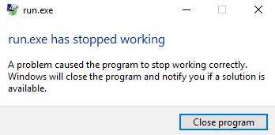


At first, I thought that this is some protection against running in virtual machines. However, I couldn't find any in the assembly. Back to Yaakov, then. Most of the credit goes to him for this reversing stage, I just followed his steps. Thanks to [Dor](https://binary4fun.wordpress.com/) too for his helpful hints!

In order to disassemble the program, I worked with IDA, however the snippets below will be taken from Radare2 since it's possible to copy text from there.

The first things that jumps to the eye when reviewing the list of functions is the existence of a TLS callback. TLS Callbacks are traditionally used to initialize  thread-specific data before a thread runs, and are therefore called before the entry point of the program. In other words, they can execute before the debugger breaks on the entry point. So, in order to make it harder to find anti-debugging checks, these anti-debugging checks are sometimes placed in the TLS Callback.

```

                                                                       .----------------------------------------.
                                                                       | [0x4022d0]                             |
                                                                       | (fcn) entry1 192                       |
                                                                       |   entry1 (int arg_ch);                 |
                                                                       | ; var unsigned int local_ch @ ebp-0xc  |
                                                                       | ; var unsigned int local_8h @ ebp-0x8  |
                                                                       | ; var int local_4h @ ebp-0x4           |
                                                                       | ; arg int arg_ch @ ebp+0xc             |
                                                                       | push ebp                               |
                                                                       | mov ebp, esp                           |
                                                                       | sub esp, 0xc                           |
                                                                       | ; [0x43c06c:4]=0xbb40e64e              |
                                                                       | mov eax, dword [0x43c06c]              |
                                                                       | xor eax, ebp                           |
                                                                       | mov dword [local_4h], eax              |
                                                                       | sub dword [arg_ch], 1                  |
                                                                       | jne 0x402380;[ga]                      |
                                                                       `----------------------------------------'
                                                                               f t
                                                                               | |
                                                                               | '--------------------------------.
                                       .---------------------------------------'                                  |
                                       |                                                                          |
                                   .----------------------------------------------------------------------.       |
                                   |  0x4022ea [gf]                                                       |       |
                                   | lea eax, [local_8h]                                                  |       |
                                   | push eax                                                             |       |
                                   | ; 0x42a0bc                                                           |       |
                                   | ; "\"\xb6\x03"                                                       |       |
                                   | call dword [sym.imp.KERNEL32.dll_GetCurrentProcess];[gc]             |       |
                                   | push eax                                                             |       |
                                   | ; 0x42a0c4                                                           |       |
                                   | call dword [sym.imp.KERNEL32.dll_CheckRemoteDebuggerPresent];[gd]    |       |
                                   | test eax, eax                                                        |       |
                                   | je 0x40237b;[ge]                                                     |       |
                                   `----------------------------------------------------------------------'       |
                                           f t                                                                    |
                                           | |                                                                    |
                                           | '------------------------------.                                     |
                                        .--'                                |                                     |
                                        |                                   |                                     |
                                    .-------------------------------.   .------------------------------------.    |
                                    |  0x4022ff [gh]                |   |  0x40237b [ge]                     |    |
                                    | cmp dword [local_8h], 0       |   | ; CODE XREF from entry1 (0x4022fd) |    |
                                    | je 0x40230a;[gg]              |   | call fcn.00402e00;[gi]             |    |
                                    `-------------------------------'   `------------------------------------'    |       
                                            f t                             v                                     |
                                            | |                             |                                     |
                                            | '-----------------------------|--------------.                      |
                                          .-'                               |              |                      |
                                          |                                 '------------------------.            |
                                          |                                                |         | .----------'
                                          |                                                |         | |
                                      .--------------------------.                         |   .------------------------------------.
                                      |  0x402305 [gj]           |                         |   |  0x402380 [ga]                     |
                                      | call fcn.00402e00;[gi]   |                         |   | ; CODE XREF from entry1 (0x4022e4) |
                                      `--------------------------'                         |   | mov ecx, dword [local_4h]          |
                                          v                                                |   | xor ecx, ebp                       |
                                          |                                                |   | call fcn.0040c5e7;[gx]             |
                                          |                                                |   | mov esp, ebp                       |
                                          |                                                |   | pop ebp                            |
                                          |                                                |   | ret 0xc                            |
                                          |                                                |   `------------------------------------'
                                          |                                                |
                                          |                                                |
                                          '-------------------.                            |
                                                              | .--------------------------'
                                                              | |
                                                        .--------------------------------------------------------.
                                                        |  0x40230a [gg]                                         |
                                                        | ; 0x437520                                             |
                                                        | ; u"CyMutex"                                           |
                                                        | push str.CyMutex                                       |
                                                        | push 0                                                 |
                                                        | push 0                                                 |
                                                        | ; 0x42a0b8                                             |
                                                        | ; "6\xb6\x03"                                          |
                                                        | call dword [sym.imp.KERNEL32.dll_CreateMutexW];[gk]    |
                                                        | ; 0x42a0b4                                             |
                                                        | ; "F\xb6\x03"                                          |
                                                        | call dword [sym.imp.KERNEL32.dll_GetLastError];[gl]    |
                                                        | ; 183                                                  |
                                                        | cmp eax, 0xb7                                          |
                                                        | jne 0x40232b;[gm]                                      |
                                                        `--------------------------------------------------------'
                                                                f t
                                                                | |
                                                                | '------------------------------------.
                                                          .-----'                                      |
                                                          |                                            |
                                                      .--------------------------.                     |
                                                      |  0x402326 [gn]           |                     |
                                                      | call fcn.00402e00;[gi]   |                     |
                                                      `--------------------------'                     |
                                                          v                                            |
                                                          |                                            |
                                                       .--'                                            |
                                                       | .---------------------------------------------'
                                                       | |
                                                 .------------------------------------.
                                                 |  0x40232b [gm]                     |
                                                 | ; CODE XREF from entry1 (0x402324) |
                                                 | call sub.ntdll.dll_bc0;[go]        |
                                                 | push 0                             |
                                                 | test al, al                        |
                                                 | jne 0x40233c;[gp]                  |
                                                 `------------------------------------'
                                                         f t
                                                         | |
                                                         | '------------.
            .--------------------------------------------'              |
            |                                                           |
        .-------------------------------------------------------.   .-------------------------------------------------------------.
        |  0x402336 [gr]                                        |   |  0x40233c [gp]                                              |
        | ; 0x42a0b0                                            |   | ; CODE XREF from entry1 (0x402334)                          |
        | ; "V\xb6\x03"                                         |   | ; 4                                                         |
        | call dword [sym.imp.KERNEL32.dll_ExitProcess];[gq]    |   | push 4                                                      |
        `-------------------------------------------------------'   | lea eax, [local_ch]                                         |
                                                                    | push eax                                                    |
                                                                    | ; 7                                                         |
                                                                    | push 7                                                      |
                                                                    | ; 0x42a0bc                                                  |
                                                                    | ; "\"\xb6\x03"                                              |
                                                                    | call dword [sym.imp.KERNEL32.dll_GetCurrentProcess];[gc]    |
                                                                    | push eax                                                    |
                                                                    | call dword [0x43dde8];[gs]                                  |
                                                                    | ; CODE XREF from entry1 (0x40230c)                          |
                                                                    | cmp dword [local_ch], 0                                     |
                                                                    | jbe 0x40235c;[gt]                                           |
                                                                    `-------------------------------------------------------------'
                                                                            f t
                                                                            | |
                                                                            | '------------------------.
                                                                           .'                          |
                                                                           |                           |
                                                                       |  0x402357 [gu]           |    |
                                                                       | call fcn.00402e00;[gi]   |    |
                                                                       `--------------------------'    |
                                                                           v                           |
                                                                           |                           |
                                                                     .-----'                           |
                                                                     | .-------------------------------'
                                                                     | |
                                                               .------------------------------------------------------------.
                                                               |  0x40235c [gt]                                             |
                                                               | ; CODE XREF from entry1 (0x402355)                         |
                                                               | push 0                                                     |
                                                               | ; 0x42a0ac                                                 |
                                                               | ; "d\xb6\x03"                                              |
                                                               | call dword [sym.imp.KERNEL32.dll_GetConsoleWindow];[gv]    |
                                                               | push eax                                                   |
                                                               | ; 0x42a1b8                                                 |
                                                               | call dword [sym.imp.USER32.dll_ShowWindow];[gw]            |
                                                               | mov ecx, dword [local_4h]                                  |
                                                               | xor ecx, ebp                                               |
                                                               | call fcn.0040c5e7;[gx]                                     |
                                                               | mov esp, ebp                                               |
                                                               | pop ebp                                                    |
                                                               | ret 0xc                                                    |
                                                               `------------------------------------------------------------'
```

We have two anti-debug checks here.

The first one starts in the "gf" block, and consists of calling `CheckRemoteDebuggerPresent`:
```
BOOL WINAPI CheckRemoteDebuggerPresent(
  _In_    HANDLE hProcess,
  _Inout_ PBOOL  pbDebuggerPresent
);
```

The result is placed in `local_8h`, and if the value is TRUE, this means that the process is being debugged. In this case, the program will call `fcn.00402e00`, which is a suicide function that jumps to a random location on the stack and crashes the program.

Therefore, in order to bypass this check, we will patch the "gh" block:
```assembly
cmp dword [local_8h], 0
je 0x40230a
```

We'll change `je` to `jmp` in order to never jump to the suicide function.

The next anti-debug check is located in the "gp" block:
```assembly
push 4                                                   
lea eax, [local_ch]                                      
push eax                                                 
; 7                                                      
push 7                                                   
; 0x42a0bc                                               
; "\"\xb6\x03"                                           
call dword [sym.imp.KERNEL32.dll_GetCurrentProcess];[gc] 
push eax                                                 
call dword [0x43dde8];[gs]                               
; CODE XREF from entry1 (0x40230c)                       
cmp dword [local_ch], 0                                  
jbe 0x40235c;[gt]                                        
```

`[0x43dde8]` is resolved in runtime to `NtQueryInformationProcess`:
```
__kernel_entry NTSTATUS NtQueryInformationProcess(
  IN HANDLE           ProcessHandle,
  IN PROCESSINFOCLASS ProcessInformationClass,
  OUT PVOID           ProcessInformation,
  IN ULONG            ProcessInformationLength,
  OUT PULONG          ReturnLength
);
```

The `7` parameter is a request for  `ProcessDebugPort`: 
> Retrieves a DWORD_PTR value that is the port number of the debugger for the process. A nonzero value indicates that the process is being run under the control of a ring 3 debugger. 

So `cmp dword [local_ch], 0` will jump to the suicide function if a debugger is present (the port is non-zero).

We change the `jbe` to `jmp` in order to jump over the suicide function.

Note that we have two additional references to `NtQueryInformationProcess` (a.k.a. `dword [0x43dde8]`)
```
[0x004022d0]> axt 0x43dde8
entry1 0x40234b [CALL] call dword [0x43dde8]
main 0x4023b8 [CALL] call dword [0x43dde8]
(nofunc) 0x402539 [CALL] call dword [0x43dde8]
```

Checking these calls shows that they are used for the same purpose. We patch them too in order to avoid the anti-debug checks. 

One last point of interest in the TLS callback is in the "gt" block:
```
push 0                                                  
; 0x42a0ac                                              
; "d\xb6\x03"                                           
call dword [sym.imp.KERNEL32.dll_GetConsoleWindow];[gv] 
push eax                                                
; 0x42a1b8                                              
call dword [sym.imp.USER32.dll_ShowWindow];[gw]         
```

Here we have the `ShowWindow` function called with a command of 0 (SW_HIDE)
```
BOOL ShowWindow(
  HWND hWnd,
  int  nCmdShow
);

SW_HIDE (0) -  Hides the window and activates another window. 
```

So, in order to cancel the logic that hides the application's window, we patch the program and replace the `0` with a `1` (`SW_SHOWNORMAL`).

Now we can run the program again (outside the debugger) and view the console. What we get is:
```
Error during CryptAcquireContext!
2148073494
```

Let's find the location of the error in the assembly:
```
[0x00402b03]> iz~CryptAcquireContext
1370 0x00035c68 0x00437668  34  70 (.rdata) utf16le Error during CryptAcquireContext!\n
1516 0x00039ed6 0x0043b8d6  20  21 (.rdata) ascii CryptAcquireContextW
[0x00402b03]> axt @ 0x00437668
sub.Microsoft_Enhanced_Cryptographic_Provider_v1.0_a00 0x402b05 [DATA] mov edx, str.Error_during_CryptAcquireContext
```

The exact logic is here:

```assembly
0x00402a44      8b35b4a04200   mov esi, dword sym.imp.KERNEL32.dll_GetLastError ; [0x42a0b4:4]=0x3b646 reloc.KERNEL32.dll_GetLastError ;
...
0x00402b03      ffd6           call esi
0x00402b05      ba68764300     mov edx, str.Error_during_CryptAcquireContext ; 0x437668 ; u"Error during CryptAcquireContext!\n"
```

Now we can debug and see that `rax` is `0000000080090016` (which is hex for the `2148073494` value we saw in the console). Searching for the error code in Google shows that this error is called `NTE_BAD_KEYSET` and is returned by `CryptAcquireContext` if:

> The key container could not be opened. A common cause of this error is that the key container does not exist. To create a key container, call CryptAcquireContext using the CRYPT_NEWKEYSET flag. This error code can also indicate that access to an existing key container is denied. Access rights to the container can be granted by the key set creator by using CryptSetProvParam. 

The call itself to `CryptAcquireContext` is:
```assembly
|           0x00402a13      6a00           push 0
|           0x00402a15      6a01           push 1                      ; 1
|           0x00402a17      68a8754300     push str.Microsoft_Enhanced_Cryptographic_Provider_v1.0 ; 0x4375a8 ; u"Microsoft Enhanced Cryptographic Provider v1.0"
|           0x00402a1c      6a00           push 0
|           0x00402a1e      8d45f4         lea eax, [local_ch]
|           0x00402a21      8955ec         mov dword [local_14h], edx
|           0x00402a24      50             push eax
|           0x00402a25      8bf9           mov edi, ecx
|           0x00402a27      c745f0000000.  mov dword [local_10h], 0
|           0x00402a2e      32db           xor bl, bl
|           0x00402a30      c745f8000000.  mov dword [local_8h], 0
|           0x00402a37      c745f4000000.  mov dword [local_ch], 0
|           0x00402a3e      ff1518a04200   call dword [sym.imp.ADVAPI32.dll_CryptAcquireContextW] ; 0x42a018
```

And since the signature of the function is:
```
BOOL CryptAcquireContextW(
  HCRYPTPROV *phProv,
  LPCWSTR    szContainer,
  LPCWSTR    szProvider,
  DWORD      dwProvType,
  DWORD      dwFlags
);
```

This means that `CryptAcquireContextW` is called with `dwFlags` as 0.

This actually looks like a bug in the implementation. Yaakov's solution was to patch the program and replace the `0` flag with an `8` (`CRYPT_NEWKEYSET`), run it once, revert the patch and run from then on with `0`, which resolved the crash.

I later chose to lend [the following sample code](https://docs.microsoft.com/en-us/windows/desktop/api/wincrypt/nf-wincrypt-cryptacquirecontextw) from Microsoft's documentation, modify it and run the following program on my virtual machine:
```c
#include "stdafx.h"
#include <Windows.h>
#include <Wincrypt.h>

int main()
{

    HCRYPTPROV hCryptProv = NULL;

    if (CryptAcquireContext(
        &hCryptProv,               // handle to the CSP
        NULL,                      // container name 
        MS_ENHANCED_PROV,          // provider
        PROV_RSA_FULL,             // provider type
        0))                        // flag values
    {
        printf("A cryptographic context has been acquired.\n\n");
    }
    else
    {
        //-------------------------------------------------------------------
        // An error occurred in acquiring the context. This could mean
        // that the key container requested does not exist. In this case,
        // the function can be called again to attempt to create a new key 
        // container. Error codes are defined in Winerror.h.
        if (GetLastError() == NTE_BAD_KEYSET)
        {
            if (CryptAcquireContext(
                &hCryptProv,
                NULL,
                MS_ENHANCED_PROV,
                PROV_RSA_FULL,
                CRYPT_NEWKEYSET))
            {
                printf("A new key container has been created.\n");
            }
            else
            {
                printf("Could not create a new key container.\n");
                exit(1);
            }
        }
        else
        {
            printf("A cryptographic service handle could not be "
                "acquired.\n");
            exit(1);
        }

    }

    if (CryptReleaseContext(hCryptProv, 0))
    {
        printf("The handle has been released.\n");
    }
    else
    {
        printf("The handle could not be released.\n");
    }
    return 0;
}
```

Output from running the program:
```console
C:\Users\User\Desktop\CTF\433>CryptoApp.exe
A new key container has been created.
The handle has been released.
```

This also resolved the crash, and finally allowed to run the program as intended.

We see a console printing a few strings, then disappearing again. However, the program did not exit, as we can see from inspecting the [Process Monitor](https://docs.microsoft.com/en-us/sysinternals/downloads/procmon), it just hid the console again and spawned a child:

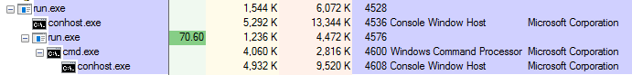

After waiting for a while with the child process eating up ~100% CPU, we get the following alert:


We can use [OllyDumpEx](https://low-priority.appspot.com/ollydumpex/) to dump the child process and inspect it:

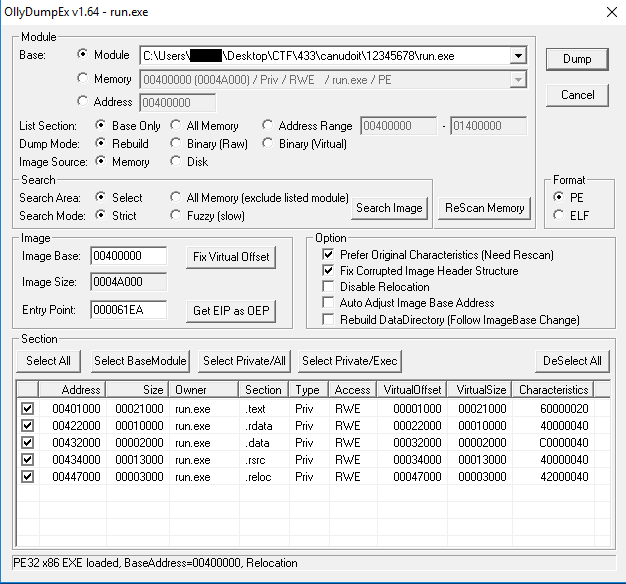

Now that we have dumped the process, we can open it with a disassembler.

Searching for interesting strings, we find the string from the message box:

```
[0x004024bd]> iz~VERY
1404 0x0002f4d0 0x0042f4d0  69  70 (.rdata) ascii VERY NICE, YOU HAVE SUCCESSFULLY DETACHED MY PACKER.\nONE MORE PUSH !\n
[0x004024bd]> axt @ 0x0042f4d0
main 0x4021e6 [DATA] push str.VERY_NICE__YOU_HAVE_SUCCESSFULLY_DETACHED_MY_PACKER.__ONE_MORE_PUSH
[0x004024bd]> s 0x4021e6
[0x004021e6]>
```

The relevant part is:

```
                                                       .-------------------------------------------------------------------------------------.
                                                       | [0x4021df]                                                                          |
                                                       | ; CODE XREF from main (0x402253)                                                    |
                                                       | push 0                                                                              |
                                                       | ; 0x42f4b8                                                                          |
                                                       | ; "Lahav433 Message"                                                                |
                                                       | push str.Lahav433_Message                                                           |
                                                       | ; 0x42f4d0                                                                          |
                                                       | ; "VERY NICE, YOU HAVE SUCCESSFULLY DETACHED MY PACKER.\nONE MORE PUSH !\n"         |
                                                       | push str.VERY_NICE__YOU_HAVE_SUCCESSFULLY_DETACHED_MY_PACKER.__ONE_MORE_PUSH        |
                                                       | push 0                                                                              |
                                                       | ; 0x4221a4                                                                          |
                                                       | ; "0\x88Aw"                                                                         |
                                                       | call dword [sym.imp.USER32.dll_MessageBoxA];[gBa]                                   |
                                                       | push 0                                                                              |
                                                       | push 0                                                                              |
                                                       | push 0                                                                              |
                                                       | ; '0&@'                                                                             |
                                                       | ; "U\x8b\xec\x83\xec\x14\xa1l C"                                                    |
                                                       | push 0x402630                                                                       |
                                                       | push 0                                                                              |
                                                       | push 0                                                                              |
                                                       | ; 0x422010                                                                          |
                                                       | call dword [sym.imp.KERNEL32.dll_CreateThread];[gBb]                                | 
                                                       | mov esi, eax                                                                        |
                                                       | test esi, esi                                                                       |
                                                       | je 0x402255;[gBc]                                                                   |
                                                       `-------------------------------------------------------------------------------------'
                                                               f t
                                                               | |
                                                               | '---------------.
         .-----------------------------------------------------'                 |
         |                                                                       |
   .--------------------------------------------------------.  .----------------------------------.
   |  0x40220e [gBg]                                        |  |  0x402255 [gBc]                  |
   | ; 1000                                                 |  | ; CODE XREF from main (0x40220c) |
   | push 0x3e8                                             |  | ; 0x42f518                       |
   | ; 0x422014                                             |  | ; "NOT COOL 2\n"                 |
   | call dword [sym.imp.KERNEL32.dll_Sleep];[gBe]          |  | push str.NOT_COOL_2              |
   | push 0                                                 |  | call fcn.004038b0;[gq]           |
   | push esi                                               |  | mov ecx, dword [local_4h]        |
   | push 0x402280                                          |  | add esp, 4                       |
   | ; 0x422018                                             |  | xor ecx, ebp                     |
   | call dword [sym.imp.KERNEL32.dll_QueueUserAPC];[gBf]   |  | mov eax, 1                       |
   | ; [0x4329fc:4]=1                                       |  | pop edi                          |
   | mov eax, dword [0x4329fc]                              |  | pop esi                          |
   | nop dword [eax]                                        |  | pop ebx                          |
   `--------------------------------------------------------'  | call fcn.00405c92;[gBi]          |
                          v                                    | mov esp, ebp                     |
                          |                                    | pop ebp                          |
                          |                                    | ret                              |
                          |                                    `----------------------------------'
                          |                                    
      .--------.          |
      |        |          |
      |.----------------------------------.
      ||  0x402230 [gBh]                  |
      || ; CODE XREF from main (0x402232) |
      || test eax, eax                    |
      || jne 0x402230;[gBh]               |
      |`----------------------------------'
      |        f t
      |        | |
      `----------'
           .---'
       .----------------------------------.
       |  0x402234 [gBj]                  |
       | push esi                         |
       | call ebx                         |
       | pop edi                          |
       | pop esi                          |
       | xor eax, eax                     |
       | pop ebx                          |
       | mov ecx, dword [local_4h]        |
       | xor ecx, ebp                     |
       | call fcn.00405c92;[gBi]          |
       | mov esp, ebp                     |
       | pop ebp                          |
       | ret                              |
       `----------------------------------' 
```

We can see that a thread is created with `0x402630` as the start address. Then, after a short `sleep`, the program calls `QueueUserAPC` with `0x402280` as the `pfnAPC` function. 

Immediately after, the program enters an endless loop, polling `eax`. So what's happening here? To understand that, we first need to understand what `QueueUserAPC` does.

```
DWORD QueueUserAPC(
  PAPCFUNC  pfnAPC,
  HANDLE    hThread,
  ULONG_PTR dwData
);
```

> QueueUserAPC function
> 
> Adds a user-mode asynchronous procedure call (APC) object to the APC queue of the specified thread.
> 
> pfnAPC: A pointer to the application-supplied APC function to be called when the specified thread performs an alertable wait operation.
> 
> hThread: A handle to the thread.

This function takes a thread and a callback. It then registers the callback in a way that this callback will be called when the thread performs an alertable wait operation. 

What is this callback? From an overview of the function, we see that it has some positive strings, such as "your token is" and "Congratulations". So we probably want to run the function.

```
     .--------------------------------------------------------------------.
     |  0x4023be [gn]                                                     |
     | 0x004023c1 str.Ok_a_UlAefx___j_u2j__d7_O:Os___V__AZF_TRF__k__BBFST |
     | 0x004023c9 call fcn.00402a20                                       |
     | 0x004023de str.your_token_is                                       |
     `--------------------------------------------------------------------'
             f t
             | |
             | '------------------------------.
          .--'                                |
          |                                   |
      .------------------------------.    .------------------------------.
      |  0x4023e8 [gq]               |    |  0x40240c [gm]               |
      | 0x004023fb call fcn.004076e0 |    | 0x00402418 call fcn.004030e0 |
      `------------------------------'    `------------------------------'
          v                                   v
          |                                   |
          '------------------------.          |
                                   | .--------'
                                   | |
                             .--------------------.
                             |  0x40241d [gp]     |
                             `--------------------'
                                     f t
                                     | |
                                     | '------.
          .--------------------------'        |
          |                                   |
      .------------------------------.    .------------------------------.
      |  0x40246f [gu]               |    |  0x402497 [gs]               |
      | 0x00402483 call fcn.004076e0 |    | 0x004024a2 call fcn.004030e0 |
      `------------------------------'    `------------------------------'
          v                                   v
          |                                   |
          '-. .-------------------------------'
            | |
      .-------------------------------------------------------------------.
      |  0x4024aa [gt]                                                    |
      | 0x004024bd str.Congratulations                                    |
      | 0x004024f8 call dword [sym.imp.USER32.dll_MessageBoxA] "0\x88Aw"  |
      `-------------------------------------------------------------------'
```


Back to the thread, what does it do?

```

                                                                          .-----------------------------------.
                                                                          | [0x402630]                        |
                                                                          | (fcn) fcn.00402630 96             |
                                                                          |   fcn.00402630 ();                |
                                                                          | ; var int local_14h @ ebp-0x14    |
                                                                          | ; var int local_4h @ ebp-0x4      |
                                                                          | ; DATA XREF from main (0x4021f9)  |
                                                                          | push ebp                          |
                                                                          | mov ebp, esp                      |
                                                                          | sub esp, 0x14                     |
                                                                          | ; [0x43206c:4]=0x15766e35         |
                                                                          | ; "5nv\x15u\x98"                  |
                                                                          | mov eax, dword [0x43206c]         |
                                                                          | xor eax, ebp                      |
                                                                          | mov dword [local_4h], eax         |
                                                                          | ; [0x4329fc:4]=1                  |
                                                                          | cmp dword [0x4329fc], 0           |
                                                                          | je 0x40267e;[ga]                  |
                                                                          `-----------------------------------'
                                                                                  f t
                                                                                  | |
                                                                                  | '-------------------------.
                                                .---------------------------------'                           |
                                                |                                                             |
                                            .-------------------------------------------------------------.   |
                                            |  0x402649 [gc]                                              |   |
                                            | push ebx                                                    |   |
                                            | push esi                                                    |   |
                                            | mov esi, dword sym.imp.KERNEL32.dll_SleepEx                 |   |
                                            | ; 2032                                                      |   |
                                            | mov ebx, 0x7f0                                              |   |
                                            | push edi                                                    |   |
                                            | mov edi, dword sym.imp.KERNEL32.dll_GetSystemTime           |   |
                                            | nop dword [eax]                                             |   |
                                            `-------------------------------------------------------------'   |
                                                v                                                             |
                                                |                                                             |
                                                '----------.                                                  |
                                                    .--------.                                                |       
                                                    |      | |                                                |
                                                    |.------------------------------------------.             |
                                                    ||  0x402660 [ge]                           |             |
                                                    || ; CODE XREF from fcn.00402630 (0x402679) |             |
                                                    || lea eax, [local_14h]                     |             |
                                                    || push eax                                 |             |
                                                    || call edi                                 |             |
                                                    || cmp word [local_14h], bx                 |             |
                                                    || jne 0x402672;[gd]                        |             |
                                                    |`------------------------------------------'             |
                                                    |        f t                                              |
                                                    |        | |                                              |
                                                    |        | '-----------------------------------------.    |
                                                    |        '.                                          |    |
                                                    |         |                                          |    |
                                                    |     .--------------------------------.             |    |
                                                    |     |  0x40266c [gf]                 |             |    |
                                                    |     | ; 1                            |             |    |
                                                    |     | push 1                         |             |    |
                                                    |     | push 0xffffffffffffffff        |             |    |
                                                    |     | call esi                       |             |    |
                                                    |     `--------------------------------'             |    |
                                                    |         v                                          |    |
                                                    |         |                                          |    |
                                                    |      .--'                                          |    |
                                                    |      | .-------------------------------------------'    |
                                                    |      | |                                                |
                                                    |.------------------------------------------.             |
                                                    ||  0x402672 [gd]                           |             |
                                                    || ; CODE XREF from fcn.00402630 (0x40266a) |             |
                                                    || ; [0x4329fc:4]=1                         |             |
                                                    || cmp dword [0x4329fc], 0                  |             |
                                                    || jne 0x402660;[ge]                        |             |
                                                    |`------------------------------------------'             |
                                                    |        f t                                              |
                                                    |        | |                                              |
                                                    `----------'                                              |
                                                             '------.                                         |
                                                                    |                                         |
                                                                .--------------------.                        |
                                                                |  0x40267b [gg]     |                        |
                                                                | pop edi            |                        |
                                                                | pop esi            |                        |
                                                                | pop ebx            |                        |
                                                                `--------------------'                        |           
                                                                    v                                         |
                                                                    |                                         |
                                                                    '-------.                                 |
                                                                            | .-------------------------------'
                                                                            | |
                                                                      .------------------------------------------.
                                                                      |  0x40267e [ga]                           |
                                                                      | ; CODE XREF from fcn.00402630 (0x402647) |
                                                                      | mov ecx, dword [local_4h]                |
                                                                      | xor eax, eax                             |
                                                                      | xor ecx, ebp                             |
                                                                      | call fcn.00405c92;[gh]                   |
                                                                      | mov esp, ebp                             |
                                                                      | pop ebp                                  |
                                                                      | ret 4                                    |
                                                                      `------------------------------------------'  
```
First, it sets up `SleepEx` in esi:
```assembly
mov esi, dword sym.imp.KERNEL32.dll_SleepEx
```

`SleepEx` has the following API:
```
DWORD SleepEx(
  DWORD dwMilliseconds,
  BOOL  bAlertable
);
```

The `bAlertable` parameter has the following documentation:
> If the parameter is TRUE and the thread that called this function is the same thread that called the extended I/O function (ReadFileEx or WriteFileEx), the function returns when either the time-out period has elapsed or when an I/O completion callback function occurs. If an I/O completion callback occurs, the I/O completion function is called. 
> 
> If an APC is queued to the thread (QueueUserAPC), the function returns when either the timer-out period has elapsed or when the APC function is called.

So calling `SleepEx` with `bAlertable` is exactly the alertable wait operation we read about earlier. 

Then, we can see that it performs `mov ebx, 0x7f0` (0x7f0 = 2032), and proceeds by calling `GetSystemTime`.

`local_14h` will contain the current year, which is then compared to `bx`:
```assembly
cmp word [local_14h], bx
```

If they are unequal, the code loops around. The interesting case is if they are equal, which causes the function to jump to:
```assembly
push 1                  
push 0xffffffffffffffff 
call esi                
```

This is exactly what we want - an alertable wait for a very long time which will allow our callback to run. So, we just need to change the year to 2032 and wait for the prize:

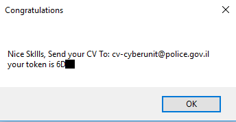


All done (and thanks again to Yaakov and Dor for their help in the reversing challenge).
