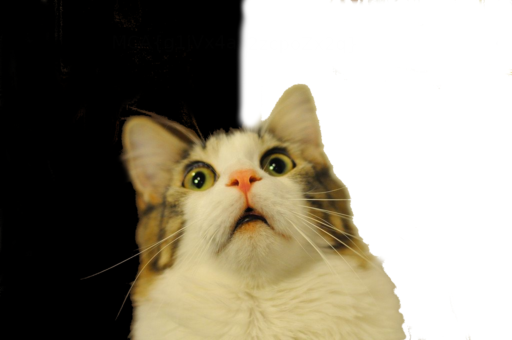
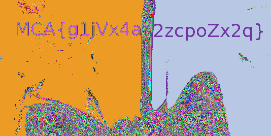

# Nomination
Grab Bag, 100 points

## Description:

A picture of a cat is attached:

## Solution:

[stegsolve](https://github.com/eugenekolo/sec-tools/tree/master/stego/stegsolve/stegsolve) is great for such challenges. It allows each bit plane of the image to be viewed on its own.

The flag: MCA{g1jVx4a2zcpoZx2q}