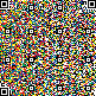

# QvR Code
Forensics, 150 points

## Description:

> This is now a STEAM focused competition. Check out our new patented Quade van Ravesteyn (QvR) code. QvR beats similar codes by marginally increasing storage capacity. And it’s prettier to look at. Each encoding is like its own masterpiece.



## Solution:

Assuming that we are staring at what should be a QR code, the question is how to translate the code to data which can be read by standard QR code readers.

A quick Python script revealed that there are eight distinct colors in the image (including black and white):

```python
img = Image.open('QvR.png')
width, height = img.size

colors = set()

for w in range(width):
    for h in range(height):
        colors.add(img.getpixel((w, h)))

print("Found {} colors".format(len(colors)))
```

So my initial thought was to create a separate QR code from each of the colors and try to decode that. However that did not produce any result.

Another attempt was to keep any original black pixels in addition to the method above, in order to preserve the reference points in the corners. This did not work either.

Finally, the method that worked was to map some of the colors to "white" and some to "black" and try to decode the message.

The following script does this by brute-forcing all the possibilities:

```python
import itertools
from PIL import Image
from pyzbar.pyzbar import decode

img = Image.open('QvR.png')
width, height = img.size

BLACK = (0, 0, 0, 255)
WHITE = (255, 255, 255, 255)

colors = set()

for w in range(width):
    for h in range(height):
        p = img.getpixel((w, h))
        colors.add(p)

print("Found {} colors".format(len(colors)))
print ("=" * 20)

color_list = list(colors)
for color_mapping in itertools.product([BLACK, WHITE], repeat=len(color_list)):
    new_img = Image.open('QvR.png')
    for w in range(width):
        for h in range(height):
            p = img.getpixel((w, h))
            new_img.putpixel((w, h), color_mapping[color_list.index(p)])
    decoded = decode(new_img)
    if len(decoded) > 0:
        print (decoded[0].data)
        print ("=" * 20)
```

It identifies three different texts encoded in three different mappings:

```console
root@kali:/media/sf_CTFs/mitre/QvR# python solve.py
Found 8 colors
====================
And now it's A. Flag is impossible_color_theory Art: Art art art art art art art art. <- art. It can be anything. But specifically it's Dirck de Quade van Ravesteyn. This is the namesake artist of the QvR code. This artist was chosen because his name is similar to existing barcodes. Art also makes an appearance because of the RYB color theory. de Quade would have used this color theory in his works as he predated Newton, an organism who discovered that cyan, yellow, and magenta provide the largest color gamut. Finally, M: Mathematics: BORING!
====================
We wanted to incorporate Science Technology Engineering Art and Mathematics (STEAM). Enclose with MCA{} for final flag. So we needed to cover each letter. Let's start with S. Science: Science is the intellectual and practical activity encompassing the systematic study of the structure and behavior of the physical and natural world through observation and experiment. We incorporated science by allowing competitors to explore scientific concepts about the world such as color theory. Competitors also have to experiment to get the correct answer through observation.
====================
Now we are going to explore T. Technology: Competitors need to use the Internet to compete. What an amazing Technology. The internet was invented by Al Gore. Anyway, technology enables the encoding of the data, decoding of the data, and critical error correction algorithms present in the code. Prepend salt_ and append _pepper to flag. The next letter is E. Engineering: Competitors need to reverse-engineer a solution to decode the QvR code because the specification isn't published. As a discipline, engineering incorporates science and technology.
====================
```

The text provides instructions to construct the flag:
* Flag is impossible_color_theory.
* Prepend salt_ and append _pepper to flag.
* Enclose with MCA{} for final flag.