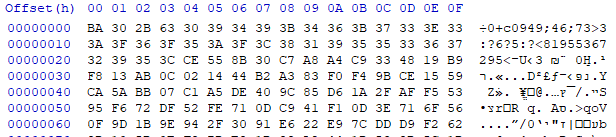
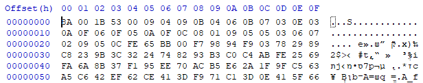

# Challenge #3
Solved together with YaakovCohen88

## Description
> Hello again, Agent.
> 
> After you disabled the weapon system, we have successfully raided the terrorist compound and took all present into custody.
> 
> The terrorists destroyed much of the data they kept, but we have managed to retrieve an encrypted file containing links to the other members of the network, as well as the program used to encrypt it.
> 
> Sadly, the encryption computer was destroyed. Aside from unidentified manufacturer markings on the front (Or... Po... Ltd.) we don't know anything about it.
> 
> Hopefully that won't stop you from decrypting this important intel.
> 
> Good luck!,
>   M.|

A binary file (`EncryptSoftware.exe`) and an encrypted file (`intel.txt.enc`) were attached.

## Solution

Let's start by running the program:
```console
E:\CTFs\mossad>EncryptSoftware.exe
USAGE: Encrypt <input file name> <output file name>
```

It looks like the program expects two arguments: An input filename and an output file name.

We'll use Ghidra to investigate the program. 
We'll show the decompilation output (after performing some renaming). The full decomplied output can be found in the `Challenge3_files` folder.

We'll start with the main function:

```c
undefined4 __cdecl main(int argc,char **argv)
{
  char *output_buffer;
  HANDLE *ppvVar1;
  HANDLE pvVar2;
  DWORD bytes_written;
  int bytes_to_write;
  LPCWSTR lpOutputFileName;
  
  if (argc < 3) {
    print("USAGE: Encrypt <input file name> <output file name>");
    return 0xffffffff;
  }
  argc = 0;
  output_buffer = encrypt(argv[1],&argc);
  lpOutputFileName = (LPCWSTR)argv[2];
  ppvVar1 = (HANDLE *)allocate(4);
  if (ppvVar1 != (HANDLE *)0x0) {
    pvVar2 = CreateFileW(lpOutputFileName,0x40000000,0,(LPSECURITY_ATTRIBUTES)0x0,2,0x80,(HANDLE)0x0
                        );
    bytes_to_write = argc;
    *ppvVar1 = pvVar2;
    if (pvVar2 == (HANDLE)0xffffffff) {
      free(ppvVar1);
      return 0;
    }
    bytes_written = 0;
    WriteFile(*ppvVar1,output_buffer,argc,&bytes_written,(LPOVERLAPPED)0x0);
    if (bytes_written != bytes_to_write) {
      cleanup(lpOutputFileName);
    }
  }
  return 0;
}
```

Not much to see here, we see that the function calls `encrypt` with the input file name, and writes the result to the output file name.

`encrypt` is a bit longer. It starts by calling another function and saving the result:
```c
  padded_md5 = (undefined4 *)padded_md5_filename_mac(input_file_name);
  if (padded_md5 == (undefined4 *)0x0) {
    pcVar2 = (char *)FUN_00401f78();
    return pcVar2;
  }
```

This function is implemented as follows:
```c
char * __fastcall padded_md5_filename_mac(char *file_name)

{
  ushort uVar1;
  ushort *puVar2;
  undefined8 *pbData;
  int file_name_len_2;
  undefined4 *p_mac_addr;
  BOOL BVar3;
  char *pcVar4;
  undefined4 *puVar5;
  int i;
  uint file_name_len;
  HCRYPTPROV hProv;
  DWORD hash_len;
  HCRYPTHASH hHash;
  byte hash_output [16];
  
  puVar2 = FUN_00402abe(file_name,'\\');
  if (puVar2 != (ushort *)0x0) {
    file_name = (char *)(puVar2 + 1);
  }
  puVar2 = (ushort *)file_name;
  do {
    uVar1 = *puVar2;
    puVar2 = puVar2 + 1;
  } while (uVar1 != 0);
  file_name_len = (int)((int)puVar2 - (int)((ushort *)file_name + 1)) >> 1;
  pbData = (undefined8 *)allocate(file_name_len + 6);
  if (pbData == (undefined8 *)0x0) {
    pcVar4 = (char *)FUN_00401f78();
    return pcVar4;
  }
  file_name_len_2 = copy_str_into_buffer(pbData,(ushort *)file_name,file_name_len);
  if (file_name_len_2 == 0) goto LAB_00401633;
  p_mac_addr = (undefined4 *)get_mac_addr();
  puVar5 = (undefined4 *)((int)pbData + file_name_len);
  if (puVar5 == (undefined4 *)0x0) {
LAB_00401530:
    puVar5 = (undefined4 *)FUN_00407f40();
    *puVar5 = 0x16;
    FUN_00407e83();
  }
  else {
    if (p_mac_addr == (undefined4 *)0x0) {
      *puVar5 = 0;
      *(undefined2 *)(puVar5 + 1) = 0;
      goto LAB_00401530;
    }
                    // Copy MAC address after file name
    *puVar5 = *p_mac_addr;
    *(undefined2 *)(puVar5 + 1) = *(undefined2 *)(p_mac_addr + 1);
  }
  hProv = 0;
  hHash = 0;
  hash_len = 0x10;
  BVar3 = CryptAcquireContextW(&hProv,(LPCWSTR)0x0,(LPCWSTR)0x0,1,0xf0000000);
  if (BVar3 != 0) {
                    // MD5 (0x8003)
    BVar3 = CryptCreateHash(hProv,0x8003,0,0,&hHash);
    if (BVar3 != 0) {
      BVar3 = CryptHashData(hHash,(BYTE *)pbData,file_name_len + 6,0);
      if (BVar3 != 0) {
        BVar3 = CryptGetHashParam(hHash,2,hash_output,&hash_len,0);
        if (BVar3 != 0) {
          puVar5 = (undefined4 *)allocate(0x20);
          if (puVar5 != (undefined4 *)0x0) {
            i = 0;
            *puVar5 = 0;
            puVar5[1] = 0;
            puVar5[2] = 0;
            puVar5[3] = 0;
            puVar5[4] = 0;
            puVar5[5] = 0;
            puVar5[6] = 0;
            puVar5[7] = 0;
                    // Pad MD5 result (nibble to byte)
            if (0 < (int)hash_len) {
              do {
                if (0xf < i) break;
                *(byte *)((int)puVar5 + i * 2) = hash_output[i] >> 4;
                *(byte *)((int)puVar5 + i * 2 + 1) = hash_output[i] & 0xf;
                i = i + 1;
              } while (i < (int)hash_len);
            }
          }
        }
      }
    }
    if (hProv != 0) {
      CryptReleaseContext(hProv,0);
    }
    if (hHash != 0) {
      CryptDestroyHash(hHash);
    }
  }
  if (p_mac_addr != (undefined4 *)0x0) {
    free(p_mac_addr);
  }
LAB_00401633:
  free(pbData);
  pcVar4 = (char *)FUN_00401f78();
  return pcVar4;
}
```

What is does is:
1. Allocate a buffer of `len(filename) + 6`
2. Copy the filename into this buffer
3. After the filename, copy the machine's MAC address into the buffer
4. Calculate an MD5 hash over the buffer
5. Allocate a buffer of 32 bytes, which is twice as long as the MD5 hash output
6. "Pad" the MD5 hash by turning every nibble into a byte

For example, for the filename "file.txt" and the MAC address "AABBCCDDEEFF", the buffer would be:
```
file.txt\xAA\xBB\xCC\xDD\xEE\xFF
```

The MD5 would be:

```
b9cab29e8ade3a62f0bc38b3e1398572
```

And the result would be:

```
0b090c0a0b02090e080a0d0e030a06020f000b0c03080b030e01030908050702
```

Back to `encrypt`. The next step after receiving the padded MD5 is to call an internal function which performs classic encryption:
```c
encrypted_size = 0;
encrypted_buf = do_encrypt((LPCWSTR)input_file_name,&encrypted_size);
```

This function is implemented as follows:
```c
char * __fastcall do_encrypt(LPCWSTR file_name,size_t *output_size)

{
  BOOL BVar1;
  char *pcVar2;
  undefined8 *mac_addr;
  undefined4 *puVar3;
  undefined4 *disk_serial;
  DWORD input_file_size;
  size_t _Size;
  char *output_buf;
  int iVar4;
  HANDLE *input_file_handle;
  DWORD total_bytes_read;
  undefined8 *buf1;
  bool bVar5;
  HCRYPTKEY hKey;
  HCRYPTHASH hHash;
  uint bytes_read;
  int offset;
  HCRYPTPROV hProv;
  ushort *temp;
  char read_buf [16];
  
  input_file_handle = (HANDLE *)0x0;
  buf1 = (undefined8 *)0x0;
  hProv = 0;
  hKey = 0;
  hHash = 0;
  CryptAcquireContextW(&hProv,L"DataSafeCryptContainer",(LPCWSTR)0x0,0x18,0x50);
  BVar1 = CryptAcquireContextW(&hProv,L"DataSafeCryptContainer",(LPCWSTR)0x0,0x18,0x48);
  if (BVar1 == 0) {
    GetLastError();
    print("%x");
    goto LAB_004010b6;
  }
  BVar1 = CryptCreateHash(hProv,0x8003,0,0,&hHash);
  if ((BVar1 == 0) || (buf1 = (undefined8 *)allocate(0xe), buf1 == (undefined8 *)0x0))
  goto LAB_004010b6;
  mac_addr = (undefined8 *)get_mac_addr();
  if (mac_addr == (undefined8 *)0x0) {
LAB_00401252:
    free(buf1);
    buf1 = (undefined8 *)0x0;
  }
  else {
    copy_buf_(buf1,0xe,mac_addr,6);
    temp = (ushort *)execute_command(L"wmic bios get serialnumber");
    if (temp == (ushort *)0x0) {
LAB_00401241:
      bVar5 = false;
    }
    else {
      puVar3 = extract_serial(temp);
      free(temp);
      if (puVar3 == (undefined4 *)0x0) goto LAB_00401241;
      temp = (ushort *)lchar_to_dword((ushort *)puVar3);
      if (temp == (ushort *)0xffffffff) {
        bVar5 = false;
        free(puVar3);
      }
      else {
                    // Now buffer will contain mac + bios_serial[0:4]
        copy_buf_((undefined8 *)((int)buf1 + 6),8,(undefined8 *)&temp,4);
        disk_serial = get_disk_serial();
        if (disk_serial == (undefined4 *)0x0) {
          bVar5 = false;
          free(puVar3);
        }
        else {
          temp = (ushort *)lchar_to_dword((ushort *)disk_serial);
          bVar5 = temp != (ushort *)0xffffffff;
          if (bVar5) {
                    // Now buffer will contain mac + bios_serial[0:4] + disk_serial[0:4]
            copy_buf_((undefined8 *)((int)buf1 + 10),4,(undefined8 *)&temp,4);
          }
          free(disk_serial);
          free(puVar3);
        }
      }
    }
    free(mac_addr);
    if (!bVar5) goto LAB_00401252;
  }
  if (((buf1 != (undefined8 *)0x0) && (BVar1 = CryptHashData(hHash,(BYTE *)buf1,0xe,0), BVar1 != 0))
     && (BVar1 = CryptDeriveKey(hProv,0x6610,hHash,0,&hKey), BVar1 != 0
                    // CALG_AES_256 = 0x6610)) {
    input_file_handle = get_file_handle(file_name,0x80000000,3);
    total_bytes_read = 0;
    if (input_file_handle != (HANDLE *)0x0) {
      temp = (ushort *)0x0;
      input_file_size = GetFileSize(*input_file_handle,(LPDWORD)0x0);
                    // align size to 16 bytes
      _Size = (input_file_size & 0xfffffff0) + 0x10;
      output_buf = (char *)allocate(_Size);
      if (output_buf != (char *)0x0) {
        offset = 0;
        read_buf._0_4_ = 0;
        read_buf._4_4_ = 0;
        read_buf._8_4_ = 0;
        read_buf._12_4_ = 0;
        iVar4 = ReadFile(*input_file_handle,read_buf,0x10,&bytes_read,(LPOVERLAPPED)0x0);
        while ((iVar4 != 0 && (bytes_read != 0))) {
          total_bytes_read = total_bytes_read + bytes_read;
          if (total_bytes_read == input_file_size) {
            temp = (ushort *)0x1;
          }
          BVar1 = CryptEncrypt(hKey,0,(BOOL)temp,0,(BYTE *)read_buf,&bytes_read,0x10);
          if (BVar1 == 0) {
            free(output_buf);
            goto LAB_004010b6;
          }
          copy_buffer((undefined8 *)(output_buf + offset),(undefined8 *)read_buf,bytes_read);
          offset = offset + bytes_read;
          read_buf._0_4_ = 0;
          read_buf._4_4_ = 0;
          read_buf._8_4_ = 0;
          read_buf._12_4_ = 0;
          iVar4 = ReadFile(*input_file_handle,read_buf,0x10,&bytes_read,(LPOVERLAPPED)0x0);
        }
        *output_size = _Size;
      }
    }
  }
LAB_004010b6:
  CryptReleaseContext(hProv,0);
  if (hProv != 0) {
    CryptReleaseContext(hProv,0);
  }
  if (hHash != 0) {
    CryptDestroyHash(hHash);
  }
  if (buf1 == (undefined8 *)0x0) {
    free((void *)0x0);
  }
  if (hKey != 0) {
    CryptDestroyKey(hKey);
  }
  if (input_file_handle != (HANDLE *)0x0) {
    CloseHandle(*input_file_handle);
    free(input_file_handle);
  }
  pcVar2 = (char *)FUN_00401f78();
  return pcVar2;
}
```

It starts by calling WinAPI functions to setup the crypto context. It then:
1. Allocates a buffer of length 0xE
2. Copies the machine's MAC address into the buffer
3. Calls the `wmic bios get serialnumber` command to read the BIOS serial number
4. Copies the first four bytes to the buffer
5. Calls the `wmic diskdrive get serialnumber` command to read the disk drive's serial number
6. Copies the first four bytes of the result to the buffer
7. Uses the buffer to derive key material for AES_256 encryption
8. Encrypts the buffer with AES_256
9. Returns the encrypted buffer and size

Since the function uses standard AES-256 in order to encrypt the buffer, it looks like we won't be able to find any shortcuts when attempting to decrypt it - We'll have to reconstruct the same key and use AES-256 decryption.

Back to `encrypt` again to see what happens with the result:

```c
  if (encrypted_buf != (char *)0x0) {
    puVar3 = (ushort *)execute_command(L"wmic diskdrive get serialnumber");
    if (puVar3 == (ushort *)0x0) {
      diskdrive_serial = (undefined4 *)0x0;
    }
    else {
      diskdrive_serial = extract_serial(puVar3);
      free(puVar3);
      if (diskdrive_serial != (undefined4 *)0x0) {
        dd_serial_dword = lchar_to_dword((ushort *)diskdrive_serial);
        buffer = (undefined4 *)allocate(encrypted_size + 2992);
        if (buffer != (undefined4 *)0x0) {
          *buffer = 0x531b008a;
          puVar3 = (ushort *)execute_command(L"wmic bios get serialnumber");
          if (puVar3 != (ushort *)0x0) {
            puVar4 = extract_serial(puVar3);
            free(puVar3);
            if (puVar4 != (undefined4 *)0x0) {
              bios_serial_dword = lchar_to_dword((ushort *)puVar4);
              garble_buf(garble_buf,bios_serial_dword);
              src_offset = 0;
              limit = 625;
              counter = 0;
              uVar8 = (int)encrypted_size / 0x2e3 + ((int)encrypted_size >> 0x1f);
              p_current_src = garble_buf;
              p_current_dest = garble_buf_copy;
              while (limit != 0) {
                limit = limit + -1;
                *p_current_dest = *p_current_src;
                p_current_src = p_current_src + 1;
                p_current_dest = p_current_dest + 1;
              }
              iVar5 = (uVar8 >> 0x1f) + uVar8;
              uVar8 = iVar5 + 1;
                    // copy padded md5 starting from buf[4] (8 dwords)
              iVar7 = 8;
              p_current_padded_md5 = padded_md5;
              puVar4 = buffer;
              while (puVar4 = puVar4 + 1, iVar7 != 0) {
                iVar7 = iVar7 + -1;
                *puVar4 = *p_current_padded_md5;
                p_current_padded_md5 = p_current_padded_md5 + 1;
              }
              iVar7 = 0x24;
              iVar5 = encrypted_size + iVar5 * -0x2e3;
              do {
                uVar6 = other_garble(garble_buf_copy);
                *(uint *)(iVar7 + (int)buffer) = uVar6;
                if (counter == iVar5) {
                  uVar8 = uVar8 - 1;
                }
                copy_buffer((undefined8 *)(iVar7 + 4 + (int)buffer),
                            (undefined8 *)(encrypted_buf + src_offset),uVar8);
                sVar1 = encrypted_size;
                counter = counter + 1;
                src_offset = src_offset + uVar8;
                iVar7 = iVar7 + 4 + uVar8;
              } while (counter < 739);
              if (src_offset != encrypted_size) {
                print("NOT read enaugh bytes %d , %d");
              }
              iVar5 = sVar1 + 2988;
              *output_len = iVar5;
              iVar7 = 0;
              if (0 < iVar5) {
                do {
                  *(uint *)(iVar7 + (int)buffer) = *(uint *)(iVar7 + (int)buffer) ^ dd_serial_dword;
                  iVar7 = iVar7 + 4;
                } while (iVar7 < iVar5);
              }
              goto LAB_00401895;
            }
          }
          free(buffer);
        }
      }
    }
  }
```

`encrypt` proceeds by:
1. Calling `wmic diskdrive get serialnumber` to get the disk drive serial again
2. Allocating an output buffer of size `encrypted_size + 2992`
3. Setting the first DWORD in the buffer to the magic value `0x531b008a`
4. Calling `wmic bios get serialnumber` to get the BIOS serial number again
5. Calling some kind of user-defined hash(?) function `garble_buf(garble_buf,bios_serial_dword)`, where `garble_buf` is a local buffer of size `625 * sizeof(uint)` and `bios_serial_dword` is the first four bytes of the BIOS serial.
6. Making a copy of `garble_buf` in another local buffer of the same size (`garble_buf_copy`)
7. Copying the padded MD5 into the buffer, after the magic value
8. Starting a loop which:
   1. Calls another hash(?) function `other_garble(garble_buf_copy)` to receive a 4-byte hash(?) value
   2. Copies this value to the buffer
   3. Copies a chunk of the encrypted text to the buffer
   4. (At some point, changes the chunk size by decrementing it)

After the encrypted buffer is copied to the output buffer (chunk by chunk, where in between we have garbled DWORD separators), the buffer is XORed using `dd_serial_dword` (the first four bytes of the disk drive).

The buffer is later returned to the main function, which writes it to the output file.

The garbling functions are defined as:
```c
void __fastcall garble_buf(undefined4 *buffer,undefined4 initial_value)

{
  *buffer = initial_value;
  buffer[0x270] = 1;
  do {
    buffer[buffer[0x270]] = (buffer + buffer[0x270])[-1] * 0x17b5;
    buffer[0x270] = buffer[0x270] + 1;
  } while ((int)buffer[0x270] < 0x270);
  return;
}

uint __cdecl other_garble(uint *garbled_buf_copy)

{
  uint uVar1;
  int i;
  
  if ((0x26f < (int)garbled_buf_copy[0x270]) || ((int)garbled_buf_copy[0x270] < 0)) {
    if ((0x270 < (int)garbled_buf_copy[0x270]) || ((int)garbled_buf_copy[0x270] < 0)) {
      garble_buf(garbled_buf_copy,0x1105);
    }
    i = 0;
    while (i < 0xe3) {
      garbled_buf_copy[i] =
           (garbled_buf_copy[i] & 0x80000000 | garbled_buf_copy[i + 1] & 0x7fffffff) >> 1 ^
           garbled_buf_copy[i + 0x18d] ^
           *(uint *)(&DAT_0041e8c0 + (garbled_buf_copy[i + 1] & 1) * 4);
      i = i + 1;
    }
    while (i < 0x26f) {
      garbled_buf_copy[i] =
           (garbled_buf_copy[i] & 0x80000000 | garbled_buf_copy[i + 1] & 0x7fffffff) >> 1 ^
           garbled_buf_copy[i + -0xe3] ^
           *(uint *)(&DAT_0041e8c0 + (garbled_buf_copy[i + 1] & 1) * 4);
      i = i + 1;
    }
    garbled_buf_copy[0x26f] =
         (garbled_buf_copy[0x26f] & 0x80000000 | *garbled_buf_copy & 0x7fffffff) >> 1 ^
         garbled_buf_copy[0x18c] ^ *(uint *)(&DAT_0041e8c0 + (*garbled_buf_copy & 1) * 4);
    garbled_buf_copy[0x270] = 0;
  }
  uVar1 = garbled_buf_copy[garbled_buf_copy[0x270]];
  garbled_buf_copy[0x270] = garbled_buf_copy[0x270] + 1;
  uVar1 = uVar1 >> 0xb ^ uVar1;
  uVar1 = (uVar1 & 0x13a58ad) << 7 ^ uVar1;
  uVar1 = (uVar1 & 0x1df8c) << 0xf ^ uVar1;
  return uVar1 >> 0x12 ^ uVar1;
}
```

`garble_buf` receives a buffer of size `0x271 * sizeof(uint)` and an initial value (DWORD). It copies the initial value to the first DWORD of the array, and then uses it to fill the rest of the array with a derived value. `buffer[0x270]` is used as an index to the current array member that the function is working on.

`other_garble` takes the product of `garble_buf` and garbles it a bit more. According to the last few lines of the function, it looks like the bit shifting will cause the result to lose information, and therefore it might be impossible to use the result to reconstruct the original value.

Now that we've reviewed the main functionality, we can start our attempt to decrypt the file. The file we've received is called `intel.txt.enc` and is 38,924 bytes long.

It starts with the following content:



The last thing that happens is a XOR operation being applied to the file, so we should start by performing the opposite operation in order to recover the contents before the XOR.
Since the first DWORD in the original buffer is a magic value (`0x531b008a`), we XOR the current value (`0x632B30BA`) with the magic value in order to recover the key used to XOR the file (which happens to be the first four bytes of the disk driver serial number):

```python
>>> hex(0x632B30BA ^ 0x531b008a)
'0x30303030'
```

This is good, since we got a result which looks like ASCII (`chr(0x30) = '0'`).

We can now use this value to un-XOR the complete file:

```python
def readXorInt(f, xor):
    b = f.read(4)
    if not b:
        return None
    res = int.from_bytes(b, byteorder="little")  ^ xor
    return res

with open(output_filename, "rb") as f, open("phase1.bin", "wb") as o:
    dd_serial = readXorInt(f, MAGIC)
    o.write(dd_serial.to_bytes(4, byteorder="little"))
    while True:
        res = readXorInt(f, dd_serial)
        if res is None:
            break
        o.write(res.to_bytes(4, byteorder="little"))
```

The result:



The first 4 bytes are the magic value, and the 32 bytes that follow are the padded MD5:
```
00 09 04 09 0B 04 06 0B 07 03 0E 03 0A 0F 06 0F 05 0A 0F 0C 08 01 09 05 05 03 06 07 02 09 05 0C
```

If we remove the padding, the MD5 is:
```
0949b46b73e3af6f5afc81955367295c
```

We know that the MD5 is composed of `FileName + MAC`, and we know that `FileName` is (probably) `intel.txt`. We'd like to find the MAC address since it's used later on in the encryption key.

We can perform brute force in order to find a 6-byte value where `MD5("intel.txt" + ??????) == 0949b46b73e3af6f5afc81955367295c`, but that might take a while. Let's try to use what we know in order to reduce the search space.

1. We know that the file was encrypted on a machine manufactured by "Or... Po... Ltd." (from the description)
2. We know that MAC addresses are divided into two parts: The first three bytes are a manufacturer ID and the other three bytes are a unique device ID
3. If we can identify the manufacturer, we can reduce the search space to three bytes.

A large list of MAC manufacturers and IDs can be found [here](https://gist.github.com/aallan/b4bb86db86079509e6159810ae9bd3e4).
From that list, two seems to match the "Or... Po..." pattern:

```
8CF813 ORANGE POLSKA
001337 Orient Power Home Network Ltd.
```

Out of the two, the second options seems much more realistic, not only because it ends with "Ltd.", but also because it has the valuable ID of [1337](https://en.wikipedia.org/wiki/Leet).

Now we can brute force the remainder much faster:

```python
mac_prefix = (0x00, 0x13, 0x37)
with open("phase1.bin", "rb") as f:
        readXorInt(f, 0) # Dummy read, we already have the dd_serial

        padded_md5 = bytearray()
        for i in range(4 * 2):
            dword = readXorInt(f, 0)
            padded_md5 += dword.to_bytes(4, byteorder='little')

        padded_md5 = binascii.hexlify(padded_md5)
        assert (padded_md5[::2] == b"0" * 32)
        md5 = padded_md5[1::2]
        print("MD5: {}".format(md5))
        mac = mac_prefix + find_md5(input_filename, mac_prefix, 3, md5)
        mac_hex = binascii.hexlify(bytes(mac))
        print ("MAC Address: {}".format(mac_hex))
```

The result:
```
Disk drive serial: 0x30303030
MD5: b'0949b46b73e3af6f5afc81955367295c'
MAC Address: b'0013378eab66'
```

Another piece of information we can extract is the length of the AES-256 encrypted buffer.

```c
encrypted_size = 0;
encrypted_buf = do_encrypt((LPCWSTR)input_file_name,&encrypted_size);
//...
sVar1 = encrypted_size;
//...
iVar5 = sVar1 + 2988;
*output_len = iVar5;
```

The length of the output file is 2988 bytes larger than the length of the AES-256 input buffer (which is the size of the input file + AES block alignment).

```python
encrypted_length = os.fstat(f.fileno()).st_size - 2988
print ("Length of encrypted message: {}".format(encrypted_length))
```

Now it's time to start to extract the ciphertext, while skipping the garbled DWORDs.

We know that immediately after the padded MD5 we have a garbled DWORD, then a chunk of ciphertext, then another garbled DWORD, a chunk of ciphertext and so on.

The chunk size is calculated as follows:

```c
uVar8 = (int)encrypted_size / 0x2e3 + ((int)encrypted_size >> 0x1f);
//...
iVar5 = (uVar8 >> 0x1f) + uVar8;
uVar8 = iVar5 + 1;
//...
iVar5 = encrypted_size + iVar5 * -0x2e3;
//...
if (counter == iVar5) { // Happens within the copy loop
    uVar8 = uVar8 - 1;
}
```

If we calculate this for our encrypted size, we get:

```python
>>> encrypted_size = 35936
>>> uVar8 = encrypted_size // 0x2e3 + (encrypted_size >> 0x1f)
>>> iVar5 = (uVar8 >> 0x1f) + uVar8
>>> uVar8 = iVar5 + 1
>>> iVar5 = encrypted_size + iVar5 * -0x2e3
>>> uVar8
49
>>> iVar5
464
````

We use this to read the ciphertext:
```python
def get_size_and_decrement_index(encrypted_length):
    size = encrypted_length // 0x2e3 + (encrypted_length >> 0x1f)
    decrement_index = (size >> 0x1f) + size
    size = decrement_index + 1
    decrement_index = encrypted_length + decrement_index * -0x2e3
    
    return (size, decrement_index)

ciphertext = bytearray()
bytes_read = 0
i = 0
size, decrement_index = get_size_and_decrement_index(encrypted_length)
while bytes_read < encrypted_length:
    if i == decrement_index:
        size -= 1
    garble = readXorInt(f, 0)
    ciphertext += f.read(size)
    bytes_read += size
    i += 1
```

Now we have the ciphertext, and almost all of the key. It's time to get the rest of the key and decrypt the text file.

The key is composed of: 
```
MAC[0:6] + BIOS_SERIAL[0:4] + DISK_DRIVE_SERIAL[0:4]
```

We have the MAC address and the disk driver serial, how do we find the BIOS serial?

We'll, in this case we'll have to apply some brute force. The only other place where the BIOS serial is used is as the initial value for the `garble_buf()` function, which produces output that is consumed by `other_garble()` and at least on the surface seems irreversible. The result of `other_garble()` is a DWORD which serves as a delimiter for ciphertext chunks.

Instead of trying to build our way back from the garbled DWORD to the original initial value, let's work the other way around and try to find an initial value which will produce the garbled DWORD we see in the encrypted file.


The first DWORD starts at 0x24 and has the value of 0x00BB65FE.

We'll use the following C code to find the initial value that will produce it:

```c

#include "stdafx.h"
#include <stdio.h>
#include <tchar.h>
#include <windows.h>
#include <stdint.h>
#include <assert.h>


uint32_t DAT_0041e8c0[] = { 0x00, 0x00, 0x00, 0x00, 0xdf, 0xb0, 0x08, 0x99 };

void garble_buf(uint32_t *buffer, uint32_t initial_value)

{
	*buffer = initial_value;
	buffer[0x270] = 1;
	do {
		buffer[buffer[0x270]] = (buffer + buffer[0x270])[-1] * 0x17b5;
		buffer[0x270] = buffer[0x270] + 1;
	} while ((int)buffer[0x270] < 0x270);
	return;
}

uint32_t other_garble(uint32_t *garbled_buf_copy)

{
	uint32_t uVar1;
	int i;

	if ((0x26f < (int)garbled_buf_copy[0x270]) || ((int)garbled_buf_copy[0x270] < 0)) {
		if ((0x270 < (int)garbled_buf_copy[0x270]) || ((int)garbled_buf_copy[0x270] < 0)) {
			garble_buf(garbled_buf_copy, 0x1105);
		}
		i = 0;
		while (i < 0xe3) {
			garbled_buf_copy[i] =
				(garbled_buf_copy[i] & 0x80000000 | garbled_buf_copy[i + 1] & 0x7fffffff) >> 1 ^
				garbled_buf_copy[i + 0x18d] ^
				*(uint32_t *)(&DAT_0041e8c0 + (garbled_buf_copy[i + 1] & 1) * 4);
			i = i + 1;
		}
		while (i < 0x26f) {
			garbled_buf_copy[i] =
				(garbled_buf_copy[i] & 0x80000000 | garbled_buf_copy[i + 1] & 0x7fffffff) >> 1 ^
				garbled_buf_copy[i + -0xe3] ^
				*(uint32_t *)(&DAT_0041e8c0 + (garbled_buf_copy[i + 1] & 1) * 4);
			i = i + 1;
		}
		garbled_buf_copy[0x26f] =
			(garbled_buf_copy[0x26f] & 0x80000000 | *garbled_buf_copy & 0x7fffffff) >> 1 ^
			garbled_buf_copy[0x18c] ^ *(uint32_t *)(&DAT_0041e8c0 + (*garbled_buf_copy & 1) * 4);
		garbled_buf_copy[0x270] = 0;
	}
	uVar1 = garbled_buf_copy[garbled_buf_copy[0x270]];
	garbled_buf_copy[0x270] = garbled_buf_copy[0x270] + 1;
	uVar1 = uVar1 >> 0xb ^ uVar1;
	uVar1 = (uVar1 & 0x13a58ad) << 7 ^ uVar1;
	uVar1 = (uVar1 & 0x1df8c) << 0xf ^ uVar1;
	return uVar1 >> 0x12 ^ uVar1;
}

uint32_t buffer[0x271];

uint32_t get_garbled_output(uint32_t initial_value)
{
	uint32_t res;

	garble_buf(buffer, initial_value);
	res = other_garble(buffer);
	return res;
}

const char letters[] = "ABCDEFGHIJKLMNOPQRSTUVWXYZ0123456789abcdefghijklmnopqrstuvwxyz";

#define NELEMENTS(arr) (sizeof(arr) / sizeof(arr[0]))

int main(int argc, _TCHAR* argv[])
{
	DWORD i, j, k, l;
	DWORD num;

	CHAR* pNum = (CHAR*)&num;
	assert(get_garbled_output(0x46303952) == 0x098A04B2);

	if (argc < 2)
	{
		_tprintf(_TEXT("Usage: %s <initial_value>\n"), argv[0]);
		return 1;
	}

	DWORD target;
	target = _ttoi(argv[1]);

	_tprintf(_T("Searching for an initial value which would have produced the following value: %d (0x%x)\n"), target, target);

	DWORD limit = NELEMENTS(letters);
	for (i = 0; i < limit; ++i)
	{
		pNum[0] = letters[i];
		for (j = 0; j < limit; ++j)
		{
			pNum[1] = letters[j];
			for (k = 0; k < limit; ++k)
			{
				pNum[2] = letters[k];
				for (l = 0; l < limit; ++l)
				{
					pNum[3] = letters[l];
					if (get_garbled_output(num) == target) 
					{
						_tprintf(_T("0x%x\n"), num);
						return 0;
					}
				}

			}
		}
	}

	return 0;
}
```

A few comments about the code:
1. `garble_buf` and `other_garble` are pretty much copy-paste from Ghidra's decompilation output.
2. The code can be easily ported to Python but C returns the result much faster.
3. Since we're talking about a serial number, we assume legal characters are mainly lowercase and uppercase letters, together with digits.

The code runs for a few seconds and outputs the following answer:
```
> FindGarbleInitVal.exe 12281342
Searching for an initial value which would have produced the following value: 12281342 (0xbb65fe)
0x61774d56
```

We finally have the key:
```
0x00, 0x13, 0x37, 0x8e, 0xab, 0x66, 0x56, 0x4d, 0x77, 0x61, 0x30, 0x30, 0x30, 0x30
```

Now we can decrypt the file:

```c
#include "stdafx.h"
#include <stdio.h>
#include <tchar.h>
#include <windows.h>
#include <Wincrypt.h>
#include <stdint.h>
#include <assert.h>

#pragma comment(lib,"Crypt32.lib")

#define CHUNK_SIZE		(1024)
#define PASSWORD_LENGTH (14)

void PrintError(LPCTSTR error_string, DWORD error_code)
{
	_ftprintf(stderr, TEXT("\nAn error occurred in the program. \n"));
	_ftprintf(stderr, TEXT("%s\n"), error_string);
	_ftprintf(stderr, TEXT("Error number %x.\n"), error_code);
}

int main(int argc, _TCHAR* argv[])
{
	HANDLE hSourceFile		= INVALID_HANDLE_VALUE;

	HCRYPTPROV hProv		= NULL;
	HCRYPTKEY  hKey			= NULL;
	HCRYPTHASH hHash		= NULL;

	BYTE	password[PASSWORD_LENGTH];

	BYTE	read_buffer[CHUNK_SIZE + 1] = { 0 };
	LPTSTR	src_file_path;
	LPTSTR	base64_password;
	
	DWORD	file_size;
	DWORD	total_bytes_read = 0;
	DWORD	size_to_decrypt = 0;
	DWORD	password_length;

	BOOL	is_final_chunk = 1;

	if (argc < 3)
	{
		_tprintf(TEXT("Usage: %s <source file> <base64_password> [size_to_decrypt]\n"), argv[0]);
		return 1;
	}

	src_file_path	= argv[1];
	base64_password = argv[2];

	if (argc >= 4)
	{
		size_to_decrypt = _ttoi(argv[3]);
	}

	password_length = sizeof(password);
	if (CryptStringToBinary(base64_password, 0, CRYPT_STRING_BASE64, password, &password_length, NULL, NULL) != TRUE)
	{
		PrintError(TEXT("Invalid password!\n"), GetLastError());
		goto exit;
	}

	hSourceFile = CreateFile(src_file_path, FILE_READ_DATA,	FILE_SHARE_READ, NULL, OPEN_EXISTING, FILE_ATTRIBUTE_NORMAL, NULL);
	if (INVALID_HANDLE_VALUE == hSourceFile)
	{
		PrintError(TEXT("Error opening source file!\n"), GetLastError());
		goto exit;
	}

	file_size = GetFileSize(hSourceFile, NULL);
	if ( (size_to_decrypt <= 0) || (size_to_decrypt > file_size) )
	{
		size_to_decrypt = file_size;
	}

	if (CryptAcquireContext(&hProv, _T("DataSafeCryptContainer"), 0x0, 0x18, 0x50) != TRUE)
	{
		PrintError(TEXT("Error with CryptAcquireContextW!\n"), GetLastError());
		goto exit;
	}

	if (CryptAcquireContext(&hProv, _T("DataSafeCryptContainer"), 0x0, 0x18, 0x48) != TRUE)
	{
		PrintError(TEXT("Error with CryptAcquireContextW!\n"), GetLastError());
		goto exit;
	}

	if (CryptCreateHash(hProv, 0x8003, 0, 0, &hHash) != TRUE)
	{
		PrintError(TEXT("Error with CryptCreateHash!\n"), GetLastError());
		goto exit;
	}

	if (CryptHashData(hHash, (BYTE *)password, 0xe, 0) != TRUE)
	{
		PrintError(TEXT("Error with CryptHashData!\n"), GetLastError());
		goto exit;
	}

	if (CryptDeriveKey(hProv, 0x6610, hHash, 0, &hKey) != TRUE)
	{
		PrintError(TEXT("Error with CryptDeriveKey!\n"), GetLastError());
		goto exit;
	}
	
	while (total_bytes_read < size_to_decrypt)
	{
		DWORD bytes_to_read = min(CHUNK_SIZE, size_to_decrypt - total_bytes_read);
		DWORD bytes_read;
		DWORD data_length;

		if (ReadFile(hSourceFile, read_buffer, CHUNK_SIZE, &bytes_read, NULL) != TRUE)
		{
			PrintError(TEXT("Error reading source file!\n"), GetLastError());
			goto exit;
		}

		is_final_chunk = total_bytes_read + bytes_read == file_size;
		data_length = bytes_read;
		if (CryptDecrypt(hKey, 0, is_final_chunk, 0, read_buffer, &data_length) != TRUE)
		{
			PrintError(TEXT("Error decrypting file!\n"), GetLastError());
			goto exit;
		}
		_tprintf("%s", read_buffer);
		total_bytes_read += bytes_read;
	}

	_tprintf("\n");

exit:
	if (hKey != NULL)
	{
		CryptDestroyHash(hKey);
	}

	if (hHash != NULL)
	{
		CryptDestroyHash(hHash);
	}

	if (hProv != NULL)
	{
		CryptReleaseContext(hProv, 0);
	}

	if (hSourceFile != INVALID_HANDLE_VALUE)
	{
		CloseHandle(hSourceFile);
	}

    return 0;
}
```

The final script to decrypt the encrypted file is:

```python
import os
import string
import base64
import hashlib
import binascii
import itertools
import subprocess
from simple_cache import cache_result

MAGIC = 0x531b008a

input_filename = "intel.txt"
output_filename = "intel.txt.enc"
mac_prefix = (0x00, 0x13, 0x37)

@cache_result
def find_md5(prefix1, prefix2, num_missing_chars, expected_md5):
    expected_md5 = expected_md5.decode("ascii")
    prefix = bytearray(prefix1, "ascii") + bytearray(prefix2)
    for item in itertools.product([x for x in range(256)], repeat=num_missing_chars):
        hash = hashlib.md5(prefix + bytearray(item)).hexdigest()
        if hash == expected_md5:
            return item

    return None

def readXorInt(f, xor):
    b = f.read(4)
    if not b:
        return None
    res = int.from_bytes(b, byteorder="little")  ^ xor
    return res

def get_size_and_decrement_index(encrypted_length):
    size = encrypted_length // 0x2e3 + (encrypted_length >> 0x1f)
    decrement_index = (size >> 0x1f) + size
    size = decrement_index + 1
    decrement_index = encrypted_length + decrement_index * -0x2e3
    
    return (size, decrement_index)


def main():
    with open(output_filename, "rb") as f, open("phase1.bin", "wb") as o:
        dd_serial = readXorInt(f, MAGIC)
        print ("Disk drive serial: {}".format(hex(dd_serial)))
        
        o.write(MAGIC.to_bytes(4, byteorder="little"))
        while True:
            res = readXorInt(f, dd_serial)
            if res is None:
                break
            o.write(res.to_bytes(4, byteorder="little"))


    with open("phase1.bin", "rb") as f, open("phase2.bin", "wb") as o:
        encrypted_length = os.fstat(f.fileno()).st_size - 2988
        print ("Length of encrypted message: {}".format(encrypted_length))

        readXorInt(f, 0) # Dummy read, we already have the dd_serial

        padded_md5 = bytearray()
        for i in range(4 * 2):
            dword = readXorInt(f, 0)
            padded_md5 += dword.to_bytes(4, byteorder='little')
        padded_md5 = binascii.hexlify(padded_md5)
        assert (padded_md5[::2] == b"0" * 32)
        md5 = padded_md5[1::2]
        print("MD5: {}".format(md5))
        mac = mac_prefix + find_md5(input_filename, mac_prefix, 3, md5)
        mac_hex = binascii.hexlify(bytes(mac))
        print ("MAC Address: {}".format(mac_hex))

        garbles = []
        ciphertext = bytearray()
        bytes_read = 0
        i = 0

        size, decrement_index = get_size_and_decrement_index(encrypted_length)

        while bytes_read < encrypted_length:
            if i == decrement_index:
                size -= 1
            garbles.append(readXorInt(f, 0))
            
            ciphertext += f.read(size)
            bytes_read += size
            i += 1
            
        o.write(ciphertext)

    bios_serial_search = subprocess.check_output([r"FindGarbleInitVal.exe", str(garbles[0])]).decode("ascii")
    print (bios_serial_search)
    bios_serial = int(bios_serial_search.split("\n")[1], 0)

    password = bytes(mac) + bios_serial.to_bytes(4, byteorder='little') + dd_serial.to_bytes(4, byteorder='little')
    print ("Password: {}".format(binascii.hexlify(password)))

    plaintext_chunk = subprocess.check_output([r"CryptDecrypt.exe", 
                                               "phase2.bin", 
                                               base64.b64encode(password).decode("ascii"),
                                               "1024"])
    print ("Output: \n")
    print (plaintext_chunk.decode("ascii"))


if __name__ == "__main__":
    main()
```


The output (we cut the plaintext at 1024 bytes since otherwise we get ~36K of padding):
```
python solve.py
Disk drive serial: 0x30303030
Length of encrypted message: 35936
MD5: b'0949b46b73e3af6f5afc81955367295c'
MAC Address: b'0013378eab66'
Searching for an initial value which would have produced the following value: 12281342 (0xbb65fe)
0x61774d56

Password: b'0013378eab66564d776130303030'
Output:

OUR BIG SECRET IS AT 9f96b2ea3bf3432682eb09b0bd213752.xyz/be76e422d6ae42138d73f664e6bb9054
PADDINGPADDINGPADDINGPADDINGPADDINGPADDINGPADDINGPADDINGPADDINGPADDINGPADDINGPADDINGPADDINGPADDINGPADDINGPADDINGPADDINGPADDINGPADDINGPADDINGPADDINGPADDINGPADDINGPADDINGPADDINGPADDINGPADDINGPADDINGPADDINGPADDINGPADDINGPADDINGPADDINGPADDINGPADDINGPADDINGPADDINGPADDINGPADDINGPADDINGPADDINGPADDINGPADDINGPADDINGPADDINGPADDINGPADDINGPADDINGPADDINGPADDINGPADDINGPADDINGPADDINGPADDINGPADDINGPADDINGPADDINGPADDINGPADDINGPADDINGPADDINGPADDINGPADDINGPADDINGPADDINGPADDINGPADDINGPADDINGPADDINGPADDINGPADDINGPADDINGPADDINGPADDINGPADDINGPADDINGPADDINGPADDINGPADDINGPADDINGPADDINGPADDINGPADDINGPADDINGPADDINGPADDINGPADDINGPADDINGPADDINGPADDINGPADDINGPADDINGPADDINGPADDINGPADDINGPADDINGPADDINGPADDINGPADDINGPADDINGPADDINGPADDINGPADDINGPADDINGPADDINGPADDINGPADDINGPADDINGPADDINGPADDINGPADDINGPADDINGPADDINGPADDINGPADDINGPADDINGPADDINGPADDINGPADDINGPADDINGPADDINGPADDINGPADDINGPADDINGPADDINGPADDINGPADDINGPADDINGPADDINGPADDINGPADDINGPADDINGPADDINGP
```

