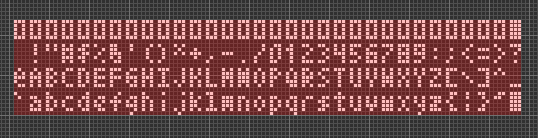
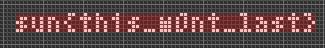

# Golly Gee Willikers
Forensics, 100 points

## Description

> Someone sent me this weird file and I don't understand it. It's freaking me out, this isn't a game! Please help me figure out what's in this file.

```
x = 0, y = 0, rule = B3/S23
3ob3ob3ob3ob3ob3ob3ob3ob3ob3ob3ob3ob3ob3ob3ob3ob3ob3ob3ob3ob3ob3ob3ob
3ob3ob3ob3ob3ob3ob3ob3ob3o$obobobobobobobobobobobobobobobobobobobobobo
bobobobobobobobobobobobobobobobobobobobobobobobobobobobobobobobobobobo
bobobobobob3o$obobobobobobobobobobobobobobobobobobobobobobobobobobobob
obobobobobobobobobobobobobobobobobobobobobobobobobobobobobobobobobob3o
$obobobobobobobobobobobobobobobobobobobobobobobobobobobobobobobobobobo
bobobobobobobobobobobobobobobobobobobobobobobobobobobob3o$3ob3ob3ob3ob
3ob3ob3ob3ob3ob3ob3ob3ob3ob3ob3ob3ob3ob3ob3ob3ob3ob3ob3ob3ob3ob3ob3ob
3ob3ob3ob3ob3o$$5bo2bobobobo2b2obo3b2o3bo4bobo3bobo19bo2b2o2bo2b2o2b2o
2bobob3o2b2ob3ob3ob3o11bo5bo3b3o$5bo2bobob3ob2o4bob2o3bo3bo3bo3bo3bo
16bobobob2o4bo3bobobobo3bo5bobobobobo2bo3bo3bo2b3o2bo4bo$5bo6bobo2b2o
2bo2b3o6bo3bo2bobob3o5b3o6bo2bobo2bo3bo3bo2b3ob2o2b3o2bo2b3ob3o9bo9bo
2bo$12b3ob2o2bo3bobo6bo3bo7bo3bo10bo3bobo2bo2bo5bo3bo3bobobobo3bobo3bo
2bo3bo3bo2b3o2bo$5bo6bobo2bo4bo2b2o7bobo11bo8bo2bo3b2o3bo2b3ob2o4bob2o
2b3obo3b3ob2o6bo5bo5bo4bo$$bo3bo2b2o3b2ob2o2b3ob3o2b2obobob3o3bobobobo
3bobobobo2bo2b2o3bo2b2o3b2ob3obobobobobobobobobobob3ob3o5b3o2bo$obobob
obobobo3bobobo3bo3bo3bobo2bo4bobobobo3b3ob3obobobobobobobobobo4bo2bobo
bobobobobobobobo3bobo3bo5bobobo$3ob3ob2o2bo3bobob3ob3ob3ob3o2bo4bob2o
2bo3b3ob3obobob2o2bobob3o2bo3bo2bobobobob3o2bo3bo3bo2bo4bo4bo$o3bobobo
bobo3bobobo3bo3bobobobo2bo2bobobobobo3bobob3obobobo3b3ob2o4bo2bo2bobo
2bo2b3obobo2bo2bo3bo5bo3bo$b2obobob2o3b2ob2o2b3obo4b2obobob3o2bo2bobob
3obobobobo2bo2bo4b2obobob2o3bo3b2o2bo2bobobobo2bo2b3ob3o5b3o5b3o$$o7bo
9bo7bo5bo4bo4bobo3b2o31bo27b2o2bo2b2o3b2ob3o$bo2b2o2b2o3b2o2b2o2b2o2bo
3b2ob2o10bobo2bo2b3ob2o3bo2b2o3b2o2b2o2b2ob3obobobobobobobobobobob3o2b
o3bo3bo2b2o2b3o$5b2obobobo3bobobobob3obobobobo2bo4bob2o3bo2b3obobobobo
bobobobobo3b2o3bo2bobobobob3o2bo2bobo2b2obo9bo5b3o$4bobobobobo3bobob2o
3bo2b3obobo2bo4bob2o3bo2b3obobobobobobobobobo4b2o2bo2bobob3ob3o2bo3b2o
b2o3bo3bo3bo6b3o$4b3ob2o3b2o2b2o2b2o2bo4bobobo2bo2bobobobob3obobobobo
2bo2b2o3b2obo3b2o3b2o2b2o2bo2b3obobo3bob3o2b2o2bo2b2o6b3o$29bo11bo22bo
5bo30bo!$$$$13b2o2bo2bo4bo15b2o6bo6b2o11bo2b2o$b2obobob2o3bo2b3ob2o2b2o
3b2o5bobobobob2o2b3o6bo2b2o3b2ob3o2bo$2o2bobobobobo4bo2bobo2bo2b2o6b3o
bobobobo2bo7bo3b2ob2o3bo4bo$b2obobobobo2bo3bo2bobo2bo3b2o5b3obobobobo
2bo7bo2bobo2b2o2bo3bo$2o3b2obobo2b2o2b2obobo2bo2b2o2b3ob3ob2o2bobo2b2o
b3ob3ob3ob2o3b2ob2o!
```

## Solution

After spending a while trying to analyze the patterns in the file and searching for creative ways to decode anything, I switched tactics and searched Google for the only thing that seemed searchable: "B3/S23". It turns out that this is a rule in [Conway's Game of Life](https://www.google.com/url?sa=t&rct=j&q=&esrc=s&source=web&cd=9&cad=rja&uact=8&ved=2ahUKEwid3fryv_3hAhUOZ1AKHWN0DvcQFjAIegQIBhAB&url=https%3A%2F%2Fen.wikipedia.org%2Fwiki%2FConway%2527s_Game_of_Life&usg=AOvVaw3Ren4zMW9qfyNBCmJvYMlL) - A cellular automaton model.
The "B3/S23" notation means that:
> A cell is Born if it has exactly 3 neighbours, Survives if it has 2 or 3 living neighbours, and dies otherwise

The next step was searching for "`rule = B3/S23`", and this yielded results as well. It turns out that this is part of a file format called "[Extended RLE](http://golly.sourceforge.net/Help/formats.html)", and used by an open-source application named Golly (hence the challenge title):

> Golly is an open source, cross-platform application for exploring Conway's Game of Life and many other types of cellular automata. 

Golly even has a [Web Application](http://golly.sourceforge.net/webapp/golly.html) which is able to read "Extended RLE" files.

If we load our file, we see:



This is good progress, but it doesn't really look like a flag.

We can run the simulation, but that just leads to an unrecognizable pattern.

Time for some more research on the file format. 

> Any line that is not blank, or does not start with a "#" or "x " or "x=" is treated as run-length encoded pattern data. The data is ordered a row at a time from top to bottom, and each row is ordered left to right. A "$" represents the end of each row and an optional "!" represents the end of the pattern. 

The key here is the last sentence. Our file ends with an exclamation mark, but also contains another one a few lines before the end! This can mean that there are two files concatenated here!

We remove the text until the first exclamation mark, and stay with:
```
$$$$13b2o2bo2bo4bo15b2o6bo6b2o11bo2b2o$b2obobob2o3bo2b3ob2o2b2o
3b2o5bobobobob2o2b3o6bo2b2o3b2ob3o2bo$2o2bobobobobo4bo2bobo2bo2b2o6b3o
bobobobo2bo7bo3b2ob2o3bo4bo$b2obobobobo2bo3bo2bobo2bo3b2o5b3obobobobo
2bo7bo2bobo2b2o2bo3bo$2o3b2obobo2b2o2b2obobo2bo2b2o2b3ob3ob2o2bobo2b2o
b3ob3ob3ob2o3b2ob2o!
```

Now we get:



This looks much more like a flag...


