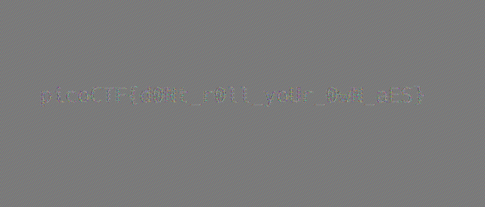

# AES-ABC
Cryptography, 400 points

## Description:
> AES-ECB is bad, so I rolled my own cipher block chaining mechanism - Addition Block Chaining! You can find the source here: aes-abc.py. The AES-ABC flag is body.enc.ppm

```python
#!/usr/bin/env python

from Crypto.Cipher import AES
from key import KEY
import os
import math

BLOCK_SIZE = 16
UMAX = int(math.pow(256, BLOCK_SIZE))


def to_bytes(n):
    s = hex(n)
    s_n = s[2:]
    if 'L' in s_n:
        s_n = s_n.replace('L', '')
    if len(s_n) % 2 != 0:
        s_n = '0' + s_n
    decoded = s_n.decode('hex')

    pad = (len(decoded) % BLOCK_SIZE)
    if pad != 0: 
        decoded = "\0" * (BLOCK_SIZE - pad) + decoded
    return decoded


def remove_line(s):
    # returns the header line, and the rest of the file
    return s[:s.index('\n') + 1], s[s.index('\n')+1:]


def parse_header_ppm(f):
    data = f.read()

    header = ""

    for i in range(3):
        header_i, data = remove_line(data)
        header += header_i

    return header, data
        

def pad(pt):
    padding = BLOCK_SIZE - len(pt) % BLOCK_SIZE
    return pt + (chr(padding) * padding)


def aes_abc_encrypt(pt):
    cipher = AES.new(KEY, AES.MODE_ECB)
    ct = cipher.encrypt(pad(pt))

    blocks = [ct[i * BLOCK_SIZE:(i+1) * BLOCK_SIZE] for i in range(len(ct) / BLOCK_SIZE)]
    iv = os.urandom(16)
    blocks.insert(0, iv)
    
    for i in range(len(blocks) - 1):
        prev_blk = int(blocks[i].encode('hex'), 16)
        curr_blk = int(blocks[i+1].encode('hex'), 16)

        n_curr_blk = (prev_blk + curr_blk) % UMAX
        blocks[i+1] = to_bytes(n_curr_blk)

    ct_abc = "".join(blocks)
 
    return iv, ct_abc, ct


if __name__=="__main__":
    with open('flag.ppm', 'rb') as f:
        header, data = parse_header_ppm(f)
    
    iv, c_img, ct = aes_abc_encrypt(data)

    with open('body.enc.ppm', 'wb') as fw:
        fw.write(header)
        fw.write(c_img)
```

## Solution: 

We receive a `PPM` image file which is encrypted with `AES-ABC`: A layer of `AES-EBC` wrapped with an extra layer of custom encryption.

The `PPM` header (first 16 bytes) is left as-is, and only what comes after that is encrypted:

```console
root@kali:/media/sf_CTFs/pico/AES-ABC# xxd body.enc.ppm | head
00000000: 5036 0a31 3839 3520 3832 300a 3235 350a  P6.1895 820.255.
00000010: cee8 bfc1 9950 7cb9 4946 bcc0 dae7 d1a1  .....P|.IF......
00000020: 4f56 a5f1 a6b3 34cb daea 9886 70ca e5ac  OV....4.....p...
00000030: cfc4 8c21 b415 ecde 6c8e 744c 06ad f9b7  ...!....l.tL....
00000040: 5032 7251 c178 a4f0 fe32 5011 9c91 0dc2  P2rQ.x...2P.....
00000050: d0a0 5881 cedb 5d03 8fd6 2bd7 3274 21cd  ..X...]...+.2t!.
00000060: 510e 3eb1 dc3e 1516 217a 079c c857 35d8  Q.>..>..!z...W5.
00000070: d17c 24e1 e9a0 cd28 b31d e362 5e3a 49e3  .|$....(...b^:I.
00000080: 51ea 0b11 f703 853b 44c1 bf27 f41d 5dee  Q......;D..'..].
00000090: d257 f142 0466 3d4d d665 9aed 8a00 71f9  .W.B.f=M.e....q.
```

Let's take a look at the encryption process:

```python
def aes_abc_encrypt(pt):
    cipher = AES.new(KEY, AES.MODE_ECB)
    ct = cipher.encrypt(pad(pt))

    blocks = [ct[i * BLOCK_SIZE:(i+1) * BLOCK_SIZE] for i in range(len(ct) / BLOCK_SIZE)]
    iv = os.urandom(16)
    blocks.insert(0, iv)
    
    for i in range(len(blocks) - 1):
        prev_blk = int(blocks[i].encode('hex'), 16)
        curr_blk = int(blocks[i+1].encode('hex'), 16)

        n_curr_blk = (prev_blk + curr_blk) % UMAX
        blocks[i+1] = to_bytes(n_curr_blk)

    ct_abc = "".join(blocks)
 
    return iv, ct_abc, ct
```

The plaintext is first encrypted using AES-ECB, which means that it is divided into 16-byte blocks and each block is encrypted independently using a secret key.

Then, the AES-EBC ciphertext is divided (again) into 16 byte blocks. An IV is chosen, and set as the first block of the output. After that, the function iterates over the blocks of the AES-EBC ciphertext and for each block, calculates its sum together with the previous output block (modulus UMAX), and this is set as the current output block.

Therefore, we can say that:
```
ABC(0) = IV
For n=1..num_ebc_blocks: ABC(n+1) = ( EBC(n) + ABC(n) ) % UMAX
```

It's a widely known fact that AES-EBC isn't secure, and one of the famous examples is related to the ability to extract significant details from a bitmap image even after encryption:

> A striking example of the degree to which ECB can leave plaintext data patterns in the ciphertext can be seen when ECB mode is used to encrypt a bitmap image which uses large areas of uniform color. While the color of each individual pixel is encrypted, the overall image may still be discerned, as the pattern of identically colored pixels in the original remains in the encrypted version. (Source: Wikipedia)

The [Wikipedia article](https://en.wikipedia.org/wiki/Block_cipher_mode_of_operation#Electronic_Codebook_(ECB)) contains a visualization of the problem - check it out.

So, if we can bring the ciphertext back to EBC form, we might be able to get the flag even without knowing the original EBC key.

In our case, it should be easy to reverse the ABC layer. We already know that `ABC(n+1) = ( EBC(n) + ABC(n) ) % UMAX`. Another way to write a modulus equation is `ECB(n) + ABC(n) = k*UMAX + ABC(n+1)` for some non-negative integer `k`, meaning `ECB(n) = ABC(n+1) - ABC(n) + k*UMAX`.

We also know that `UMAX` was defined as a tight upper bound for a single 16-byte value, meaning both `EBC(n)` and `ABC(n)` are under it, and `EBC(n) + ABC(n)` are bound by `2*UMAX`. Therefore, in our case, `k == 0 || k == 1`. If `k == 0` then `ECB(n) = ABC(n+1) - ABC(n)` and if `k == 1` then `ECB(n) = ABC(n+1) - ABC(n) + UMAX`. Knowing this, we can easily reverse the algorithm using the following script:

```python
import sys

class key(object):
    @staticmethod
    def KEY():
        return None

if __name__ == "__main__":
    sys.modules['key'] = key
    from aes_abc import parse_header_ppm, to_bytes, BLOCK_SIZE, UMAX

    with open('body.enc.ppm', 'rb') as f:
        header, data = parse_header_ppm(f)
        blocks = [data[i * BLOCK_SIZE:(i+1) * BLOCK_SIZE] for i in range(len(data) / BLOCK_SIZE)]
        new_blocks = []

        for i in range(len(blocks) - 1):
            prev_blk = int(blocks[i].encode('hex'), 16)
            curr_blk = int(blocks[i+1].encode('hex'), 16)

            n_curr_blk = (curr_blk - prev_blk)
            if n_curr_blk < 0:
                n_curr_blk += UMAX
            new_blocks.append(to_bytes(n_curr_blk))

        joined = "".join(new_blocks)
        with open('ecb.ppm', 'wb') as fw:
            fw.write(header)
            fw.write(joined)
```

Notes:

* We reuse logic from the original script. In order to do that without changing the original script, we must mock the `key` module which we don't have access to and don't need
* We calculate `ECB(n) = ABC(n+1) - ABC(n)`. We add `UMAX` in case the result is negative (`ECB(n)` was originally non-negative). Under these circumstances, this is equivalent to calculating `n_curr_blk = (curr_blk - prev_blk) % UMAX`.

After running the script, we get the following image:



The flag: `picoCTF{d0Nt_r0ll_yoUr_0wN_aES}`.