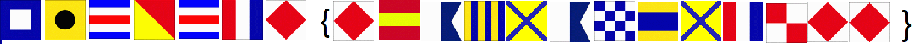

# Flags
Cryptography, 200 points

## Description:
> What do the flags mean?


## Solution: 


At first glance, this looks like a simple substitution cipher. The flag format fits the template, so we can safely assume that the sequence starts with "picoctf". The theory is strengthened by the fact that the blue-white-red flag repeats itself twice, and matches `C`'s location.

This brings us to:
```
picoctf{f??????????ff}
```

Let's assume that the phrase within the curly brackets is meaningful, as most flags are. Since this is a challenge about flags, and the first word starts with an `F`, we can guess that it is `flags` (which makes more sense than `flag`).

This brings us to:
```
picoctf{flagsa??s??ff}
```

My best guess for the flag at this stage was `picoctf{flagsandstuff}`, however that didn't work, and neither did `picoctf{flagsarestuff}`. Several other longshots didn't work either.

Finally, I googled "[flag red diamond](https://www.google.com/search?client=firefox-b-d&q=flag+red+dimond)" which brought me to the wonderful Wikipedia page [Gallery of flags with diamonds](https://commons.wikimedia.org/wiki/Gallery_of_flags_with_diamonds). There, I spotted [ICS flag foxtrot](https://commons.wikimedia.org/wiki/Gallery_of_flags_with_diamonds#/media/File:ICS_Foxtrot.svg) which seemed like a great lead since `foxtrot` is one of those words you only hear when someone is spelling out `F` in a phonetic alphabet.

Searching for `ICS Flags` brings us to the [International maritime signal flags](https://en.wikipedia.org/wiki/International_maritime_signal_flags) Wikipedia entry, where all the flags are listed. 

After decoding, the flag turned out to be `PICOCTF{F1AG5AND5TUFF}`.