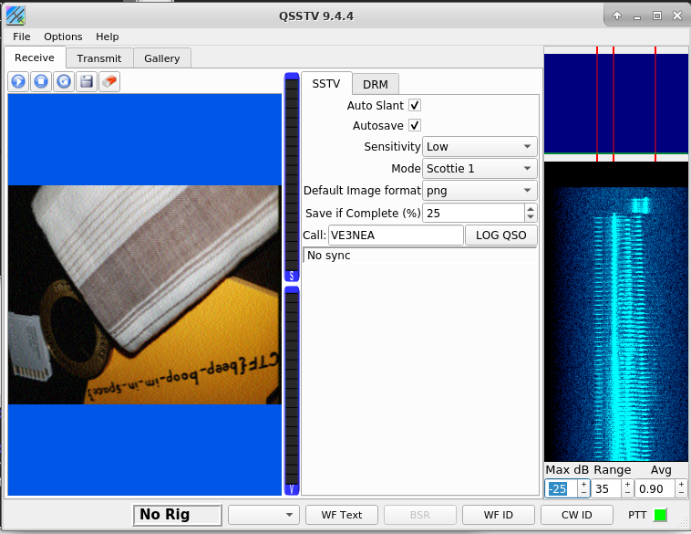

# m00nwalk
Forensics, 250 points

## Description:
> Decode this message from the moon.

A WAV file was attached.

Hints:
* How did pictures from the moon landing get sent back to Earth?
* What is the CMU mascot?, that might help select a RX option

## Solution: 

Nothing meaningful can be identified listening to the file. Also visualizing the file didn't lead anywhere. The hint suggests that this is related to how images from the moon landing were transmitted back to earth. Some research leads to [SSTV](https://en.wikipedia.org/wiki/Slow-scan_television):

> Slow Scan television (SSTV) is a picture transmission method used mainly by amateur radio operators, to transmit and receive static pictures via radio in monochrome or color. 
> The Apollo TV cameras used SSTV to transmit images from inside Apollo 7, Apollo 8, and Apollo 9, as well as the Apollo 11 Lunar Module television from the Moon.

[This tutorial](https://ourcodeworld.com/articles/read/956/how-to-convert-decode-a-slow-scan-television-transmissions-sstv-audio-file-to-images-using-qsstv-in-ubuntu-18-04) explains how to use a program called `qsstv` to convert the audio files back to images.

In short:

```console
root@kali:/media/sf_CTFs/pico/m00nwalk# apt-get install qsstv
root@kali:~# pactl load-module module-null-sink sink_name=virtual-cable
22
root@kali:~# pavucontrol # A GUI will pop-up, go to the "Output Devices" tab to verify that you have the "Null Output" device
root@kali:~# qsstv # The program GUI will pop-up, go to "Options" -> "Configuration" -> "Sound" and select the "PulseAudio" Audio Interface
root@kali:~# # Back in the pavucontrol GUI, select the "Recording" tab and specify that QSSTV should capture audio from the Null Output
```

The hint asked "What is the CMU mascot?" - the answer is "Scotty the Scottie Dog". This hinted that we should select "Scottie 1" as QSSTV's "Mode". I also had to select "Auto Slant" via trial and error.

At this point we can click the "Play" button in QSSTV to start the receiver, and then play the audio file:
```console
root@kali:/media/sf_CTFs/pico/m00nwalk# paplay -d virtual-cable message.wav 
```

The image is received and decoded by the program:



After the transmission has ended, we can cleanup by using the following commands:

```console
root@kali:/media/sf_CTFs/pico# pactl list short modules | grep null
22      module-null-sink        sink_name=virtual-cable
root@kali:/media/sf_CTFs/pico# pactl unload-module 22
```

The flag: `picoCTF{beep_boop_im_in_space}`

