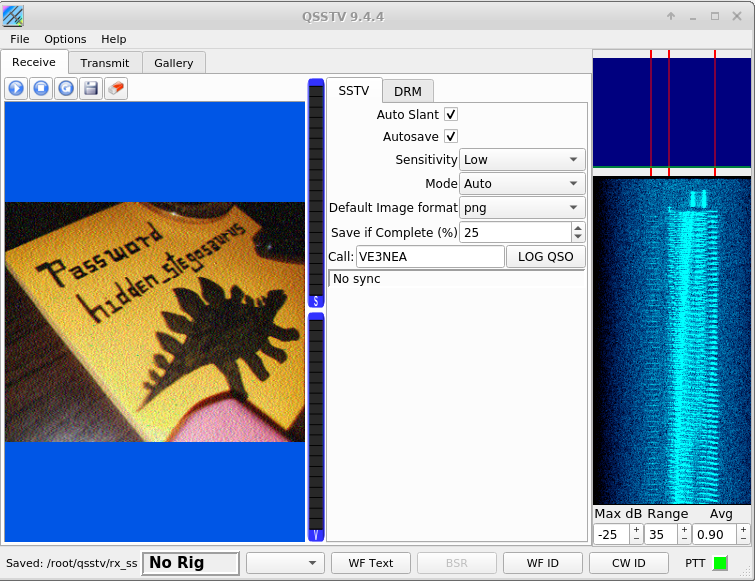
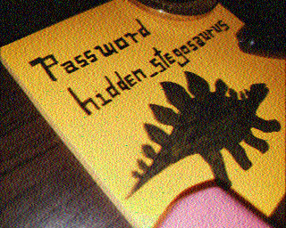
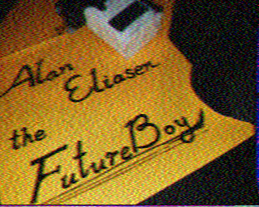

# m00nwalk2
Forensics, 300 points

## Description:
> Revisit the last transmission. We think this transmission contains a hidden message. There are also some clues clue 1, clue 2, clue 3.


## Solution: 

This is a follow-up challenge to [m00nwalk](m00nwalk.md).

We receive the same transmission as before, and three clues:
```console
root@kali:/media/sf_CTFs/pico/m00nwalk2# ls *.wav
clue1.wav  clue2.wav  clue3.wav  message.wav
root@kali:/media/sf_CTFs/pico/m00nwalk2# diff message.wav ../m00nwalk/message.wav
root@kali:/media/sf_CTFs/pico/m00nwalk2#
```

The decode process is the same as before, with the single difference of having to chose "Auto" as the mode, instead of "Scottie 1".



We get three clues:






Searching for "Alan Eliasen the Future Boy" brings us to [this  page](https://futureboy.us/stegano/), which talks about Steganography Tools.

> These pages use the steghide program to perform steganography, and the files generated are fully compatible with steghide.

So, let's use `steghide` to try and recover a hidden message from the original file:

```console
root@kali:/media/sf_CTFs/pico/m00nwalk2# steghide extract -sf message.wav -p hidden_stegosaurus
wrote extracted data to "steganopayload12154.txt".
root@kali:/media/sf_CTFs/pico/m00nwalk2# cat steganopayload12154.txt
picoCTF{the_answer_lies_hidden_in_plain_sight}
```
