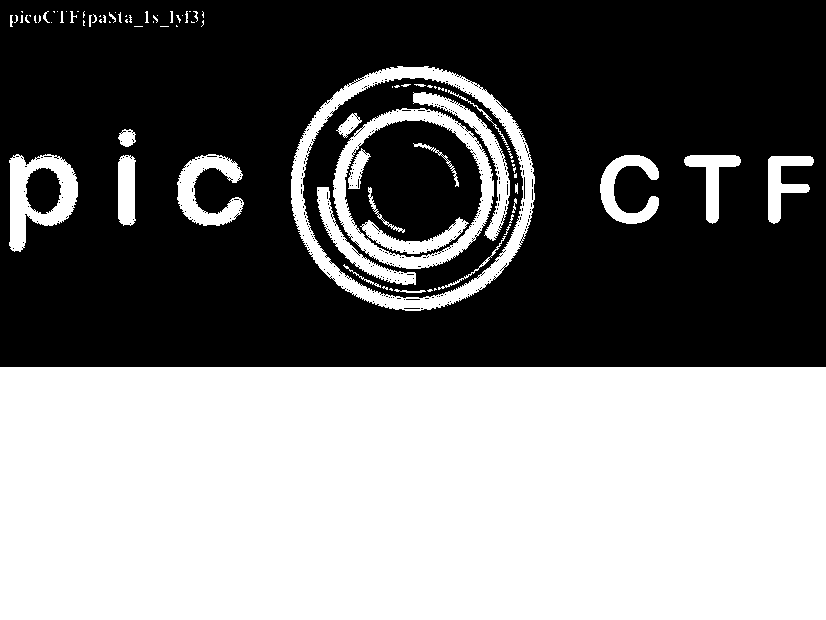

# pastaAAA
Forensics, 350 points

## Description:
> This pasta is up to no good. There MUST be something behind it.

## Solution: 

Using `stegsolve` or [this online tool](https://georgeom.net/StegOnline/image), it's possible to browse through all available planes.

We eventually find the following hidden layer:

The flag: `picoCTF{pa$ta_1s_lyf3}`.
