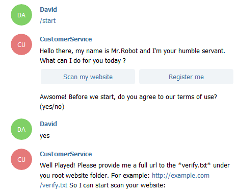
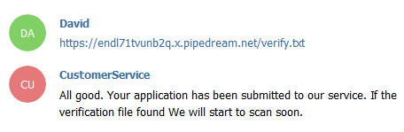
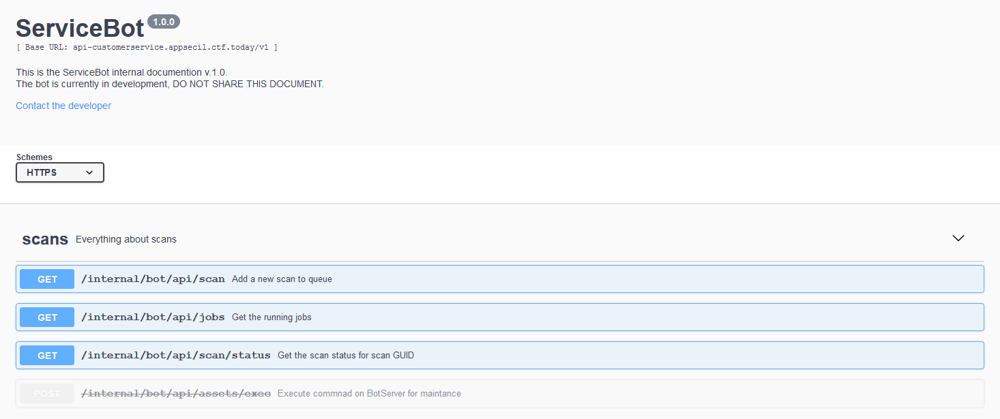

# Customer Service
* Category: Web
* 200 Points
* Solved by the JCTF Team

## Description
> Last year we decided to improve our customer service to our security researchers team by created an AI-based vulnerability scanner. 
> 
> Now it released for free to the community!
> 
> We Hope you will like that!

## Solution

We enter the attached website, and together with some marketing material, there's a link to try the scanner:

```html
<br>Go Ahead and Try <a href="https://web.telegram.org/#/im?p=@CSAdmin2020bot" target="_blank">NOW</a>.
```

This in fact is a telegram bot.



We're asked to provide a URL to a verification file in order to start the scan. We can use a [request bin](https://requestbin.com/) for this, in order to be able to inspect the scanner access.



A few seconds later, we get a hit in the request bin:

```
host: endl71tvunb2q.x.pipedream.net
accept: application/json, text/plain, */*
api-method: https://api-customerservice.appsecil.ctf.today/v1/internal/bot/api/scan?url=https://endl71tvunb2q.x.pipedream.net/verify.txt
user-agent: ServiceBot/1.0
x-sent-by: ServiceBot/1.0
connection: keep-alive
```

The `api-method` seems interesting, let's visit it:

```console
root@kali:/media/sf_CTFs/appsec/Customer_Service# curl https://api-customerservice.appsecil.ctf.today/v1/internal/bot/api/scan?url=https://endl71tvunb2q.x.pipedream.net/verify.txt
{"msg":"scan waiting for bot vertification.","status":200}
```

Traveling up the URI, we find the following content:
```console
root@kali:/media/sf_CTFs/appsec/Customer_Service# curl https://api-customerservice.appsecil.ctf.today/v1/internal/bot/
Welcome to ServiceBot server. Please checkout <a href=/v1/internal/bot/docs>documention</a> for development.
```

Let's visit the documentation:



The deprecated `/internal/bot/api/assets/exec` API catches the eye. There's even a button to try it out. 

We execute the command according to the documentation and get the flag:

```console
root@kali:/media/sf_CTFs/appsec/Customer_Service# curl -X POST "https://api-customerservice.appsecil.ctf.today/v1/internal/bot/api/assets/exec" -H  "accept: application/json" -H  "Content-Type: application/json" -d "{  \"cmd\": \"string\"}"
{"msg":"Congrats! Your flag: AppSec-IL{B0t_Do3nt_M34n_S3cure_A7i}","status":200}
```