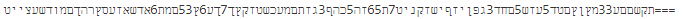
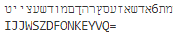
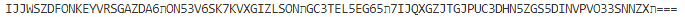
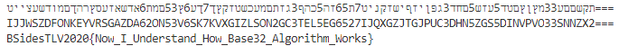

# Basis32
* Category: Crypto
* 100 Points
* Solved by the JCTF Team

## Description
> We captured this message from Shabak's traffic, Can you decode the message?
> 
> Message: טייצעשדומםךהרץסעזאשדא6תמם53ץ6עך7ךץקזטשכעמםתזג3ףהכ5הז65ת7טינקזשיףזיןפג3דחם5שזע5דטםץןץמ33עםםשקת===

## Solution

This indeed looks like base32, just with Hebrew characters instead of English ones. English is written left-to-right while Hebrew is written right-to-left, so for starters, let's take a look at this text left-to-right:



Now, we know that the flag format is either `BSidesTLV{}` or `BSidesTLV2020{}`, so let's align the common prefix with our string and see what we get:

```python
s = "טייצעשדומםךהרץסעזאשדא6תמם53ץ6עך7ךץקזטשכעמםתזג3ףהכ5הז65ת7טינקזשיףזיןפג3דחם5שזע5דטםץןץמ33עםםשקת==="
print(s)
print(base64.b32encode(b"BSidesTLV").decode("ascii"))
```

Output:



This looks good, since the second and third character of both strings are equal. So, this might be a simple substitution process. How simple? Let's see what we know so far by mapping the Base32 characters in English to the ones we've found in Hebrew:

```
'2': '',
'3': '',
'4': '',
'5': '',
'6': '',
'7': '',
'A': '',
'B': '',
'C': '',
'D': 'ד',
'E': 'ה',
'F': 'ו',
'G': '',
'H': '',
'I': 'ט',
'J': 'י',
'K': 'ך',
'L': '',
'M': '',
'N': 'ם',
'O': 'מ',
'P': '',
'Q': '',
'R': '',
'S': 'ע',
'T': '',
'U': '',
'V': 'ץ',
'W': 'צ',
'X': '',
'Y': 'ר',
'Z': 'ש',
```

Anyone that knows Hebrew will immediately notice that the order of the Hebrew characters is kept, meaning we have high confidence to fill in the rest of the characters according to the standard order:

```python
import base64

s = "טייצעשדומםךהרץסעזאשדא6תמם53ץ6עך7ךץקזטשכעמםתזג3ףהכ5הז65ת7טינקזשיףזיןפג3דחם5שזע5דטםץןץמ33עםםשקת==="

def char_range(start, end):
    return [chr(x) for x in range(ord(start), ord(end) + 1)]

hebrew  = "".join(char_range('2', '7') + char_range('א', 'ש'))
english = "".join(char_range('2', '7') + char_range('A', 'Z'))

translated = s.translate(str.maketrans(hebrew, english))
print(translated)
```

Output:



Looks like we still have a `ת` there that we didn't handle. That's the last letter of the Hebrew ABC and it comes after `ש` which was the last letter we had (mapped to `Z`). So it makes sense to try cycling around and have `ת` as the first letter:

```python
import base64

s = "טייצעשדומםךהרץסעזאשדא6תמם53ץ6עך7ךץקזטשכעמםתזג3ףהכ5הז65ת7טינקזשיףזיןפג3דחם5שזע5דטםץןץמ33עםםשקת==="

def char_range(start, end):
    return [chr(x) for x in range(ord(start), ord(end) + 1)]

hebrew  = "".join(char_range('2', '7') + char_range('א', 'ש')).replace('2', 'ת')
english = "".join(char_range('2', '7') + char_range('A', 'Z'))

translated = s.translate(str.maketrans(hebrew, english))

print(s)
print(translated)
print (base64.b32decode(translated).decode("ascii"))
```

Output:



The flag: `BSidesTLV2020{Now_I_Understand_How_Base32_Algorithm_Works}`

If you still don't understand how the base32 algorithm works, read about it [here](https://en.wikipedia.org/wiki/Base32).