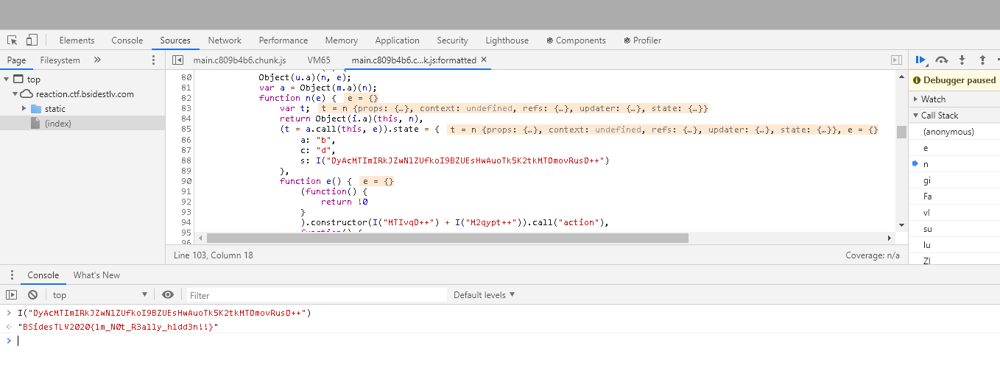

# Reaction
* Category: Web
* 100 Points
* Solved by the JCTF Team

## Description
> Sometimes, stupid things happen while you develop through youtube guides...
> 
> URL: https://reaction.ctf.bsidestlv.com/

## Solution

The attached website is implemented in [React](https://en.wikipedia.org/wiki/React_(web_framework)) and contains a login form:


Since there doesn't seem to be anything special about the login form, we dive into the source code. React source code isn't very readable, but we do find a Javascript method which seems worth investigating:

```javascript
        var M = function(e) {
            Object(u.a)(n, e);
            var a = Object(m.a)(n);
            function n(e) {
                var t;
                return Object(i.a)(this, n),
                (t = a.call(this, e)).state = {
                    a: "b",
                    c: "d",
                    s: I("DyAcMTImIRkJZwNlZUfkoI9BZUEsHwAuoTk5K2tkMTDmovRusD++")
                },
                function e() {
                    (function() {
                        return !0
                    }
                    ).constructor(I("MTIvqD++") + I("M2qypt++")).call("action"),
                    function() {
                        return !1
                    }
                    .constructor(I("MTIvqD++") + I("M2qypt++")).apply("stateObject"),
                    setTimeout((function() {
                        e()
                    }
                    ), 100)
                }(),
                t
            }
            return Object(l.a)(n, [{
                key: "addTwoNumbers22",
                value: function() {
                    console.log(30)
                }
            }, {
                key: "sumTwoNumbers22",
                value: function(e, a) {
                    var n = e + a;
                    console.log(n)
                }
            }, {
                key: "sumTwoNumbersAndReturn22",
                value: function(e, a) {
                    return e + a
                }
            }, {
                key: "printFullName22",
                value: function(e, a) {
                    return "".concat(e, " ").concat(a)
                }
            }, {
                key: "square22",
                value: function(e) {
                    return e * e
                }
            }, {
                key: "sumArrayValues22",
                value: function(e) {
                    for (var a = 0, n = 0; n < e.length; n++)
                        a += q[n];
                    return a
                }
            }, {
                key: "render",
                value: function() {
                    return r.a.createElement("div", null)
                }
            }]),
            n
        }(r.a.Component);
```

This method has a long encoded string which raises some suspicion: `"DyAcMTImIRkJZwNlZUfkoI9BZUEsHwAuoTk5K2tkMTDmovRusD++"`.

We can try to decode it using the Developer Console:



Surprisingly, we get the flag: `BSidesTLV2020{1m_N0t_R3ally_h1dd3n!!}`