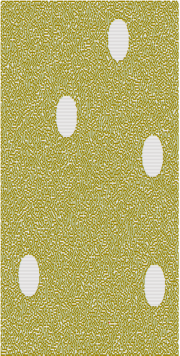
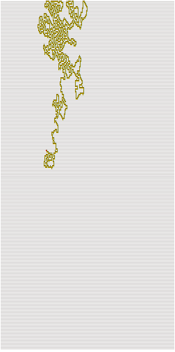

# Amaze me
Category: Logic, 100 Points

## Description

> All you need to know is:
> 
> netcat maze.csa-challenge.com 80
> 
> Good luck!


## Solution

Let's connect to the attached server:

```console
root@kali:/media/sf_CTFs/checkpoint/Amaze_me# nc maze.csa-challenge.com 80
The great Mount of Moria towered over a maze that concealed a lustrous treasure, the Nauglamir.
The treasure is still present from the days of the great king Thingol,
but is secretly hidden in a maze after being stashed away by dwarfs.
Unfortunately, the last copy of the map of the maze was lost,
but we hope you will still be able to help us locating the Nauglamir.
You will find this is no easy task -
The maze is 250 x 250 big, you have only limited attempts.
You must be really careful in your answers to avoid traps built by the dwarfs to protect the Nauglamir.
Guesses won't help you and we trust your skills and wisdom to guide you in this challenge.
We trust you and wish you good luck, and hope you will find your way to the Nauglamir.
Oh, and just in case it will help you - your starting position is:  (46,185)
> What is your command?
l
0
> What is your command?
r
1
> What is your command?
u
0
> What is your command?
d
0
> What is your command?
```

It looks like a maze, and we can try to move left, right, up and down. If we are successful, the console returns `1`, otherwise `0`.

Using just this information, we can write a simple backtracking program to explore the maze and see if we find anything. We can even log the locations we have visited in a mini-map.

Running such a program would produce an output similar to the following (needless to say, every session produces a different random map):



There are a few large oval areas which can't be accessed, but apart from that, nothing interesting. We must be missing something.

Let's go back to the command prompt. If we try entering some other commands, we get interesting responses:

```console
Oh, and just in case it will help you - your starting position is:  (35,175)
> What is your command?
c
(35,175)
> What is your command?
i
l=0, r=0, u=0, d=1
> What is your command?
h
Don't forget to eat breakfast, it's the most important meal in the day
> What is your command?
g
far far away
> What is your command?
s
> What is your solution?
17, 22
Next time we suggest you to keep your guesses to yourself and start walking instead!
```

We see that `i` gives us a summary of the directions we can go to, and `g` says "far far away". Sounds like at some point this command should tell us that we're closer. 
We also have `s` which accepts coordinates - we will probably need to use this to enter the treasure coordinates.

Therefore, the next step is to refactor our backtracking program to query `g`.

We run it, and at some point we get a hit:
```
Your distance from the treasure is √ 1855
```

So now we know that `g` tells us our distance from the treasure (in terms of `sqrt(distance)` ).

If we have three such points, we can try to triangulate the treasure.

This is a coding challenge so we'll jump from here straight to the code:

```python
import io, shutil, re, datetime, random
from collections import namedtuple
from functools import lru_cache
from enum import Enum
from pwn import *
from z3 import *

MAZE_SIZE = 250

class Direction(Enum):
    UP      = "up"
    DOWN    = "down"
    LEFT    = "left"
    RIGHT   = "right"

MovementOptions = namedtuple('MovementOptions', [Direction.LEFT.value, Direction.RIGHT.value, Direction.UP.value, Direction.DOWN.value]) # Order matters for get_movement_options()
Coordinate      = namedtuple('Coordinate',      ['row', 'column'])
CoordinateDelta = namedtuple('CoordinateDelta', ['row_delta', 'column_delta'])
Backtrack       = namedtuple('Backtrack',       ['coordinate', 'opposite_direction'])
DistanceMarker  = namedtuple('DistanceMarker',  ['coordinate', 'distance_sqrt'])

class DirectionAttr:
    """ Attributes of a direction """
    OPPOSITES  = {Direction.UP: Direction.DOWN, Direction.DOWN: Direction.UP, Direction.LEFT: Direction.RIGHT, Direction.RIGHT: Direction.LEFT}
    def __init__(self, type: Direction, command: str, coord_delta: tuple):
        self.type = type
        self.command = command
        self.row_delta = coord_delta[0]
        self.col_delta = coord_delta[1]

    @property
    def opposite(self):
        """Returns the opposite direction type"""
        return self.OPPOSITES[self.type]

DIRECTION_ATTRIBUTES = {
                Direction.UP    : DirectionAttr(Direction.UP,     'u', (0  ,  1)),
                Direction.DOWN  : DirectionAttr(Direction.DOWN,   'd', (0  , -1)),
                Direction.LEFT  : DirectionAttr(Direction.LEFT,   'l', (-1 ,  0)),
                Direction.RIGHT : DirectionAttr(Direction.RIGHT,  'r', (1  ,  0))
}


def print_maze(current_r: int, current_c: int):
    """ Prints the maze to an HTML file """
    with open("maze.html", "w") as f, io.StringIO() as temp:
        temp.write(f"<div style=''>Current location: ({current_r}, {current_c})</div><br/>")
        for c in range(MAZE_SIZE - 1, -1, -1):
            for r in range(MAZE_SIZE):
                if r == current_r and c == current_c:
                    temp.write("<span style='background-color:red'>*</span>")
                elif is_visited(r, c):
                    temp.write("<span style='background-color:yellow'>@</span>")
                else:
                    temp.write("<span color='light-gray'>.</span>")
            temp.write("<br/>")
        f.write("<div style='font-family: monospace;'>")
        temp.seek (0)
        shutil.copyfileobj (temp, f)
        f.write("</div>")


def is_visited(r: int, c: int) -> bool:
    """ Retruns True iff maze was visited at given coordinate """
    return visited[r][c] == 1

def is_movement_possible(movement_options: MovementOptions, direction: Direction) -> bool:
    """ Returns True iff movement to given direction using given movement options is possible """
    return getattr(movement_options, direction.value)

def read_command():
    """ Reads the input until it's possible to enter a command """
    output = s.recvuntil("> What is your command?\n", drop = True)
    if output.decode("utf-8").rstrip() != "":
        log.info(output)

@lru_cache(maxsize=None)
def get_movement_options(r: int, c: int) -> MovementOptions:
    """ Returns the available movement options from the current coordinate """
    read_command()
    s.sendline("i")
    response = s.recvline()
    match = re.search(r"l=([01]), r=([01]), u=([01]), d=([01])", response.decode("utf-8"))
    return MovementOptions(*[True if x == '1' else False for x in match.groups()])

def go_to(direction: Direction):
    """ Moves the player in the given direction """
    if direction is None:
        return
    read_command()
    s.sendline(DIRECTION_ATTRIBUTES[direction].command)
    response = s.recvline()
    try:
        can_move = int(response.strip())
        assert(can_move == 1)
    except ValueError:
        log.error (response)
        raise

def get_current_coordinates() -> Coordinate:
    """ Retrieves the current coordinates given by the server """
    read_command()
    s.sendline("c")
    coordinates = s.recvline()
    r, c = coordinates.decode("utf-8").strip("()\n ").split(",")
    return Coordinate(int(r), int(c))

def get_distance_from_treasure() -> int:
    """ Returns the distance from the treasure raised to the power of two if available, otherwise None """
    read_command()
    s.sendline("g")
    
    line = s.recvline()
    line = line.decode("utf-8").rstrip()
    if line == "far far away":
        return None
    match = re.search(r"Your distance from the treasure is .+ (\d+)", line)
    return int(match.group(1))
    
def try_to_find_treasure(known_distances: set) -> bool:
    """ Attempts to triangulate the treasure given the set of known distances, returns True iff successful """

    min_samples = 3 # Minimal number of samples needed to triangulate a point

    if len(known_distances) < min_samples:
        return False

    solver = Solver()
    dest_r = Int("dest_r")
    dest_c = Int("dest_c")

    # We use random samples since sometimes some of the samples create an unsolvable equation (due to accuracy issues?)
    samples = random.sample(known_distances, k = min_samples)
    log.info("Trying to triangulate treasure using samples:\n{}".format(samples))
    for sample in samples:
        solver.add((sample.coordinate.row - dest_r)**2 + (sample.coordinate.column - dest_c)**2 == sample.distance_sqrt) # Euclidean distance without sqrt

    if solver.check() == sat:
        # Found a location, try to submit it
        model = solver.model()
        treasure = Coordinate(model[dest_r], model[dest_c])
        log.info("Treasure should be at ({}, {})".format(treasure.row, treasure.column))

        read_command()
        s.sendline("s")
        s.recvuntil("> What is your solution?\n")
        s.sendline("{}, {}".format(treasure.row, treasure.column))
        output = s.recvall()
        log.success (output.decode("utf-8"))
        return True
    else:
        return False


def search_for_treasure(start_r: int, start_c: int):
    """ Explores the maze in search of the treasure """

    stack            = []       # History of locations, used for backtracking
    known_distances  = set()    # Set of known distances from a coordinate to the treasure
    counter          = 0

    check_treasure_distance_cadence = 50  # Check for treasure every x steps
    print_maze_cadence              = 100 # Print maze every x steps

    stack.append(Backtrack(Coordinate(start_r, start_c), None))

    with log.progress('Searching for treasure...') as p:
        while len(stack) > 0:
            p.status("Number of steps: {}".format(counter))
            backtrack = stack[-1]
            coord = backtrack.coordinate

            if counter % print_maze_cadence == 0:
                assert(get_current_coordinates() == coord) # Sanity - make sure we are where we think we are
                print_maze(coord.row, coord.column)
            if counter % check_treasure_distance_cadence == 0:
                distance_sqrt = get_distance_from_treasure()
                if distance_sqrt is not None:
                    dm = DistanceMarker(coord, distance_sqrt)
                    if dm not in known_distances:
                        log.info("({}, {}): Distance from treasure is sqrt({})".format(coord.row, coord.column, distance_sqrt))
                        check_treasure_distance_cadence = 2 # We are close, start looking for treasure more often
                        known_distances.add(dm)
                if try_to_find_treasure(known_distances):
                    print_maze(coord.row, coord.column)
                    break

            visited[coord.row][coord.column] = 1

            movement_options = get_movement_options(coord.row, coord.column) # Where can we move to?

            for direction_attr in DIRECTION_ATTRIBUTES.values():
                new_row = coord.row    + direction_attr.row_delta
                new_col = coord.column + direction_attr.col_delta
                if is_movement_possible(movement_options, direction_attr.type) and not is_visited(new_row, new_col):
                    go_to(direction_attr.type)
                    stack.append(Backtrack(Coordinate(new_row, new_col), direction_attr.opposite))
                    break
            else: # Can't move anywhere new -> backtrack
                backtrack = stack.pop()
                go_to(backtrack.opposite_direction)

            counter += 1
    
    print_maze(coord.row, coord.column)


visited = [[0] * MAZE_SIZE for _ in range(MAZE_SIZE)]

s = remote("maze.csa-challenge.com", 80)
s.recvuntil("Oh, and just in case it will help you - your starting position is:")
location = s.recvline()
start_r, start_c = location.decode("utf-8").strip("()\n ").split(",")
log.info(f"Starting from ({start_r}, {start_c})")

log.info("Start time: {}".format(datetime.datetime.now()))
search_for_treasure(int(start_r), int(start_c))
log.info("End time: {}".format(datetime.datetime.now()))

```


Implementation notes:
* In many cases backtracking is implemented using recursion. However, in this case, the recursion depth is too deep and a stack based backtrack algorithm is implemented instead
* The code uses `z3` to triangulate the treasure given at least three points. To avoid precision errors, if `z3` is unable to solve the set of equations using the first three samples found, the code will continue searching for samples and trying three random samples until the equations can be solved.
* Every once in a while, the code checks its calculated location against the server's location as sanity
* The code starts by checking the distance from the treasure via `g` every 50 steps, for performance reasons. Once `g` returns an actual distance, the cadence is reduced to 2 steps in order to find additional samples quickly
* The code logs the current known map every 100 steps
* MovementOptions received via the `i` command are cached to avoid an additional server request while backtracking

The output:
```console
root@kali:/media/sf_CTFs/checkpoint/Amaze_me# python3 solve.py
[+] Opening connection to maze.csa-challenge.com on port 80: Done
[*] Starting from (80, 219)
[*] Start time: 2020-06-01 19:36:10.739195
[+] Searching for treasure...: Done
[*] (66, 139): Distance from treasure is sqrt(2249)
[*] (66, 141): Distance from treasure is sqrt(2173)
[*] (65, 142): Distance from treasure is sqrt(2053)
[*] Trying to triangulate treasure using samples:
    [DistanceMarker(coordinate=Coordinate(row=66, column=141), distance_sqrt=2173), DistanceMarker(coordinate=Coordinate(row=65, column=142), distance_sqrt=2053), DistanceMarker(coordinate=Coordinate(row=66, column=139), distance_sqrt=2249)]
[*] Treasure should be at (23, 159)
[+] Receiving all data: Done (102B)
[*] Closed connection to maze.csa-challenge.com port 80
[+] Congrats you found the treasure. your flag is:
    CSA{1_Wa5_50_aMa23D_THaT_Y0U_F1ND_Y0UR_WaY_1N_MY_Ma23}
[*] End time: 2020-06-01 19:42:58.100695
```

Map for the solution above :



Flag: `CSA{1_Wa5_50_aMa23D_THaT_Y0U_F1ND_Y0UR_WaY_1N_MY_Ma23}`