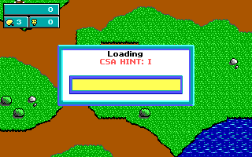
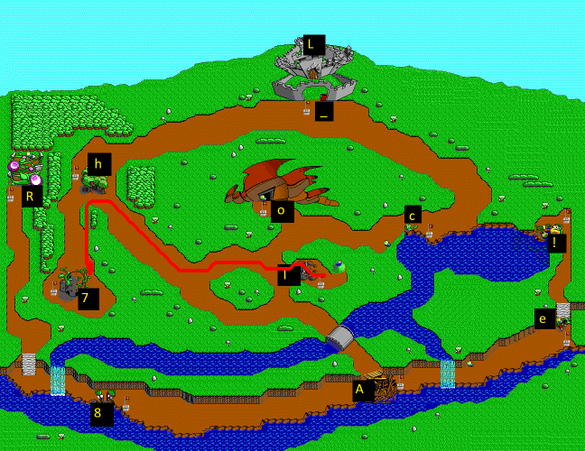
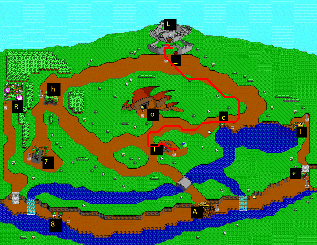
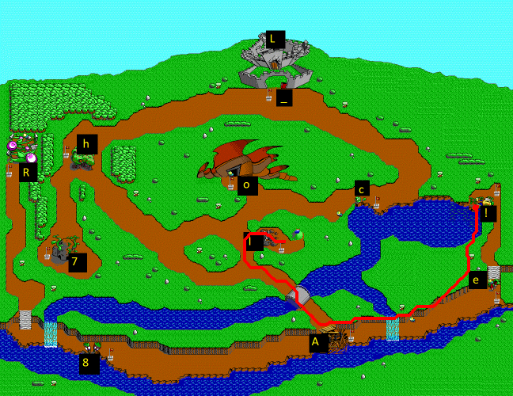

# Command Keen
Category: Programming, 100 Points

## Description

>```
>            ________________
>          .'   \  \    \  \ `.
>        /       \  \    \  \  '. 
>       /\        |  |    |  |   \
>      |  \       |  |    |  |    \
>      |  /      _|__|____|__|__   \
>      | /     /                \  | 
>      |/      | <(=)>    <(=)> '  |
>      |       |         _|     |  |
>      | (|)   |  /\            |  |
>      '       ' |  \____      /  ]
>        '     '\ \_____/    .|  '
>         '__,'  \_________.' |_/ 
>                |____________\  ,.
>              ,.              /\  \ 
>            .`                ||   \
>          .`                  ----\ \               
>         /                    <== |, \         
>        /                     <== | \_\
>       '                      ---/     |      
>       `._     /|                \____/         
>       /  `-,./ |                 '
>      /     /   |                 |        
>     (______`'._|_________________|       By Geoff Sims © 1998 
> ```
>
> Welcome to the land of CSA!
> 
> In this challenge you'll help our CSA hero KEEN to find the lost secret :)
> Your first mission is to find the secret sentence - spread in the game levels.
> To complete the mission you'll use the attached game code,
> and game recordings that would guide you to the secret sentence.
> 
> Each recording file stores information of KEEN's movements in the game,
> according to the following format:
> 
> 2Bytes - movement counter 
> 
> 2Bytes - 2 buttons click - for throwing/jumping as in the game controller settings
> 
> 2Bytes - x direction of movement
> 
> 2Bytes - y direction of movement
>
> .
> .
> 
> In order to find out what is the secret sentence you should be able to play 
> the recordings in the game BY THEIR ORDER, BUT! only once you are DONE with ALL the game levels.
> 
> IMPORTANT 1: each recording you should play from the start of the game.
> 
> IMPORTANT 2: submit the flag with the following format CSA{...}.
> 
> HINT: use the "hint"s in the code.
> 
> GOOD LUCK!

A zip file was attached.

## Solution

Let's take a look at the zip file contents:

```console
root@kali:/media/sf_CTFs/checkpoint/Command_Keen/command-keen# ls
README.txt  Recordings  Source
root@kali:/media/sf_CTFs/checkpoint/Command_Keen/command-keen# ls Recordings/
10.BIN  11.BIN  12.BIN  13.BIN  14.BIN  15.BIN  16.BIN  1.BIN  2.BIN  3.BIN  4.BIN  5.BIN  6.BIN  7.BIN  8.BIN  9.BIN
root@kali:/media/sf_CTFs/checkpoint/Command_Keen/command-keen# ls Source/
audiokdr.h    id_asm.equ  id_in.h      id_rf.h      id_us.h       id_vw.c    kd_act2.c  kd_play.c    lzhuff.h   soft.h
gelib.c       id_ca.c     id_mm.c      id_sd.c      id_us_s.c     id_vw.h    kd_def.h   kdreams.prj  lzw.h      static
gelib.h       id_ca.h     id_mm.h      id_sd.h      id_vw_a.asm   jam_io.c   kd_demo.c  LICENSE      README.md
graphkdr.equ  id_heads.h  id_rf_a.asm  id_us_a.asm  id_vw_ac.asm  jam_io.h   kd_keen.c  lscr         sl_file.h
graphkdr.h    id_in.c     id_rf.c      id_us.c      id_vw_ae.asm  kd_act1.c  kd_main.c  lzhuf.c      soft.c
root@kali:/media/sf_CTFs/checkpoint/Command_Keen/command-keen# cat Source/README.md | head
# Commander Keen in Keen Dreams

This repository contains the source for Commander Keen in Keen Dreams.  It is released under the GNU GPLv2+.  See LICENSE for more details.

The release of the source code does not affect the licensing of the game data files, which you must still legally acquire.  This includes the static data included in this repository for your convenience.  However, you are permitted to link and distribute that data for the purposes of compatibility with the original game.

This release was made possible by a crowdfunding effort.  It is brought to you by Javier M. Chavez and Chuck Naaden with additional support from:

* Dave Allen
* Kirill Illenseer
```

It looks like an Open Source release of the 90s computer game "[Commander Keen in Keen Dreams](https://en.wikipedia.org/wiki/Commander_Keen_in_Keen_Dreams)", just like the [previous challenge](Stateful_Keen.md).

We can use this information to find the [original release](https://github.com/keendreams/keen) and diff it against the copy we received.

We find the following significant differences:

```console
root@kali:/media/sf_CTFs/checkpoint/Command_Keen/command-keen# diff Source/kd_play.c ../../Stateful_Keen/keen-master/kd_play.c --side-by-side --suppress-common-lines
"The Land of CSA",                                            | "The Land of Tuberia",
"CSA HINT: I",                                                | "Horseradish Hill",
"CSA HINT: o",                                                | "The Melon Mines",
"CSA HINT: A",                                                | "Bridge Bottoms",
"CSA HINT: 8",                                                | "Rhubarb Rapids",
"CSA HINT: e",                                                | "Parsnip Pass",
"CSA HINT: 7",                                                | "Spud City",
"CSA HINT: h",                                                | "Apple Acres",
"CSA HINT: R",                                                | "Grape Grove",
"CSA HINT: c",                                                | "Brussels Sprout Bay",
"CSA HINT: !",                                                | "Squash Swamp",
"CSA HINT: L",                                                | "Boobus' Chamber",
"CSA HINT: _",                                                | "Castle Tuberia",
root@kali:/media/sf_CTFs/checkpoint/Command_Keen/command-keen# diff Source/kd_demo.c ../../Stateful_Keen/keen-master/kd_demo.c --side-by-side --suppress-common-lines
        US_CenterWindow (40,3);                               |         US_CenterWindow (16,3);
        US_PrintCentered("Game Over! No flag for you!");      |         US_PrintCentered("Game Over!");
        US_CenterWindow(40,7);                                |         US_CenterWindow(22,7);
        US_CPrint("Status Window - the flag isn't here (      |         US_CPrint("Status Window");
```

The hints are replacing level names and seem interesting. We actually saw these changes in the previous challenge too, but didn't use them.


We can compile the game according to the instructions on the Github repository (but even after compiling, it looks like we need to "borrow" some missing files from a real copy in order to successfully run the game).

When we enter the game, we see:


We then arrive to the level map, from which we are able to visit the different levels. If we enter the first level, for example, we see the appropriate hint instead of the level name:



All level names have been changes, as can be seen in the code.

Now, we are supposed to play the recordings, so let's take a look at them.

We have 16 recordings, let's take a look at one for example:

```console
root@kali:/media/sf_CTFs/checkpoint/Command_Keen/command-keen/Recordings# xxd -g 2 -c 8 -e 1.BIN | head
00000000: 0005 0000 0000 0000  ........
00000008: 0002 0000 ff81 0000  ........
00000010: 0010 0000 ff81 ff81  ........
00000018: 0003 0000 ff81 0000  ........
00000020: 0001 0000 0000 0000  ........
00000028: 0004 0000 007f 007f  ........
00000030: 0002 0000 0000 007f  ........
00000038: 0002 0000 ff81 0000  ........
00000040: 0001 0000 ff81 007f  ........
00000048: 0003 0000 007f 007f  ........
```

The interpretation, according to the description, is:
```c
typdef struct 
{
    uint16_t movement_counter;
    uint16_t click;
    uint16_t x_direction;
    uint16_t y_direction;
} KeenMovement;
```

The `movement_counter` looks like the number of times we should perform the movement.
The `click` value is zeroed out throughout all of the files so we can ignore it.
We just need to understand how to interpret the `x_direction` and `y_direction` values.

We see the following values throughout the files:
 * `0x0`
 * `ff81`
 * `007f`

We'll make a wild guess that `0x0` means "no movement in this axis". `0x7f` is `127` and `0xff81` is the 2's complement representation of `-127`, so we'll just guess that the same rules of the X-Y axis apply. This means that `(127, 127)` is `up-right`, and `(-127, 0)` is just left.

Now we have a choice. Our first option is to run the game and move Keen inside the game according to the given movements. This has two major downsides: First, some levels are only accessible after finishing other levels first, so in order to have Keen move freely we will have to complete all levels first (probably with cheats though...). And second: Moving Keen takes time, and we'll have to wait this time for each recording.

Our second option is to draw Keen's movements on a map. It is much faster and we won't need to complete any levels. Let's just hope that the recordings don't include Keen hitting obstacles by purpose since then we will have to make our map obstacle-aware.

There is a third option - guessing the flag from the letters (we already know the flag length is 16). This actually worked during the CTF! Take a minute and try it yourself, especially if you are familiar with Keen's background story. This is a writeup so in this case we'll go for the second option though, since it's easier than the first one.

We find a map [here](https://www.commander-keen.com/level-maps-7.php). We can draw the hint letters on each of the levels (we can figure out where each letter goes by researching the original level names) and get:


Now we write a short script to draw the route on the map:

```python
from struct import Struct
from PIL import Image, ImageDraw, ImageColor
from collections import namedtuple
import itertools, os
import glob

Coordinate = namedtuple("Coordinate", "x y")

def read_records(format, f):    
    record_struct = Struct(format)    
    chunks = iter(lambda: f.read(record_struct.size), b'')    
    return (record_struct.unpack(chunk) for chunk in chunks)


def pairwise(iterable):
    "s -> (s0,s1), (s1,s2), (s2, s3), ..."
    a, b = itertools.tee(iterable)
    next(b, None)
    return zip(a, b) 

DISTANCE_CONST = 0.92
START_COORDINATE = Coordinate(360, 305)

def translate_movement(v):
    if v == -127:
        return -1
    elif v == 127:
        return 1
    else:
        return 0

def draw(movement_file, output_folder = None):
    coordinates = []
    with open (movement_file, "rb") as f:
        coord = START_COORDINATE
        coordinates.append(coord)
        for rec in read_records('<hhhh', f):
            movement_counter, click, x, y = rec
            assert(click == 0)
            for _ in range(movement_counter):
                coordinates.append(Coordinate(coord.x + DISTANCE_CONST * translate_movement(x), coord.y + DISTANCE_CONST * translate_movement(y)))
                coord = coordinates[-1]

    im = Image.open('small_map.png')
    draw = ImageDraw.Draw(im) 
    for current, next in pairwise(coordinates):
        draw.line( ( current, next ), fill = "red", width = 4)
    if output_folder is None:
        im.show()
    else:
        output_file_path = "{}.png".format(os.path.splitext(os.path.basename(movement_file))[0])
        im.save(os.path.join(output_folder, output_file_path))


if __name__ == "__main__":
    output_file_dir = "out"
    os.makedirs(output_file_dir, exist_ok = True)
    for recording in glob.glob("command-keen/Recordings/*.bin"):
        draw(recording, output_file_dir)

```

We run it and get:









The flag: `CSA{I_hA7e_8RoccoLI!}`