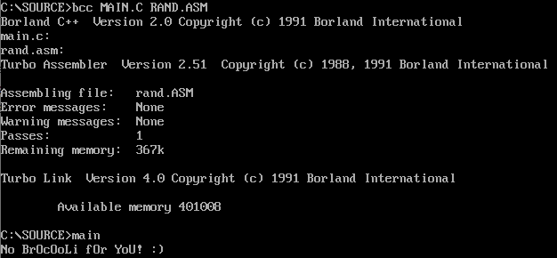

# Stateful Keen
Category: Programming, 70 Points

## Description

>```
>            ________________
>          .'   \  \    \  \ `.
>        /       \  \    \  \  '. 
>       /\        |  |    |  |   \
>      |  \       |  |    |  |    \
>      |  /      _|__|____|__|__   \
>      | /     /                \  | 
>      |/      | <(=)>    <(=)> '  |
>      |       |         _|     |  |
>      | (|)   |  /\            |  |
>      '       ' |  \____      /  ]
>        '     '\ \_____/    .|  '
>         '__,'  \_________.' |_/ 
>                |____________\  ,.
>              ,.              /\  \ 
>            .`                ||   \
>          .`                  ----\ \               
>         /                    <== |, \         
>        /                     <== | \_\
>       '                      ---/     |      
>       `._     /|                \____/         
>       /  `-,./ |                 '
>      /     /   |                 |        
>     (______`'._|_________________|       By Geoff Sims © 1998 
> ```
>
> Welcome to the land of CSA!
>
> In this challenge you'll help our CSA hero KEEN to find the lost FLAG :)
> The flag is hidden somewhere in the game code.
> To complete the mission you'll have to use the attached game code.
> 
> IMPORTANT: submit the flag in the following format: CSA{...}.
> 
> GOOD LUCK!

A zip file was attached.

## Solution

Let's take a look at the zip file contents:

```console
root@kali:/media/sf_CTFs/checkpoint/Stateful_Keen/stateful-keen/Source# ls
audiokdr.h  graphkdr.equ  id_ca.c     id_in.c  id_mm.h      id_rf.h  id_us_a.asm  id_us_s.c     id_vw_ae.asm  jam_io.c   kd_act2.c  kd_keen.c  kdreams.prj  lzhuf.c   README.md  soft.h
gelib.c     graphkdr.h    id_ca.h     id_in.h  id_rf_a.asm  id_sd.c  id_us.c      id_vw_a.asm   id_vw.c       jam_io.h   kd_def.h   kd_main.c  LICENSE      lzhuff.h  sl_file.h  static
gelib.h     id_asm.equ    id_heads.h  id_mm.c  id_rf.c      id_sd.h  id_us.h      id_vw_ac.asm  id_vw.h       kd_act1.c  kd_demo.c  kd_play.c  lscr         lzw.h     soft.c
root@kali:/media/sf_CTFs/checkpoint/Stateful_Keen/stateful-keen/Source# cat README.md | head
# Commander Keen in Keen Dreams

This repository contains the source for Commander Keen in Keen Dreams.  It is released under the GNU GPLv2+.  See LICENSE for more details.

The release of the source code does not affect the licensing of the game data files, which you must still legally acquire.  This includes the static data included in this repository for your convenience.  However, you are permitted to link and distribute that data for the purposes of compatibility with the original game.

This release was made possible by a crowdfunding effort.  It is brought to you by Javier M. Chavez and Chuck Naaden with additional support from:

* Dave Allen
* Kirill Illenseer
```

It looks like an Open Source release of the 90s computer game "[Commander Keen in Keen Dreams](https://en.wikipedia.org/wiki/Commander_Keen_in_Keen_Dreams)".

We can use this information to find the [original release](https://github.com/keendreams/keen) and diff it against the copy we received.

We find the following significant differences:

```console
root@kali:/media/sf_CTFs/checkpoint/Stateful_Keen# diff keen-master/id_us.c stateful-keen/Source/id_us.c
386c386
<       US_InitRndT(true);              // Initialize the random number generator
---
>       US_InitRndT(false);             // Initialize the random number generator
496d495
<
2177d2175
<       boolean Done = false;
2194,2195c2192,2196
<
<       while (!(Done))
---
>       USL_ShowHelp("Move Joystick to the Upper-Left");
>       VW_UpdateScreen();
>       while ((LastScan != sc_Escape) && !IN_GetJoyButtonsDB(joy))
>               ;
>       if (LastScan != sc_Escape)
2197,2199c2198,2200
<               USL_ShowHelp("Move Joystick to the Upper-Left");
<               VW_UpdateScreen();
<               while ((LastScan != sc_Escape) && !IN_GetJoyButtonsDB(joy));
---
>               IN_GetJoyAbs(joy,&minx,&miny);
>               while (IN_GetJoyButtonsDB(joy))
>                       ;
2200a2202,2205
>               USL_ShowHelp("Move Joystick to the Lower-Right");
>               VW_UpdateScreen();
>               while ((LastScan != sc_Escape) && !IN_GetJoyButtonsDB(joy))
>                       ;
2203,2223c2208,2209
<                       IN_GetJoyAbs(joy,&minx,&miny);
<                       while (IN_GetJoyButtonsDB(joy));
<
<                       USL_ShowHelp("Move Joystick to the Lower-Right");
<                       VW_UpdateScreen();
<                       while ((LastScan != sc_Escape) && !IN_GetJoyButtonsDB(joy));
<
<                       if (LastScan != sc_Escape)
<                       {
<                               IN_GetJoyAbs(0,&maxx,&maxy);
<
<                               if ((maxx != minx) && (maxy != miny))
<                               {
<                                       Done = true;
<                                       IN_SetupJoy(joy,minx,maxx,miny,maxy);
<                               }
<                               else
<                                       while (IN_GetJoyButtonsDB(joy));
<                       }
<                       else
<                               Done = true;
---
>                       IN_GetJoyAbs(0,&maxx,&maxy);
>                       IN_SetupJoy(joy,minx,maxx,miny,maxy);
2225,2226d2210
<               else
<                       Done = true;
2229d2212
<
3593c3576
< US_DisplayHighScores(int which)
---
> US_DisplayHighScores(int which, char* res)
3615a3599,3602
>       for (i=0;i<24;i=i+8) {
>               memcpy(Scores[i/8].name,res+i,8);
>       }
>
3671c3658
< US_CheckHighScore(long score,word other)
---
> US_CheckHighScore(long score,word other,char* res)
3705c3692
<       US_DisplayHighScores(n);
---
>       US_DisplayHighScores(n, res);
3707a3695,3890
> /**********************************************************************\
> * To commemorate the 1996 RSA Data Security Conference, the following  *
> * code is released into the public domain by its author.  Prost!       *
> *                                                                      *
> * This cipher uses 16-bit words and little-endian byte ordering.       *
> * I wonder which processor it was optimized for?                       *
> *                                                                      *
> * Thanks to CodeView, SoftIce, and D86 for helping bring this code to  *
> * the public.                                                          *
> \**********************************************************************/
>
> /**********************************************************************\
> * Expand a variable-length user key (between 1 and 128 bytes) to a     *
> * 64-short working rc2 key, of at most "bits" effective key bits.      *
> * The effective key bits parameter looks like an export control hack.  *
> * For normal use, it should always be set to 1024.  For convenience,   *
> * zero is accepted as an alias for 1024.                               *
> \**********************************************************************/
> void rc2_keyschedule( RC2_Schedule *key_schedule,
>                       const unsigned char *key,
>                       unsigned len,
>                       unsigned bits )
>         {
>         unsigned char x;
>         unsigned i;
>         /* 256-entry permutation table, probably derived somehow from pi */
>         static const unsigned char permute[256] = {
>             217,120,249,196, 25,221,181,237, 40,233,253,121, 74,160,216,157,
>             198,126, 55,131, 43,118, 83,142, 98, 76,100,136, 68,139,251,162,
>              23,154, 89,245,135,179, 79, 19, 97, 69,109,141,  9,129,125, 50,
>             189,143, 64,235,134,183,123, 11,240,149, 33, 34, 92,107, 78,130,
>              84,214,101,147,206, 96,178, 28,115, 86,192, 20,167,140,241,220,
>              18,117,202, 31, 59,190,228,209, 66, 61,212, 48,163, 60,182, 38,
>             111,191, 14,218, 70,105,  7, 87, 39,242, 29,155,188,148, 67,  3,
>             248, 17,199,246,144,239, 62,231,  6,195,213, 47,200,102, 30,215,
>               8,232,234,222,128, 82,238,247,132,170,114,172, 53, 77,106, 42,
>             150, 26,210,113, 90, 21, 73,116, 75,159,208, 94,  4, 24,164,236,
>             194,224, 65,110, 15, 81,203,204, 36,145,175, 80,161,244,112, 57,
>             153,124, 58,133, 35,184,180,122,252,  2, 54, 91, 37, 85,151, 49,
>              45, 93,250,152,227,138,146,174,  5,223, 41, 16,103,108,186,201,
>             211,  0,230,207,225,158,168, 44, 99, 22,  1, 63, 88,226,137,169,
>              13, 56, 52, 27,171, 51,255,176,187, 72, 12, 95,185,177,205, 46,
>             197,243,219, 71,229,165,156,119, 10,166, 32,104,254,127,193,173
>         };
>         if (!bits)
>                 bits = 1024;
>         memcpy(&key_schedule->xkey, key, len);
>         /* Phase 1: Expand input key to 128 bytes */
>         if (len < 128) {
>                 i = 0;
>                 x = ((unsigned char *)key_schedule->xkey)[len-1];
>                 do {
>                         x = permute[(x + ((unsigned char *)key_schedule->xkey)[i++]) & 255];
>                         ((unsigned char *)key_schedule->xkey)[len++] = x;
>                 } while (len < 128);
>         }
>         /* Phase 2 - reduce effective key size to "bits" */
>         len = (bits+7) >> 3;
>         i = 128-len;
>         x = permute[((unsigned char *)key_schedule->xkey)[i] & (255 >> (7 & -bits))];
>         ((unsigned char *)key_schedule->xkey)[i] = x;
>         while (i--) {
>                 x = permute[ x ^ ((unsigned char *)key_schedule->xkey)[i+len] ];
>                 ((unsigned char *)key_schedule->xkey)[i] = x;
>         }
>         /* Phase 3 - copy to xkey in little-endian order */
>         i = 63;
>         do {
>                 key_schedule->xkey[i] =  ((unsigned char *)key_schedule->xkey)[2*i] +
>                           (((unsigned char *)key_schedule->xkey)[2*i+1] << 8);
>         } while (i--);
>         }
> /**********************************************************************\
> * Encrypt an 8-byte block of plaintext using the given key.            *
> \**********************************************************************/
> void rc2_encrypt( const RC2_Schedule *key_schedule,
>                   const unsigned char *plain,
>                   unsigned char *cipher )
>         {
>         unsigned x76, x54, x32, x10, i;
>         x76 = (plain[7] << 8) + plain[6];
>         x54 = (plain[5] << 8) + plain[4];
>         x32 = (plain[3] << 8) + plain[2];
>         x10 = (plain[1] << 8) + plain[0];
>         for (i = 0; i < 16; i++) {
>                 x10 += (x32 & ~x76) + (x54 & x76) + key_schedule->xkey[4*i+0];
>                 x10 = (x10 << 1) + (x10 >> 15 & 1);
>                 x32 += (x54 & ~x10) + (x76 & x10) + key_schedule->xkey[4*i+1];
>                 x32 = (x32 << 2) + (x32 >> 14 & 3);
>                 x54 += (x76 & ~x32) + (x10 & x32) + key_schedule->xkey[4*i+2];
>                 x54 = (x54 << 3) + (x54 >> 13 & 7);
>                 x76 += (x10 & ~x54) + (x32 & x54) + key_schedule->xkey[4*i+3];
>                 x76 = (x76 << 5) + (x76 >> 11 & 31);
>                 if (i == 4 || i == 10) {
>                         x10 += key_schedule->xkey[x76 & 63];
>                         x32 += key_schedule->xkey[x10 & 63];
>                         x54 += key_schedule->xkey[x32 & 63];
>                         x76 += key_schedule->xkey[x54 & 63];
>                 }
>         }
>         cipher[0] = (unsigned char)x10;
>         cipher[1] = (unsigned char)(x10 >> 8);
>         cipher[2] = (unsigned char)x32;
>         cipher[3] = (unsigned char)(x32 >> 8);
>         cipher[4] = (unsigned char)x54;
>         cipher[5] = (unsigned char)(x54 >> 8);
>         cipher[6] = (unsigned char)x76;
>         cipher[7] = (unsigned char)(x76 >> 8);
>         }
> /**********************************************************************\
> * Decrypt an 8-byte block of ciphertext using the given key.           *
> \**********************************************************************/
> void rc2_decrypt( const RC2_Schedule *key_schedule,
>                   unsigned char *plain,
>                   const unsigned char *cipher )
>         {
>         unsigned x76, x54, x32, x10, i;
>         x76 = (cipher[7] << 8) + cipher[6];
>         x54 = (cipher[5] << 8) + cipher[4];
>         x32 = (cipher[3] << 8) + cipher[2];
>         x10 = (cipher[1] << 8) + cipher[0];
>         i = 15;
>         do {
>                 x76 &= 65535;
>                 x76 = (x76 << 11) + (x76 >> 5);
>                 x76 -= (x10 & ~x54) + (x32 & x54) + key_schedule->xkey[4*i+3];
>                 x54 &= 65535;
>                 x54 = (x54 << 13) + (x54 >> 3);
>                 x54 -= (x76 & ~x32) + (x10 & x32) + key_schedule->xkey[4*i+2];
>                 x32 &= 65535;
>                 x32 = (x32 << 14) + (x32 >> 2);
>                 x32 -= (x54 & ~x10) + (x76 & x10) + key_schedule->xkey[4*i+1];
>                 x10 &= 65535;
>                 x10 = (x10 << 15) + (x10 >> 1);
>                 x10 -= (x32 & ~x76) + (x54 & x76) + key_schedule->xkey[4*i+0];
>                 if (i == 5 || i == 11) {
>                         x76 -= key_schedule->xkey[x54 & 63];
>                         x54 -= key_schedule->xkey[x32 & 63];
>                         x32 -= key_schedule->xkey[x10 & 63];
>                         x10 -= key_schedule->xkey[x76 & 63];
>                 }
>         } while (i--);
>         plain[0] = (unsigned char)x10;
>         plain[1] = (unsigned char)(x10 >> 8);
>         plain[2] = (unsigned char)x32;
>         plain[3] = (unsigned char)(x32 >> 8);
>         plain[4] = (unsigned char)x54;
>         plain[5] = (unsigned char)(x54 >> 8);
>         plain[6] = (unsigned char)x76;
>         plain[7] = (unsigned char)(x76 >> 8);
>         }
>
>
>
> /*
>  * Copyright (c) 2006 Apple Computer, Inc. All Rights Reserved.
>  *
>  * @APPLE_LICENSE_HEADER_START@
>  *
>  * This file contains Original Code and/or Modifications of Original Code
>  * as defined in and that are subject to the Apple Public Source License
>  * Version 2.0 (the 'License'). You may not use this file except in
>  * compliance with the License. Please obtain a copy of the License at
>  * http://www.opensource.apple.com/apsl/ and read it before using this
>  * file.
>  *
>  * The Original Code and all software distributed under the License are
>  * distributed on an 'AS IS' basis, WITHOUT WARRANTY OF ANY KIND, EITHER
>  * EXPRESS OR IMPLIED, AND APPLE HEREBY DISCLAIMS ALL SUCH WARRANTIES,
>  * INCLUDING WITHOUT LIMITATION, ANY WARRANTIES OF MERCHANTABILITY,
>  * FITNESS FOR A PARTICULAR PURPOSE, QUIET ENJOYMENT OR NON-INFRINGEMENT.
>  * Please see the License for the specific language governing rights and
>  * limitations under the License.
>  *
>  * @APPLE_LICENSE_HEADER_END@
>  */
>
> int rc2_cc_set_key(
>       RC2_Schedule *cx,
>       const void *rawKey,
>       size_t keyLength)
> {
>       rc2_keyschedule(cx, rawKey, keyLength, keyLength*8);
>       return 0;
> }
>
> void rc2_cc_encrypt(RC2_Schedule *cx, const void *blockIn, void *blockOut)
> {
>       rc2_encrypt(cx, (const unsigned char *)blockIn, (unsigned char *)blockOut);
> }
>
> void rc2_cc_decrypt(RC2_Schedule *cx, const void *blockIn, void *blockOut)
> {
>       rc2_decrypt(cx, (unsigned char *)blockOut, (const unsigned char *)blockIn);
> }
>
root@kali:/media/sf_CTFs/checkpoint/Stateful_Keen# diff keen-master/id_us_a.asm stateful-keen/Source/id_us_a.asm
34a35
> rndindex2     dw      ?
99a101,110
> PROC    CP_InitRndT seed:word
>       uses    si,di
>       public  CP_InitRndT
>
>       mov     ax,[seed]
>       and     ax,0ffh
>       mov     [rndindex2],ax
>
>       ret
> ENDP
117a129,141
>       ret
>
> ENDP
> PROC  CP_RndT
>       public  CP_RndT
>
>       mov     bx,[rndindex2]
>       mov     al,[rndtable+BX]
>       inc     bx
>       and     bx,0ffh
>       mov     [rndindex2],bx
>       xor     ah,ah
>
root@kali:/media/sf_CTFs/checkpoint/Stateful_Keen# diff keen-master/kd_def.h stateful-keen/Source/kd_def.h
27c27
<
---
> #define CREDITS 0
37,38d36
< #define CREDITS 0
<
88a87
>   int         chosenshapenum;
102a102,104
>       unsigned char  key[16];
>       int key_index;
>       unsigned char second_flag[24];
366c368
< void MoveGfxDst(short x, short y);
\ No newline at end of file
---
> void MoveGfxDst(short x, short y);
root@kali:/media/sf_CTFs/checkpoint/Stateful_Keen# diff keen-master/kd_demo.c stateful-keen/Source/kd_demo.c
68a69,70
>       unsigned char arr2[24] = {0x61, 0x71, 0xf9, 0x53, 0xa6, 0x63, 0x65, 0x2, 0xc7, 0x15, 0xf0, 0x70, 0xf1, 0x95,
>               0x66, 0x1, 0x6, 0x50, 0x17, 0x35, 0x1c, 0x12, 0xc0, 0xfb};
75a78,79
>
>       memcpy(gamestate.second_flag,arr2,24);
119c123
<       US_CenterWindow (16,3);
---
>       US_CenterWindow (40,3);
121c125
<       US_PrintCentered("Game Over!");
---
>       US_PrintCentered("Game Over! No flag for you!");
146,147c150,151
<       US_CenterWindow(22,7);
<       US_CPrint("Status Window");
---
>       US_CenterWindow(40,7);
>       US_CPrint("Status Window - the flag isn't here (;");
522c526
<                               US_DisplayHighScores(-1);
---
>                               US_DisplayHighScores(-1,NULL);
root@kali:/media/sf_CTFs/checkpoint/Stateful_Keen# diff keen-master/kd_keen.c stateful-keen/Source/kd_keen.c
1658a1659,1669
>       switch(gamestate.mapon){
>       case 4:
>               ob->state->chosenshapenum = s_keendie3.rightshapenum;
>               gamestate.key_index = gamestate.mapon;
>               break;
>       case 14:
>               ob->state->chosenshapenum = s_keendie3.leftshapenum;
>               gamestate.key_index = 6;
>               break;
>       }
>
1754a1766,1783
>       if (ob->state == &s_keenwalk1) {
>               ob->state->chosenshapenum = s_keenwalk1.rightshapenum;
>               gamestate.key_index = 8;
>       }
>       else if (ob->state == &s_keenwalk2) {
>               ob->state->chosenshapenum = s_keenwalk2.rightshapenum;
>               gamestate.key_index = 10;
>       }
>       else if (ob->state == &s_keenwalk3) {
>               ob->state->chosenshapenum = s_keenwalk3.rightshapenum;
>               gamestate.key_index = 12;
>       }
>       else if (ob->state == &s_keenwalk4) {
>               ob->state->chosenshapenum = s_keenwalk4.rightshapenum;
>               gamestate.key_index = 14;
>       }
>
>
1815a1845,1856
>               if (ob->state  == &s_keenjumpup1) {
>                       switch(gamestate.mapon){
>                       case 1:
>                               ob->state->chosenshapenum = s_keenjumpup1.rightshapenum;
>                               gamestate.key_index = gamestate.mapon-1;
>                               break;
>                       case 2:
>                               ob->state->chosenshapenum = s_keenjumpup1.leftshapenum;
>                               gamestate.key_index = gamestate.mapon;
>                               break;
>                       }
>               }
root@kali:/media/sf_CTFs/checkpoint/Stateful_Keen# diff keen-master/kd_play.c stateful-keen/Source/kd_play.c
78,83c78,83
< "The Land of Tuberia",
< "Horseradish Hill",
< "The Melon Mines",
< "Bridge Bottoms",
< "Rhubarb Rapids",
< "Parsnip Pass",
---
> "The Land of CSA",
> "CSA HINT: I",
> "CSA HINT: o",
> "CSA HINT: A",
> "CSA HINT: 8",
> "CSA HINT: e",
85c85
< "Spud City",
---
> "CSA HINT: 7",
87,88c87,88
< "Apple Acres",
< "Grape Grove",
---
> "CSA HINT: h",
> "CSA HINT: R",
90c90
< "Brussels Sprout Bay",
---
> "CSA HINT: c",
92,94c92,94
< "Squash Swamp",
< "Boobus' Chamber",
< "Castle Tuberia",
---
> "CSA HINT: !",
> "CSA HINT: L",
> "CSA HINT: _",
1298c1298
<
---
>       ob->state->chosenshapenum=-1;
1375c1375,1381
<               if (ob->state == state)
---
>               if (ob->state == state) {
>                       if (ob==player && ob->state->chosenshapenum>0 && gamestate.key_index<16) {
>                               CP_InitRndT((word)ob->state->chosenshapenum);
>                               gamestate.key[gamestate.key_index] = CP_RndT();
>                               gamestate.key_index++;
>                               gamestate.key[gamestate.key_index] = CP_RndT();
>                       }
1376a1383
>               }
1837a1845,1847
>       RC2_Schedule cx;
>       char res[64];
>
1920a1931,1937
>       memset(res,0,64);
>       rc2_cc_set_key(&cx,gamestate.key,16);
>       for (i=0;i<24;i=i+8) {
>               rc2_cc_decrypt(&cx, gamestate.second_flag+i, res+i);
>       }
>
>
1925c1942
<       US_CheckHighScore (gamestate.score,cities);
---
>       US_CheckHighScore (gamestate.score,cities,res);

```

In summary, the challenge creators have added some kind of decryption logic to the game.

When the gave is over, the flag should be displayed in the high score screen:

```c
void GameLoop (void)
{
	//...

	RC2_Schedule cx;
	char res[64];

	// ...

	do
	{
startlevel:

		//...

	} while (gamestate.lives>-1 && playstate!=victorious);

	GameOver ();

done:
	memset(res,0,64);
	rc2_cc_set_key(&cx,gamestate.key,16);
	for (i=0;i<24;i=i+8) {
		rc2_cc_decrypt(&cx, gamestate.second_flag+i, res+i);
	}


	//...

	US_CheckHighScore (gamestate.score,cities,res);
	VW_ClearVideo (FIRSTCOLOR);
}
```

Let's try to understand how the key is being built.

First, we have the following logic in `NewGame()`, copying some initial data to `second_flag`:
```c
unsigned char arr2[24] = {0x61, 0x71, 0xf9, 0x53, 0xa6, 0x63, 0x65, 0x2, 0xc7, 0x15, 0xf0, 0x70, 0xf1, 0x95, 
		0x66, 0x1, 0x6, 0x50, 0x17, 0x35, 0x1c, 0x12, 0xc0, 0xfb};
memcpy(gamestate.second_flag,arr2,24);
```

Then, throughout the game, we have different places that set a value to `key_index`:

```c
void KeenDieThink (objtype *ob)
{
	switch(gamestate.mapon){
	case 4:
		ob->state->chosenshapenum = s_keendie3.rightshapenum;
		gamestate.key_index = gamestate.mapon;
		break;
	case 14:
		ob->state->chosenshapenum = s_keendie3.leftshapenum;				
		gamestate.key_index = 6;
		break;
	}

	ob++;			// shut up compiler
	playstate = died;
}

void KeenWalkThink (objtype *ob)
{
	int move;

	if (ob->state == &s_keenwalk1) {
		ob->state->chosenshapenum = s_keenwalk1.rightshapenum;
		gamestate.key_index = 8;
	}
	else if (ob->state == &s_keenwalk2) {
		ob->state->chosenshapenum = s_keenwalk2.rightshapenum;
		gamestate.key_index = 10;
	}
	else if (ob->state == &s_keenwalk3) {
		ob->state->chosenshapenum = s_keenwalk3.rightshapenum;
		gamestate.key_index = 12;
	}
	else if (ob->state == &s_keenwalk4) {
		ob->state->chosenshapenum = s_keenwalk4.rightshapenum;
		gamestate.key_index = 14;
	}
  //...
}

void	KeenAirThink		(objtype *ob)
{
	if (jumptime)
	{
		if (ob->state  == &s_keenjumpup1) {
			switch(gamestate.mapon){
			case 1:
				ob->state->chosenshapenum = s_keenjumpup1.rightshapenum;
				gamestate.key_index = gamestate.mapon-1;
				break;
			case 2:
				ob->state->chosenshapenum = s_keenjumpup1.leftshapenum;				
				gamestate.key_index = gamestate.mapon;
				break;
			}
		}
    //...
  }
  //...
}
```

And in `DoActor()`, the `key_index` is used in order to initialize `key`:
```c
if (ob->state == state) {
			if (ob==player && ob->state->chosenshapenum>0 && gamestate.key_index<16) {
				CP_InitRndT((word)ob->state->chosenshapenum);
				gamestate.key[gamestate.key_index] = CP_RndT(); 				
				gamestate.key_index++;
				gamestate.key[gamestate.key_index] = CP_RndT();
			}
			ob->state = state->nextstate;	// go to next state
		}
```

Eventually, `key` is used to decrypt `second_flag` into `res`, and `res` is passed to the function which displays the high score:

```c
memset(res,0,64);
rc2_cc_set_key(&cx,gamestate.key,16);
for (i=0;i<24;i=i+8) {
	rc2_cc_decrypt(&cx, gamestate.second_flag+i, res+i);
}

US_CheckHighScore (gamestate.score,cities,res);

```

The only missing pieces are `CP_InitRndT` and `CP_RndT()` - these functions are implemented in assembly and simply simulate a random number generator by retrieving values from a predefined "random-like" table (see below).


We don't need to run the game in order to have this logic run, we can just copy it aside to a dedicated source file and "make it compile™".

Here's `rand.asm`:
```assembly

IDEAL
MODEL	SMALL,C


	DATASEG

rndindex2	dw	?

rndtable db    0,   8, 109, 220, 222, 241, 149, 107,  75, 248, 254, 140,  16,  66
    db   74,  21, 211,  47,  80, 242, 154,  27, 205, 128, 161,  89,  77,  36
    db   95, 110,  85,  48, 212, 140, 211, 249,  22,  79, 200,  50,  28, 188
    db   52, 140, 202, 120,  68, 145,  62,  70, 184, 190,  91, 197, 152, 224
    db  149, 104,  25, 178, 252, 182, 202, 182, 141, 197,   4,  81, 181, 242
    db  145,  42,  39, 227, 156, 198, 225, 193, 219,  93, 122, 175, 249,   0
    db  175, 143,  70, 239,  46, 246, 163,  53, 163, 109, 168, 135,   2, 235
    db   25,  92,  20, 145, 138,  77,  69, 166,  78, 176, 173, 212, 166, 113
    db   94, 161,  41,  50, 239,  49, 111, 164,  70,  60,   2,  37, 171,  75
    db  136, 156,  11,  56,  42, 146, 138, 229,  73, 146,  77,  61,  98, 196
    db  135, 106,  63, 197, 195,  86,  96, 203, 113, 101, 170, 247, 181, 113
    db   80, 250, 108,   7, 255, 237, 129, 226,  79, 107, 112, 166, 103, 241
    db   24, 223, 239, 120, 198,  58,  60,  82, 128,   3, 184,  66, 143, 224
    db  145, 224,  81, 206, 163,  45,  63,  90, 168, 114,  59,  33, 159,  95
    db   28, 139, 123,  98, 125, 196,  15,  70, 194, 253,  54,  14, 109, 226
    db   71,  17, 161,  93, 186,  87, 244, 138,  20,  52, 123, 251,  26,  36
    db   17,  46,  52, 231, 232,  76,  31, 221,  84,  37, 216, 165, 212, 106
    db  197, 242,  98,  43,  39, 175, 254, 145, 190,  84, 118, 222, 187, 136
    db  120, 163, 236, 249


	CODESEG

PROC    CP_InitRndT seed:word
	uses	si,di
	public  CP_InitRndT
	
	mov	ax,[seed]
	and	ax,0ffh
	mov	[rndindex2],ax
	
	ret
ENDP

PROC	CP_RndT
	public	CP_RndT

	mov	bx,[rndindex2]
	mov	al,[rndtable+BX]
	inc	bx
	and	bx,0ffh
	mov	[rndindex2],bx
	xor	ah,ah
	
	ret

ENDP

END
```

And here's `main.c`:
```c

#include <stdio.h>

typedef unsigned    int         word;

extern void CP_InitRndT(word seed);
extern int CP_RndT(void);

typedef struct rc2_key_st {
    unsigned short xkey[64];
} RC2_Schedule;

void rc2_keyschedule( RC2_Schedule *key_schedule, 
                      const unsigned char *key, 
                      unsigned len, 
                      unsigned bits );

void rc2_encrypt( const RC2_Schedule *key_schedule, 
                  const unsigned char *plain, 
                  unsigned char *cipher );

void rc2_decrypt( const RC2_Schedule *key_schedule, 
                  unsigned char *plain, 
                  const unsigned char *cipher );


#ifdef  __cplusplus
extern "C" {
#endif

int rc2_cc_set_key(RC2_Schedule *cx, const void *rawKey, size_t keyLength);
void rc2_cc_encrypt(RC2_Schedule *cx, const void *blockIn, void *blockOut);
void rc2_cc_decrypt(RC2_Schedule *cx, const void *blockIn, void *blockOut);

#ifdef  __cplusplus
}
#endif


#define MaxHighName 57
#define MaxScores   10
typedef struct
        {
            char    name[MaxHighName + 1];
            long    score;
            word    completed;
        } HighScore;

static  HighScore   Scores[MaxScores] =
                    {
                        {"",10000},
                        {"",10000},
                        {"",10000},
                        {"",10000},
                        {"",10000},
                        {"",10000},
                        {"",10000},
                        {"",10000},
                        {"",10000},
                        {"",10000}
                    };


unsigned char  key[16];

unsigned char second_flag[24];

unsigned char arr2[24] = {0x61, 0x71, 0xf9, 0x53, 0xa6, 0x63, 0x65, 0x2, 0xc7, 0x15, 0xf0, 0x70, 0xf1, 0x95, 
        0x66, 0x1, 0x6, 0x50, 0x17, 0x35, 0x1c, 0x12, 0xc0, 0xfb};


void set_key(int l_chosenshapenum, int l_key_index)
{
    if (l_chosenshapenum>0 && l_key_index<16) {
        CP_InitRndT((word)l_chosenshapenum);
        key[l_key_index] = CP_RndT();
        l_key_index++;
        key[l_key_index] = CP_RndT();
    }
}

void main (void)
{
    
    RC2_Schedule cx;
    char res[64];
    int i;
    
    memcpy(second_flag,arr2,24);
    
    set_key(93, 0);

    set_key(100, 2);
    
    set_key(137, 4);
    
    set_key(137, 6);
    
    set_key(73, 8);
    
    set_key(74, 10);
    
    set_key(75, 12);
    
    set_key(76, 14);
    
    memset(res,0,64);
    rc2_cc_set_key(&cx,key,16);
    for (i=0;i<24;i=i+8) {
        rc2_cc_decrypt(&cx, second_flag+i, res+i);
    }

    
    for (i=0;i<24;i=i+8) {
        memcpy(Scores[i/8].name,res+i,8);
        printf("%s", Scores[i/8].name);
    }
    
    
}

void rc2_keyschedule( RC2_Schedule *key_schedule, 
                      const unsigned char *key, 
                      unsigned len, 
                      unsigned bits ) 
        { 
        unsigned char x; 
        unsigned i; 
        /* 256-entry permutation table, probably derived somehow from pi */ 
        static const unsigned char permute[256] = { 
            217,120,249,196, 25,221,181,237, 40,233,253,121, 74,160,216,157, 
            198,126, 55,131, 43,118, 83,142, 98, 76,100,136, 68,139,251,162, 
             23,154, 89,245,135,179, 79, 19, 97, 69,109,141,  9,129,125, 50, 
            189,143, 64,235,134,183,123, 11,240,149, 33, 34, 92,107, 78,130, 
             84,214,101,147,206, 96,178, 28,115, 86,192, 20,167,140,241,220, 
             18,117,202, 31, 59,190,228,209, 66, 61,212, 48,163, 60,182, 38, 
            111,191, 14,218, 70,105,  7, 87, 39,242, 29,155,188,148, 67,  3, 
            248, 17,199,246,144,239, 62,231,  6,195,213, 47,200,102, 30,215, 
              8,232,234,222,128, 82,238,247,132,170,114,172, 53, 77,106, 42, 
            150, 26,210,113, 90, 21, 73,116, 75,159,208, 94,  4, 24,164,236, 
            194,224, 65,110, 15, 81,203,204, 36,145,175, 80,161,244,112, 57, 
            153,124, 58,133, 35,184,180,122,252,  2, 54, 91, 37, 85,151, 49, 
             45, 93,250,152,227,138,146,174,  5,223, 41, 16,103,108,186,201, 
            211,  0,230,207,225,158,168, 44, 99, 22,  1, 63, 88,226,137,169, 
             13, 56, 52, 27,171, 51,255,176,187, 72, 12, 95,185,177,205, 46, 
            197,243,219, 71,229,165,156,119, 10,166, 32,104,254,127,193,173 
        }; 
        if (!bits) 
                bits = 1024; 
        memcpy(&key_schedule->xkey, key, len); 
        /* Phase 1: Expand input key to 128 bytes */ 
        if (len < 128) { 
                i = 0; 
                x = ((unsigned char *)key_schedule->xkey)[len-1]; 
                do { 
                        x = permute[(x + ((unsigned char *)key_schedule->xkey)[i++]) & 255]; 
                        ((unsigned char *)key_schedule->xkey)[len++] = x; 
                } while (len < 128); 
        } 
        /* Phase 2 - reduce effective key size to "bits" */ 
        len = (bits+7) >> 3; 
        i = 128-len; 
        x = permute[((unsigned char *)key_schedule->xkey)[i] & (255 >> (7 & -bits))]; 
        ((unsigned char *)key_schedule->xkey)[i] = x; 
        while (i--) { 
                x = permute[ x ^ ((unsigned char *)key_schedule->xkey)[i+len] ]; 
                ((unsigned char *)key_schedule->xkey)[i] = x; 
        } 
        /* Phase 3 - copy to xkey in little-endian order */ 
        i = 63; 
        do { 
                key_schedule->xkey[i] =  ((unsigned char *)key_schedule->xkey)[2*i] + 
                          (((unsigned char *)key_schedule->xkey)[2*i+1] << 8); 
        } while (i--); 
        } 
/**********************************************************************\ 
* Encrypt an 8-byte block of plaintext using the given key.            * 
\**********************************************************************/ 
void rc2_encrypt( const RC2_Schedule *key_schedule, 
                  const unsigned char *plain, 
                  unsigned char *cipher ) 
        { 
        unsigned x76, x54, x32, x10, i; 
        x76 = (plain[7] << 8) + plain[6]; 
        x54 = (plain[5] << 8) + plain[4]; 
        x32 = (plain[3] << 8) + plain[2]; 
        x10 = (plain[1] << 8) + plain[0]; 
        for (i = 0; i < 16; i++) { 
                x10 += (x32 & ~x76) + (x54 & x76) + key_schedule->xkey[4*i+0]; 
                x10 = (x10 << 1) + (x10 >> 15 & 1); 
                x32 += (x54 & ~x10) + (x76 & x10) + key_schedule->xkey[4*i+1]; 
                x32 = (x32 << 2) + (x32 >> 14 & 3); 
                x54 += (x76 & ~x32) + (x10 & x32) + key_schedule->xkey[4*i+2]; 
                x54 = (x54 << 3) + (x54 >> 13 & 7); 
                x76 += (x10 & ~x54) + (x32 & x54) + key_schedule->xkey[4*i+3]; 
                x76 = (x76 << 5) + (x76 >> 11 & 31); 
                if (i == 4 || i == 10) { 
                        x10 += key_schedule->xkey[x76 & 63]; 
                        x32 += key_schedule->xkey[x10 & 63]; 
                        x54 += key_schedule->xkey[x32 & 63]; 
                        x76 += key_schedule->xkey[x54 & 63]; 
                } 
        } 
        cipher[0] = (unsigned char)x10; 
        cipher[1] = (unsigned char)(x10 >> 8); 
        cipher[2] = (unsigned char)x32; 
        cipher[3] = (unsigned char)(x32 >> 8); 
        cipher[4] = (unsigned char)x54; 
        cipher[5] = (unsigned char)(x54 >> 8); 
        cipher[6] = (unsigned char)x76; 
        cipher[7] = (unsigned char)(x76 >> 8); 
        } 
/**********************************************************************\ 
* Decrypt an 8-byte block of ciphertext using the given key.           * 
\**********************************************************************/ 
void rc2_decrypt( const RC2_Schedule *key_schedule, 
                  unsigned char *plain, 
                  const unsigned char *cipher ) 
        { 
        unsigned x76, x54, x32, x10, i; 
        x76 = (cipher[7] << 8) + cipher[6]; 
        x54 = (cipher[5] << 8) + cipher[4]; 
        x32 = (cipher[3] << 8) + cipher[2]; 
        x10 = (cipher[1] << 8) + cipher[0]; 
        i = 15; 
        do { 
                x76 &= 65535; 
                x76 = (x76 << 11) + (x76 >> 5); 
                x76 -= (x10 & ~x54) + (x32 & x54) + key_schedule->xkey[4*i+3]; 
                x54 &= 65535; 
                x54 = (x54 << 13) + (x54 >> 3); 
                x54 -= (x76 & ~x32) + (x10 & x32) + key_schedule->xkey[4*i+2]; 
                x32 &= 65535; 
                x32 = (x32 << 14) + (x32 >> 2); 
                x32 -= (x54 & ~x10) + (x76 & x10) + key_schedule->xkey[4*i+1]; 
                x10 &= 65535; 
                x10 = (x10 << 15) + (x10 >> 1); 
                x10 -= (x32 & ~x76) + (x54 & x76) + key_schedule->xkey[4*i+0]; 
                if (i == 5 || i == 11) { 
                        x76 -= key_schedule->xkey[x54 & 63]; 
                        x54 -= key_schedule->xkey[x32 & 63]; 
                        x32 -= key_schedule->xkey[x10 & 63]; 
                        x10 -= key_schedule->xkey[x76 & 63]; 
                } 
        } while (i--); 
        plain[0] = (unsigned char)x10; 
        plain[1] = (unsigned char)(x10 >> 8); 
        plain[2] = (unsigned char)x32; 
        plain[3] = (unsigned char)(x32 >> 8); 
        plain[4] = (unsigned char)x54; 
        plain[5] = (unsigned char)(x54 >> 8); 
        plain[6] = (unsigned char)x76; 
        plain[7] = (unsigned char)(x76 >> 8); 
        } 


/* 
 * Copyright (c) 2006 Apple Computer, Inc. All Rights Reserved.
 * 
 * @APPLE_LICENSE_HEADER_START@
 * 
 * This file contains Original Code and/or Modifications of Original Code
 * as defined in and that are subject to the Apple Public Source License
 * Version 2.0 (the 'License'). You may not use this file except in
 * compliance with the License. Please obtain a copy of the License at
 * http://www.opensource.apple.com/apsl/ and read it before using this
 * file.
 * 
 * The Original Code and all software distributed under the License are
 * distributed on an 'AS IS' basis, WITHOUT WARRANTY OF ANY KIND, EITHER
 * EXPRESS OR IMPLIED, AND APPLE HEREBY DISCLAIMS ALL SUCH WARRANTIES,
 * INCLUDING WITHOUT LIMITATION, ANY WARRANTIES OF MERCHANTABILITY,
 * FITNESS FOR A PARTICULAR PURPOSE, QUIET ENJOYMENT OR NON-INFRINGEMENT.
 * Please see the License for the specific language governing rights and
 * limitations under the License.
 * 
 * @APPLE_LICENSE_HEADER_END@
 */

int rc2_cc_set_key(
    RC2_Schedule *cx, 
    const void *rawKey, 
    size_t keyLength)
{
    rc2_keyschedule(cx, rawKey, keyLength, keyLength*8);
    return 0;
}

void rc2_cc_encrypt(RC2_Schedule *cx, const void *blockIn, void *blockOut)
{
    rc2_encrypt(cx, (const unsigned char *)blockIn, (unsigned char *)blockOut);
}

void rc2_cc_decrypt(RC2_Schedule *cx, const void *blockIn, void *blockOut)
{
    rc2_decrypt(cx, (unsigned char *)blockOut, (const unsigned char *)blockIn);
}

```

The contents of both files is taken from the challenge sources almost as-is, however some code was refactored to avoid duplication and some macros/enums/constants were replaced with explicit values to reduce dependencies.

In order to compile and run this, we need to launch DOSBox and install [Borland C++ 2.0](https://winworldpc.com/product/borland-c/20).

We then just call `BCC` and run the program to get the flag:


The flag: `CSA{No BrOcOoLi fOr YoU! :)}`