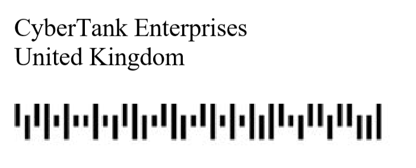

# CyberTank Research
Miscellaneous

A PDF file was attached.

## Author (25 points)

> A secret document of CyberTank has leaked on the Internet, disclosing information on their latest research.
> 
> Can you find out the author?
> 
> Flag format: author name

If we open the file with a PDF reader, we get a 2-page document with no author.

Let's look at the metadata instead:

```console
root@kali:/media/sf_CTFs/hackazon/CyberTank_Research# exiftool cybertank-research.pdf | grep Creator
Creator Tool                    : Adobe Acrobat 7.0
Creator                         : Jake Cyba
```

## Identifier (50 points)

> A secret document of CyberTank has leaked on the Internet, disclosing information on their latest research.
> 
> Can you find out the redacted ID stored in the document?
> 
> Flag format: xxxx/xxx/xxxx

The file contains a redacted part:


However, it is possible to mark this section with the mouse and copy it to a text editor, or user a tool such as `pdftotext`:

```console
root@kali:/media/sf_CTFs/hackazon/CyberTank_Research# pdftotext cybertank-research.pdf
root@kali:/media/sf_CTFs/hackazon/CyberTank_Research# cat cybertank-research.txt | grep ID
CONFIDENTIAL
ID: rd42/tlv/2020
```

## Postal code (75 points)

> A secret document of CyberTank has leaked on the Internet, disclosing information on their latest research.
> 
> Can you find out the postal code of the CyberTank company?
> 
> Flag format: XXXX XXX

The postal code does not appear in plaintext in the document, but the document contains the following barcode:



Using an [online barcode scanner](https://online-barcode-reader.inliteresearch.com/) we find out that this is a [Royal Mail 4-State Customer Code](https://en.wikipedia.org/wiki/RM4SCC) barcode which encodes the following post code:

```
GL1337HF
```

The answer that was accepted is `GL13 37HF`.
