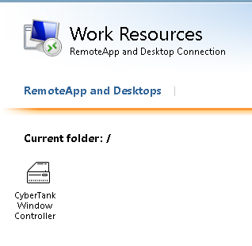
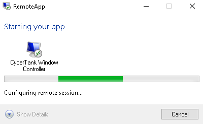
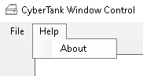
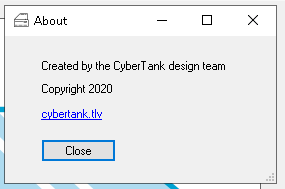
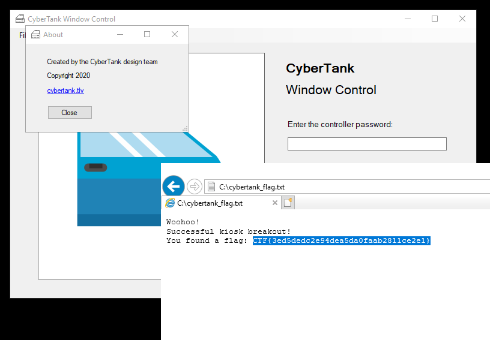

# CyberTank Telework
Network

## Breakout (100 points)

> CyberTank engineers can now work from home! The security team will soon realize shared systems can be hazardous...
> 
> URL: https://52.50.31.19/ - You need to register and then use RDWeb to log in. The flag is in the root directory.
> 
> Flag format: CTF{32-hex}

Visiting the website, we get a form that allows us to sign up to the RDP service and get a username and password:

```
Request remote access
As our valued employee, please request remote access to CyberTank systems here:

Success! Your account has been activated.

Username: CYBERTANK\teleworker54
Password: N+m6@j8
```

We can then login to an RDWeb service using these credentials.

We receive access to:



Which is a `*.rdp` file, used to launce a remote desktop session.


Using this file we can launch a remote application locally via the RDP protocol:




Once the app launces, we actually get the CyberTank Window Controller application from [the reversing challenge](CyberTank_Window_Controller.md) running directly in our OS.

An RDP file is actually a text file:

```
redirectclipboard:i:1
redirectprinters:i:1
redirectcomports:i:0
redirectsmartcards:i:1
devicestoredirect:s:*
drivestoredirect:s:*
redirectdrives:i:1
session bpp:i:32
prompt for credentials on client:i:1
span monitors:i:1
use multimon:i:1
remoteapplicationmode:i:1
server port:i:3389
allow font smoothing:i:1
promptcredentialonce:i:0
videoplaybackmode:i:1
audiocapturemode:i:1
gatewayusagemethod:i:0
gatewayprofileusagemethod:i:1
gatewaycredentialssource:i:0
full address:s:EC2AMAZ-GKADDAA.CYBERTANK.TLV
alternate full address:s:52.50.31.19
alternate shell:s:||CyberTankWindowApp
remoteapplicationprogram:s:||CyberTankWindowApp
remoteapplicationname:s:CyberTank Window Controller
remoteapplicationcmdline:s:
workspace id:s:EC2AMAZ-GKADDAA.cybertank.tlv
use redirection server name:i:1
loadbalanceinfo:s:tsv://MS Terminal Services Plugin.1.CyberTankApps
```

We can modify the different fields and change the intended behavior.

The obvious modification is to change the following fields:
```
remoteapplicationprogram:s:||CyberTankWindowApp
remoteapplicationname:s:CyberTank Window Controller
remoteapplicationcmdline:s:
```

However, trying to launch any other program resulted in an error message that the application is not in the authorized whitelist.

We will change the following setting to `0`:
```
remoteapplicationmode:i:1
```

This setting "determines whether a RemoteApp connection is launched as a RemoteApp session". When it is set to 1, the application is launched as a standalone in the client OS. As 0, a full remote desktop session is launched in the Remote Desktop Connection application.

(Note: I'm not sure that changing `remoteapplicationmode` is needed. This is how I solved it at the time, and the challenge was taken offline after the event).

We launch the session and get the CyberTank Window Controller running. At first sight, there's not much we can do - just open and close the windows. However, notice that there are some extra menus in the application.



Clicking the "About" button pops up the following window:



That's a link right there. And when we click it, we get a good-old-browser running in the remote host. And browsers let up open all kinds of files, even local ones.



The flag: `CTF{3ed5dedc2e94dea5da0faab2811ce2e1}`