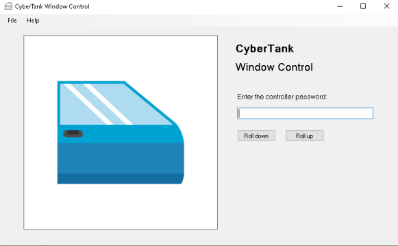

# CyberTank Window Controller
Reversing

## Password (100 points)

> CyberTank has such secure car windows that they require a password! Can you find out what the password is?
> 
> Flag format: CTF{xx_xx_xx}

An executable was attached.

```console
user@CTF_PC:/mnt/e/CTFs/hackazon$ file CyberTankWindowApp.exe
CyberTankWindowApp.exe: PE32 executable (GUI) Intel 80386 Mono/.Net assembly, for MS Windows
```

When we run it, we get a simple application which controls the CyberTank windows:



We need to provide the password.

Since this is a .NET application, we can try to decompile it with `ILSpy`.

Under CyberTankWindowApp (1.0.0.0) -> CyberTankWindowApp -> App we find a method called `CheckPassword`:

```csharp
// CyberTankWindowApp.App
using System.Windows.Forms;

private bool CheckPassword()
{
	if (textBox1.Text != "CTF{" + pt2 + "_" + pt1 + "_" + pt3 + "}")
	{
		MessageBox.Show("Wrong password :(", "CyberTank Window Controller", MessageBoxButtons.OK, MessageBoxIcon.Exclamation);
		return false;
	}
	return true;
}
```

We follow `pt2`, `pt1` and `pt3` to get:
```csharp
private string pt2 = "window";
private string pt1 = "reverse";
private string pt3 = "control";
```

The flag therefore is: `CTF{window_reverse_control}`.