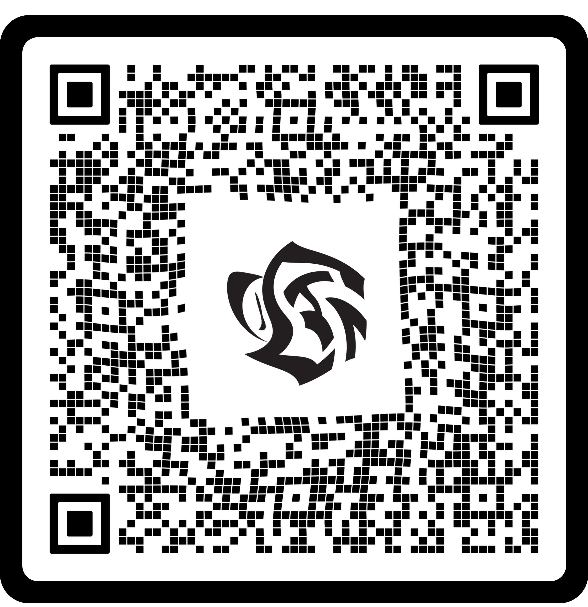
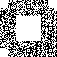
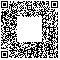

# QR code
Network

## QR recovery (150 points)

> Woops, our graphic designer added some special effects, and now it looks like it's not possible to scan our QR code anymore... Can you recover it?

The following file was provided:


This looks like a QR code for which a twirl effect was applied to. Obviously a QR reader can't read this and we need to reverse the effect.

Without an expensive Photoshop license, one has to resort to less advances image processing software. GIMP is usually the recommended alternative, but it suffers from a highly unintuitive user interface and is really frustrating to use. Some online tools, such as [Photopea](https://www.photopea.com/) are sometimes a better choice.

Using Photopea, it's possible to perform a counter-twirl (Filter -> Distort -> Twirl) and bring the image to the following state:



This is much better, but QR scanners still can't handle it. 

There probably is a programmatic solution, but at this stage I was leading the board with less than 24 hours to go, and I assumed that this challenge will provide a safe distance from the second place (spoiler: It didn't). So I went for the fastest solution I could think of - manually translating the QR code to zeroes and ones:

```
000000000100100001000011010110100110110101100111000000000
000000000100100011111100011001100011000101110001000000000
000000000001011001010010110100001110101110110111000000000
000000001111010110100000101000101011011010110101000000000
000000000111101100001010011111100111001101000001000000000
000000001011010010010100001000100001000101010010000000000
000000001010101010101010101010101010101010101010100000000
000000001010000010010110101000101000000000010101000000000
011000100010100100001000001111110100001011011001101101000
000001010011011101011101100100111110100110010110000011000
010110110101110110110000100011001000001011111011011110000
111111010011011100000001011100010101110101001000000100101
010111100101110010011010101101001100010101011100110100101
010111001110001100000100001111011001011111110001000101011
111110110110110111100110111110101010100011101111001011000
110010011101110000000010010101000100010001000101010101101
111100100110111100000000000000000000000001001001010011001
110110001001111100000000000000000000000000111001101011000
100111110001000100000000000000000000000001101111001011001
110011010111101000000000000000000000000001000101010001011
110000100100110100000000000000000000000001001000000110101
011011010010110000000000000000000000000001111100000011000
001011110111010100000000000000000000000000101010110110001
001001000111111100000000000000000000000001100001010110001
110001101011001100000000000000000000000001001100100001010
100110010000011000000000000000000000000001111001100010010
001111111010101000000000000000000000000001101111111111101
100110001110010000000000000000000000000001010101100010001
100110101001110100000000000000000000000001000100101011101
010010001010000000000000000000000000000001001000100011000
100111111100010000000000000000000000000000101000111111001
010010000100011000000000000000000000000001011100101100101
001100110111110000000000000000000000000001011001001011101
101010011101101100000000000000000000000000111101100101011
010001111110001000000000000000000000000000101001111101000
001011010101111100000000000000000000000001010100011101001
110010110101100000000000000000000000000000011000101111101
010011001001010100000000000000000000000001001011101101011
001100110110110100000000000000000000000001101001111000011
111111010110000100000000000000000000000001000000111101001
001000100100110100000000000000000000000001000111001010101
101111000010100011000010101111010111011110101000101101011
010100100101011001101001111111000001111011100111000101000
110000011011110111000010000010111100110001010101111100001
100010100001110111010100000100110001110110011101101011001
000001000100010001110000100110000011111011010011101100011
101001101100111100100110111000101100111111001111110101011
111110000111010100010001100001110101100010010100110101101
000000100001100010111101001111111101110111010101111111001
000000001111111101011101111000110111100010001111100010000
000000000101000101101011101010111000111011101000101010011
000000000010110000011110001000101101110001000101100010101
000000000011100001100011101111111001100111010101111111011
000000000100010101011101001011101010110010001001100101010
000000001001101010110010101001001010101110101100010100011
000000001110001110000100100011000111110100010100100001011
000000000010011001011000110111100101100110111100111101101
```

With this data, it's possible to write a short script which will translate it to an image:

```python
from PIL import Image
  
limit = 57
img = Image.new(mode = "RGB", size = (limit, limit) )
pixels = img.load()

with open("qr.txt") as f:
    y = 0
    for line in f:
        line = line.rstrip()
        for x, b in enumerate(line):
            if b == "0":
                pixels[x,y] = (255, 255, 255)
            elif b == "1":
                pixels[x,y] = (0, 0, 0)
            else:
                raise Exception("")
        y += 1
img.save('qr_out.png')
```

The result is:



We can now use an image editor to manually add the reference points:



Now QR scanners can recognize the data:
```console
root@kali:/media/sf_CTFs/hackazon/QR_code# zbarimg qr_out2.png
QR-Code:You have solved the impossible QR code! Submit your solution at https://cybertechtlv.hackazon.org with this code: CTF{QRmaster_cybertech}
scanned 1 barcode symbols from 1 images in 0.02 seconds
```