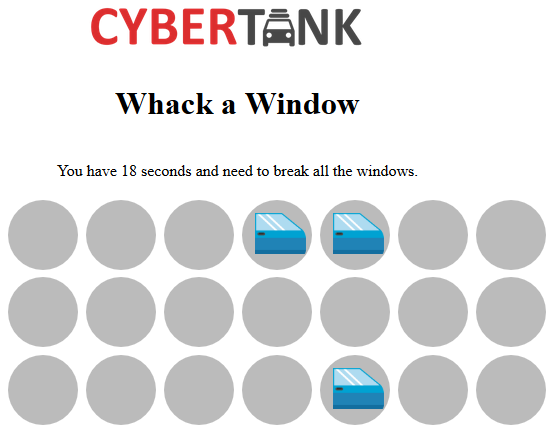

# Whack-a-window
Web, Miscellaneous

## Whack a window (100 points)

> Our CyberTank windows our virtually indestructible. They recover from damage quicker than you can break them. Can you break them all before the time runs out? 
> 
> Flag format: CTF{32-hex}

A website link was attached.

The link leads to a Whack-a-mole clone:



We need to click all the windows within 30 seconds to win. There are 180 holes to cover, and it is impossible to complete this task manually.

Let's take a look at the sources:

```html
  <h1>Whack a Window</h1>
<a href="#" id="start">Start the game</a>
<br />You have <span id="timeleft">30</span> seconds and need to break all the windows.<br /><br/>
<div id="dots">
  <span class="dot"></span>
  <span class="dot"></span>
  <!-- ... -->
  <span class="dot"></span>
  <span class="dot"></span>
</div>

<script type="text/javascript">
	var client = new Faye.Client('faye/');

	client.subscribe('/window', function(idx) {
		var dot = document.querySelector(".dot:nth-child(" + idx + ")")
		dot.idx = idx
		dot.innerHTML = '<span class="rein"></span>'
		dot.firstChild.addEventListener("click", function() {
			client.publish('/whack', this.idx);
			this.innerHTML = ''
		}.bind(dot))
	});

	client.subscribe('/timeleft', function(obj) {
		document.querySelector("#timeleft").innerHTML = Math.round(30-obj.seconds);
	});

	client.subscribe('/finish', function(msg) {
		alert(msg)
		location.reload()
	});

	document.querySelector("#start").addEventListener("click", function() {
		document.querySelector("#start").style.display = 'none';
		document.querySelector("#dots").style.display = 'block';
		
		client.publish('/start', {});
	});
</script>
```

The server keeps sending us locations of new windows. When we click a window, the Javascript code publishes an event to `/whack` and clears the window image. We control the client side, so we can register the following event listener ourselves using the browser developer tools:

```javascript
client.subscribe('/window', function(idx) {
		var dot = document.querySelector(".dot:nth-child(" + idx + ")")
		dot.idx = idx
		client.publish('/whack', idx);
	});
```

Now the code will whack the window immediately when it is received from the server.

When we run this, we get the flag: `You got it! Here's your flag: CTF{5fecf462cea224edee29faa373c8accc}`.

## Passing by (50 points)

> If you give it some time, a flag will stare you right in the face as it walks by. 
> 
> Flag format: CTF{32-hex}

Again, we modify the client side logic using the browser console to disable the timeout:

```javascript

client.unsubscribe("/finish");

client.subscribe('/finish', function(msg) {
		console.log(msg)		
    });
    
client.subscribe('/window', function(idx) {
		var dot = document.querySelector(".dot:nth-child(" + idx + ")")
		dot.idx = idx
		client.publish('/whack', idx);
    });
    
client.subscribe('/timeleft', function(obj) {
    console.log(obj);
});
```

We get:
```
VM12:13 {seconds: 2.0000000000000004}
VM12:13 {seconds: 3.0000000000000013}
VM12:13 {seconds: 4.000000000000002}
VM12:13 {seconds: 4.999999999999998, flag: "CTF{01eff8769321495601fd4d3e382784f6}"}seconds: 4.999999999999998flag: "CTF{01eff8769321495601fd4d3e382784f6}"__proto__: Object
VM12:13 {seconds: 5.999999999999995}
VM12:13 {seconds: 6.999999999999991}
VM12:13 {seconds: 7.999999999999988}
VM12:13 {seconds: 8.999999999999984}
VM12:13 {seconds: 9.99999999999998}
VM12:13 {seconds: 10.999999999999977}
VM12:13 {seconds: 11.999999999999973}
VM12:13 {seconds: 12.99999999999997}
VM12:13 {seconds: 13.999999999999966}
VM12:13 {seconds: 14.999999999999963}
VM12:13 {seconds: 15.99999999999996}
VM12:13 {seconds: 16.99999999999997}
VM12:13 {seconds: 17.999999999999986}
```