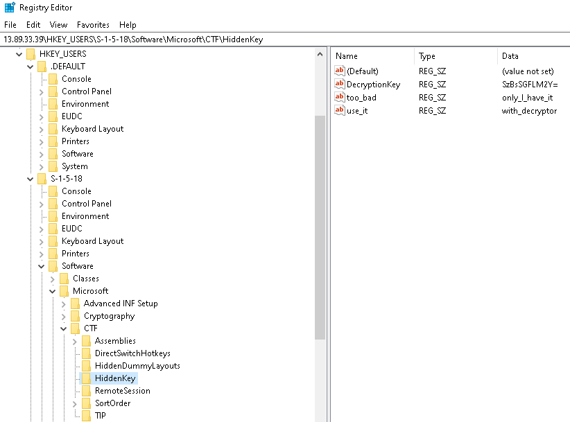

# Challenge 1
Worked with AvivC, YaakovC.

## Description

After entering the challenge, we arrive to a Kibana dashboard with the following description:

> The windows 10 user at 13.89.33.39 was attacked on February 5th. Find out what happened and help him revert the damage!

## Logs

The dashboard links to a series of 69 event logs which shed some light on the attack. The logs are visible via the Kibana GUI and are available in JSON format as well.

The `message` member usually contained a summary of each event. 
We'll use the following script to display it:

```python
import json, argparse

parser = argparse.ArgumentParser(description='JSON Log Viewer')
parser.add_argument('-f', '--file_id', required = True, help = 'JSON file ID')
args = parser.parse_args()

with open("{}.txt".format(args.file_id), 'r') as f:
    contents = f.read()
    j = json.loads(contents)
    print (j["_source"]["message"])
```

Let's take a look at the interesting events.

First, a program called `encrypt.exe` is creating (or encrypting) a file called `classified_document.txt`.

```console
root@kali:/media/sf_CTFs/hoshen/1/json# python3 view.py -f 6
File created:
RuleName:
UtcTime: 2020-02-05 15:16:21.519
ProcessGuid: {e01e78ba-dc45-5e3a-0000-00105bf4f621}
ProcessId: 13208
Image: C:\Users\user07\Downloads\encrypt.exe
TargetFilename: C:\Users\user07\Downloads\classified_document.txt
CreationUtcTime: 2020-01-20 12:29:02.272
```

It also hides a key in the registry:
```console
root@kali:/media/sf_CTFs/hoshen/1/json# python3 view.py -f 8
Registry value set:
RuleName: technique_id=T1183,technique_name=Image File Execution Options Injection
EventType: SetValue
UtcTime: 2020-02-05 15:16:21.488
ProcessGuid: {e01e78ba-dc45-5e3a-0000-00105bf4f621}
ProcessId: 13208
Image: C:\Users\user07\Downloads\encrypt.exe
TargetObject: HKLM\SOFTWARE\Microsoft\Windows NT\CurrentVersion\Image File Execution Options\challenge.exe\keyPath
Details: HKEY_USERS\S-1-5-18\Software\Microsoft\CTF\HiddenKey
```

It starts loading many Python crypto modules, e.g.:
```console
root@kali:/media/sf_CTFs/hoshen/1/json# python3 view.py -f 11
Image loaded:
RuleName: technique_id=T1073,technique_name=DLL Side-Loading
UtcTime: 2020-02-05 15:16:21.410
ProcessGuid: {e01e78ba-dc45-5e3a-0000-00105bf4f621}
ProcessId: 13208
Image: C:\Users\user07\Downloads\encrypt.exe
ImageLoaded: C:\Users\user07\AppData\Local\Temp\_MEI127042\Crypto\Cipher\_raw_aes.pyd
FileVersion: ?
Description: ?
Product: ?
Company: ?
OriginalFileName: ?
Hashes: SHA1=27AB93EEC020628D67A4987FDE001DA3BA5E35B4,MD5=5068682759149260D35E4BD981DA3848,SHA256=B832C6EE6D7E4EC7368035E835941E1E8AD71EFAEA0C8BC0B7B2B1528CE719FC,IMPHASH=62432F35F109091536AFBA636294DBCB
Signed: false
Signature:
SignatureStatus: Unavailable
```

Now, using `PsExec`, a command is issued:
```console
root@kali:/media/sf_CTFs/hoshen/1/json# python3 view.py -f 62
Process Create:
RuleName: technique_id=T1035,technique_name=Service Execution
UtcTime: 2020-02-05 15:16:19.919
ProcessGuid: {e01e78ba-dc43-5e3a-0000-0010b4aef621}
ProcessId: 14260
Image: C:\PSTools\PsExec64.exe
FileVersion: 2.2
Description: Execute processes remotely
Product: Sysinternals PsExec
Company: Sysinternals - www.sysinternals.com
OriginalFileName: psexec.c
CommandLine: C:\PSTools\PsExec64.exe  -h -u user07 -p ClngP@ss C:\Users\user07\Downloads\encrypt.exe
CurrentDirectory: C:\Users\hoshenCtf\
User: PUBLICCTF3\hoshenCtf
LogonGuid: {e01e78ba-f19a-5e25-0000-002092932500}
LogonId: 0x259392
TerminalSessionId: 3
IntegrityLevel: High
Hashes: SHA1=FB0A150601470195C47B4E8D87FCB3F50292BEB2,MD5=9321C107D1F7E336CDA550A2BF049108,SHA256=AD6B98C01EE849874E4B4502C3D7853196F6044240D3271E4AB3FC6E3C08E9A4,IMPHASH=159D56D406180A332FBC99290F30700E
ParentProcessGuid: {e01e78ba-d4a9-5e3a-0000-0010eae9d921}
ParentProcessId: 2220
ParentImage: C:\Windows\System32\cmd.exe
ParentCommandLine: "C:\windows\system32\cmd.exe"
```

Using this command, we get the following username and password combination: `user07:ClngP@ss`. We also know that there's another user: `hoshenCtf`.

We also see some network activity:

```console
root@kali:/media/sf_CTFs/hoshen/1/json# python3 view.py -f 65
Network connection detected:
RuleName: technique_id=T1036,technique_name=Masquerading
UtcTime: 2020-02-05 15:16:16.134
ProcessGuid: {e01e78ba-efed-5e25-0000-0010cf320200}
ProcessId: 3344
Image: C:\ProgramData\Microsoft\Windows Defender\Platform\4.18.1911.3-0\MsMpEng.exe
User: NT AUTHORITY\SYSTEM
Protocol: tcp
Initiated: true
SourceIsIpv6: false
SourceIp: 10.0.0.6
SourceHostname: publicCtf3.p2aj4t3wwgtudfbzkeksupkyig.gx.internal.cloudapp.net
SourcePort: 58670
SourcePortName:
DestinationIsIpv6: false
DestinationIp: 40.121.3.131
DestinationHostname:
DestinationPort: 443
DestinationPortName: https
root@kali:/media/sf_CTFs/hoshen/1/json# python3 view.py -f 66
Network connection detected:
RuleName:
UtcTime: 2020-02-05 15:16:15.838
ProcessGuid: {e01e78ba-efe0-5e25-0000-0010eb030000}
ProcessId: 4
Image: System
User: NT AUTHORITY\SYSTEM
Protocol: tcp
Initiated: true
SourceIsIpv6: true
SourceIp: fe80:0:0:0:8165:712:b68f:7ccc
SourceHostname: publicCtf3.p2aj4t3wwgtudfbzkeksupkyig.gx.internal.cloudapp.net
SourcePort: 58669
SourcePortName:
DestinationIsIpv6: true
DestinationIp: fe80:0:0:0:8165:712:b68f:7ccc
DestinationHostname: publicCtf3.p2aj4t3wwgtudfbzkeksupkyig.gx.internal.cloudapp.net
DestinationPort: 445
DestinationPortName: microsoft-ds
root@kali:/media/sf_CTFs/hoshen/1/json# python3 view.py -f 67
Network connection detected:
RuleName:
UtcTime: 2020-02-05 15:16:15.838
ProcessGuid: {e01e78ba-efe0-5e25-0000-0010eb030000}
ProcessId: 4
Image: System
User: NT AUTHORITY\SYSTEM
Protocol: tcp
Initiated: false
SourceIsIpv6: true
SourceIp: fe80:0:0:0:8165:712:b68f:7ccc
SourceHostname: publicCtf3.p2aj4t3wwgtudfbzkeksupkyig.gx.internal.cloudapp.net
SourcePort: 58669
SourcePortName:
DestinationIsIpv6: true
DestinationIp: fe80:0:0:0:8165:712:b68f:7ccc
DestinationHostname: publicCtf3.p2aj4t3wwgtudfbzkeksupkyig.gx.internal.cloudapp.net
DestinationPort: 445
DestinationPortName: microsoft-ds
```

This includes access to port 445 ("SMB over IP").

## Samba: 13.89.33.39

Let's take a look at what samba shares are available over the system that was attacked using the credentials we found.

```console
root@kali:/media/sf_CTFs/hoshen/1# smbclient -L 13.89.33.39 -U user07%ClngP@ss

        Sharename       Type      Comment
        ---------       ----      -------
        ADMIN$          Disk      Remote Admin
        C$              Disk      Default share
        D$              Disk      Default share
        IPC$            IPC       Remote IPC
        user07          Disk
SMB1 disabled -- no workgroup available
```

Using `smbmap` we can get a few more details:

```console
root@kali:/media/sf_CTFs/hoshen/1# smbmap -H 13.89.33.39 -u user07 -p ClngP@ss
[+] Finding open SMB ports....
[+] User SMB session established on 13.89.33.39...
[+] IP: 13.89.33.39:445 Name: 13.89.33.39
        Disk                                                    Permissions     Comment
        ----                                                    -----------     -------
        ADMIN$                                                  NO ACCESS       Remote Admin
        C$                                                      NO ACCESS       Default share
        D$                                                      NO ACCESS       Default share
        .
        fr--r--r--                3 Mon Jan  1 02:20:54 1601    InitShutdown
        fr--r--r--                4 Mon Jan  1 02:20:54 1601    lsass
        fr--r--r--                4 Mon Jan  1 02:20:54 1601    ntsvcs
        fr--r--r--                3 Mon Jan  1 02:20:54 1601    scerpc
        fr--r--r--                1 Mon Jan  1 02:20:54 1601    Winsock2\CatalogChangeListener-2cc-0
        fr--r--r--                3 Mon Jan  1 02:20:54 1601    epmapper
        fr--r--r--                1 Mon Jan  1 02:20:54 1601    Winsock2\CatalogChangeListener-3c4-0
        fr--r--r--                1 Mon Jan  1 02:20:54 1601    Winsock2\CatalogChangeListener-23c-0
        fr--r--r--                3 Mon Jan  1 02:20:54 1601    LSM_API_service
        fr--r--r--                3 Mon Jan  1 02:20:54 1601    atsvc
        fr--r--r--                4 Mon Jan  1 02:20:54 1601    eventlog
        fr--r--r--                1 Mon Jan  1 02:20:54 1601    Winsock2\CatalogChangeListener-560-0
        fr--r--r--                1 Mon Jan  1 02:20:54 1601    Winsock2\CatalogChangeListener-498-0
        fr--r--r--                3 Mon Jan  1 02:20:54 1601    TermSrv_API_service
        fr--r--r--                3 Mon Jan  1 02:20:54 1601    Ctx_WinStation_API_service
        fr--r--r--                4 Mon Jan  1 02:20:54 1601    wkssvc
        fr--r--r--                3 Mon Jan  1 02:20:54 1601    SessEnvPublicRpc
        fr--r--r--                1 Mon Jan  1 02:20:54 1601    Winsock2\CatalogChangeListener-994-0
        fr--r--r--                4 Mon Jan  1 02:20:54 1601    spoolss
        fr--r--r--                1 Mon Jan  1 02:20:54 1601    Winsock2\CatalogChangeListener-bc8-0
        fr--r--r--                3 Mon Jan  1 02:20:54 1601    trkwks
        fr--r--r--                3 Mon Jan  1 02:20:54 1601    W32TIME_ALT
        fr--r--r--                4 Mon Jan  1 02:20:54 1601    srvsvc
        fr--r--r--                1 Mon Jan  1 02:20:54 1601    Winsock2\CatalogChangeListener-2ac-0
        fr--r--r--                1 Mon Jan  1 02:20:54 1601    PIPE_EVENTROOT\CIMV2SCM EVENT PROVIDER
        fr--r--r--                3 Mon Jan  1 02:20:54 1601    browser
        fr--r--r--               10 Mon Jan  1 02:20:54 1601    MsFteWds
        fr--r--r--                1 Mon Jan  1 02:20:54 1601    SearchTextHarvester
        fr--r--r--                1 Mon Jan  1 02:20:54 1601    AppContracts_xF9E1217A-501D-40BA-B3BE-E70F728FC295y
        fr--r--r--                4 Mon Jan  1 02:20:54 1601    winreg
        IPC$                                                    READ ONLY       Remote IPC
        .
        dr--r--r--                0 Thu Feb  6 21:50:09 2020    .
        dr--r--r--                0 Thu Feb  6 21:50:09 2020    ..
        dr--r--r--                0 Thu Feb  6 23:36:52 2020    .idlerc
        dr--r--r--                0 Wed Jan 15 14:58:31 2020    3D Objects
        dr--r--r--                0 Tue Jan 14 11:31:44 2020    AppData
        dr--r--r--                0 Tue Jan 14 11:31:43 2020    Application Data
        dr--r--r--                0 Wed Jan 15 14:58:36 2020    Contacts
        dr--r--r--                0 Tue Jan 14 11:31:43 2020    Cookies
        dr--r--r--                0 Wed Jan 15 14:58:36 2020    Desktop
        dr--r--r--                0 Wed Jan 15 14:58:36 2020    Documents
        dr--r--r--                0 Wed Feb  5 17:29:40 2020    Downloads
        dr--r--r--                0 Wed Jan 15 14:58:36 2020    Favorites
        dr--r--r--                0 Wed Jan 15 14:58:36 2020    Links
        dr--r--r--                0 Tue Jan 14 11:31:43 2020    Local Settings
        dr--r--r--                0 Fri Feb  7 18:25:33 2020    MicrosoftEdgeBackups
        dr--r--r--                0 Wed Jan 15 14:58:36 2020    Music
        dr--r--r--                0 Tue Jan 14 11:31:43 2020    My Documents
        dr--r--r--                0 Tue Jan 14 11:31:43 2020    NetHood
        fr--r--r--          1310720 Thu Feb  6 23:35:39 2020    NTUSER.DAT
        fr--r--r--           327680 Fri Feb  7 20:58:37 2020    ntuser.dat.LOG1
        fr--r--r--           342016 Tue Jan 14 11:31:43 2020    ntuser.dat.LOG2
        fr--r--r--            65536 Fri Feb  7 21:01:10 2020    NTUSER.DAT{e2cb19a2-1713-11ea-956e-c0bcf8f5979b}.TM.blf
        fr--r--r--           524288 Fri Feb  7 18:16:13 2020    NTUSER.DAT{e2cb19a2-1713-11ea-956e-c0bcf8f5979b}.TMContainer00000000000000000001.regtrans-ms
        fr--r--r--           524288 Fri Feb  7 21:00:40 2020    NTUSER.DAT{e2cb19a2-1713-11ea-956e-c0bcf8f5979b}.TMContainer00000000000000000002.regtrans-ms
        fr--r--r--               20 Sat Feb  8 02:17:41 2020    ntuser.ini
        dw--w--w--                0 Sat Feb  8 17:40:06 2020    OneDrive
        dr--r--r--                0 Wed Jan 15 14:58:36 2020    Pictures
        dr--r--r--                0 Tue Jan 14 11:31:43 2020    PrintHood
        dr--r--r--                0 Sat Feb  8 16:44:20 2020    Recent
        dr--r--r--                0 Wed Jan 15 14:58:36 2020    Saved Games
        dr--r--r--                0 Sat Feb  8 21:00:09 2020    Searches
        dr--r--r--                0 Tue Jan 14 11:31:43 2020    SendTo
        dr--r--r--                0 Tue Jan 14 11:31:43 2020    Start Menu
        dr--r--r--                0 Tue Jan 14 11:31:43 2020    Templates
        dr--r--r--                0 Wed Jan 15 14:58:36 2020    Videos
        user07                                                  READ ONLY
```

So this user has read-only access to `IPC$` and `user07`. Let's start by accessing the disk:

```console
root@kali:/media/sf_CTFs/hoshen/1# smbclient //13.89.33.39/user07 -U user07%ClngP@ss -m SMB2 -t 120
Try "help" to get a list of possible commands.
smb: \> cd Downloads
smb: \Downloads\> dir
  .                                   D        0  Wed Feb  5 17:29:40 2020
  ..                                  D        0  Wed Feb  5 17:29:40 2020
  Challenge2.pcap.rar                 A 82637414  Wed Jan 29 17:03:49 2020
  classified_document.txt             A       44  Wed Jan 29 17:11:21 2020
  desktop.ini                       AHS      282  Tue Jan 14 11:31:50 2020

                33147387 blocks of size 4096. 27683659 blocks available
smb: \Downloads\> get classified_document.txt
getting file \Downloads\classified_document.txt of size 44 as classified_document.txt (0.0 KiloBytes/sec) (average 0.0 KiloBytes/sec)
smb: \Downloads\> get Challenge2.pcap.rar
parallel_read returned NT_STATUS_IO_TIMEOUT
smb: \Downloads\> getting file \Downloads\Challenge2.pcap.rar of size 82637414 as Challenge2.pcap.rar SMBecho failed (NT_STATUS_CONNECTION_RESET). The connection is disconnected now
```

We were able to download `classified_document.txt` but the server connection was problematic and reading the 80MB rar file kept failing. Let's use `smbget` instead, since it supports resuming:

```console
root@kali:/media/sf_CTFs/hoshen/1# smbget -U user07 -D smb://13.89.33.39/user07/Downloads/Challenge2.pcap.rar
Password for [user07] connecting to //user07/13.89.33.39:
Using workgroup WORKGROUP, user user07
................................................................................................................................................................................................................................................................................................................................................................................................................................................................................................................................................................................Can't read 64000 bytes at offset 35840000, file smb://13.89.33.39/user07/Downloads/Challenge2.pcap.rar
root@kali:/media/sf_CTFs/hoshen/1# smbget -U user07 -D -r smb://13.89.33.39/user07/Downloads/Challenge2.pcap.rar
Password for [user07] connecting to //user07/13.89.33.39:
Using workgroup WORKGROUP, user user07
............................................................................................................................................................................................................................................................................................................................................................................................................................................................................................................................................................................................................................................................................................................................................................
smb://13.89.33.39/user07/Downloads/Challenge2.pcap.rar downloaded
Downloaded 44.63MB in 254 seconds
```

Now we have two files. The first one is a base64-encoded binary file:

```console
root@kali:/media/sf_CTFs/hoshen/1# cat classified_document.txt
W2xAjCIruqj4DEsNDIGlztmL7AcXHSySQA3EBGS1zNw=
root@kali:/media/sf_CTFs/hoshen/1# cat classified_document.txt | base64 -d | xxd -g 1
00000000: 5b 6c 40 8c 22 2b ba a8 f8 0c 4b 0d 0c 81 a5 ce  [l@."+....K.....
00000010: d9 8b ec 07 17 1d 2c 92 40 0d c4 04 64 b5 cc dc  ......,.@...d...
```

The second is a password-protected RAR archive:

```console
root@kali:/media/sf_CTFs/hoshen/1# unrar l Challenge2.pcap.rar

UNRAR 5.50 freeware      Copyright (c) 1993-2017 Alexander Roshal

Archive: Challenge2.pcap.rar
Details: RAR 5

 Attributes      Size     Date    Time   Name
----------- ---------  ---------- -----  ----
*   ..A.... 152151936  2020-01-30 02:22  Challenge2.pcapng
----------- ---------  ---------- -----  ----
            152151936                    1

root@kali:/media/sf_CTFs/hoshen/1# unrar t Challenge2.pcap.rar

UNRAR 5.50 freeware      Copyright (c) 1993-2017 Alexander Roshal


Testing archive Challenge2.pcap.rar

Enter password (will not be echoed) for Challenge2.pcapng:
```

Back to the `smbmap` output. Notice this line:
```
        fr--r--r--                4 Mon Jan  1 02:20:54 1601    winreg
        IPC$                                                    READ ONLY       Remote IPC
```

It means that the user can remotely access the registry. For example, using Python:

```python
Python 3.7.3 (v3.7.3:ef4ec6ed12, Mar 25 2019, 21:26:53) [MSC v.1916 32 bit (Intel)] on win32
Type "help", "copyright", "credits" or "license" for more information.
>>> from winreg import *
>>> root = ConnectRegistry(r"\\13.89.33.39", HKEY_USERS)
>>> key = OpenKeyEx(root, r"S-1-5-18\Software\Microsoft\CTF\HiddenKey")
>>> EnumValue(key, 0)
('DecryptionKey', 'SzBsSGFLM2Y=', 1)
```

Or, using `regedit.exe` -> `File` -> `Connect Network Registry` -> `13.89.33.39`:



## Samba: 104.43.243.221

Let's move on to the next IP we found in the logs: `104.43.243.221`.

```console
root@kali:/media/sf_CTFs/hoshen/1# smbmap -H 104.43.243.221
[+] Finding open SMB ports....
[+] Guest SMB session established on 104.43.243.221...
[+] IP: 104.43.243.221:445      Name: 104.43.243.221
        Disk                                                    Permissions     Comment
        ----                                                    -----------     -------
        print$                                                  NO ACCESS       Printer Drivers
        share                                                   NO ACCESS       Samba on Ubuntu
        sharenopass                                             NO ACCESS
        .
        dr--r--r--                0 Sun Jan 19 11:12:30 2020    .
        dr--r--r--                0 Mon Jan 20 19:50:22 2020    ..
        fr--r--r--               38 Sun Jan 19 11:12:30 2020    credenitals.txt
        Creds                                                   READ ONLY
        IPC$                                                    NO ACCESS       IPC Service (HoshenCtf2 server (Samba, Ubuntu))
```

Looks like there's an open share here which doesn't require a password:

```console
root@kali:/media/sf_CTFs/hoshen/1# smbclient //104.43.243.221/Creds
Enter WORKGROUP\root's password:
Try "help" to get a list of possible commands.
smb: \> dir
  .                                   D        0  Sun Jan 19 11:12:30 2020
  ..                                  D        0  Mon Jan 20 19:50:22 2020
  credenitals.txt                     N       38  Sun Jan 19 11:12:30 2020

                30309264 blocks of size 1024. 26883336 blocks available
smb: \> get credenitals.txt
getting file \credenitals.txt of size 38 as credenitals.txt (0.0 KiloBytes/sec) (average 0.0 KiloBytes/sec)
```

We got another pair of credentials:

```console
root@kali:/media/sf_CTFs/hoshen/1# cat credenitals.txt
username: cuser
password: Sec0ndPh@se
```

## SSH: 104.43.243.221

Using the credentials we just found, let's SSH into the machine:
```console
root@kali:/media/sf_CTFs/hoshen/1# sshpass -p Sec0ndPh@se ssh cuser@104.43.243.221
Welcome to Ubuntu 18.04.3 LTS (GNU/Linux 5.0.0-1027-azure x86_64)

Last login: Sat Feb  8 22:20:49 2020 from 84.108.30.242
cuser@HoshenCtf2:~$
```

We find here another (encrypted) RAR archive:
```console
cuser@HoshenCtf2:~$ find / -type f -name "*.rar" 2>/dev/null
/var/local/decrypt.rar.rar
cuser@HoshenCtf2:~$ cd /var/local/
cuser@HoshenCtf2:/var/local$ ls -al
total 16
drwxrwsr-x  3 root staff 4096 Jan 20 17:50 .
drwxr-xr-x 13 root root  4096 Dec 18 19:14 ..
drwxr-sr-x  2 root staff 4096 Jan 19 09:12 Creds
-rwxr-xr-x  1 root root   947 Jan 20 15:43 decrypt.rar.rar
cuser@HoshenCtf2:/var/local$ cd Creds/
cuser@HoshenCtf2:/var/local/Creds$ ls
credenitals.txt
cuser@HoshenCtf2:/var/local/Creds$ cat credenitals.txt
username: cuser
password: Sec0ndPh@se
```

We need to find the password somewhere in the system. It's time to perform system enumeration. A script such as [LinEnum](https://github.com/rebootuser/LinEnum/blob/master/LinEnum.sh) can help us.

After running the script, the first result that should stand out is the fact that we can read `/etc/shadow`:

```
[+] We can read the shadow file!
root:$6$eTbDRaoQ$f1aycF/9chbCHeIwkwR20QbaVvjxyhFZQr9kNDUb.EB85SbSr8l07nXzq0R7BmjSY.xsPRSQVFt.BaDmI9eFH/:18298:0:99999:7:::
daemon:*:18248:0:99999:7:::
bin:*:18248:0:99999:7:::
sys:*:18248:0:99999:7:::
sync:*:18248:0:99999:7:::
games:*:18248:0:99999:7:::
man:*:18248:0:99999:7:::
lp:*:18248:0:99999:7:::
mail:*:18248:0:99999:7:::
news:*:18248:0:99999:7:::
uucp:*:18248:0:99999:7:::
proxy:*:18248:0:99999:7:::
www-data:*:18248:0:99999:7:::
backup:*:18248:0:99999:7:::
list:*:18248:0:99999:7:::
irc:*:18248:0:99999:7:::
gnats:*:18248:0:99999:7:::
nobody:*:18248:0:99999:7:::
systemd-network:*:18248:0:99999:7:::
systemd-resolve:*:18248:0:99999:7:::
syslog:*:18248:0:99999:7:::
messagebus:*:18248:0:99999:7:::
_apt:*:18248:0:99999:7:::
lxd:*:18248:0:99999:7:::
uuidd:*:18248:0:99999:7:::
dnsmasq:*:18248:0:99999:7:::
landscape:*:18248:0:99999:7:::
sshd:*:18248:0:99999:7:::
pollinate:*:18248:0:99999:7:::
hoshenCtf:$6$sg124Ebw$EKdW5ZRvnCc2bFLDhw5UkOVNzfsEkzHwN2nJuZLHNRUSeazTlK7tUaphC7aVCfaGjml2lv4vFX6wThwiyLowt0:18298:0:99999:7:::
sambauser:$6$f11iy2W/$webTCIycnufq9zGSieShko/XWDGMNXYUjqupyIItkd99fIGOzfFhx48qh.OPVTr.8HjO3N5iBNMAqHg67Uxi20:18276:0:99999:7:::
MrPink:$6$w/C7AYid$W9ioXMiz3PoB4BL8Xv3rX085Og0aM1YfOrl2gg8yfNrAsGSF6bWdLP8RI//MNz72V95cueGxMzq4AjBts.1RL1:18276:0:99999:7:::
cuser:$6$hWYEC0gP$fyuO7h6Q/rqtN7NMZ/2uyLp30semAdr6w3/vkyYOO06QJ33eRVe3h8SpaG0YIGg2KyCFg6K0O/YX1F1.QS0v11:18298:0:99999:7:::
pass1:O@O@O@L3E:18280:0:99999:7::0:
```

In theory we can try using the passowrd hashes to recover the passwords. However, this might take a while, especially since the hash algorithm used is `sha512` (based on the `$6` prefix).

Notice how the "Encrypted Password" field for `pass1` doesn't comply with the [standard shadow format](https://linux.die.net/man/5/shadow). Instead, it contains `O@O@O@L3E` which is illegal for this field.

This starts to make sense when combined with the group membership output:

```
[-] Group memberships:
...
uid=1004(pass1) gid=1004(rot13) groups=1004(rot13)
```

The group is `rot13` which means that we need to perform:
```console
root@kali:/media/sf_CTFs/hoshen/1# python3 -c "import codecs; print(codecs.encode('O@O@O@L3E', 'rot_13'));"
B@B@B@Y3R
```

Let's use this password to extract the archive:
```console
root@kali:/media/sf_CTFs/hoshen/1# unrar x -pB@B@B@Y3R decrypt.rar.rar

UNRAR 5.50 freeware      Copyright (c) 1993-2017 Alexander Roshal


Extracting from decrypt.rar.rar

Creating    decrypt.rar                                               OK
Extracting  decrypt.rar/decrypt.rar                                   OK
All OK
```

We receive another encrypted RAR file:
```console
root@kali:/media/sf_CTFs/hoshen/1/decrypt.rar# ls
decrypt.rar
```

It's password is hidden in another section of the enumeration report:
```
[-] Jobs held by all users:
0 0 1 1 * echo 'pass2: ShP1GGy'
```

This is the cron job (also accessible via `crontab -l`). Let's use it:

```console
root@kali:/media/sf_CTFs/hoshen/1/decrypt.rar# unrar x -pShP1GGy decrypt.rar

UNRAR 5.50 freeware      Copyright (c) 1993-2017 Alexander Roshal


Extracting from decrypt.rar

Extracting  decrypt.py                                                OK
All OK
```


We got a decryption script:
```python
# Elian's decryptor python 2

#import
import base64
import hashlib
from Crypto.Cipher import AES
from Crypto import Random

# constants
# AES 256 encryption/decryption using pycrypto library
BLOCK_SIZE = 16
unpad = lambda s: s[:-ord(s[len(s) - 1:])]

def decrypt(enc, password):
    private_key = hashlib.sha256(password.encode("utf-8")).digest()
    enc = base64.b64decode(enc)
    iv = enc[:16]
    cipher = AES.new(private_key, AES.MODE_CBC, iv)
    return unpad(cipher.decrypt(enc[16:]))

# Let us decrypt using our original password
#decrypted = decrypt(encrypted, password)
#print(bytes.decode(decrypted))

def main():
    password = raw_input("Enter encryption password: ")
    path = raw_input("Enter the path to the file you want to decrypt: ")
    # read file content
    with open(path, 'rb') as filee:
        content = filee.read()

    decreypted = decrypt(content, password)

    # write new to file
    with open(path, 'wb') as filee:
        filee.write(decreypted)

    print("your file is decrypted")

if __name__ == "__main__":
    main()
```

Let's use it to decrypt the classified document:

```console
root@kali:/media/sf_CTFs/hoshen/1/decrypt.rar# cp ../classified_document.txt .
root@kali:/media/sf_CTFs/hoshen/1/decrypt.rar# echo SzBsSGFLM2Y= | base64 -d
K0lHaK3f
root@kali:/media/sf_CTFs/hoshen/1/decrypt.rar# python decrypt.py
Enter encryption password: K0lHaK3f
Enter the path to the file you want to decrypt: classified_document.txt
your file is decrypted
root@kali:/media/sf_CTFs/hoshen/1/decrypt.rar# cat classified_document.txt
Th3Dr3aMt3aM
```

We can finally use this password to decrypt the PCAP file:

```console
root@kali:/media/sf_CTFs/hoshen/1# unrar x -pTh3Dr3aMt3aM Challenge2.pcap.rar

UNRAR 5.50 freeware      Copyright (c) 1993-2017 Alexander Roshal


Extracting from Challenge2.pcap.rar

Extracting  Challenge2.pcapng                                         OK
All OK
```

Note: At some stage, the challenge owners updated the RAR file and added a README:
```
After opening challenge2.pcap.rar, please send to our mail the md5 of the pcap as a flag.

The pcap contains evidence of an attack in a private network we were hired to research.
You should find the outer IP address of the attacker by investigating malicious activity.

This challeng will require you to think out of the box, good luck.
```