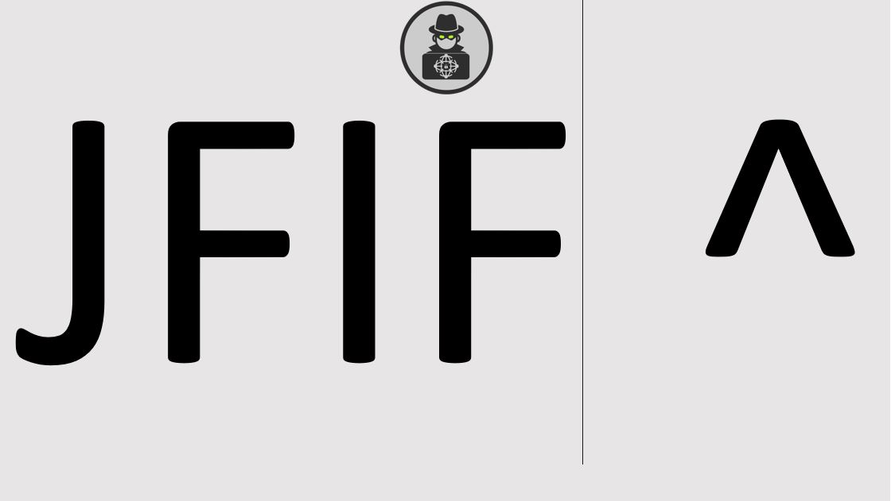

# Challenge 2
Worked with AvivC, YaakovC.

## Description

After finishing [Challenge 1](Challenge1.md) and extracting the encrypted PCAP file, we can start Challenge 2.

At some point the creators uploaded a new version of `decrypt.rar.rar` with the following `README` file:

> After opening challenge2.pcap.rar, please send to our mail the md5 of the pcap as a flag.
> 
> The pcap contains evidence of an attack in a private network we were hired to research.
> 
> You should find the outer IP address of the attacker by investigating malicious activity.
> 
> This challeng will require you to think out of the box, good luck.

## Solution

Let's take a look at the PCAP file:

```console
root@kali:/media/sf_CTFs/hoshen/2# tshark -qz io,phs -r Challenge2.pcapng
Running as user "root" and group "root". This could be dangerous.

===================================================================
Protocol Hierarchy Statistics
Filter:

eth                                      frames:212107 bytes:148758200
  arp                                    frames:3542 bytes:209514
  ip                                     frames:205803 bytes:148291639
    tcp                                  frames:180934 bytes:145976750
      ssl                                frames:46939 bytes:41069107
        tcp.segments                     frames:18609 bytes:24518037
          ssl                            frames:10615 bytes:15126013
      data                               frames:114 bytes:7019
      nbss                               frames:26001 bytes:9905038
        smb2                             frames:25992 bytes:9903504
          smb2                           frames:4088 bytes:2106738
            tcp.segments                 frames:554 bytes:332248
            smb2                         frames:98 bytes:64221
              tcp.segments               frames:38 bytes:30236
          nbss                           frames:7 bytes:2306
            smb2                         frames:7 bytes:2306
              nbss                       frames:1 bytes:473
                smb2                     frames:1 bytes:473
                  nbss                   frames:1 bytes:473
                    smb2                 frames:1 bytes:473
          tcp.segments                   frames:24 bytes:26784
          dcerpc                         frames:4 bytes:1200
            srvsvc                       frames:2 bytes:616
              dcerpc                     frames:1 bytes:350
                srvsvc                   frames:1 bytes:350
          data                           frames:6379 bytes:4465331
            tcp.segments                 frames:2851 bytes:1329327
        smb                              frames:7 bytes:1419
    udp                                  frames:7766 bytes:1049528
      bootp                              frames:862 bytes:397908
      llmnr                              frames:3092 bytes:204261
      nbns                               frames:2720 bytes:250570
      ssdp                               frames:618 bytes:122750
      data                               frames:46 bytes:3772
      dns                                frames:254 bytes:28592
      nbdgm                              frames:168 bytes:40843
        smb                              frames:168 bytes:40843
          mailslot                       frames:168 bytes:40843
            browser                      frames:168 bytes:40843
      mdns                               frames:6 bytes:832
    icmp                                 frames:17093 bytes:1264821
    igmp                                 frames:10 bytes:540
  loop                                   frames:202 bytes:12120
    data                                 frames:202 bytes:12120
  ipv6                                   frames:1486 bytes:168336
    udp                                  frames:1359 bytes:156910
      dhcpv6                             frames:1207 bytes:143020
      llmnr                              frames:146 bytes:12938
      mdns                               frames:6 bytes:952
    icmpv6                               frames:127 bytes:11426
  llc                                    frames:1039 bytes:73934
    stp                                  frames:1005 bytes:60300
    cdp                                  frames:34 bytes:13634
  lldp                                   frames:2 bytes:116
  data                                   frames:33 bytes:2541
===================================================================
```

We have ~200,000 frames and lots of different protocols. However, apart from a handful of messages, most messages were sent in the internal network. We are looking for an external IP, and the few external IPs in the capture did not seem related.

The first things that seems worth investigation is the SMB session. There are lots of SMB messages, for example:

```console
root@kali:/media/sf_CTFs/hoshen/2# tshark -nr Challenge2.pcapng  -Y 'smb2' | head
Running as user "root" and group "root". This could be dangerous.
 1014  29.590037    10.0.0.24 → 10.0.0.201   SMB2 290 Create Request File: desktop.ini 49884 445
 1015  29.591128   10.0.0.201 → 10.0.0.24    SMB2 131 Create Response, Error: STATUS_OBJECT_NAME_NOT_FOUND 445 49884
 1140  31.593770    10.0.0.24 → 10.0.0.201   SMB2 362 Create Request File: Teams\Network Forensics\Miscellanesous\CHALLENGE\answers\sender.py 49884 445
 1141  31.594948   10.0.0.201 → 10.0.0.24    SMB2 298 Create Response File: Teams\Network Forensics\Miscellanesous\CHALLENGE\answers\sender.py 445 49884
 1142  31.595244    10.0.0.24 → 10.0.0.201   SMB2 275 GetInfo Request FS_INFO/FileFsVolumeInformation File: Teams\Network Forensics\Miscellanesous\CHALLENGE\answers\sender.py;GetInfo Request FS_INFO/FileFsAttributeInformation File: Teams\Network Forensics\Miscellanesous\CHALLENGE\answers\sender.py 49884 445
 1143  31.596260   10.0.0.201 → 10.0.0.24    SMB2 250 GetInfo Response;GetInfo Response 445 49884
 1144  31.596339    10.0.0.24 → 10.0.0.201   SMB2 162 GetInfo Request FILE_INFO/SMB2_FILE_EA_INFO File: Teams\Network Forensics\Miscellanesous\CHALLENGE\answers\sender.py 49884 445
 1145  31.597147   10.0.0.201 → 10.0.0.24    SMB2 134 GetInfo Response 445 49884
 1146  31.597249    10.0.0.24 → 10.0.0.201   SMB2 146 Close Request File: Teams\Network Forensics\Miscellanesous\CHALLENGE\answers\sender.py 49884 445
 1147  31.598073   10.0.0.201 → 10.0.0.24    SMB2 182 Close Response 445 49884
```

The SMB session included many directory listings, some unimportant file reads and the following write to `skid.txt`:

```console
root@kali:/media/sf_CTFs/hoshen/2# tshark -nr Challenge2.pcapng  -Y 'smb2.write_length > 0'
Running as user "root" and group "root". This could be dangerous.
108802 1504.579445    10.0.0.24 → 10.0.0.201   DCERPC 330 Bind: call_id: 2, Fragment: Single, 3 context items: SRVSVC V3.0 (32bit NDR), SRVSVC V3.0 (64bit NDR), SRVSVC V3.0 (6cb71c2c-9812-4540-0300-000000000000) 49884 445
109263 1517.490219    10.0.0.24 → 10.0.0.201   SMB2 192 Write Request Len:22 Off:0 File: Teams\Network Forensics\Miscellanesous\skid.txt 49884 445
root@kali:/media/sf_CTFs/hoshen/2# tshark -nr Challenge2.pcapng  -Y 'frame.number==109263'  -T fields -e data.text -o data.show_as_text:TRUE
Running as user "root" and group "root". This could be dangerous.
you will never succeed
```

The next thing that seemed odd is the following sequence of messages:

```console
root@kali:/media/sf_CTFs/hoshen/2# tshark -nr Challenge2.pcapng  -Y 'ip.addr == 10.0.0.24 and ip.addr == 10.0.0.36' | head
Running as user "root" and group "root". This could be dangerous.
202363 1774.765268    10.0.0.24 → 10.0.0.36    ICMP 74 Echo (ping) request  id=0x0001, seq=21/5376, ttl=128
202366 1774.767452    10.0.0.36 → 10.0.0.24    ICMP 74 Echo (ping) reply    id=0x0001, seq=21/5376, ttl=128 (request in 202363)
202492 1781.937553    10.0.0.24 → 10.0.0.36    TCP 58 61948 → 587 [SYN] Seq=0 Win=1024 Len=0 MSS=1460 61948 587
202493 1781.937956    10.0.0.24 → 10.0.0.36    TCP 58 61948 → 199 [SYN] Seq=0 Win=1024 Len=0 MSS=1460 61948 199
202494 1781.938307    10.0.0.36 → 10.0.0.24    TCP 60 587 → 61948 [RST, ACK] Seq=1 Ack=1 Win=0 Len=0 587 61948
202495 1781.938390    10.0.0.24 → 10.0.0.36    TCP 58 61948 → 113 [SYN] Seq=0 Win=1024 Len=0 MSS=1460 61948 113
202496 1781.938741    10.0.0.36 → 10.0.0.24    TCP 60 199 → 61948 [RST, ACK] Seq=1 Ack=1 Win=0 Len=0 199 61948
202497 1781.938814    10.0.0.24 → 10.0.0.36    TCP 58 61948 → 554 [SYN] Seq=0 Win=1024 Len=0 MSS=1460 61948 554
202498 1781.939165    10.0.0.36 → 10.0.0.24    TCP 60 113 → 61948 [RST, ACK] Seq=1 Ack=1 Win=0 Len=0 113 61948
202499 1781.939238    10.0.0.24 → 10.0.0.36    TCP 58 61948 → 53 [SYN] Seq=0 Win=1024 Len=0 MSS=1460 61948 53
```

`10.0.0.24` was flooding `10.0.0.36` with `SYN` packets for different ports. This looks like port scanning. 

`10.0.0.36` replied with a `SYN/ACK` for the few ports it had open:

```console
root@kali:/media/sf_CTFs/hoshen/2# tshark -nr Challenge2.pcapng  -Y 'ip.src == 10.0.0.36 and ip.dst == 10.0.0.24 and tcp.flags.ack == 1 and tcp.flags.syn == 1'
Running as user "root" and group "root". This could be dangerous.
202523 1781.944710    10.0.0.36 → 10.0.0.24    TCP 60 3389 → 61948 [SYN, ACK] Seq=0 Ack=1 Win=64240 Len=0 MSS=1460 3389 61948
202540 1781.947807    10.0.0.36 → 10.0.0.24    TCP 60 135 → 61948 [SYN, ACK] Seq=0 Ack=1 Win=64240 Len=0 MSS=1460 135 61948
202542 1781.947832    10.0.0.36 → 10.0.0.24    TCP 60 445 → 61948 [SYN, ACK] Seq=0 Ack=1 Win=64240 Len=0 MSS=1460 445 61948
202550 1781.949354    10.0.0.36 → 10.0.0.24    TCP 60 139 → 61948 [SYN, ACK] Seq=0 Ack=1 Win=64240 Len=0 MSS=1460 139 61948
```

We can see that `10.0.0.36` has a few known ports open (RDP, SMB). However, this didn't lead anywhere either.

Notice the relatively large amount of ICMP packets:

```
    icmp                                 frames:17093 bytes:1264821
```

These are pings:
```console
root@kali:/media/sf_CTFs/hoshen/2# tshark -nr Challenge2.pcapng  -Y 'icmp' | head
Running as user "root" and group "root". This could be dangerous.
  126  13.717845    10.0.0.24 → 10.0.0.10    ICMP 74 Echo (ping) request  id=0x0001, seq=1/256, ttl=64
  127  13.718763    10.0.0.10 → 10.0.0.24    ICMP 74 Echo (ping) reply    id=0x0001, seq=1/256, ttl=64 (request in 126)
  141  13.908518    10.0.0.24 → 10.0.0.10    ICMP 74 Echo (ping) request  id=0x0001, seq=1/256, ttl=64
  142  13.909318    10.0.0.10 → 10.0.0.24    ICMP 74 Echo (ping) reply    id=0x0001, seq=1/256, ttl=64 (request in 141)
  150  14.080087    10.0.0.24 → 10.0.0.10    ICMP 74 Echo (ping) request  id=0x0001, seq=1/256, ttl=64
  151  14.080890    10.0.0.10 → 10.0.0.24    ICMP 74 Echo (ping) reply    id=0x0001, seq=1/256, ttl=64 (request in 150)
  161  14.299232    10.0.0.24 → 10.0.0.10    ICMP 74 Echo (ping) request  id=0x0001, seq=1/256, ttl=64
  162  14.300037    10.0.0.10 → 10.0.0.24    ICMP 74 Echo (ping) reply    id=0x0001, seq=1/256, ttl=64 (request in 161)
  167  14.518508    10.0.0.24 → 10.0.0.10    ICMP 74 Echo (ping) request  id=0x0001, seq=1/256, ttl=64
  168  14.519291    10.0.0.10 → 10.0.0.24    ICMP 74 Echo (ping) reply    id=0x0001, seq=1/256, ttl=64 (request in 167)
```

Let's take a closer look at them. For example, the first packet:

```console
root@kali:/media/sf_CTFs/hoshen/2# tshark -nr Challenge2.pcapng  -Y 'frame.number==126' -x -T json
Running as user "root" and group "root". This could be dangerous.
[
  {
    "_index": "packets-2020-02-13",
    "_type": "pcap_file",
    "_score": null,
    "_source": {
      "layers": {
        ...
        "icmp_raw": ["0800597300010001ffd8ffe000104a46494600010100000100010000ffdb00430005030404040305", 34, 40, 0, 1],
        "icmp": {
          "icmp.type_raw": ["08", 34, 1, 0, 4],
          "icmp.type": "8",
          "icmp.code_raw": ["00", 35, 1, 0, 4],
          "icmp.code": "0",
          "icmp.checksum_raw": ["5973", 36, 2, 0, 5],
          "icmp.checksum": "0x00005973",
          "icmp.checksum.status": "1",
          "icmp.ident_raw": ["0001", 38, 2, 0, 5],
          "icmp.ident": "1",
          "icmp.ident_raw": ["0001", 38, 2, 0, 5],
          "icmp.ident": "256",
          "icmp.seq_raw": ["0001", 40, 2, 0, 5],
          "icmp.seq": "1",
          "icmp.seq_le_raw": ["0001", 40, 2, 0, 5],
          "icmp.seq_le": "256",
          "data_raw": ["ffd8ffe000104a46494600010100000100010000ffdb00430005030404040305", 42, 32, 0, 1],
          "data": {
            "data.data_raw": ["ffd8ffe000104a46494600010100000100010000ffdb00430005030404040305", 42, 32, 0, 30],
            "data.data": "ff:d8:ff:e0:00:10:4a:46:49:46:00:01:01:00:00:01:00:01:00:00:ff:db:00:43:00:05:03:04:04:04:03:05",
            "data.len": "32"
          }
        }
      }
    }
root@kali:/media/sf_CTFs/hoshen/2# tshark -nr Challenge2.pcapng  -Y 'frame.number==126' -x
Running as user "root" and group "root". This could be dangerous.
0000  00 0c 29 53 4c a5 48 0f cf 50 3d f1 08 00 45 00   ..)SL.H..P=...E.
0010  00 3c 00 01 00 00 40 01 66 9f 0a 00 00 18 0a 00   .<....@.f.......
0020  00 0a 08 00 59 73 00 01 00 01 ff d8 ff e0 00 10   ....Ys..........
0030  4a 46 49 46 00 01 01 00 00 01 00 01 00 00 ff db   JFIF............
0040  00 43 00 05 03 04 04 04 03 05                     .C........
```

We can see that the first ICMP packet contains data, and if we view the HEX dump we identify `JFIF`, which is a magic string associated with JPEG files.

Let's try to extract all the data from the ICMP packets. We'll only take packets sent from `10.0.0.24` to `10.0.0.10` since the response holds the same data as the request.

```console
root@kali:/media/sf_CTFs/hoshen/2# tshark -nr Challenge2.pcapng  -Y 'icmp and ip.src==10.0.0.24 and ip.dst==10.0.0.10' -T json > ping_data.json
Running as user "root" and group "root". This could be dangerous.
```

Now let's concatenate the data into a big binary:

```python
import json

with open("ping_data.json") as f, open("output.bin", "wb") as o:
    json_data = json.loads(f.read())
    for packet in json_data:
        data = packet["_source"]["layers"]["icmp"]["data"]["data.data"].replace(":", "")
        o.write(bytes.fromhex(data))
```

After running it:
```console
root@kali:/media/sf_CTFs/hoshen/2# file output.bin
output.bin: JPEG image data, JFIF standard 1.01, aspect ratio, density 1x1, segment length 16, baseline, precision 8, 1093x615, frames 3
root@kali:/media/sf_CTFs/hoshen/2# foremost output.bin
Processing: output.bin
|*|
root@kali:/media/sf_CTFs/hoshen/2# cat output/audit.txt
Foremost version 1.5.7 by Jesse Kornblum, Kris Kendall, and Nick Mikus
Audit File

Invocation: foremost output.bin
Output directory: /media/sf_CTFs/hoshen/2/output
Configuration file: /etc/foremost.conf
------------------------------------------------------------------
File: output.bin
Length: 266 KB (273064 bytes)

Num      Name (bs=512)         Size      File Offset     Comment

0:      00000000.jpg         162 KB               0
1:      00000325.jpg           2 KB          166799
2:      00000330.jpg          34 KB          168991
3 FILES EXTRACTED

jpg:= 3
------------------------------------------------------------------
```

We got three JPEG files. Two of them were unrelated, but the third one seemed important:



`foremost` works with file signatures, and is able to extract files from within other files. Let's check if the binary file is composed only of the three files we've extracted:

```console
root@kali:/media/sf_CTFs/hoshen/2# stat output.bin output/jpg/* | egrep "File|Size"
  File: output.bin
  Size: 273064          Blocks: 536        IO Block: 4096   regular file
  File: output/jpg/00000000.jpg
  Size: 166799          Blocks: 328        IO Block: 4096   regular file
  File: output/jpg/00000325.jpg
  Size: 2192            Blocks: 8          IO Block: 4096   regular file
  File: output/jpg/00000330.jpg
  Size: 34844           Blocks: 72         IO Block: 4096   regular file
root@kali:/media/sf_CTFs/hoshen/2# echo $((273064 - (166799 + 2192 + 34844) ))
69229
```

It looks like there are 69229 bytes which weren't extracted as part of the images. Let's investigate that:

```console
root@kali:/media/sf_CTFs/hoshen/2# cmp -l output.bin output/jpg/00000000.jpg
cmp: EOF on output/jpg/00000000.jpg after byte 166799
root@kali:/media/sf_CTFs/hoshen/2# cmp -l --ignore-initial=166799:0 output.bin output/jpg/00000325.jpg
cmp: EOF on output/jpg/00000325.jpg after byte 2192
root@kali:/media/sf_CTFs/hoshen/2# cmp -l --ignore-initial=$((166799+2192)):0 output.bin output/jpg/00000330.jpg
cmp: EOF on output/jpg/00000330.jpg after byte 34844
```

So it looks like `output.bin` contains all three files one after the other, and then some extra `69229` bytes. Let's extract them:

```console
root@kali:/media/sf_CTFs/hoshen/2# dd if=output.bin of=output/jpg/extra.bin bs=1 count=69229 skip=$((166799 + 2192 + 34844))
69229+0 records in
69229+0 records out
69229 bytes (69 kB, 68 KiB) copied, 11.4035 s, 6.1 kB/s
```

What did we get?

```console
root@kali:/media/sf_CTFs/hoshen/2/output/jpg# file extra.bin
extra.bin: data
root@kali:/media/sf_CTFs/hoshen/2/output/jpg# xxd -g 1 extra.bin | head
00000000: b1 96 b1 ae 4e 5e 04 08 07 08 4e 4f 4f 4f 4e 2e  ....N^....NOOON.
00000010: 4e 2e 4e 4e b1 af 5e ba 0b 36 27 28 4e 4e 03 03  N.NN..^..6'(NN..
00000020: 4e 64 4e 4e 4e 46 4e 4a 4f 75 4e 4c 4e 4e 4e 40  NdNNNFNJOuNLNNN@
00000030: 4e 4e 46 04 c9 27 4e 4a 4e 4e 4e 4f 4e 4e 46 16  NNF..'NJNNNONNF.
00000040: d2 d3 4e 4f 4e 4e 4e 52 4e 4e 5e 9e a4 52 4e 49  ..NONNNRNN^..RNI
00000050: 4e 4e 46 42 4e 4e 4e 70 4e 4e 4e 4e 52 a4 4e 4e  NNFBNNNpNNNNR.NN
00000060: 4e 46 4e 4e 4e 4e 4e 4e 4e 4e 4e 4e 4e 4e 4e 4e  NFNNNNNNNNNNNNNN
00000070: 4e 4e 4e 4e 4e 4e 4e 4e 4e 4e 4e 4e 4e 4e 4e 4e  NNNNNNNNNNNNNNNN
00000080: 4e 4e 4e 4e 4e 4e 4e 4e 4e 4e 4e 4e 4e 4e 4e 4e  NNNNNNNNNNNNNNNN
00000090: 4e 4e 4e 4e 4e 4e 4e 4e 4e 4e 4e 4e 4e 4e 4e 4e  NNNNNNNNNNNNNNNN
```

Nothing much. Well, the hint says "JFIF" and "XOR", so should we XOR this file to receive a JPEG file?

A [JEPG header](https://en.wikipedia.org/wiki/JPEG_File_Interchange_Format) is defined to start with:

```
FF D8 FF E0 ?? ?? 4A 46 49 46 00
```

To find the key, let's XOR the expected values with the current values:

```python
>>> current = map(lambda x: int(x, 16), "b1 96 b1 ae".split(' '))
>>> expected = map(lambda x: int(x, 16), "FF D8 FF E0".split(' '))
>>> for a, b in zip(current, expected):
...     print("{:x} ".format(a^b), end='')
...
4e 4e 4e 4e
```

This looks like a single-byte XOR cipher with the key of `0x4e`. Let's use it to decrypt the file:

```python
with open("extra.bin", "rb") as f, open("extra_out.bin", "wb") as o:
    key = 0x4e
    input_data = f.read()
    output_data = bytearray()

    for b in input_data:
        output_data.append(b ^ key)
    
    o.write(output_data)
```

Output:
```console
root@kali:/media/sf_CTFs/hoshen/2/output/jpg# python3 xor.py
root@kali:/media/sf_CTFs/hoshen/2/output/jpg# file extra_out.bin
extra_out.bin: JPEG image data, JFIF standard 1.01, resolution (DPI), density 96x96, segment length 16, Exif Standard: [TIFF image data, big-endian, direntries=4], baseline, precision 8, 1323x746, frames 3
root@kali:/media/sf_CTFs/hoshen/2/output/jpg# mv extra_out.bin extra_out.jpg
```

We got a JPEG file!


The IP is stated on the figure's mask: `13.67.133.176`.