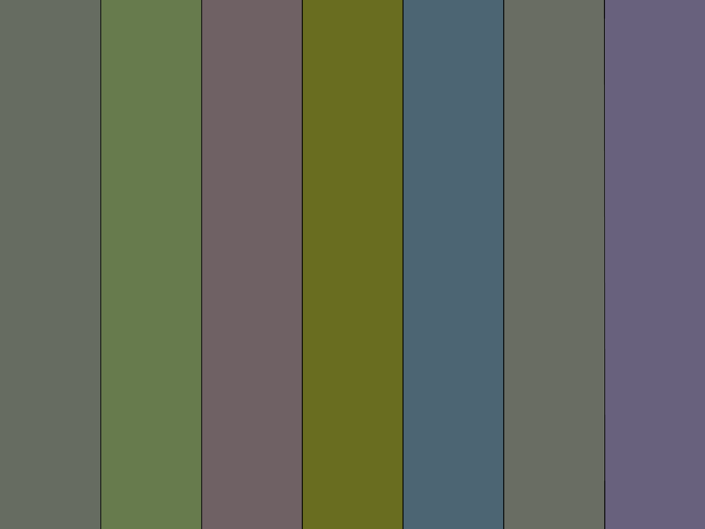

Challenge 3

In the previous challenge, we got a PNG file.



Nothing too interesting here.

Let's take a look at its attributes:

```console
root@kali:/media/sf_CTFs/hoshen/1/_Sukkah.jpg.extracted# exiftool Payload.png
ExifTool Version Number         : 11.10
File Name                       : Payload.png
Directory                       : .
File Size                       : 27 kB
File Modification Date/Time     : 2020:08:07 12:25:43+03:00
File Access Date/Time           : 2020:09:17 21:19:00+03:00
File Inode Change Date/Time     : 2020:09:17 21:19:49+03:00
File Permissions                : rwxrwx---
File Type                       : PNG
File Type Extension             : png
MIME Type                       : image/png
Image Width                     : 2100
Image Height                    : 1575
Bit Depth                       : 8
Color Type                      : Palette
Compression                     : Deflate/Inflate
Filter                          : Adaptive
Interlace                       : Noninterlaced
SRGB Rendering                  : Perceptual
Gamma                           : 2.2
Palette                         : (Binary data 768 bytes, use -b option to extract)
Pixels Per Unit X               : 3779
Pixels Per Unit Y               : 3779
Pixel Units                     : meters
Image Size                      : 2100x1575
Megapixels                      : 3.3
```

The interesting thing here is that there's a custom palette. We can view it with `PNGCheck`:

```console
root@kali:/media/sf_CTFs/hoshen/1/_Sukkah.jpg.extracted# pngcheck -vtp7f Payload.png
File: Payload.png (27397 bytes)
  chunk IHDR at offset 0x0000c, length 13
    2100 x 1575 image, 8-bit palette, non-interlaced
  chunk sRGB at offset 0x00025, length 1
    rendering intent = perceptual
  chunk gAMA at offset 0x00032, length 4: 0.45455
  chunk PLTE at offset 0x00042, length 768: 256 palette entries
      0:  (  0,  0,  0) = (0x00,0x00,0x00)
      1:  (  3,  3,  3) = (0x03,0x03,0x03)
      2:  (  7, 10, 11) = (0x07,0x0a,0x0b)
      3:  ( 10, 11,  3) = (0x0a,0x0b,0x03)
      4:  ( 11,  9, 10) = (0x0b,0x09,0x0a)
      5:  ( 10, 11, 10) = (0x0a,0x0b,0x0a)
      6:  ( 10,  9, 12) = (0x0a,0x09,0x0c)
      7:  ( 13, 14, 12) = (0x0d,0x0e,0x0c)
      8:  ( 24, 23, 27) = (0x18,0x17,0x1b)
      9:  ( 33, 33, 32) = (0x21,0x21,0x20)
     10:  ( 45, 46, 44) = (0x2d,0x2e,0x2c)
     11:  ( 45, 43, 49) = (0x2d,0x2b,0x31)
     12:  ( 65, 77, 53) = (0x41,0x4d,0x35)
     13:  (105,109, 32) = (0x69,0x6d,0x20)
     14:  ( 71, 69, 77) = (0x47,0x45,0x4d)
     15:  ( 75, 76, 73) = (0x4b,0x4c,0x49)
     16:  ( 74, 72, 80) = (0x4a,0x48,0x50)
     17:  ( 81, 79, 87) = (0x51,0x4f,0x57)
     18:  ( 87, 88, 85) = (0x57,0x58,0x55)
     19:  ( 76,101,115) = (0x4c,0x65,0x73)
     20:  (103,123, 77) = (0x67,0x7b,0x4d)
     21:  ( 99,100, 97) = (0x63,0x64,0x61)
     22:  ( 98, 96,106) = (0x62,0x60,0x6a)
     23:  (102,108, 97) = (0x66,0x6c,0x61)
     24:  (111, 97,100) = (0x6f,0x61,0x64)
     25:  (105,109, 99) = (0x69,0x6d,0x63)
     26:  (104, 97,125) = (0x68,0x61,0x7d)
     27:  (111,108,119) = (0x6f,0x6c,0x77)
     28:  (117,120,111) = (0x75,0x78,0x6f)
     29:  (115,117,113) = (0x73,0x75,0x71)
     30:  (117,119,114) = (0x75,0x77,0x72)
     31:  (117,114,126) = (0x75,0x72,0x7e)
     32:  (121,123,118) = (0x79,0x7b,0x76)
     33:  (119,113,137) = (0x77,0x71,0x89)
     34:  (130,126,141) = (0x82,0x7e,0x8d)
     35:  (131,133,127) = (0x83,0x85,0x7f)
     36:  (137,140,134) = (0x89,0x8c,0x86)
     37:  (139,141,135) = (0x8b,0x8d,0x87)
     38:  (139,142,136) = (0x8b,0x8e,0x88)
     39:  (135,131,146) = (0x87,0x83,0x92)
     40:  (138,134,151) = (0x8a,0x86,0x97)
     41:  (141,136,155) = (0x8d,0x88,0x9b)
     42:  (141,137,156) = (0x8d,0x89,0x9c)
     43:  (142,145,138) = (0x8e,0x91,0x8a)
     44:  (  0,  0,  0) = (0x00,0x00,0x00)
     45:  (  0,  0,  0) = (0x00,0x00,0x00)
     46:  (  0,  0,  0) = (0x00,0x00,0x00)
     47:  (  0,  0,  0) = (0x00,0x00,0x00)
     48:  (  0,  0,  0) = (0x00,0x00,0x00)
     49:  (  0,  0,  0) = (0x00,0x00,0x00)
     50:  (  0,  0,  0) = (0x00,0x00,0x00)
     51:  (  0,  0,  0) = (0x00,0x00,0x00)
     52:  (  0,  0,  0) = (0x00,0x00,0x00)
     53:  (  0,  0,  0) = (0x00,0x00,0x00)
     54:  (  0,  0,  0) = (0x00,0x00,0x00)
     55:  (  0,  0,  0) = (0x00,0x00,0x00)
     56:  (  0,  0,  0) = (0x00,0x00,0x00)
     57:  (  0,  0,  0) = (0x00,0x00,0x00)
     58:  (  0,  0,  0) = (0x00,0x00,0x00)
     59:  (  0,  0,  0) = (0x00,0x00,0x00)
     60:  (  0,  0,  0) = (0x00,0x00,0x00)
     61:  (  0,  0,  0) = (0x00,0x00,0x00)
     62:  (  0,  0,  0) = (0x00,0x00,0x00)
     63:  (  0,  0,  0) = (0x00,0x00,0x00)
     64:  (  0,  0,  0) = (0x00,0x00,0x00)
     65:  (  0,  0,  0) = (0x00,0x00,0x00)
     66:  (  0,  0,  0) = (0x00,0x00,0x00)
     67:  (  0,  0,  0) = (0x00,0x00,0x00)
     68:  (  0,  0,  0) = (0x00,0x00,0x00)
     69:  (  0,  0,  0) = (0x00,0x00,0x00)
     70:  (  0,  0,  0) = (0x00,0x00,0x00)
     71:  (  0,  0,  0) = (0x00,0x00,0x00)
     72:  (  0,  0,  0) = (0x00,0x00,0x00)
     73:  (  0,  0,  0) = (0x00,0x00,0x00)
     74:  (  0,  0,  0) = (0x00,0x00,0x00)
     75:  (  0,  0,  0) = (0x00,0x00,0x00)
     76:  (  0,  0,  0) = (0x00,0x00,0x00)
     77:  (  0,  0,  0) = (0x00,0x00,0x00)
     78:  (  0,  0,  0) = (0x00,0x00,0x00)
     79:  (  0,  0,  0) = (0x00,0x00,0x00)
     80:  (  0,  0,  0) = (0x00,0x00,0x00)
     81:  (  0,  0,  0) = (0x00,0x00,0x00)
     82:  (  0,  0,  0) = (0x00,0x00,0x00)
     83:  (  0,  0,  0) = (0x00,0x00,0x00)
     84:  (  0,  0,  0) = (0x00,0x00,0x00)
     85:  (  0,  0,  0) = (0x00,0x00,0x00)
     86:  (  0,  0,  0) = (0x00,0x00,0x00)
     87:  (  0,  0,  0) = (0x00,0x00,0x00)
     88:  (  0,  0,  0) = (0x00,0x00,0x00)
     89:  (  0,  0,  0) = (0x00,0x00,0x00)
     90:  (  0,  0,  0) = (0x00,0x00,0x00)
     91:  (  0,  0,  0) = (0x00,0x00,0x00)
     92:  (  0,  0,  0) = (0x00,0x00,0x00)
     93:  (  0,  0,  0) = (0x00,0x00,0x00)
     94:  (  0,  0,  0) = (0x00,0x00,0x00)
     95:  (  0,  0,  0) = (0x00,0x00,0x00)
     96:  (  0,  0,  0) = (0x00,0x00,0x00)
     97:  (  0,  0,  0) = (0x00,0x00,0x00)
     98:  (  0,  0,  0) = (0x00,0x00,0x00)
     99:  (  0,  0,  0) = (0x00,0x00,0x00)
    100:  (  0,  0,  0) = (0x00,0x00,0x00)
    101:  (  0,  0,  0) = (0x00,0x00,0x00)
    102:  (  0,  0,  0) = (0x00,0x00,0x00)
    103:  (  0,  0,  0) = (0x00,0x00,0x00)
    104:  (  0,  0,  0) = (0x00,0x00,0x00)
    105:  (  0,  0,  0) = (0x00,0x00,0x00)
    106:  (  0,  0,  0) = (0x00,0x00,0x00)
    107:  (  0,  0,  0) = (0x00,0x00,0x00)
    108:  (  0,  0,  0) = (0x00,0x00,0x00)
    109:  (  0,  0,  0) = (0x00,0x00,0x00)
    110:  (  0,  0,  0) = (0x00,0x00,0x00)
    111:  (  0,  0,  0) = (0x00,0x00,0x00)
    112:  (  0,  0,  0) = (0x00,0x00,0x00)
    113:  (  0,  0,  0) = (0x00,0x00,0x00)
    114:  (  0,  0,  0) = (0x00,0x00,0x00)
    115:  (  0,  0,  0) = (0x00,0x00,0x00)
    116:  (  0,  0,  0) = (0x00,0x00,0x00)
    117:  (  0,  0,  0) = (0x00,0x00,0x00)
    118:  (  0,  0,  0) = (0x00,0x00,0x00)
    119:  (  0,  0,  0) = (0x00,0x00,0x00)
    120:  (  0,  0,  0) = (0x00,0x00,0x00)
    121:  (  0,  0,  0) = (0x00,0x00,0x00)
    122:  (  0,  0,  0) = (0x00,0x00,0x00)
    123:  (  0,  0,  0) = (0x00,0x00,0x00)
    124:  (  0,  0,  0) = (0x00,0x00,0x00)
    125:  (  0,  0,  0) = (0x00,0x00,0x00)
    126:  (  0,  0,  0) = (0x00,0x00,0x00)
    127:  (  0,  0,  0) = (0x00,0x00,0x00)
    128:  (  0,  0,  0) = (0x00,0x00,0x00)
    129:  (  0,  0,  0) = (0x00,0x00,0x00)
    130:  (  0,  0,  0) = (0x00,0x00,0x00)
    131:  (  0,  0,  0) = (0x00,0x00,0x00)
    132:  (  0,  0,  0) = (0x00,0x00,0x00)
    133:  (  0,  0,  0) = (0x00,0x00,0x00)
    134:  (  0,  0,  0) = (0x00,0x00,0x00)
    135:  (  0,  0,  0) = (0x00,0x00,0x00)
    136:  (  0,  0,  0) = (0x00,0x00,0x00)
    137:  (  0,  0,  0) = (0x00,0x00,0x00)
    138:  (  0,  0,  0) = (0x00,0x00,0x00)
    139:  (  0,  0,  0) = (0x00,0x00,0x00)
    140:  (  0,  0,  0) = (0x00,0x00,0x00)
    141:  (  0,  0,  0) = (0x00,0x00,0x00)
    142:  (  0,  0,  0) = (0x00,0x00,0x00)
    143:  (  0,  0,  0) = (0x00,0x00,0x00)
    144:  (  0,  0,  0) = (0x00,0x00,0x00)
    145:  (  0,  0,  0) = (0x00,0x00,0x00)
    146:  (  0,  0,  0) = (0x00,0x00,0x00)
    147:  (  0,  0,  0) = (0x00,0x00,0x00)
    148:  (  0,  0,  0) = (0x00,0x00,0x00)
    149:  (  0,  0,  0) = (0x00,0x00,0x00)
    150:  (  0,  0,  0) = (0x00,0x00,0x00)
    151:  (  0,  0,  0) = (0x00,0x00,0x00)
    152:  (  0,  0,  0) = (0x00,0x00,0x00)
    153:  (  0,  0,  0) = (0x00,0x00,0x00)
    154:  (  0,  0,  0) = (0x00,0x00,0x00)
    155:  (  0,  0,  0) = (0x00,0x00,0x00)
    156:  (  0,  0,  0) = (0x00,0x00,0x00)
    157:  (  0,  0,  0) = (0x00,0x00,0x00)
    158:  (  0,  0,  0) = (0x00,0x00,0x00)
    159:  (  0,  0,  0) = (0x00,0x00,0x00)
    160:  (  0,  0,  0) = (0x00,0x00,0x00)
    161:  (  0,  0,  0) = (0x00,0x00,0x00)
    162:  (  0,  0,  0) = (0x00,0x00,0x00)
    163:  (  0,  0,  0) = (0x00,0x00,0x00)
    164:  (  0,  0,  0) = (0x00,0x00,0x00)
    165:  (  0,  0,  0) = (0x00,0x00,0x00)
    166:  (  0,  0,  0) = (0x00,0x00,0x00)
    167:  (  0,  0,  0) = (0x00,0x00,0x00)
    168:  (  0,  0,  0) = (0x00,0x00,0x00)
    169:  (  0,  0,  0) = (0x00,0x00,0x00)
    170:  (  0,  0,  0) = (0x00,0x00,0x00)
    171:  (  0,  0,  0) = (0x00,0x00,0x00)
    172:  (  0,  0,  0) = (0x00,0x00,0x00)
    173:  (  0,  0,  0) = (0x00,0x00,0x00)
    174:  (  0,  0,  0) = (0x00,0x00,0x00)
    175:  (  0,  0,  0) = (0x00,0x00,0x00)
    176:  (  0,  0,  0) = (0x00,0x00,0x00)
    177:  (  0,  0,  0) = (0x00,0x00,0x00)
    178:  (  0,  0,  0) = (0x00,0x00,0x00)
    179:  (  0,  0,  0) = (0x00,0x00,0x00)
    180:  (  0,  0,  0) = (0x00,0x00,0x00)
    181:  (  0,  0,  0) = (0x00,0x00,0x00)
    182:  (  0,  0,  0) = (0x00,0x00,0x00)
    183:  (  0,  0,  0) = (0x00,0x00,0x00)
    184:  (  0,  0,  0) = (0x00,0x00,0x00)
    185:  (  0,  0,  0) = (0x00,0x00,0x00)
    186:  (  0,  0,  0) = (0x00,0x00,0x00)
    187:  (  0,  0,  0) = (0x00,0x00,0x00)
    188:  (  0,  0,  0) = (0x00,0x00,0x00)
    189:  (  0,  0,  0) = (0x00,0x00,0x00)
    190:  (  0,  0,  0) = (0x00,0x00,0x00)
    191:  (  0,  0,  0) = (0x00,0x00,0x00)
    192:  (  0,  0,  0) = (0x00,0x00,0x00)
    193:  (  0,  0,  0) = (0x00,0x00,0x00)
    194:  (  0,  0,  0) = (0x00,0x00,0x00)
    195:  (  0,  0,  0) = (0x00,0x00,0x00)
    196:  (  0,  0,  0) = (0x00,0x00,0x00)
    197:  (  0,  0,  0) = (0x00,0x00,0x00)
    198:  (  0,  0,  0) = (0x00,0x00,0x00)
    199:  (  0,  0,  0) = (0x00,0x00,0x00)
    200:  (  0,  0,  0) = (0x00,0x00,0x00)
    201:  (  0,  0,  0) = (0x00,0x00,0x00)
    202:  (  0,  0,  0) = (0x00,0x00,0x00)
    203:  (  0,  0,  0) = (0x00,0x00,0x00)
    204:  (  0,  0,  0) = (0x00,0x00,0x00)
    205:  (  0,  0,  0) = (0x00,0x00,0x00)
    206:  (  0,  0,  0) = (0x00,0x00,0x00)
    207:  (  0,  0,  0) = (0x00,0x00,0x00)
    208:  (  0,  0,  0) = (0x00,0x00,0x00)
    209:  (  0,  0,  0) = (0x00,0x00,0x00)
    210:  (  0,  0,  0) = (0x00,0x00,0x00)
    211:  (  0,  0,  0) = (0x00,0x00,0x00)
    212:  (  0,  0,  0) = (0x00,0x00,0x00)
    213:  (  0,  0,  0) = (0x00,0x00,0x00)
    214:  (  0,  0,  0) = (0x00,0x00,0x00)
    215:  (  0,  0,  0) = (0x00,0x00,0x00)
    216:  (  0,  0,  0) = (0x00,0x00,0x00)
    217:  (  0,  0,  0) = (0x00,0x00,0x00)
    218:  (  0,  0,  0) = (0x00,0x00,0x00)
    219:  (  0,  0,  0) = (0x00,0x00,0x00)
    220:  (  0,  0,  0) = (0x00,0x00,0x00)
    221:  (  0,  0,  0) = (0x00,0x00,0x00)
    222:  (  0,  0,  0) = (0x00,0x00,0x00)
    223:  (  0,  0,  0) = (0x00,0x00,0x00)
    224:  (  0,  0,  0) = (0x00,0x00,0x00)
    225:  (  0,  0,  0) = (0x00,0x00,0x00)
    226:  (  0,  0,  0) = (0x00,0x00,0x00)
    227:  (  0,  0,  0) = (0x00,0x00,0x00)
    228:  (  0,  0,  0) = (0x00,0x00,0x00)
    229:  (  0,  0,  0) = (0x00,0x00,0x00)
    230:  (  0,  0,  0) = (0x00,0x00,0x00)
    231:  (  0,  0,  0) = (0x00,0x00,0x00)
    232:  (  0,  0,  0) = (0x00,0x00,0x00)
    233:  (  0,  0,  0) = (0x00,0x00,0x00)
    234:  (  0,  0,  0) = (0x00,0x00,0x00)
    235:  (  0,  0,  0) = (0x00,0x00,0x00)
    236:  (  0,  0,  0) = (0x00,0x00,0x00)
    237:  (  0,  0,  0) = (0x00,0x00,0x00)
    238:  (  0,  0,  0) = (0x00,0x00,0x00)
    239:  (  0,  0,  0) = (0x00,0x00,0x00)
    240:  (  0,  0,  0) = (0x00,0x00,0x00)
    241:  (  0,  0,  0) = (0x00,0x00,0x00)
    242:  (  0,  0,  0) = (0x00,0x00,0x00)
    243:  (  0,  0,  0) = (0x00,0x00,0x00)
    244:  (  0,  0,  0) = (0x00,0x00,0x00)
    245:  (  0,  0,  0) = (0x00,0x00,0x00)
    246:  (  0,  0,  0) = (0x00,0x00,0x00)
    247:  (  0,  0,  0) = (0x00,0x00,0x00)
    248:  (  0,  0,  0) = (0x00,0x00,0x00)
    249:  (  0,  0,  0) = (0x00,0x00,0x00)
    250:  (  0,  0,  0) = (0x00,0x00,0x00)
    251:  (  0,  0,  0) = (0x00,0x00,0x00)
    252:  (  0,  0,  0) = (0x00,0x00,0x00)
    253:  (  0,  0,  0) = (0x00,0x00,0x00)
    254:  (  0,  0,  0) = (0x00,0x00,0x00)
    255:  (  0,  0,  0) = (0x00,0x00,0x00)
  chunk pHYs at offset 0x0034e, length 9: 3779x3779 pixels/meter (96 dpi)
  chunk IDAT at offset 0x00363, length 26510
    zlib: deflated, 32K window, fast compression
  chunk IEND at offset 0x06afd, length 0
No errors detected in Payload.png (7 chunks, 99.2% compression).
```

Some of these values definitely look like ASCII, instead of RGB values! 

We can take a look using a HEX editor to get a better sense:

```console
root@kali:/media/sf_CTFs/hoshen/1/_Sukkah.jpg.extracted# xxd -g 1 -s 0x42 -l 128 Payload.png
00000042: 50 4c 54 45 00 00 00 03 03 03 07 0a 0b 0a 0b 03  PLTE............
00000052: 0b 09 0a 0a 0b 0a 0a 09 0c 0d 0e 0c 18 17 1b 21  ...............!
00000062: 21 20 2d 2e 2c 2d 2b 31 41 4d 35 69 6d 20 47 45  ! -.,-+1AM5im GE
00000072: 4d 4b 4c 49 4a 48 50 51 4f 57 57 58 55 4c 65 73  MKLIJHPQOWWXULes
00000082: 67 7b 4d 63 64 61 62 60 6a 66 6c 61 6f 61 64 69  g{Mcdab`jflaoadi
00000092: 6d 63 68 61 7d 6f 6c 77 75 78 6f 73 75 71 75 77  mcha}olwuxosuquw
000000a2: 72 75 72 7e 79 7b 76 77 71 89 82 7e 8d 83 85 7f  rur~y{vwq..~....
000000b2: 89 8c 86 8b 8d 87 8b 8e 88 87 83 92 8a 86 97 8d  ................
```

In short, the PNG palette (which is the PNG chunk starting with `PLTE`) is a custom table that maps pixel values to RBG values.

> The PLTE chunk contains from 1 to 256 palette entries, each a three-byte series of the form:
> ```
>   Red:   1 byte (0 = black, 255 = red)
>   Green: 1 byte (0 = black, 255 = green)
>   Blue:  1 byte (0 = black, 255 = blue)
> ```
> (Source: [PNG (Portable Network Graphics) Specification, Version 1.1](http://www.libpng.org/pub/png/spec/1.1/PNG-Chunks.html))

In our example, a pixel with the value of `0` would be mapped to the color `#000000`, a pixel with the value of `1` would be mapped to the color `#030303` and so on. What's our of the ordinary here is that many pixels are mapped to colors which can also be interpreted as ASCII text, and this doesn't usually happen by chance.

We have seven stripes in the image. What happens if we check the color of each stripe, and interpret the RGB value as ASCII?

For example, let's take the first stripe. We'll use Python to sample the color of the first stripe by sampling the pixel value at (0, 0):
```python
>>> from PIL import Image
>>> img = Image.open("Payload.png")
>>> pixels = img.load()
>>> print(pixels[0, 0])
23
```

The pixel value is `23`. We've seen earlier that entry 23 is mapped to the following RBG values:
```
23:  (102,108, 97) = (0x66,0x6c,0x61)
```

And if we interpret them as ASCII, we get:
```python
>>> "".join(chr(c) for c in [0x66,0x6c,0x61])
'fla'
```

That looks like the beginning of "flag". Let's continue sampling all the other stripes using the following script:

```python
from PIL import Image

NUM_STRIPES = 7

img = Image.open("Payload.png")
rgb_im = img.convert('RGB') # Apply the custom palette

width, height = img.size

# We'll sample the color of each stripe by checking the 
# RGB value of a pixel in the center of the stripe
center_height = height // 2
stripe_width = width // NUM_STRIPES
center_stripe = stripe_width // 2

flag = ""

x = center_stripe
for i in range(NUM_STRIPES):
    for val in rgb_im.getpixel((x, center_height)): # getpixel returns (r, g, b)
        flag += chr(val)

    # Jump to next stripe
    x += stripe_width

print(flag)
```

Output:
```console
root@kali:/media/sf_CTFs/hoshen/1/_Sukkah.jpg.extracted# python3 solve.py
flag{Moadim Lesimcha}
```

Happy holidays!