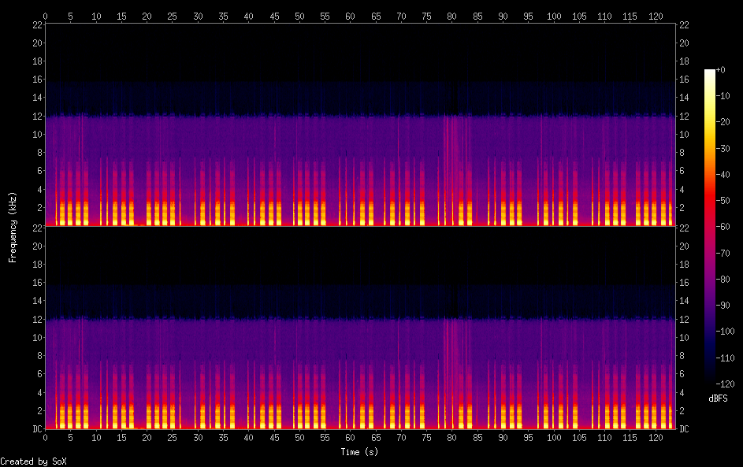

# Intro

Our entry point is a 2-minute [YouTube Video](https://youtu.be/KdBf-wvEaCM) which contains a [Shofar blowing](https://en.wikipedia.org/wiki/Shofar_blowing) - a religious ritual which consists of blowing a horn for short and long blasts. Translated to the world of CTFs, this usually means either binary encoding or morse code. Since there are long pauses between every few blasts, morse code seems like a better choice.

Let's start by downloading the audio in order to later analyze it using tools:

```console
root@kali:/media/sf_CTFs/hoshen/intro# python3 -m youtube_dl --extract-audio --audio-format wav https://youtu.be/KdBf-wvEaCM -o "%(id)s.%(ext)s"
[youtube] KdBf-wvEaCM: Downloading webpage
[download] Destination: KdBf-wvEaCM.m4a
[download] 100% of 1.91MiB in 00:00
[ffmpeg] Correcting container in "KdBf-wvEaCM.m4a"
[ffmpeg] Destination: KdBf-wvEaCM.wav
Deleting original file KdBf-wvEaCM.m4a (pass -k to keep)
```

Now, we can view the audio file spectrogram:
```console
root@kali:/media/sf_CTFs/hoshen/intro# sox KdBf-wvEaCM.wav -n spectrogram
```

Output:


We can easily see the dots and dashes, we just need to translate them to text:

```console
root@kali:/media/sf_CTFs/hoshen/intro# export NODE_PATH=$(npm root --quiet -g)
root@kali:/media/sf_CTFs/hoshen/intro# node
> const chef = require("cyberchef");
undefined
> chef.fromMorseCode(".---- ..--- ----. .-.-.- ..--- .---- ...-- .-.-.- ...-- ..--- .-.-.- ..--- -----").toString()
'129.213.32.20'
```

Looks like we got an IP.