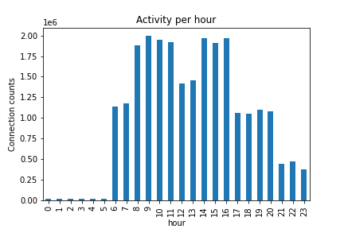

# Data Science 1
Category: Data Science, 150 points


## Description

> Welcome to the Data Science for Cyber Defense Challenge!
> 
> In this challenge you are presented with network logs of a mid-size organization. An anonymous source reported that the network has been compromised by not just one, but 4 different types of malware. Your objective is to analyze the logs and discover the infected endpoints.
> 
> Each correct identification of endpoints that have been attacked by a given malware type will grant you a flag.
> 
> All together there are 4 flags, corresponding to the 4 malware types. 
> 
> 
> The network logs are given in the challenge.csv file which contains the following columns:
> 
> * timestamp
> * src_ip
> * dst_ip
> * src_port
> * dst_port
> * protocol
> * payload
> 
> Submission Guidelines
> 
> Submission of suspected endpoints should be in the example submission_example.csv format below. Each submission should contain the endpoints infected by a single malware type. Note that a single endpoint may be infected by at most one malware type.
> 
> Scoring
> 
> The submission score is the maximal F1 score https://en.wikipedia.org/wiki/F-score corresponding to any of the four malware types, and is calculated as follows: drawing
> 
> A minimal score of 0.8 is required in order to gain the flag which corresponds to the best-detected malware type.
> 
> Can you gain all four flags?


## Solution:

### Introduction

In this challenge we need to find anomalies in the attached network traffic dump which indicate infected hosts.

Here's a sample from the network dump:

```console
root@kali:/media/sf_CTFs/shabak/DataScience# cat challenge.csv | head
timestamp,src_ip,dst_ip,src_port,dst_port,protocol,payload
2020-06-21 00:00:02.892702,120.18.164.170,120.18.53.84,2459,53,UDP,218
2020-06-21 00:00:03.771702,120.18.53.84,120.18.164.170,53,2459,UDP,285
2020-06-21 00:00:03.989702,120.18.164.170,148.26.83.117,2495,443,TCP,142
2020-06-21 00:00:04.547702,148.26.83.117,120.18.164.170,443,2495,TCP,130
2020-06-21 00:00:05.170953,120.18.187.161,120.18.63.42,3487,1993,TCP,69
2020-06-21 00:00:05.691953,120.18.63.42,120.18.187.161,1993,3487,TCP,243
2020-06-21 00:00:06.124702,120.18.164.170,148.26.83.117,2495,443,TCP,110
2020-06-21 00:00:07.230702,148.26.83.117,120.18.164.170,443,2495,TCP,277
2020-06-21 00:00:08.522702,120.18.164.170,148.26.83.117,2495,443,TCP,198
```

It's pretty long:
```console
root@kali:/media/sf_CTFs/shabak/DataScience# wc -l challenge.csv
24456694 challenge.csv
```

We found a great reference for these kind of challenges [here](https://www.kaggle.com/hawkcurry/data-analysis-for-network-security-101-solution), and our solutions are based on it with some modifications.

We'll use `pandas` for the challenge. The reference suggests starting with some basic preprocessing in order to make queries more efficient:

```python
import pandas as pd 
import numpy as np
import matplotlib.pyplot as plt
import gc

df = pd.read_csv(
    'challenge.csv',
    header = 0, 
    names= ["timestamp", "src_ip", "dst_ip", "src_port", "dst_port", "protocol", "payload"]
)

df['timestamp'] = pd.to_datetime(df.timestamp, format='%Y-%m-%d %H:%M:%S.%f')
df['hour']      = df.timestamp.dt.hour.astype('uint8')
df['minute']    = df.timestamp.dt.minute.astype('uint8')
df['src_port']  = df['src_port'].astype('uint16')
df['dst_port']  = df['dst_port'].astype('uint16')
df.head()

all_ips = set(df['src_ip'].unique()) | set(df['dst_ip'].unique())
print('Unique src:', df['src_ip'].nunique())
print('Unique dst:', df['dst_ip'].nunique())
print('Total Unique IPs:', len(all_ips))

ip_type = pd.CategoricalDtype(categories=all_ips)
df['src_ip'] = df['src_ip'].astype(ip_type)
df['dst_ip'] = df['dst_ip'].astype(ip_type)
gc.collect()
```

Output:
```
Unique src: 5497
Unique dst: 5497
Total Unique IPs: 5497
```

Nothing much here, just parsing some fields and setting up the source and destination IPs to categorical in order to save on memory.

Also, we'd like to identify the network prefix for our corporate network. Let's see which network prefixes are used most in the dump:

```python
def get_network_prefix(s):
    return s.str.split(".").str[0]
df['src_network_prefix'] = get_network_prefix(df['src_ip'])
df.drop_duplicates("src_ip").groupby("src_network_prefix").size().sort_values(ascending=False)
```

Output:

```
src_network_prefix
120    523
142     38
131     32
100     30
7       30
      ... 
170     11
213     11
8       10
193     10
95       9
Length: 254, dtype: int64
```

From here it looks like our `120` is by far the most common network prefix, we'll assume it belongs to our corporation. We can add some convenient attributes via:

```python
def is_internal(s):
    return s.str.startswith('120.') 

df['src_int'] = is_internal(df['src_ip'])
df['dst_int'] = is_internal(df['dst_ip'])
```

### Flag A

For the first flag, we'll check traffic outside work hours.

First, we need to identify work hours:

```python
df.groupby('hour').size()\
  .plot.bar(title='Activity per hour')\
  .set_ylabel('Connection counts').get_figure().savefig('hours.png')
```

Output:



It should be pretty clear from the graph that work hours are 06:00-23:00. So, let's see who are the most active external hosts outside work hours:

```python
df[df['src_int'] & ~df['dst_int'] & ((df['hour'] >= 0) & (df['hour'] < 6))]\
  .groupby('dst_ip')\
  .size()\
  .pipe(lambda x: x[x > 0])\
  .sort_values(ascending=False).reset_index()
```

Output:
```
      dst_ip             0
0     148.26.83.117     3475
1     5.183.60.54       3467
2     251.139.203.226   355
3     250.42.245.153    330
4     8.8.8.8           279
5     234.8.152.205     218
6     55.107.247.62     51
7     24.161.197.98     34
8     198.70.42.36      12
9     15.254.213.206    5
10     80.213.210.227   1
11     65.64.19.34      1
12     21.91.160.44     1
13     112.146.59.67    1
14     242.138.45.182   1
```

We can see that that the number of requests to `148.26.83.117` and `5.183.60.54` is dramatically higher than the rest. So, let's gather up that hosts that made requests to these two hosts:

```python
df[df['src_int'] & ~df['dst_int'] & df['dst_ip'].isin(["148.26.83.117", "5.183.60.54"]) & ((df['hour'] >= 0) & (df['hour'] < 6))]\
  .drop_duplicates("src_ip")["src_ip"]
```

Output:

```
2       120.18.164.170
31      120.18.213.107
65      120.18.192.121
186     120.18.206.150
220     120.18.120.241
240      120.18.118.50
318      120.18.104.36
398     120.18.216.242
432      120.18.48.222
480      120.18.18.124
498      120.18.45.124
521       120.18.26.88
592       120.18.57.96
797     120.18.162.115
963      120.18.143.87
996     120.18.182.116
1005     120.18.110.15
1119     120.18.66.102
1242     120.18.23.222
1335      120.18.71.37
1353      120.18.88.93
1506    120.18.159.247
1614    120.18.178.138
1629     120.18.143.73
1775    120.18.218.147
1777    120.18.132.135
1856    120.18.173.154
1902    120.18.168.250
2005     120.18.157.13
2318     120.18.103.76
2385    120.18.205.198
2406      120.18.96.34
2416    120.18.171.175
2433     120.18.55.138
2460      120.18.9.187
2852     120.18.207.47
2988    120.18.195.179
3105     120.18.251.35
3187      120.18.27.78
3281     120.18.235.29
3314     120.18.202.14
3481    120.18.156.202
Name: src_ip, dtype: category
Categories (5497, object): ['24.133.117.23', '138.62.106.170', '92.150.22.192', '209.69.254.129', ..., '173.119.192.16', '177.66.191.51', '178.195.62.138', '120.121.209.92']
```

We can export everything nicely to a CSV file according to the requested format:

```python
df[df['src_int'] & ~df['dst_int'] & df['dst_ip'].isin(["148.26.83.117", "5.183.60.54"]) & ((df['hour'] >= 0) & (df['hour'] < 6))]\
  .drop_duplicates("src_ip")["src_ip"].to_csv("flag_a.csv", index = False, header = ["ip"])
```

Output:
```
ip
120.18.164.170
120.18.213.107
120.18.192.121
120.18.206.150
120.18.120.241
120.18.118.50
120.18.104.36
120.18.216.242
120.18.48.222
120.18.18.124
120.18.45.124
120.18.26.88
120.18.57.96
120.18.162.115
120.18.143.87
120.18.182.116
120.18.110.15
120.18.66.102
120.18.23.222
120.18.71.37
120.18.88.93
120.18.159.247
120.18.178.138
120.18.143.73
120.18.218.147
120.18.132.135
120.18.173.154
120.18.168.250
120.18.157.13
120.18.103.76
120.18.205.198
120.18.96.34
120.18.171.175
120.18.55.138
120.18.9.187
120.18.207.47
120.18.195.179
120.18.251.35
120.18.27.78
120.18.235.29
120.18.202.14
120.18.156.202
```

And we get our first flag:

```
Congratulations! You achieved the goal. Here is your flag: 

flag{hsjhjskdhjkhdjksd673276327sb}
```