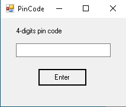
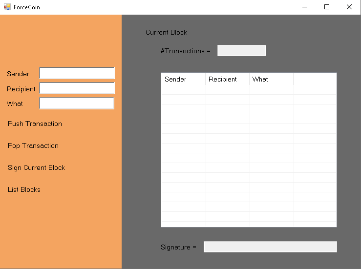

# ForceCoin
Category: Reversing, 150 points


## Description

> Our agent from the field has obtained a few files related to a program that is used by a terrorist organization!
> 
> This zip contains the program and a db file.
> 
> We need your help parsing the db!
> 
> Give it your best, we heard that they use it and that it might contain some intresting information for you!
> 
> Good Luck !!


## Solution:

Let's see what we got:

```console
root@kali:/media/sf_CTFs/shabak/ForceCoin/ForceCoin# ls
db.txt.enc  ForceCoin.exe  ForceCoinTransactionSigner.dll.enc
root@kali:/media/sf_CTFs/shabak/ForceCoin/ForceCoin# file ForceCoin.exe
ForceCoin.exe: PE32 executable (GUI) Intel 80386 Mono/.Net assembly, for MS Windows
```

We have a `.NET` application and two encrypted files. Let's run the application:



So, before anything else, we just tried to brute force it with a simple `*.vbs` script that interacts with the GUI:

```vbs
Set objShell = WScript.CreateObject("WScript.Shell")

Function SendKeysTo (keys, wait)
    objShell.AppActivate "PinCode"
    objShell.SendKeys keys
    WScript.Sleep wait
End Function

Function LPad(s, l, c)
  Dim n : n = 0
  If l > Len(s) Then n = l - Len(s)
  LPad = String(n, c) & s
End Function

WScript.Sleep 500

Dim x
x=0
Do 
SendKeysTo LPad(x, 4, "0"), 50
SendKeysTo "{Tab}{Enter}{Tab}", 50
x=x+1
Loop While x<10000
```

This script tries to enter all possible 4-digit combinations to the GUI. Unfortunately, That didn't work and we were forced to open the application with dotPeek:

```csharp
private void buttonCheckPin_Click(object sender, EventArgs e)
{
    string text = this.richTextBoxPinCode.Text;
    if (text.Length != 4)
    {
        this.richTextBoxPinCode.Text = "";
    }
    else
    {
        try
        {
            string input = text;
            string str = text;
            for (int index = 0; index < 10; ++index)
            {
                input = this.DoMD5(input);
                str = this.DoMD5(str);
            }
            for (int index = 0; index < 10; ++index)
                input = this.DoMD5(input);
            if ("2D3114BCC2E5C58BBAC77F04237723D9" == input)
            {
                byte[] byteArray = PinForm.StringToByteArray(str);
                this.DecryptFile(byteArray, "ForceCoinTransactionSigner.dll.enc", "ForceCoinTransactionSigner.dll");
                this.DecryptFile(byteArray, "db.txt.enc", "db.txt");
                AppForm appForm = new AppForm();
                this.Hide();
                int num = (int) appForm.ShowDialog();
                this.Close();
            }
        }
        catch (Exception ex)
        {
        }
        this.richTextBoxPinCode.Text = "";
    }
}
```

So we have the authentication logic, we just need to find the correct input.

```python
import hashlib
import itertools
import string

KEY_LEN = 4

def DoMD5(s):
    # C# hash returns an uppercase digest
    return hashlib.md5(s.encode('ascii')).hexdigest().upper()

def CheckPinLogic(text):
   _input = text
   _str = text
   for i in range(10):
      _input = DoMD5(_input)
      _str   = DoMD5(_str)
      
   for i in range(10):
      _input = DoMD5(_input)
      
   if _input == "2D3114BCC2E5C58BBAC77F04237723D9":
      return True
      
   return False

for x in list(itertools.permutations(string.ascii_letters + string.digits, KEY_LEN)):
   text = "".join(x)
   if CheckPinLogic(text):
      print(f"Found key: {text}")
      break
```

Since we've already tried just digits, we'll try also letters this time.

After a while, we get the key:

```console
root@kali:/media/sf_CTFs/shabak/ForceCoin/ForceCoin# python3 solve.py
Found key: 5cRt
```

Now we can finally access the application:



This looks like some blockchain application. If we click the "List Blocks" button, the database file is popped up:

```
3
4
Bob -> Alice [f623e75af30e62bbd73d6df5b50bb7b5, 0567953871b1bf589b797d9b178d5a94, 4eef13c0cb7c79813c798278770edc18, b8aa853d4a02f1024e92ec3626deb27f, 00e04f724e7a688bba85591f41cabc66, d29ff39e8237020708859fd83de7358b, 3e2396c3ffc5ceaf2cce64d121cd46cc, e93c0298d07705f4ea95116361fba84d, 5dd1e136eed6c8d7b3c05aedf806827e, 0c18777da528d26b0ba37d240f5bd850, 9401c1b5e67a9a0165473e929451b146, 4c305f18aa3ae7d854dab77edc862be2, 5d4cd43fef5d09c9a897a2d197c0e430, 4d8561461499e594d7bc0f6f3239cc98, 7ed760dcf05e798ddf2aea47518c8c26, 835f17ba47e4f10ec822331db625a441, 8e6e0d7f59dcbad7032301475d2c3cb5, 259d482498d9f2dae6d96dc3b343a908, e4aa532750a50837317716711b2dabdc, f07799cfe461de05a6327c5195f33a1d, 9b3d21619f85c27c7cb154ed6de16de2, e3e58f791778f6f20d745c5e6f0ae62f, 7ebb03bd0b04cc46dcdc8c4f48207dab, 92cc27585fefc1c21342415bb6b6bc5f, 6bacb7e544d2545fef9462c340ca4dd2, eaffb62f530c3266d1106d880ad620ee, 9d8859729b3cbd5e8b69a9942693c659, 24d27068f5de2bbad9b5acf38c97be2b, 347c3c0d886a55671c5a826fbfacb1a0, 85ffb85440a4ce7880a278ef0393b449, 228f416e2b0618bc895df5aa15b056a6, ad692bc711e46264c4b7da4956fa5ce3, 01489e6fc5c3489df27077365c807beb, 8b29bb17d2c92b480bc1bc2ea611037a, 1d39e3b97181079f5c2d37de0fd21d50]
Alice -> Bob [8d9c307cb7f3c4a32822a51922d1ceaa, bafd7322c6e97d25b6299b5d6fe8920b, b7e7f2b46723f5b08d763041108f8fed, e6662662a3f90aa497566c9b4a32f2f7]
Alice -> Bob [5dbc98dcc983a70728bd082d1a47546e, e2e0ab9c9510bf61fd17296bae8d3d24, 2341fcf59582cb2b44168f1b477bc850, 2d80c7c603f99c429891d40e30bf391d, 140208bb60fc3f70eabd068701030425]
Bob -> Alice [f186217753c37b9b9f958d906208506e, 8021f7e4b05dada0ad3d47567e52249e, d4f59cb9d92b06b80311ccf98a6c36e9, 20809e9ce9cfa9bcec5c7c157596be8e, b11794fedf37354635f9dcdfdd1ea986, 4bbbcb9c0429b23818385e2aaa78eba3, 91f43049eb069a16c64e8cb7b97d5350]
2
4
Eve -> Bob [f623e75af30e62bbd73d6df5b50bb7b5, 5961102bbf53b3ac0b9085f1ef3ce3f0, 74cac558072300385f7ab4dff7465e3c, ca1e34732138935e670be9745b9d6fda, 4d3b1fce14acd65b0bbc74ef99e442fc, 0eb7038095a03708d790c09416df98ed, 4c371a5ae215c756291050ad11f47295, 0289b549b48fba0dc7a62ecbfe4544bd, fad0ccdcb1ff0100bfdf5d60474d7bda, 0ca7f7803edf5efeef52c53be22a14b1, 67dcc1e581850ff946787245f94f429f, cfed45ab4163c9b28349461c0d379b21, b697fbcd1b3c01c7ba1bc141534f9742, 3eaf9d8ecc065405f2e9d1ea8cd2c85b, 0d62fd503ad84dc41a041f855a62d8bc, 44dc5b7f1eeae0c35dfee82aa3ed7211, 2dbc58343aece65fef79e0343033441a, 563892c5f5f287dd84b6e28841eabfef, 410cf34861427d616231ae1298e104fb, 2f1d21c0bb974843c48d82d1401fa78b, 4f017001710bcb5a2e75c12495dcd23c, 533c2a8cd88d556a5fd74af1429c3c64, fce20f9bd0ed98ce33aeeeee7cfa6ca9, fafe639205423835e5bdbfd9e7589c23]
Bob -> Eve [57cec4137b614c87cb4e24a3d003a3e0, 6f59522e39813f59db318cb3213c88a7, 93cba07454f06a4a960172bbd6e2a435]
Eve -> Bob [61e9c06ea9a85a5088a499df6458d276, 0cde1252d73b5bb4352e9287f281cca4, 5e29f4090282c1fcb15c056c422d3035, 124433700b3275084ede92789a9d83ef, b7d5a8283e1312b3c3f1abcc47e7c4a3, f1cdde159b709bae13ea3506b73adac7, e5ada0607010b08093ae3f0b2a87e424, f5ebd646252156067390952ea07cc3f2, 04c1c088dcc8f6d146a9ff9244f37690, fda5d38bbd076c9218cf22cfb972b1d6, 6d07b621f405abec582cca17872ff8bb]
Bob -> Eve [7fc56270e7a70fa81a5935b72eacbe29, 6743b9fcc57cf1b169fb4ef6c7a955d2, 7f8d39b96c384652402cb590295fcab3, f315b27a5484354d4d4d9ee1b1d15429, 1ee7151cd8e78f514896756884cd531a, d7ffbd3860fcf978d460f4be932c4074, b56597c2945f1a7108f4e04561290380, 096dbcd0fd48c0c79aec9a484caea349]
1
4
Bob -> Alice [69691c7bdcc3ce6d5d8a1361f22d04ac, 318b2739ddc2c16c97b33c9b04b79f3e, 7a065d8d264a13ab77ef872a209009f2, 687b3ed5777076a28b2406f12cff289c, e592dc10241656abaa7831a661d5dafa, d517d2874919c0197866ce46e4e6511d, 4c2a8fe7eaf24721cc7a9f0175115bd4, 866f4bc698cd86191b52d3771a0a87dc]
Alice -> Bob [57cec4137b614c87cb4e24a3d003a3e0, 6f59522e39813f59db318cb3213c88a7, 93cba07454f06a4a960172bbd6e2a435]
Alice -> Bob [8fa14cdd754f91cc6554c9e71929cce7, 3d296788f2a7e19ffbd912521d94a5f4, 61894b21be75260c4964065b1eecec4d, 327a6c4304ad5938eaf0efb6cc3e53dc, 4ff89342bb46cea91a288c3bed86e1b2, f368b01cf4b9d94958b8d860e36298a3, 20f75852e11a4ef192ccc33efc1dd41a, e7f7897cd91d0ce36851020e718e3e19, 849d8f0974d2a081d83330f7183604df, 884cb3cd32cb2a6d5c645432a344fbbb, bce419f01d3e788dc8b21e8a2c7abfdc, 7ed269b23f5aa08ff9027a1b798a79ac, 9ff7c4366ad5bbe5b51bf6417cd1424a, 88ff232e07a2755f6a92af51b9bf9737, b88aff7d11354c59bec8cc7e45040169, 4bf148341e925de63f7069e321fd4cba, 1db8fd170c9d4580a125e1bfb98ea99e, c3c54e9d72f38482699cccc85ccabf37, 7d4e4ef06142ba28771d8d8d203a4570]
Alice -> Bob [dfcf28d0734569a6a693bc8194de62bf, 5f075ae3e1f9d0382bb8c4632991f96f, 954fd996438b8fd035a5c7ffb6f6066b, 0c6ad70beb3a7e76c3fc7adab7c46acc, c1e93ed8df2451fe4155c4bb5ed30aa8, b1ac1c1cbfca488d18c79c0464a84e88, bda3af384bdd11a941a15f3e28c9838b, 35cff10ecc03787f67b95b9bdefa2e01, 46d407bbe461718208fd03cd44bd45a6, 9754a6e0240cbf2ca2fb8119816b7094]
0
4
Bob -> Eve [c1d9f50f86825a1a2302ec2449c17196, c1a5298f939e87e8f962a5edfc206918]
Eve -> Bob [c1d9f50f86825a1a2302ec2449c17196, a64cf5823262686e1a28b2245be34ce0, 6b6e667a40e816c4da7bb4ab64cbb82b, 1824e8e0307cbfdd1993511ab040075c, 8b1a9953c4611296a827abf8c47804d7]
Bob -> Eve [69691c7bdcc3ce6d5d8a1361f22d04ac, 318b2739ddc2c16c97b33c9b04b79f3e, 7a065d8d264a13ab77ef872a209009f2, 687b3ed5777076a28b2406f12cff289c, e592dc10241656abaa7831a661d5dafa, d517d2874919c0197866ce46e4e6511d, 4c2a8fe7eaf24721cc7a9f0175115bd4, 866f4bc698cd86191b52d3771a0a87dc]
Eve -> Bob [b9ece18c950afbfa6b0fdbfa4ff731d3, 86a1ea3adf8fbb53eb7a9b6b6b01c020, 74d25dae65d9e1bfe851af474fba7b1f, d7663fa42334fe2bdff69b245bf44c7e, 58639358a3ceb8ad0d3d84a31c856bd0, 7dd279a773d616a6dfdcdf33ce90edf8, 6b2c32b10431a155611baecbfbc4121a, c17459f971d7fac99825f2b1a3aa68bc, b6b88c87bbe8b6367b333319fa04688a, f03b844fcfaed924f6303ba7bff8b361, 891a763ee8015542bc82c988a39a2426, ba2222570942da147f52d45f6d995836, 3de9348c1ce58fe8eb57f231fc3f639c]
```

We can see several transactions here. What's interesting here is that some hashes can be found when we Google them.
For example, the first hash is `f623e75af30e62bbd73d6df5b50bb7b5`, and Google tells us that it maps to `'D'`:

```console
root@kali:/media/sf_CTFs/shabak/ForceCoin# echo -n "D" | md5sum
f623e75af30e62bbd73d6df5b50bb7b5  -
```

Now the second hash is `0567953871b1bf589b797d9b178d5a94`, and Google tells us that it maps to `'Do'`:
```console
root@kali:/media/sf_CTFs/shabak/ForceCoin# echo -n "Do" | md5sum
0567953871b1bf589b797d9b178d5a94  -
```

Hashes are irreversible, but if each hash is the concatenation of a known prefix with a single character, we can easily brute force this:

```python
import hashlib
import string
import re

def reverse_hash(prefix, expected_hash):
    for c in string.printable:
        if hashlib.md5(f"{prefix}{c}".encode("ascii")).hexdigest() == expected_hash:
            return c

MESSAGE_REGEX = re.compile(r"^(\w+) -> (\w+) \[([^\]]+)\]\s*$")

with open("db.txt") as db:
    for line in db:
        if match := MESSAGE_REGEX.match(line):
            message = ""
            for hash in match.group(3).split(", "):
                message += reverse_hash(message, hash)
            print(f"{match.group(1)} -> {match.group(2)}: {message}")

```

Output:

```console
root@kali:/media/sf_CTFs/shabak/ForceCoin# python3 decode_db.py
Bob -> Alice: Do you have another message for me?
Alice -> Bob: Nope
Alice -> Bob: Sorry
Bob -> Alice: Oh Well
Eve -> Bob: Did you get the message?
Bob -> Eve: Yes
Eve -> Bob: What is it?
Bob -> Eve: A Secret
Bob -> Alice: Message?
Alice -> Bob: Yes
Alice -> Bob: flag{L3m0n-SqueeZy}
Alice -> Bob: Good Luck!
Bob -> Eve: Hi
Eve -> Bob: Hello
Bob -> Eve: Message?
Eve -> Bob: Talk To Alice
```

